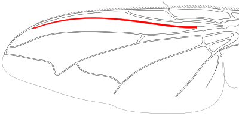

## Introduction  
The key to the European Tachinidae is based on the work of Tschorsnig and Herting (Tschorsnig and Herting 1994).   
Tschorsnig H. P., Herting B., 1994. Die Raupenfliegen (Diptera: Tachinidae) Mitteleuropas: Bestimmungstabellen und Angaben zur Verbreitung und Ökologie der einzelnen Arten. Stuttgarter Beiträge zur Naturkunde (A), 506:1-170.  
The original publication is available on [<u>archive.org</u>](https://archive.org/details/biostor-97167).  
Rotraud Rayner and Chris Raper translated the original publication from German to English. They kindly agreed to use their translation. The translation can be found at [<u>tachinidae.myspecies.info</u>](https://tachinidae.myspecies.info/sites/tachinidae.myspecies.info/files/Central%20European%20Key%20-%20plus%20figures.pdf).  
Adam Tofilski reformatted the translation and modified the terminology to be more consistent with the Manual of Palearctic Diptera (Papp and Darvas 2000). He also prepared a glossary with illustrations. He is responsible for all errors and inconsistencies in this document. If you find any errors or have suggestions for improving this document, [<u>please let me know</u>](mailto:adam.tofilski@drawwing.org).  
The key was prepared using DKey software (Tofilski 2018).  
Tofilski A., 2018. DKey software for editing and browsing dichotomous keys. ZooKeys 735: 131-140. [<u>https://doi.org/10.3897/zookeys.735.21412</u>](https://doi.org/10.3897/zookeys.735.21412)  
  
## Taxonomic key

[1]{#k1}

::: columns
::: column
Number of [postsutural intraalar setae](#g97): 3 (Fig. [84](#f84)) (if only 2 [postsutural intraalar setae](#g97) are present, their distance from each other is smaller or at most as great as the distance of the foremost [postsutural intraalar setae](#g97) to the [transverse suture](#g131) (Fig. [86](#f86))).   
[Eyes](#g31) or [prosternum](#g108): with or without hairs. - [2](#k2)
  
. Dorsal part of the thorax, lateral view (shown without hairs). Scale: 0.5 mm. (from Tschorsnig and Herting 1994, CC BY-NC 3.0)"){width="401" style="border:1px solid black;"}. Dorsal part of the thorax, lateral view (shown without hairs). Scale: 0.5 mm. (from Tschorsnig and Herting 1994, CC BY-NC 3.0)"){width="401" style="border:1px solid black;"}
:::
::: column
Number of [postsutural intraalar setae](#g97): 0, 1 (Fig. [87](#f87)) or 2 (if 2 [postsutural intraalar setae](#g97) are present, their distance from each other is greater than the distance of the foremost [postsutural intraalar setae](#g97) to the [transverse suture](#g131) (Fig. [88](#f88), [89](#f89))).   
[Eyes](#g31) and [prosternum](#g108): almost always without hairs (exceptions Angiorhina, Dufouria and Ancistrophora). - [314](#k314)
  
. Dorsal part of the thorax, lateral view (shown without hairs). Scale: 0.5 mm. (from Tschorsnig and Herting 1994, CC BY-NC 3.0)"){width="401" style="border:1px solid black;"}. Dorsal part of the thorax, lateral view (shown without hairs). Scale: 0.5 mm. (from Tschorsnig and Herting 1994, CC BY-NC 3.0)"){width="401" style="border:1px solid black;"}. Dorsal part of the thorax, lateral view (shown without hairs). Scale: 0.5 mm. (from Tschorsnig and Herting 1994, CC BY-NC 3.0)"){width="401" style="border:1px solid black;"}
:::
:::

[2(<a href="#k1">1</a>)]{#k2}

::: columns
::: column
[Arista](#g16) with hairs longer than the diameter of the [arista](#g16) base (Fig. [24](#f24), [28](#f28), [40](#f40), [46](#f46)). - [3](#k3)
  
. Head, lateral view. Scale: 0.5 mm. (from Tschorsnig and Herting 1994, CC BY-NC 3.0)"){height="401" style="border:1px solid black;"}. Head, lateral view. Scale: 0.5 mm. (from Tschorsnig and Herting 1994, CC BY-NC 3.0)"){height="401" style="border:1px solid black;"}. Left antenna, lateral view. Scale: 0.5 mm. (from Tschorsnig and Herting 1994, CC BY-NC 3.0)"){width="401" style="border:1px solid black;"}. Left antenna, lateral view. Scale: 0.5 mm. (from Tschorsnig and Herting 1994, CC BY-NC 3.0)"){width="401" style="border:1px solid black;"}
:::
::: column
[Arista](#g16) without hairs (Fig. [38](#f38)) or with hairs shorter than the diameter of the [arista](#g16) base (Fig. [43](#f43), [45](#f45), [49](#f49)). - [25](#k25)
  
. Left antenna, lateral view. Scale: 0.5 mm. (from Tschorsnig and Herting 1994, CC BY-NC 3.0)"){height="401" style="border:1px solid black;"}. Left antenna, lateral view. Scale: 0.5 mm. (from Tschorsnig and Herting 1994, CC BY-NC 3.0)"){width="401" style="border:1px solid black;"}. Left antenna, lateral view. Scale: 0.5 mm. (from Tschorsnig and Herting 1994, CC BY-NC 3.0)"){width="401" style="border:1px solid black;"}. Left antenna, lateral view. Scale: 0.5 mm. (from Tschorsnig and Herting 1994, CC BY-NC 3.0)"){width="401" style="border:1px solid black;"}
:::
:::

[3(<a href="#k2">2</a>)]{#k3}

::: columns
::: column
[Apical scutellar setae](#g13): absent or hairlike.   
[Prosternum](#g108): with hairs (Fig. [68](#f68), [69](#f69)).   
[Anterodorsal apical spur](#g12) of the [fore tibia](#g41) at most half as long as the [dorsal apical spur](#g27).   
[Abdomen](#g1) shiny black with 2 (females) or 3 (males) bands of white dusting.   
[Arista](#g16) with short hairs (Fig. [40](#f40)).  
Body length: 4 - 6 mm. - [Gastrolepta anthracina](#e242)
  
. Prosternum. Scale: 0.5 mm. (from Tschorsnig and Herting 1994, CC BY-NC 3.0)"){width="401" style="border:1px solid black;"}. Prosternum. Scale: 0.5 mm. (from Tschorsnig and Herting 1994, CC BY-NC 3.0)"){width="401" style="border:1px solid black;"}. Left antenna, lateral view. Scale: 0.5 mm. (from Tschorsnig and Herting 1994, CC BY-NC 3.0)"){width="401" style="border:1px solid black;"}
:::
::: column
[Apical scutellar setae](#g13): strong, crossed (Fig. [112](#f112), [113](#f113), [114](#f114)[115](#f115), [116](#f116), [117](#f117)).   
[Prosternum](#g108): without hairs. - [4](#k4)
  
 Scutellum and calypters, dorsal view (scutellum shown without hairs). (a = left calyptra and wing scales, lateral view). Scale: 0.5 mm. (from Tschorsnig and Herting 1994, CC BY-NC 3.0)"){width="401" style="border:1px solid black;"}. Scutellum and calypters, dorsal view (scutellum shown without hairs). Scale: 0.5 mm. (from Tschorsnig and Herting 1994, CC BY-NC 3.0)"){width="401" style="border:1px solid black;"}. Scutellum and calypters, dorsal view (scutellum shown without hairs). Scale: 0.5 mm. (from Tschorsnig and Herting 1994, CC BY-NC 3.0)"){width="401" style="border:1px solid black;"}. Scutellum and calypters, dorsal view (scutellum shown without hairs). Scale: 0.5 mm. (from Tschorsnig and Herting 1994, CC BY-NC 3.0)"){width="401" style="border:1px solid black;"}. Scutellum and calypters, dorsal view (scutellum shown without hairs). Scale: 0.5 mm. (from Tschorsnig and Herting 1994, CC BY-NC 3.0)"){width="401" style="border:1px solid black;"}. Scutellum and calypters, dorsal view (scutellum shown without hairs). Scale: 0.5 mm. (from Tschorsnig and Herting 1994, CC BY-NC 3.0)"){width="401" style="border:1px solid black;"}
:::
:::

[4(<a href="#k3">3</a>)]{#k4}

::: columns
::: column
Inside of [fore coxae](#g39) with prone hairs all over the surface.   
[Gena](#g47) very wide, without any [genal dilation](#g48);   
[Vibrissae](#g135) stand very high over the [oral margin](#g81), and the underlying setae simulate a further pair of crossed [vibrissae](#g135);   
[Parafacialia](#g85) with very fine hairs (Fig. [24](#f24)).   
Deflection of [wing vein M](#g142) with a long [appendix](#g15) (Fig. [133](#f133)).   
Body length: 9 - 14 mm. - [5](#k5)
  
. Head, lateral view. Scale: 0.5 mm. (from Tschorsnig and Herting 1994, CC BY-NC 3.0)"){height="401" style="border:1px solid black;"}. Right wing. Scale: 0.5 mm. (from Tschorsnig and Herting 1994, CC BY-NC 3.0)"){width="401" style="border:1px solid black;"}
:::
::: column
Other combination of characters. - [6](#k6)
:::
:::

[5(<a href="#k4">4</a>)]{#k5}

::: columns
::: column
Hairs on [parafacialia](#g85) yellow.   
[Legs](#g66) totally yellow.   
Number of [katepisternal setae](#g60): 3.   
Number of [postpronotal setae](#g94): 2 - 3.  
Number of [presutural acrostichal setae](#g100): 0.  
Number of [postsutural dorsocentral setae](#g96): 3.  
[Prealar seta](#g98) absent. - [Dexiosoma caninum](#e149)
:::
::: column
Hairs on [parafacialia](#g85) black.   
[Legs](#g66) black with yellow [tibia](#g130).   
Number of [katepisternal setae](#g60): 2.   
Number of [postpronotal setae](#g94): 4.  
Number of [presutural acrostichal setae](#g100): 3.  
Number of [postsutural dorsocentral setae](#g96): 4.  
Short [prealar seta](#g98) present. - [Microphthalma europaea](#e363)
:::
:::

[6(<a href="#k4">4</a>)]{#k6}

::: columns
::: column
Back of [head](#g50): with black hairs all the way down.   
[Abdomen](#g1) shiny black, at most with traces of dusting.   
[Eyes](#g31) with or without hairs. - [7](#k7)
:::
::: column
Back of [head](#g50): with pale hairs at lower end.   
[Abdomen](#g1) clearly dusted, at least in the shape of small bands on the anterior edge of [abdominal tergites](#g3).   
[Eyes](#g31) always without hairs. - [9](#k9)
:::
:::

[7(<a href="#k6">6</a>)]{#k7}

::: columns
::: column
Number of [postsutural intraalar setae](#g97): 3.   
[Anepimeral seta](#g8): present.   
[Eyes](#g31) with long hairs (hairs 2 - 4 times as long as the anterior [ocellus](#g79)).   
Body length: 6 - 7 mm. - [Macquartia pubiceps](#e341)
:::
::: column
Number of [postsutural intraalar setae](#g97): 2 (wide gap between the setae).  
[Anepimeral seta](#g8): absent.   
[Eyes](#g31) with short hairs (hairs scarcely longer than the diameter of the anterior [ocellus](#g79)) or without hairs.   
Body length: 3 - 6 mm. - [8](#k8)
:::
:::

[8(<a href="#k7">7</a>)]{#k8}

::: columns
::: column
[Palpi](#g84) black.   
[Eyes](#g31): with hairs.   
[Abdominal syntergite 1+2](#g2) with [marginal setae](#g68);   
[Abdominal tergite 3](#g4) and [abdominal tergite 4](#g5) with [discal setae](#g26).   
[Mid tibia](#g73) with 3 anterodorsal setae. - [Dufouria chalybeata](#e162)
:::
::: column
[Palpi](#g84) yellow.   
[Eyes](#g31): without hairs.   
[Abdominal syntergite 1+2](#g2) without [marginal setae](#g68).   
[Abdominal tergite 3](#g4) (and most often also [abdominal tergite 4](#g5)) without [discal setae](#g26).   
[Mid tibia](#g73) with 1 anterodorsal setae. - [Chetoptilia puella](#e120)
:::
:::

[9(<a href="#k6">6</a>)]{#k9}

::: columns
::: column
[Frontal setae](#g44) reach down at most to the base of the [scape](#g111) (Fig. [28](#f28), [29](#f29)).   
[Gena](#g47) almost as wide as the length of [antennae](#g11) or wider (Fig. [28](#f28), [29](#f29)). - [10](#k10)
  
. Head, lateral view. Scale: 0.5 mm. (from Tschorsnig and Herting 1994, CC BY-NC 3.0)"){height="401" style="border:1px solid black;"}. Head, lateral view. Scale: 0.5 mm. (from Tschorsnig and Herting 1994, CC BY-NC 3.0)"){height="401" style="border:1px solid black;"}
:::
::: column
[Frontal setae](#g44) reach down onto the [parafacialia](#g85) at least to the middle of the [pedicel](#g86) (Fig. [27](#f27)).   
[Gena](#g47) mostly much narrower than the length of the [antennae](#g11), only in *[Stomina tachinoides](#e534)* equally wide. - [22](#k22)
  
. Head, lateral view. Scale: 0.5 mm. (from Tschorsnig and Herting 1994, CC BY-NC 3.0)"){height="401" style="border:1px solid black;"}
:::
:::

[10(<a href="#k9">9</a>)]{#k10}

::: columns
::: column
[Proboscis](#g102) thin, much longer than the [head](#g50) (Fig. [28](#f28)). - [Prosena siberita](#e472)
  
. Head, lateral view. Scale: 0.5 mm. (from Tschorsnig and Herting 1994, CC BY-NC 3.0)"){height="401" style="border:1px solid black;"}
:::
::: column
[Proboscis](#g102) thicker, at most as long as the [head](#g50). - [11](#k11)
:::
:::

[11(<a href="#k10">10</a>)]{#k11}

::: columns
::: column
[Hind tibia](#g53) with 3 [dorsal apical spurs](#g27) (the middle one sometimes short).   
[First flagellomere](#g38) as long as [pedicel](#g86) or only a little longer. - [12](#k12)
:::
::: column
[Hind tibia](#g53) with 2 [dorsal apical spurs](#g27). - [13](#k13)
:::
:::

[12(<a href="#k11">11</a>)]{#k12}

::: columns
::: column
[Proepisternum](#g106) without hairs.   
[Costal spine](#g22) at least as long as [crossvein r-m](#g25).   
Deflection of [wing vein M](#g142) with a long [appendix](#g15), which is at least as long as [crossvein r-m](#g25) (Fig. [133](#f133)).   
[Syntergite 1+2](#g2): [middorsal depression](#g74) extends to posterior margin of the syntergite.   
[Abdominal tergite 3](#g4) and [abdominal tergite 4](#g5) with [discal setae](#g26).   
Males: [dorsal frons width](#g29) at most 0.85 times as large as [dorsal eye width](#g28). [Zeuxia] - [682](#k682)
  
. Right wing. Scale: 0.5 mm. (from Tschorsnig and Herting 1994, CC BY-NC 3.0)"){width="401" style="border:1px solid black;"}
:::
::: column
[Proepisternum](#g106) with hairs (Fig. [90](#f90)).   
No [costal spine](#g22).   
Deflection of [wing vein M](#g142) without or with only very short [appendix](#g15).   
[Syntergite 1+2](#g2): [middorsal depression](#g74) does not extend to posterior margin of the syntergite.   
[Abdominal tergite 3](#g4) and [abdominal tergite 4](#g5) without [discal setae](#g26).   
Males: [dorsal frons width](#g29) 1.2 times as large as [dorsal eye width](#g28), [frons](#g43) with [proclinate orbital setae](#g103). - [Villanovia villicornis](#e569)
  
. Front-left part of the thorax, lateral view. Scale: 0.5 mm. (from Tschorsnig and Herting 1994, CC BY-NC 3.0)"){height="401" style="border:1px solid black;"}
:::
:::

[13(<a href="#k11">11</a>)]{#k13}

::: columns
::: column
[Second costal section](#g115) with hairs on underside (similar to Fig. [144](#f144) on upper side).   
[Legs](#g66) yellow.   
[Syntergite 1+2](#g2): [middorsal depression](#g74) extends to posterior margin of the syntergite. [Dexia] - [14](#k14)
:::
::: column
[Second costal section](#g115) without hairs on underside.   
[Femora](#g34) black (if yellow, then [syntergite 1+2](#g2): [middorsal depression](#g74) does not extend to posterior margin of the syntergite.). - [15](#k15)
:::
:::

[14(<a href="#k13">13</a>)]{#k14}

::: columns
::: column
Number of [katepisternal setae](#g60): 3 - 4.   
The very fine hairs at the edge of the [calypters](#g20) is not longer than the diameter of the seam.   
[Abdomen](#g1) evenly dusted to the end.  
[Abdomen](#g1) in males with a yellow basic colour with one black central longitudinal stripe (often only shining through), in females dark brown. - [Dexia rustica](#e147)
:::
::: column
Number of [katepisternal setae](#g60): 2.   
[Calypters](#g20) at the outer edge with hairs that are 2 - 4x as long as the diameter of the seam.   
[Abdominal tergites](#g3) in males dusted to 1/2 - 5/6, in females to 1/4 - 3/4 of their length.   
[Abdomen](#g1) in males yellow with more or less black posterior edge of the tergites (especially 4 and 5), in females black. - [Dexia vacua](#e148)
:::
:::

[15(<a href="#k13">13</a>)]{#k15}

::: columns
::: column
[Proepisternum](#g106): without hairs.  
[Syntergite 1+2](#g2): [middorsal depression](#g74) extends to posterior margin of the syntergite.   
[Abdominal tergite 3](#g4) and [abdominal tergite 4](#g5) with [discal setae](#g26).   
The first two characters need to occur simultaneusly. [Estheria] - [393](#k393)
:::
::: column
[Proepisternum](#g106): with hairs (Fig. [90](#f90)), when rarely without hairs or almost without hairs, then [middorsal depression](#g74) of [syntergite 1+2](#g2) extends at most to the middle of the syntergite.   
[Abdominal tergite 3](#g4) and [abdominal tergite 4](#g5) without [discal setae](#g26) (at most with a few stronger hairs on the posterior edge in males). - [16](#k16)
  
. Front-left part of the thorax, lateral view. Scale: 0.5 mm. (from Tschorsnig and Herting 1994, CC BY-NC 3.0)"){height="401" style="border:1px solid black;"}
:::
:::

[16(<a href="#k15">15</a>)]{#k16}

::: columns
::: column
[Fronto-orbital plates](#g46) with dense hairs.   
[Fore tarsus](#g40) as long as [head](#g50) height or shorter.   
[Syntergite 1+2](#g2): [middorsal depression](#g74) extends to posterior margin of the syntergite.   
[Hind tibia](#g53) anterodorsal setae in males (and often also in females) with a regular comb of setae (Fig. [160](#f160)). [Billaea] - [17](#k17)
  
. Left hind tibia, viewed from behind. Scale: 0.5 mm. (from Tschorsnig and Herting 1994, CC BY-NC 3.0)"){height="401" style="border:1px solid black;"}
:::
::: column
[Fronto-orbital plates](#g46) without hairs or (rarely) with up to 20 small hairs on each side.   
[Fore tarsus](#g40) longer than the height of the [head](#g50).   
[Syntergite 1+2](#g2): [middorsal depression](#g74) often does not extend to posterior margin of the syntergite.   
[Hind tibia](#g53) anterodorsal setae in males and females with rather uneven setulae (Fig. [164](#f164)). [Dinera] - [363](#k363)
  
. Left hind tibia, viewed from behind. Scale: 0.5 mm. (from Tschorsnig and Herting 1994, CC BY-NC 3.0)"){height="401" style="border:1px solid black;"}
:::
:::

[17(<a href="#k16">16</a>)]{#k17}

::: columns
::: column
[Arista](#g16) with hairs at least as wide as the [first flagellomere](#g38) (Fig. [46](#f46)). - [18](#k18)
  
. Left antenna, lateral view. Scale: 0.5 mm. (from Tschorsnig and Herting 1994, CC BY-NC 3.0)"){width="401" style="border:1px solid black;"}
:::
::: column
[Arista](#g16) with hairs shorter than than width of the [first flagellomere](#g38) (Fig. [40](#f40)). - [19](#k19)
  
. Left antenna, lateral view. Scale: 0.5 mm. (from Tschorsnig and Herting 1994, CC BY-NC 3.0)"){width="401" style="border:1px solid black;"}
:::
:::

[18(<a href="#k17">17</a>)]{#k18}

::: columns
::: column
[Basicosta](#g19): black.   
[Abdominal tergite 3](#g4) and 4, viewed obliquely from behind, with 2 triangular spots, which often reach as far as the anterior edge of the tergites (Fig. [168](#f168)).   
Number of [katepisternal setae](#g60): 2.   
Females: anterodorsal comb of the [hind tibia](#g53) irregular, with several intermediary setae. - [Billaea triangulifera](#e54)
  
. Abdomen, dorsal view (shown without hairs). Scale: 0.5 mm. (from Tschorsnig and Herting 1994, CC BY-NC 3.0)"){height="401" style="border:1px solid black;"}
:::
::: column
[Basicosta](#g19): yellow.   
[Abdomen](#g1): without such patterning.   
Number of [katepisternal setae](#g60): 3.   
Females: anterodorsal comb of the [hind tibia](#g53) regular, at most with an intermediary seta. - [Billaea adelpha](#e49)
:::
:::

[19(<a href="#k17">17</a>)]{#k19}

::: columns
::: column
[Thorax](#g129) before the [transverse suture](#g131): with only 4 dark longitudinal stripes (the central stripe is absent).   
Facial keel at least as wide as the [first flagellomere](#g38).   
[Scutellum](#g112): often a little reddish transparent. - [Billaea pectinata](#e52)
:::
::: column
[Thorax](#g129) before the [transverse suture](#g131): with 5 dark longitudinal stripes.   
Facial keel much narrower than the [first flagellomere](#g38).   
[Scutellum](#g112): completely black. - [20](#k20)
:::
:::

[20(<a href="#k19">19</a>)]{#k20}

::: columns
::: column
[Abdominal syntergite 1+2](#g2): with 2 [marginal setae](#g68).   
Males: hairs of [abdominal tergite 3](#g4) in its central dorsal area half raised. - [Billaea irrorata](#e51)
:::
::: column
[Abdominal syntergite 1+2](#g2): without [marginal setae](#g68).   
Males: hairs of [abdominal tergite 3](#g4) everywhere prone. - [21](#k21)
:::
:::

[21(<a href="#k20">20</a>)]{#k21}

::: columns
::: column
Longest hairs of the [arista](#g16) about 3x as long as the diameter of the [arista](#g16) base.   
[Pedicel](#g86) black or brown.   
2 - 3 pairs [presutural acrostichal setae](#g100).   
Number of [katepisternal setae](#g60): 3.   
[Abdomen](#g1) evenly dusted, with iridescent spots. - [Billaea fortis](#e50)
:::
::: column
Longest hairs of the [arista](#g16) only little longer than the diameter of the [arista](#g16) base.   
[Pedicel](#g86) red.   
Usually 0 - 1 pair [presutural acrostichal setae](#g100).   
Number of [katepisternal setae](#g60): 2.   
[Abdominal tergite 3](#g4) and [abdominal tergite 4](#g5) with trapezoid dark spots. - [Billaea steini](#e53)
:::
:::

[22(<a href="#k9">9</a>)]{#k22}

::: columns
::: column
[Gena](#g47) nearly as broad as length of [antennae](#g11) (Fig. [27](#f27)).   
[Dorsal frons width](#g29) in males as wide as the [first flagellomere](#g38), in females roughly as large as [dorsal eye width](#g28).   
[Syntergite 1+2](#g2): [middorsal depression](#g74) extends to posterior margin of the syntergite.   
[Abdomen](#g1) with dense, yellowish-grey dusting (like the rest of the body) and with 2 indistinctly outlined, dark spots each on the posterior edge of [abdominal tergite 3](#g4) and [abdominal tergite 4](#g5). - [Stomina tachinoides](#e534)
  
. Head, lateral view. Scale: 0.5 mm. (from Tschorsnig and Herting 1994, CC BY-NC 3.0)"){height="401" style="border:1px solid black;"}
:::
::: column
[Gena](#g47) much narrower than the width of the [antennae](#g11).   
[Dorsal frons width](#g29) in males at least 2x as wide as the [first flagellomere](#g38), in females clearly narrower than one [eye](#g31).   
[Syntergite 1+2](#g2): [middorsal depression](#g74) does not extend to posterior margin of the syntergite.   
[Abdomen](#g1) shiny black or coloured partially red, with white bands of dusting on the anterior edge of the tergites. - [23](#k23)
:::
:::

[23(<a href="#k22">22</a>)]{#k23}

::: columns
::: column
[Parafacialia](#g85) with hairs to the lower edge of the [eye](#g31).   
[Wing vein R4+5](#g145): with 2 - 4 setulae on the base; [wing vein C](#g140) with a long seta at the base (Fig. [134](#f134)).   
[Abdomen](#g1) black, with narrow white bands on anterior edge of the tergites. - [Phyllomya volvulus](#e466)
  
. Scale: 0.5 mm. (from Tschorsnig and Herting 1994, CC BY-NC 3.0)"){width="401" style="border:1px solid black;"}
:::
::: column
[Parafacialia](#g85) without hairs.   
[Wing vein R4+5](#g145): with setulae extending at least half way between the base and [crossvein r-m](#g25); [wing vein C](#g140) on base without or with a much shorter seta (Fig. [133](#f133)).   
Sides of [abdomen](#g1) often partially coloured red. - [24](#k24)
  
. Right wing. Scale: 0.5 mm. (from Tschorsnig and Herting 1994, CC BY-NC 3.0)"){width="401" style="border:1px solid black;"}
:::
:::

[24(<a href="#k23">23</a>)]{#k24}

::: columns
::: column
[Thorax](#g129) with 2 black longitudinal stripes, about as wide as the space separating them (Fig. [62](#f62)).   
[Face](#g32) about as long as the [frons](#g43).   
[Ocellar setae](#g77) absent.   
Hairs of the [arista](#g16) scarcely longer than the [arista](#g16) base (Fig. [27](#f27)).   
[Abdomen](#g1) laterally compressed.   
[Costal spine](#g22) at least as long as [crossvein r-m](#g25).   
Deflection of [wing vein M](#g142) with a long [appendix](#g15) (Fig. [133](#f133)).   
[Wing vein R1](#g143): without hairs. - [Mintho rufiventris](#e365)
  
. Thorax before the transverse suture, viewed obliquely from behind and above (shown without hairs). Scale: 0.5 mm. (from Tschorsnig and Herting 1994, CC BY-NC 3.0)"){width="401" style="border:1px solid black;"}. Head, lateral view. Scale: 0.5 mm. (from Tschorsnig and Herting 1994, CC BY-NC 3.0)"){height="401" style="border:1px solid black;"}. Right wing. Scale: 0.5 mm. (from Tschorsnig and Herting 1994, CC BY-NC 3.0)"){width="401" style="border:1px solid black;"}
:::
::: column
[Thorax](#g129) before the [transverse suture](#g131) with the usual 4 stripes only (Fig. [60](#f60), [61](#f61)).   
[Face](#g32) shorter than [frons](#g43).   
[Ocellar setae](#g77) present.   
Hairs of the [arista](#g16) longer (Fig. [40](#f40)).   
[Abdomen](#g1) not laterally compressed.   
No [costal spine](#g22).   
Deflection of [wing vein M](#g142) without or with only a tiny [appendix](#g15).   
[Wing vein R1](#g143): with hairs for at least half its length. [Thelaira] - [657](#k657)
  
. Thorax before the transverse suture, viewed obliquely from behind and above (shown without hairs). Scale: 0.5 mm. (from Tschorsnig and Herting 1994, CC BY-NC 3.0)"){width="401" style="border:1px solid black;"}. Thorax before the transverse suture, viewed obliquely from behind and above (shown without hairs). Scale: 0.5 mm. (from Tschorsnig and Herting 1994, CC BY-NC 3.0)"){width="401" style="border:1px solid black;"}. Left antenna, lateral view. Scale: 0.5 mm. (from Tschorsnig and Herting 1994, CC BY-NC 3.0)"){width="401" style="border:1px solid black;"}
:::
:::

[25(<a href="#k2">2</a>)]{#k25}

::: columns
::: column
[Crossvein dm-cu](#g24) very slanted (Fig. [135](#f135)).   
Simultaneously with the following features: [wing vein R4+5](#g145): with setulae extending at least half way between the base and [crossvein r-m](#g25) (Fig. [135](#f135)); [dorsal frons width](#g29) larger than [dorsal eye width](#g28), back of the [head](#g50) totally covered with white hairs; [anterodorsal apical spur](#g12) of the [fore tibia](#g41) longer than the [dorsal apical spur](#g27); [parafacialia](#g85) almost always (exception: Hyleorus) with proclinate setae; Body length: 6 - 10 mm. - [26](#k26)
  
. Right wing. Scale: 0.5 mm. (from Tschorsnig and Herting 1994, CC BY-NC 3.0)"){width="401" style="border:1px solid black;"}
:::
::: column
[Crossvein dm-cu](#g24) not noticeably slanted, if exceptionally otherwise other combination of characters. - [34](#k34)
:::
:::

[26(<a href="#k25">25</a>)]{#k26}

::: columns
::: column
[Eyes](#g31): with hairs. - [27](#k27)
:::
::: column
[Eyes](#g31): without hairs. - [29](#k29)
:::
:::

[27(<a href="#k26">26</a>)]{#k27}

::: columns
::: column
[Parafacialia](#g85) without hairs, lower parts much narrower than [palpi](#g84).   
Setulae above the [vibrissa](#g135) rise up to the middle of the [facial ridges](#g33).   
[Frontal setae](#g44) (facing upwards and backwards!) reach down to the middle of the [facial ridges](#g33).   
[Wing vein R1](#g143): at least in its basal half with setulae. - [Hyleorus elatus](#e277)
:::
::: column
[Parafacialia](#g85) with hairs and (in the elongation of the [proclinate orbital setae](#g103)) with a row of setae curved downwards (Fig. [25](#f25)).   
Above the [vibrissa](#g135) there are only a few hairs in the lower 1/6 of the [facial ridges](#g33).   
The [frontal setae](#g44) reach at most to the end of the [pedicel](#g86).   
[Wing vein R1](#g143): without hairs. [Cyrtophleba] - [28](#k28)
  
. Head, lateral view. Scale: 0.5 mm. (from Tschorsnig and Herting 1994, CC BY-NC 3.0)"){height="401" style="border:1px solid black;"}
:::
:::

[28(<a href="#k27">27</a>)]{#k28}

::: columns
::: column
[Abdominal tergite 3](#g4) and [abdominal tergite 4](#g5) without [discal setae](#g26) (seldom a few weak [discal setae](#g26) at the posterior 1/3 of [abdominal tergite 4](#g5)).   
Abdominal hairs prone.   
[Ocellar setae](#g77) at the height of the anterior [ocellus](#g79).   
[Wing vein R4+5](#g145): with setulae extending to [crossvein r-m](#g25). - [Cyrtophleba ruricola](#e141)
:::
::: column
[Abdominal tergite 3](#g4) and [abdominal tergite 4](#g5) with strong [discal setae](#g26).   
Abdominal hairs upright.   
[Ocellar setae](#g77) behind the anterior [ocellus](#g79).   
[Wing vein R4+5](#g145): with setulae extending only 1/2 the distance between the base and [crossvein r-m](#g25). - [Cyrtophleba vernalis](#e142)
:::
:::

[29(<a href="#k26">26</a>)]{#k29}

::: columns
::: column
[Abdominal tergite 3](#g4) and [abdominal tergite 4](#g5) without [discal setae](#g26) (the central pair of [marginal setae](#g68) sometimes shifted a little towards the front).   
[Anepimeral seta](#g8) absent. - [30](#k30)
:::
::: column
[Abdominal tergite 3](#g4) and [abdominal tergite 4](#g5) with [discal setae](#g26). - [31](#k31)
:::
:::

[30(<a href="#k29">29</a>)]{#k30}

::: columns
::: column
[Wing vein R1](#g143): with setulae along its length.  
[Parafacialia](#g85) except for hairs only with one, strong, proclinate seta (Fig. [18](#f18)), above rarely 1-2 weaker setulae.   
[Prementum](#g99) at most 2x the length of its diameter.   
[Second aristomere](#g114) scarcely longer than its width. - [Voria ruralis](#e570)
  
. Head, lateral view. Scale: 0.5 mm. (from Tschorsnig and Herting 1994, CC BY-NC 3.0)"){height="401" style="border:1px solid black;"}
:::
::: column
[Wing vein R1](#g143): without hairs.   
[Parafacialia](#g85) apart from hairs with a row of setae of more or less equal length (Fig. [25](#f25)).   
[Prementum](#g99) 6 - 8x the length of its width.   
[Second aristomere](#g114) 4 – 5x as long as its width. - [Chaetovoria antennata](#e115)
  
. Head, lateral view. Scale: 0.5 mm. (from Tschorsnig and Herting 1994, CC BY-NC 3.0)"){height="401" style="border:1px solid black;"}
:::
:::

[31(<a href="#k29">29</a>)]{#k31}

::: columns
::: column
Strong [anepimeral seta](#g8) present.   
[Syntergite 1+2](#g2): [middorsal depression](#g74) extends to posterior margin of the syntergite.   
[Hind tibia](#g53) with 2 [dorsal apical spurs](#g27). [Athrycia] - [32](#k32)
:::
::: column
[Anepimeral seta](#g8) absent.   
[Syntergite 1+2](#g2): [middorsal depression](#g74) does not extend to posterior margin of the syntergite.   
[Hind tibia](#g53) with 3 [apical spurs](#g14). - [Klugia marginata](#e285)
:::
:::

[32(<a href="#k31">31</a>)]{#k32}

::: columns
::: column
[Arista](#g16) thickened to only about half its length.   
[Propleura](#g107) almost always with hairs.   
[Parafacialia](#g85) with 2 downward-curved setae, of which the lower one is longer.   
Upper side of the body with yellowish, on the [frons](#g43) often golden yellow dusting. - [Athrycia curvinervis](#e33)
:::
::: column
[Arista](#g16) thickened beyond half-length (especially in males).   
[Propleura](#g107) without hairs.   
[Parafacialia](#g85) as a rule with 3 or 4 downward-curved setae.   
Dusting grey. - [33](#k33)
:::
:::

[33(<a href="#k32">32</a>)]{#k33}

::: columns
::: column
The distance from the deflection of [wing vein M](#g142) to the posterior [wing](#g137) edge is 0.77 - 1.07x as long as the [postangular vein](#g88) (Fig. [135](#f135)).   
[Pedicel](#g86) usually black, seldom brownish or reddish-yellow. - [Athrycia trepida](#e35)
  
. Right wing. Scale: 0.5 mm. (from Tschorsnig and Herting 1994, CC BY-NC 3.0)"){width="401" style="border:1px solid black;"}
:::
::: column
The distance from the deflection of [wing vein M](#g142) to the posterior [wing](#g137) edge is 1.08 - 1.39x as long as the very steep [postangular vein](#g88) (Fig. [123](#f123)).   
[Pedicel](#g86) reddish-yellow. - [Athrycia impressa](#e34)
  
 Top third of right wing. (a = shortest distance between the deflection and the wing edge). Scale: 0.5 mm. (from Tschorsnig and Herting 1994, CC BY-NC 3.0)"){height="401" style="border:1px solid black;"}
:::
:::

[34(<a href="#k25">25</a>)]{#k34}

::: columns
::: column
[Wing vein M](#g142) not angled before [wing](#g137) margin (Fig. [129](#f129), [141](#f141)). - [35](#k35)
  
. Right wing. Scale: 0.5 mm. (from Tschorsnig and Herting 1994, CC BY-NC 3.0)"){width="401" style="border:1px solid black;"}. Right wing. Scale: 0.5 mm. (from Tschorsnig and Herting 1994, CC BY-NC 3.0)"){width="401" style="border:1px solid black;"}
:::
::: column
[Wing vein M](#g142) angled before [wing](#g137) margin. - [39](#k39)
:::
:::

[35(<a href="#k34">34</a>)]{#k35}

::: columns
::: column
[Crossvein dm-cu](#g24) absent (Fig. [129](#f129)).   
[Abdomen](#g1) shiny black without traces of dusting.   
[Eyes](#g31) with sparse hairs.   
Body length: 2.5 - 4.5 mm. [Phytomyptera] - [600](#k600)
  
. Right wing. Scale: 0.5 mm. (from Tschorsnig and Herting 1994, CC BY-NC 3.0)"){width="401" style="border:1px solid black;"}
:::
::: column
[Crossvein dm-cu](#g24) present.   
[Abdomen](#g1) dusted, at least at the anterior edge of [abdominal tergites](#g3).   
[Eyes](#g31) practically without hairs. - [36](#k36)
:::
:::

[36(<a href="#k35">35</a>)]{#k36}

::: columns
::: column
[Parafacialia](#g85) with hairs or setae.   
The [vibrissae](#g135) stand high above the [oral margin](#g81) (Fig. [24](#f24)).   
[Wing vein M](#g142), [wing vein CuA1](#g141) and [crossvein dm-cu](#g24) coloured much fainter than the remaining longitudinal veins.   
Body length: 3 - 5 mm. - [Melisoneura leucoptera](#e362)
  
. Head, lateral view. Scale: 0.5 mm. (from Tschorsnig and Herting 1994, CC BY-NC 3.0)"){height="401" style="border:1px solid black;"}
:::
::: column
[Parafacialia](#g85) without hairs.   
[Vibrissae](#g135) level with [oral margin](#g81).   
All longitudinal veins similarly sclerotized. - [37](#k37)
:::
:::

[37(<a href="#k36">36</a>)]{#k37}

::: columns
::: column
[Abdominal tergites](#g3) dusted densely and evenly to the posterior edge.   
[Legs](#g66) yellow. ([postangular vein](#g88) rarely present) - [Ocytata pallipes](#e388)
:::
::: column
Posterior edge of [abdominal tergites](#g3) without dusting, black.   
[Legs](#g66) black, [tibia](#g130) at most a little lighter. - [38](#k38)
:::
:::

[38(<a href="#k37">37</a>)]{#k38}

::: columns
::: column
[Wing vein R1](#g143), [wing vein R4+5](#g145) and [wing vein CuA1](#g141) with numerous setulae (Fig. [131](#f131)).   
[Abdominal tergite 3](#g4) and [abdominal tergite 4](#g5) without [discal setae](#g26), with a very narrow stripe of dusting, interrupted in the middle, at the anterior edge.   
Body length: 2.5 - 5 mm. - [Actia lamia](#e6)
  
. Right wing. Scale: 0.5 mm. (from Tschorsnig and Herting 1994, CC BY-NC 3.0)"){width="401" style="border:1px solid black;"}
:::
::: column
[Wing vein R4+5](#g145): with 2 - 3 setulae at the base, [wing vein R1](#g143) and [wing vein CuA1](#g141): without hairs.   
[Abdominal tergite 3](#g4) and [abdominal tergite 4](#g5) with [discal setae](#g26), the anterior 2/3 covered with variable dusting (viewed from differing angles).   
Body length: 6 - 7 mm. - [Demoticus amorphus](#e145)
:::
:::

[39(<a href="#k34">34</a>)]{#k39}

::: columns
::: column
[Wing cell r4+5](#g138): with a petiole (Fig. [125](#f125), [126](#f126), [136](#f136), [139](#f139)), petiole of [wing cell r4+5](#g138) is at least as long as the diameter of the [wing vein M](#g142) or [wing vein R4+5](#g145) (Fig. [124](#f124), [133](#f133)). (Species in which this characteristic may vary individually, are included in the two alternatives; in doubtful cases check this number first). - [40](#k40)
  
. Top third of right wing. Scale: 0.5 mm. (from Tschorsnig and Herting 1994, CC BY-NC 3.0)"){height="401" style="border:1px solid black;"}. Top third of right wing. Scale: 0.5 mm. (from Tschorsnig and Herting 1994, CC BY-NC 3.0)"){height="401" style="border:1px solid black;"}. Right wing. Scale: 0.5 mm. (from Tschorsnig and Herting 1994, CC BY-NC 3.0)"){width="401" style="border:1px solid black;"}. Right wing. Scale: 0.5 mm. (from Tschorsnig and Herting 1994, CC BY-NC 3.0)"){width="401" style="border:1px solid black;"}. Top third of right wing. Scale: 0.5 mm. (from Tschorsnig and Herting 1994, CC BY-NC 3.0)"){height="401" style="border:1px solid black;"}. Right wing. Scale: 0.5 mm. (from Tschorsnig and Herting 1994, CC BY-NC 3.0)"){width="401" style="border:1px solid black;"}
:::
::: column
[Wing cell r4+5](#g138): open (Fig. [118](#f118), [119](#f119), [120](#f120), [121](#f121), [122](#f122), [123](#f123)) or closed at the [wing](#g137) edge, in the latter case there is no recognizable petiole (Fig. [128](#f128), [132](#f132)). - [65](#k65)
  
. Right wing. Scale: 0.5 mm. (from Tschorsnig and Herting 1994, CC BY-NC 3.0)"){width="401" style="border:1px solid black;"}. Top third of right wing. Scale: 0.5 mm. (from Tschorsnig and Herting 1994, CC BY-NC 3.0)"){height="401" style="border:1px solid black;"}. Top third of right wing. Scale: 0.5 mm. (from Tschorsnig and Herting 1994, CC BY-NC 3.0)"){height="401" style="border:1px solid black;"}. Top third of right wing. Scale: 0.5 mm. (from Tschorsnig and Herting 1994, CC BY-NC 3.0)"){height="401" style="border:1px solid black;"}. Top third of right wing. Scale: 0.5 mm. (from Tschorsnig and Herting 1994, CC BY-NC 3.0)"){height="401" style="border:1px solid black;"} Top third of right wing. (a = shortest distance between the deflection and the wing edge). Scale: 0.5 mm. (from Tschorsnig and Herting 1994, CC BY-NC 3.0)"){height="401" style="border:1px solid black;"}. Right wing. Scale: 0.5 mm. (from Tschorsnig and Herting 1994, CC BY-NC 3.0)"){width="401" style="border:1px solid black;"}. Right wing. Scale: 0.5 mm. (from Tschorsnig and Herting 1994, CC BY-NC 3.0)"){width="401" style="border:1px solid black;"}
:::
:::

[40(<a href="#k39">39</a>)]{#k40}

::: columns
::: column
Simultaneously: [parafacialia](#g85) with hairs or setae to the lower part AND [wing vein R4+5](#g145): with setulae extending at least to [crossvein r-m](#g25) (Fig. [132](#f132)).   
[Eyes](#g31) always without hairs. - [41](#k41)
  
. Right wing. Scale: 0.5 mm. (from Tschorsnig and Herting 1994, CC BY-NC 3.0)"){width="401" style="border:1px solid black;"}
:::
::: column
Both features not present at the same time. - [45](#k45)
:::
:::

[41(<a href="#k40">40</a>)]{#k41}

::: columns
::: column
[Parafacialia](#g85) with hairs.   
Petiole of [wing cell r4+5](#g138): as long as diameter of the [wing](#g137) veins or scarcely longer (Fig. [124](#f124)). [Wing cell r4+5](#g138): seldom with longer petiole, see also couplet 66.  
[Abdomen](#g1) completely dusted in grey.   
[Legs](#g66) yellow.   
Body length: 4 - 5 mm.  - [Goniocera schistacea](#e252)
  
. Top third of right wing. Scale: 0.5 mm. (from Tschorsnig and Herting 1994, CC BY-NC 3.0)"){height="401" style="border:1px solid black;"}
:::
::: column
[Parafacialia](#g85) with proclinate setae (Fig. [25](#f25)).   
Petiole of [wing cell r4+5](#g138): considerably longer than diameter of the [wing](#g137) veins.   
[Abdomen](#g1) shiny black, rarely with a little dusting on the anterior edge of the tergites.   
[Legs](#g66) black. - [42](#k42)
  
. Head, lateral view. Scale: 0.5 mm. (from Tschorsnig and Herting 1994, CC BY-NC 3.0)"){height="401" style="border:1px solid black;"}
:::
:::

[42(<a href="#k41">41</a>)]{#k42}

::: columns
::: column
[Postpronotal lobe](#g93): with 3 basal setae almost in a straight line (Fig. [70](#f70)) or with only 2 setae (Fig. [81](#f81)); if a thin anterior seta is also present, it will stand before the line between middle and inner basal seta (Fig. [80](#f80)).   
[Outer vertical setae](#g83) at least half the length of [inner vertical setae](#g56). - [43](#k43)
  
. Left postpronotal lobe, dorsal view (shown without hairs). Scale: 0.5 mm. (from Tschorsnig and Herting 1994, CC BY-NC 3.0)"){width="401" style="border:1px solid black;"}. Left postpronotal lobe, dorsal view (shown without hairs). Scale: 0.5 mm. (from Tschorsnig and Herting 1994, CC BY-NC 3.0)"){height="401" style="border:1px solid black;"}. Left postpronotal lobe, dorsal view (shown without hairs). Scale: 0.5 mm. (from Tschorsnig and Herting 1994, CC BY-NC 3.0)"){width="401" style="border:1px solid black;"}
:::
::: column
[Postpronotal setae](#g94) arranged in a triangle (Fig. [79](#f79)) or with 3 basal setae in a line and a strong seta in front of the line between outer and middle basal seta (similar to Fig. [73](#f73), the anterior seta is further outwards).   
[Outer vertical setae](#g83) absent or at most half the length of [inner vertical setae](#g56). - [44](#k44)
  
. Left postpronotal lobe, dorsal view (shown without hairs). Scale: 0.5 mm. (from Tschorsnig and Herting 1994, CC BY-NC 3.0)"){width="401" style="border:1px solid black;"}
:::
:::

[43(<a href="#k42">42</a>)]{#k43}

::: columns
::: column
[First flagellomere](#g38) at most as long as [pedicel](#g86).   
Back of the [head](#g50) completely covered with black hairs.   
Males: [dorsal frons width](#g29) at most 0.4x as large as [dorsal eye width](#g28). [Kirbya] - [457](#k457)
:::
::: column
[First flagellomere](#g38) at least 2x as long as [pedicel](#g86).   
Back of the [head](#g50) totally or mostly covered with white hairs.   
Males: [dorsal frons width](#g29) almost as large as [dorsal eye width](#g28) or larger. [Wagneria] - [663](#k663)
:::
:::

[44(<a href="#k42">42</a>)]{#k44}

::: columns
::: column
[Scutellum](#g112) with 2 upright setae on the dorsal surface near to its anterior edge.   
[Outer vertical setae](#g83) present.   
[Abdominal tergite 3](#g4) and [abdominal tergite 4](#g5) as a rule without [discal setae](#g26), sometimes small [discal setae](#g26) on [abdominal tergite 4](#g5) present. - [Periscepsia carbonaria](#e419)
:::
::: column
[Scutellum](#g112) with at least 4 upright setulae on its dorsal surface.   
[Outer vertical setae](#g83) not differentiated from the [postocular setae](#g92).   
[Abdominal tergite 3](#g4) and [abdominal tergite 4](#g5) with strong [discal setae](#g26). [Ramonda] - [603](#k603)
:::
:::

[45(<a href="#k40">40</a>)]{#k45}

::: columns
::: column
[Apical scutellar setae](#g13) diverging (Fig. [105](#f105)), parallel or absent (Fig. [107](#f107)). - [46](#k46)
  
. Scutellum, dorsal view (shown without hairs). Scale: 0.5 mm. (from Tschorsnig and Herting 1994, CC BY-NC 3.0)"){height="401" style="border:1px solid black;"}. Scutellum, dorsal view (shown without hairs). Scale: 0.5 mm. (from Tschorsnig and Herting 1994, CC BY-NC 3.0)"){width="401" style="border:1px solid black;"}
:::
::: column
[Apical scutellar setae](#g13) crossed (Fig. [103](#f103), [112](#f112), [113](#f113), [114](#f114), [115](#f115), [116](#f116), [117](#f117)). - [49](#k49)
  
. Scutellum, dorsal view (shown without hairs). Scale: 0.5 mm. (from Tschorsnig and Herting 1994, CC BY-NC 3.0)"){height="401" style="border:1px solid black;"} Scutellum and calypters, dorsal view (scutellum shown without hairs). (a = left calyptra and wing scales, lateral view). Scale: 0.5 mm. (from Tschorsnig and Herting 1994, CC BY-NC 3.0)"){width="401" style="border:1px solid black;"}. Scutellum and calypters, dorsal view (scutellum shown without hairs). Scale: 0.5 mm. (from Tschorsnig and Herting 1994, CC BY-NC 3.0)"){width="401" style="border:1px solid black;"}. Scutellum and calypters, dorsal view (scutellum shown without hairs). Scale: 0.5 mm. (from Tschorsnig and Herting 1994, CC BY-NC 3.0)"){width="401" style="border:1px solid black;"}. Scutellum and calypters, dorsal view (scutellum shown without hairs). Scale: 0.5 mm. (from Tschorsnig and Herting 1994, CC BY-NC 3.0)"){width="401" style="border:1px solid black;"}. Scutellum and calypters, dorsal view (scutellum shown without hairs). Scale: 0.5 mm. (from Tschorsnig and Herting 1994, CC BY-NC 3.0)"){width="401" style="border:1px solid black;"}. Scutellum and calypters, dorsal view (scutellum shown without hairs). Scale: 0.5 mm. (from Tschorsnig and Herting 1994, CC BY-NC 3.0)"){width="401" style="border:1px solid black;"}
:::
:::

[46(<a href="#k45">45</a>)]{#k46}

::: columns
::: column
[Prealar setae](#g98) longer and stronger than the anterior [postsutural intraalar setae](#g97) (Fig. [1](#f1), [2](#f2)).   
Deflection of [wing vein M](#g142) angled, mostly with a shadow fold (Fig. [127](#f127)).   
Setae rise above the [vibrissa](#g135) at least to the middle of the [facial ridges](#g33) (Fig. [7](#f7), [8](#f8)). - [47](#k47)
  
 (without wings and legs, only hairs on the head shown), dorsal view. Scale: 0.5 mm. (from Tschorsnig and Herting 1994, CC BY-NC 3.0)"){height="401" style="border:1px solid black;"} (without wings and legs, only hairs on the head shown), lateral view. Scale: 0.5 mm. (from Tschorsnig and Herting 1994, CC BY-NC 3.0)"){height="401" style="border:1px solid black;"}. Right wing. Scale: 0.5 mm. (from Tschorsnig and Herting 1994, CC BY-NC 3.0)"){width="401" style="border:1px solid black;"}. Head, lateral view. Scale: 0.5 mm. (from Tschorsnig and Herting 1994, CC BY-NC 3.0)"){height="401" style="border:1px solid black;"}. Head, lateral view. Scale: 0.5 mm. (from Tschorsnig and Herting 1994, CC BY-NC 3.0)"){height="401" style="border:1px solid black;"}
:::
::: column
[Prealar setae](#g98) weaker than the anterior [postsutural intraalar setae](#g97) (Fig. [82](#f82)) or at most equally strong.   
Deflection of [wing vein M](#g142) always rounded, without a shadow fold. - [215](#k215)
  
. Dorsal part of the thorax, lateral view (shown without hairs). Scale: 0.5 mm. (from Tschorsnig and Herting 1994, CC BY-NC 3.0)"){width="401" style="border:1px solid black;"}
:::
:::

[47(<a href="#k46">46</a>)]{#k47}

::: columns
::: column
[Parafacialia](#g85) with hairs or setae.   
[Abdomen](#g1) covered with grey dusting which changes at differing viewing angles, exhibiting black iridescent spots.   
Body length: 6 - 11 mm. - [48](#k48)
:::
::: column
[Parafacialia](#g85) without hairs.   
[Abdomen](#g1) shiny black, with at most a trace of diffuse dusting on the anterior edge of the tergites.   
Body length: 3 - 4 mm. - [Erynnia ocypterata](#e200)
:::
:::

[48(<a href="#k47">47</a>)]{#k48}

::: columns
::: column
[Arista](#g16) thickened almost to the end (Fig. [8](#f8)).   
[Parafacialia](#g85) almost as wide as the minimum [eye](#g31) diameter.   
[Syntergite 1+2](#g2): [middorsal depression](#g74) does not extend to posterior margin of the syntergite. ([Wing cell r4+5](#g138): sometimes with petiole, see also couplet 111) - [Baumhaueria goniaeformis](#e39)
  
. Head, lateral view. Scale: 0.5 mm. (from Tschorsnig and Herting 1994, CC BY-NC 3.0)"){height="401" style="border:1px solid black;"}
:::
::: column
[Arista](#g16) thickened at most to the middle.   
[Parafacialia](#g85) much narrower.   
[Syntergite 1+2](#g2): [middorsal depression](#g74) extends to posterior margin of the syntergite. [Gaedia] - [427](#k427)
:::
:::

[49(<a href="#k45">45</a>)]{#k49}

::: columns
::: column
[Subapical scutellar setae](#g118) reach backwards at least as far as do the [apical scutellar setae](#g13); they are longer and stronger than the [apical scutellar setae](#g13) (Fig. [100](#f100), [103](#f103), [112](#f112), [114](#f114)). - [50](#k50)
  
. Scutellum, dorsal view (shown without hairs). Scale: 0.5 mm. (from Tschorsnig and Herting 1994, CC BY-NC 3.0)"){height="401" style="border:1px solid black;"}. Scutellum, dorsal view (shown without hairs). Scale: 0.5 mm. (from Tschorsnig and Herting 1994, CC BY-NC 3.0)"){height="401" style="border:1px solid black;"} Scutellum and calypters, dorsal view (scutellum shown without hairs). (a = left calyptra and wing scales, lateral view). Scale: 0.5 mm. (from Tschorsnig and Herting 1994, CC BY-NC 3.0)"){width="401" style="border:1px solid black;"}. Scutellum and calypters, dorsal view (scutellum shown without hairs). Scale: 0.5 mm. (from Tschorsnig and Herting 1994, CC BY-NC 3.0)"){width="401" style="border:1px solid black;"}
:::
::: column
[Subapical scutellar setae](#g118) do not reach backwards as far as the [apical scutellar setae](#g13); they are weaker than the [apical scutellar setae](#g13) (Fig. [108](#f108)) or at most equally long and strong.   
Body length: 2 - 5 mm (only the species of the rare north European Angiorhina are larger). - [59](#k59)
  
. Scutellum, dorsal view (shown without hairs). Scale: 0.5 mm. (from Tschorsnig and Herting 1994, CC BY-NC 3.0)"){height="401" style="border:1px solid black;"}
:::
:::

[50(<a href="#k49">49</a>)]{#k50}

::: columns
::: column
Above the [vibrissa](#g135) a row of setae rises to at least the upper 1/3 of the [facial ridges](#g33) (Fig. [6](#f6), [8](#f8)).   
[Eyes](#g31): with hairs.   
[Apical scutellar setae](#g13) upright (Fig. [110](#f110), [111](#f111)). [Chetogena] - [207](#k207)
  
. Head, lateral view. Scale: 0.5 mm. (from Tschorsnig and Herting 1994, CC BY-NC 3.0)"){height="401" style="border:1px solid black;"}. Head, lateral view. Scale: 0.5 mm. (from Tschorsnig and Herting 1994, CC BY-NC 3.0)"){height="401" style="border:1px solid black;"}. Scutellum, lateral view (shown without hairs). Scale: 0.5 mm. (from Tschorsnig and Herting 1994, CC BY-NC 3.0)"){width="401" style="border:1px solid black;"}. Scutellum, lateral view (shown without hairs). Scale: 0.5 mm. (from Tschorsnig and Herting 1994, CC BY-NC 3.0)"){width="401" style="border:1px solid black;"}
:::
::: column
Above the [vibrissa](#g135) only a few hairs or fine setulae that do not reach beyond the middle of the [facial ridges](#g33). - [51](#k51)
:::
:::

[51(<a href="#k50">50</a>)]{#k51}

::: columns
::: column
[Thorax](#g129) with 2 wide black longitudinal stripes, separated by an equally wide, dusted space (Fig. [62](#f62)).   
[Wing vein R4+5](#g145): with setulae extending more than 1/2 the distance between the base and [crossvein r-m](#g25) (Fig. [133](#f133)).   
Sides of [abdomen](#g1) often more or less coloured red.   
[Eyes](#g31): without hairs. - [52](#k52)
  
. Thorax before the transverse suture, viewed obliquely from behind and above (shown without hairs). Scale: 0.5 mm. (from Tschorsnig and Herting 1994, CC BY-NC 3.0)"){width="401" style="border:1px solid black;"}. Right wing. Scale: 0.5 mm. (from Tschorsnig and Herting 1994, CC BY-NC 3.0)"){width="401" style="border:1px solid black;"}
:::
::: column
[Thorax](#g129) not marked in this way.   
[Wing vein R4+5](#g145): with setulae extending at most up to 1/2 the distance between the base and [crossvein r-m](#g25). - [53](#k53)
:::
:::

[52(<a href="#k51">51</a>)]{#k52}

::: columns
::: column
[Ocellar setae](#g77) absent.   
Deflection of [wing vein M](#g142) with a long [appendix](#g15).   
Petiole of [wing cell r4+5](#g138): very short (Fig. [133](#f133)).   
[Abdomen](#g1) laterally compressed. - [Mintho rufiventris](#e365)
  
. Right wing. Scale: 0.5 mm. (from Tschorsnig and Herting 1994, CC BY-NC 3.0)"){width="401" style="border:1px solid black;"}
:::
::: column
[Ocellar setae](#g77) present.   
Deflection of [wing vein M](#g142) without [appendix](#g15).   
Petiole of [wing cell r4+5](#g138): about as long as the [postangular vein](#g88).   
[Abdomen](#g1) not laterally compressed. - [Minthodes picta](#e366)
:::
:::

[53(<a href="#k51">51</a>)]{#k53}

::: columns
::: column
[Abdomen](#g1) coloured red or yellow at least on the sides.   
[Eyes](#g31) always with hairs. - [54](#k54)
:::
::: column
[Abdomen](#g1) black, with or without dusting.   
[Eyes](#g31): without hairs or with hairs. - [55](#k55)
:::
:::

[54(<a href="#k53">53</a>)]{#k54}

::: columns
::: column
[Lateral scutellar setae](#g65) absent (Fig. [117](#f117)) or hair-like.   
[Costal spine](#g22) strong (at least as long as [crossvein r-m](#g25)).   
[Oral margin](#g81) pulled forwards, visible from the side.   
[Gena](#g47) much narrower than the minimum [eye](#g31) diameter.   
[First flagellomere](#g38) about as long as [pedicel](#g86).   
[Calypters](#g20) white.   
[Legs](#g66) black. - [Eriothrix rufomaculatus](#e188)
  
. Scutellum and calypters, dorsal view (scutellum shown without hairs). Scale: 0.5 mm. (from Tschorsnig and Herting 1994, CC BY-NC 3.0)"){width="401" style="border:1px solid black;"}
:::
::: column
[Lateral scutellar setae](#g65) as long as the other scutellar setae.   
No [costal spine](#g22).   
[Oral margin](#g81) not visible from the side.   
[Gena](#g47) almost as wide as the minimum [eye](#g31) diameter.   
[First flagellomere](#g38) at least 1.5x the length of [pedicel](#g86).   
[Calypters](#g20) yellowish.   
At least the [tibia](#g130) yellow. ([Wing cell r4+5](#g138): only rarely with petiole, see also couplet 157) [Hyalurgus] - [451](#k451)
:::
:::

[55(<a href="#k53">53</a>)]{#k55}

::: columns
::: column
[Abdominal tergite 3](#g4) and [abdominal tergite 4](#g5) with a narrow band of grey dusting at the anterior edge.   
Hairs on [prosternum](#g108): present.   
[Anterodorsal apical spur](#g12) of the [fore tibia](#g41) a little shorter than the [dorsal apical spur](#g27).   
[Eyes](#g31): with hairs. - [Tryphera lugubris](#e566)
:::
::: column
[Abdomen](#g1) totally black or with light dusting, reaching to the posterior edge of the tergites.   
Hairs on [prosternum](#g108): absent.   
[Anterodorsal apical spur](#g12) of the [fore tibia](#g41) at least as long and strong as the [dorsal apical spur](#g27). - [56](#k56)
:::
:::

[56(<a href="#k55">55</a>)]{#k56}

::: columns
::: column
[Frontal setae](#g44) extend down to the base of the [arista](#g16) or further.   
Setulae or hairs above the [vibrissa](#g135) rise almost to the height of the lowest [frontal seta](#g44).   
[Abdomen](#g1) completely covered with dusting which exhibits changing iridescent spots depending on the incidence of light.   
[Eyes](#g31) densely haired. ([Wing cell r4+5](#g138): rarely with petiole, see also couplet 153) - [Lypha dubia](#e333)
:::
::: column
[Frontal setae](#g44) on the [parafacialia](#g85) reach at most the end of the [pedicel](#g86).   
Only a few hairs above the [vibrissa](#g135).   
[Abdomen](#g1) shiny black all over or with light dusting without noticeable iridescent spots. - [57](#k57)
:::
:::

[57(<a href="#k56">56</a>)]{#k57}

::: columns
::: column
No [anepimeral seta](#g8). 2 widely spaced [postsutural intraalar setae](#g97).   
[First flagellomere](#g38) 1.5 - 2x as long as [pedicel](#g86).   
Petiole of [wing cell r4+5](#g138): very short (Fig. [124](#f124)).   
[Abdomen](#g1) often with bluish shine. ([Wing cell r4+5](#g138): seldom with petiole, see also couplet 318) - [Dufouria nigrita](#e163)
  
. Top third of right wing. Scale: 0.5 mm. (from Tschorsnig and Herting 1994, CC BY-NC 3.0)"){height="401" style="border:1px solid black;"}
:::
::: column
[Anepimeral seta](#g8) present, at least 1.5x as long as the surrounding hairs. 3 [postsutural intraalar setae](#g97).   
[First flagellomere](#g38) about as long as [pedicel](#g86). - [58](#k58)
:::
:::

[58(<a href="#k57">57</a>)]{#k58}

::: columns
::: column
Back of the [head](#g50) totally covered with black hairs.   
[Abdominal tergite 3](#g4) and [abdominal tergite 4](#g5) as well as the anterior edge of [abdominal tergite 5](#g6) dusted grey.   
[Apical scutellar setae](#g13) upright.   
[Parafacialia](#g85) with hairs.   
Petiole of [wing cell r4+5](#g138): at least as long as 1/2 of the [postangular vein](#g88).   
[Eyes](#g31): with hairs.   
Body length: 6 - 8 mm. - [Sarromyia nubigena](#e497)
:::
::: column
Back of the [head](#g50) with light hairs at least on the lower [oral margin](#g81).   
[Abdomen](#g1) frequently shiny black, rarely lightly dusted.   
[Apical scutellar setae](#g13) horizontal.   
[Parafacialia](#g85) without hairs or with hairs.   
Body length: 3 - 6 mm. [Loewia] - [490](#k490)
:::
:::

[59(<a href="#k49">49</a>)]{#k59}

::: columns
::: column
The thickened part of all three [aristomeres](#g17) of similar length (Fig. [44](#f44)).   
[Syntergite 1+2](#g2): [middorsal depression](#g74) extends to posterior margin of the syntergite.   
[Parafacialia](#g85) with hairs on their upper 1/3. - [Trichactia pictiventris](#e561)
  
. Left antenna, lateral view. Scale: 0.5 mm. (from Tschorsnig and Herting 1994, CC BY-NC 3.0)"){height="401" style="border:1px solid black;"}
:::
::: column
[First aristomere](#g36) and [second aristomere](#g114) considerably shorter than the [third aristomere](#g127).   
[Syntergite 1+2](#g2): [middorsal depression](#g74) does not extend to posterior margin of the syntergite. - [60](#k60)
:::
:::

[60(<a href="#k59">59</a>)]{#k60}

::: columns
::: column
[Eyes](#g31): with hairs.  
[Parafacialia](#g85) with hairs or setae.   
Petiole of [wing cell r4+5](#g138): very short.   
Body length: 7 - 8 mm. [Angiorhina] - [316](#k316)
:::
::: column
[Eyes](#g31): without hairs or practically without hairs.   
[Parafacialia](#g85) without hairs (with the exception of the alpine [Graphogaster dispar](#e256), whose petiole of [wing cell r4+5](#g138) is at least as long as 1/2 the [postangular vein](#g88)).   
Body length: 2 - 5 mm. - [61](#k61)
:::
:::

[61(<a href="#k60">60</a>)]{#k61}

::: columns
::: column
[Anepimeral seta](#g8) present.   
3 [postsutural intraalar setae](#g97) (the foremost of the 3 [intraalar setae](#g58) is sometimes short and shifted a little inwards).   
[Postabdomen](#g87) of females without specific features. - [62](#k62)
:::
::: column
[Anepimeral seta](#g8) absent.   
2 [postsutural intraalar setae](#g97) (only in the rare Pandelleia with predominantly yellow [abdomen](#g1) sometimes 3 [intraalar setae](#g58)).   
[Postabdomen](#g87) of females in the shape of a tube, which cannot or only partially be retracted into the [abdomen](#g1) (Fig. [222](#f222), [223](#f223), [224](#f224)).   
Hairs on [prosternum](#g108): absent.   
[Dorsal frons width](#g29) in males at most as wide as the [first flagellomere](#g38), in females at least as large as [dorsal eye width](#g28). - [63](#k63)
  
. Abdominal tergite 5 and postabdomen, lateral view (shown without setae or hairs). Scale: 0.5 mm. (from Tschorsnig and Herting 1994, CC BY-NC 3.0)"){height="401" style="border:1px solid black;"}. Abdominal tergite 5 and postabdomen, lateral view (shown without setae or hairs). Scale: 0.5 mm. (from Tschorsnig and Herting 1994, CC BY-NC 3.0)"){height="401" style="border:1px solid black;"}. Abdominal tergite 5 and postabdomen, lateral view (shown without setae or hairs). Scale: 0.5 mm. (from Tschorsnig and Herting 1994, CC BY-NC 3.0)"){height="401" style="border:1px solid black;"}
:::
:::

[62(<a href="#k61">61</a>)]{#k62}

::: columns
::: column
[Prosternum](#g108) without hairs.   
[Abdomen](#g1) without dusting, shiny black.   
[First flagellomere](#g38) 2 - 4x as long as [pedicel](#g86).   
[Face](#g32) deeply hollowed.   
The setulae or hairs above the [vibrissa](#g135) rise at least to the middle of the [facial ridges](#g33).   
Petiole of [wing cell r4+5](#g138): very short (Fig. [124](#f124)).   
[Dorsal frons width](#g29) in both sexes larger than [dorsal eye width](#g28). ([Wing cell r4+5](#g138): only rarely with petiole, see also couplet 103) - [Synactia parvula](#e539)
  
. Top third of right wing. Scale: 0.5 mm. (from Tschorsnig and Herting 1994, CC BY-NC 3.0)"){height="401" style="border:1px solid black;"}
:::
::: column
[Prosternum](#g108) with hairs.   
[Abdomen](#g1) densely dusted, at least around the base of setae with dark spots.   
[First flagellomere](#g38) as long as [pedicel](#g86) or scarcely longer.   
[Face](#g32) at most insignificantly hollowed.   
Hairlets above the [vibrissa](#g135) at most in the lower 1/3 of the [facial ridges](#g33).   
Petiole of [wing cell r4+5](#g138): at least as long as 1/2 the [postangular vein](#g88).   
[Dorsal frons width](#g29) in males line-shaped narrow, in females at least as large as [dorsal eye width](#g28). [Graphogaster] - [435](#k435)
:::
:::

[63(<a href="#k61">61</a>)]{#k63}

::: columns
::: column
[Scutellum](#g112), [abdomen](#g1) and [legs](#g66) predominantly yellow ([tarsi](#g125) often black).   
On each of the posterior edges of [abdominal tergites](#g3) 2 - 4, a pair of round black spots present (Fig. [170](#f170)).   
Females: ovipositor (segment 6) very long, folded forwards under the [abdomen](#g1) (Fig. [222](#f222)). - [Pandelleia otiorrhynchi](#e403)
  
. Abdomen, dorsal view. Scale: 0.5 mm. (from Tschorsnig and Herting 1994, CC BY-NC 3.0)"){height="401" style="border:1px solid black;"}. Abdominal tergite 5 and postabdomen, lateral view (shown without setae or hairs). Scale: 0.5 mm. (from Tschorsnig and Herting 1994, CC BY-NC 3.0)"){height="401" style="border:1px solid black;"}
:::
::: column
[Scutellum](#g112) black.   
[Abdomen](#g1) mostly black; when yellow, at least a wide band on the posterior edge of the tergites remains black.   
At least [femora](#g34) dark at the tip.   
[Abdomen](#g1) without markedly paired spots.   
Ovipositor of females different (Fig. [223](#f223), [224](#f224)). - [64](#k64)
  
. Abdominal tergite 5 and postabdomen, lateral view (shown without setae or hairs). Scale: 0.5 mm. (from Tschorsnig and Herting 1994, CC BY-NC 3.0)"){height="401" style="border:1px solid black;"}. Abdominal tergite 5 and postabdomen, lateral view (shown without setae or hairs). Scale: 0.5 mm. (from Tschorsnig and Herting 1994, CC BY-NC 3.0)"){height="401" style="border:1px solid black;"}
:::
:::

[64(<a href="#k63">63</a>)]{#k64}

::: columns
::: column
[Abdominal tergite 5](#g6) at most as long as [abdominal tergite 4](#g5).   
[Hind tibia](#g53) with 3 [dorsal apical spurs](#g27).   
[Abdominal tergites](#g3) 3 - 5 with grey dusting at the anterior edge which widens towards the sides and is more or less interrupted in the middle of the black zone.   
Back of the [head](#g50) covered totally with black hairs in both sexes.   
Females: ovipositor folded forwards, apically with a beaklike formation (Fig. [223](#f223)); [antennae](#g11) and [palpi](#g84) orange-yellow, in marked contrast to the rest of the body . - [Microsoma exiguum](#e364)
  
. Abdominal tergite 5 and postabdomen, lateral view (shown without setae or hairs). Scale: 0.5 mm. (from Tschorsnig and Herting 1994, CC BY-NC 3.0)"){height="401" style="border:1px solid black;"}
:::
::: column
[Abdominal tergite 5](#g6) longer than [abdominal tergite 4](#g5).   
[Hind tibia](#g53) with 2 [dorsal apical spurs](#g27).   
[Abdomen](#g1) marked differently.   
Back of the [head](#g50) in males with black hairs, in females with whitish-yellow hairs on the lower half.   
Females: the basal part of the telescope-like ovipositor cannot be fully retracted; it points up or downwards (Fig. [224](#f224)). (without cucullata). [Rondania] - [610](#k610)
  
. Abdominal tergite 5 and postabdomen, lateral view (shown without setae or hairs). Scale: 0.5 mm. (from Tschorsnig and Herting 1994, CC BY-NC 3.0)"){height="401" style="border:1px solid black;"}
:::
:::

[65(<a href="#k39">39</a>)]{#k65}

::: columns
::: column
Simultaneously the following features: [subapical scutellar setae](#g118) convergent.   
[Apical scutellar setae](#g13) small or absent (Fig. [103](#f103)); [Wing vein R4+5](#g145): with setulae extending at least to [crossvein r-m](#g25) (Fig. [131](#f131), [132](#f132)); [Syntergite 1+2](#g2): [middorsal depression](#g74) extends at most to the middle of the syntergite.   
Hairs on [prosternum](#g108): present (if haris on [prosternum](#g108) absent, then [proboscis](#g102) is very long and jointed as in Fig. [19](#f19)); [Eyes](#g31): without hairs; [frons](#g43) in males and females wide and with 2 [proclinate orbital setae](#g103); Body length: 2 - 6 mm. - [66](#k66)
  
. Scutellum, dorsal view (shown without hairs). Scale: 0.5 mm. (from Tschorsnig and Herting 1994, CC BY-NC 3.0)"){height="401" style="border:1px solid black;"}. Right wing. Scale: 0.5 mm. (from Tschorsnig and Herting 1994, CC BY-NC 3.0)"){width="401" style="border:1px solid black;"}. Right wing. Scale: 0.5 mm. (from Tschorsnig and Herting 1994, CC BY-NC 3.0)"){width="401" style="border:1px solid black;"}
:::
::: column
Other combination of characters. - [93](#k93)
:::
:::

[66(<a href="#k65">65</a>)]{#k66}

::: columns
::: column
[Mid tibia](#g73) with a row of anterodorsal setae.   
[Abdominal tergite 3](#g4) and [abdominal tergite 4](#g5) with or without [discal setae](#g26).   
[Wing vein A1+CuA2](#g139) does not reach to the posterior edge of the [wing](#g137) (Fig. [131](#f131)). [Goniocera] - [689](#k689)
  
. Right wing. Scale: 0.5 mm. (from Tschorsnig and Herting 1994, CC BY-NC 3.0)"){width="401" style="border:1px solid black;"}
:::
::: column
[Mid tibia](#g73) with one anterodorsal setae only.   
[Abdominal tergite 3](#g4) and [abdominal tergite 4](#g5) always without [discal setae](#g26). - [67](#k67)
:::
:::

[67(<a href="#k66">66</a>)]{#k67}

::: columns
::: column
[Anterodorsal apical spur](#g12) of the [fore tibia](#g41) at least as long and strong as the [dorsal apical spur](#g27) (Fig. [149](#f149)).   
[First aristomere](#g36) 1.5 - 4x as long as its diameter. [Entomophaga] - [376](#k376)
  
. Left fore tibia, dorsal view. Scale: 0.5 mm. (from Tschorsnig and Herting 1994, CC BY-NC 3.0)"){height="401" style="border:1px solid black;"}
:::
::: column
[Anterodorsal apical spur](#g12) much shorter and weaker than the [dorsal apical spur](#g27) (Fig. [148](#f148)).   
[First aristomere](#g36) at most as long as its diameter. - [68](#k68)
  
. Left fore tibia, dorsal view. Scale: 0.5 mm. (from Tschorsnig and Herting 1994, CC BY-NC 3.0)"){height="401" style="border:1px solid black;"}
:::
:::

[68(<a href="#k67">67</a>)]{#k68}

::: columns
::: column
Two [proepimeral setae](#g104), one curved upwards, one downwards (Fig. [91](#f91)). [Peribaea] - [562](#k562)
  
. Front-left part of the thorax, lateral view. Scale: 0.5 mm. (from Tschorsnig and Herting 1994, CC BY-NC 3.0)"){height="401" style="border:1px solid black;"}
:::
::: column
No [proepimeral seta](#g104) curved downwards. - [69](#k69)
:::
:::

[69(<a href="#k68">68</a>)]{#k69}

::: columns
::: column
[Wing vein A1+CuA2](#g139) does not reach the [wing](#g137) edge (Fig. [131](#f131)).   
Lower [katepisternal setae](#g60) shorter than the anterior (Fig. [96](#f96)).   
[Proboscis](#g102) never elongated and geniculate (as in Fig. [19](#f19)). - [70](#k70)
  
. Right wing. Scale: 0.5 mm. (from Tschorsnig and Herting 1994, CC BY-NC 3.0)"){width="401" style="border:1px solid black;"}. Katepisternum. Scale: 0.5 mm. (from Tschorsnig and Herting 1994, CC BY-NC 3.0)"){height="401" style="border:1px solid black;"}
:::
::: column
[Wing vein A1+CuA2](#g139) reaches the [wing](#g137) edge at least weakly (Fig. [132](#f132)).   
Lower [katepisternal setae](#g60) at least as long and strong as the anterior, most often stronger (Fig. [95](#f95)). - [83](#k83)
  
. Right wing. Scale: 0.5 mm. (from Tschorsnig and Herting 1994, CC BY-NC 3.0)"){width="401" style="border:1px solid black;"}. Katepisternum. Scale: 0.5 mm. (from Tschorsnig and Herting 1994, CC BY-NC 3.0)"){height="401" style="border:1px solid black;"}
:::
:::

[70(<a href="#k69">69</a>)]{#k70}

::: columns
::: column
[Katepisternum](#g61) with a row of little setulae or hairs under the [katepisternal setae](#g60) in front of the middle [coxae](#g23) (Fig. [96](#f96)).   
[Anepisternum](#g10) at anterior tip with 2 setulae.   
[Basicosta](#g19) black, brown or yellow. [Actia] - [76](#k76)
  
. Katepisternum. Scale: 0.5 mm. (from Tschorsnig and Herting 1994, CC BY-NC 3.0)"){height="401" style="border:1px solid black;"}
:::
::: column
[Katepisternum](#g61) without such setulae.   
[Anepisternum](#g10) at anterior tip with one setula only.   
[Basicosta](#g19) yellow. [Ceromya] - [71](#k71)
:::
:::

[71(<a href="#k70">70</a>)]{#k71}

::: columns
::: column
[Parafacialia](#g85) with hairs over their total length.   
[Wing vein R4+5](#g145): with setulae only to [crossvein r-m](#g25), the other veins without hairs.   
Back of the [head](#g50) covered with black hairs. - [Ceromya monstrosicornis](#e113)
:::
::: column
[Parafacialia](#g85) at least in their lower half without hairs.   
[Wing vein R4+5](#g145): with setulae extending further than [crossvein r-m](#g25).   
At least the lower half of the back of the [head](#g50) with light hairs. - [72](#k72)
:::
:::

[72(<a href="#k71">71</a>)]{#k72}

::: columns
::: column
[Wing vein R1](#g143) and [wing vein CuA1](#g141) without hairs. - [73](#k73)
:::
::: column
[Wing vein R1](#g143): with setulae on its whole length. - [74](#k74)
:::
:::

[73(<a href="#k72">72</a>)]{#k73}

::: columns
::: column
[Abdomen](#g1) completely red-yellow or with a black central longitudinal stripe which tapers towards the back and does not quite reach the end (in some females the dark colouring may be more pronounced).   
[Marginal setae](#g68) strong, about as long as the tergite on which they stand.   
Females: [tarsomere](#g124) 4 of [fore tarsus](#g40) scarcely as long as wide, [tarsomere](#g124) 5 about 2x as long as [tarsomere](#g124) 4. - [Ceromya bicolor](#e109)
:::
::: column
[Abdomen](#g1) with a black central longitudinal stripe which widens towards the back and occupies on [abdominal tergites](#g3) 4 and 5 the whole upper surface at least at the posterior edge.   
Sometimes [abdominal tergite 3](#g4) is already largely darkened.   
[Marginal setae](#g68) weak, shorter than the associated tergite.   
Females: [tarsomere](#g124) 4 of [fore tarsus](#g40) about 1.5x as long as wide, [tarsomere](#g124) 5 at most 1.5x as long as [tarsomere](#g124) 4. - [Ceromya flaviceps](#e111)
:::
:::

[74(<a href="#k72">72</a>)]{#k74}

::: columns
::: column
[Wing vein CuA1](#g141): without hairs.   
[Wing vein R1](#g143): on its underside without hairs.   
[Abdomen](#g1) black-brown, covered with dusting. - [Ceromya flaviseta](#e112)
:::
::: column
[Wing vein CuA1](#g141) with setulae.   
[Wing vein R1](#g143): on the underside in its distal 1/3 with setulae.   
[Abdomen](#g1) completely or predominantly red-yellow, without dusting or with only traces of dusting at the anterior edge of the tergites. - [75](#k75)
:::
:::

[75(<a href="#k74">74</a>)]{#k75}

::: columns
::: column
Dorsal part of the [thorax](#g129) red-yellow, hardly dusted.   
[Abdominal tergite 4](#g5) and [abdominal tergite 5](#g6) at their posterior edge with black-brown spots at the side.   
[Frontal vitta](#g45) about 2x as wide as one [fronto-orbital plate](#g46).   
The strong, [reclinate orbital setae](#g110) stands before the middle of the [frons](#g43). - [Ceromya silacea](#e114)
:::
::: column
Dorsal part of the [thorax](#g129) black-brown, covered with dense, fair dusting.   
[Abdomen](#g1) without dark spots.   
[Frontal vitta](#g45) as wide as one [fronto-orbital plate](#g46).   
The strong [reclinate orbital setae](#g110) stands on the middle of the [frons](#g43). - [Ceromya dorsigera](#e110)
:::
:::

[76(<a href="#k70">70</a>)]{#k76}

::: columns
::: column
[Wing vein R1](#g143), [wing vein R4+5](#g145) and [wing vein CuA1](#g141): with setulae (Fig. [131](#f131)). - [77](#k77)
  
. Right wing. Scale: 0.5 mm. (from Tschorsnig and Herting 1994, CC BY-NC 3.0)"){width="401" style="border:1px solid black;"}
:::
::: column
[Wing vein R1](#g143) and [wing vein R4+5](#g145): with setulae, [wing vein CuA1](#g141): without hairs. - [82](#k82)
:::
:::

[77(<a href="#k76">76</a>)]{#k77}

::: columns
::: column
[Wing vein R1](#g143): above along its length with setulae. - [78](#k78)
:::
::: column
[Wing vein R1](#g143): above only at its distal 1/3 with setulae (Fig. [131](#f131)). - [81](#k81)
  
. Right wing. Scale: 0.5 mm. (from Tschorsnig and Herting 1994, CC BY-NC 3.0)"){width="401" style="border:1px solid black;"}
:::
:::

[78(<a href="#k77">77</a>)]{#k78}

::: columns
::: column
[Postangular vein](#g88) absent. - [Actia lamia](#e6)
:::
::: column
[Postangular vein](#g88) present. - [79](#k79)
:::
:::

[79(<a href="#k78">78</a>)]{#k79}

::: columns
::: column
[Wing vein R1](#g143): without hairs below.   
[Wing vein CuA1](#g141) to about [crossvein dm-cu](#g24) with setulae.   
Males: [first flagellomere](#g38) 1.5 - 1.8x as long as wide.   
[Abdomen](#g1) shiny black, at the anterior edge of the tergites with only a very narrow band of dusting which is interrupted in the middle. 4 [postsutural dorsocentral setae](#g96). - [Actia pilipennis](#e10)
:::
::: column
[Wing vein R1](#g143): with setulae below.   
[Wing vein CuA1](#g141) on 1/2 - 3/4 of the section to [crossvein dm-cu](#g24) with setulae.   
Males: [first flagellomere](#g38) 2 - 2.5x as long as wide. - [80](#k80)
:::
:::

[80(<a href="#k79">79</a>)]{#k80}

::: columns
::: column
[Abdominal tergites](#g3) dusted to 1/2 - 2/3 of their length.   
[Dorsal frons width](#g29) about 1.2x as large as [dorsal eye width](#g28).   
[Parafacialia](#g85) at their narrowest point 2.5 - 3x as wide as the thickened part of the [arista](#g16).   
As a rule 3 [postsutural dorsocentral setae](#g96). - [Actia crassicornis](#e3)
:::
::: column
Only the anterior 1/5 of the [abdominal tergites](#g3) dusted (on both sides of the black central longitudinal stripe extended backwards to 2/5 of the tergite length).   
[Dorsal frons width](#g29) as large as [dorsal eye width](#g28), or little wider.   
[Parafacialia](#g85) at their narrowest point 1.5 - 2x as wide as the thickened part of the [arista](#g16). 4 [postsutural dorsocentral setae](#g96), but the second seta weaker and shorter than the others (Fig. [84](#f84)). - [Actia dubitata](#e4)
  
. Dorsal part of the thorax, lateral view (shown without hairs). Scale: 0.5 mm. (from Tschorsnig and Herting 1994, CC BY-NC 3.0)"){width="401" style="border:1px solid black;"}
:::
:::

[81(<a href="#k77">77</a>)]{#k81}

::: columns
::: column
[Palpi](#g84) and [basicosta](#g19) yellow.   
[Parafacialia](#g85) at their narrowest point about 2 - 3x as wide as the thickened part of the [arista](#g16).   
[Facial ridges](#g33) straight or weakly convex.   
Males: [first flagellomere](#g38) 2 - 2.5x as long as wide. - [Actia nudibasis](#e9)
:::
::: column
[Palpi](#g84) and [basicosta](#g19) black or dark brown.   
[Parafacialia](#g85) at their narrowest point about as wide as the thickened part of the [arista](#g16).   
[Facial ridges](#g33) strongly concave.   
Males: [first flagellomere](#g38) 1.3 - 1.8x as long as wide. - [Actia maksymovi](#e7)
:::
:::

[82(<a href="#k76">76</a>)]{#k82}

::: columns
::: column
[Abdominal tergites](#g3) for 2/3 - 5/6 of their length covered with dusting, which is denser in front (especially in males) and is extinguished more or less towards the back.   
[Second aristomere](#g114) 1 - 2x as long as its diameter.   
[Third aristomere](#g127) thickened for 1/3 - 2/5 of its length.   
[Parafacialia](#g85) at their narrowest point 1 - 1.5x as wide as the thickened part of the [arista](#g16). - [Actia infantula](#e5)
:::
::: column
[Abdomen](#g1) shiny black, at the anterior edge of the tergites with only a very narrow band of dusting which is interrupted in the middle.   
[Second aristomere](#g114) 2 - 4x as long as its diameter.   
[Third aristomere](#g127) thickened to 1/2 - 2/3 of its length.   
[Parafacialia](#g85) at their narrowest point 2.5 - 3x as wide as the thickened [arista](#g16) base. - [Actia nigroscutellata](#e8)
:::
:::

[83(<a href="#k69">69</a>)]{#k83}

::: columns
::: column
[Proboscis](#g102) elongated and jointed; [labellum](#g62) usually as long as the [prementum](#g99) (Fig. [19](#f19)). [Siphona] - [621](#k621)
  
. Head, lateral view. Scale: 0.5 mm. (from Tschorsnig and Herting 1994, CC BY-NC 3.0)"){height="401" style="border:1px solid black;"}
:::
::: column
[Proboscis](#g102) normal; when elongated and jointed, then [labellum](#g62) are much shorter than the [prementum](#g99) (Fig. [32](#f32)). [Ceranthia] - [84](#k84)
  
. Proboscis with palpi, lateral view. Scale: 0.5 mm. (from Tschorsnig and Herting 1994, CC BY-NC 3.0)"){height="401" style="border:1px solid black;"}
:::
:::

[84(<a href="#k83">83</a>)]{#k84}

::: columns
::: column
[Palpi](#g84) very thin, practically not thickened towards the tip (Fig. [33](#f33)). - [85](#k85)
  
. Proboscis with palpi, lateral view. Scale: 0.5 mm. (from Tschorsnig and Herting 1994, CC BY-NC 3.0)"){height="401" style="border:1px solid black;"}
:::
::: column
[Palpi](#g84) distally widened in the normal way (Fig. [32](#f32)). - [89](#k89)
  
. Proboscis with palpi, lateral view. Scale: 0.5 mm. (from Tschorsnig and Herting 1994, CC BY-NC 3.0)"){height="401" style="border:1px solid black;"}
:::
:::

[85(<a href="#k84">84</a>)]{#k85}

::: columns
::: column
Number of [postsutural dorsocentral setae](#g96): 3 (Fig. [83](#f83)); if exceptionally 4 [dorsocentral setae](#g30) are present, then the second seta is very short (Fig. [84](#f84)). - [86](#k86)
  
. Dorsal part of the thorax, lateral view (shown without hairs). Scale: 0.5 mm. (from Tschorsnig and Herting 1994, CC BY-NC 3.0)"){width="401" style="border:1px solid black;"}. Dorsal part of the thorax, lateral view (shown without hairs). Scale: 0.5 mm. (from Tschorsnig and Herting 1994, CC BY-NC 3.0)"){width="401" style="border:1px solid black;"}
:::
::: column
Number of [postsutural dorsocentral setae](#g96): 4, the 2 in front short (Fig. [85](#f85)). - [87](#k87)
  
. Dorsal part of the thorax, lateral view (shown without hairs). Scale: 0.5 mm. (from Tschorsnig and Herting 1994, CC BY-NC 3.0)"){width="401" style="border:1px solid black;"}
:::
:::

[86(<a href="#k85">85</a>)]{#k86}

::: columns
::: column
[Wing vein R4+5](#g145): with setulae extending far beyond [crossvein r-m](#g25).   
[Wing vein R1](#g143): with 1 - 2 setulae in its end section.   
[Abdomen](#g1) predominantly yellow. - [Ceranthia pallida](#e101)
:::
::: column
[Wing vein R4+5](#g145): with setulae only to [crossvein r-m](#g25).   
[Wing vein R1](#g143): without hairs.   
[Abdomen](#g1) dark. - [Ceranthia abdominalis](#e98)
:::
:::

[87(<a href="#k85">85</a>)]{#k87}

::: columns
::: column
[Prementum](#g99) as long as 2/3 of the minimum [eye](#g31) diameter.   
[Abdomen](#g1) evenly dusted, without a dark centre line and with only a weak indication of dark bands at the posterior edge.   
Males: [first flagellomere](#g38) straight at its anterior edge. - [Ceranthia tenuipalpis](#e105)
:::
::: column
[Prementum](#g99) about as long as the minimum [eye](#g31) diameter.   
[Abdomen](#g1) with a distinctly undusted centre line and also such bands at the posterior edge.   
Males: [first flagellomere](#g38) very rounded at the front. - [88](#k88)
:::
:::

[88(<a href="#k87">87</a>)]{#k88}

::: columns
::: column
[First flagellomere](#g38) red-yellow.   
[Abdomen](#g1) also on the upper side partially coloured yellow.   
[Second aristomere](#g114) considerably shorter than the evenly thickened section of the [third aristomere](#g127). - [Ceranthia lichtwardtiana](#e100)
:::
::: column
[First flagellomere](#g38) black.   
[Abdomen](#g1) on the upper side totally or almost totally dark-coloured.   
[Second aristomere](#g114) about as long as the evenly thickened section of the [third aristomere](#g127).(The distinction between lichtwardtiana and tristella can cause difficulties; subsequent studies must show whether they are really independent species). - [Ceranthia tristella](#e106)
:::
:::

[89(<a href="#k84">84</a>)]{#k89}

::: columns
::: column
Number of [postsutural dorsocentral setae](#g96): 3.   
[Crossvein dm-cu](#g24) equidistant from [crossvein r-m](#g25) and the deflection of [wing vein M](#g142), or the latter a little nearer.   
[Prementum](#g99) 4 - 8x as long as its diameter (Fig. [32](#f32)). - [90](#k90)
  
. Proboscis with palpi, lateral view. Scale: 0.5 mm. (from Tschorsnig and Herting 1994, CC BY-NC 3.0)"){height="401" style="border:1px solid black;"}
:::
::: column
Number of [postsutural dorsocentral setae](#g96): 4.   
[Crossvein dm-cu](#g24) lies nearer to [crossvein r-m](#g25) than to the deflection.   
[Prementum](#g99) 2.5 - 4x as long as its diameter. - [91](#k91)
:::
:::

[90(<a href="#k89">89</a>)]{#k90}

::: columns
::: column
[Wing vein R1](#g143): with setulae in its apical 1/3 (sometimes with only 1 or 2).   
Back of the [head](#g50) concave.   
[Abdomen](#g1) predominantly red-yellow, only with narrow, inconspicuous dusting at the anterior edge of the tergites.   
[Palpi](#g84) yellow. - [Ceranthia samarensis](#e102)
:::
::: column
[Wing vein R1](#g143): without hairs.   
Back of the [head](#g50) very convex.   
[Abdomen](#g1) on the upper side largely black, covered with fair dusting.   
[Palpi](#g84) black-brown. - [Ceranthia siphonoides](#e103)
:::
:::

[91(<a href="#k89">89</a>)]{#k91}

::: columns
::: column
[Second aristomere](#g114) as long as 2/5 - 1/2 of [third aristomere](#g127).   
Back of the [head](#g50) completely covered with black hairs.   
Last section of [wing vein CuA1](#g141) about 2x as long as [crossvein dm-cu](#g24). - [Ceranthia brunnescens](#e99)
:::
::: column
[Second aristomere](#g114) as long as 1/6 - 1/4 of [third aristomere](#g127).   
Back of the [head](#g50) in its lower 1/3 with fair hairs (at least a few light hairs above the posterior [oral margin](#g81)).   
Last section of [wing vein CuA1](#g141) about 1.5x as long as [crossvein dm-cu](#g24). - [92](#k92)
:::
:::

[92(<a href="#k91">91</a>)]{#k92}

::: columns
::: column
[Wing vein R1](#g143): without hairs.   
Back of the [head](#g50) with black setulae on its whole upper half.   
[Scutellum](#g112) black with a yellowish tip.   
Males: [first flagellomere](#g38) 3 - 4x as long as [pedicel](#g86). - [Ceranthia starkei](#e104)
:::
::: column
[Wing vein R1](#g143): distally with 2 - 4 setulae.   
Back of the [head](#g50) with only a few black setulae on its upper half.   
[Scutellum](#g112) predominantly yellow.   
Males: [first flagellomere](#g38) very large, 5 - 6x as long as [pedicel](#g86). - [Ceranthia verralli](#e107)
:::
:::

[93(<a href="#k65">65</a>)]{#k93}

::: columns
::: column
Back of the [head](#g50) covered with black hairs down to the posterior [oral margin](#g81). ([Head](#g50) to be viewed from different angles, because the shine of the hairs may sometimes simulate light hairs!). - [94](#k94)
:::
::: column
Back of the [head](#g50) at least partially with light hairs (whitish or yellowish), at least some light hairs present below the posterior [oral margin](#g81). - [106](#k106)
:::
:::

[94(<a href="#k93">93</a>)]{#k94}

::: columns
::: column
Number of [postpronotal setae](#g94): 4, the 3 strongest arranged in a triangle (Fig. [77](#f77)).   
[Genal dilation](#g48) strongly reduced (Fig. [8](#f8), [24](#f24)).   
Body length: 7 - 12 mm. - [95](#k95)
  
. Left postpronotal lobe, dorsal view (shown without hairs). Scale: 0.5 mm. (from Tschorsnig and Herting 1994, CC BY-NC 3.0)"){width="401" style="border:1px solid black;"}. Head, lateral view. Scale: 0.5 mm. (from Tschorsnig and Herting 1994, CC BY-NC 3.0)"){height="401" style="border:1px solid black;"}. Head, lateral view. Scale: 0.5 mm. (from Tschorsnig and Herting 1994, CC BY-NC 3.0)"){height="401" style="border:1px solid black;"}
:::
::: column
Number of [postpronotal setae](#g94): 2 (Fig. [81](#f81)) or 3 arranged in a straight line (Fig. [70](#f70)).   
[Genal dilation](#g48) present. - [96](#k96)
  
. Left postpronotal lobe, dorsal view (shown without hairs). Scale: 0.5 mm. (from Tschorsnig and Herting 1994, CC BY-NC 3.0)"){height="401" style="border:1px solid black;"}. Left postpronotal lobe, dorsal view (shown without hairs). Scale: 0.5 mm. (from Tschorsnig and Herting 1994, CC BY-NC 3.0)"){width="401" style="border:1px solid black;"}
:::
:::

[95(<a href="#k94">94</a>)]{#k95}

::: columns
::: column
[Eyes](#g31): without hairs.   
[Parafacialia](#g85) covered with hairs or setae.   
[Arista](#g16) thickened in its basal 1/3; [second aristomere](#g114) 3 - 4x the length of its diameter.   
[Ocellar setae](#g77) proclinate.   
Elongated species with bands of grey dusting on the anterior edge of the [abdominal tergites](#g3).   
[Wing](#g137) base not noticeably yellow. - [Pseudopachystylum gonioides](#e477)
:::
::: column
[Eyes](#g31) sparsely haired.   
[Parafacialia](#g85) only in upper 1/3 with a few hairlets.   
[Arista](#g16) thickened only in its basal 1/5 - 1/4; [second aristomere](#g114) at most as long as its diameter.   
[Ocellar setae](#g77)[outcurved](#g82).   
Body colouring shiny black, [wing](#g137) base and [calypters](#g20) markedly yellow. - [Zophomyia temula](#e591)
:::
:::

[96(<a href="#k94">94</a>)]{#k96}

::: columns
::: column
[First aristomere](#g36) and [second aristomere](#g114) lengthened, the thickened part of all three [aristomeres](#g17) of similar length (Fig. [44](#f44)).   
[Wing vein R1](#g143), [wing vein R4+5](#g145) and [wing vein CuA1](#g141) with numerous setulae.   
[Parafacialia](#g85) covered with hairs or setae.   
Body length: 3 - 6 mm. - [Triarthria setipennis](#e560)
  
. Left antenna, lateral view. Scale: 0.5 mm. (from Tschorsnig and Herting 1994, CC BY-NC 3.0)"){height="401" style="border:1px solid black;"}
:::
::: column
[First aristomere](#g36) at most half as long as the [second aristomere](#g114).   
At most [wing vein R4+5](#g145): with setulae. - [97](#k97)
:::
:::

[97(<a href="#k96">96</a>)]{#k97}

::: columns
::: column
Base of [wing vein R4+5](#g145): with a single strong setula (Fig. [129](#f129)), rarely an additional 1 - 2 much weaker hairs present.   
Hairs on [prosternum](#g108): present or absent.   
[Second aristomere](#g114) 2.5 - 4x as long as its diameter.   
[Arista](#g16) thickened at least to the middle.   
[Dorsal frons width](#g29) in both sexes large and with 2 [proclinate orbital setae](#g103).   
Body length: 3 - 6 mm. - [98](#k98)
  
. Right wing. Scale: 0.5 mm. (from Tschorsnig and Herting 1994, CC BY-NC 3.0)"){width="401" style="border:1px solid black;"}
:::
::: column
Base of [wing vein R4+5](#g145): with more or less equally long hairs or weak setulae or without hairs.   
Hairs on [prosternum](#g108): absent.   
[Second aristomere](#g114) about as long as its diameter or shorter. - [100](#k100)
:::
:::

[98(<a href="#k97">97</a>)]{#k98}

::: columns
::: column
Hairs on [prosternum](#g108): absent.   
[Syntergite 1+2](#g2): [middorsal depression](#g74) extends almost to posterior margin of the syntergite.   
[Abdominal tergite 5](#g6) longer than [abdominal tergite 4](#g5).   
[Wing vein R4+5](#g145): with 1 - 2 hairs, apart from the single strong setula. - [Neaera laticornis](#e373)
:::
::: column
Hairs on [prosternum](#g108): present.   
[Syntergite 1+2](#g2): [middorsal depression](#g74) extends about to the middle of the syntergite.   
[Abdominal tergite 5](#g6) not longer than [abdominal tergite 4](#g5).   
[Wing vein R4+5](#g145): with only one strong setula. - [99](#k99)
:::
:::

[99(<a href="#k98">98</a>)]{#k99}

::: columns
::: column
[Abdomen](#g1) evenly covered with dusting. - [Gwenda canella](#e258)
:::
::: column
[Abdomen](#g1) with narrow, interrupted bands of white dusting on the anterior edge of the tergites or completely shiny black. [Elfia] - [684](#k684)
:::
:::

[100(<a href="#k97">97</a>)]{#k100}

::: columns
::: column
[Anepimeral seta](#g8) absent or hair-shaped. 2 [intraalar setae](#g58) standing wide apart behind the [transverse suture](#g131). - [101](#k101)
:::
::: column
[Anepimeral seta](#g8) present, at least 1.5x as long as the surrounding hairs. - [102](#k102)
:::
:::

[101(<a href="#k100">100</a>)]{#k101}

::: columns
::: column
[Abdomen](#g1) shiny black.   
[Subapical scutellar setae](#g118) longer and stronger than the [apical scutellar setae](#g13). [Dufouria] - [371](#k371)
:::
::: column
[Abdomen](#g1) with dense grey dusting and black spots on the posterior edge of tergites.   
[Subapical scutellar setae](#g118) shorter and weaker than the [apical scutellar setae](#g13). - [Rondania cucullata](#e493)
:::
:::

[102(<a href="#k100">100</a>)]{#k102}

::: columns
::: column
[Scutellum](#g112) with only 2 pairs of setae, the [basal scutellar setae](#g18) and crossed [apical scutellar setae](#g13) (Fig. [106](#f106)).   
[Eyes](#g31): without hairs.   
Body length: 2.5 - 4 mm. [Anthomyiopsis] - [319](#k319)
  
. Scutellum, dorsal view (shown without hairs). Scale: 0.5 mm. (from Tschorsnig and Herting 1994, CC BY-NC 3.0)"){height="401" style="border:1px solid black;"}
:::
::: column
[Scutellum](#g112) with at least 3 pairs of setae.   
[Eyes](#g31): with hairs. - [103](#k103)
:::
:::

[103(<a href="#k102">102</a>)]{#k103}

::: columns
::: column
Hairs above the [vibrissa](#g135) reach at least the middle of the [facial ridges](#g33).   
[Face](#g32) deeply hollowed.   
[Eyes](#g31) with sparse and unremarkable hairs.   
[Subapical scutellar setae](#g118) at most as long as 3/4 of the [apical scutellar setae](#g13) (Fig. [108](#f108)).   
[Dorsal frons width](#g29) in both sexes larger than [dorsal eye width](#g28).   
Area below [calypters](#g20) without hairs.   
Body length: 3 - 4.5 mm.   
[Parafacialia](#g85) without hairs.   
Shiny black species. - [Synactia parvula](#e539)
  
. Scutellum, dorsal view (shown without hairs). Scale: 0.5 mm. (from Tschorsnig and Herting 1994, CC BY-NC 3.0)"){height="401" style="border:1px solid black;"}
:::
::: column
Above the [vibrissa](#g135) at most a few hairlets in the lower 1/3 of the [facial ridges](#g33).   
[Face](#g32) at most insignificantly hollowed.   
[Eyes](#g31) densely haired.   
[Subapical scutellar setae](#g118) longer (Fig. [116](#f116), [117](#f117)) or a little shorter than [apical scutellar setae](#g13).   
[Dorsal frons width](#g29) in males very small, in females large.   
Area below the [calypters](#g20) almost always with a few, short, black hairs.   
Body length: 5 - 11 mm. - [104](#k104)
  
. Scutellum and calypters, dorsal view (scutellum shown without hairs). Scale: 0.5 mm. (from Tschorsnig and Herting 1994, CC BY-NC 3.0)"){width="401" style="border:1px solid black;"}. Scutellum and calypters, dorsal view (scutellum shown without hairs). Scale: 0.5 mm. (from Tschorsnig and Herting 1994, CC BY-NC 3.0)"){width="401" style="border:1px solid black;"}
:::
:::

[104(<a href="#k103">103</a>)]{#k104}

::: columns
::: column
[Second costal section](#g115) with hairs below.   
[Frontal setae](#g44) reach on the [parafacialia](#g85) to at least the [pedicel](#g86).   
[Thorax](#g129): 3 [postsutural intraalar setae](#g97), 3 + 3 - 4 [dorsocentral setae](#g30). (If the crossed [apical scutellar setae](#g13) are absent, it could be Cleonice; continue at number 110.) [Macquartia] - [504](#k504)
:::
::: column
[Second costal section](#g115) below without hairs.   
[Frontal setae](#g44) reach forward to at most the base of the [scape](#g111).   
[Thorax](#g129): 2 [postsutural intraalar setae](#g97), 2 + 3 [dorsocentral setae](#g30). - [105](#k105)
:::
:::

[105(<a href="#k104">104</a>)]{#k105}

::: columns
::: column
[Parafacialia](#g85) only in their upper half with a few hairlets.   
The [genal dilation](#g48) occupies the whole [gena](#g47).   
[Thorax](#g129): 1 + 1 (or 0) [acrostichal setae](#g7). - [Macroprosopa atrata](#e345)
:::
::: column
[Parafacialia](#g85) on their total length with hairs or setae.   
[Genal dilation](#g48) occupies only the posterior half of the [gena](#g47). 2 + 2 [acrostichal setae](#g7). [Angiorhina] - [316](#k316)
:::
:::

[106(<a href="#k93">93</a>)]{#k106}

::: columns
::: column
[Parafacialia](#g85) with hairs or setae (Fig. [11](#f11), [18](#f18), [22](#f22), [24](#f24), [25](#f25)), at least at the anterior edge of the [parafacialia](#g85) down to the middle (Fig. [8](#f8), [9](#f9)), seldom a few hairs present right below (Fig. [17](#f17)).  
[Ernestia rudis](#e192) is here despite absence of hairs on [parafacialia](#g85). - [107](#k107)
  
. Head, lateral view. Scale: 0.5 mm. (from Tschorsnig and Herting 1994, CC BY-NC 3.0)"){height="401" style="border:1px solid black;"}. Head, lateral view. Scale: 0.5 mm. (from Tschorsnig and Herting 1994, CC BY-NC 3.0)"){height="401" style="border:1px solid black;"}. Head, lateral view. Scale: 0.5 mm. (from Tschorsnig and Herting 1994, CC BY-NC 3.0)"){height="401" style="border:1px solid black;"}. Head, lateral view. Scale: 0.5 mm. (from Tschorsnig and Herting 1994, CC BY-NC 3.0)"){height="401" style="border:1px solid black;"}. Head, lateral view. Scale: 0.5 mm. (from Tschorsnig and Herting 1994, CC BY-NC 3.0)"){height="401" style="border:1px solid black;"}. Head, lateral view. Scale: 0.5 mm. (from Tschorsnig and Herting 1994, CC BY-NC 3.0)"){height="401" style="border:1px solid black;"}. Head, lateral view. Scale: 1.5 mm. (from Tschorsnig and Herting 1994, CC BY-NC 3.0)"){height="401" style="border:1px solid black;"}. Head, lateral view. Scale: 0.5 mm. (from Tschorsnig and Herting 1994, CC BY-NC 3.0)"){height="401" style="border:1px solid black;"}
:::
::: column
[Parafacialia](#g85) without hairs, a few hairs directly below the [frontal setae](#g44) (Fig. [3](#f3), [13](#f13)), are not counted among [parafacialia](#g85) hairs, nor are upwardly pointing [frontal setae](#g44) which sometimes reach more or less far down to the [parafacialia](#g85) (as in Fig. [5](#f5)). - [142](#k142)
  
. Head, lateral view. Scale: 0.5 mm. (from Tschorsnig and Herting 1994, CC BY-NC 3.0)"){height="401" style="border:1px solid black;"}. Head, lateral view. Scale: 0.5 mm. (from Tschorsnig and Herting 1994, CC BY-NC 3.0)"){height="401" style="border:1px solid black;"}
:::
:::

[107(<a href="#k106">106</a>)]{#k107}

::: columns
::: column
Above the [vibrissa](#g135) setae rise to at least the middle of the [facial ridges](#g33) (Fig. [8](#f8), [9](#f9)). - [108](#k108)
  
. Head, lateral view. Scale: 0.5 mm. (from Tschorsnig and Herting 1994, CC BY-NC 3.0)"){height="401" style="border:1px solid black;"}. Head, lateral view. Scale: 1.5 mm. (from Tschorsnig and Herting 1994, CC BY-NC 3.0)"){height="401" style="border:1px solid black;"}
:::
::: column
Above the [vibrissa](#g135) a few hairs or setae in at most the lower 1/3 of the [facial ridges](#g33) (Fig. [17](#f17)). - [118](#k118)
  
. Head, lateral view. Scale: 0.5 mm. (from Tschorsnig and Herting 1994, CC BY-NC 3.0)"){height="401" style="border:1px solid black;"}
:::
:::

[108(<a href="#k107">107</a>)]{#k108}

::: columns
::: column
[Genal dilation](#g48) reduced, [gena](#g47) in the anterior half therefore completely without hairs (Fig. [8](#f8)).   
[Mid tibia](#g73) with 1 anterodorsal setae only.   
[Parafacialia](#g85) with fine hairs in about their upper half (Fig. [8](#f8)).   
[Eyes](#g31) sparsely haired, sometimes (in females) almost without hairs. [Istocheta] - [453](#k453)
  
. Head, lateral view. Scale: 0.5 mm. (from Tschorsnig and Herting 1994, CC BY-NC 3.0)"){height="401" style="border:1px solid black;"}
:::
::: column
[Genal dilation](#g48) with hairs developed at least on the lower edge of the [gena](#g47) (Fig. [9](#f9)). - [109](#k109)
  
. Head, lateral view. Scale: 1.5 mm. (from Tschorsnig and Herting 1994, CC BY-NC 3.0)"){height="401" style="border:1px solid black;"}
:::
:::

[109(<a href="#k108">108</a>)]{#k109}

::: columns
::: column
[Eyes](#g31): with dens hairs.   
[Parafacialia](#g85) in about their upper half with hairs (Fig. [8](#f8)). - [110](#k110)
  
. Head, lateral view. Scale: 0.5 mm. (from Tschorsnig and Herting 1994, CC BY-NC 3.0)"){height="401" style="border:1px solid black;"}
:::
::: column
[Eyes](#g31): without hairs.   
Hairs mostly reach down much further than to the middle of the [parafacialia](#g85). - [111](#k111)
:::
:::

[110(<a href="#k109">109</a>)]{#k110}

::: columns
::: column
[Ocellar setae](#g77) proclinate.   
[Anepimeral seta](#g8) present.   
Hairs on [prosternum](#g108): present.   
[Anterodorsal apical spur](#g12) of the [fore tibia](#g41) much shorter and weaker than the [dorsal apical spur](#g27).   
Deflection of [wing vein M](#g142) with shadow fold (Fig. [127](#f127)).   
Females with a V-shaped [sternite](#g117) 6 (Fig. [192](#f192), [225](#f225), [226](#f226)).   
Body length: 6 - 14 mm.  
(See also couplet 212) [Phorocera] - [590](#k590)
  
. Right wing. Scale: 0.5 mm. (from Tschorsnig and Herting 1994, CC BY-NC 3.0)"){width="401" style="border:1px solid black;"}. Sternite 6, ventral view. Scale: 0.5 mm. (from Tschorsnig and Herting 1994, CC BY-NC 3.0)"){height="401" style="border:1px solid black;"}. Abdominal tergite 5 and postabdomen, lateral view (shown without setae or hairs). Scale: 0.5 mm. (from Tschorsnig and Herting 1994, CC BY-NC 3.0)"){height="401" style="border:1px solid black;"}. Abdominal tergite 5 and postabdomen, lateral view (shown without setae or hairs). Scale: 0.5 mm. (from Tschorsnig and Herting 1994, CC BY-NC 3.0)"){height="401" style="border:1px solid black;"}
:::
::: column
[Ocellar setae](#g77)[reclinate](#g109) (Fig. [11](#f11), [55](#f55)).   
[Anepimeral seta](#g8) absent.   
Hairs on [prosternum](#g108): absent.   
[Anterodorsal apical spur](#g12) of the [fore tibia](#g41) at least as long and strong as the [dorsal apical spur](#g27).   
Deflection of [wing vein M](#g142) without shadow fold.   
[Sternite](#g117) 6 of females not V-shaped.   
Body length: 4 - 6 mm. [Campylocheta] - [165](#k165)
  
. Head, lateral view. Scale: 0.5 mm. (from Tschorsnig and Herting 1994, CC BY-NC 3.0)"){height="401" style="border:1px solid black;"}. Head, dorsal view. Scale: 0.5 mm. (from Tschorsnig and Herting 1994, CC BY-NC 3.0)"){width="401" style="border:1px solid black;"}
:::
:::

[111(<a href="#k109">109</a>)]{#k111}

::: columns
::: column
[Parafacialia](#g85) about as wide as the minimum [eye](#g31) diameter.   
[Prealar setae](#g98) longer than the anterior [postsutural intraalar setae](#g97).   
[Scutellum](#g112) without [apical scutellar setae](#g13), but just before the tip with 2 upright strong setae (Fig. [107](#f107)).   
[Parafacialia](#g85) with hairs over the total surface.   
[Arista](#g16) thickened to nearly the end (Fig. [8](#f8)). - [Baumhaueria goniaeformis](#e39)
  
. Scutellum, dorsal view (shown without hairs). Scale: 0.5 mm. (from Tschorsnig and Herting 1994, CC BY-NC 3.0)"){width="401" style="border:1px solid black;"}. Head, lateral view. Scale: 0.5 mm. (from Tschorsnig and Herting 1994, CC BY-NC 3.0)"){height="401" style="border:1px solid black;"}
:::
::: column
[Parafacialia](#g85) much narrower, at most as wide as half the minimum [eye](#g31) diameter (Fig. [9](#f9)).   
[Prealar setae](#g98) shorter than the anterior [postsutural intraalar setae](#g97) (Fig. [82](#f82)) or at most as long.   
[Scutellum](#g112) without upright setae.   
[Parafacialia](#g85) hairs mostly crowded around the anterior edge of the [parafacialia](#g85) (Fig. [9](#f9)), sometimes there is only a spot or stripe with hairs.   
[Arista](#g16) thickened for at most 2/3 of its length.   
Anterior edge of the [abdominal tergites](#g3) with a narrow band of white dusting. (if a species is reached here whose [abdomen](#g1) is without dusting and totally shiny black (Body length: 3.5 - 4 mm), then it is Erynnopsis antennata, in which [parafacialia](#g85) hairs are variable) [Admontia] - [112](#k112)
  
. Head, lateral view. Scale: 1.5 mm. (from Tschorsnig and Herting 1994, CC BY-NC 3.0)"){height="401" style="border:1px solid black;"}. Dorsal part of the thorax, lateral view (shown without hairs). Scale: 0.5 mm. (from Tschorsnig and Herting 1994, CC BY-NC 3.0)"){width="401" style="border:1px solid black;"}
:::
:::

[112(<a href="#k111">111</a>)]{#k112}

::: columns
::: column
Number of [postpronotal setae](#g94): 2 (Fig. [81](#f81)).   
[Thorax](#g129) before the [transverse suture](#g131) without or with only 2 wide black longitudinal stripes.   
[Mid tibia](#g73) with 1 anterodorsal setae (in some examples of [Admontia blanda](#e11) in addition a short setula above). - [113](#k113)
  
. Left postpronotal lobe, dorsal view (shown without hairs). Scale: 0.5 mm. (from Tschorsnig and Herting 1994, CC BY-NC 3.0)"){height="401" style="border:1px solid black;"}
:::
::: column
Number of [postpronotal setae](#g94): 3 (Fig. [70](#f70)).   
[Thorax](#g129) before the [transverse suture](#g131) with 4 black longitudinal stripes.   
[Mid tibia](#g73) with 2 - 3 anterodorsal setae (with [Admontia seria](#e17), 1 anterodorsal setae). - [114](#k114)
  
. Left postpronotal lobe, dorsal view (shown without hairs). Scale: 0.5 mm. (from Tschorsnig and Herting 1994, CC BY-NC 3.0)"){width="401" style="border:1px solid black;"}
:::
:::

[113(<a href="#k112">112</a>)]{#k113}

::: columns
::: column
[Thorax](#g129) before the [transverse suture](#g131) with 2 wide black longitudinal stripes that are a little wider than the dusted gap in between.   
[Palpi](#g84) and [antennae](#g11) including [arista](#g16) black.   
[Fronto-orbital plates](#g46) dusted.   
[First flagellomere](#g38) about 4x (females) - 6x (males) as long as [pedicel](#g86). - [Admontia blanda](#e11)
:::
::: column
[Thorax](#g129) before the [transverse suture](#g131) with a narrow crossband only with light, white dusting.   
[Palpi](#g84) yellow.   
Thickened part of the [arista](#g16) yellowish-brown.   
[Pedicel](#g86) as well as base of the [first flagellomere](#g38) brownish lightened.   
[Fronto-orbital plates](#g46) shiny black.   
[First flagellomere](#g38) about 7x (females) - 10x (males) as long as [pedicel](#g86). - [Admontia continuans](#e13)
:::
:::

[114(<a href="#k112">112</a>)]{#k114}

::: columns
::: column
[Mid tibia](#g73) with 1 anterodorsal seta.   
Outer black longitudinal thoracic stripes before the [transverse suture](#g131) sharply defined, directly before the [transverse suture](#g131) 1 - 2x as wide as the middle black longitudinal stripes.   
[Parafacialia](#g85) at their narrowest point in males 1/5 - 1/4 of the [first flagellomere](#g38), in females as wide as 2/5 - 3/5.   
Males: [tarsal claws](#g123) of [fore tarsus](#g40) as long as 1/4 - 1/3 of fifth [tarsomere](#g124). - [Admontia seria](#e17)
:::
::: column
[Mid tibia](#g73) with 2 - 3 anterodorsal setae.   
Outer black longitudinal stripes before the [transverse suture](#g131) more or less blurred, directly before the [transverse suture](#g131) 2 - 5x as wide as the middle black longitudinal stripes.   
[Parafacialia](#g85) at their narrowest point in males as wide as 1/4 - 6/5 of the [first flagellomere](#g38) (Fig. [9](#f9)), in females as wide as 4/5 - 2/1.   
Males: [tarsal claws](#g123) of [fore tarsus](#g40) as long as 1/3 - 1/1 of fifth [tarsomere](#g124). - [115](#k115)
  
. Head, lateral view. Scale: 1.5 mm. (from Tschorsnig and Herting 1994, CC BY-NC 3.0)"){height="401" style="border:1px solid black;"}
:::
:::

[115(<a href="#k114">114</a>)]{#k115}

::: columns
::: column
[Parafacialia](#g85) at their narrowest point in males as wide as 1/4 - 3/5 of the [first flagellomere](#g38) (Fig. [9](#f9)), in females as wide as 4/5 - 6/5.   
[Outer vertical setae](#g83) as a rule much weaker and shorter than the posterior [proclinate orbital setae](#g103).   
[Abdominal tergite 3](#g4) with 2 (rarely 4) [discal setae](#g26). - [116](#k116)
  
. Head, lateral view. Scale: 1.5 mm. (from Tschorsnig and Herting 1994, CC BY-NC 3.0)"){height="401" style="border:1px solid black;"}
:::
::: column
[Parafacialia](#g85) at their narrowest point in males as wide as 4/5 - 6/5 of the [first flagellomere](#g38), in females as wide as 3/2 - 2/1.   
[Outer vertical setae](#g83) about as long and as strong as the posterior [proclinate orbital setae](#g103).   
[Abdominal tergite 3](#g4) with 4 - 8 [discal setae](#g26) (in some females only 2). - [117](#k117)
:::
:::

[116(<a href="#k115">115</a>)]{#k116}

::: columns
::: column
[Scutellum](#g112) with diverging, sometimes only hair-like [apical scutellar setae](#g13) (Fig. [105](#f105)).   
[Posterodorsal apical spur](#g89) of the [hind tibia](#g53) about as long and as strong as the [anterodorsal apical spur](#g12).   
[Calypters](#g20) whitish.   
Dusting whitish-grey.   
Dusting of [abdominal tergites](#g3) (viewed at the acute diagonal from behind) in the anterior 1/5 - 1/2 much denser than in the posterior half. - [Admontia grandicornis](#e14)
  
. Scutellum, dorsal view (shown without hairs). Scale: 0.5 mm. (from Tschorsnig and Herting 1994, CC BY-NC 3.0)"){height="401" style="border:1px solid black;"}
:::
::: column
[Scutellum](#g112) without [apical scutellar setae](#g13).   
[Posterodorsal apical spur](#g89) of the [hind tibia](#g53) about as long as 1/3 - 5/6 of the [anterodorsal apical spur](#g12).   
[Calypters](#g20) yellowish.   
Dusting usually yellowish-grey.   
Dusting of [abdominal tergites](#g3) (viewed at the acute diagonal from behind) reaches almost to the end of the tergites. - [Admontia maculisquama](#e15)
:::
:::

[117(<a href="#k115">115</a>)]{#k117}

::: columns
::: column
Anterior [oral margin](#g81) not visible from the side.   
[Oral cavity](#g80) as long as 1/2 of the [head](#g50) height.   
The [first flagellomere](#g38) reaches to the [oral margin](#g81) or almost as far.   
[First flagellomere](#g38) in males 6 - 7x, in females 4 - 5x as long as [pedicel](#g86).   
Only a narrow stripe at the anterior edge of the [abdominal tergites](#g3) dusted, the posterior half remains black, irrespective of the viewing angle. - [Admontia podomyia](#e16)
:::
::: column
[Oral margin](#g81) pulled forwards, visible from the side.   
[Oral cavity](#g80) in males about as long as [face](#g32) height, in females as long as 3/4.   
Distance between end of the [first flagellomere](#g38) and [oral margin](#g81) as a rule ranges between width of the [first flagellomere](#g38) or half of the width.   
[First flagellomere](#g38) in males about 5x, in females about 3x as long as [pedicel](#g86).   
When viewed obliquely from behind, the dusting reaches to the end of the [abdominal tergites](#g3). - [Admontia cepelaki](#e12)
:::
:::

[118(<a href="#k107">107</a>)]{#k118}

::: columns
::: column
[First aristomere](#g36) and [second aristomere](#g114) elongated, the thickened part of all three [aristomeres](#g17) of similar length (Fig. [44](#f44)).   
[Wing vein R1](#g143), [wing vein R4+5](#g145) and [wing vein CuA1](#g141): with numerous setulae.   
[Parafacialia](#g85) covered with hairs and bristly.   
Body length: 3 - 6 mm. - [Triarthria setipennis](#e560)
  
. Left antenna, lateral view. Scale: 0.5 mm. (from Tschorsnig and Herting 1994, CC BY-NC 3.0)"){height="401" style="border:1px solid black;"}
:::
::: column
[Arista](#g16) different.   
At most [wing vein R4+5](#g145): with setulae. - [119](#k119)
:::
:::

[119(<a href="#k118">118</a>)]{#k119}

::: columns
::: column
[Parafacialia](#g85) only at the base with 2 - 8 short setulae or hairlets (Fig. [17](#f17)).   
The section of [wing vein M](#g142) between [crossvein r-m](#g25) and [crossvein dm-cu](#g24) is distinctly shorter than the section between [crossvein dm-cu](#g24) and the deflection (Fig. [130](#f130), [131](#f131), [132](#f132)).   
[Wing vein R4+5](#g145): with setulae extending at least 2/3 of the distance between the base and [crossvein r-m](#g25).   
[Palpi](#g84) tiny, only 3 - 4x as long as their diameter (Fig. [17](#f17)).   
[Eyes](#g31) very sparsely haired, in females hairs can sometimes not be distinguished.   
[Abdomen](#g1) shiny black with a narrow band of very light white dusting on the anterior edge of the tergites.   
Body length: 4 - 5 mm. - [Petagnia subpetiolata](#e420)
  
. Head, lateral view. Scale: 0.5 mm. (from Tschorsnig and Herting 1994, CC BY-NC 3.0)"){height="401" style="border:1px solid black;"}. Right wing. Scale: 0.5 mm. (from Tschorsnig and Herting 1994, CC BY-NC 3.0)"){width="401" style="border:1px solid black;"}. Right wing. Scale: 0.5 mm. (from Tschorsnig and Herting 1994, CC BY-NC 3.0)"){width="401" style="border:1px solid black;"}. Right wing. Scale: 0.5 mm. (from Tschorsnig and Herting 1994, CC BY-NC 3.0)"){width="401" style="border:1px solid black;"}
:::
::: column
Other combination of characters. - [120](#k120)
:::
:::

[120(<a href="#k119">119</a>)]{#k120}

::: columns
::: column
[Eyes](#g31): without hairs or practically without hairs. - [121](#k121)
:::
::: column
[Eyes](#g31) with dense and long hairs. - [130](#k130)
:::
:::

[121(<a href="#k120">120</a>)]{#k121}

::: columns
::: column
Hind [coxae](#g23) posterodorsally haired (frequently considerably more hairs than in Fig. [165](#f165)).   
[First flagellomere](#g38) only as long as the narrow [pedicel](#g86) (Fig. [22](#f22)) or a little shorter.   
Hairs on [prosternum](#g108): absent.   
[Abdomen](#g1) frequently partially red or yellow.   
Large species of 9 - 20 mm length. - [122](#k122)
  
. Head, lateral view. Scale: 0.5 mm. (from Tschorsnig and Herting 1994, CC BY-NC 3.0)"){height="401" style="border:1px solid black;"}
:::
::: column
Hind [coxae](#g23) posterodorsally without hairs.   
[First flagellomere](#g38) much longer than [pedicel](#g86) (if exceptionally equally long, then [prosternum](#g108) is with hairs and [abdomen](#g1) shows no yellow or red colouring). - [124](#k124)
:::
:::

[122(<a href="#k121">121</a>)]{#k122}

::: columns
::: column
[Parafacialia](#g85), except for fine hairs, with one or several strong setae (Fig. [22](#f22)).   
[Ocellar setae](#g77) absent.   
[Proepisternum](#g106) without hairs. [Peleteria] - [558](#k558)
  
. Head, lateral view. Scale: 0.5 mm. (from Tschorsnig and Herting 1994, CC BY-NC 3.0)"){height="401" style="border:1px solid black;"}
:::
::: column
[Parafacialia](#g85) with hairs only.   
[Ocellar setae](#g77) present.   
[Proepisternum](#g106) with hairs. - [123](#k123)
:::
:::

[123(<a href="#k122">122</a>)]{#k123}

::: columns
::: column
[Legs](#g66) more or less extensively yellow, at least the hind [tarsi](#g125) (only [Tachina grossa](#e541), a large, unmistakable black species with a yellow [head](#g50), has totally black [legs](#g66)).   
[Palpi](#g84) always threadlike thin (Fig. [31](#f31)). [Tachina] - [650](#k650)
  
. Proboscis with palpi, lateral view. Scale: 0.5 mm. (from Tschorsnig and Herting 1994, CC BY-NC 3.0)"){height="401" style="border:1px solid black;"}
:::
::: column
[Legs](#g66) totally black (at most [tibia](#g130) sometimes a little lightened).   
[Palpi](#g84) at their end mostly more or less widened (Fig. [34](#f34)). [Nowickia] - [542](#k542)
  
. Proboscis with palpi, lateral view. Scale: 0.5 mm. (a = Diameter of the prementum; b = Length of the prementum). (from Tschorsnig and Herting 1994, CC BY-NC 3.0)"){height="401" style="border:1px solid black;"}
:::
:::

[124(<a href="#k121">121</a>)]{#k124}

::: columns
::: column
[Ocellar setae](#g77)[reclinate](#g109) (Fig. [11](#f11), [55](#f55)).   
[Scutellum](#g112) without [apical scutellar setae](#g13), but just before the tip often with upright, spine-like setae (Fig. [107](#f107)).   
[Dorsal frons width](#g29) 1 - 3x as large as [dorsal eye width](#g28) in both sexes, often [frons](#g43) of wax-like transparency and of a "inflated" appearance (Fig. [11](#f11), [55](#f55)).   
Body length: 9 - 14 mm. - [125](#k125)
  
. Head, lateral view. Scale: 0.5 mm. (from Tschorsnig and Herting 1994, CC BY-NC 3.0)"){height="401" style="border:1px solid black;"}. Head, dorsal view. Scale: 0.5 mm. (from Tschorsnig and Herting 1994, CC BY-NC 3.0)"){width="401" style="border:1px solid black;"}. Scutellum, dorsal view (shown without hairs). Scale: 0.5 mm. (from Tschorsnig and Herting 1994, CC BY-NC 3.0)"){width="401" style="border:1px solid black;"}
:::
::: column
[Ocellar setae](#g77) proclinate.   
[Scutellum](#g112) with horizontal, crossed or divergent [apical scutellar setae](#g13).   
[Frons](#g43) not " inflated". - [128](#k128)
:::
:::

[125(<a href="#k124">124</a>)]{#k125}

::: columns
::: column
[Wing vein R4+5](#g145): with setulae extending 1/3 - 1/2 of the distance between the base and [crossvein r-m](#g25).   
[Tegula](#g126) and [basicosta](#g19) yellow. [Gonia] - [429](#k429)
:::
::: column
[Wing vein R4+5](#g145): with setulae extending at most 1/5 of the distance between the base and [crossvein r-m](#g25).   
[Tegula](#g126) black. - [126](#k126)
:::
:::

[126(<a href="#k125">125</a>)]{#k126}

::: columns
::: column
[Basicosta](#g19) yellow.   
[Second aristomere](#g114) at most 2.5x as long as its diameter.   
[First flagellomere](#g38) about 1x (females) to 1.5x (males) as long as [pedicel](#g86). [Spallanzania] - [647](#k647)
:::
::: column
[Basicosta](#g19) black-brown like the [tegula](#g126).   
[Second aristomere](#g114) 4 - 8x as long as its diameter.   
[First flagellomere](#g38) about 1.5 - 2x (females) to 4 - 6x (males) as long as [pedicel](#g86). - [127](#k127)
:::
:::

[127(<a href="#k126">126</a>)]{#k127}

::: columns
::: column
Waxy yellow base colour of the [head](#g50) contrasts with the rest of the black body.   
[Abdomen](#g1) as a rule with upright hairs (only prone in females of [Onychogonia suggesta](#e391)).   
Distribution boreoalpine. [Onychogonia] - [548](#k548)
:::
::: column
Base colour of the [head](#g50) dark, no marked contrast with the rest of the body.   
Abdominal hairs prone. [Pseudogonia] - [601](#k601)
:::
:::

[128(<a href="#k124">124</a>)]{#k128}

::: columns
::: column
[Postpronotal lobe](#g93): with 4 setae, the 3 strongest arranged in a triangle (Fig. [77](#f77)).   
[Arista](#g16) thickened at its basal 2/3.   
Elongated species with bands of grey dusting on the anterior edge of the [abdominal tergites](#g3).   
Body length: 9 - 12 mm. - [Pseudopachystylum gonioides](#e477)
  
. Left postpronotal lobe, dorsal view (shown without hairs). Scale: 0.5 mm. (from Tschorsnig and Herting 1994, CC BY-NC 3.0)"){width="401" style="border:1px solid black;"}
:::
::: column
[Postpronotal lobe](#g93): the 3 strongest setae arranged in an almost straight line (Fig. [80](#f80), [91](#f91)).   
[Arista](#g16) thickened at most in its basal half.   
[Abdomen](#g1) completely dusted yellowish-grey.   
Body length: 4 - 7 mm. - [129](#k129)
  
. Left postpronotal lobe, dorsal view (shown without hairs). Scale: 0.5 mm. (from Tschorsnig and Herting 1994, CC BY-NC 3.0)"){width="401" style="border:1px solid black;"}. Front-left part of the thorax, lateral view. Scale: 0.5 mm. (from Tschorsnig and Herting 1994, CC BY-NC 3.0)"){height="401" style="border:1px solid black;"}
:::
:::

[129(<a href="#k128">128</a>)]{#k129}

::: columns
::: column
[Wing vein R4+5](#g145): with 1 - 3 setulae at the base.   
[Prealar setae](#g98) longer than the anterior [postsutural intraalar setae](#g97).   
[Second aristomere](#g114) no longer than its diameter.   
[Apical scutellar setae](#g13) crossed.   
[Legs](#g66) black. - [Buquetia musca](#e75)
:::
::: column
[Wing vein R4+5](#g145): with setulae extending at least to the middle of the distance between the base and [crossvein r-m](#g25).   
[Prealar setae](#g98) shorter than the anterior [postsutural intraalar setae](#g97) (Fig. [82](#f82)).   
[Second aristomere](#g114) at least 3x as long as its diameter.   
[Apical scutellar setae](#g13) parallel or divergent.   
[Legs](#g66) yellow. - [Goniocera schistacea](#e252)
  
. Dorsal part of the thorax, lateral view (shown without hairs). Scale: 0.5 mm. (from Tschorsnig and Herting 1994, CC BY-NC 3.0)"){width="401" style="border:1px solid black;"}
:::
:::

[130(<a href="#k120">120</a>)]{#k130}

::: columns
::: column
Hairs on [prosternum](#g108): absent.   
[Anterodorsal apical spur](#g12) of the [fore tibia](#g41) at least as long and strong as the [dorsal apical spur](#g27). - [131](#k131)
:::
::: column
Hairs on [prosternum](#g108): present.   
[Anterodorsal apical spur](#g12) of the [fore tibia](#g41) almost always considerably shorter and weaker than the [dorsal apical spur](#g27). - [136](#k136)
:::
:::

[131(<a href="#k130">130</a>)]{#k131}

::: columns
::: column
Number of [postsutural intraalar setae](#g97): 2 (standing far apart).   
The [genal dilation](#g48) occupies only the posterior half of the [gena](#g47) (Fig. [8](#f8)).   
Body length: 7 - 8 mm. [Angiorhina] - [316](#k316)
  
. Head, lateral view. Scale: 0.5 mm. (from Tschorsnig and Herting 1994, CC BY-NC 3.0)"){height="401" style="border:1px solid black;"}
:::
::: column
Number of [postsutural intraalar setae](#g97): 3.   
[Genal dilation](#g48) not reduced. - [132](#k132)
:::
:::

[132(<a href="#k131">131</a>)]{#k132}

::: columns
::: column
[Parafacialia](#g85) with both hairs and strong setae.   
[Syntergite 1+2](#g2): [middorsal depression](#g74) does not extend to posterior margin of the syntergite.   
[First costal section](#g37) with a seta at the base, about as long as the [postangular vein](#g88).   
Dark species.   
Body length: of 4 - 7 mm. [Blepharomyia] - [133](#k133)
:::
::: column
[Parafacialia](#g85) with fine hairs only.   
[Syntergite 1+2](#g2): [middorsal depression](#g74) extends to posterior margin of the syntergite.   
[First costal section](#g37) without setae.   
Body length: 7 - 12 mm. - [135](#k135)
:::
:::

[133(<a href="#k132">132</a>)]{#k133}

::: columns
::: column
[Dorsal frons width](#g29) in males 0.30 - 0.45x, in females 0.66 - 0.82x as large as [dorsal eye width](#g28).   
[Antennae](#g11) only about as long as 1/2 of the maximum [eye](#g31) diameter.   
[First flagellomere](#g38) 1.5 - 1.8x as long as [pedicel](#g86).   
[Abdomen](#g1) covered with dusting to the posterior edge of the tergites (changeable according to viewing angle).   
Males: [fronto-orbital plates](#g46) with only very fine hairs. - [Blepharomyia angustifrons](#e65)
:::
::: column
[Dorsal frons width](#g29) in males 0.77 - 1.38x, in females 0.95 - 1.40x as large as [dorsal eye width](#g28).   
[Antennae](#g11) as long as 2/3 - 5/6 of the maximum [eye](#g31) diameter.   
[First flagellomere](#g38) in females more than 2x, in males more than 3x as long as [pedicel](#g86).   
Posterior edge of the [abdominal tergites](#g3) (at least of [abdominal tergite 3](#g4)) more or less wide black.   
Males: [fronto-orbital plates](#g46) with stronger hairs or setae pointing forwards ([proclinate orbital setae](#g103)). - [134](#k134)
:::
:::

[134(<a href="#k133">133</a>)]{#k134}

::: columns
::: column
[Dorsal frons width](#g29) in males 0.77 - 0.99x, in females 0.95 - 1.15x as large as [dorsal eye width](#g28).   
[Parafacialia](#g85) (seen from above) everywhere densely and evenly dusted.   
[Abdominal tergite](#g3) 2 with 2 dorsal and on each side with 2 - 3 [lateral marginal setae](#g64).   
The dusting of [abdominal tergite 3](#g4) covers 2/3 - 5/6 of the thergite at the sides.   
Peristomal hairs thin, not or hardly coarser than the hairs of the mesopleura.   
[Parafacialia](#g85) setae accompanied with at most a few short hairs; longest [parafacialia](#g85) seta 1.5 - 2.5x as long as the width of the [parafacialia](#g85) at their narrowest point. - [Blepharomyia pagana](#e66)
:::
::: column
[Dorsal frons width](#g29) in males 1.04 - 1.38x, in females 1.08 - 1.40x as large as [dorsal eye width](#g28).   
[Parafacialia](#g85) (seen from above) with a black spot before the [eye](#g31) rim.   
[Abdominal tergite](#g3) 2 as a rule with a complete row of [marginal setae](#g68).   
The dusting of [abdominal tergite 3](#g4) covers 1/3 - 3/5 of the segment at the sides.   
Peristomal hairs coarse, much coarser than the hairs of the mesopleura.   
The row of [parafacialia](#g85) setae is usually accompanied by coarse hairs or short setae; longest [parafacialia](#g85) seta about 3x as long as the width of the [parafacialia](#g85) at their narrowest point. - [Blepharomyia piliceps](#e67)
:::
:::

[135(<a href="#k132">132</a>)]{#k135}

::: columns
::: column
The section of [wing vein M](#g142) between [crossvein dm-cu](#g24) and the deflection is considerably shorter than the distance between the deflection and the posterior [wing](#g137) edge.   
Sides of the [thorax](#g129) with yellow hairs.   
[Postpronotal setae](#g94): the strong anterior seta stands before the middle basal seta or is shifted slightly to the side (Fig. [74](#f74), [78](#f78)).   
Hairs on the [parafacialia](#g85) short, yellow and difficult to see. - [Linnaemya comta](#e303)
  
. Left postpronotal lobe, dorsal view (shown without hairs). Scale: 0.5 mm. (from Tschorsnig and Herting 1994, CC BY-NC 3.0)"){width="401" style="border:1px solid black;"}. Left postpronotal lobe, dorsal view (shown without hairs). Scale: 0.5 mm. (from Tschorsnig and Herting 1994, CC BY-NC 3.0)"){width="401" style="border:1px solid black;"}
:::
::: column
The section of [wing vein M](#g142) between [crossvein dm-cu](#g24) and the deflection is longer than the distance between the deflection and the posterior [wing](#g137) edge.   
Sides of the [thorax](#g129) at least in front with black hairs.   
[Postpronotal setae](#g94): in Fig. [75](#f75). [Ernestia] - [382](#k382)
:::
:::

[136(<a href="#k130">130</a>)]{#k136}

::: columns
::: column
[Katepimeron](#g59) with patches of hairs (Fig. [97](#f97)).   
[Postpronotal lobe](#g93): with 5 setae arranged as shown in Fig. [72](#f72). - [137](#k137)
  
. Katepisternum. Scale: 0.5 mm. (from Tschorsnig and Herting 1994, CC BY-NC 3.0)"){height="401" style="border:1px solid black;"}
:::
::: column
[Katepimeron](#g59) without hairs (Fig. [98](#f98)) or at most in front with 1 - 2 hairlets.   
[Postpronotal lobe](#g93): with 3 or 4 setae. - [140](#k140)
  
. Katepisternum. Scale: 0.5 mm. (from Tschorsnig and Herting 1994, CC BY-NC 3.0)"){height="401" style="border:1px solid black;"}
:::
:::

[137(<a href="#k136">136</a>)]{#k137}

::: columns
::: column
[Arista](#g16) about as long as the [first flagellomere](#g38), thickened for at least 4/5 of its length (Fig. [38](#f38)).   
[Parafacialia](#g85) with hairs only in the upper part. - [Rhaphiochaeta breviseta](#e491)
  
. Left antenna, lateral view. Scale: 0.5 mm. (from Tschorsnig and Herting 1994, CC BY-NC 3.0)"){height="401" style="border:1px solid black;"}
:::
::: column
[Arista](#g16) about as long as the [antennae](#g11), thickened at most in their basal half.   
[Parafacialia](#g85) with hairs reaching down further. - [138](#k138)
:::
:::

[138(<a href="#k137">137</a>)]{#k138}

::: columns
::: column
Number of [presutural dorsocentral setae](#g101): 3.   
Number of [postsutural dorsocentral setae](#g96): 3.   
[Hind tibia](#g53) anterodorsaly with irregular setae (Fig. [158](#f158)).   
[Abdominal tergite 3](#g4) and [abdominal tergite 4](#g5) with [discal setae](#g26).   
[Abdomen](#g1) black with grey dusting with iridescent spots, in males at most with a very small reddish spot at the sides of [abdominal tergite 3](#g4).   
Number of [katepisternal setae](#g60): 3 - [Smidtia conspersa](#e524)
  
. Left hind tibia, dorsal view (from this angle the posteroventral apical spur is usually hidden by the first tarsomere!). Scale: 0.5 mm. (from Tschorsnig and Herting 1994, CC BY-NC 3.0)"){height="401" style="border:1px solid black;"}
:::
::: column
Number of [presutural dorsocentral setae](#g101): 3.   
Number of [postsutural dorsocentral setae](#g96): 4.   
[Hind tibia](#g53) anterodorsaly with a regular comb of setae, with a longer intermediate seta (Fig. [161](#f161)) or without such (Fig. [156](#f156), [157](#f157)).   
[Abdominal tergite 3](#g4) and [abdominal tergite 4](#g5) as a rule without [discal setae](#g26), if sometimes with irregular [discal setae](#g26), then [abdomen](#g1) is widely reddish-coloured at the sides.   
Number of [katepisternal setae](#g60): 2 or 3. - [139](#k139)
  
. Left hind tibia, viewed from behind. Scale: 0.5 mm. (from Tschorsnig and Herting 1994, CC BY-NC 3.0)"){height="401" style="border:1px solid black;"}. Left hind tibia, dorsal view (from this angle the posteroventral apical spur is usually hidden by the first tarsomere!). Scale: 0.5 mm. (from Tschorsnig and Herting 1994, CC BY-NC 3.0)"){height="401" style="border:1px solid black;"}. Left hind tibia, dorsal view (from this angle the posteroventral apical spur is usually hidden by the first tarsomere!). Scale: 0.5 mm. (from Tschorsnig and Herting 1994, CC BY-NC 3.0)"){height="401" style="border:1px solid black;"}
:::
:::

[139(<a href="#k138">138</a>)]{#k139}

::: columns
::: column
Anterodorsal-ridge of the [hind tibia](#g53) with an intermediary seta which is about 2x as long as the other setulae (Fig. [161](#f161)).   
Abdominal hairs upright.   
No black hairs on the upper-half of the back of the [head](#g50) (behind the [postocular setae](#g92)).   
Number of [katepisternal setae](#g60): 3.   
Males: [dorsal frons width](#g29) at least 0.35x as large as [dorsal eye width](#g28).  
In (Tschorsnig and Herting 1994) [Timavia amoena](#e555) - Smidtia amoena
  
. Left hind tibia, viewed from behind. Scale: 0.5 mm. (from Tschorsnig and Herting 1994, CC BY-NC 3.0)"){height="401" style="border:1px solid black;"}
:::
::: column
Anterodorsal-ridge of the [hind tibia](#g53) without or with only a considerably shorter intermediary seta (Fig. [156](#f156), [157](#f157)).   
Abdominal hairs prone; if upright, then back of the [head](#g50) has black setulae behind the [postocular setae](#g92).   
Number of [katepisternal setae](#g60): 2 - 3.   
Males: [dorsal frons width](#g29) at least 0.4x as large as [dorsal eye width](#g28). [Winthemia] - [666](#k666)
  
. Left hind tibia, dorsal view (from this angle the posteroventral apical spur is usually hidden by the first tarsomere!). Scale: 0.5 mm. (from Tschorsnig and Herting 1994, CC BY-NC 3.0)"){height="401" style="border:1px solid black;"}. Left hind tibia, dorsal view (from this angle the posteroventral apical spur is usually hidden by the first tarsomere!). Scale: 0.5 mm. (from Tschorsnig and Herting 1994, CC BY-NC 3.0)"){height="401" style="border:1px solid black;"}
:::
:::

[140(<a href="#k136">136</a>)]{#k140}

::: columns
::: column
[Parafacialia](#g85) with strong setae.   
3 [presutural dorsocentral setae](#g101)  
3 [postsutural dorsocentral setae](#g96).   
Crossed [apical scutellar setae](#g13) vertically upright (Fig. [110](#f110)).   
[Arista](#g16) thickened to at least 3/4 of its length; [second aristomere](#g114) 2x as long as its diameter. - [Phryxe setifacies](#e464)
  
. Scutellum, lateral view (shown without hairs). Scale: 0.5 mm. (from Tschorsnig and Herting 1994, CC BY-NC 3.0)"){width="401" style="border:1px solid black;"}
:::
::: column
[Parafacialia](#g85) with fine hairs.   
3 [presutural dorsocentral setae](#g101).  
4 [postsutural dorsocentral setae](#g96).   
Crossed [apical scutellar setae](#g13) nearly horizontal (Fig. [109](#f109)).   
[Arista](#g16) thickened to at most 2/3 of its length; [second aristomere](#g114) shorter than its diameter. - [141](#k141)
  
. Scutellum, lateral view (shown without hairs). Scale: 0.5 mm. (from Tschorsnig and Herting 1994, CC BY-NC 3.0)"){width="401" style="border:1px solid black;"}
:::
:::

[141(<a href="#k140">140</a>)]{#k141}

::: columns
::: column
[Palpi](#g84) and [scutellum](#g112) soot-black.   
[Palpi](#g84) (especially in females) strongly thickened.   
Number of [katepisternal setae](#g60): 4.   
[Gena](#g47) wider than the [parafacialia](#g85) at the level of the base of [antenna](#g11).   
Hind [coxae](#g23) posterodorsally without hairs.   
[Abdomen](#g1) blue-black with bands of very light dusting at the anterior edge of [abdominal tergite 3](#g4) and [abdominal tergite 4](#g5). - [Epicampocera succincta](#e182)
:::
::: column
[Palpi](#g84) and [scutellum](#g112) yellow.   
[Palpi](#g84) normal.   
Number of [katepisternal setae](#g60): 2.   
[Gena](#g47) smaller than the [parafacialia](#g85) at the level of the base of [antenna](#g11) (similar to Fig. [4](#f4)).   
Hind [coxae](#g23) posterodorsally with one or more hairlets (Fig. [165](#f165)).   
[Abdomen](#g1) with grey dusting all over. (the [parafacialia](#g85) hairs are variable, see also couplet 240) - [Carcelia iliaca](#e86)
  
. Metathorax, hind coxa and trochanters seen from behind (trochanter shown without hairs). Scale: 0.5 mm. (from Tschorsnig and Herting 1994, CC BY-NC 3.0)"){height="401" style="border:1px solid black;"}
:::
:::

[142(<a href="#k106">106</a>)]{#k142}

::: columns
::: column
[Calypters](#g20) with hairs over the whole surface (Fig. [115](#f115)).   
[Eyes](#g31): with hairs.   
Body length: 8 - 15 mm. - [Nemoraea pellucida](#e374)
  
. Scutellum and calypters, dorsal view (scutellum shown without hairs). Scale: 0.5 mm. (from Tschorsnig and Herting 1994, CC BY-NC 3.0)"){width="401" style="border:1px solid black;"}
:::
::: column
[Calypters](#g20) without hairs on their surface, with fine hairlets only at the edge (Fig. [112](#f112), [113](#f113), [114](#f114), [116](#f116), [117](#f117)). - [143](#k143)
  
 Scutellum and calypters, dorsal view (scutellum shown without hairs). (a = left calyptra and wing scales, lateral view). Scale: 0.5 mm. (from Tschorsnig and Herting 1994, CC BY-NC 3.0)"){width="401" style="border:1px solid black;"}. Scutellum and calypters, dorsal view (scutellum shown without hairs). Scale: 0.5 mm. (from Tschorsnig and Herting 1994, CC BY-NC 3.0)"){width="401" style="border:1px solid black;"}. Scutellum and calypters, dorsal view (scutellum shown without hairs). Scale: 0.5 mm. (from Tschorsnig and Herting 1994, CC BY-NC 3.0)"){width="401" style="border:1px solid black;"}. Scutellum and calypters, dorsal view (scutellum shown without hairs). Scale: 0.5 mm. (from Tschorsnig and Herting 1994, CC BY-NC 3.0)"){width="401" style="border:1px solid black;"}. Scutellum and calypters, dorsal view (scutellum shown without hairs). Scale: 0.5 mm. (from Tschorsnig and Herting 1994, CC BY-NC 3.0)"){width="401" style="border:1px solid black;"}
:::
:::

[143(<a href="#k142">142</a>)]{#k143}

::: columns
::: column
Body colouring shiny metallic green or blue.   
[Eyes](#g31): with hairs.   
Body length: 6 - 12 mm. - [144](#k144)
:::
::: column
Colouring different. - [145](#k145)
:::
:::

[144(<a href="#k143">143</a>)]{#k144}

::: columns
::: column
Basal [postpronotal setae](#g94) in a straight line; the strong anterior [postpronotal seta](#g94) stands immediately in front of the middle basal [postpronotal seta](#g94) (Fig. [74](#f74)).   
[Palpi](#g84) yellow. 3 + 3 [dorsocentral setae](#g30).   
Deflection of [wing vein M](#g142) without or only with a tiny [appendix](#g15).   
[Wing vein R4+5](#g145): with setulae extending for at least 2/3 of the distance between the base and [crossvein r-m](#g25). - [Chrysosomopsis aurata](#e121)
  
. Left postpronotal lobe, dorsal view (shown without hairs). Scale: 0.5 mm. (from Tschorsnig and Herting 1994, CC BY-NC 3.0)"){width="401" style="border:1px solid black;"}
:::
::: column
[Postpronotal setae](#g94) in a position (as in Fig. [75](#f75)) (middle basal [postpronotal seta](#g94) shifted forwards).   
[Palpi](#g84) black or dark brown. 3 + 4 [dorsocentral setae](#g30).   
Deflection of [wing vein M](#g142) with an [appendix](#g15) about as long as [crossvein r-m](#g25).   
[Wing vein R4+5](#g145): with setulae extending for at most 1/3 of the distance between the base and [crossvein r-m](#g25). [Gymnocheta] - [438](#k438)
:::
:::

[145(<a href="#k143">143</a>)]{#k145}

::: columns
::: column
The [subapical scutellar setae](#g118) do not reach as far backwards as the strongly crossed [apical scutellar setae](#g13) (Fig. [108](#f108)).   
[Wings](#g137): the section of [wing vein M](#g142) between [crossvein r-m](#g25) and [crossvein dm-cu](#g24) is shorter than that between [crossvein dm-cu](#g24) and the deflection (Fig. [130](#f130)).   
[Eyes](#g31): without hairs or only very sparsely haired.   
Body length: of small species 3 - 5.5 mm. - [146](#k146)
  
. Scutellum, dorsal view (shown without hairs). Scale: 0.5 mm. (from Tschorsnig and Herting 1994, CC BY-NC 3.0)"){height="401" style="border:1px solid black;"}. Right wing. Scale: 0.5 mm. (from Tschorsnig and Herting 1994, CC BY-NC 3.0)"){width="401" style="border:1px solid black;"}
:::
::: column
The strong [subapical scutellar setae](#g118) reach at least as far behind as do the [apical scutellar setae](#g13), which may be absent altogether (Fig. [103](#f103), [104](#f104), [105](#f105), [112](#f112), [114](#f114), [115](#f115), [116](#f116), [117](#f117)).   
The section of [wing vein M](#g142) between [crossvein r-m](#g25) and [crossvein dm-cu](#g24) is at least as long as that between [crossvein dm-cu](#g24) and the deflection (Fig. [127](#f127), [128](#f128), [133](#f133), [134](#f134)). - [148](#k148)
  
. Scutellum, dorsal view (shown without hairs). Scale: 0.5 mm. (from Tschorsnig and Herting 1994, CC BY-NC 3.0)"){height="401" style="border:1px solid black;"}. Scutellum, dorsal view (shown without hairs). Scale: 0.5 mm. (from Tschorsnig and Herting 1994, CC BY-NC 3.0)"){height="401" style="border:1px solid black;"}. Scutellum, dorsal view (shown without hairs). Scale: 0.5 mm. (from Tschorsnig and Herting 1994, CC BY-NC 3.0)"){height="401" style="border:1px solid black;"} Scutellum and calypters, dorsal view (scutellum shown without hairs). (a = left calyptra and wing scales, lateral view). Scale: 0.5 mm. (from Tschorsnig and Herting 1994, CC BY-NC 3.0)"){width="401" style="border:1px solid black;"}. Scutellum and calypters, dorsal view (scutellum shown without hairs). Scale: 0.5 mm. (from Tschorsnig and Herting 1994, CC BY-NC 3.0)"){width="401" style="border:1px solid black;"}. Scutellum and calypters, dorsal view (scutellum shown without hairs). Scale: 0.5 mm. (from Tschorsnig and Herting 1994, CC BY-NC 3.0)"){width="401" style="border:1px solid black;"}. Scutellum and calypters, dorsal view (scutellum shown without hairs). Scale: 0.5 mm. (from Tschorsnig and Herting 1994, CC BY-NC 3.0)"){width="401" style="border:1px solid black;"}. Scutellum and calypters, dorsal view (scutellum shown without hairs). Scale: 0.5 mm. (from Tschorsnig and Herting 1994, CC BY-NC 3.0)"){width="401" style="border:1px solid black;"}. Right wing. Scale: 0.5 mm. (from Tschorsnig and Herting 1994, CC BY-NC 3.0)"){width="401" style="border:1px solid black;"}. Right wing. Scale: 0.5 mm. (from Tschorsnig and Herting 1994, CC BY-NC 3.0)"){width="401" style="border:1px solid black;"}. Right wing. Scale: 0.5 mm. (from Tschorsnig and Herting 1994, CC BY-NC 3.0)"){width="401" style="border:1px solid black;"}. Scale: 0.5 mm. (from Tschorsnig and Herting 1994, CC BY-NC 3.0)"){width="401" style="border:1px solid black;"}
:::
:::

[146(<a href="#k145">145</a>)]{#k146}

::: columns
::: column
[Anepimeral seta](#g8) not or hardly differentiated from the surrounding hairlets.   
2 widely separated [postsutural intraalar setae](#g97).   
[Eyes](#g31): without hairs.   
[Abdomen](#g1) dusted grey with black spots and dots on the posterior edge of the tergites (at least on the base of the [marginal setae](#g68)). - [Rondania cucullata](#e493)
:::
::: column
[Anepimeral seta](#g8) at least 1.5x the length of the surrounding hairlets.   
3 [postsutural intraalar setae](#g97).   
[Eyes](#g31) with sparse and short hairs.   
[Abdomen](#g1) coloured differently. - [147](#k147)
:::
:::

[147(<a href="#k146">146</a>)]{#k147}

::: columns
::: column
[First aristomere](#g36) and [second aristomere](#g114) elongated, together at least as long as [third aristomere](#g127) (Fig. [44](#f44)).   
[Wing vein R4+5](#g145): with setulae extending almost up to [crossvein r-m](#g25). - [Trichactia pictiventris](#e561)
  
. Left antenna, lateral view. Scale: 0.5 mm. (from Tschorsnig and Herting 1994, CC BY-NC 3.0)"){height="401" style="border:1px solid black;"}
:::
::: column
[First aristomere](#g36) and [second aristomere](#g114) not elongated, together at most as long as 1/10 of [third aristomere](#g127).   
[Wing vein R4+5](#g145): with only a few setulae at its base (Fig. [130](#f130)). - [Eloceria delecta](#e175)
  
. Right wing. Scale: 0.5 mm. (from Tschorsnig and Herting 1994, CC BY-NC 3.0)"){width="401" style="border:1px solid black;"}
:::
:::

[148(<a href="#k145">145</a>)]{#k148}

::: columns
::: column
The following 4 features simultaneously: posteroventral [apical spur](#g14) of the [hind tibia](#g53) about as long and strong as the anteroventral [apical spur](#g14) (Fig. [158](#f158)); [Eyes](#g31): with hairs; at most a few hairs or setae above the [vibrissa](#g135) in the lower 1/3 of the [facial ridges](#g33) (only in Lympha rarely to the middle); [anterodorsal apical spur](#g12) of the [fore tibia](#g41) at least as long and strong as the [dorsal apical spur](#g27) (Fig. [158](#f158)) (very rarely marginally shorter). - [149](#k149)
  
. Left hind tibia, dorsal view (from this angle the posteroventral apical spur is usually hidden by the first tarsomere!). Scale: 0.5 mm. (from Tschorsnig and Herting 1994, CC BY-NC 3.0)"){height="401" style="border:1px solid black;"}
:::
::: column
Other combination of characters. - [161](#k161)
:::
:::

[149(<a href="#k148">148</a>)]{#k149}

::: columns
::: column
[Postpronotal lobe](#g93): with 3 strong basal setae in a straight line and an equally strong anterior seta which stands opposite the middle basal seta or a little further outwards (Fig. [74](#f74), [78](#f78)). - [150](#k150)
  
. Left postpronotal lobe, dorsal view (shown without hairs). Scale: 0.5 mm. (from Tschorsnig and Herting 1994, CC BY-NC 3.0)"){width="401" style="border:1px solid black;"}. Left postpronotal lobe, dorsal view (shown without hairs). Scale: 0.5 mm. (from Tschorsnig and Herting 1994, CC BY-NC 3.0)"){width="401" style="border:1px solid black;"}
:::
::: column
Position of [postpronotal setae](#g94) different (Fig. [75](#f75), [76](#f76)). - [154](#k154)
  
. Left postpronotal lobe, dorsal view (shown without hairs). Scale: 0.5 mm. (from Tschorsnig and Herting 1994, CC BY-NC 3.0)"){width="401" style="border:1px solid black;"}. Left postpronotal lobe, dorsal view (shown without hairs). Scale: 0.5 mm. (from Tschorsnig and Herting 1994, CC BY-NC 3.0)"){width="401" style="border:1px solid black;"}
:::
:::

[150(<a href="#k149">149</a>)]{#k150}

::: columns
::: column
[Lateral scutellar setae](#g65) absent (Fig. [117](#f117)) or hair-like.   
[Prementum](#g99) at least as long as the maximum [eye](#g31) diameter. - [151](#k151)
  
. Scutellum and calypters, dorsal view (scutellum shown without hairs). Scale: 0.5 mm. (from Tschorsnig and Herting 1994, CC BY-NC 3.0)"){width="401" style="border:1px solid black;"}
:::
::: column
[Lateral scutellar setae](#g65) at least as long as 4/5 of the basal seta and nearly as strong.   
[Prementum](#g99) shorter than the maximum [eye](#g31) diameter (Fig. [22](#f22)). - [152](#k152)
  
. Head, lateral view. Scale: 0.5 mm. (from Tschorsnig and Herting 1994, CC BY-NC 3.0)"){height="401" style="border:1px solid black;"}
:::
:::

[151(<a href="#k150">150</a>)]{#k151}

::: columns
::: column
[First flagellomere](#g38) at most 1.5x as long as [pedicel](#g86).   
[Costal spine](#g22) at least 3x as long as the other costal hairs along [first costal section](#g37).   
Second costal seection with hairs below.   
[Postangular vein](#g88) straight or scarcely concave (Fig. [120](#f120)).   
[Scutellum](#g112) with semi-upright hairs, interspersed at most with a few longer and stronger hairs.   
[Abdomen](#g1) on the sides often more or less coloured red. [Eriothrix] - [377](#k377)
  
. Top third of right wing. Scale: 0.5 mm. (from Tschorsnig and Herting 1994, CC BY-NC 3.0)"){height="401" style="border:1px solid black;"}
:::
::: column
[First flagellomere](#g38) at least 2.5x as long as [pedicel](#g86).   
[Costal spine](#g22) very short, does not stand out from the other costal hairs.   
Second costal seection without hairs below.   
[Postangular vein](#g88) distinctly concave (Fig. [127](#f127)).   
[Scutellum](#g112) with 2 - 6 upright setae.   
[Abdomen](#g1) without red colouring. [Trafoia] - [659](#k659)
  
. Right wing. Scale: 0.5 mm. (from Tschorsnig and Herting 1994, CC BY-NC 3.0)"){width="401" style="border:1px solid black;"}
:::
:::

[152(<a href="#k150">150</a>)]{#k152}

::: columns
::: column
Posterior [katepisternal setae](#g60) placed distinctly lower than the anterior.   
Body shiny black, practically without dusting.   
[Calypters](#g20) and [wing](#g137) base yellowish.   
Body length: 4 - 6 mm. - [Lydina aenea](#e332)
:::
::: column
Posterior [katepisternal setae](#g60) at about the same height as the anterior.   
Body with distinct dusting.   
[Calypters](#g20) whitish. - [153](#k153)
:::
:::

[153(<a href="#k152">152</a>)]{#k153}

::: columns
::: column
[Basicosta](#g19) whitish-yellow.   
[Palpi](#g84) more or less shortened, thread-like.   
Deflection of [wing vein M](#g142) with a long [appendix](#g15) (Fig. [133](#f133)).   
[Lateral scutellar setae](#g65) about as strong as the [basal scutellar setae](#g18).   
The [frontal setae](#g44) reach down the [parafacialia](#g85) to at most the [arista](#g16) base.   
Body length: 8 - 13 mm. [Linnaemya] - [476](#k476)
  
. Right wing. Scale: 0.5 mm. (from Tschorsnig and Herting 1994, CC BY-NC 3.0)"){width="401" style="border:1px solid black;"}
:::
::: column
[Basicosta](#g19) black.   
[Palpi](#g84) normal, distally widened.   
Deflection of [wing vein M](#g142) without, rarely with a tiny vein [appendix](#g15).   
[Lateral scutellar setae](#g65) much longer and stronger than the [basal scutellar setae](#g18).   
The [frontal setae](#g44) reach downwards to half the height of the [parafacialia](#g85).   
Body length: 4 - 7.5 mm. [Lypha] - [503](#k503)
:::
:::

[154(<a href="#k149">149</a>)]{#k154}

::: columns
::: column
Simultaneously the following 3 features: [Syntergite 1+2](#g2): [middorsal depression](#g74) extends at most to the middle of the syntergite.   
[Scutellum](#g112) without crossed [apical scutellar setae](#g13); back of the [head](#g50) predominantly covered with black hairs (at most a few light hairs at the [oral margin](#g81)). [Cleonice] - [155](#k155)
:::
::: column
Other combination of characters. - [156](#k156)
:::
:::

[155(<a href="#k154">154</a>)]{#k155}

::: columns
::: column
[Abdomen](#g1) completely covered with yellowish-grey dusting.   
[Costal spine](#g22) about as long as [crossvein r-m](#g25).   
[Genal dilation](#g48) (with hairs) covers roughly the lower half of the [gena](#g47).   
Back of the [head](#g50) with a few fair hairs behind the lower [oral margin](#g81).   
[Dorsal frons width](#g29) in males 0.75 - 0.85x as large as [dorsal eye width](#g28). - [Cleonice callida](#e126)
:::
::: column
[Abdomen](#g1) shiny black, undusted.   
[Costal spine](#g22) hardly distinguishable from the surrounding hairs.   
The [genal dilation](#g48) occupies roughly the lower 3/4 of the [gena](#g47).   
Back of the [head](#g50) completely covered with black hairs.   
[Dorsal frons width](#g29) in males about 0.5x as large as [dorsal eye width](#g28). - [Cleonice nitidiuscula](#e127)
:::
:::

[156(<a href="#k154">154</a>)]{#k156}

::: columns
::: column
[Oral margin](#g81) not visible from the side.   
[Syntergite 1+2](#g2): [middorsal depression](#g74) does not extend to posterior margin of the syntergite (Fig. [167](#f167)). - [157](#k157)
  
. Abdomen, dorsal view (shown without hairs). Scale: 0.5 mm. (from Tschorsnig and Herting 1994, CC BY-NC 3.0)"){height="401" style="border:1px solid black;"}
:::
::: column
[Oral margin](#g81) pulled forwards, clearly visible from the side (Fig. [22](#f22)).   
[Syntergite 1+2](#g2): [middorsal depression](#g74) extends to posterior margin of the syntergite (Fig. [168](#f168)). - [158](#k158)
  
. Head, lateral view. Scale: 0.5 mm. (from Tschorsnig and Herting 1994, CC BY-NC 3.0)"){height="401" style="border:1px solid black;"}. Abdomen, dorsal view (shown without hairs). Scale: 0.5 mm. (from Tschorsnig and Herting 1994, CC BY-NC 3.0)"){height="401" style="border:1px solid black;"}
:::
:::

[157(<a href="#k156">156</a>)]{#k157}

::: columns
::: column
[Lateral scutellar setae](#g65) at least as strong as the [subapical scutellar setae](#g118) (Fig. [107](#f107)).   
Hairs of the [gena](#g47) almost as fine as the hairs on the [fronto-orbital plates](#g46).   
[Basicosta](#g19), [palpi](#g84) and [tibiae](#g130) yellow, in the 2 more frequent species the [abdomen](#g1) is also more or less extensively yellow.   
Males: [abdominal tergite](#g3) 6 without hairs or almost without hairs (up to 6 fine hairlets). [Hyalurgus] - [451](#k451)
  
. Scutellum, dorsal view (shown without hairs). Scale: 0.5 mm. (from Tschorsnig and Herting 1994, CC BY-NC 3.0)"){width="401" style="border:1px solid black;"}
:::
::: column
[Lateral scutellar setae](#g65) weaker than the [subapical scutellar setae](#g118).   
Hairs of the [gena](#g47) seta-like, much stronger than the hairs on the [fronto-orbital plates](#g46).   
[Basicosta](#g19), [palpi](#g84), [tibiae](#g130) and [abdomen](#g1) black.   
Males: [abdominal tergite](#g3) 6 with dens hairs. - [Emporomyia kaufmanni](#e179)
:::
:::

[158(<a href="#k156">156</a>)]{#k158}

::: columns
::: column
Males: [inner vertical setae](#g56) hair-like, not or scarcely distinguished from the [postocular setae](#g92), proclinate; [dorsal frons width](#g29) 0.15 - 0.50x as large as [dorsal eye width](#g28).   
Females: [pedicel](#g86) wholly yellow; posterior of the 2 [proclinate orbital setae](#g103) pointing towards the front. [Ernestia] - [382](#k382)
:::
::: column
Males: [inner vertical setae](#g56) strong, convergent, crossed or [reclinate](#g109); [dorsal frons width](#g29) 0.25 - 0.85x as large as [dorsal eye width](#g28).   
Females: [pedicel](#g86) black or at most brown at the distal end; if exceptionally yellow, then the posterior [proclinate orbital setae](#g103) is bent outwards over the [eye](#g31). - [159](#k159)
:::
:::

[159(<a href="#k158">158</a>)]{#k159}

::: columns
::: column
Crossed [apical scutellar setae](#g13) absent.   
The distance of the [subapical scutellar setae](#g118) from each other is as a rule as great as the gap of the posterior [acrostichal setae](#g7) before the [scutellum](#g112).   
The 2 central black thoracic stripes before the [transverse suture](#g131) are almost always merged into a general wide stripe. 1 strong [anepimeral seta](#g8).   
Females: posterior [proclinate orbital setae](#g103) bent outwards above the [eye](#g31). - [Fausta nemorum](#e237)
:::
::: column
Crossed [apical scutellar setae](#g13) present.   
The distance between the [subapical scutellar setae](#g118) from each other is much greater than the distance of the hindmost [acrostichal setae](#g7) before the [scutellum](#g112).   
Central [thorax](#g129) stripes separated before the [transverse suture](#g131), only rarely a little fused. 2 [anepimeral setae](#g8).   
Females: posterior [proclinate orbital setae](#g103) pointing forwards. - [160](#k160)
:::
:::

[160(<a href="#k159">159</a>)]{#k160}

::: columns
::: column
[Second aristomere](#g114) 2 - 3x as long as its diameter.   
[Costal spine](#g22) about 4x as long as the other costal hairs along the [first costal section](#g37).   
Deflection of [wing vein M](#g142) almost always with an [appendix](#g15) (about as long as [crossvein r-m](#g25)). - [Appendicia truncata](#e32)
:::
::: column
[Second aristomere](#g114) 1 - 1.5x as long as its diameter.   
[Costal spine](#g22) short, does not stand above row of the other costal hairs.   
Deflection of [wing vein M](#g142) without or (extremely rarely) with a very short vein [appendix](#g15). [Eurithia] - [397](#k397)
:::
:::

[161(<a href="#k148">148</a>)]{#k161}

::: columns
::: column
Hairs on [prosternum](#g108): absent (Fig. [67](#f67)). (If the [prosternum](#g108) is hidden, a result is achieved when following this alternative) - [162](#k162)
  
. Prosternum. Scale: 0.5 mm. (from Tschorsnig and Herting 1994, CC BY-NC 3.0)"){width="401" style="border:1px solid black;"}
:::
::: column
Hairs on [prosternum](#g108): present (at the side edge (Fig. [68](#f68)), sometimes with one hairlet only (Fig. [69](#f69))). - [197](#k197)
  
. Prosternum. Scale: 0.5 mm. (from Tschorsnig and Herting 1994, CC BY-NC 3.0)"){width="401" style="border:1px solid black;"}. Prosternum. Scale: 0.5 mm. (from Tschorsnig and Herting 1994, CC BY-NC 3.0)"){width="401" style="border:1px solid black;"}
:::
:::

[162(<a href="#k161">161</a>)]{#k162}

::: columns
::: column
[Eyes](#g31) with dense and long hairs. - [163](#k163)
:::
::: column
[Eyes](#g31): without hairs or practically without hairs. - [169](#k169)
:::
:::

[163(<a href="#k162">162</a>)]{#k163}

::: columns
::: column
A few strong setae rise above the [vibrissa](#g135) to at least 2/3 of the level of the [facial ridges](#g33) (Fig. [6](#f6), [8](#f8), [9](#f9)).   
[Prealar setae](#g98) shorter than the anterior presutural [intraalar setae](#g58), much shorter than the anterior [postsutural dorsocentral setae](#g96) (Fig. [82](#f82)). - [164](#k164)
  
. Head, lateral view. Scale: 0.5 mm. (from Tschorsnig and Herting 1994, CC BY-NC 3.0)"){height="401" style="border:1px solid black;"}. Head, lateral view. Scale: 0.5 mm. (from Tschorsnig and Herting 1994, CC BY-NC 3.0)"){height="401" style="border:1px solid black;"}. Head, lateral view. Scale: 1.5 mm. (from Tschorsnig and Herting 1994, CC BY-NC 3.0)"){height="401" style="border:1px solid black;"}. Dorsal part of the thorax, lateral view (shown without hairs). Scale: 0.5 mm. (from Tschorsnig and Herting 1994, CC BY-NC 3.0)"){width="401" style="border:1px solid black;"}
:::
::: column
Above the [vibrissa](#g135) only a few hairs or setulae, reaching at most the middle of the [facial ridges](#g33).   
[Prealar setae](#g98) longer than the anterior [postsutural intraalar setae](#g97), about as long as the anterior [postsutural dorsocentral setae](#g96). - [197](#k197)
:::
:::

[164(<a href="#k163">163</a>)]{#k164}

::: columns
::: column
[Ocellar setae](#g77)[reclinate](#g109) (Fig. [11](#f11), [55](#f55)).   
[Anepimeral seta](#g8) absent.   
[Postpronotal setae](#g94) (Fig. [73](#f73)). [Campylocheta] - [165](#k165)
  
. Head, lateral view. Scale: 0.5 mm. (from Tschorsnig and Herting 1994, CC BY-NC 3.0)"){height="401" style="border:1px solid black;"}. Head, dorsal view. Scale: 0.5 mm. (from Tschorsnig and Herting 1994, CC BY-NC 3.0)"){width="401" style="border:1px solid black;"}. Left postpronotal lobe, dorsal view (shown without hairs). Scale: 0.5 mm. (from Tschorsnig and Herting 1994, CC BY-NC 3.0)"){width="401" style="border:1px solid black;"}
:::
::: column
[Ocellar setae](#g77) proclinate.   
[Anepimeral seta](#g8) present, at least 1.5x the length of the surrounding hairs. - [168](#k168)
:::
:::

[165(<a href="#k110">110</a>, <a href="#k164">164</a>)]{#k165}

::: columns
::: column
[Parafacialia](#g85) without hairs or only with 1 - 3 hairlets below the [frontal setae](#g44). - [166](#k166)
:::
::: column
[Parafacialia](#g85) below the [frontal setae](#g44) clearly with hairs, the hairlets reaching sometimes almost to the middle of the [parafacialia](#g85) or still further. - [167](#k167)
:::
:::

[166(<a href="#k165">165</a>)]{#k166}

::: columns
::: column
[Wings](#g137) without darkened zones around the veins.   
[Crossvein dm-cu](#g24) joins long before the middle between [crossvein r-m](#g25) and the deflection of [wing vein M](#g142).   
[Parafacialia](#g85) at their narrowest point as wide as 1/4 - 1/2 of the [first flagellomere](#g38).   
The area between [ocellar setae](#g77) and [postocellar setae](#g91): with additional pair of thin seta.   
[Dorsal frons width](#g29) in males about as large as [dorsal eye width](#g28). - [Campylocheta inepta](#e78)
:::
::: column
The area around [crossvein r-m](#g25), [crossvein dm-cu](#g24) and often also the [postangular vein](#g88) is browned.   
[Crossvein dm-cu](#g24) joins on the middle between [crossvein r-m](#g25) and the deflection of [wing vein M](#g142) or a little behind.   
[Parafacialia](#g85) at their narrowest point as wide as 1/2 - 1/1 of the [first flagellomere](#g38).   
The area between [ocellar setae](#g77) and [postocellar setae](#g91): with hairs only.   
[Dorsal frons width](#g29) in males 0.6 - 0.8x as large as [dorsal eye width](#g28). - [Campylocheta fuscinervis](#e77)
:::
:::

[167(<a href="#k165">165</a>)]{#k167}

::: columns
::: column
[Palpi](#g84) with black hairs.   
Back of the [head](#g50) with 3 irregular rows of black setulae behind the [postocular setae](#g92).   
[Parafacialia](#g85) about as wide as the [first flagellomere](#g38).   
Males: [surstyli](#g122) a little shorter than the [cerci](#g21). - [Campylocheta praecox](#e80)
:::
::: column
[Palpi](#g84) at least partially with yellow hairs.   
Back of the [head](#g50) only with 2 rows of black setulae behind the [postocular setae](#g92).   
[Parafacialia](#g85) clearly wider than the [first flagellomere](#g38).   
Males: [surstyli](#g122) much longer than the [cerci](#g21). - [Campylocheta latigena](#e79)
:::
:::

[168(<a href="#k164">164</a>)]{#k168}

::: columns
::: column
[Oral margin](#g81) strongly pulled forward.   
2 [proclinate orbital setae](#g103) and prevertical seta bent outwards fan-like over the [eye](#g31).   
[Arista](#g16) thickened to at least the middle.   
Deflection of [wing vein M](#g142) without shadow fold.   
[Abdomen](#g1) shiny black.   
Body length: 5 - 7 mm. - [Policheta unicolor](#e471)
:::
::: column
Other combination of characters. - [197](#k197)
:::
:::

[169(<a href="#k162">162</a>)]{#k169}

::: columns
::: column
Above the [vibrissa](#g135), strong setae rise further than the middle of the [facial ridges](#g33) (Fig. [6](#f6), [8](#f8), [9](#f9)). - [170](#k170)
  
. Head, lateral view. Scale: 0.5 mm. (from Tschorsnig and Herting 1994, CC BY-NC 3.0)"){height="401" style="border:1px solid black;"}. Head, lateral view. Scale: 0.5 mm. (from Tschorsnig and Herting 1994, CC BY-NC 3.0)"){height="401" style="border:1px solid black;"}. Head, lateral view. Scale: 1.5 mm. (from Tschorsnig and Herting 1994, CC BY-NC 3.0)"){height="401" style="border:1px solid black;"}
:::
::: column
Above the [vibrissa](#g135) only a few hairs or setulae in the lower 1/3 of the [facial ridges](#g33), if exceptionally rising to the middle, then very short and pendulous (Fig. [13](#f13)). - [171](#k171)
  
. Head, lateral view. Scale: 0.5 mm. (from Tschorsnig and Herting 1994, CC BY-NC 3.0)"){height="401" style="border:1px solid black;"}
:::
:::

[170(<a href="#k169">169</a>)]{#k170}

::: columns
::: column
[Legs](#g66) yellow.   
In males [scape](#g111) and [pedicel](#g86), in females the whole [antennae](#g11) yellow.   
[Apical scutellar setae](#g13) absent.   
[Arista](#g16) thickened up to the middle.   
Body length: 4 - 6 mm. - [Hebia flavipes](#e269)
:::
::: column
Other combination of characters. - [197](#k197)
:::
:::

[171(<a href="#k169">169</a>)]{#k171}

::: columns
::: column
[First flagellomere](#g38) drawn forwards into a pointed tip at the distal end (Fig. [39](#f39)).   
[Lateral scutellar setae](#g65) absent; [apical scutellar setae](#g13) strong, crossed.   
[Abdomen](#g1) without [discal setae](#g26), densely dusted with grey, black only around the bases of the [marginal setae](#g68).   
Body length: 4 - 6 mm. [Acemya] - [172](#k172)
  
. Left antenna, lateral view. Scale: 0.5 mm. (from Tschorsnig and Herting 1994, CC BY-NC 3.0)"){height="401" style="border:1px solid black;"}
:::
::: column
[First flagellomere](#g38) without such a tip at the distal end. - [173](#k173)
:::
:::

[172(<a href="#k171">171</a>)]{#k172}

::: columns
::: column
[Tibiae](#g130) and [trochanters](#g132) black.   
[Mid tibia](#g73) with 2 anterodorsal setae. - [Acemya acuticornis](#e1)
:::
::: column
[Tibiae](#g130) and [trochanters](#g132) reddish-yellow.   
[Mid tibia](#g73) with 1 anterodorsal setae. - [Acemya rufitibia](#e2)
:::
:::

[173(<a href="#k171">171</a>)]{#k173}

::: columns
::: column
[Arista](#g16) thickened almost to the end, the [second aristomere](#g114) is at least as long as 2/3 of the [third aristomere](#g127) (Fig. [11](#f11)).   
Posteroventral [apical spur](#g14) of the [hind tibia](#g53) as long and as strong as the anteroventral [apical spur](#g14) (Fig. [158](#f158)).   
Deflection of [wing vein M](#g142) with an [appendix](#g15).   
[Wing vein R1](#g143): and [wing vein R4+5](#g145): with numerous setulae.   
[Frons](#g43) very wide, in both sexes with 2 [proclinate orbital setae](#g103).   
Body length: 8 - 13 mm. [Germaria] - [428](#k428)
  
. Head, lateral view. Scale: 0.5 mm. (from Tschorsnig and Herting 1994, CC BY-NC 3.0)"){height="401" style="border:1px solid black;"}. Left hind tibia, dorsal view (from this angle the posteroventral apical spur is usually hidden by the first tarsomere!). Scale: 0.5 mm. (from Tschorsnig and Herting 1994, CC BY-NC 3.0)"){height="401" style="border:1px solid black;"}
:::
::: column
[Second aristomere](#g114) much shorter than 2/3 of the [third aristomere](#g127). - [174](#k174)
:::
:::

[174(<a href="#k173">173</a>)]{#k174}

::: columns
::: column
[Thorax](#g129) with a matt-black band, very sharply defined at least at the front, directly behind the [transverse suture](#g131).   
Also matt-black are the [scutellum](#g112) except the tip, [abdominal tergite](#g3) 2 and the posterior half of [abdominal tergite 3](#g4) and [abdominal tergite 4](#g5); the body therefore exhibits 5 black crossbands almost evenly spaced.   
Slim species.  
Body length: 5 - 10 mm. - [Trigonospila ludio](#e562)
:::
::: column
Body patterning different. - [175](#k175)
:::
:::

[175(<a href="#k174">174</a>)]{#k175}

::: columns
::: column
Deflection of [wing vein M](#g142) right-angled with [appendix](#g15) (Fig. [133](#f133)), very rarely only with a shadow fold (Fig. [127](#f127)).   
[Legs](#g66), [antennae](#g11) and [palpi](#g84) at least partially yellow.   
[Anepimeral seta](#g8) hair-like, at least less than 1.5x as long as the surrounding hairs. - [176](#k176)
  
. Right wing. Scale: 0.5 mm. (from Tschorsnig and Herting 1994, CC BY-NC 3.0)"){width="401" style="border:1px solid black;"}. Right wing. Scale: 0.5 mm. (from Tschorsnig and Herting 1994, CC BY-NC 3.0)"){width="401" style="border:1px solid black;"}
:::
::: column
Deflection of [wing vein M](#g142) with an obtuse angle or rounded, without [appendix](#g15) or shadow fold. - [178](#k178)
:::
:::

[176(<a href="#k175">175</a>)]{#k176}

::: columns
::: column
[Antennae](#g11) much shorter than the width of the [gena](#g47); [proboscis](#g102) very small, shorter than the strongly thickened [palpi](#g84) (Fig. [29](#f29)).   
[Fore tibia](#g41) with a strong ventral [apical spur](#g14). [Trixa] - [660](#k660)
  
. Head, lateral view. Scale: 0.5 mm. (from Tschorsnig and Herting 1994, CC BY-NC 3.0)"){height="401" style="border:1px solid black;"}
:::
::: column
[Antennae](#g11) not shortened, longer than the width of the [gena](#g47).   
[Proboscis](#g102) normal, [palpi](#g84) not thickened. - [177](#k177)
:::
:::

[177(<a href="#k176">176</a>)]{#k177}

::: columns
::: column
[Thorax](#g129) with 2 wide black longitudinal stripes before the [transverse suture](#g131) which are about as wide as the space separating them (Fig. [62](#f62)).   
[Ocellar setae](#g77) absent.   
Number of [presutural dorsocentral setae](#g101): 2.  
Number of [postsutural dorsocentral setae](#g96): 3.  
Number of [katepisternal setae](#g60): 3.   
[Appendix](#g15) of [wing vein M](#g142) longer than [crossvein r-m](#g25) (Fig. [133](#f133)).   
[Wing vein R4+5](#g145): with setulae extending at least half way between the base and [crossvein r-m](#g25).   
[Abdomen](#g1) laterally compressed, its sides predominantly red.   
[Femora](#g34) yellow.   
[Tibiae](#g130) black. - [Mintho rufiventris](#e365)
  
. Thorax before the transverse suture, viewed obliquely from behind and above (shown without hairs). Scale: 0.5 mm. (from Tschorsnig and Herting 1994, CC BY-NC 3.0)"){width="401" style="border:1px solid black;"}. Right wing. Scale: 0.5 mm. (from Tschorsnig and Herting 1994, CC BY-NC 3.0)"){width="401" style="border:1px solid black;"}
:::
::: column
[Thorax](#g129) with 5 narrow longitudinal stripes before the [transverse suture](#g131).   
[Ocellar setae](#g77) present.   
Number of [presutural dorsocentral setae](#g101): 3.  
Number of [postsutural dorsocentral setae](#g96): 4.  
Number of [katepisternal setae](#g60): 2.   
[Appendix](#g15) of [wing vein M](#g142) much shorter than [crossvein r-m](#g25), very rarely absent.   
[Wing vein R4+5](#g145): with only a few setulae at the base.   
[Abdomen](#g1) not laterally compressed, black with very light grey dusting.   
[Femora](#g34) and [tibiae](#g130) yellow. - [Redtenbacheria insignis](#e489)
:::
:::

[178(<a href="#k175">175</a>)]{#k178}

::: columns
::: column
[Legs](#g66) yellow (at most [tarsi](#g125) dark).   
[Mid tibia](#g73) with 1 anterodorsal setae. 2 [postpronotal setae](#g94) or 3 in a straight line. - [179](#k179)
:::
::: column
[Legs](#g66) black or dark brown (at most [tibiae](#g130) yellowish).   
[Mid tibia](#g73) almost always with at least 2 anterodorsal setae. - [181](#k181)
:::
:::

[179(<a href="#k178">178</a>)]{#k179}

::: columns
::: column
[Head](#g50) profile semi-circular, [antenna](#g11) base set far below the [eye](#g31) centre.   
[Oral margin](#g81) not visible from the side.   
[Gena](#g47) line-shaped and narrow.   
[Fronto-orbital plates](#g46) in both sexes with a row of 5 - 8 strong [proclinate orbital setae](#g103).   
[Wing vein R1](#g143): and [wing vein R4+5](#g145): (in females also [wing vein CuA1](#g141)) with numerous setulae.   
[Abdomen](#g1) with [discal setae](#g26).   
[Tegula](#g126) black.   
[Basicosta](#g19) yellow. - [Halidaya aurea](#e268)
:::
::: column
[Head](#g50) profile not semi-circular.   
[Antenna](#g11) set above the [eye](#g31) centre.   
[Oral margin](#g81) pulled forward, visible from the side.   
[Gena](#g47) at least as wide as 1/6 of the maximum [eye](#g31) diameter.   
[Fronto-orbital plates](#g46) at most with 2 - 3 [proclinate orbital setae](#g103).   
[Wing vein R4+5](#g145): with only a few setulae on the base.   
[Abdomen](#g1) without [discal setae](#g26) (only in the rare north European Soleria borealis with [discal setae](#g26)).   
[Tegula](#g126) and [basicosta](#g19) yellow. - [180](#k180)
:::
:::

[180(<a href="#k179">179</a>)]{#k180}

::: columns
::: column
Number of [presutural dorsocentral setae](#g101): 2.   
The [frontal setae](#g44) reach down to at least the middle of the [pedicel](#g86).   
[First flagellomere](#g38) black.   
[Frons](#g43) with grey dusting, seldom faintly yellowish. [Solieria] - [639](#k639)
:::
::: column
Number of [presutural dorsocentral setae](#g101): 3.   
The [frontal setae](#g44) reach at most to the middle of the [scape](#g111).   
[Antennae](#g11) totally yellow.   
[Frons](#g43) dusted golden yellow. - [Leskia aurea](#e292)
:::
:::

[181(<a href="#k178">178</a>)]{#k181}

::: columns
::: column
The following 3 features simultaneously: [prementum](#g99) slim, at least 3.5x as long as its diameter (Fig. [27](#f27)); [oral margin](#g81) pulled forwards, clearly visible from the side (Fig. [27](#f27)); [Postpronotal lobe](#g93): with 3 setae in a straight line (Fig. [70](#f70)). - [182](#k182)
  
. Head, lateral view. Scale: 0.5 mm. (from Tschorsnig and Herting 1994, CC BY-NC 3.0)"){height="401" style="border:1px solid black;"}. Left postpronotal lobe, dorsal view (shown without hairs). Scale: 0.5 mm. (from Tschorsnig and Herting 1994, CC BY-NC 3.0)"){width="401" style="border:1px solid black;"}
:::
::: column
Other combination of characters. - [195](#k195)
:::
:::

[182(<a href="#k181">181</a>)]{#k182}

::: columns
::: column
The [vibrissa](#g135) stands high above the [oral margin](#g81) (Fig. [27](#f27)).   
[Anterodorsal apical spur](#g12) of the [fore tibia](#g41) much longer and stronger than the [dorsal apical spur](#g27).   
[Abdomen](#g1) densely dusted, at the posterior edge of [abdominal tergite 3](#g4) and [abdominal tergite 4](#g5) with a pair each of more or less distinct black spots. - [Stomina tachinoides](#e534)
  
. Head, lateral view. Scale: 0.5 mm. (from Tschorsnig and Herting 1994, CC BY-NC 3.0)"){height="401" style="border:1px solid black;"}
:::
::: column
[Vibrissa](#g135) at height of [oral margin](#g81).   
[Anterodorsal apical spur](#g12) of the [fore tibia](#g41) shorter than the [dorsal apical spur](#g27).   
Abdominal patterning different. - [183](#k183)
:::
:::

[183(<a href="#k182">182</a>)]{#k183}

::: columns
::: column
[Abdominal tergite 3](#g4) and [abdominal tergite 4](#g5) without [discal setae](#g26).   
[Prementum](#g99): very slim, 8 - 12x as long as its diameter.   
[Proboscis](#g102) longer than the [head](#g50) height.   
[Arista](#g16) thickened to at least 2/3 of its length, its [second aristomere](#g114) 3 - 4x as long as its diameter. [Aphria] - [184](#k184)
:::
::: column
[Abdominal tergite 3](#g4) and [abdominal tergite 4](#g5) with [discal setae](#g26).   
[Prementum](#g99): 3.5 - 6x as long as its diameter.   
[Proboscis](#g102) shorter than the [head](#g50) height. - [187](#k187)
:::
:::

[184(<a href="#k183">183</a>)]{#k184}

::: columns
::: column
[Tegula](#g126) black, [basicosta](#g19) yellow.   
[Forth costal section](#g42) at least as long as [sixth costal section](#g116).   
Males: [dorsal frons width](#g29) at most as large as [dorsal eye width](#g28); [tarsal claws](#g123) of [fore tarsus](#g40) longer than fifth [tarsomere](#g124).   
Females: [outer vertical setae](#g83) not differentiated from the [postocular setae](#g92). - [185](#k185)
:::
::: column
[Tegula](#g126) and [basicosta](#g19) yellow.   
[Forth costal section](#g42) shorter than [sixth costal section](#g116).   
Males: [dorsal frons width](#g29) larger than [dorsal eye width](#g28); [tarsal claws](#g123) of [fore tarsus](#g40) a little shorter than fifth [tarsomere](#g124).   
Females: [outer vertical setae](#g83) a little longer and stronger than the [postocular setae](#g92), bent outwards. - [186](#k186)
:::
:::

[185(<a href="#k184">184</a>)]{#k185}

::: columns
::: column
[Wing vein R4+5](#g145): with setulae extending at most to [crossvein r-m](#g25).   
[First costal section](#g37) and [second costal section](#g115) without hairs above (Fig. [142](#f142)).   
The middle of the band of dusting is elongated backwards to a point at the anterior edge of the [abdominal tergites](#g3). - [Aphria longirostris](#e29)
  
. Right wing, first costal section and second costal section. Scale: 0.5 mm. (from Tschorsnig and Herting 1994, CC BY-NC 3.0)"){width="401" style="border:1px solid black;"}
:::
::: column
[Wing vein R4+5](#g145): with setulae extending further than [crossvein r-m](#g25).   
[First costal section](#g37) and [second costal section](#g115) with hairs above (Fig. [143](#f143)).   
The dusting of the [abdominal tergites](#g3) shows no point in the middle of the tergites. - [Aphria longilingua](#e28)
  
. Right wing, first costal section and second costal section. Scale: 0.5 mm. (from Tschorsnig and Herting 1994, CC BY-NC 3.0)"){width="401" style="border:1px solid black;"}
:::
:::

[186(<a href="#k184">184</a>)]{#k186}

::: columns
::: column
[Wing vein R4+5](#g145): with setulae extending at most to [crossvein r-m](#g25). - [Aphria latifrons](#e27)
:::
::: column
[Wing vein R4+5](#g145): with setulae extending much further than [crossvein r-m](#g25). - [Aphria xyphias](#e30)
:::
:::

[187(<a href="#k183">183</a>)]{#k187}

::: columns
::: column
[Arista](#g16) thickened to at least 2/5 of its length, [second aristomere](#g114) no longer than its diameter. [Bithia] - [188](#k188)
:::
::: column
[Arista](#g16) thickened to more than 1/2 its length, [second aristomere](#g114) 2.5 - 4x as long as its diameter. - [Demoticus plebejus](#e146)
:::
:::

[188(<a href="#k187">187</a>)]{#k188}

::: columns
::: column
[Wing vein R4+5](#g145): with setulae reaching much further than [crossvein r-m](#g25).   
[Wing vein R1](#g143): and [wing vein CuA1](#g141) almost always with setulae.   
[Scutellum](#g112) with a short lateral scutellar seta. - [Bithia spreta](#e62)
:::
::: column
[Wing vein R4+5](#g145): with setulae at most extending to [crossvein r-m](#g25).   
[Wing vein R1](#g143): and [wing vein CuA1](#g141) without hairs.   
[Scutellum](#g112) without [lateral scutellar setae](#g65). - [189](#k189)
:::
:::

[189(<a href="#k188">188</a>)]{#k189}

::: columns
::: column
[Wing vein R4+5](#g145): with setulae extending to [crossvein r-m](#g25) or almost as far.   
[Tegula](#g126) yellow or brown.   
[Dorsal frons width](#g29) in males about as large as [dorsal eye width](#g28). - [Bithia glirina](#e58)
:::
::: column
[Wing vein R4+5](#g145): with 3 - 6 setulae on its base. - [190](#k190)
:::
:::

[190(<a href="#k189">189</a>)]{#k190}

::: columns
::: column
[Syntergite 1+2](#g2): [middorsal depression](#g74) extends to posterior margin of the syntergite (Fig. [168](#f168)).   
[Dorsal frons width](#g29) in males at most 0.95x as large as [dorsal eye width](#g28).   
[Tegula](#g126) black.   
[Scutellum](#g112) with crossed [apical scutellar setae](#g13).   
[Abdominal tergite](#g3) 2 without [marginal setae](#g68). - [191](#k191)
  
. Abdomen, dorsal view (shown without hairs). Scale: 0.5 mm. (from Tschorsnig and Herting 1994, CC BY-NC 3.0)"){height="401" style="border:1px solid black;"}
:::
::: column
[Syntergite 1+2](#g2): [middorsal depression](#g74) does not extend to posterior margin of the syntergite (Fig. [167](#f167), [169](#f169)).   
[Dorsal frons width](#g29) in males larger than [dorsal eye width](#g28). - [193](#k193)
  
. Abdomen, dorsal view (shown without hairs). Scale: 0.5 mm. (from Tschorsnig and Herting 1994, CC BY-NC 3.0)"){height="401" style="border:1px solid black;"}. Abdomen, dorsal view (shown without hairs). Scale: 0.5 mm. (from Tschorsnig and Herting 1994, CC BY-NC 3.0)"){height="401" style="border:1px solid black;"}
:::
:::

[191(<a href="#k190">190</a>)]{#k191}

::: columns
::: column
[Abdomen](#g1) under any viewing angle totally and evenly dusted, without dark spots or a trace of a central longitudinal stripe.   
The longest hairs of the [arista](#g16) are about half as long as the diameter of the [arista](#g16) near the base.   
Males: [abdominal tergite](#g3) 6 oriented vertically - lies almost flush with segments 7+8 (Fig. [203](#f203)); [dorsal frons width](#g29) 0.51 - 0.59x as large as [dorsal eye width](#g28).   
Females: posterior edge of [abdominal tergites](#g3) 5 and 6 not or scarcely less dusted than the posterior edge of the previous [abdominal tergites](#g3). - [Bithia immaculata](#e59)
  
. Abdominal tergite 5 and postabdomen, lateral view. Scale: 0.5 mm. (from Tschorsnig and Herting 1994, CC BY-NC 3.0)"){height="401" style="border:1px solid black;"}
:::
::: column
[Abdomen](#g1) at certain lighting angle with at least a trace of a central longitudinal stripe.   
[Arista](#g16) with longer hairs.   
Males: [abdominal tergite](#g3) 6 has a similar position to [abdominal tergite 5](#g6), it forms an acute angle with segments 7+8 (Fig. [204](#f204)); [dorsal frons width](#g29) larger.   
Females: posterior edge of [abdominal tergites](#g3) 5 and 6 more faintly dusted than on the previous [abdominal tergites](#g3), appearing black when viewed directly from behind. - [192](#k192)
  
. Abdominal tergite 5 and postabdomen, lateral view. Scale: 0.5 mm. (from Tschorsnig and Herting 1994, CC BY-NC 3.0)"){height="401" style="border:1px solid black;"}
:::
:::

[192(<a href="#k191">191</a>)]{#k192}

::: columns
::: column
Dusting of the [abdomen](#g1) with irregular spots which appear lighter or darker depending on the viewing angle.   
The longest hairs of the [arista](#g16) are about 2/3 as long as the diameter of the thickened [arista](#g16) section.   
Males: [syncercus](#g21) (seen from the side) a little wavy, at the tip with a short little hook (Fig. [267](#f267)); segment 7+8 about as long as the epandrium (Fig. [203](#f203)); [dorsal frons width](#g29) 0.73 - 0.95x as large as [dorsal eye width](#g28).   
Females: [palpi](#g84) yellow; [pedicel](#g86) red-yellow. - [Bithia demotica](#e56)
  
. Cercus and surstylus, lateral view (shown without hairs). Scale: 0.5 mm. (from Tschorsnig and Herting 1994, CC BY-NC 3.0)"){height="401" style="border:1px solid black;"}. Abdominal tergite 5 and postabdomen, lateral view. Scale: 0.5 mm. (from Tschorsnig and Herting 1994, CC BY-NC 3.0)"){height="401" style="border:1px solid black;"}
:::
::: column
Dusting of the [abdomen](#g1) with or without variable spots.   
The longest hairs of the [arista](#g16) are about 3/4 as long as the diameter of the thickened [arista](#g16) section.   
Males: [syncercus](#g21) straight, only with a hint of a little hook (Fig. [268](#f268)); segment 7+8 about 1.5x as long as the epandrium (Fig. [204](#f204)); [dorsal frons width](#g29) 0.59 - 0.80x as large as [dorsal eye width](#g28).   
Females: [palpi](#g84) yellow to black-brown; [pedicel](#g86) sometimes brownish to black-brown. - [Bithia modesta](#e61)
  
. Cercus and surstylus, lateral view (shown without hairs). Scale: 0.5 mm. (from Tschorsnig and Herting 1994, CC BY-NC 3.0)"){height="401" style="border:1px solid black;"}. Abdominal tergite 5 and postabdomen, lateral view. Scale: 0.5 mm. (from Tschorsnig and Herting 1994, CC BY-NC 3.0)"){height="401" style="border:1px solid black;"}
:::
:::

[193(<a href="#k190">190</a>)]{#k193}

::: columns
::: column
[Scutellum](#g112) with crossed [apical scutellar setae](#g13).   
[Tegula](#g126) black.   
[Dorsal frons width](#g29) in males little laarger than [dorsal eye width](#g28), without prevertical seta or [proclinate orbital setae](#g103). - [Bithia acanthophora](#e55)
:::
::: column
[Scutellum](#g112) without or only with hair-like divergent [apical scutellar setae](#g13).   
[Tegula](#g126) yellow or brown.   
[Dorsal frons width](#g29) in males at least 1.4x as large as [dorsal eye width](#g28), [frons](#g43) with one prevertical seta and 2 [proclinate orbital setae](#g103). - [194](#k194)
:::
:::

[194(<a href="#k193">193</a>)]{#k194}

::: columns
::: column
[Abdominal tergite](#g3) 2 with 2 [marginal setae](#g68).   
[Tegula](#g126) the same colour as the [basicosta](#g19).   
Males: [first flagellomere](#g38) about 3.5x as long as [pedicel](#g86). - [Bithia geniculata](#e57)
:::
::: column
[Abdominal tergite](#g3) 2 without [marginal setae](#g68).   
[Tegula](#g126) a little darker than the [basicosta](#g19).   
Males: [first flagellomere](#g38) about 2.5x as long as [pedicel](#g86). - [Bithia jacentkovskyi](#e60)
:::
:::

[195(<a href="#k181">181</a>)]{#k195}

::: columns
::: column
Simultaneously: sides of the [abdomen](#g1) broadly red or yellow; the 3 outer [postpronotal setae](#g94) stand in the shape of a triangle (Fig. [71](#f71), [72](#f72)); [Wing vein R4+5](#g145): with setulae extending to about [crossvein r-m](#g25); [Syntergite 1+2](#g2): [middorsal depression](#g74) extends at most to the middle of the syntergite. - [196](#k196)
  
. Left postpronotal lobe, dorsal view (shown without hairs). Scale: 0.5 mm. (from Tschorsnig and Herting 1994, CC BY-NC 3.0)"){width="401" style="border:1px solid black;"} Left postpronotal lobe, dorsal view (shown without hairs). (from Tschorsnig and Herting 1994, CC BY-NC 3.0)"){width="401" style="border:1px solid black;"}
:::
::: column
Other combination of characters. - [197](#k197)
:::
:::

[196(<a href="#k195">195</a>)]{#k196}

::: columns
::: column
[Abdominal tergite 3](#g4) and [abdominal tergite 4](#g5) without [discal setae](#g26).   
[Apical scutellar setae](#g13) absent.   
[Wing vein R1](#g143): without hairs.   
[Anterodorsal apical spur](#g12) of the [fore tibia](#g41) much shorter than the [dorsal apical spur](#g27). - [Atylostoma tricolor](#e37)
:::
::: column
[Abdominal tergite 3](#g4) and [abdominal tergite 4](#g5) with [discal setae](#g26).   
[Apical scutellar setae](#g13) strong, crossed.   
[Wing vein R1](#g143): with setulae.   
[Anterodorsal apical spur](#g12) of the [fore tibia](#g41) longer than the [dorsal apical spur](#g27). - [Phenicellia haematodes](#e450)
:::
:::

[197(<a href="#k161">161</a>, <a href="#k163">163</a>, <a href="#k168">168</a>, <a href="#k170">170</a>, <a href="#k195">195</a>)]{#k197}

::: columns
::: column
[Prealar setae](#g98) shorter and weaker than the [notopleural setae](#g76) (Fig. [82](#f82)), sometimes hair-like or absent altogether (in doubtful cases at most as long as the anterior [postsutural intraalar setae](#g97) and at most as long as 1/2 of the anterior [postsutural dorsocentral setae](#g96)). - [198](#k198)
  
. Dorsal part of the thorax, lateral view (shown without hairs). Scale: 0.5 mm. (from Tschorsnig and Herting 1994, CC BY-NC 3.0)"){width="401" style="border:1px solid black;"}
:::
::: column
[Prealar setae](#g98) longer and stronger than the [notopleural setae](#g76) (Fig. [1](#f1), [2](#f2)) (in doubtful cases longer than the [postsutural intraalar setae](#g97) and longer than 2/3 of the anterior [postsutural dorsocentral setae](#g96)). - [238](#k238)
  
 (without wings and legs, only hairs on the head shown), dorsal view. Scale: 0.5 mm. (from Tschorsnig and Herting 1994, CC BY-NC 3.0)"){height="401" style="border:1px solid black;"} (without wings and legs, only hairs on the head shown), lateral view. Scale: 0.5 mm. (from Tschorsnig and Herting 1994, CC BY-NC 3.0)"){height="401" style="border:1px solid black;"}
:::
:::

[198(<a href="#k197">197</a>)]{#k198}

::: columns
::: column
Area of the [calypters](#g20) near the outside edge balloon-like convex (Fig. [112](#f112)).   
[Scutellum](#g112) totally black.   
[Facial ridges](#g33) above the [vibrissa](#g135) with setulae at most to its lower third. - [199](#k199)
  
 Scutellum and calypters, dorsal view (scutellum shown without hairs). (a = left calyptra and wing scales, lateral view). Scale: 0.5 mm. (from Tschorsnig and Herting 1994, CC BY-NC 3.0)"){width="401" style="border:1px solid black;"}
:::
::: column
[Calypters](#g20) not noticeably convex at the outside edge (Fig. [113](#f113), [114](#f114), [115](#f115), [116](#f116), [117](#f117)). - [202](#k202)
  
. Scutellum and calypters, dorsal view (scutellum shown without hairs). Scale: 0.5 mm. (from Tschorsnig and Herting 1994, CC BY-NC 3.0)"){width="401" style="border:1px solid black;"}. Scutellum and calypters, dorsal view (scutellum shown without hairs). Scale: 0.5 mm. (from Tschorsnig and Herting 1994, CC BY-NC 3.0)"){width="401" style="border:1px solid black;"}. Scutellum and calypters, dorsal view (scutellum shown without hairs). Scale: 0.5 mm. (from Tschorsnig and Herting 1994, CC BY-NC 3.0)"){width="401" style="border:1px solid black;"}. Scutellum and calypters, dorsal view (scutellum shown without hairs). Scale: 0.5 mm. (from Tschorsnig and Herting 1994, CC BY-NC 3.0)"){width="401" style="border:1px solid black;"}. Scutellum and calypters, dorsal view (scutellum shown without hairs). Scale: 0.5 mm. (from Tschorsnig and Herting 1994, CC BY-NC 3.0)"){width="401" style="border:1px solid black;"}
:::
:::

[199(<a href="#k198">198</a>)]{#k199}

::: columns
::: column
[Eyes](#g31): without hairs.   
[Katepimeron](#g59) without hairs.   
Deflection of [wing vein M](#g142) right-angled with a short vein [appendix](#g15).   
Number of [presutural dorsocentral setae](#g101): 2.   
[Abdomen](#g1) with prone hairs, without [discal setae](#g26); its colouring shiny black, at the anterior edge of [abdominal tergite 3](#g4) and [abdominal tergite 4](#g5) with a very narrow band of dusting which is interrupted in the middle.   
[Abdominal tergite 5](#g6) only half as long as [abdominal tergite 4](#g5).   
Body length: 3 - 4 mm.   
[Second aristomere](#g114) 3 - 4x as long as its diameter. - [Atylomyia loewi](#e36)
:::
::: column
[Eyes](#g31) with long and dense hairs.   
[Katepimeron](#g59) with hairs (Fig. [97](#f97)).   
Deflection of [wing vein M](#g142) without vein [appendix](#g15).   
Number of [presutural dorsocentral setae](#g101): 3.   
[Abdomen](#g1) in males with upright hairs (sometimes with [discal setae](#g26)), in females at least [abdominal tergites](#g3) 4 and 5 with [discal setae](#g26).   
Abdominal dusting more extensive.   
[Abdominal tergite 5](#g6) 0.7 - 1.0x as long as [abdominal tergite 4](#g5).   
Body length: 4.5 - 8 mm. - [200](#k200)
  
. Katepisternum. Scale: 0.5 mm. (from Tschorsnig and Herting 1994, CC BY-NC 3.0)"){height="401" style="border:1px solid black;"}
:::
:::

[200(<a href="#k199">199</a>)]{#k200}

::: columns
::: column
[Gena](#g47) at least as wide as 1/3 of the maximum [eye](#g31) diameter.   
[Parafacialia](#g85) at their narrowest point at least as wide as 2/3 of the [first flagellomere](#g38). - [Prosethilla kramerella](#e473)
:::
::: column
[Gena](#g47) at most as wide as 1/8 of the maximum [eye](#g31) diameter.   
[Parafacialia](#g85) at their narrowest point at most as wide as 1/2 of the [first flagellomere](#g38). - [201](#k201)
:::
:::

[201(<a href="#k200">200</a>)]{#k201}

::: columns
::: column
[Scutellum](#g112) with [lateral scutellar setae](#g65) as strong as the [apical scutellar setae](#g13).   
[Second aristomere](#g114) 2.5 - 4x as long as its diameter.   
[Abdomen](#g1) at the sides reddish transparent (in females at least at the anterior edge of [abdominal tergite 3](#g4)).   
[Palpi](#g84) yellow at the distal half. - [Ethilla aemula](#e207)
:::
::: column
[Lateral scutellar setae](#g65) absent or hair-like (Fig. [112](#f112)) [second aristomere](#g114) 1 - 2x as long as its diameter.   
[Abdomen](#g1) not reddish transparent.   
[Palpi](#g84) black or yellow. [Paratryphera] - [557](#k557)
  
 Scutellum and calypters, dorsal view (scutellum shown without hairs). (a = left calyptra and wing scales, lateral view). Scale: 0.5 mm. (from Tschorsnig and Herting 1994, CC BY-NC 3.0)"){width="401" style="border:1px solid black;"}
:::
:::

[202(<a href="#k198">198</a>)]{#k202}

::: columns
::: column
Deflection of [wing vein M](#g142) angled, with a shadow fold (Fig. [127](#f127)). - [203](#k203)
  
. Right wing. Scale: 0.5 mm. (from Tschorsnig and Herting 1994, CC BY-NC 3.0)"){width="401" style="border:1px solid black;"}
:::
::: column
Deflection of [wing vein M](#g142) rounded, without shadow fold (Fig. [118](#f118), [128](#f128), [131](#f131)). - [214](#k214)
  
. Right wing. Scale: 0.5 mm. (from Tschorsnig and Herting 1994, CC BY-NC 3.0)"){width="401" style="border:1px solid black;"}. Right wing. Scale: 0.5 mm. (from Tschorsnig and Herting 1994, CC BY-NC 3.0)"){width="401" style="border:1px solid black;"}. Right wing. Scale: 0.5 mm. (from Tschorsnig and Herting 1994, CC BY-NC 3.0)"){width="401" style="border:1px solid black;"}
:::
:::

[203(<a href="#k202">202</a>)]{#k203}

::: columns
::: column
No black setulae on the upper-half of the back of the [head](#g50) (behind the [postocular setae](#g92)), only white hairs. - [204](#k204)
:::
::: column
Black setulae over white hairs on the upper-half of the back of the [head](#g50) (behind the [postocular setae](#g92)).   
Setulae or setae above the [vibrissa](#g135) always rise further than the middle of the [facial ridges](#g33). - [210](#k210)
:::
:::

[204(<a href="#k203">203</a>)]{#k204}

::: columns
::: column
The setae or setulae above the [vibrissa](#g135) reach at most up to the middle of the [facial ridges](#g33) (if exceptionally a little higher, then upper setulae distinctly weaker than the lower ones).   
[Eyes](#g31): without hairs or with hairs. - [205](#k205)
:::
::: column
The strong setae above the [vibrissa](#g135) reach up to the upper 1/3 or 1/4 of the [facial ridges](#g33) (Fig. [6](#f6)), if exceptionally a little above the middle, then upper setae are as strong as the lower ones.   
[Eyes](#g31) always with hairs (if sometimes only sparse or short). - [206](#k206)
  
. Head, lateral view. Scale: 0.5 mm. (from Tschorsnig and Herting 1994, CC BY-NC 3.0)"){height="401" style="border:1px solid black;"}
:::
:::

[205(<a href="#k204">204</a>)]{#k205}

::: columns
::: column
[Ocellar setae](#g77) about as strong as the posterior [reclinate orbital setae](#g110).   
[Eyes](#g31): without hairs or with hairs. [Exorista] - [413](#k413)
:::
::: column
[Ocellar setae](#g77) absent or hair-like.   
[Eyes](#g31) with dens hairs. 3 + 4 [dorsocentral setae](#g30).   
[Abdominal tergite 3](#g4) and [abdominal tergite 4](#g5) with [discal setae](#g26).   
[Cerci](#g21) ([Syncercus](#g21)) in males dorsally with yellow hairs as in [Exorista rustica](#e233) (Fig. [281](#f281)).   
Body length: 6 - 7 mm. - [Neophryxe vallina](#e377)
  
. Syncercus, dorsal view (only diagnostically important hairs shown). Scale: 0.5 mm. (from Tschorsnig and Herting 1994, CC BY-NC 3.0)"){height="401" style="border:1px solid black;"}
:::
:::

[206(<a href="#k204">204</a>)]{#k206}

::: columns
::: column
[Second aristomere](#g114) 3 - 4x as long as its diameter (Fig. [6](#f6)).   
[Palpi](#g84) black.   
[Parafacialia](#g85) at their narrowest point not or scarcely wider than the [palpi](#g84) (Fig. [6](#f6)).   
Back of the [head](#g50) flat.   
[Vibrissa](#g135) at the level of the [oral margin](#g81). 4 [postsutural dorsocentral setae](#g96).   
Females: [reclinate orbital setae](#g110) noticeably long and strong (Fig. [6](#f6)). - [Phorinia aurifrons](#e452)
  
. Head, lateral view. Scale: 0.5 mm. (from Tschorsnig and Herting 1994, CC BY-NC 3.0)"){height="401" style="border:1px solid black;"}
:::
::: column
[Second aristomere](#g114) 1 - 1.5x as long as its diameter.   
[Palpi](#g84) (at least at the tip) yellow.   
[Parafacialia](#g85) at their narrowest point at least 2x as wide as the [palpi](#g84), most much wider.   
Back of the [head](#g50) domed.   
[Vibrissa](#g135) above the level of the [oral margin](#g81). 3 [postsutural dorsocentral setae](#g96) (in the 4 species considered here).   
Females: [reclinate orbital setae](#g110) normal. [Chetogena] - [207](#k207)
:::
:::

[207(<a href="#k50">50</a>, <a href="#k206">206</a>)]{#k207}

::: columns
::: column
[Mid tibia](#g73) with 2 anterodorsal setae.   
The distance of [wing vein M](#g142) between [crossvein r-m](#g25) and [crossvein dm-cu](#g24) is 0.7 - 1.7x as long as that between [crossvein dm-cu](#g24) and the deflection (often scarcely longer than 1x). - [208](#k208)
:::
::: column
[Mid tibia](#g73) with 3 - 5 anterodorsal setae.   
The distance of [wing vein M](#g142) between [crossvein r-m](#g25) and [crossvein dm-cu](#g24) is 1.5 - 2.9x as long as that between [crossvein dm-cu](#g24) and the deflection. - [209](#k209)
:::
:::

[208(<a href="#k207">207</a>)]{#k208}

::: columns
::: column
[Abdominal tergite 3](#g4) and [abdominal tergite 4](#g5) without [discal setae](#g26).   
Males: [syncercus](#g21) slightly hollowed and with dense, light-coloured hairs (similar to [Exorista rustica](#e233), Fig. [281](#f281)). - [Chetogena acuminata](#e116)
:::
::: column
[Abdominal tergite 3](#g4) and [abdominal tergite 4](#g5) with [marginal setae](#g68).   
Males: [syncercus](#g21) without such hairs. - [Chetogena filipalpis](#e118)
:::
:::

[209(<a href="#k207">207</a>)]{#k209}

::: columns
::: column
[Wing cell r4+5](#g138): open or closed at the [wing](#g137) edge, very rarely with a petiole which is however much shorter than [crossvein r-m](#g25).   
[Frontal vitta](#g45) on the middle of the [frons](#g43) as wide as one [fronto-orbital plate](#g46) or a little narrower.   
The white dusting of the [abdominal tergites](#g3) is variable, reaching almost to the posterior edge of the segments at certain angles of lighting (especially along the central line of the [abdomen](#g1)).   
[Costal spine](#g22) 1 - 1.5x as long as [crossvein r-m](#g25).   
Males: [syncercus](#g21) at the base with long appendices covered with hairs.   
Body length: 6 - 12 mm. - [Chetogena obliquata](#e119)
:::
::: column
[Wing cell r4+5](#g138): as a rule with a petiole as long as [crossvein r-m](#g25); the petiole is rarely shorter or [wing cell r4+5](#g138): only closed at the end.   
[Frontal vitta](#g45) in the centre of the [frons](#g43) 1 - 2x as wide as one [fronto-orbital plate](#g46).   
The narrow white band of dusting on the anterior 1/4 - 1/3 of the [abdominal tergite](#g3) is sharply defined and scarcely changeable with varying lighting angles.   
[Costal spine](#g22) 2 - 3.5x as long as [crossvein r-m](#g25).   
Males: [syncercus](#g21) without appendices.   
Body length: 6 - 9 mm. - [Chetogena fasciata](#e117)
:::
:::

[210(<a href="#k203">203</a>)]{#k210}

::: columns
::: column
The [ocellar setae](#g77) stand at the height of the anterior [ocellus](#g79) or a little in front (Fig. [54](#f54)).   
[Eyes](#g31) with only sparse and short hairs, almost without hairs.   
[Facial ridges](#g33) (in lateral view) in their lower half convex.   
[Apical scutellar setae](#g13) absent.   
Back of the [head](#g50) flat.   
Body length: 3.5 - 6 mm. [Bessa] - [211](#k211)
  
. Head, dorsal view. Scale: 0.5 mm. (from Tschorsnig and Herting 1994, CC BY-NC 3.0)"){width="401" style="border:1px solid black;"}
:::
::: column
[Ocellar setae](#g77) stand behind the anterior [ocellus](#g79) (Fig. [56](#f56), [57](#f57)).   
[Eyes](#g31) with dense and long hairs.   
[Facial ridges](#g33) in their lower half concave or straight.   
Crossed [apical scutellar setae](#g13) present, sometimes only hair-like.   
Back of the [head](#g50) domed.   
Body length: 5 - 14 mm. - [212](#k212)
  
. Head, dorsal view. Scale: 0.5 mm. (from Tschorsnig and Herting 1994, CC BY-NC 3.0)"){width="401" style="border:1px solid black;"} Head, dorsal view. (a = Width of the frons; b = Width of one eye; c = Distance between the hindmost ocelli). Scale: 0.5 mm. (from Tschorsnig and Herting 1994, CC BY-NC 3.0)"){width="401" style="border:1px solid black;"}
:::
:::

[211(<a href="#k210">210</a>)]{#k211}

::: columns
::: column
[Abdominal tergite 3](#g4) and [abdominal tergite 4](#g5) with [discal setae](#g26). - [Bessa selecta](#e43)
:::
::: column
[Abdominal tergite 3](#g4) without, [abdominal tergite 4](#g5) almost always without [discal setae](#g26). - [Bessa parallela](#e42)
:::
:::

[212(<a href="#k210">210</a>)]{#k212}

::: columns
::: column
Number of [presutural dorsocentral setae](#g101): 3.   
Number of [postsutural dorsocentral setae](#g96): 3.   
[Fore tibia](#g41) with [posterodorsal apical spur](#g89) and posterodorsal setula.   
[Abdominal tergite 3](#g4) with [discal setae](#g26) which are at least 2x as long as the hairs of [abdominal tergite 3](#g4).   
Females: 6th [sternite](#g117) V-shaped (Fig. [192](#f192), [225](#f225), [226](#f226)).   
Males: epandrium very large, viewed from behind almost half as wide as [abdominal tergite 5](#g6) (only in the rare [Phorocera grandis](#e454) about as wide as 1/3 - 1/4 of [abdominal tergite 5](#g6)). [Phorocera] - [590](#k590)
  
. Sternite 6, ventral view. Scale: 0.5 mm. (from Tschorsnig and Herting 1994, CC BY-NC 3.0)"){height="401" style="border:1px solid black;"}. Abdominal tergite 5 and postabdomen, lateral view (shown without setae or hairs). Scale: 0.5 mm. (from Tschorsnig and Herting 1994, CC BY-NC 3.0)"){height="401" style="border:1px solid black;"}. Abdominal tergite 5 and postabdomen, lateral view (shown without setae or hairs). Scale: 0.5 mm. (from Tschorsnig and Herting 1994, CC BY-NC 3.0)"){height="401" style="border:1px solid black;"}
:::
::: column
Number of [presutural dorsocentral setae](#g101): 3.   
Number of [postsutural dorsocentral setae](#g96): 4.   
[Fore tibia](#g41) without [posterodorsal apical spur](#g89) and (mostly) without posterodorsal setulae.   
[Abdominal tergite 3](#g4) without [discal setae](#g26) or with short setae which are scarcely longer than the background hairs.   
Females: 6th [sternite](#g117) not V-shaped.   
Males: epandrium normal, viewed from behind only about as wide as 1/4 of [abdominal tergite 5](#g6). - [213](#k213)
:::
:::

[213(<a href="#k212">212</a>)]{#k213}

::: columns
::: column
Posterior edge of the [abdominal tergites](#g3) black, dusting hardly changeable (viewed with varying light angle).   
[First flagellomere](#g38) in males 2.3 - 3.2x, in females 1.8 - 2.2x as long as [pedicel](#g86).   
[Marginal setae](#g68) of [abdominal tergite 4](#g5) at most as long as the segment.   
[Abdominal tergite 3](#g4) and [abdominal tergite 4](#g5) with short [discal setae](#g26).   
[Basicosta](#g19) yellow or brown.   
[Forth costal section](#g42) about as long as [sixth costal section](#g116).   
Males: [cerci](#g21) flat and heart-shaped, without noticeable hairs. - [Diplostichus janitrix](#e155)
:::
::: column
[Abdomen](#g1) dusted to the posterior parts, with very changeable iridescent spots (viewed with varying light angle).   
[First flagellomere](#g38) in males 3.8 - 4.5x, in females 2.7 - 3.7x as long as [pedicel](#g86).   
[Marginal setae](#g68) of [abdominal tergite 4](#g5) distinctly longer than the segment.   
[Abdominal tergite 3](#g4) and [abdominal tergite 4](#g5) as a rule without [discal setae](#g26).   
[Basicosta](#g19) black.   
[Forth costal section](#g42) much longer than [sixth costal section](#g116).   
Males: [cerci](#g21) long and narrow, dorsally with bushy dense, curly hairs. - [Parasetigena silvestris](#e405)
:::
:::

[214(<a href="#k202">202</a>)]{#k214}

::: columns
::: column
[Arista](#g16) thickened at 1/2 its length (Fig. [12](#f12)) or further (Fig. [8](#f8), [9](#f9)); the area in which this thickening diminishes, is short.   
[Dorsal frons width](#g29) in both sexes about as large as [dorsal eye width](#g28) or larger. - [215](#k215)
  
. Head, lateral view. Scale: 0.5 mm. (from Tschorsnig and Herting 1994, CC BY-NC 3.0)"){height="401" style="border:1px solid black;"}. Head, lateral view. Scale: 0.5 mm. (from Tschorsnig and Herting 1994, CC BY-NC 3.0)"){height="401" style="border:1px solid black;"}. Head, lateral view. Scale: 1.5 mm. (from Tschorsnig and Herting 1994, CC BY-NC 3.0)"){height="401" style="border:1px solid black;"}
:::
::: column
[Arista](#g16) thickened on 1/5 - 2/5 of its length (Fig. [4](#f4), [12](#f12)); tapering of the thickened part occurs over a greater length. - [223](#k223)
  
. Head, lateral view. Scale: 0.5 mm. (from Tschorsnig and Herting 1994, CC BY-NC 3.0)"){height="401" style="border:1px solid black;"}. Head, lateral view. Scale: 0.5 mm. (from Tschorsnig and Herting 1994, CC BY-NC 3.0)"){height="401" style="border:1px solid black;"}
:::
:::

[215(<a href="#k46">46</a>, <a href="#k214">214</a>)]{#k215}

::: columns
::: column
[Facial ridges](#g33) with upright, strong setae extending above the middle (Fig. [6](#f6), [8](#f8), [9](#f9)).   
Males with or without [proclinate orbital setae](#g103). - [216](#k216)
  
. Head, lateral view. Scale: 0.5 mm. (from Tschorsnig and Herting 1994, CC BY-NC 3.0)"){height="401" style="border:1px solid black;"}. Head, lateral view. Scale: 0.5 mm. (from Tschorsnig and Herting 1994, CC BY-NC 3.0)"){height="401" style="border:1px solid black;"}. Head, lateral view. Scale: 1.5 mm. (from Tschorsnig and Herting 1994, CC BY-NC 3.0)"){height="401" style="border:1px solid black;"}
:::
::: column
[Facial ridges](#g33) with setulae only in the lower 1/5 - 2/5 (Fig. [3](#f3), [4](#f4), [5](#f5)); if slightly further, then setulae are pendulous (Fig. [13](#f13)).   
Males always with [proclinate orbital setae](#g103).   
[Syntergite 1+2](#g2): [middorsal depression](#g74) does not extend to the middle of the syntergite. - [219](#k219)
  
. Head, lateral view. Scale: 0.5 mm. (from Tschorsnig and Herting 1994, CC BY-NC 3.0)"){height="401" style="border:1px solid black;"}. Head, lateral view. Scale: 0.5 mm. (from Tschorsnig and Herting 1994, CC BY-NC 3.0)"){height="401" style="border:1px solid black;"}. Head, lateral view. Scale: 0.5 mm. (from Tschorsnig and Herting 1994, CC BY-NC 3.0)"){height="401" style="border:1px solid black;"}. Head, lateral view. Scale: 0.5 mm. (from Tschorsnig and Herting 1994, CC BY-NC 3.0)"){height="401" style="border:1px solid black;"}
:::
:::

[216(<a href="#k215">215</a>)]{#k216}

::: columns
::: column
[Parafacialia](#g85) below the [frontal setae](#g44) with dense, but short hairs (Fig. [8](#f8)).   
[Gena](#g47) at least as wide as 3/5 of the maximum [eye](#g31) diameter.   
[Genal dilation](#g48) reduced; [gena](#g47) in its anterior half therefore completely without hairs (Fig. [8](#f8)).   
[Eyes](#g31) with sparse and short hairs, in females sometimes almost without hairs.   
[Abdominal tergites](#g3) dusted to the posterior edge.   
Body length: 5 - 8 mm. (without *[Istocheta hemichaeta](#e279)*). [Istocheta] - [453](#k453)
  
. Head, lateral view. Scale: 0.5 mm. (from Tschorsnig and Herting 1994, CC BY-NC 3.0)"){height="401" style="border:1px solid black;"}
:::
::: column
[Parafacialia](#g85) below the [frontal setae](#g44) without hairs or at most with 1 - 3 hairs.   
[Gena](#g47) much narrower.   
[Genal dilation](#g48) (with hairs) developed at least on the posterior edge of the [gena](#g47).   
[Eyes](#g31) always without hairs. - [217](#k217)
:::
:::

[217(<a href="#k216">216</a>)]{#k217}

::: columns
::: column
[Syntergite 1+2](#g2): [middorsal depression](#g74) extends almost to posterior margin of the syntergite (Fig. [168](#f168)).   
[Second costal section](#g115) as long as 1/3 - 1/2 of [third costal section](#g128).   
[Abdominal tergites](#g3) dusted grey, with the exception of a diffuse, dark band at the lower edge.   
Body length: 5 - 7 mm. - [Ligeriella aristata](#e302)
  
. Abdomen, dorsal view (shown without hairs). Scale: 0.5 mm. (from Tschorsnig and Herting 1994, CC BY-NC 3.0)"){height="401" style="border:1px solid black;"}
:::
::: column
[Syntergite 1+2](#g2): [middorsal depression](#g74) does not extend to posterior margin of the syntergite (Fig. [167](#f167), [169](#f169)).   
[Second costal section](#g115) about 1/4 as long as [third costal section](#g128).   
[Abdomen](#g1) completely black or with narrow white bands at the anterior edge of the [abdominal tergites](#g3).   
Body length: 3 - 5 mm. - [218](#k218)
  
. Abdomen, dorsal view (shown without hairs). Scale: 0.5 mm. (from Tschorsnig and Herting 1994, CC BY-NC 3.0)"){height="401" style="border:1px solid black;"}. Abdomen, dorsal view (shown without hairs). Scale: 0.5 mm. (from Tschorsnig and Herting 1994, CC BY-NC 3.0)"){height="401" style="border:1px solid black;"}
:::
:::

[218(<a href="#k217">217</a>)]{#k218}

::: columns
::: column
[Wing vein R4+5](#g145): with 1 - 3 setulae at the base.   
[Mid tibia](#g73) with 1 anterodorsal setae.   
[Hind tibia](#g53) with 2 [dorsal apical spurs](#g27).   
Petiole of [wing cell r4+5](#g138): as long as 1/4 - 1/2 of the [postangular vein](#g88).   
[Abdomen](#g1) completely shiny black, without dusting. - [Ligeria angusticornis](#e301)
:::
::: column
[Wing vein R4+5](#g145): with setulae extending at least to [crossvein r-m](#g25).   
[Mid tibia](#g73) with 2 - 3 anterodorsal setae.   
[Hind tibia](#g53) with 3 [dorsal apical spurs](#g27).   
[Wing cell r4+5](#g138): without petiole or petiole much shorter.   
[Abdominal tergites](#g3) with narrow white bands at the anterior edge. - [Staurochaeta albocingulata](#e533)
:::
:::

[219(<a href="#k215">215</a>)]{#k219}

::: columns
::: column
[Abdomen](#g1) without [discal setae](#g26).   
[First flagellomere](#g38) in its apical 1/3 at least 5x (females) - 10x (males) as wide as the [parafacialia](#g85) at half height.   
[Oral margin](#g81) pulled forwards, visible from the side.   
Body length: 2 - 3.5 mm.   
[Mid tibia](#g73) with 1 anterodorsal setae.   
[Abdomen](#g1) shiny black; [abdominal tergites](#g3) at the anterior edge with narrow bands of grey dusting, that are interrupted in the middle. - [Paracraspedothrix montivaga](#e404)
:::
::: column
[Abdomen](#g1) with [discal setae](#g26).   
[First flagellomere](#g38) in its apical 1/3 at most 2x (females) - 4x (males) as wide as the [parafacialia](#g85) at half height.   
[Oral margin](#g81) not visible from the side.   
Body length: 3.5 - 6.5 mm. - [220](#k220)
:::
:::

[220(<a href="#k219">219</a>)]{#k220}

::: columns
::: column
[Hind tibia](#g53) with 3 [dorsal apical spurs](#g27).   
[Abdomen](#g1) dusted up to the posterior edge (but [abdominal tergites](#g3) 4 and 5 in males often much weaker than [abdominal tergites](#g3) 2 and 3). 2 - 3 [postpronotal setae](#g94).   
[First flagellomere](#g38) 1.5 (females) - 3x (males) as long as [pedicel](#g86).   
[Parafacialia](#g85) at their narrowest point about as wide as the [first flagellomere](#g38). - [221](#k221)
:::
::: column
[Hind tibia](#g53) with 2 [dorsal apical spurs](#g27).   
[Abdominal tergites](#g3) completely shiny black or with narrow bands of dusting at the anterior edge. 2 [postpronotal setae](#g94).   
[First flagellomere](#g38) 3.5 (females) - 8x (males) as long as [pedicel](#g86).   
[Parafacialia](#g85) at their narrowest point at most half as wide as the [first flagellomere](#g38). - [222](#k222)
:::
:::

[221(<a href="#k220">220</a>)]{#k221}

::: columns
::: column
[Anterodorsal apical spur](#g12) of the [fore tibia](#g41) about as long and as strong as the [dorsal apical spur](#g27); [posterodorsal apical spur](#g89) absent.   
[Second aristomere](#g114) as long as its diameter.   
[Gena](#g47) as wide as 1/4 - 2/5 of the maximum [eye](#g31) diameter.   
[Prementum](#g99): shorter than 1/2 the minimum [eye](#g31) diameter.   
Females: [Sternite](#g117) 7 dorsally deepened and tapered like an ovipositor. - [Robinaldia angustata](#e492)
:::
::: column
[Anterodorsal apical spur](#g12) of the [fore tibia](#g41) at most half as long as the [dorsal apical spur](#g27); [posterodorsal apical spur](#g89) present.   
[Second aristomere](#g114) 1.5 - 2.5x as long as its diameter.   
[Gena](#g47) as wide as 1/2 - 2/3 of the maximum [eye](#g31) diameter.   
[Prementum](#g99): at least as long as 2/3 of the minimum [eye](#g31) diameter.   
Females: [Sternite](#g117) 7 laterally depressed (Fig. [209](#f209)). - [Picconia incurva](#e469)
  
. Abdominal tergite 5 and postabdomen, lateral view. Scale: 0.5 mm. (from Tschorsnig and Herting 1994, CC BY-NC 3.0)"){height="401" style="border:1px solid black;"}
:::
:::

[222(<a href="#k220">220</a>)]{#k222}

::: columns
::: column
[Abdomen](#g1) completely shiny black, without dusting.   
[Parafacialia](#g85) below the [frontal setae](#g44) with very fine and short hairs which reach down to the middle or further.   
[Mid tibia](#g73) with 1 anterodorsal setae.   
[Lateral scutellar setae](#g65) considerably shorter than the [basal scutellar setae](#g18) and [subapical scutellar setae](#g118), often only hair-like.   
Body length: 3.5 - 4 mm. - [Erynniopsis antennata](#e201)
:::
::: column
[Abdominal tergites](#g3) with a narrow band of dusting at the anterior edge.   
[Parafacialia](#g85) without hairs under the [frontal setae](#g44).   
[Mid tibia](#g73) with 2 - 3 anterodorsal setae.   
[Lateral scutellar setae](#g65) as least as long and as strong as the [basal scutellar setae](#g18), often as strong as the [subapical scutellar setae](#g118).   
Body length: 4 - 6.5 mm. - [Leiophora innoxia](#e291)
:::
:::

[223(<a href="#k214">214</a>)]{#k223}

::: columns
::: column
[Proepisternum](#g106) with hairs (Fig. [90](#f90)).   
[Apical scutellar setae](#g13) upright, mostly parallel (Fig. [100](#f100)).   
[Syntergite 1+2](#g2): [middorsal depression](#g74) extends to posterior margin of the syntergite.   
Above the [vibrissa](#g135) a few setulae at most in the lower 1/3 of the [facial ridges](#g33).   
[Eyes](#g31): with hairs or almost without hairs.   
Males mostly with paired dark spots on [abdominal tergite 3](#g4) and [abdominal tergite 4](#g5). [Meigenia] - [523](#k523)
  
. Front-left part of the thorax, lateral view. Scale: 0.5 mm. (from Tschorsnig and Herting 1994, CC BY-NC 3.0)"){height="401" style="border:1px solid black;"}. Scutellum, dorsal view (shown without hairs). Scale: 0.5 mm. (from Tschorsnig and Herting 1994, CC BY-NC 3.0)"){height="401" style="border:1px solid black;"}
:::
::: column
[Proepisternum](#g106) without hairs; if exceptionally with hairs, then other combination of characters. - [224](#k224)
:::
:::

[224(<a href="#k223">223</a>)]{#k224}

::: columns
::: column
[Mid tibia](#g73) with only one strong isolated anterodorsal setae (Fig. [154](#f154)).   
[Anterodorsal apical spur](#g12) of the [fore tibia](#g41) at most half as long as the [dorsal apical spur](#g27).   
[Postpronotal lobe](#g93): the 3 strongest setae always in a straight or nearly straight line (Fig. [70](#f70), [80](#f80)), rarely only 2 setae present (Fig. [81](#f81)). - [225](#k225)
  
. Left mid tibia, seen from behind. Scale: 0.5 mm. (from Tschorsnig and Herting 1994, CC BY-NC 3.0)"){height="401" style="border:1px solid black;"}. Left postpronotal lobe, dorsal view (shown without hairs). Scale: 0.5 mm. (from Tschorsnig and Herting 1994, CC BY-NC 3.0)"){width="401" style="border:1px solid black;"}. Left postpronotal lobe, dorsal view (shown without hairs). Scale: 0.5 mm. (from Tschorsnig and Herting 1994, CC BY-NC 3.0)"){width="401" style="border:1px solid black;"}. Left postpronotal lobe, dorsal view (shown without hairs). Scale: 0.5 mm. (from Tschorsnig and Herting 1994, CC BY-NC 3.0)"){height="401" style="border:1px solid black;"}
:::
::: column
[Mid tibia](#g73) with 2 - 3 or more anterodorsal setae (Fig. [152](#f152), [153](#f153)).   
[Anterodorsal apical spur](#g12) of the [fore tibia](#g41) sometimes almost as long as the [dorsal apical spur](#g27) or even longer. - [230](#k230)
  
. Left mid tibia, dorsal view. Scale: 0.5 mm. (from Tschorsnig and Herting 1994, CC BY-NC 3.0)"){height="401" style="border:1px solid black;"}. Left mid tibia, dorsal view. Scale: 0.5 mm. (from Tschorsnig and Herting 1994, CC BY-NC 3.0)"){height="401" style="border:1px solid black;"}
:::
:::

[225(<a href="#k224">224</a>)]{#k225}

::: columns
::: column
[Eyes](#g31) with dense and long hairs. 4 [postsutural dorsocentral setae](#g96). - [226](#k226)
:::
::: column
[Eyes](#g31): without hairs or practically without hairs. 3 [postsutural dorsocentral setae](#g96). - [227](#k227)
:::
:::

[226(<a href="#k225">225</a>)]{#k226}

::: columns
::: column
Above the [vibrissa](#g135), strong, upright setae reach further than the middle of the [facial ridges](#g33) (Fig. [6](#f6)).   
[Ocellar setae](#g77) absent or hair-like.   
[First flagellomere](#g38) on its base not noticeably pulled forward.   
Hind [coxae](#g23) posterodorsally without hairs. 4 [postpronotal setae](#g94).   
Females: [abdominal tergite 3](#g4) and [abdominal tergite 4](#g5) ventrally compressed, at the posterior edge with little spikes; [Postabdomen](#g87) with ovipositor (Fig. [217](#f217)). - [Compsilura concinnata](#e129)
  
. Head, lateral view. Scale: 0.5 mm. (from Tschorsnig and Herting 1994, CC BY-NC 3.0)"){height="401" style="border:1px solid black;"}. Abdomen, lateral view (only setae shown). Scale: 0.5 mm. (from Tschorsnig and Herting 1994, CC BY-NC 3.0)"){width="401" style="border:1px solid black;"}
:::
::: column
Above the [vibrissa](#g135), with setulae only at the lower 1/3 of the [facial ridges](#g33).   
[Ocellar setae](#g77) as strong as the [reclinate orbital setae](#g110).   
[First flagellomere](#g38) on its base strongly domed forwards.   
Hind [coxae](#g23) posterodorsally with 1 - 3 hairs. 3 [postpronotal setae](#g94).   
Females: [abdominal tergite 3](#g4) and [abdominal tergite 4](#g5) normal; [Postabdomen](#g87) without ovipositor. - [Hemimacquartia paradoxa](#e270)
:::
:::

[227(<a href="#k225">225</a>)]{#k227}

::: columns
::: column
[Abdominal tergite 3](#g4) and [abdominal tergite 4](#g5) without [discal setae](#g26).   
[Vibrissa](#g135) high above the level of the [oral margin](#g81).   
[Facial ridges](#g33) with setulae only in the lower 1/4 - 1/3.   
[Abdomen](#g1) completely dusted.   
[Parafacialia](#g85) with 4 - 10 hairs below the [frontal setae](#g44).   
[Scutellum](#g112) without [apical scutellar setae](#g13); [lateral scutellar setae](#g65) often double. - [Zaira cinerea](#e585)
:::
::: column
[Abdominal tergite 3](#g4) and [abdominal tergite 4](#g5) with [discal setae](#g26).   
[Vibrissa](#g135) at level of [oral margin](#g81), setulae or setae above reach to at least the middle of the [facial ridges](#g33). - [228](#k228)
:::
:::

[228(<a href="#k227">227</a>)]{#k228}

::: columns
::: column
[Parafacialia](#g85) below the [frontal setae](#g44) with 8 - 15 hairlets.   
[Gena](#g47) at least as wide as 3/5 of the maximum [eye](#g31) diameter (Fig. [8](#f8)). 1 Pair of strong [presutural acrostichal setae](#g100) (sometimes a pair of considerably shorter setulae in front).   
[Syntergite 1+2](#g2): [middorsal depression](#g74) extends at most to the middle of the syntergite (Fig. [169](#f169)).   
[Abdominal tergites](#g3) completely dusted, not black at the posterior edge. - [Istocheta hemichaeta](#e279)
  
. Head, lateral view. Scale: 0.5 mm. (from Tschorsnig and Herting 1994, CC BY-NC 3.0)"){height="401" style="border:1px solid black;"}. Abdomen, dorsal view (shown without hairs). Scale: 0.5 mm. (from Tschorsnig and Herting 1994, CC BY-NC 3.0)"){height="401" style="border:1px solid black;"}
:::
::: column
[Parafacialia](#g85) below the [frontal setae](#g44) without hairs or at most with 1 - 2 hairlets.   
[Gena](#g47) at most as wide as 2/5 of the maximum [eye](#g31) diameter. 2 - 3 Pairs [presutural acrostichal setae](#g100).   
[Syntergite 1+2](#g2): [middorsal depression](#g74) extends further than to the middle of the syntergite (Fig. [167](#f167)).   
[Abdominal tergites](#g3) black at the posterior edge. - [229](#k229)
  
. Abdomen, dorsal view (shown without hairs). Scale: 0.5 mm. (from Tschorsnig and Herting 1994, CC BY-NC 3.0)"){height="401" style="border:1px solid black;"}
:::
:::

[229(<a href="#k228">228</a>)]{#k229}

::: columns
::: column
Last section of [wing vein CuA1](#g141) as long as 1/2 - 2/3 of [crossvein dm-cu](#g24).   
[Apical scutellar setae](#g13) absent.   
Rising setulae hanging above the [vibrissa](#g135).   
[Gena](#g47) as wide as 1/8 - 1/5 of the maximum [eye](#g31) diameter.   
[Palpi](#g84) black.   
Number of [katepisternal setae](#g60): 2 - 3.   
Females: [Postabdomen](#g87) at the end with a plate-like sclerite (=[abdominal tergite](#g3) 7) (Fig. [184](#f184), [197](#f197), [198](#f198), [199](#f199), [200](#f200)).   
Males: [Sternite](#g117) 5 frequently with a tuft of hair visible from the side (Fig. [205](#f205), [206](#f206), [207](#f207), [208](#f208)). [Medina] - [515](#k515)
  
 Abdomen, ventral view (shown without hairs and setae). (from Tschorsnig and Herting 1994, CC BY-NC 3.0)"){height="401" style="border:1px solid black;"}. Abdominal tergite 7, rear view of the hollow of abdominal tergite 5. Scale: 0.5 mm. (from Tschorsnig and Herting 1994, CC BY-NC 3.0)"){width="401" style="border:1px solid black;"}. Abdominal tergite 7, rear view of the hollow of abdominal tergite 5. Scale: 0.5 mm. (from Tschorsnig and Herting 1994, CC BY-NC 3.0)"){width="401" style="border:1px solid black;"}. Abdominal tergite 7, rear view of the hollow of abdominal tergite 5 (a = outline of abdominal tergite 7 in lateral view). Scale: 0.5 mm. (from Tschorsnig and Herting 1994, CC BY-NC 3.0)"){width="401" style="border:1px solid black;"}. Abdominal tergite 7, rear view of the hollow of abdominal tergite 5 (a = outline of abdominal tergite 7 in lateral view). Scale: 0.5 mm. (from Tschorsnig and Herting 1994, CC BY-NC 3.0)"){width="401" style="border:1px solid black;"}. Abdominal tergite 5 and postabdomen, lateral view (only diagnostically important hairs shown). Scale: 0.5 mm. (from Tschorsnig and Herting 1994, CC BY-NC 3.0)"){height="401" style="border:1px solid black;"}. Abdominal tergite 5 and postabdomen, lateral view (only diagnostically important hairs shown). Scale: 0.5 mm. (from Tschorsnig and Herting 1994, CC BY-NC 3.0)"){width="401" style="border:1px solid black;"}. Abdominal tergite 5 and postabdomen, lateral view (only diagnostically important hairs shown). Scale: 0.5 mm. (from Tschorsnig and Herting 1994, CC BY-NC 3.0)"){width="401" style="border:1px solid black;"}. Scale: 0.5 mm. (from Tschorsnig and Herting 1994, CC BY-NC 3.0)"){width="401" style="border:1px solid black;"}
:::
::: column
Last section of [wing vein CuA1](#g141) at least as long as [crossvein dm-cu](#g24).   
[Scutellum](#g112) with hair-like [apical scutellar setae](#g13).   
Setae above the [vibrissa](#g135) upright.   
[Palpi](#g84) yellow.   
Number of [katepisternal setae](#g60): 2.   
Females: [Postabdomen](#g87) with an ovipositor which is folded forwards (similar to Fig. [217](#f217), but mostly hidden in [abdominal tergite 5](#g6) and only partially visible from behind).   
Males: [Sternite](#g117) 5 without tuft of hair. [Vibrissina] - [662](#k662)
:::
:::

[230(<a href="#k224">224</a>)]{#k230}

::: columns
::: column
The 3 strongest [postpronotal setae](#g94) stand in a straight or nearly straight line (Fig. [80](#f80)) or only 2 setae present (Fig. [81](#f81)).   
[Anterodorsal apical spur](#g12) of the [fore tibia](#g41) longer than the [dorsal apical spur](#g27).   
[Eyes](#g31) practically without hairs.   
Setulae above the [vibrissa](#g135) only in the lower 1/3 of the [facial ridges](#g33) (if exceptionally almost to the middle, then very short and pendulous). - [231](#k231)
  
. Left postpronotal lobe, dorsal view (shown without hairs). Scale: 0.5 mm. (from Tschorsnig and Herting 1994, CC BY-NC 3.0)"){width="401" style="border:1px solid black;"}. Left postpronotal lobe, dorsal view (shown without hairs). Scale: 0.5 mm. (from Tschorsnig and Herting 1994, CC BY-NC 3.0)"){height="401" style="border:1px solid black;"}
:::
::: column
The 3 strongest [postpronotal setae](#g94) stand in the shape of a triangle with right or oblique angles (Fig. [71](#f71), [77](#f77)).   
[Anterodorsal apical spur](#g12) of the [fore tibia](#g41) as long as the [dorsal apical spur](#g27) or shorter.   
[Abdominal tergite 3](#g4) and [abdominal tergite 4](#g5) always with strong [discal setae](#g26). - [234](#k234)
  
. Left postpronotal lobe, dorsal view (shown without hairs). Scale: 0.5 mm. (from Tschorsnig and Herting 1994, CC BY-NC 3.0)"){width="401" style="border:1px solid black;"}. Left postpronotal lobe, dorsal view (shown without hairs). Scale: 0.5 mm. (from Tschorsnig and Herting 1994, CC BY-NC 3.0)"){width="401" style="border:1px solid black;"}
:::
:::

[231(<a href="#k230">230</a>)]{#k231}

::: columns
::: column
[Syntergite 1+2](#g2): [middorsal depression](#g74) extends to posterior margin of the syntergite.   
[Discal setae](#g26) of [abdominal tergite 3](#g4) and [abdominal tergite 4](#g5) strong, almost as long as the [marginal setae](#g68).   
[Postpronotal lobe](#g93): with 4 setae.   
[Mid tibia](#g73) with 3 - 5 anterodorsal setae.   
[Palpi](#g84) black or yellow.   
Posterior edge of [abdominal tergites](#g3) black.   
Females: [abdominal tergite 3](#g4) and [abdominal tergite 4](#g5) ventrally compressed, at the posterior edge with setulae (Fig. [217](#f217)); [Postabdomen](#g87) with ovipositor. [Blondelia] - [232](#k232)
  
. Abdomen, lateral view (only setae shown). Scale: 0.5 mm. (from Tschorsnig and Herting 1994, CC BY-NC 3.0)"){width="401" style="border:1px solid black;"}
:::
::: column
[Syntergite 1+2](#g2): [middorsal depression](#g74) does not extend to posterior margin of the syntergite.   
[Abdominal tergite 3](#g4) and [abdominal tergite 4](#g5) without or with only very weak [discal setae](#g26) (much finer and shorter than the marginals.   
[Postpronotal lobe](#g93): with 2 - 3 setae.   
[Mid tibia](#g73) with 2 (-3) anterodorsal setae.   
[Palpi](#g84) yellow.   
[Abdominal tergites](#g3) dusted to the posterior edge (dusting sometimes only very weak or almost extinguished on the last [abdominal tergites](#g3)).   
Females: [abdominal tergite 3](#g4) and [abdominal tergite 4](#g5) normal; [Postabdomen](#g87) without ovipositor. - [233](#k233)
:::
:::

[232(<a href="#k231">231</a>)]{#k232}

::: columns
::: column
[Scutellum](#g112) with crossed [apical scutellar setae](#g13).   
[First flagellomere](#g38) in males 2.8 - 3.8x, in females 1.9 - 2.8x as long as [pedicel](#g86).   
[Palpi](#g84) yellow.   
[Abdominal tergite 3](#g4) and [abdominal tergite 4](#g5) dusted to 1/5 - 2/5 of their length. - [Blondelia inclusa](#e68)
:::
::: column
[Scutellum](#g112) without (rarely with hair-like) [apical scutellar setae](#g13).   
[First flagellomere](#g38) in males 1.8 - 2.1x, in females 1.5 - 1.7x as long as [pedicel](#g86).   
[Palpi](#g84) black or brown.   
[Abdominal tergite 3](#g4) and [abdominal tergite 4](#g5) dusted to 3/5 - 5/6 of their length. (Examples reared from Bupalus piniarius belong most likely to piniariae, see Herting 1960.   
Morphological features for separating of the 2 forms could not be found up to now). - [Blondelia nigripes](#e69)
:::
:::

[233(<a href="#k231">231</a>)]{#k233}

::: columns
::: column
[Prementum](#g99): 1 - 1.5x as long as its diameter, at most as long as 1/4 of the minimum [eye](#g31) diameter.   
Last section of [wing vein CuA1](#g141) as long as 1/2 - 2/3 of [crossvein dm-cu](#g24).   
[Hind tibia](#g53) with 2 [dorsal apical spurs](#g27).   
Thickened part of the [arista](#g16) yellow.   
Males: abdominal hairs prone.   
Females: [Postabdomen](#g87) at the end plate-like (Fig. [197](#f197)). - [Paratrixa polonica](#e406)
  
. Abdominal tergite 7, rear view of the hollow of abdominal tergite 5. Scale: 0.5 mm. (from Tschorsnig and Herting 1994, CC BY-NC 3.0)"){width="401" style="border:1px solid black;"}
:::
::: column
[Prementum](#g99): 4 - 5x as long as its diameter, at least as long as the minimum [eye](#g31) diameter.   
Last section of [wing vein CuA1](#g141) longer than [crossvein dm-cu](#g24).   
[Hind tibia](#g53) with 3 [dorsal apical spurs](#g27).   
Thickened part of the [arista](#g16) black.   
Males: abdominal hairs upright.   
Females: [Postabdomen](#g87) normal. - [Conogaster pruinosa](#e130)
:::
:::

[234(<a href="#k230">230</a>)]{#k234}

::: columns
::: column
[Eyes](#g31): with hairs, hairs as long as 3 - 4 [eye](#g31) facets (to be viewed against a dark background!).   
[Palpi](#g84) black or dark brown. - [235](#k235)
:::
::: column
[Eyes](#g31): without hairs or practically without hairs; if single hairlets are present, these are at most as long as 1 - 2 [eye](#g31) facets.   
The setulae above the [vibrissa](#g135) reach at most the middle of the [facial ridges](#g33). - [236](#k236)
:::
:::

[235(<a href="#k234">234</a>)]{#k235}

::: columns
::: column
Above the [vibrissa](#g135) strongly upright setae rise further than the middle of the [facial ridges](#g33) (mostly up to 2/3 - 4/5 of their height).   
[Syntergite 1+2](#g2): [middorsal depression](#g74) does not extend to posterior margin of the syntergite.   
[Lateral scutellar setae](#g65) strong, about as long as the [subapical scutellar setae](#g118) (Fig. [104](#f104)).   
[First flagellomere](#g38) 2.5 - 5x as long as [pedicel](#g86). [Lecanipa] - [463](#k463)
  
. Scutellum, dorsal view (shown without hairs). Scale: 0.5 mm. (from Tschorsnig and Herting 1994, CC BY-NC 3.0)"){height="401" style="border:1px solid black;"}
:::
::: column
The setae above the [vibrissa](#g135) reach to at most the middle of the [facial ridges](#g33).   
[Syntergite 1+2](#g2): [middorsal depression](#g74) extends to posterior margin of the syntergite.   
[Lateral scutellar setae](#g65) much shorter than the [subapical scutellar setae](#g118), shorter than the [basal scutellar setae](#g18).   
[First flagellomere](#g38) 1.2 - 2x as long as [pedicel](#g86). - [Lomachantha parra](#e325)
:::
:::

[236(<a href="#k234">234</a>)]{#k236}

::: columns
::: column
[Lateral scutellar setae](#g65) longer than the [basal scutellar setae](#g18), most often almost as long as the [subapical scutellar setae](#g118) (Fig. [104](#f104)).   
[Costal spine](#g22) not differentiated or at most 2x as long as the surrounding costal hairs.   
[First flagellomere](#g38) 2.5 - 4x as long as [pedicel](#g86).   
[Wing vein R4+5](#g145): with setulae extending 1/3 of the distance between the base and [crossvein r-m](#g25). [Oswaldia] - [552](#k552)
  
. Scutellum, dorsal view (shown without hairs). Scale: 0.5 mm. (from Tschorsnig and Herting 1994, CC BY-NC 3.0)"){height="401" style="border:1px solid black;"}
:::
::: column
[Lateral scutellar setae](#g65) shorter than the [basal scutellar setae](#g18).   
[Costal spine](#g22) strong, 3 - 5x as long as the surrounding costal hairs.   
[First flagellomere](#g38) 1.2 - 1.8x as long as [pedicel](#g86).   
[Wing vein R4+5](#g145): with setulae extending at least half the distance between the base and [crossvein r-m](#g25) or further. [Belida] - [237](#k237)
:::
:::

[237(<a href="#k236">236</a>)]{#k237}

::: columns
::: column
[Hind tibia](#g53) with 2 [dorsal apical spurs](#g27).   
[Proepisternum](#g106) without hairs.   
Males: [dorsal frons width](#g29) 0.71 - 0.90x as large as [dorsal eye width](#g28). - [Belida angelicae](#e40)
:::
::: column
[Hind tibia](#g53) with 3 [dorsal apical spurs](#g27).   
[Proepisternum](#g106) with fine hairs.   
Males: [dorsal frons width](#g29) about as large as [dorsal eye width](#g28). - [Belida latifrons](#e41)
:::
:::

[238(<a href="#k197">197</a>)]{#k238}

::: columns
::: column
[Eyes](#g31) densely haired; individual hairs at least as long as 3 - 4x the [eye](#g31) facets. - [239](#k239)
:::
::: column
[Eyes](#g31): without hairs or practically without hairs; if scattered hairs are present, then these are only as long as 1 - 2.5 [eye](#g31) facets. - [284](#k284)
:::
:::

[239(<a href="#k238">238</a>)]{#k239}

::: columns
::: column
Simultaneously: [gena](#g47) narrower than the [parafacialia](#g85) at the level of the antennal base (both measured in lateral view, Fig. [4](#f4)) and no black hairs or setulae on the back of the [head](#g50) behind the [postocular setae](#g92) (only light-coloured hairs).   
[Palpi](#g84) yellow.   
Number of [katepisternal setae](#g60): 2. - [240](#k240)
:::
::: column
[Gena](#g47) wider than the [parafacialia](#g85) at the level of the antennal base, but if narrower, then with black setulae behind the [postocular setae](#g92) and 3 or 4 [katepisternal setae](#g60). - [254](#k254)
:::
:::

[240(<a href="#k239">239</a>)]{#k240}

::: columns
::: column
[Mid tibia](#g73) with a strong inner seta (Fig. [154](#f154)).   
Hind [coxae](#g23) posterodorsally with hairs (Fig. [165](#f165)). [Carcelia] - [241](#k241)
  
. Left mid tibia, seen from behind. Scale: 0.5 mm. (from Tschorsnig and Herting 1994, CC BY-NC 3.0)"){height="401" style="border:1px solid black;"}. Metathorax, hind coxa and trochanters seen from behind (trochanter shown without hairs). Scale: 0.5 mm. (from Tschorsnig and Herting 1994, CC BY-NC 3.0)"){height="401" style="border:1px solid black;"}
:::
::: column
[Mid tibia](#g73) without inner seta (Fig. [155](#f155)).   
Hind [coxae](#g23) posterodorsally without hairs (Fig. [166](#f166)). [Senometopia] - [613](#k613)
  
. Left mid tibia, seen from behind. Scale: 0.5 mm. (from Tschorsnig and Herting 1994, CC BY-NC 3.0)"){height="401" style="border:1px solid black;"}. Metathorax, hind coxa and trochanters seen from behind (trochanter shown without hairs). Scale: 0.5 mm. (from Tschorsnig and Herting 1994, CC BY-NC 3.0)"){height="401" style="border:1px solid black;"}
:::
:::

[241(<a href="#k240">240</a>)]{#k241}

::: columns
::: column
Simultaneously: [basicosta](#g19) yellow and [mid tibia](#g73) with 1 anterodorsal setae (Fig. [154](#f154)). - [242](#k242)
  
. Left mid tibia, seen from behind. Scale: 0.5 mm. (from Tschorsnig and Herting 1994, CC BY-NC 3.0)"){height="401" style="border:1px solid black;"}
:::
::: column
[Basicosta](#g19) black brown or lightened a little, but then [mid tibia](#g73) with 2 - 3 anterodorsal setae. - [244](#k244)
:::
:::

[242(<a href="#k241">241</a>)]{#k242}

::: columns
::: column
[Postpronotal lobe](#g93): (seen from the side, under the dusting) completely or predominantly yellow.   
[Dorsal frons width](#g29) 0.53 - 0.61x as large as [dorsal eye width](#g28), 0.63 - 0.71x in females.   
Dusting yellowish-grey to golden yellow.   
Hairs of [abdominal tergite 3](#g4) and [abdominal tergite 4](#g5) about as long as 2/5 of the corresponding segment. - [Carcelia bombylans](#e82)
:::
::: column
[Postpronotal lobe](#g93): totally or predominantly black (at least in its anterior half).   
[Dorsal frons width](#g29) in males and females either larger or smaller.   
Dusting grey to yellowish-grey. - [243](#k243)
:::
:::

[243(<a href="#k242">242</a>)]{#k243}

::: columns
::: column
[Dorsal frons width](#g29) 0.42 - 0.50x as large as [dorsal eye width](#g28) in males, 0.47 - 0.58x in females.   
Hairs of [abdominal tergite 3](#g4) and [abdominal tergite 4](#g5) as long as 1/3 - 2/5 of the corresponding segment. - [Carcelia rasa](#e91)
:::
::: column
[Dorsal frons width](#g29) 0.64 - 0.72x as large as [dorsal eye width](#g28) in males, 0.72 - 0.87x in females.   
Hairs of [abdominal tergite 3](#g4) and [abdominal tergite 4](#g5) as long as 3/5 - 2/3 of the corresponding segment, sometimes with irregular [discal setae](#g26). - [Carcelia puberula](#e90)
:::
:::

[244(<a href="#k241">241</a>)]{#k244}

::: columns
::: column
Simultaneously: [mid tibia](#g73) totally yellow, also on the ventral side of its basal third, with 1 anterodorsal setae; [abdominal tergite 3](#g4) and [abdominal tergite 4](#g5) evenly haired, without [discal setae](#g26). - [245](#k245)
:::
::: column
Other combination of characters. - [246](#k246)
:::
:::

[245(<a href="#k244">244</a>)]{#k245}

::: columns
::: column
[Postpronotal lobe](#g93): (under the dusting) black.   
The [ocelli](#g79) form an isosceles triangle (the distance of the hindmost [ocelli](#g79) from one another is smaller).   
Abdominal hairs rough, the individual hairs very much thicker than the hairs of the [anepisternum](#g10).   
[Dorsal frons width](#g29) 0.60 - 0.72x as large as [dorsal eye width](#g28) in males, 0.70 - 0.75x in females.   
[Wing vein R4+5](#g145): with 2 - 3 setulae at the base. - [Carcelia atricosta](#e81)
:::
::: column
[Postpronotal lobe](#g93): predominantly yellow.   
The triangle formed by the [ocelli](#g79) is equilateral (distance between [ocelli](#g79) from one another is roughly equal).   
Abdominal hairs about as fine as the hairs of the [anepisternum](#g10).   
[Dorsal frons width](#g29) 0.67 - 0.75x as large as [dorsal eye width](#g28) in males, 0.75 - 0.81x in females.   
[Wing vein R4+5](#g145): with 1, more rarely 2 setulae at the base. - [Carcelia rasella](#e92)
:::
:::

[246(<a href="#k244">244</a>)]{#k246}

::: columns
::: column
[Arista](#g16) cylindrically thickened for at least 2/5 of its length then tapering sharply (Fig. [42](#f42)).   
[Abdomen](#g1) evenly haired, without [discal setae](#g26). - [247](#k247)
  
. Left antenna, lateral view. (a = Length of pedicel; b = Length of the first flagellomere; c = Width of the first flagellomere). Scale: 0.5 mm. (from Tschorsnig and Herting 1994, CC BY-NC 3.0)"){height="401" style="border:1px solid black;"}
:::
::: column
Thickening of the [arista](#g16) shorter in distance from the base and tapering more evenly (Fig. [4](#f4)).   
[Abdomen](#g1) with rougher and less even hairs, with a few stronger hairs or [discal setae](#g26). - [248](#k248)
  
. Head, lateral view. Scale: 0.5 mm. (from Tschorsnig and Herting 1994, CC BY-NC 3.0)"){height="401" style="border:1px solid black;"}
:::
:::

[247(<a href="#k246">246</a>)]{#k247}

::: columns
::: column
[Parafacialia](#g85) at their mid-point as wide as 1/2 - 1/1 of the [first flagellomere](#g38).   
[Gena](#g47) about as wide as the [first flagellomere](#g38).   
[Dorsal frons width](#g29) 0.82 - 0.92x as large as [dorsal eye width](#g28) in males, 0.9 - 1.0x in females.   
[Parafacialia](#g85) below the [frontal setae](#g44) with a few hairlets or (sometimes) with hairs almost down to the middle. - [Carcelia iliaca](#e86)
:::
::: column
[Parafacialia](#g85) at their mid-point as wide as 1/5 - 1/2 of the [first flagellomere](#g38).   
[Gena](#g47) much narrower than the [first flagellomere](#g38).   
[Dorsal frons width](#g29) 0.55 - 0.65x as large as [dorsal eye width](#g28) in males, 0.65 - 0.77x in females.   
[Parafacialia](#g85) below the [frontal setae](#g44) without hairs. - [Carcelia gnava](#e85)
:::
:::

[248(<a href="#k246">246</a>)]{#k248}

::: columns
::: column
[Apical scutellar setae](#g13) much shorter and weaker than the [lateral scutellar setae](#g65), at most as long as the [scutellum](#g112).   
The space between the [subapical scutellar setae](#g118) 1.1 - 1.5x as great as the distance to the [basal scutellar setae](#g18).   
[Mid tibia](#g73) in males with 1 anterodorsal setae only, in females often with a second, weaker seta above.   
Females: fifth [tarsomere](#g124) of [fore tarsus](#g40) widened, 2 - 3x as long as forth [tarsomere](#g124). - [249](#k249)
:::
::: column
[Apical scutellar setae](#g13) as long and as strong as the [lateral scutellar setae](#g65), longer than the [scutellum](#g112).   
The space between the [subapical scutellar setae](#g118) 1.6 - 1.9x as great as the distance to the [basal scutellar setae](#g18).   
[Mid tibia](#g73) with 2 - 3 anterodorsal setae.   
Females: fifth [tarsomere](#g124) of [fore tarsus](#g40) not widened, 1 - 1.5x as long as forth [tarsomere](#g124). - [250](#k250)
:::
:::

[249(<a href="#k248">248</a>)]{#k249}

::: columns
::: column
[First flagellomere](#g38) in males about 4x, in females about 3x as long as [pedicel](#g86).   
[Dorsal frons width](#g29) 0.6 - 0.7x as large as [dorsal eye width](#g28) in males, 0.6 - 0.8x in females.   
Males: [tarsal claws](#g123) of [fore tarsus](#g40) longer than the fifth [tarsomere](#g124).   
Females: [palpi](#g84) at their thickest point about as wide as the [first flagellomere](#g38); [abdominal tergite 5](#g6) with very faint dusting to 1/6 - 1/2 its length. - [Carcelia tibialis](#e93)
:::
::: column
[First flagellomere](#g38) in males 6 - 7x, in females about 4x as long as [pedicel](#g86).   
[Dorsal frons width](#g29) in both sexes 0.73 - 0.87x as large as [dorsal eye width](#g28).   
Males: [tarsal claws](#g123) of [fore tarsus](#g40) only as long as fifth [tarsomere](#g124).   
Females: [palpi](#g84) at most half as wide as the [first flagellomere](#g38); [abdominal tergite 5](#g6) dusted to 2/3 - 4/5 of its length. - [Carcelia falenaria](#e84)
:::
:::

[250(<a href="#k248">248</a>)]{#k250}

::: columns
::: column
[Dorsal frons width](#g29) 0.8 - 0.9x as large as [dorsal eye width](#g28) in males, 0.86 - 1.0x in females.   
Space between the posterior [ocelli](#g79) almost as great as the distance between the anterior [acrostichal setae](#g7) of the [thorax](#g129).   
[Mid tibia](#g73) completely yellow, also on the ventral side of its base.   
The thin setulae above the [vibrissa](#g135) reach almost to half the height of the [facial ridges](#g33).   
[Basicosta](#g19) more or less brown yellow, lightened. - [Carcelia laxifrons](#e88)
:::
::: column
[Dorsal frons width](#g29) smaller.   
Distance between the posterior [ocelli](#g79) much less.   
[Facial ridges](#g33) only in their lower 1/4 with setulae.   
[Mid tibia](#g73) at least at the base of its ventral side blackened.   
[Basicosta](#g19) black brown. - [251](#k251)
:::
:::

[251(<a href="#k250">250</a>)]{#k251}

::: columns
::: column
[Tibiae](#g130) black brown.   
Abdominal dusting faint, changing viewing angles make the black basal colour of the [abdomen](#g1) more prominent.   
[Dorsal frons width](#g29) about 0.75x as large as [dorsal eye width](#g28) in males, 0.80x in females. - Carcelia alpestris
:::
::: column
[Tibiae](#g130) predominantly yellow.   
[Abdomen](#g1) more densely dusted. - [252](#k252)
:::
:::

[252(<a href="#k251">251</a>)]{#k252}

::: columns
::: column
[Dorsal frons width](#g29) 0.70 - 0.78x as large as [dorsal eye width](#g28) in males, 0.75 - 0.82x in females.   
[Abdominal tergite 3](#g4) and [abdominal tergite 4](#g5) with very distinct black bands at the posterior edge, [abdominal tergite 5](#g6) dusted to only 2/3 - 3/4 of its length.   
[Face](#g32) in males as long as the [frons](#g43). - [Carcelia kowarzi](#e87)
:::
::: column
[Dorsal frons width](#g29) smaller.   
Black bands at the posterior edge of [abdominal tergites](#g3) 4 and 5 very narrow, viewed obliquely, they are extinguished totally, [abdominal tergite 5](#g6) dusted to the posterior edge.   
[Face](#g32) in males shorter than the [frons](#g43). - [253](#k253)
:::
:::

[253(<a href="#k252">252</a>)]{#k253}

::: columns
::: column
[Dorsal frons width](#g29) 0.50 - 0.65x as large as [dorsal eye width](#g28) in males, 0.63 - 0.79x in females.   
Males: epandrium longer than wide (Fig. [196](#f196)).   
Anterior 4 abdominal segments of the puparium on their dorsal side completely without hairs. - [Carcelia lucorum](#e89)
  
. Epandrium, caudal view in the hollow of abdominal tergite 5. Scale: 0.5 mm. (from Tschorsnig and Herting 1994, CC BY-NC 3.0)"){width="401" style="border:1px solid black;"}
:::
::: column
[Dorsal frons width](#g29) 0.44 - 0.51x as large as [dorsal eye width](#g28) in males, 0.55 - 0.72x in females.   
Males: epandrium a little wider than long (Fig. [195](#f195)).   
Anterior 4 abdominal segments of the puparium on the dorsal side also with belt of thorns. - [Carcelia dubia](#e83)
  
. Epandrium, caudal view in the hollow of abdominal tergite 5. Scale: 0.5 mm. (from Tschorsnig and Herting 1994, CC BY-NC 3.0)"){height="401" style="border:1px solid black;"}
:::
:::

[254(<a href="#k239">239</a>)]{#k254}

::: columns
::: column
[Postpronotal lobe](#g93): the 3 strongest setae arranged in the shape of a triangle (Fig. [71](#f71), [72](#f72)). - [255](#k255)
  
. Left postpronotal lobe, dorsal view (shown without hairs). Scale: 0.5 mm. (from Tschorsnig and Herting 1994, CC BY-NC 3.0)"){width="401" style="border:1px solid black;"} Left postpronotal lobe, dorsal view (shown without hairs). (from Tschorsnig and Herting 1994, CC BY-NC 3.0)"){width="401" style="border:1px solid black;"}
:::
::: column
[Postpronotal lobe](#g93): with 3 setae arranged in a straight or nearly straight line and 0 - 2 setae in front of this (Fig. [70](#f70), [73](#f73), [74](#f74)). - [262](#k262)
  
. Left postpronotal lobe, dorsal view (shown without hairs). Scale: 0.5 mm. (from Tschorsnig and Herting 1994, CC BY-NC 3.0)"){width="401" style="border:1px solid black;"}. Left postpronotal lobe, dorsal view (shown without hairs). Scale: 0.5 mm. (from Tschorsnig and Herting 1994, CC BY-NC 3.0)"){width="401" style="border:1px solid black;"}. Left postpronotal lobe, dorsal view (shown without hairs). Scale: 0.5 mm. (from Tschorsnig and Herting 1994, CC BY-NC 3.0)"){width="401" style="border:1px solid black;"}
:::
:::

[255(<a href="#k254">254</a>)]{#k255}

::: columns
::: column
[Katepimeron](#g59) with hairs in the posterior side (or for at least 2/3 its length) (Fig. [97](#f97)). - [256](#k256)
  
. Katepisternum. Scale: 0.5 mm. (from Tschorsnig and Herting 1994, CC BY-NC 3.0)"){height="401" style="border:1px solid black;"}
:::
::: column
[Katepimeron](#g59) bare (Fig. [98](#f98)) or at most with 1 - 2 hairlets in the anterior side. - [257](#k257)
  
. Katepisternum. Scale: 0.5 mm. (from Tschorsnig and Herting 1994, CC BY-NC 3.0)"){height="401" style="border:1px solid black;"}
:::
:::

[256(<a href="#k255">255</a>)]{#k256}

::: columns
::: column
[Arista](#g16) thickened almost to its end (Fig. [38](#f38)).   
Several rows of black setulae on the upper-half of the back of the [head](#g50) (behind the [postocular setae](#g92)).   
[Parafacialia](#g85) at their narrowest point almost as wide as 1/2 the minimum [eye](#g31) diameter.   
[Abdomen](#g1) evenly dusted to the end. - [Rhaphiochaeta breviseta](#e491)
  
. Left antenna, lateral view. Scale: 0.5 mm. (from Tschorsnig and Herting 1994, CC BY-NC 3.0)"){height="401" style="border:1px solid black;"}
:::
::: column
[Arista](#g16) thickened only at its basal 1/5 - 1/4 (Fig. [5](#f5)).   
Only light-coloured hairs on the upper-half of the back of the [head](#g50) (behind the [postocular setae](#g92)).   
[Parafacialia](#g85) at their narrowest point as wide as 1/10 - 1/6 of the minimum [eye](#g31) diameter (Fig. [5](#f5)).   
[Abdomen](#g1) mostly with 1 - 3 black spots in the dusting of [abdominal tergite 3](#g4) (and 4). [Nemorilla] - [539](#k539)
  
. Head, lateral view. Scale: 0.5 mm. (from Tschorsnig and Herting 1994, CC BY-NC 3.0)"){height="401" style="border:1px solid black;"}
:::
:::

[257(<a href="#k255">255</a>)]{#k257}

::: columns
::: column
[Abdominal tergite 3](#g4) and [abdominal tergite 4](#g5) without [discal setae](#g26).   
[Facial ridges](#g33) (in lateral view) strongly convex (Fig. [15](#f15), [16](#f16)).   
[Mid tibia](#g73) with 3 - 4 anterodorsal setae.   
[Palpi](#g84) black.   
[Abdominal tergites](#g3) dusted to the end, with varying iridescent spots. - [Euexorista obumbrata](#e208)
  
. Head, lateral view. Scale: 0.5 mm. (from Tschorsnig and Herting 1994, CC BY-NC 3.0)"){height="401" style="border:1px solid black;"}. Head, lateral view. Scale: 0.5 mm. (from Tschorsnig and Herting 1994, CC BY-NC 3.0)"){height="401" style="border:1px solid black;"}
:::
::: column
[Abdominal tergite 3](#g4) and [abdominal tergite 4](#g5) with [discal setae](#g26). - [258](#k258)
:::
:::

[258(<a href="#k257">257</a>)]{#k258}

::: columns
::: column
[Syntergite 1+2](#g2): [middorsal depression](#g74) does not extend to posterior margin of the syntergite.   
[Parafacialia](#g85) at least as wide as the [first flagellomere](#g38).   
[Facial ridges](#g33) (in lateral view) concave.   
Back of the [head](#g50) strongly domed. 3 [postsutural dorsocentral setae](#g96).   
[Mid tibia](#g73) with 3 - 6 anterodorsal setae.   
[Palpi](#g84) black. - [Ptesiomyia alacris](#e480)
:::
::: column
[Syntergite 1+2](#g2): [middorsal depression](#g74) extends to posterior margin of the syntergite.   
[Parafacialia](#g85) narrower than the [first flagellomere](#g38). - [259](#k259)
:::
:::

[259(<a href="#k258">258</a>)]{#k259}

::: columns
::: column
[Arista](#g16) thickened to 2/3 - 3/4 of its length (Fig. [41](#f41)).   
[Gena](#g47) narrower than the [parafacialia](#g85) at the level of the antennal base.   
[Hind tibia](#g53) with 3 [dorsal apical spurs](#g27) ([posterodorsal apical spur](#g89) however sometimes very short).   
[Dorsal frons width](#g29) in both sexes larger than [dorsal eye width](#g28) and [frons](#g43) with 2 [proclinate orbital setae](#g103). 3 [postsutural dorsocentral setae](#g96).   
[Mid tibia](#g73) with 3 - 5 anterodorsal setae. - [Thelymyia saltuum](#e554)
  
. Left antenna, lateral view. Scale: 0.5 mm. (from Tschorsnig and Herting 1994, CC BY-NC 3.0)"){height="401" style="border:1px solid black;"}
:::
::: column
[Arista](#g16) thickened at most to 2/5 of its length.   
[Gena](#g47) wider than the [parafacialia](#g85) at the level of the antennal base.   
[Hind tibia](#g53) with 2 [dorsal apical spurs](#g27). - [260](#k260)
:::
:::

[260(<a href="#k259">259</a>)]{#k260}

::: columns
::: column
No black setulae on the upper-half of the back of the [head](#g50) (behind the [postocular setae](#g92)).   
Hind [coxae](#g23) posterodorsally mostly with one setula. 3 [postsutural dorsocentral setae](#g96).   
[Palpi](#g84) black. - [Amelibaea tultschensis](#e21)
:::
::: column
Black setulae on the upper-half of the back of the [head](#g50) (behind the [postocular setae](#g92)).   
Hind [coxae](#g23) almost always without hairs. - [261](#k261)
:::
:::

[261(<a href="#k260">260</a>)]{#k261}

::: columns
::: column
[Lateral scutellar setae](#g65) 0.9 - 1.1x the length of the [basal scutellar setae](#g18).   
Length of the [oral cavity](#g80) (viewed from below) 0.7 - 1.0x as long as the [frons](#g43) (Fig. [12](#f12)).   
Apart from the 3 strong [postpronotal setae](#g94) which stand in a triangle, there are only at most 1 - 2 much weaker setulae inside at the front (Fig. [71](#f71)).   
[Mid tibia](#g73) with 2 - 3 anterodorsal setae, seldom (P.   
Villica, vicina) with only 1 anterodorsal setae and a little setula above it. [Phebellia] - [580](#k580)
  
. Head, lateral view. Scale: 0.5 mm. (from Tschorsnig and Herting 1994, CC BY-NC 3.0)"){height="401" style="border:1px solid black;"}. Left postpronotal lobe, dorsal view (shown without hairs). Scale: 0.5 mm. (from Tschorsnig and Herting 1994, CC BY-NC 3.0)"){width="401" style="border:1px solid black;"}
:::
::: column
[Lateral scutellar setae](#g65) 0.6 - 1.0x the length of the [basal scutellar setae](#g18).   
Length of the [oral cavity](#g80) 0.60 - 0.75x as long as the [frons](#g43) (Fig. [13](#f13)). 5 [postpronotal setae](#g94) present, those 2 setae which are at the front inside, are scarcely weaker than the shortest of the 3 setae arranged in a triangle (Fig. [72](#f72)).   
[Mid tibia](#g73) frequently with only 1 anterodorsal setae, at most with a little setula above it. [Myxexoristops] - [529](#k529)
  
. Head, lateral view. Scale: 0.5 mm. (from Tschorsnig and Herting 1994, CC BY-NC 3.0)"){height="401" style="border:1px solid black;"} Left postpronotal lobe, dorsal view (shown without hairs). (from Tschorsnig and Herting 1994, CC BY-NC 3.0)"){width="401" style="border:1px solid black;"}
:::
:::

[262(<a href="#k254">254</a>)]{#k262}

::: columns
::: column
Simultaneously the following 4 features present: base of [wing vein R4+5](#g145): with a single, strong setula (at least as long as [crossvein r-m](#g25), see Fig. [129](#f129)); back of the [head](#g50) in its upper half behind the [postocular setae](#g92) with light-coloured hairs only, or with at most 5 - 10 black setulae on each side; [abdominal tergite 3](#g4) (and mostly also [abdominal tergite 4](#g5)) without [discal setae](#g26); Number of [katepisternal setae](#g60): 4. - [263](#k263)
:::
::: column
Other combination of characters. - [264](#k264)
:::
:::

[263(<a href="#k262">262</a>)]{#k263}

::: columns
::: column
[Ocellar setae](#g77) absent.   
[Parafacialia](#g85) hardly narrowing downwards, at their narrowest point as wide as 3/5 - 5/6 of the [first flagellomere](#g38).   
[Mid tibia](#g73) with 1 - 3 anterodorsal setae.   
[Abdominal tergite 3](#g4) and [abdominal tergite 4](#g5) dusted, a black central longitudinal line and a narrow black seam at the posterior edge of the [abdominal tergites](#g3).   
[Scutellum](#g112) and [palpi](#g84) predominantly yellowish.   
[Abdominal tergites](#g3) 4 and 5 in males with a ventral sturmia spot.   
Body length: 7 - 10 mm. - [Drino lota](#e160)
:::
::: column
[Ocellar setae](#g77) present.   
[Parafacialia](#g85) strongly narrowing downwards, at their narrowest point about as wide as 1/6 of the [first flagellomere](#g38).   
[Mid tibia](#g73) with 1 anterodorsal setae.   
[Abdominal tergites](#g3) black, the anterior edge with a narrow band of dusting, interrupted in the middle.   
[Scutellum](#g112) totally black, [palpi](#g84) black or brown at the tip.   
[Abdomen](#g1) in males without a sturmia spot.   
Body length: 5 - 6 mm. - [Cadurciella tritaeniata](#e76)
:::
:::

[264(<a href="#k262">262</a>)]{#k264}

::: columns
::: column
Crossed [apical scutellar setae](#g13) raised at an angle of between 60 - 90° to the [scutellum](#g112) (Fig. [110](#f110)). - [265](#k265)
  
. Scutellum, lateral view (shown without hairs). Scale: 0.5 mm. (from Tschorsnig and Herting 1994, CC BY-NC 3.0)"){width="401" style="border:1px solid black;"}
:::
::: column
[Apical scutellar setae](#g13) not (Fig. [109](#f109)) or scarcely (at most at an angle of 30°) raised or absent. - [269](#k269)
  
. Scutellum, lateral view (shown without hairs). Scale: 0.5 mm. (from Tschorsnig and Herting 1994, CC BY-NC 3.0)"){width="401" style="border:1px solid black;"}
:::
:::

[265(<a href="#k264">264</a>)]{#k265}

::: columns
::: column
Number of [postpronotal setae](#g94): 3, [postpronotal setae](#g94) arranged in a straight or nearly straight line (Fig. [70](#f70)).   
Hind [coxae](#g23) posterodorsally with hairs (Fig. [165](#f165)).   
Upper half of the back of the [head](#g50) (behind the [postocular setae](#g92)) often only with light-coloured hairs.   
[Dorsal frons width](#g29) 0.7 - 0.9x as large as [dorsal eye width](#g28).   
[Palpi](#g84) yellow.   
[Scutellum](#g112) at least in its posterior 1/3 reddish. - [Huebneria affinis](#e273)
  
. Left postpronotal lobe, dorsal view (shown without hairs). Scale: 0.5 mm. (from Tschorsnig and Herting 1994, CC BY-NC 3.0)"){width="401" style="border:1px solid black;"}. Metathorax, hind coxa and trochanters seen from behind (trochanter shown without hairs). Scale: 0.5 mm. (from Tschorsnig and Herting 1994, CC BY-NC 3.0)"){height="401" style="border:1px solid black;"}
:::
::: column
Number of [postpronotal setae](#g94): 4 - 5 (Fig. [73](#f73), [78](#f78), [80](#f80)).   
Hind [coxae](#g23) posterodorsally without hairs.   
Upper half of the back of the [head](#g50) (behind the [postocular setae](#g92)) with one or several rows of black setulae. - [266](#k266)
  
. Left postpronotal lobe, dorsal view (shown without hairs). Scale: 0.5 mm. (from Tschorsnig and Herting 1994, CC BY-NC 3.0)"){width="401" style="border:1px solid black;"}. Left postpronotal lobe, dorsal view (shown without hairs). Scale: 0.5 mm. (from Tschorsnig and Herting 1994, CC BY-NC 3.0)"){width="401" style="border:1px solid black;"}. Left postpronotal lobe, dorsal view (shown without hairs). Scale: 0.5 mm. (from Tschorsnig and Herting 1994, CC BY-NC 3.0)"){width="401" style="border:1px solid black;"}
:::
:::

[266(<a href="#k265">265</a>)]{#k266}

::: columns
::: column
[Abdominal tergite 3](#g4) and [abdominal tergite 4](#g5) without [discal setae](#g26). 1 [reclinate orbital setae](#g110) (Fig. [3](#f3)).   
Males: [hind tibia](#g53) anterodorsally with a regular comb without intermediate setae (Fig. [160](#f160)).   
Number of [katepisternal setae](#g60): 4.   
[Mid tibia](#g73) with 1 anterodorsal setae.   
[Palpi](#g84) black. - [Catagonia aberrans](#e94)
  
. Head, lateral view. Scale: 0.5 mm. (from Tschorsnig and Herting 1994, CC BY-NC 3.0)"){height="401" style="border:1px solid black;"}. Left hind tibia, viewed from behind. Scale: 0.5 mm. (from Tschorsnig and Herting 1994, CC BY-NC 3.0)"){height="401" style="border:1px solid black;"}
:::
::: column
[Abdominal tergite 3](#g4) and [abdominal tergite 4](#g5) with [discal setae](#g26). 2 - 3 [reclinate orbital setae](#g110).   
Males: [hind tibia](#g53) without a regular comb of setulae. - [267](#k267)
:::
:::

[267(<a href="#k266">266</a>)]{#k267}

::: columns
::: column
Distance of the posterior [ocelli](#g79) from each other 0.14 - 0.22x as great as the [dorsal frons width](#g29) (Fig. [57](#f57)).   
Anterior [postpronotal seta](#g94) stands before the line between middle and inner basal [postpronotal seta](#g94) (Fig. [80](#f80)).   
Simultaneously the following 5 features: Number of [katepisternal setae](#g60): 4 or 5; setulae above the [vibrissa](#g135) rise a little further than to half the level of the [facial ridges](#g33) (Fig. [7](#f7)); [arista](#g16) thickened at most to its middle; [scutellum](#g112) quite black; 4 [postsutural dorsocentral setae](#g96).   
All specimens whose [dorsal frons width](#g29) is smaller than [dorsal eye width](#g28) and whose [mid tibia](#g73) has only 1 anterodorsal setae, belong here. [Pseudoperichaeta] - [602](#k602)
  
 Head, dorsal view. (a = Width of the frons; b = Width of one eye; c = Distance between the hindmost ocelli). Scale: 0.5 mm. (from Tschorsnig and Herting 1994, CC BY-NC 3.0)"){width="401" style="border:1px solid black;"}. Left postpronotal lobe, dorsal view (shown without hairs). Scale: 0.5 mm. (from Tschorsnig and Herting 1994, CC BY-NC 3.0)"){width="401" style="border:1px solid black;"}. Head, lateral view. Scale: 0.5 mm. (from Tschorsnig and Herting 1994, CC BY-NC 3.0)"){height="401" style="border:1px solid black;"}
:::
::: column
Distance of the [ocelli](#g79) 0.20 - 0.28x as great as the [dorsal frons width](#g29) (Fig. [53](#f53)).   
Anterior [postpronotal seta](#g94) almost always directly in front of the middle basal [postpronotal seta](#g94) (Fig. [73](#f73)), seldom shifted a little to the inside.   
Other combination of characters.   
[Dorsal frons width](#g29) always larger than one [dorsal eye width](#g28) and [mid tibia](#g73) with at least 2 anterodorsal setae. - [268](#k268)
  
 Head, dorsal view. (B = setae in the upper extent of the white hair). Scale: 0.5 mm. (from Tschorsnig and Herting 1994, CC BY-NC 3.0)"){width="401" style="border:1px solid black;"}. Left postpronotal lobe, dorsal view (shown without hairs). Scale: 0.5 mm. (from Tschorsnig and Herting 1994, CC BY-NC 3.0)"){width="401" style="border:1px solid black;"}
:::
:::

[268(<a href="#k267">267</a>)]{#k268}

::: columns
::: column
[Anterodorsal apical spur](#g12) of the [fore tibia](#g41) longer and stronger than the [dorsal apical spur](#g27) (Fig. [150](#f150)).   
Setulae above the [vibrissa](#g135) strong, rising up to 2/3 of the level of the [facial ridges](#g33), without hairs in between.   
[Arista](#g16) thickened for 4/5 - 5/6 of its length, [second aristomere](#g114) 3 - 5x as long as wide. - [Madremyia clausa](#e346)
  
. Left fore tibia, dorsal view. Scale: 0.5 mm. (from Tschorsnig and Herting 1994, CC BY-NC 3.0)"){height="401" style="border:1px solid black;"}
:::
::: column
[Anterodorsal apical spur](#g12) of the [fore tibia](#g41) shorter and weaker than the [dorsal apical spur](#g27) (Fig. [148](#f148)). [Phryxe] - [592](#k592)
  
. Left fore tibia, dorsal view. Scale: 0.5 mm. (from Tschorsnig and Herting 1994, CC BY-NC 3.0)"){height="401" style="border:1px solid black;"}
:::
:::

[269(<a href="#k264">264</a>)]{#k269}

::: columns
::: column
[Legs](#g66), [scutellum](#g112), [palpi](#g84) as well as [scape](#g111) and [pedicel](#g86) yellow.   
[Apical scutellar setae](#g13) absent or hair-like.   
[Gena](#g47) almost as wide as 1/2 of the maximum [eye](#g31) diameter.   
[Abdominal tergites](#g3) with uniformly yellowish-grey dusting. - [Phryno vetula](#e456)
:::
::: column
At least the [femora](#g34) and [tarsi](#g125) of the [legs](#g66) black. - [270](#k270)
:::
:::

[270(<a href="#k269">269</a>)]{#k270}

::: columns
::: column
[Apical scutellar setae](#g13) absent.   
[Gena](#g47) almost as wide as 1/2 the maximum [eye](#g31) diameter or a little wider. - [271](#k271)
:::
::: column
Crossed [apical scutellar setae](#g13) present. - [274](#k274)
:::
:::

[271(<a href="#k270">270</a>)]{#k271}

::: columns
::: column
[Facial ridges](#g33) with several rows of setulae extending over half-way up from the [vibrissa](#g135) (similar to Fig. [15](#f15), but rising higher).   
[Arista](#g16) thickened to 3/5 - 3/4 of its length. 4 [postsutural dorsocentral setae](#g96).   
[Mid tibia](#g73) with 2 - 4 anterodorsal setae.   
Body length: 7 - 13 mm. [Bothria] - [273](#k273)
:::
::: column
[Facial ridges](#g33) with setulae present in only the lower 1/5 - 2/5.   
[Arista](#g16) thickened up to 2/5 to a little more than 1/2 its length. 3 [postsutural dorsocentral setae](#g96).   
[Mid tibia](#g73) with 1 anterodorsal setae.   
Body length: 4 - 7 mm. [Cyzenis] - [272](#k272)
:::
:::

[272(<a href="#k271">271</a>)]{#k272}

::: columns
::: column
[Abdominal tergites](#g3) covered with variable dusting to the posterior edge.   
[Dorsal frons width](#g29) 1.20 - 1.62x as large as [dorsal eye width](#g28), in males with 1 [proclinate orbital setae](#g103).   
Section of [wing vein M](#g142) between [crossvein dm-cu](#g24) and the deflection 1.8 - 3.6x as long as the distance from the deflection to the outer edge of the [wing](#g137).   
[Tibiae](#g130) usually lightened reddish-yellow, seldom completely black.   
Males: Hairs of [abdominal tergite 3](#g4) and [abdominal tergite 4](#g5) prone. - [Cyzenis albicans](#e143)
:::
::: column
[Abdominal tergites](#g3) covered to only 2/4 to 3/4 of their length with even dusting.   
[Dorsal frons width](#g29) in males 0.77 - 1.06x, in females 0.98 - 1.16x as large as [dorsal eye width](#g28).   
[Frons](#g43) in males without [proclinate orbital setae](#g103).   
Section of [wing vein M](#g142) between [crossvein dm-cu](#g24) and the deflection 1.4 - 2.1x as long as the distance from the deflection to the outer edge of the [wing](#g137).   
[Tibiae](#g130) black.   
Males: Hairs of [abdominal tergite 3](#g4) and [abdominal tergite 4](#g5) largely upright (especially in the middle and at the posterior edge of [abdominal tergite 4](#g5)). - [Cyzenis jucunda](#e144)
:::
:::

[273(<a href="#k271">271</a>)]{#k273}

::: columns
::: column
[Abdominal tergites](#g3) covered 1/3 - 3/4 of their length with even, white dusting.   
[Dorsal frons width](#g29) in males 1.04 - 1.30x, in females 1.15 - 1.54x as large as [dorsal eye width](#g28).   
[Face](#g32) so deeply hollowed out, that the [first flagellomere](#g38) can be completely hidden in it.   
[First flagellomere](#g38) in males 4.4 - 6.1x, in females 3.8 - 4.7x as long as [pedicel](#g86).   
[Facial ridges](#g33) (seen from the side) convex in their upper 1/3.   
Body length: 10 -13 mm. - [Bothria frontosa](#e71)
:::
::: column
[Abdominal tergites](#g3) covered with variable dusting to the posterior edge.   
[Dorsal frons width](#g29) in males 0.55 - 0.68x, in females 0.82 - 1.05x as large as [dorsal eye width](#g28).   
[Face](#g32) less deeply hollowed out, only half of the [first flagellomere](#g38) can be hidden in it.   
[First flagellomere](#g38) in males 3.1 - 4.3x, in females 2.7 - 3.3x as long as [pedicel](#g86).   
[Facial ridges](#g33) (seen from the side) straight of slightly concave in their upper 1/3.   
Body length: 7 - 10 mm. - [Bothria subalpina](#e72)
:::
:::

[274(<a href="#k270">270</a>)]{#k274}

::: columns
::: column
[Facial ridges](#g33) with setulae only in the lower 1/5 - 1/3 (Fig. [3](#f3), [4](#f4), [5](#f5)). - [275](#k275)
  
. Head, lateral view. Scale: 0.5 mm. (from Tschorsnig and Herting 1994, CC BY-NC 3.0)"){height="401" style="border:1px solid black;"}. Head, lateral view. Scale: 0.5 mm. (from Tschorsnig and Herting 1994, CC BY-NC 3.0)"){height="401" style="border:1px solid black;"}. Head, lateral view. Scale: 0.5 mm. (from Tschorsnig and Herting 1994, CC BY-NC 3.0)"){height="401" style="border:1px solid black;"}
:::
::: column
Setulae extending from the [vibrissa](#g135) to at least the middle of the [facial ridges](#g33) (Fig. [6](#f6), [7](#f7), [8](#f8), [9](#f9), [13](#f13)) (seldom only up to 2/5). - [280](#k280)
  
. Head, lateral view. Scale: 0.5 mm. (from Tschorsnig and Herting 1994, CC BY-NC 3.0)"){height="401" style="border:1px solid black;"}. Head, lateral view. Scale: 0.5 mm. (from Tschorsnig and Herting 1994, CC BY-NC 3.0)"){height="401" style="border:1px solid black;"}. Head, lateral view. Scale: 0.5 mm. (from Tschorsnig and Herting 1994, CC BY-NC 3.0)"){height="401" style="border:1px solid black;"}. Head, lateral view. Scale: 1.5 mm. (from Tschorsnig and Herting 1994, CC BY-NC 3.0)"){height="401" style="border:1px solid black;"}. Head, lateral view. Scale: 0.5 mm. (from Tschorsnig and Herting 1994, CC BY-NC 3.0)"){height="401" style="border:1px solid black;"}
:::
:::

[275(<a href="#k274">274</a>)]{#k275}

::: columns
::: column
Simultaneously the 2 following features present: [scutellum](#g112) and [palpi](#g84) quite black, nowhere reddish transparent; [abdominal tergite 3](#g4) and [abdominal tergite 4](#g5) with [discal setae](#g26). - [276](#k276)
:::
::: column
Other combination of characters. - [277](#k277)
:::
:::

[276(<a href="#k275">275</a>)]{#k276}

::: columns
::: column
[Forth costal section](#g42) about as long as [sixth costal section](#g116) (Fig. [121](#f121)), set with little spines for almost its total length.   
[Facial ridges](#g33) (in lateral view) slightly concave (Fig. [12](#f12)).   
Inner edge of the [calypters](#g20) black-rimmed.   
[Abdominal tergite 3](#g4) and [abdominal tergite 4](#g5) as a rule with one pair of [discal setae](#g26) only.   
Males: [outer vertical setae](#g83) almost as long and strong as the [reclinate orbital setae](#g110); mostly 2 [reclinate orbital setae](#g110) present. - [Platymya fimbriata](#e470)
  
. Top third of right wing. Scale: 0.5 mm. (from Tschorsnig and Herting 1994, CC BY-NC 3.0)"){height="401" style="border:1px solid black;"}. Head, lateral view. Scale: 0.5 mm. (from Tschorsnig and Herting 1994, CC BY-NC 3.0)"){height="401" style="border:1px solid black;"}
:::
::: column
[Forth costal section](#g42) 1.5 - 2x the length of [sixth costal section](#g116), little spines only at its base (Fig. [122](#f122)).   
[Facial ridges](#g33) straight or convex (Fig. [16](#f16)) (slightly concave in females of [Eumea mitis](#e211)).   
Inner edge of the [calypters](#g20) at most faintly brownish.   
[Abdominal tergite 3](#g4) and [abdominal tergite 4](#g5) almost always with 2 pairs each of [discal setae](#g26).   
Males: [outer vertical setae](#g83) not differentiated from the [postocular setae](#g92); as a rule only one [reclinate orbital setae](#g110) present which stands isolated. [Eumea] - [396](#k396)
  
. Top third of right wing. Scale: 0.5 mm. (from Tschorsnig and Herting 1994, CC BY-NC 3.0)"){height="401" style="border:1px solid black;"}. Head, lateral view. Scale: 0.5 mm. (from Tschorsnig and Herting 1994, CC BY-NC 3.0)"){height="401" style="border:1px solid black;"}
:::
:::

[277(<a href="#k275">275</a>)]{#k277}

::: columns
::: column
[Abdominal tergite 5](#g6) only 0.4 - 0.6x as long as [abdominal tergite 4](#g5).   
Number of [katepisternal setae](#g60): 4.   
[Mid tibia](#g73) with 1 - 2 anterodorsal setae.   
[Palpi](#g84) black.   
[Scutellum](#g112) predominantly yellow.   
[Frontal setae](#g44) parallel to the [facial ridges](#g33) descending far down the [parafacialia](#g85).   
Abdominal patterning in males very characteristic: [abdominal tergite 3](#g4) and a very narrow anterior edge rim of [abdominal tergite 4](#g5) dusted, the rest of [abdominal tergite 4](#g5) as well as [abdominal tergite 5](#g6) shiny black.   
[Abdomen](#g1) in females with 2 wide bands on [abdominal tergite 3](#g4) and 4 often as well as an additional very narrow band at the anterior edge of [abdominal tergite 5](#g6). - [Aplomya confinis](#e31)
:::
::: column
[Abdominal tergite 5](#g6) about as long as [abdominal tergite 4](#g5) or scarcely shorter. - [278](#k278)
:::
:::

[278(<a href="#k277">277</a>)]{#k278}

::: columns
::: column
[First flagellomere](#g38) 1.5 - 1.8x as long as [pedicel](#g86).[abdominal tergite 3](#g4) and [abdominal tergite 4](#g5) without [discal setae](#g26).   
Males: [dorsal frons width](#g29) 0.40 - 0.55x as large as [dorsal eye width](#g28); [abdominal tergites](#g3) 4 and 5 ventrally with dense, prone hairs on a shiny black background.   
Females: [Face](#g32) shorter than [frons](#g43).   
Number of [katepisternal setae](#g60): 3.   
[Palpi](#g84) black.   
[Scutellum](#g112) black, only on the sides at the back weak reddish transparent. - [Alsomyia capillata](#e20)
:::
::: column
[First flagellomere](#g38) at least 2x as long as [pedicel](#g86).   
[Abdominal tergite 4](#g5) often with irregular [discal setae](#g26) (sometimes also [abdominal tergite 3](#g4)).   
Males: [dorsal frons width](#g29) larger; [abdominal tergites](#g3) 4 and 5 ventrally with or without prone, dense hairs.   
Females: [face](#g32) at least as long as the [frons](#g43). - [279](#k279)
:::
:::

[279(<a href="#k278">278</a>)]{#k279}

::: columns
::: column
Number of [katepisternal setae](#g60): 4. 2 [reclinate orbital setae](#g110) (the anterior is longer).   
[Palpi](#g84) black.   
[Scutellum](#g112) in its posterior 2/3 yellow.   
Males: [abdominal tergites](#g3) 4 and 5 ventrally without zones of dense hairs. - [Tlephusa cincinna](#e556)
:::
::: column
Number of [katepisternal setae](#g60): 3. 1 [reclinate orbital setae](#g110) (seldom a shorter one in front).   
[Palpi](#g84) yellow.   
[Scutellum](#g112) black, at the tip slightly reddish transparent.   
Males: [abdominal tergites](#g3) 4 and 5 ventrally shiny black, with dense more or less prone hairs. - [Nilea hortulana](#e378)
:::
:::

[280(<a href="#k274">274</a>)]{#k280}

::: columns
::: column
[Hind tibia](#g53) with 3 long [dorsal apical spurs](#g27).   
[Costal spine](#g22) 4 - 6x as long as the surrounding costal hairs. 3 [postsutural dorsocentral setae](#g96).   
[Dorsal frons width](#g29) in both sexes larger than [dorsal eye width](#g28).   
Setulae above the [vibrissa](#g135) upright, strong.   
[Arista](#g16) thickened to 2/3 - 3/4 of its length, [second aristomere](#g114) 2x as long as its diameter.   
[Abdominal tergite 3](#g4) and [abdominal tergite 4](#g5) without [discal setae](#g26) or with only a very short pair shifted a little backwards. - [Phonomyia aristata](#e451)
:::
::: column
[Hind tibia](#g53) with 2 [dorsal apical spurs](#g27).   
[Costal spine](#g22) not or little differentiated from the remaining costal hairs (at most 2.5x as long). 4 [postsutural dorsocentral setae](#g96). - [281](#k281)
:::
:::

[281(<a href="#k280">280</a>)]{#k281}

::: columns
::: column
Number of [reclinate orbital setae](#g110): 2, the anterior longer (Fig. [10](#f10), [13](#f13)).   
Species with yellowish-grey to golden yellow dusting.   
[Mid tibia](#g73) with 1 - 2 (seldom 3) anterodorsal setae.   
[Palpi](#g84) yellow.   
[Abdomen](#g1) with [discal setae](#g26). - [282](#k282)
  
. Head, lateral view. Scale: 0.5 mm. (a = Face height; b = Length of the frons; c = Maximum eye diameter; d = Minimum eye diameter; e = Width of the gena; f = Width of the parafacialia at their narrowest point). (from Tschorsnig and Herting 1994, CC BY-NC 3.0)"){height="401" style="border:1px solid black;"}. Head, lateral view. Scale: 0.5 mm. (from Tschorsnig and Herting 1994, CC BY-NC 3.0)"){height="401" style="border:1px solid black;"}
:::
::: column
Number of [reclinate orbital setae](#g110): 1 (Fig. [3](#f3), [16](#f16)), sometimes a shorter one in front (Fig. [14](#f14)).   
Dark species, dusting whitish-grey or slightly bluish.   
[Mid tibia](#g73) with 2 - 3 anterodorsal setae.   
[Palpi](#g84) black or yellow.   
[Abdomen](#g1) with or without [discal setae](#g26). - [283](#k283)
  
. Head, lateral view. Scale: 0.5 mm. (from Tschorsnig and Herting 1994, CC BY-NC 3.0)"){height="401" style="border:1px solid black;"}. Head, lateral view. Scale: 0.5 mm. (from Tschorsnig and Herting 1994, CC BY-NC 3.0)"){height="401" style="border:1px solid black;"}. Head, lateral view. Scale: 0.5 mm. (from Tschorsnig and Herting 1994, CC BY-NC 3.0)"){height="401" style="border:1px solid black;"}
:::
:::

[282(<a href="#k281">281</a>)]{#k282}

::: columns
::: column
Setae above the [vibrissa](#g135) strong, upright, as a rule rising above the middle of the [facial ridges](#g33) (Fig. [6](#f6), [9](#f9)).   
[Marginal setae](#g68) of the [abdominal tergite](#g3) 2 hair-like or absent.   
Males: hairs on [abdominal tergite 3](#g4) and [abdominal tergite 4](#g5) upright, however a narrow, mediodorsal longitudinal stripe more or less prone (about 2 rows of hairs width). - [Clemelis pullata](#e125)
  
. Head, lateral view. Scale: 0.5 mm. (from Tschorsnig and Herting 1994, CC BY-NC 3.0)"){height="401" style="border:1px solid black;"}. Head, lateral view. Scale: 1.5 mm. (from Tschorsnig and Herting 1994, CC BY-NC 3.0)"){height="401" style="border:1px solid black;"}
:::
::: column
Setulae above the [vibrissa](#g135) short, hanging, rising up to only about the middle of the [facial ridges](#g33) (Fig. [13](#f13)).   
[Abdominal tergite](#g3) 2 always with 2 [marginal setae](#g68).   
Males: [abdomen](#g1) without prone, mediodorsal longitudinal hair stripe. [Zenillia] - [681](#k681)
  
. Head, lateral view. Scale: 0.5 mm. (from Tschorsnig and Herting 1994, CC BY-NC 3.0)"){height="401" style="border:1px solid black;"}
:::
:::

[283(<a href="#k281">281</a>)]{#k283}

::: columns
::: column
Setulae above the [vibrissa](#g135) strong, upright, rising to 2/3 - 4/5 of the [facial ridges](#g33) (Fig. [6](#f6)).   
[Abdomen](#g1) shiny bluish or black, with light, white dusting.   
[Abdominal tergite 3](#g4) and [abdominal tergite 4](#g5) always with [discal setae](#g26).   
Number of [katepisternal setae](#g60): 3.   
[Palpi](#g84) black. [Pales] - [555](#k555)
  
. Head, lateral view. Scale: 0.5 mm. (from Tschorsnig and Herting 1994, CC BY-NC 3.0)"){height="401" style="border:1px solid black;"}
:::
::: column
Setulae above the [vibrissa](#g135) more hanging, rising to 1/2 - 2/3 of the [facial ridges](#g33) (Fig. [7](#f7)).   
[Abdominal tergites](#g3) black with broad bands of white dusting.   
[Abdominal tergite 3](#g4) (and often also [abdominal tergite 4](#g5)) without [discal setae](#g26).   
Number of [katepisternal setae](#g60): 3 or 4.   
[Palpi](#g84) yellow or black. (without Eumea hortulana). [Nilea] - [540](#k540)
  
. Head, lateral view. Scale: 0.5 mm. (from Tschorsnig and Herting 1994, CC BY-NC 3.0)"){height="401" style="border:1px solid black;"}
:::
:::

[284(<a href="#k238">238</a>)]{#k284}

::: columns
::: column
[Legs](#g66) yellow (only [tarsi](#g125) dark).   
Body hairs black.   
[Abdominal tergite 4](#g5) with a complete row of [discal setae](#g26).   
[Facial ridges](#g33) (in lateral view) strongly convex.   
The section of [wing vein M](#g142) between [crossvein dm-cu](#g24) and the deflection is longer than the [postangular vein](#g88).   
Uniformly yellowish-grey dusted species. [scape](#g111) and [pedicel](#g86) vivid yellow.   
Body length: 4 - 7 mm. (often with reduced [postangular vein](#g88)) - [Ocytata pallipes](#e388)
:::
::: column
[Legs](#g66) totally black or at least the [femora](#g34) and [tibia](#g130) partially black. - [285](#k285)
:::
:::

[285(<a href="#k284">284</a>)]{#k285}

::: columns
::: column
Setae above the [vibrissa](#g135) strong, rising further than the middle of the [facial ridges](#g33) (Fig. [6](#f6), [8](#f8), [9](#f9)). - [286](#k286)
  
. Head, lateral view. Scale: 0.5 mm. (from Tschorsnig and Herting 1994, CC BY-NC 3.0)"){height="401" style="border:1px solid black;"}. Head, lateral view. Scale: 0.5 mm. (from Tschorsnig and Herting 1994, CC BY-NC 3.0)"){height="401" style="border:1px solid black;"}. Head, lateral view. Scale: 1.5 mm. (from Tschorsnig and Herting 1994, CC BY-NC 3.0)"){height="401" style="border:1px solid black;"}
:::
::: column
Above the [vibrissa](#g135) there are setulae only in the lower 1/6 - 2/5 of the [facial ridges](#g33) (Fig. [12](#f12), [14](#f14)); if the setulae rise exceptionally a little further, they are short and pendulous (Fig. [13](#f13), [15](#f15)). - [291](#k291)
  
. Head, lateral view. Scale: 0.5 mm. (from Tschorsnig and Herting 1994, CC BY-NC 3.0)"){height="401" style="border:1px solid black;"}. Head, lateral view. Scale: 0.5 mm. (from Tschorsnig and Herting 1994, CC BY-NC 3.0)"){height="401" style="border:1px solid black;"}. Head, lateral view. Scale: 0.5 mm. (from Tschorsnig and Herting 1994, CC BY-NC 3.0)"){height="401" style="border:1px solid black;"}. Head, lateral view. Scale: 0.5 mm. (from Tschorsnig and Herting 1994, CC BY-NC 3.0)"){height="401" style="border:1px solid black;"}
:::
:::

[286(<a href="#k285">285</a>)]{#k286}

::: columns
::: column
Back of the [head](#g50) behind the [postocular setae](#g92) without black setulae.   
[Arista](#g16) thickened for at least 2/3 of its length.   
[First flagellomere](#g38) 7 - 8x as long as [pedicel](#g86). - [287](#k287)
:::
::: column
Back of the [head](#g50) in the upper half behind the [postocular setae](#g92) with one or more rows of black setae. - [288](#k288)
:::
:::

[287(<a href="#k286">286</a>)]{#k287}

::: columns
::: column
Between the row of [frontal setae](#g44)/[reclinate orbital setae](#g110) and the [proclinate orbital setae](#g103) (also present in males) there is a further row of setae (Fig. [56](#f56)).   
Hairs (except at the back of the [head](#g50)) black.   
Body dusting whitish-grey.   
[Abdomen](#g1) black with whitish-grey dusting and iridescent spots.   
[Syntergite 1+2](#g2): [middorsal depression](#g74) does not extend to posterior margin of the syntergite.   
[Apical scutellar setae](#g13) absent, but directly before the tip of the [scutellum](#g112) there are 2 strong, upright setae (Fig. [107](#f107)). - [Thelymorpha marmorata](#e553)
  
. Head, dorsal view. Scale: 0.5 mm. (from Tschorsnig and Herting 1994, CC BY-NC 3.0)"){width="401" style="border:1px solid black;"}. Scutellum, dorsal view (shown without hairs). Scale: 0.5 mm. (from Tschorsnig and Herting 1994, CC BY-NC 3.0)"){width="401" style="border:1px solid black;"}
:::
::: column
No additional seta row between the row of the [frontal setae](#g44)/[reclinate orbital setae](#g110) and the [proclinate orbital setae](#g103), the latter are absent in males.   
[Gena](#g47), sides of the [thorax](#g129) and ventral base of the [abdomen](#g1) with yellow hairs.   
Body dusting golden yellow.   
[Abdomen](#g1) predominantly yellow.   
[Syntergite 1+2](#g2): [middorsal depression](#g74) extends to posterior margin of the syntergite.   
[Apical scutellar setae](#g13) strong, crossed. - [Frontina laeta](#e239)
:::
:::

[288(<a href="#k286">286</a>)]{#k288}

::: columns
::: column
[Arista](#g16) thickened to 2/3 - 5/6 of its length.   
[Palpi](#g84) yellow. - [289](#k289)
:::
::: column
[Arista](#g16) thickened to 1/4 - 2/5 of its length.   
[Palpi](#g84) black. - [290](#k290)
:::
:::

[289(<a href="#k288">288</a>)]{#k289}

::: columns
::: column
[Parafacialia](#g85) very strongly narrowed downwards (at its narrowest point narrower than the [palpi](#g84)).   
[Gena](#g47) narrower than the [parafacialia](#g85) at the level of the antennal base.   
[Costal spine](#g22) about as long as [crossvein r-m](#g25).   
[Syntergite 1+2](#g2): [middorsal depression](#g74) extends to posterior margin of the syntergite.   
[Abdominal tergite 3](#g4) and [abdominal tergite 4](#g5) without [discal setae](#g26).   
[Scutellum](#g112) on its surface with 2 [reclinate](#g109) setae.   
Number of [katepisternal setae](#g60): 4.   
[Hind tibia](#g53) with 2 - 3 [dorsal apical spurs](#g27) (if 3, then of unequal length).   
Body length: 7 - 8 mm. - [Periarchiclops scutellaris](#e415)
:::
::: column
[Parafacialia](#g85) not narrowed downwards, at least 5x as wide as the [palpi](#g84).   
[Gena](#g47) at least as wide as the [parafacialia](#g85).   
[Costal spine](#g22) strong, 2 - 3x as long as [crossvein r-m](#g25).   
[Syntergite 1+2](#g2): [middorsal depression](#g74) does not extend to posterior margin of the syntergite.   
[Abdominal tergite 3](#g4) and [abdominal tergite 4](#g5) with [discal setae](#g26).   
[Scutellum](#g112) on its surface with 2, almost upright, strong setae.   
Number of [katepisternal setae](#g60): 3.   
[Hind tibia](#g53) with 3, almost equally long [dorsal apical spurs](#g27).   
Body length: 5 - 6.5 mm. - [Brachicheta strigata](#e73)
:::
:::

[290(<a href="#k288">288</a>)]{#k290}

::: columns
::: column
[Apical scutellar setae](#g13) strong, crossed, almost upright (Fig. [110](#f110)).   
[Mid tibia](#g73) with 3 anterodorsal setae. 4 [postpronotal setae](#g94).   
[Ocellar setae](#g77) absent or hair-like (males) or at any rate much weaker than the [reclinate orbital setae](#g110) (females).   
Number of [postsutural dorsocentral setae](#g96): 4.   
[Crossvein r-m](#g25) stands at a noticeable slant to [wing vein M](#g142) (Fig. [134](#f134)).   
[Abdominal tergite 3](#g4) (and often also [abdominal tergite 4](#g5)) without [discal setae](#g26).   
The distance of [wing vein M](#g142) between [crossvein r-m](#g25) and [crossvein dm-cu](#g24) is about 2 - 3x as long as between [crossvein dm-cu](#g24) and the deflection (Fig. [127](#f127), [133](#f133)).   
Body length: 6 - 10 mm. - [Prosopea nigricans](#e474)
  
. Scutellum, lateral view (shown without hairs). Scale: 0.5 mm. (from Tschorsnig and Herting 1994, CC BY-NC 3.0)"){width="401" style="border:1px solid black;"}. Scale: 0.5 mm. (from Tschorsnig and Herting 1994, CC BY-NC 3.0)"){width="401" style="border:1px solid black;"}. Right wing. Scale: 0.5 mm. (from Tschorsnig and Herting 1994, CC BY-NC 3.0)"){width="401" style="border:1px solid black;"}. Right wing. Scale: 0.5 mm. (from Tschorsnig and Herting 1994, CC BY-NC 3.0)"){width="401" style="border:1px solid black;"}
:::
::: column
[Apical scutellar setae](#g13) very thin (scarcely longer than the scutellar hairs) or absent.   
[Mid tibia](#g73) with 1 anterodorsal setae (rarely a very much shorter one above). 2 - 3 [postpronotal setae](#g94).   
[Ocellar setae](#g77) about as strong as the [reclinate orbital setae](#g110).   
Number of [postsutural dorsocentral setae](#g96): 3 - 4.   
[Crossvein r-m](#g25) stands almost vertical on [wing vein M](#g142)[abdominal tergite 3](#g4) and [abdominal tergite 4](#g5) with [discal setae](#g26).   
The distance of [wing vein M](#g142) between [crossvein r-m](#g25) and [crossvein dm-cu](#g24) is of about equal length to that between [crossvein dm-cu](#g24) and the deflection (Fig. [128](#f128)).   
Body length: 3 - 7 mm. [Elodia] - [375](#k375)
  
. Right wing. Scale: 0.5 mm. (from Tschorsnig and Herting 1994, CC BY-NC 3.0)"){width="401" style="border:1px solid black;"}
:::
:::

[291(<a href="#k285">285</a>)]{#k291}

::: columns
::: column
Simultaneously the following 2 features present: Number of [katepisternal setae](#g60): 4; base of [wing vein R4+5](#g145): with a single, strong setula (Fig. [129](#f129)) (Specimens with 1 strong setula and an additional much weaker one, should be tested with both alternatives). - [292](#k292)
  
. Right wing. Scale: 0.5 mm. (from Tschorsnig and Herting 1994, CC BY-NC 3.0)"){width="401" style="border:1px solid black;"}
:::
::: column
Other combination of characters. - [295](#k295)
:::
:::

[292(<a href="#k291">291</a>)]{#k292}

::: columns
::: column
[Abdominal tergite 3](#g4) and [abdominal tergite 4](#g5) with [discal setae](#g26).   
[Palpi](#g84) and [scutellum](#g112) black.   
Crossed [apical scutellar setae](#g13) upright at an angle of 60 to almost 90° (Fig. [2](#f2)).   
Back of the [head](#g50) in its upper half behind the [postocular setae](#g92) with 1 - 3 rows of black setulae.   
[Ocellar setae](#g77) as strong as the [reclinate orbital setae](#g110).   
Males: ventral side of [abdominal tergite 4](#g5) almost always with a sturmia spot (as in Fig. [186](#f186)) (except in the exceptionally rare [Lydella lacustris](#e328)). [Lydella] - [495](#k495)
  
 (without wings and legs, only hairs on the head shown), lateral view. Scale: 0.5 mm. (from Tschorsnig and Herting 1994, CC BY-NC 3.0)"){height="401" style="border:1px solid black;"}
:::
::: column
[Abdominal tergite 3](#g4) and [abdominal tergite 4](#g5) without [discal setae](#g26).   
[Palpi](#g84) or [scutellum](#g112) (or both) at least at the tip yellow or reddish. - [293](#k293)
:::
:::

[293(<a href="#k292">292</a>)]{#k293}

::: columns
::: column
[Ocellar setae](#g77) absent or much weaker than the strongest [reclinate orbital setae](#g110). - [294](#k294)
:::
::: column
[Ocellar setae](#g77) about as strong as the strongest [reclinate orbital setae](#g110). - [295](#k295)
:::
:::

[294(<a href="#k293">293</a>)]{#k294}

::: columns
::: column
[Gena](#g47) (in lateral view) as wide as the [parafacialia](#g85) at the level of the antennal base or wider (Fig. [14](#f14)). 4 [postpronotal setae](#g94).   
[Scutellum](#g112) at least at its tip reddish.   
[Apical scutellar setae](#g13) raised at an angle of about 30 - 60° (Fig. [111](#f111)).   
Back of the [head](#g50) in its upper half behind the [postocular setae](#g92) almost always with black setulae.   
[Mid tibia](#g73) with 1 - 3 anterodorsal setae.   
Males: [abdominal tergite 4](#g5) (sometimes also [abdominal tergite 5](#g6)) with a ventral sturmia spot (Fig. [186](#f186)).   
Body length: 5 - 12 mm.[Drino] - [366](#k366)
  
. Head, lateral view. Scale: 0.5 mm. (from Tschorsnig and Herting 1994, CC BY-NC 3.0)"){height="401" style="border:1px solid black;"}. Scutellum, lateral view (shown without hairs). Scale: 0.5 mm. (from Tschorsnig and Herting 1994, CC BY-NC 3.0)"){width="401" style="border:1px solid black;"}. Abdominal tergites 4 and abdominal tergites 5, ventral view. Scale: 0.5 mm. (from Tschorsnig and Herting 1994, CC BY-NC 3.0)"){height="401" style="border:1px solid black;"}
:::
::: column
[Gena](#g47) narrower than the [parafacialia](#g85) at the level of the antennal base (Fig. [4](#f4)). 2 - 3 [postpronotal setae](#g94).   
[Scutellum](#g112) black.   
Crossed [apical scutellar setae](#g13) raised at an angle of about 60 - almost 90° (Fig. [110](#f110)).   
Back of the [head](#g50) in its upper half behind the [postocular setae](#g92) without black setulae.   
[Mid tibia](#g73) with a single isolated anterodorsal setae.   
Males: [abdomen](#g1) ventrally without a sturmia spot.   
Body length: 4.5 - 5.5 mm. - [Thelyconychia solivaga](#e552)
  
. Head, lateral view. Scale: 0.5 mm. (from Tschorsnig and Herting 1994, CC BY-NC 3.0)"){height="401" style="border:1px solid black;"}. Scutellum, lateral view (shown without hairs). Scale: 0.5 mm. (from Tschorsnig and Herting 1994, CC BY-NC 3.0)"){width="401" style="border:1px solid black;"}
:::
:::

[295(<a href="#k291">291</a>, <a href="#k293">293</a>)]{#k295}

::: columns
::: column
[Anterodorsal apical spur](#g12) of the [fore tibia](#g41) longer and stronger than the [dorsal apical spur](#g27) (Fig. [150](#f150)). 3 [postsutural dorsocentral setae](#g96) (in [Pachystylum bremii](#e399) 4 [dorsocentral setae](#g30) can be present individually; in this species, however, the [second aristomere](#g114) is at least 6x as long as its diameter).   
Back of the [head](#g50) domed, in its upper half behind the [postocular setae](#g92) with at least 3 rows of black setulae.   
[Hind tibia](#g53) with 3 - 4 [dorsal apical spurs](#g27). - [296](#k296)
  
. Left fore tibia, dorsal view. Scale: 0.5 mm. (from Tschorsnig and Herting 1994, CC BY-NC 3.0)"){height="401" style="border:1px solid black;"}
:::
::: column
[Anterodorsal apical spur](#g12) of the [fore tibia](#g41) weaker and shorter than the [dorsal apical spur](#g27) (Fig. [148](#f148)). 4 [postsutural dorsocentral setae](#g96).   
[Second aristomere](#g114) at most 2x as long as its diameter. - [298](#k298)
  
. Left fore tibia, dorsal view. Scale: 0.5 mm. (from Tschorsnig and Herting 1994, CC BY-NC 3.0)"){height="401" style="border:1px solid black;"}
:::
:::

[296(<a href="#k295">295</a>)]{#k296}

::: columns
::: column
[Arista](#g16) thickened basally to 1/3 - 2/5 of its length, [second aristomere](#g114) about as long as its diameter.   
[Tibia](#g130) reddish-yellow.   
Base of [wing vein R4+5](#g145): with a single strong setula (rarely a further, much shorter setula present).   
[Ocellar setae](#g77) much weaker than the [frontal setae](#g44).   
[Dorsal frons width](#g29) in males much smaller than [dorsal eye width](#g28) and [frons](#g43) without [proclinate orbital setae](#g103), in females about as wide as an [eye](#g31) and with 2 [proclinate orbital setae](#g103).   
[Syntergite 1+2](#g2): [middorsal depression](#g74) does not extend to posterior margin of the syntergite. - [Pelatachina tibialis](#e409)
:::
::: column
[Arista](#g16) thickened to 3/4 - 5/6 of its length, [second aristomere](#g114) at least 4x as long as its diameter.   
[Tibia](#g130) black.   
[Wing vein R4+5](#g145): with setulae extending for at least 2/5 of the distance between the base and [crossvein r-m](#g25).   
[Ocellar setae](#g77) about as strong as the [frontal setae](#g44).   
[Dorsal frons width](#g29) in both sexes much larger than [dorsal eye width](#g28) and [frons](#g43) with 2 [proclinate orbital setae](#g103). - [297](#k297)
:::
:::

[297(<a href="#k296">296</a>)]{#k297}

::: columns
::: column
[Scutellum](#g112) with raised, crossed [apical scutellar setae](#g13). 4 [postpronotal setae](#g94).   
[Syntergite 1+2](#g2): [middorsal depression](#g74) extends to posterior margin of the syntergite.   
[Abdominal tergite 3](#g4) and [abdominal tergite 4](#g5) with or without [discal setae](#g26).   
[Parafacialia](#g85) narrowing downwards, at its narrowest point as wide as 1/4 - 1/3 of the [first flagellomere](#g38).   
Number of [katepisternal setae](#g60): 4 - 5.   
[Second aristomere](#g114) about as long as the thickened section of [third aristomere](#g127). - [Pachystylum bremii](#e399)
:::
::: column
[Scutellum](#g112) without [apical scutellar setae](#g13), near the tip however with 2 strong, upright setae (Fig. [107](#f107)). 2 Strong [postpronotal setae](#g94), sometimes inside another thin third seta.   
[Syntergite 1+2](#g2): [middorsal depression](#g74) does not extend to posterior margin of the syntergite.   
[Abdominal tergite 3](#g4) and [abdominal tergite 4](#g5) with [discal setae](#g26).   
[Parafacialia](#g85) not narrowed downwards, about as wide as the [first flagellomere](#g38).   
Number of [katepisternal setae](#g60): 3.   
[Second aristomere](#g114) about half as long as the thickened section of [third aristomere](#g127) - [Masistylum arcuatum](#e350)
  
. Scutellum, dorsal view (shown without hairs). Scale: 0.5 mm. (from Tschorsnig and Herting 1994, CC BY-NC 3.0)"){width="401" style="border:1px solid black;"}
:::
:::

[298(<a href="#k295">295</a>)]{#k298}

::: columns
::: column
The distance of [wing vein M](#g142) between [crossvein dm-cu](#g24) and the deflection is longer than the [postangular vein](#g88) (or at least equally long) and 0.7 - 1.0x as long as the distance between [crossvein r-m](#g25) and [crossvein dm-cu](#g24) (Fig. [118](#f118), [128](#f128)).   
[Mid tibia](#g73) with one strong anterodorsal setae, rarely another short setula above.   
Body length: 3.5 - 8 mm. - [299](#k299)
  
. Right wing. Scale: 0.5 mm. (from Tschorsnig and Herting 1994, CC BY-NC 3.0)"){width="401" style="border:1px solid black;"}. Right wing. Scale: 0.5 mm. (from Tschorsnig and Herting 1994, CC BY-NC 3.0)"){width="401" style="border:1px solid black;"}
:::
::: column
The distance of [wing vein M](#g142) between [crossvein dm-cu](#g24) and the deflection is shorter than the [postangular vein](#g88) and 0.3 - 0.6x as long as the distance between [crossvein r-m](#g25) and [crossvein dm-cu](#g24) (Fig. [127](#f127)). - [302](#k302)
  
. Right wing. Scale: 0.5 mm. (from Tschorsnig and Herting 1994, CC BY-NC 3.0)"){width="401" style="border:1px solid black;"}
:::
:::

[299(<a href="#k298">298</a>)]{#k299}

::: columns
::: column
[Parafacialia](#g85) very narrow, at half their height about as wide as 1/5 - 1/3 of the [first flagellomere](#g38).   
[Gena](#g47) as wide as 1/7 - 1/5 of the maximum [eye](#g31) diameter.   
[Palpi](#g84) and [pedicel](#g86) black or yellow. - [300](#k300)
:::
::: column
[Parafacialia](#g85) at half their height at least as wide as 3/4 of the [first flagellomere](#g38).   
[Gena](#g47) as wide as 1/3 - 3/5 of the maximum [eye](#g31) diameter.   
[Palpi](#g84) and [pedicel](#g86) yellow. - [301](#k301)
:::
:::

[300(<a href="#k299">299</a>)]{#k300}

::: columns
::: column
[Palpi](#g84) and [pedicel](#g86) black.   
[Arista](#g16) thickened to about 2/5 of its length.   
[Hind tibia](#g53) with 2 [dorsal apical spurs](#g27).   
[Abdominal tergites](#g3) dusted on 2/3 of their length, with a dark central longitudinal line.   
[Abdominal tergite 3](#g4) and [abdominal tergite 4](#g5) with [discal setae](#g26).   
[Apical scutellar setae](#g13) upright.   
[Frons](#g43) in males without [proclinate orbital setae](#g103). - [Bactromyia aurulenta](#e38)
:::
::: column
[Palpi](#g84) and [second aristomere](#g114) yellow (in females also [first flagellomere](#g38) totally or predominantly yellow).   
[Arista](#g16) thickened to 3/5 - 3/4 of its length.   
[Hind tibia](#g53) with 3 [dorsal apical spurs](#g27).   
[Abdomen](#g1) shiny black, with narrow whitish bands of dusting at the anterior edge of the segments.   
[Abdominal tergite 3](#g4) without [discal setae](#g26).   
[Apical scutellar setae](#g13) variable, often absent.   
[Frons](#g43) in males with 2 [proclinate orbital setae](#g103). - [Eurysthaea scutellaris](#e222)
:::
:::

[301(<a href="#k299">299</a>)]{#k301}

::: columns
::: column
[Abdominal tergite 3](#g4) and [abdominal tergite 4](#g5) with [discal setae](#g26).   
All [abdominal tergites](#g3) dusted yellowish-grey up to the posterior edge.   
Number of [presutural dorsocentral setae](#g101): 2.   
Number of [postpronotal setae](#g94): 3.   
Back of the [head](#g50) in its upper half behind the [postocular setae](#g92) with 2 - 3 rows of black setulae.   
[Frons](#g43) in males without or with a hair-like [proclinate orbital setae](#g103).   
Body length: 4.5 - 6 mm. - [Erythrocera nigripes](#e202)
:::
::: column
[Abdominal tergite 3](#g4) and [abdominal tergite 4](#g5) without [discal setae](#g26) (rarely 1 or 2 irregular setulae on [abdominal tergite 4](#g5)).   
[Abdominal tergite](#g3) 2 black, [abdominal tergites](#g3) 3 - 5 with a black rim at the posterior edge.   
Number of [presutural dorsocentral setae](#g101): 3.   
Number of [postpronotal setae](#g94): 4.   
Back of the [head](#g50) in its upper half behind the [postocular setae](#g92) with only one row of black setulae.   
[Frons](#g43) in males often with one strong [proclinate orbital setae](#g103).   
Body length: 5 - 8 mm. - [Rhacodinella apicata](#e490)
:::
:::

[302(<a href="#k298">298</a>)]{#k302}

::: columns
::: column
The 3 strongest [postpronotal setae](#g94) are arranged in the form of a triangle (Fig. [71](#f71), [77](#f77)).   
Number of [katepisternal setae](#g60): 3.   
[Abdominal tergite 3](#g4) and [abdominal tergite 4](#g5) with [discal setae](#g26). - [303](#k303)
  
. Left postpronotal lobe, dorsal view (shown without hairs). Scale: 0.5 mm. (from Tschorsnig and Herting 1994, CC BY-NC 3.0)"){width="401" style="border:1px solid black;"}. Left postpronotal lobe, dorsal view (shown without hairs). Scale: 0.5 mm. (from Tschorsnig and Herting 1994, CC BY-NC 3.0)"){width="401" style="border:1px solid black;"}
:::
::: column
Number of [postpronotal setae](#g94): 4, the 3 strongest [postpronotal setae](#g94) arranged in a straight line (Fig. [73](#f73), [80](#f80)). - [305](#k305)
  
. Left postpronotal lobe, dorsal view (shown without hairs). Scale: 0.5 mm. (from Tschorsnig and Herting 1994, CC BY-NC 3.0)"){width="401" style="border:1px solid black;"}. Left postpronotal lobe, dorsal view (shown without hairs). Scale: 0.5 mm. (from Tschorsnig and Herting 1994, CC BY-NC 3.0)"){width="401" style="border:1px solid black;"}
:::
:::

[303(<a href="#k302">302</a>)]{#k303}

::: columns
::: column
[Hind tibia](#g53) with 2 [dorsal apical spurs](#g27) (Fig. [156](#f156), [157](#f157), [158](#f158)).   
[Arista](#g16) thickened to 1/3 - 2/5 of its length.   
[Palpi](#g84), [tibiae](#g130) as well as most of the [scutellum](#g112) and the [wing](#g137)-root yellow.   
[Abdomen](#g1) with even, yellowish-grey dusting.   
Males: epandrium very large, viewed from behind as wide as 2/5 - 3/5 of the 5th [abdominal tergite](#g3). [Erycilla] - [392](#k392)
  
. Left hind tibia, dorsal view (from this angle the posteroventral apical spur is usually hidden by the first tarsomere!). Scale: 0.5 mm. (from Tschorsnig and Herting 1994, CC BY-NC 3.0)"){height="401" style="border:1px solid black;"}. Left hind tibia, dorsal view (from this angle the posteroventral apical spur is usually hidden by the first tarsomere!). Scale: 0.5 mm. (from Tschorsnig and Herting 1994, CC BY-NC 3.0)"){height="401" style="border:1px solid black;"}. Left hind tibia, dorsal view (from this angle the posteroventral apical spur is usually hidden by the first tarsomere!). Scale: 0.5 mm. (from Tschorsnig and Herting 1994, CC BY-NC 3.0)"){height="401" style="border:1px solid black;"}
:::
::: column
[Hind tibia](#g53) with 3 [dorsal apical spurs](#g27) (Fig. [159](#f159)).   
[Arista](#g16) thickened to 3/5 - 2/3 of its length.   
[Palpi](#g84), [tibiae](#g130) and [scutellum](#g112) black or dark brown.   
[Wing](#g137)-root dark brown.   
[Abdomen](#g1) shiny black, with a wide whitish band of dusting at the anterior edge of the segments.   
Males: epandrium viewed from behind as wide as 1/4 - 1/3 of the 5th [abdominal tergite](#g3). [Allophorocera] - [304](#k304)
  
. Left hind tibia, dorsal view (from this angle the posteroventral apical spur is usually hidden by the first tarsomere!). Scale: 0.5 mm. (from Tschorsnig and Herting 1994, CC BY-NC 3.0)"){height="401" style="border:1px solid black;"}
:::
:::

[304(<a href="#k303">303</a>)]{#k304}

::: columns
::: column
[Surstyli](#g122) more or less evenly curved. - [Allophorocera pachystyla](#e19)
:::
::: column
[Surstyli](#g122) angled at the posterior 1/3 (see Fig. [3](#f3) and 4 in the study cited above). - [Allophorocera lapponica](#e18)
:::
:::

[305(<a href="#k302">302</a>)]{#k305}

::: columns
::: column
[Frons](#g43) with a single [reclinate orbital setae](#g110) (Fig. [3](#f3), [16](#f16)), sometimes (especially in females) with a shorter seta in front (Fig. [14](#f14)) [first flagellomere](#g38) 1.7 - 2.5x as long as [pedicel](#g86).   
Males: [abdominal tergite 4](#g5) ventrally or at the sides with a sturmia spot (Fig. [186](#f186)); [hind tibia](#g53) with a regular anterodorsal comb without or with intermediate seta (Fig. [160](#f160), [161](#f161), [162](#f162)); [frons](#g43) without [proclinate orbital setae](#g103).   
Back of the [head](#g50) in the upper half behind the [postocular setae](#g92) without black setulae or with at most 5 setulae on each side.   
[Abdominal tergite 3](#g4) and [abdominal tergite 4](#g5) without [discal setae](#g26). - [306](#k306)
  
. Head, lateral view. Scale: 0.5 mm. (from Tschorsnig and Herting 1994, CC BY-NC 3.0)"){height="401" style="border:1px solid black;"}. Head, lateral view. Scale: 0.5 mm. (from Tschorsnig and Herting 1994, CC BY-NC 3.0)"){height="401" style="border:1px solid black;"}. Head, lateral view. Scale: 0.5 mm. (from Tschorsnig and Herting 1994, CC BY-NC 3.0)"){height="401" style="border:1px solid black;"}. Abdominal tergites 4 and abdominal tergites 5, ventral view. Scale: 0.5 mm. (from Tschorsnig and Herting 1994, CC BY-NC 3.0)"){height="401" style="border:1px solid black;"}. Left hind tibia, viewed from behind. Scale: 0.5 mm. (from Tschorsnig and Herting 1994, CC BY-NC 3.0)"){height="401" style="border:1px solid black;"}. Left hind tibia, viewed from behind. Scale: 0.5 mm. (from Tschorsnig and Herting 1994, CC BY-NC 3.0)"){height="401" style="border:1px solid black;"}. Left hind tibia, viewed from behind. Scale: 0.5 mm. (from Tschorsnig and Herting 1994, CC BY-NC 3.0)"){height="401" style="border:1px solid black;"}
:::
::: column
[Frons](#g43) with 2 - 3 [reclinate orbital setae](#g110), the anterior one(s) longer and stronger.   
[First flagellomere](#g38) 2.8 - 7x as long as [pedicel](#g86).   
Males: [abdominal tergite 4](#g5) without sturmia spot (exception: [Masicera pavoniae](#e347); the males of this species have however 1 [proclinate orbital setae](#g103)); anterodorsal comb of the [hind tibia](#g53) more irregular than in Fig. [160](#f160), 161, 162. - [309](#k309)
:::
:::

[306(<a href="#k305">305</a>)]{#k306}

::: columns
::: column
[Parafacialia](#g85) narrowed downwards, their narrowest point (in lateral view) as wide as 1/5 - 1/3 of the [first flagellomere](#g38) (Fig. [14](#f14)).   
[Abdominal tergite 5](#g6) with upright hairs only, without discal or [marginal setae](#g68).   
Crossed [apical scutellar setae](#g13) raised by about 45° (Fig. [111](#f111)).   
Males: anterodorsal comb of the [hind tibia](#g53) with a stronger intermediate seta (Fig. [161](#f161), [162](#f162)).   
Number of [katepisternal setae](#g60): 4.   
[Mid tibia](#g73) with 1 (males) - 2 anterodorsal setae (females).   
[Palpi](#g84) yellow.   
Back of the [head](#g50) in the upper half behind the [postocular setae](#g92) totally without black setulae. - [Townsendiellomyia nidicola](#e557)
  
. Head, lateral view. Scale: 0.5 mm. (from Tschorsnig and Herting 1994, CC BY-NC 3.0)"){height="401" style="border:1px solid black;"}. Scutellum, lateral view (shown without hairs). Scale: 0.5 mm. (from Tschorsnig and Herting 1994, CC BY-NC 3.0)"){width="401" style="border:1px solid black;"}. Left hind tibia, viewed from behind. Scale: 0.5 mm. (from Tschorsnig and Herting 1994, CC BY-NC 3.0)"){height="401" style="border:1px solid black;"}. Left hind tibia, viewed from behind. Scale: 0.5 mm. (from Tschorsnig and Herting 1994, CC BY-NC 3.0)"){height="401" style="border:1px solid black;"}
:::
::: column
[Parafacialia](#g85) not or hardly narrowed downwards, about as wide as the [first flagellomere](#g38).   
[Abdominal tergite 5](#g6) at least with [marginal setae](#g68).   
Crossed [apical scutellar setae](#g13) raised at most at an angle of 30°.   
Males: anterodorsal comb of the [hind tibia](#g53) without intermediate seta (Fig. [160](#f160)). - [307](#k307)
  
. Left hind tibia, viewed from behind. Scale: 0.5 mm. (from Tschorsnig and Herting 1994, CC BY-NC 3.0)"){height="401" style="border:1px solid black;"}
:::
:::

[307(<a href="#k306">306</a>)]{#k307}

::: columns
::: column
Distance of the [subapical scutellar setae](#g118) from each other 1.5 - 2x as great as the distance between [basal scutellar setae](#g18) and [subapical scutellar setae](#g118).   
Number of [katepisternal setae](#g60): 4.   
[Palpi](#g84) and [pedicel](#g86) black.   
[Mid tibia](#g73) with 1 - 2 anterodorsal setae. - [Sturmia bella](#e537)
:::
::: column
Distance of the [subapical scutellar setae](#g118) from each other about as great as the distance between [basal scutellar setae](#g18) and [subapical scutellar setae](#g118).   
Number of [katepisternal setae](#g60): 3.   
[Palpi](#g84) yellow, [pedicel](#g86) predominantly yellow.   
[Mid tibia](#g73) with 2 - 3 anterodorsal setae. [Blepharipa] - [308](#k308)
:::
:::

[308(<a href="#k307">307</a>)]{#k308}

::: columns
::: column
[Abdominal tergite 3](#g4) always, [abdominal tergite](#g3) 2 usually with [marginal setae](#g68).   
Dusting of [abdominal tergite 3](#g4) and [abdominal tergite 4](#g5) covers the complete segment length (when viewed obliquely from behind).   
Male [dorsal frons width](#g29) 0.65 - 0.76x as large as [dorsal eye width](#g28). - [Blepharipa pratensis](#e63)
:::
::: column
[Abdominal tergites](#g3) 2 and 3 without [marginal setae](#g68).   
Dusting of [abdominal tergite 3](#g4) and [abdominal tergite 4](#g5) only covers 2/3 - 4/5 of the segment length.   
Male [dorsal frons width](#g29) 0.54 - 0.64x as large as [dorsal eye width](#g28). - [Blepharipa schineri](#e64)
:::
:::

[309(<a href="#k305">305</a>)]{#k309}

::: columns
::: column
[Gena](#g47) about as wide as 1/2 the maximum [eye](#g31) diameter.   
[Parafacialia](#g85) as wide as 3/5 - 3/4 of the minimum [eye](#g31) diameter.   
[Vibrissa](#g135) short, at most as long as 2/5 of the [face](#g32) height (Fig. [15](#f15)).   
[Palpi](#g84), [pedicel](#g86), [basicosta](#g19) and [tibiae](#g130) yellow.   
[Abdomen](#g1) evenly dusted yellowish-grey.   
[Abdominal tergite 3](#g4) and [abdominal tergite 4](#g5) without [discal setae](#g26). - [Pexopsis aprica](#e423)
  
. Head, lateral view. Scale: 0.5 mm. (from Tschorsnig and Herting 1994, CC BY-NC 3.0)"){height="401" style="border:1px solid black;"}
:::
::: column
[Gena](#g47) at most as wide as 1/3 of the maximum [eye](#g31) diameter.   
[Parafacialia](#g85) at most as wide as 1/3 of the minimum [eye](#g31) diameter.   
[Vibrissa](#g135) strong, at least as long as 2/3 of the [face](#g32) height. - [310](#k310)
:::
:::

[310(<a href="#k309">309</a>)]{#k310}

::: columns
::: column
[Gena](#g47) narrower than the [parafacialia](#g85) at the level of the antennal base (Fig. [4](#f4)), narrower than the [first flagellomere](#g38).   
Back of the [head](#g50) in the upper half behind the [postocular setae](#g92) frequently without black setulae (rarely with a few).   
[Palpi](#g84) black or dark brown.   
Number of [katepisternal setae](#g60): 4. - [Thecocarcelia acutangulata](#e548)
  
. Head, lateral view. Scale: 0.5 mm. (from Tschorsnig and Herting 1994, CC BY-NC 3.0)"){height="401" style="border:1px solid black;"}
:::
::: column
[Gena](#g47) wider than the [parafacialia](#g85) at the height of the antennal base, wider than the [first flagellomere](#g38).   
Back of the [head](#g50) in the upper half behind the [postocular setae](#g92) with one or more rows of black setulae.   
[Palpi](#g84) yellow (at least at the tip).   
Number of [katepisternal setae](#g60): 3 or 4. - [311](#k311)
:::
:::

[311(<a href="#k310">310</a>)]{#k311}

::: columns
::: column
[Abdominal tergite 3](#g4) and [abdominal tergite 4](#g5) with [discal setae](#g26).   
Number of [katepisternal setae](#g60): 3.   
[Basicosta](#g19): yellow. - [312](#k312)
:::
::: column
[Abdominal tergite 3](#g4) (and often also [abdominal tergite 4](#g5)) without [discal setae](#g26).   
Number of [katepisternal setae](#g60): 3 or 4.   
[Basicosta](#g19): black or more or less extensively yellow. - [313](#k313)
:::
:::

[312(<a href="#k311">311</a>)]{#k312}

::: columns
::: column
[Mid tibia](#g73) with 1 anterodorsal setae (seldom another short one above).   
[Arista](#g16) thickened only in its basal 1/4.   
[Dorsal frons width](#g29) in females about as large as [dorsal eye width](#g28), in males narrower.   
[Tibiae](#g130) black. - [Xylotachina diluta](#e584)
:::
::: column
[Mid tibia](#g73) with 3 - 4 anterodorsal setae.   
[Arista](#g16) thickened to 2/3 - 3/4 of its length.   
[Dorsal frons width](#g29) 1.5 - 2x as large as [dorsal eye width](#g28).   
[Tibiae](#g130) yellow. - [Ceromasia rubrifrons](#e108)
:::
:::

[313(<a href="#k311">311</a>)]{#k313}

::: columns
::: column
[Arista](#g16) thickened to 1/3 - 1/2 its length.   
Distance of the [postocellar setae](#g91) from each other at most as great as the distance between both posterior [ocelli](#g79).   
[Basicosta](#g19) black or more or less extensively yellow.   
[Frons](#g43) in males without [proclinate orbital setae](#g103).   
Females: [abdominal tergite 5](#g6) often longer than [abdominal tergite 4](#g5).   
Mostly yellowish-grey dusted species. [Erycia] - [386](#k386)
:::
::: column
[Arista](#g16) thickened to 3/5 - 4/5 of its length.   
Distance of the [postocellar setae](#g91) from each other greater than the distance between both posterior [ocelli](#g79).   
[Basicosta](#g19) black.   
[Frons](#g43) in males with 1 or 2 [proclinate orbital setae](#g103).   
Females: [abdominal tergite 5](#g6) at most as long as [abdominal tergite 4](#g5).   
Dark species, dusting grey. (If a result has not been achieved by number 237, number 218 should be examined, because some individuals of the Lydella species have only 3 [katepisternal setae](#g60)). [Masicera] - [513](#k513)
:::
:::

[314(<a href="#k1">1</a>)]{#k314}

::: columns
::: column
[Proboscis](#g102) thin, much longer than the [head](#g50) (Fig. [28](#f28)).   
[Arista](#g16) with 'long feathering' (plumose) (Fig. [28](#f28)).   
[Syntergite 1+2](#g2): [middorsal depression](#g74) extends to posterior margin of the syntergite (Fig. [168](#f168)). (specimens in which there is only 1 [intraalar setae](#g58) present) - [Prosena siberita](#e472)
  
. Head, lateral view. Scale: 0.5 mm. (from Tschorsnig and Herting 1994, CC BY-NC 3.0)"){height="401" style="border:1px solid black;"}. Abdomen, dorsal view (shown without hairs). Scale: 0.5 mm. (from Tschorsnig and Herting 1994, CC BY-NC 3.0)"){height="401" style="border:1px solid black;"}
:::
::: column
[Proboscis](#g102) thicker, at most as long as the [head](#g50).   
[Arista](#g16) without hairs or with only very fine hairs.   
[Syntergite 1+2](#g2): [middorsal depression](#g74) does not extend to posterior margin of the syntergite (Fig. [169](#f169), [170](#f170), [171](#f171), [172](#f172), [173](#f173)). - [315](#k315)
  
. Abdomen, dorsal view (shown without hairs). Scale: 0.5 mm. (from Tschorsnig and Herting 1994, CC BY-NC 3.0)"){height="401" style="border:1px solid black;"}. Abdomen, dorsal view. Scale: 0.5 mm. (from Tschorsnig and Herting 1994, CC BY-NC 3.0)"){height="401" style="border:1px solid black;"}. Abdomen, dorsal view (shown without hairs). Scale: 0.5 mm. (from Tschorsnig and Herting 1994, CC BY-NC 3.0)"){height="401" style="border:1px solid black;"}. Abdomen, dorsal view (shown without hairs). Scale: 0.5 mm. (from Tschorsnig and Herting 1994, CC BY-NC 3.0)"){height="401" style="border:1px solid black;"}. Abdomen, dorsal view (shown without hairs). Scale: 0.5 mm. (from Tschorsnig and Herting 1994, CC BY-NC 3.0)"){height="401" style="border:1px solid black;"}
:::
:::

[315(<a href="#k314">314</a>)]{#k315}

::: columns
::: column
Simultaneously: [Eyes](#g31): with hairs; [parafacialia](#g85) with hairs or setae to the lower [eye](#g31) rim; [gena](#g47) in its anterior half not sclerotized (Fig. [8](#f8)); Hairs on [prosternum](#g108): absent.   
Body length: 7 - 8 mm. [Angiorhina] - [316](#k316)
  
. Head, lateral view. Scale: 0.5 mm. (from Tschorsnig and Herting 1994, CC BY-NC 3.0)"){height="401" style="border:1px solid black;"}
:::
::: column
Other combination of characters. - [317](#k317)
:::
:::

[316(<a href="#k60">60</a>, <a href="#k105">105</a>, <a href="#k131">131</a>, <a href="#k315">315</a>)]{#k316}

::: columns
::: column
Males: [dorsal frons width](#g29) 0.24x as large as [dorsal eye width](#g28); anterior [ocellus](#g79) scarcely larger than the 2 posterior ones; [fronto-orbital plates](#g46) at their anterior end scarcely wider than the antennal base located between them; [first flagellomere](#g38) 1.5x as long as wide; [parafacialia](#g85) setae much weaker and shorter than the [frontal setae](#g44); [fore coxae](#g39) without hairs on their inside; [tarsal claws](#g123) of [fore tarsus](#g40) not longer than fifth [tarsomere](#g124), this a little more than half as wide as long; space between the 2 [intraalar setae](#g58) smaller than the distance of the front ones to the [transverse suture](#g131); [Wing cell r4+5](#g138): open; the section of [wing vein M](#g142) between [crossvein r-m](#g25) and cu-m is 1.8 - 2.2x as long as that between [crossvein dm-cu](#g24) and the deflection; lobes of [sternite](#g117) 5 very rounded. - [Angiorhina fulvicornis](#e23)
:::
::: column
Males: [dorsal frons width](#g29) 0.18x as large as [dorsal eye width](#g28); anterior [ocellus](#g79) considerably larger than the 2 posterior ones; [fronto-orbital plates](#g46) at their anterior end 1.3x as wide than the antennal base located between them; [first flagellomere](#g38) 2x as long as wide; setae at the lower part of the [parafacialia](#g85) almost as long and strong than the [frontal setae](#g44); [fore coxae](#g39) on the largest part of their inside with short hairs; [tarsal claws](#g123) of [fore tarsus](#g40) 1.2x as long as fifth [tarsomere](#g124), this hardly half as wide as long; space between the 2 [intraalar setae](#g58) a little greater than the distance of the front ones to the [transverse suture](#g131); [Wing cell r4+5](#g138): closed at the [wing](#g137) edge; the section of [wing vein M](#g142) between [crossvein r-m](#g25) and cu-m is 1.4x as long as that between [crossvein dm-cu](#g24) and the deflection; lobes of [sternite](#g117) 5 with hardly rounded edge/corner?, a little concave at the back. - [Angiorhina puncticeps](#e24)
:::
:::

[317(<a href="#k315">315</a>)]{#k317}

::: columns
::: column
Small species (2.5 - 6 mm) with the following features: body colouring shiny black.   
[Abdomen](#g1) with [discal setae](#g26).   
Back of the [head](#g50) totally covered with black hairs.   
[Parafacialia](#g85) at least in their lower half without hairs.   
[Frons](#g43) in males narrow and without [proclinate orbital setae](#g103), in females wide and with 2 [proclinate orbital setae](#g103).   
[Eyes](#g31) in some species (of Dufouria) with hairs.   
[Wing cell r4+5](#g138): open or closed at the [wing](#g137) edge. - [318](#k318)
:::
::: column
Other combination of characters.   
[Eyes](#g31) always without hairs. - [320](#k320)
:::
:::

[318(<a href="#k317">317</a>)]{#k318}

::: columns
::: column
Number of [postsutural intraalar setae](#g97): 1.   
[Abdominal tergite 3](#g4) without [discal setae](#g26).   
[Subapical scutellar setae](#g118) absent or hair-like (Fig. [106](#f106)).   
[Anepimeral seta](#g8) at least 1.5x as long as the surrounding hairs.   
[Palpi](#g84) yellow to black.   
Body length: 2.5 - 4 mm. [Anthomyiopsis] - [319](#k319)
  
. Scutellum, dorsal view (shown without hairs). Scale: 0.5 mm. (from Tschorsnig and Herting 1994, CC BY-NC 3.0)"){height="401" style="border:1px solid black;"}
:::
::: column
Number of [postsutural intraalar setae](#g97): 2.   
[Abdominal tergite 3](#g4) with [discal setae](#g26).   
[Subapical scutellar setae](#g118) at least as strong as the [apical scutellar setae](#g13).   
[Anepimeral seta](#g8) absent or hair-like.   
[Palpi](#g84) black.   
Body length: 4 - 6 mm. [Dufouria] - [371](#k371)
:::
:::

[319(<a href="#k102">102</a>, <a href="#k318">318</a>)]{#k319}

::: columns
::: column
[Second costal section](#g115) and [third costal section](#g128) with hairs below.   
[Arista](#g16) with fine hairs, the hairs about half as long as the thickened [arista](#g16) base.   
[First flagellomere](#g38) 1.5 - 2.0x as long as [pedicel](#g86).   
Males: [frons](#g43) 1.4 - 1.9x as long as the [face](#g32); [parafacialia](#g85) at their mid-point mostly a little narrower than the [palpi](#g84), clearly narrowing downwards. - [Anthomyiopsis nigrisquamata](#e25)
:::
::: column
[Second costal section](#g115) and [third costal section](#g128) without hairs below.   
[Arista](#g16) practically without hairs, extremely fine hairs only recognizable under the strongest magnification.   
[First flagellomere](#g38) 2.0 - 2.5x as long as [pedicel](#g86).   
Males: [frons](#g43) 1.2 - 1.4x as long as the [face](#g32); [parafacialia](#g85) at their mid-point wider than the [palpi](#g84), not or hardly narrowed downwards. - [Anthomyiopsis plagioderae](#e26)
:::
:::

[320(<a href="#k317">317</a>)]{#k320}

::: columns
::: column
[Postangular vein](#g88) reduced (Fig. [141](#f141)).   
[Abdomen](#g1) partially red.   
Body length: 3 - 4 mm. - [Besseria anthophila](#e44)
  
. Right wing. Scale: 0.5 mm. (from Tschorsnig and Herting 1994, CC BY-NC 3.0)"){width="401" style="border:1px solid black;"}
:::
::: column
[Postangular vein](#g88) present (Fig. [136](#f136), [137](#f137), [138](#f138)). - [321](#k321)
  
. Right wing. Scale: 0.5 mm. (from Tschorsnig and Herting 1994, CC BY-NC 3.0)"){width="401" style="border:1px solid black;"}. Right wing. Scale: 0.5 mm. (from Tschorsnig and Herting 1994, CC BY-NC 3.0)"){width="401" style="border:1px solid black;"}. Right wing. Scale: 0.5 mm. (from Tschorsnig and Herting 1994, CC BY-NC 3.0)"){width="401" style="border:1px solid black;"}
:::
:::

[321(<a href="#k320">320</a>)]{#k321}

::: columns
::: column
[Wing cell r4+5](#g138): with petiole (Fig. [125](#f125), [126](#f126), [136](#f136), [139](#f139)). - [322](#k322)
  
. Top third of right wing. Scale: 0.5 mm. (from Tschorsnig and Herting 1994, CC BY-NC 3.0)"){height="401" style="border:1px solid black;"}. Top third of right wing. Scale: 0.5 mm. (from Tschorsnig and Herting 1994, CC BY-NC 3.0)"){height="401" style="border:1px solid black;"}. Right wing. Scale: 0.5 mm. (from Tschorsnig and Herting 1994, CC BY-NC 3.0)"){width="401" style="border:1px solid black;"}. Right wing. Scale: 0.5 mm. (from Tschorsnig and Herting 1994, CC BY-NC 3.0)"){width="401" style="border:1px solid black;"}
:::
::: column
[Wing cell r4+5](#g138): open or at most closed at the [wing](#g137) edge (Fig. [137](#f137), [138](#f138)). - [348](#k348)
  
. Right wing. Scale: 0.5 mm. (from Tschorsnig and Herting 1994, CC BY-NC 3.0)"){width="401" style="border:1px solid black;"}. Right wing. Scale: 0.5 mm. (from Tschorsnig and Herting 1994, CC BY-NC 3.0)"){width="401" style="border:1px solid black;"}
:::
:::

[322(<a href="#k321">321</a>)]{#k322}

::: columns
::: column
Small (3 - 4 mm) black species with grey dusting.   
[Oral margin](#g81) pulled forwards to a point; labellae of the [proboscis](#g102) very narrow and bent over backwards (Fig. [30](#f30)).   
Hairs on [prosternum](#g108): present. - [Ancistrophora mikii](#e22)
  
. Proboscis with palpi, lateral view. Scale: 0.5 mm. (from Tschorsnig and Herting 1994, CC BY-NC 3.0)"){width="401" style="border:1px solid black;"}
:::
::: column
Other combination of characters.   
Hairs on [prosternum](#g108): absent. - [323](#k323)
:::
:::

[323(<a href="#k322">322</a>)]{#k323}

::: columns
::: column
Simultaneously the following 2 features: [parafacialia](#g85) with setae bent downwards (Fig. [25](#f25)) and [wing vein R4+5](#g145): with setulae extending from its base almost to [crossvein r-m](#g25).   
[First aristomere](#g36) 3 - 4x, [second aristomere](#g114) 4 - 5x as long as its diameter.   
[Oral margin](#g81) pulled strongly forwards.   
[Abdominal tergite](#g3) 2 with a row of [marginal setae](#g68).   
Body length: 6 - 7 mm - [Petinarctia stylata](#e422)
  
. Head, lateral view. Scale: 0.5 mm. (from Tschorsnig and Herting 1994, CC BY-NC 3.0)"){height="401" style="border:1px solid black;"}
:::
::: column
Other combination of characters. - [324](#k324)
:::
:::

[324(<a href="#k323">323</a>)]{#k324}

::: columns
::: column
Petiole of [wing cell r4+5](#g138): longer than the [postangular vein](#g88) (Fig. [139](#f139)).   
[Calypters](#g20) narrow, stretched out (Fig. [113](#f113)).   
[Abdomen](#g1) shiny, without dusting.   
Females: [Postabdomen](#g87) with ovipositor, in front a noticeable spine patch (Fig. [185](#f185)).   
Frequently totally black species of 2 - 4 mm Body length:. [Catharosia] - [325](#k325)
  
. Right wing. Scale: 0.5 mm. (from Tschorsnig and Herting 1994, CC BY-NC 3.0)"){width="401" style="border:1px solid black;"}. Scutellum and calypters, dorsal view (scutellum shown without hairs). Scale: 0.5 mm. (from Tschorsnig and Herting 1994, CC BY-NC 3.0)"){width="401" style="border:1px solid black;"}. End segments of the abdomen, ventral view. (from Tschorsnig and Herting 1994, CC BY-NC 3.0)"){height="401" style="border:1px solid black;"}
:::
::: column
Other combination of characters - [327](#k327)
:::
:::

[325(<a href="#k324">324</a>)]{#k325}

::: columns
::: column
[Apical scutellar setae](#g13) weak, at most half as long as the [basal scutellar setae](#g18).   
[Palpi](#g84) very shortened, at most 2 - 3x as long as their diameter.   
[Calypters](#g20) and [wing](#g137) scales blackened.   
[Wings](#g137) strongly browned, the [postangular vein](#g88) lies partly in the darkened area.   
[Antennae](#g11) yellow to brown.   
Males: [dorsal frons width](#g29) about as large as [dorsal eye width](#g28). - [Catharosia flavicornis](#e96)
:::
::: column
[Apical scutellar setae](#g13) about as long and as strong as the [basal scutellar setae](#g18).   
[Palpi](#g84) normal, at least as long as the [first flagellomere](#g38).   
At least the [wing](#g137) scale light.   
[Wings](#g137) not as strongly browned, the [postangular vein](#g88) lies wholly in the light area.   
[Antennae](#g11) dark brown to black.   
Males: [dorsal frons width](#g29) at most as wide as the [first flagellomere](#g38). - [326](#k326)
:::
:::

[326(<a href="#k325">325</a>)]{#k326}

::: columns
::: column
[Calypters](#g20) blackish, [wing](#g137) scales somewhat lighter.   
Petiole of [wing cell r4+5](#g138): 1.5 - 2x as long as the [postangular vein](#g88) (Fig. [139](#f139)).   
[Propleura](#g107) in front with 1 - 4 setulae or hairs.   
Body length: 2.5 - 4 mm. - [Catharosia pygmaea](#e97)
  
. Right wing. Scale: 0.5 mm. (from Tschorsnig and Herting 1994, CC BY-NC 3.0)"){width="401" style="border:1px solid black;"}
:::
::: column
[Calypters](#g20) and [wing](#g137) scales whitish.   
Petiole of [wing cell r4+5](#g138): 2 - 3x as long as the [postangular vein](#g88).   
[Propleura](#g107) without hairs.   
Body length: 1.8 - 2.5 mm. - [Catharosia albisquama](#e95)
:::
:::

[327(<a href="#k324">324</a>)]{#k327}

::: columns
::: column
Elongated, Hymenoptera-like forms.   
[Abdomen](#g1) 2.5 - 4x as long as wide (Fig. [219](#f219)), more or less extensively coloured red.   
Metathorax closed at the back by a sclerotized bridge (Fig. [166](#f166)).   
[Palpi](#g84) reduced.   
The anterior of the 2 [intraalar setae](#g58) directly behind the [transverse suture](#g131) is longer than the posterior (Fig. [89](#f89)), which is sometimes absent altogether. (If at this point one arrives at a species with 2 wide longitudinal stripes on the [thorax](#g129) (Fig. [62](#f62)), [arista](#g16) with short hairs, a laterally compressed [abdomen](#g1) and a long vein [appendix](#g15) at the deflection of [wing vein M](#g142) (Fig. [133](#f133)), then it is [Mintho rufiventris](#e365), which sometimes has only 1 [intraalar setae](#g58); the [palpi](#g84) are present in this species and the metathorax is membranous) [Cylindromyia] - [328](#k328)
  
. Abdomen, lateral view (only setae shown). Scale: 0.5 mm. (from Tschorsnig and Herting 1994, CC BY-NC 3.0)"){width="401" style="border:1px solid black;"}. Metathorax, hind coxa and trochanters seen from behind (trochanter shown without hairs). Scale: 0.5 mm. (from Tschorsnig and Herting 1994, CC BY-NC 3.0)"){height="401" style="border:1px solid black;"}. Dorsal part of the thorax, lateral view (shown without hairs). Scale: 0.5 mm. (from Tschorsnig and Herting 1994, CC BY-NC 3.0)"){width="401" style="border:1px solid black;"}. Thorax before the transverse suture, viewed obliquely from behind and above (shown without hairs). Scale: 0.5 mm. (from Tschorsnig and Herting 1994, CC BY-NC 3.0)"){width="401" style="border:1px solid black;"}. Right wing. Scale: 0.5 mm. (from Tschorsnig and Herting 1994, CC BY-NC 3.0)"){width="401" style="border:1px solid black;"}
:::
::: column
Species of a thickset build.   
[Abdomen](#g1) 1 - 2x as long as wide (if marginally longer, then [abdomen](#g1) black).   
Metathorax membranous at the posterior end (Fig. [165](#f165)).   
[Palpi](#g84) present.   
The 2 [intraalar setae](#g58) of equal length (Fig. [88](#f88)) or the posterior is longer (Fig. [87](#f87)) or both reduced. - [337](#k337)
  
. Metathorax, hind coxa and trochanters seen from behind (trochanter shown without hairs). Scale: 0.5 mm. (from Tschorsnig and Herting 1994, CC BY-NC 3.0)"){height="401" style="border:1px solid black;"}. Dorsal part of the thorax, lateral view (shown without hairs). Scale: 0.5 mm. (from Tschorsnig and Herting 1994, CC BY-NC 3.0)"){width="401" style="border:1px solid black;"}. Dorsal part of the thorax, lateral view (shown without hairs). Scale: 0.5 mm. (from Tschorsnig and Herting 1994, CC BY-NC 3.0)"){width="401" style="border:1px solid black;"}
:::
:::

[328(<a href="#k327">327</a>)]{#k328}

::: columns
::: column
[Hind tibia](#g53) without posteroventral seta. - [329](#k329)
:::
::: column
[Hind tibia](#g53) with 1 - 2 posteroventral setae (Fig. [163](#f163)). - [334](#k334)
  
. Left hind tibia, viewed from behind. Scale: 0.5 mm. (from Tschorsnig and Herting 1994, CC BY-NC 3.0)"){height="401" style="border:1px solid black;"}
:::
:::

[329(<a href="#k328">328</a>)]{#k329}

::: columns
::: column
[Vibrissa](#g135) only as long as 1/5 - 1/3 of the [face](#g32) height.   
[Propleura](#g107) with hairs in front.   
Peristomal and [subvibrissal setae](#g120) absent.   
[Frontal vitta](#g45) yellow.   
Females: edges of [abdominal tergite 4](#g5) ventrally studded with areas of little spikes. - [Cylindromyia rufifrons](#e139)
:::
::: column
[Vibrissa](#g135) longer than half the [head](#g50) height.   
[Propleura](#g107) without hairs.   
Peristomal and [subvibrissal setae](#g120) present (sometimes short).   
[Frontal vitta](#g45) black or dark brown.   
Females: [abdominal tergite 4](#g5) without spikes. - [330](#k330)
:::
:::

[330(<a href="#k329">329</a>)]{#k330}

::: columns
::: column
[Abdomen](#g1) red to the tip (with the exception of a black spot at the base).   
[Abdominal tergites](#g3) 2 - 4 almost always with [discal setae](#g26).   
Body length: 11 - 14 mm. - [Cylindromyia bicolor](#e132)
:::
::: column
[Abdominal tergites](#g3) 4 and 5 black, sometimes also a black longitudinal stripe present on [abdominal tergite 3](#g4).   
[Abdomen](#g1) without [discal setae](#g26). - [331](#k331)
:::
:::

[331(<a href="#k330">330</a>)]{#k331}

::: columns
::: column
[Abdominal tergite](#g3) 2 ventrally with 2 - 4 setulae near to its posterior corners (Fig. [219](#f219)). - [332](#k332)
  
. Abdomen, lateral view (only setae shown). Scale: 0.5 mm. (from Tschorsnig and Herting 1994, CC BY-NC 3.0)"){width="401" style="border:1px solid black;"}
:::
::: column
[Abdominal tergite](#g3) 2 ventrally only with hairs, often almost without hairs. - [333](#k333)
:::
:::

[332(<a href="#k331">331</a>)]{#k332}

::: columns
::: column
[First flagellomere](#g38) 1.6 - 1.8x as long as [pedicel](#g86).   
[Second aristomere](#g114) hardly longer than its diameter.   
[Parafacialia](#g85) 1.4 - 2.0x as wide as the [first flagellomere](#g38).   
[Palpi](#g84) about as long as the diameter of the [prementum](#g99).   
[Outer vertical setae](#g83) 0.4 - 0.6x as long as the [inner vertical setae](#g56).   
Back of the [head](#g50) with white hairs only.   
The section of [wing vein M](#g142) between [crossvein r-m](#g25) and [crossvein dm-cu](#g24) is 3.2 - 4.0x as long as that between [crossvein dm-cu](#g24) and the deflection.   
Median [marginal setae](#g68) of [abdominal tergites](#g3) 2 - 4 moved forwards only to 1/5 of segment length (Fig. [219](#f219)). - [Cylindromyia brevicornis](#e134)
  
. Abdomen, lateral view (only setae shown). Scale: 0.5 mm. (from Tschorsnig and Herting 1994, CC BY-NC 3.0)"){width="401" style="border:1px solid black;"}
:::
::: column
[First flagellomere](#g38) 3x as long as [pedicel](#g86).   
[Second aristomere](#g114) 2 - 3x as long than its diameter.   
[Parafacialia](#g85) 0.4 - 0.9x as wide as the [first flagellomere](#g38).   
[Palpi](#g84) not recognizable.   
[Outer vertical setae](#g83) absent.   
Back of the [head](#g50) at the upper end of the white hairs with a few black setulae.   
The section of [wing vein M](#g142) between [crossvein r-m](#g25) and [crossvein dm-cu](#g24) is 2.3 - 3.2x as long as that between [crossvein dm-cu](#g24) and the deflection.   
Median [marginal setae](#g68) of [abdominal tergites](#g3) 2 to 2/5, on [abdominal tergite 3](#g4) and [abdominal tergite 4](#g5) moved forwards to 1/3 of segment length. - [Cylindromyia xylotina](#e140)
:::
:::

[333(<a href="#k331">331</a>)]{#k333}

::: columns
::: column
[Basicosta](#g19) yellow-brown like the bordering section of the [wing vein C](#g140) (seldom darkened).   
Back of the [head](#g50) on both sides of the bare sector with 1 - 4 black setulae in the white hairs.   
[Dorsal frons width](#g29) in males 0.60 - 0.72x, in females 0.68 - 0.76x as large as [dorsal eye width](#g28).   
[Outer vertical setae](#g83) absent.   
Males: [hind tibia](#g53) and [femur](#g34) behind and ventrally with long raised hairs, likewise the undersides of [abdominal tergites](#g3) 2 and 3.   
Females: [abdominal tergite 4](#g5) with a ring of 6 [marginal setae](#g68). - [Cylindromyia pilipes](#e137)
:::
::: column
[Basicosta](#g19) black-brown (like the [tegula](#g126)).   
Back of the [head](#g50) with white hairs only.   
[Dorsal frons width](#g29) in males 0.70 - 0.82x, in females 0.80 - 0.92x as large as [dorsal eye width](#g28).   
A faint [outer vertical setae](#g83) present (distinguished from the [postocular setae](#g92) by the slightly advanced position and the outward curve).   
Males: hind [legs](#g66) and ventral side of [abdominal tergite 3](#g4) with normal, short hairs.   
Females: [abdominal tergite 4](#g5) with only 4 [marginal setae](#g68). - [Cylindromyia brassicaria](#e133)
:::
:::

[334(<a href="#k328">328</a>)]{#k334}

::: columns
::: column
[Apical scutellar setae](#g13) absent. - [335](#k335)
:::
::: column
Crossed [apical scutellar setae](#g13) present. - [336](#k336)
:::
:::

[335(<a href="#k334">334</a>)]{#k335}

::: columns
::: column
Number of [katepisternal setae](#g60): 1 (Fig. [99](#f99)).   
[Abdomen](#g1) without [discal setae](#g26).   
[Calypters](#g20) at the inner edge narrowly blackened.   
[Dorsal frons width](#g29) 0.57 - 0.75x as large as [dorsal eye width](#g28).   
Males: [arista](#g16) in its apical 1/3 lance-shaped and broadened (Fig. [48](#f48)).   
Females: posterior ventral edge of [abdominal tergite 4](#g5) studded with little spikes, [abdominal tergite](#g3) 2 without spikes. - [Cylindromyia pusilla](#e138)
  
. Katepisternum. Scale: 0.5 mm. (from Tschorsnig and Herting 1994, CC BY-NC 3.0)"){height="401" style="border:1px solid black;"}. Left antenna, lateral view. Scale: 0.5 mm. (from Tschorsnig and Herting 1994, CC BY-NC 3.0)"){height="401" style="border:1px solid black;"}
:::
::: column
Number of [katepisternal setae](#g60): 2.   
[Abdominal tergites](#g3) 2 - 4 with [discal setae](#g26).   
[Calypters](#g20) yellow-brown at the inner edge.   
[Dorsal frons width](#g29) in males 0.70 - 0.85x, in females 0.80 - 0.90x as large as [dorsal eye width](#g28).   
Males: [arista](#g16) apically normal, thread-like.   
Females: posterior ventral edge of [abdominal tergite](#g3) 2 swollen and studded with little spikes, [abdominal tergite 4](#g5) without spikes. - [Cylindromyia interrupta](#e136)
:::
:::

[336(<a href="#k334">334</a>)]{#k336}

::: columns
::: column
Posterior postsutural supra-alar setae: present.   
Dorsal area of the [thorax](#g129) sideways from the [postsutural dorsocentral setae](#g96) to the [intraalar setae](#g58) and sa hairless.   
[Abdomen](#g1) without [discal setae](#g26).   
[Mid tibia](#g73) with a little posterodorsal seta in addition to the 2 posteroventral setae.   
[First flagellomere](#g38) 2.9 - 3.6x as long as wide.   
[Pedicel](#g86) as well as a basal longitudinal stripe at the inside of the [first flagellomere](#g38), yellow.   
Males: first [tarsomere](#g124) of [fore tarsus](#g40) in its apical half widened ventrally and fitted with a double comb of short spines.   
Females: [abdominal tergite](#g3) 2 ventrally without swelling or spines. - [Cylindromyia intermedia](#e135)
:::
::: column
Posterior postsutural supra-alar setae: absent.   
Dorsal area of the [thorax](#g129) sideways from the [postsutural dorsocentral setae](#g96) to the [intraalar setae](#g58) and sa with a few scattered hairs.   
[Abdomen](#g1) usually with [discal setae](#g26).   
[Mid tibia](#g73) without posterodorsal setae.   
[First flagellomere](#g38) 1.8 - 2.2x as long as its maximum width.   
[Antennae](#g11) black, sometimes at the border between [pedicel](#g86) and [first flagellomere](#g38) a little yellowish.   
Males: first [tarsomere](#g124) of [fore tarsus](#g40) without widening or spines.   
Females: [abdominal tergite](#g3) 2 ventrally near its hinder corners with spines. - [Cylindromyia auriceps](#e131)
:::
:::

[337(<a href="#k327">327</a>)]{#k337}

::: columns
::: column
Number of [presutural acrostichal setae](#g100): 1 - 3 (if [acrostichal setae](#g7) exceptionally hair-like, then abdominal hairs are raised or there are strong marginal and [discal setae](#g26) present). - [338](#k338)
:::
::: column
Number of [presutural acrostichal setae](#g100): 0 (if weakly indicated, then abdominal hairs are prone and there are at most very thin [marginal setae](#g68) present). - [340](#k340)
:::
:::

[338(<a href="#k337">337</a>)]{#k338}

::: columns
::: column
[Ocellar setae](#g77)[reclinate](#g109) (not quite as strongly bent backwards as in Fig. [11](#f11), 55).   
[Abdominal tergites](#g3) 4 and 5 without [discal setae](#g26) (but in males often with raised hairs).   
[Calypters](#g20) large (Fig. [114](#f114)), one calyptra wider than 2/3 of the [abdomen](#g1).   
[Postabdomen](#g87) of females with a pincer (Fig. [173](#f173), [179](#f179), [180](#f180), [181](#f181), [182](#f182), [210](#f210), [211](#f211)).   
Petiole of [wing cell r4+5](#g138): distinctly longer than [crossvein r-m](#g25).   
Small black species (3.5 - 6.5 mm) with little dusting. [Leucostoma] - [464](#k464)
  
. Scutellum and calypters, dorsal view (scutellum shown without hairs). Scale: 0.5 mm. (from Tschorsnig and Herting 1994, CC BY-NC 3.0)"){width="401" style="border:1px solid black;"}. Abdomen, dorsal view (shown without hairs). Scale: 0.5 mm. (from Tschorsnig and Herting 1994, CC BY-NC 3.0)"){height="401" style="border:1px solid black;"} Abdominal tergite 5 and abdominal pincer, dorsal view. (from Tschorsnig and Herting 1994, CC BY-NC 3.0)"){width="401" style="border:1px solid black;"} Abdominal tergite 5 and abdominal pincer, dorsal view. (from Tschorsnig and Herting 1994, CC BY-NC 3.0)"){height="401" style="border:1px solid black;"} Abdominal tergite 5 and abdominal pincer, dorsal view. (from Tschorsnig and Herting 1994, CC BY-NC 3.0)"){height="401" style="border:1px solid black;"} Abdominal tergite 5 and abdominal pincer, dorsal view. (from Tschorsnig and Herting 1994, CC BY-NC 3.0)"){height="401" style="border:1px solid black;"}. Abdominal tergite 5 and postabdomen, lateral view. Scale: 0.5 mm. (from Tschorsnig and Herting 1994, CC BY-NC 3.0)"){height="401" style="border:1px solid black;"}. Abdominal tergite 5 and postabdomen, lateral view. Scale: 0.5 mm. (from Tschorsnig and Herting 1994, CC BY-NC 3.0)"){height="401" style="border:1px solid black;"}
:::
::: column
[Ocellar setae](#g77) proclinate.   
[Abdominal tergites](#g3) 4 and 5 with [discal setae](#g26).   
Calyptra at most half as wide as the [abdomen](#g1).   
Females without pincer. - [339](#k339)
:::
:::

[339(<a href="#k338">338</a>)]{#k339}

::: columns
::: column
[Dorsal frons width](#g29) in males and females about the same (0.2 - 0.4x as large as [dorsal eye width](#g28)); [frontal vitta](#g45) 2x as wide as one [fronto-orbital plate](#g46).   
Body length: 5 - 7 mm. [Strongygaster] - [649](#k649)
:::
::: column
[Dorsal frons width](#g29) in males very small (at most 0.15x as large as [dorsal eye width](#g28)); [frontal vitta](#g45) at its narrowest point line-shaped, considerably narrower than one [fronto-orbital plate](#g46).   
[Dorsal frons width](#g29) of females larger than [dorsal eye width](#g28).   
Body length: 2.5 - 5 mm. - [348](#k348)
:::
:::

[340(<a href="#k337">337</a>)]{#k340}

::: columns
::: column
[Dorsal frons width](#g29) very small, at most 0.25x as large as [dorsal eye width](#g28).   
[Abdomen](#g1) in most species (especially in males) strongly flattened (Fig. [171](#f171)). - [341](#k341)
  
. Abdomen, dorsal view (shown without hairs). Scale: 0.5 mm. (from Tschorsnig and Herting 1994, CC BY-NC 3.0)"){height="401" style="border:1px solid black;"}
:::
::: column
[Dorsal frons width](#g29) at least 0.5x as large as [dorsal eye width](#g28).   
[Abdomen](#g1) domed. - [342](#k342)
:::
:::

[341(<a href="#k340">340</a>)]{#k341}

::: columns
::: column
Petiole of [wing cell r4+5](#g138): short, bent upwards in characteristic fashion (Fig. [136](#f136)).   
Females: [sternite](#g117) 7 inconspicuous, small. - [Elomya lateralis](#e178)
  
. Right wing. Scale: 0.5 mm. (from Tschorsnig and Herting 1994, CC BY-NC 3.0)"){width="401" style="border:1px solid black;"}
:::
::: column
Petiole of [wing cell r4+5](#g138): elongation of [wing vein R4+5](#g145) (Fig. [126](#f126), [139](#f139)), at least as long as 0.2 of the [postangular vein](#g88) (frequently considerably longer).   
[Sternite](#g117) 7 of females large, horn-like, strongly chitinized (Fig. [212](#f212), [213](#f213), [214](#f214), [215](#f215), [216](#f216)). [Phasia] - [569](#k569)
  
. Top third of right wing. Scale: 0.5 mm. (from Tschorsnig and Herting 1994, CC BY-NC 3.0)"){height="401" style="border:1px solid black;"}. Right wing. Scale: 0.5 mm. (from Tschorsnig and Herting 1994, CC BY-NC 3.0)"){width="401" style="border:1px solid black;"}. Abdominal tergite 5 and postabdomen, lateral view. Scale: 0.5 mm. (from Tschorsnig and Herting 1994, CC BY-NC 3.0)"){height="401" style="border:1px solid black;"}. Abdominal tergite 5 and postabdomen, lateral view. Scale: 0.5 mm. (from Tschorsnig and Herting 1994, CC BY-NC 3.0)"){width="401" style="border:1px solid black;"}. Abdominal tergite 5 and postabdomen, lateral view. Scale: 0.5 mm. (from Tschorsnig and Herting 1994, CC BY-NC 3.0)"){height="401" style="border:1px solid black;"}. Abdominal tergite 5 and postabdomen, lateral view. Scale: 0.5 mm. (from Tschorsnig and Herting 1994, CC BY-NC 3.0)"){height="401" style="border:1px solid black;"}. Abdominal tergite 5 and postabdomen, lateral view. Scale: 0.5 mm. (from Tschorsnig and Herting 1994, CC BY-NC 3.0)"){width="401" style="border:1px solid black;"}
:::
:::

[342(<a href="#k340">340</a>)]{#k342}

::: columns
::: column
[Scutellum](#g112) with at least 3 pairs of setae (Fig. [102](#f102), [114](#f114)).   
[Inner vertical setae](#g56) present.   
[Abdomen](#g1) clearly longer than wide, more or less extensively red or yellow.   
[Abdominal tergites](#g3) separated by a [transverse suture](#g131).   
[Postabdomen](#g87) strongly developed, tucked forwards under the abdominal end (Fig. [219](#f219), [220](#f220), [221](#f221)). (without anthophila) [Besseria] - [343](#k343)
  
. Scutellum, dorsal view (shown without hairs). Scale: 0.5 mm. (from Tschorsnig and Herting 1994, CC BY-NC 3.0)"){height="401" style="border:1px solid black;"}. Scutellum and calypters, dorsal view (scutellum shown without hairs). Scale: 0.5 mm. (from Tschorsnig and Herting 1994, CC BY-NC 3.0)"){width="401" style="border:1px solid black;"}. Abdomen, lateral view (only setae shown). Scale: 0.5 mm. (from Tschorsnig and Herting 1994, CC BY-NC 3.0)"){width="401" style="border:1px solid black;"}. Abdomen, lateral view (only setae shown). Scale: 0.5 mm. (from Tschorsnig and Herting 1994, CC BY-NC 3.0)"){width="401" style="border:1px solid black;"}. Abdomen, lateral view (only setae shown). Scale: 0.5 mm. (from Tschorsnig and Herting 1994, CC BY-NC 3.0)"){width="401" style="border:1px solid black;"}
:::
::: column
[Scutellum](#g112) with 2 pairs of setae (Fig. [101](#f101)).   
[Inner vertical setae](#g56) absent.   
[Abdomen](#g1) almost hemispherical, about as long as wide, yellow or red with black dots (Fig. [172](#f172)) or more or less linked trapezoid spots, seldom totally black.   
[Abdominal tergites](#g3) fused with each other.   
[Postabdomen](#g87) not noticeably developed. - [347](#k347)
  
. Scutellum, dorsal view (shown without hairs). Scale: 0.5 mm. (from Tschorsnig and Herting 1994, CC BY-NC 3.0)"){width="401" style="border:1px solid black;"}. Abdomen, dorsal view (shown without hairs). Scale: 0.5 mm. (from Tschorsnig and Herting 1994, CC BY-NC 3.0)"){height="401" style="border:1px solid black;"}
:::
:::

[343(<a href="#k342">342</a>)]{#k343}

::: columns
::: column
[Postangular vein](#g88) absent (Fig. [141](#f141)). - [Besseria anthophila](#e44)
  
. Right wing. Scale: 0.5 mm. (from Tschorsnig and Herting 1994, CC BY-NC 3.0)"){width="401" style="border:1px solid black;"}
:::
::: column
[Postangular vein](#g88) present. - [344](#k344)
:::
:::

[344(<a href="#k343">343</a>)]{#k344}

::: columns
::: column
[Wing cell r4+5](#g138): open.   
[Thorax](#g129) without [acrostichal setae](#g7) before the [scutellum](#g112).(see comment at number 260 of the genus key) - [Besseria lateritia](#e46)
:::
::: column
[Wing cell r4+5](#g138): with petiole (Fig. [126](#f126)). 1 Pair [acrostichal setae](#g7) before the [scutellum](#g112). - [345](#k345)
  
. Top third of right wing. Scale: 0.5 mm. (from Tschorsnig and Herting 1994, CC BY-NC 3.0)"){height="401" style="border:1px solid black;"}
:::
:::

[345(<a href="#k344">344</a>)]{#k345}

::: columns
::: column
Posterior edge of the [scutellum](#g112) with a row of 6 - 12 more or less parallel setae (Fig. [120](#f120)).   
[Palpi](#g84) as long as 1/5 - 2/5 of the [first flagellomere](#g38). - [Besseria melanura](#e47)
  
. Top third of right wing. Scale: 0.5 mm. (from Tschorsnig and Herting 1994, CC BY-NC 3.0)"){height="401" style="border:1px solid black;"}
:::
::: column
Posterior edge of the [scutellum](#g112) only with [subapical scutellar setae](#g118) and crossed [apical scutellar setae](#g13).   
[Palpi](#g84) about as long as the [first flagellomere](#g38). - [346](#k346)
:::
:::

[346(<a href="#k345">345</a>)]{#k346}

::: columns
::: column
[Gena](#g47) dusted white.   
[Frontal vitta](#g45) with a yellow ground colour.   
[Mid tibia](#g73) with 2 inner setae, the upper often much weaker.   
Males: [abdominal tergite 5](#g6) with short upright hairs; [cerci](#g21)-[surstyli](#g122) complex 2 - 3x as long as the epandrium, roof-like developed, inside with a ring of yellow scale hairs.   
Females: [abdominal tergites](#g3) 2 and 3 ventrally with a spine field. - [Besseria dimidiata](#e45)
:::
::: column
[Gena](#g47) at least in its front half shiny black.   
[Frontal vitta](#g45) in the ground colour black.   
[Mid tibia](#g73) with 1 inner seta.   
Males: [abdominal tergite 5](#g6) dorsally hairless, smooth and shiny; [cerci](#g21) and [surstyli](#g122) a little shorter than the epandrium, without yellow scale hairs.   
Females: spine field only present on [abdominal tergite](#g3) 2. - [Besseria reflexa](#e48)
:::
:::

[347(<a href="#k342">342</a>)]{#k347}

::: columns
::: column
[Antenna](#g11) about as long as the [face](#g32).   
[First flagellomere](#g38) at least 2x as long as wide. [Gymnosoma] - [439](#k439)
:::
::: column
[Antennae](#g11) half as long as the [face](#g32).   
[First flagellomere](#g38) about as long as wide.   
Body length: 3 - 4.5 mm. - [Cistogaster globosa](#e123)
:::
:::

[348(<a href="#k321">321</a>, <a href="#k339">339</a>)]{#k348}

::: columns
::: column
[Parafacialia](#g85) with hairs or setae. - [349](#k349)
:::
::: column
[Parafacialia](#g85) without hairs. - [351](#k351)
:::
:::

[349(<a href="#k348">348</a>)]{#k349}

::: columns
::: column
[Wing vein M](#g142): forms a very flat curve (similar to Fig. [140](#f140), but m leads together with r4+5 into the [wing](#g137) tip).   
[Abdomen](#g1) without setae (Fig. [218](#f218)).   
Females: [abdominal tergite 5](#g6) extremely elongated, pointing forwards under the [abdomen](#g1) (Fig. [218](#f218)).   
Totally black species.   
Body length: 3 - 4 mm. - [Freraea gagatea](#e238)
  
. Abdomen, lateral view. Scale: 0.5 mm. (from Tschorsnig and Herting 1994, CC BY-NC 3.0)"){width="401" style="border:1px solid black;"}
:::
::: column
[Wing vein M](#g142): with [postangular vein](#g88).   
[Abdomen](#g1) with long [marginal setae](#g68).   
[Abdominal tergite 5](#g6) of females not fashioned in this way. - [350](#k350)
:::
:::

[350(<a href="#k349">349</a>)]{#k350}

::: columns
::: column
[Parafacialia](#g85) with strong setae bent downwards.   
[Wing vein R4+5](#g145): with setulae extending far beyond [crossvein r-m](#g25).   
[Costal spine](#g22) strong.   
[Ocellar setae](#g77) raised and bent forwards.   
[Postabdomen](#g87) in females without special features. - [Peteina erinaceus](#e421)
:::
::: column
[Parafacialia](#g85) with hairs only.   
[Wing vein R4+5](#g145): at most with 1 - 2 setulae at the base.   
[Costal spine](#g22) rudimentary.   
[Ocellar setae](#g77) raised and bent slightly backwards.   
[Postabdomen](#g87) in females with a pincer (Fig. [182](#f182)). - [Eulabidogaster setifacies](#e209)
  
 Abdominal tergite 5 and abdominal pincer, dorsal view. (from Tschorsnig and Herting 1994, CC BY-NC 3.0)"){height="401" style="border:1px solid black;"}
:::
:::

[351(<a href="#k348">348</a>)]{#k351}

::: columns
::: column
[Abdomen](#g1) elongated (Fig. [219](#f219)), at least 3x as long as wide, black with 2 bands of white-grey dusting.   
[Wings](#g137) in their apical third with an indistinct dark band.   
[First flagellomere](#g38) apically noticeably broadened (Fig. [43](#f43)). - [Lophosia fasciata](#e326)
  
. Abdomen, lateral view (only setae shown). Scale: 0.5 mm. (from Tschorsnig and Herting 1994, CC BY-NC 3.0)"){width="401" style="border:1px solid black;"}. Left antenna, lateral view. Scale: 0.5 mm. (from Tschorsnig and Herting 1994, CC BY-NC 3.0)"){width="401" style="border:1px solid black;"}
:::
::: column
Other combination of characters. - [352](#k352)
:::
:::

[352(<a href="#k351">351</a>)]{#k352}

::: columns
::: column
[Postabdomen](#g87) of males and females: strongly developed, black, tucked forwards under the abdominal end (Fig. [219](#f219), [220](#f220), [221](#f221)).   
Metathorax: often closed at the back by a sclerotized bridge (Fig. [166](#f166)). - [353](#k353)
  
. Abdomen, lateral view (only setae shown). Scale: 0.5 mm. (from Tschorsnig and Herting 1994, CC BY-NC 3.0)"){width="401" style="border:1px solid black;"}. Abdomen, lateral view (only setae shown). Scale: 0.5 mm. (from Tschorsnig and Herting 1994, CC BY-NC 3.0)"){width="401" style="border:1px solid black;"}. Abdomen, lateral view (only setae shown). Scale: 0.5 mm. (from Tschorsnig and Herting 1994, CC BY-NC 3.0)"){width="401" style="border:1px solid black;"}. Metathorax, hind coxa and trochanters seen from behind (trochanter shown without hairs). Scale: 0.5 mm. (from Tschorsnig and Herting 1994, CC BY-NC 3.0)"){height="401" style="border:1px solid black;"}
:::
::: column
[Postabdomen](#g87): with different combination of characters.   
Metathorax: at the back always membranous (Fig. [165](#f165)). - [354](#k354)
  
. Metathorax, hind coxa and trochanters seen from behind (trochanter shown without hairs). Scale: 0.5 mm. (from Tschorsnig and Herting 1994, CC BY-NC 3.0)"){height="401" style="border:1px solid black;"}
:::
:::

[353(<a href="#k352">352</a>)]{#k353}

::: columns
::: column
[Abdomen](#g1) black, often shiny (only in one very rare species dusted).   
Body length: 3 - 7 mm. [Phania] - [564](#k564)
:::
::: column
[Abdomen](#g1) partially or almost totally reddish-yellow.   
Body length: 7 - 10 mm. (Phania and Hemyda have 1 pair of [acrostichal setae](#g7) before the [scutellum](#g112); if one arrives here with a species without [acrostichal setae](#g7) and predominantly red [abdomen](#g1), then it is [Besseria lateritia](#e46)). [Hemyda] - [690](#k690)
:::
:::

[354(<a href="#k352">352</a>)]{#k354}

::: columns
::: column
The distance of [wing vein M](#g142) between [crossvein r-m](#g25) and [crossvein dm-cu](#g24) is shorter (Fig. [131](#f131)) or at most as long as that between [crossvein dm-cu](#g24) and the deflection.   
[Discal setae](#g26) of [abdominal tergite 5](#g6) as long and as strong as the [marginal setae](#g68).   
Small (Body length: 3 - 4.5 mm), grey dusted species with black dots and spots at the posterior edge of [abdominal tergite 3](#g4) and [abdominal tergite 4](#g5). - [Rondania cucullata](#e493)
  
. Right wing. Scale: 0.5 mm. (from Tschorsnig and Herting 1994, CC BY-NC 3.0)"){width="401" style="border:1px solid black;"}
:::
::: column
The section of [wing vein M](#g142) between [crossvein r-m](#g25) and [crossvein dm-cu](#g24) is clearly longer than that between [crossvein dm-cu](#g24) and the deflection.   
[Abdominal tergite 5](#g6) without [discal setae](#g26), at most with raised hairs.   
Abdominal patterning different. - [355](#k355)
:::
:::

[355(<a href="#k354">354</a>)]{#k355}

::: columns
::: column
[Scutellum](#g112) with 3 pairs of setae (Fig. [114](#f114)).   
[Ocellar setae](#g77) raised and bent slightly backwards.   
2 [postsutural intraalar setae](#g97) (Fig. [88](#f88)).   
[Anterodorsal apical spur](#g12) of the [fore tibia](#g41) at least as long as the [dorsal apical spur](#g27) or longer.   
[Postabdomen](#g87) of females (except in Brullaea) with a pincer (Fig. [174](#f174), [175](#f175), [176](#f176), [177](#f177), [178](#f178)). - [356](#k356)
  
. Scutellum and calypters, dorsal view (scutellum shown without hairs). Scale: 0.5 mm. (from Tschorsnig and Herting 1994, CC BY-NC 3.0)"){width="401" style="border:1px solid black;"}. Dorsal part of the thorax, lateral view (shown without hairs). Scale: 0.5 mm. (from Tschorsnig and Herting 1994, CC BY-NC 3.0)"){width="401" style="border:1px solid black;"}. Abdominal tergite 5 and abdominal pincer, dorsal view. Scale: 0.5 mm. (from Tschorsnig and Herting 1994, CC BY-NC 3.0)"){width="401" style="border:1px solid black;"}. Abdominal tergite 5 and abdominal pincer, dorsal view. Scale: 0.5 mm. (from Tschorsnig and Herting 1994, CC BY-NC 3.0)"){width="401" style="border:1px solid black;"}. Abdominal tergite 5 and abdominal pincer, dorsal view. Scale: 0.5 mm. (from Tschorsnig and Herting 1994, CC BY-NC 3.0)"){width="401" style="border:1px solid black;"} Abdominal tergite 5 and abdominal pincer, dorsal view (a = right pincer arm in lateral view). (from Tschorsnig and Herting 1994, CC BY-NC 3.0)"){width="401" style="border:1px solid black;"} Abdominal tergite 5 and abdominal pincer, dorsal view (a = right pincer arm in lateral view). (from Tschorsnig and Herting 1994, CC BY-NC 3.0)"){width="401" style="border:1px solid black;"}
:::
::: column
[Scutellum](#g112) with 2 pairs of setae (Fig. [101](#f101)), only in Opesia with 3 pairs.   
[Ocellar setae](#g77) bent forwards.   
0 or 1 [postsutural intraalar setae](#g97) (Fig. [87](#f87)).   
[Anterodorsal apical spur](#g12) of the [fore tibia](#g41) absent or significantly shorter than the [dorsal apical spur](#g27).  
[Postabdomen](#g87) of females without pincer. - [359](#k359)
  
. Scutellum, dorsal view (shown without hairs). Scale: 0.5 mm. (from Tschorsnig and Herting 1994, CC BY-NC 3.0)"){width="401" style="border:1px solid black;"}. Dorsal part of the thorax, lateral view (shown without hairs). Scale: 0.5 mm. (from Tschorsnig and Herting 1994, CC BY-NC 3.0)"){width="401" style="border:1px solid black;"}
:::
:::

[356(<a href="#k355">355</a>)]{#k356}

::: columns
::: column
[Abdomen](#g1) partly red, at least on the sides of the base. - [357](#k357)
:::
::: column
[Abdomen](#g1) black with grey dusting. - [358](#k358)
:::
:::

[357(<a href="#k356">356</a>)]{#k357}

::: columns
::: column
Males: [dorsal frons width](#g29) 0.7 - 0.9x as large as [dorsal eye width](#g28);   
[Outer vertical setae](#g83) 2x as long as the strong and straight [postocular setae](#g92);   
[First flagellomere](#g38) 2.5x as long as [pedicel](#g86); [thorax](#g129) before the [transverse suture](#g131) with 2 wide black longitudinal stripes (Fig. [62](#f62));   
[Abdominal tergite 4](#g5) with a narrow band of dusting at its anterior edge.   
Females: [Postabdomen](#g87) without pincer. - [Brullaea ocypteroidea](#e74)
  
. Thorax before the transverse suture, viewed obliquely from behind and above (shown without hairs). Scale: 0.5 mm. (from Tschorsnig and Herting 1994, CC BY-NC 3.0)"){width="401" style="border:1px solid black;"}
:::
::: column
Males: [frons](#g43) at its narrowest point 0.3x as large as [dorsal eye width](#g28);   
[Outer vertical setae](#g83) not differentiated from the thin [postocular setae](#g92) which bend forwards;   
[First flagellomere](#g38) 1.5x as long as [pedicel](#g86); [thorax](#g129) before the [transverse suture](#g131) without pronounced longitudinal stripe;   
[Abdomen](#g1) without dusting.   
Females: [Postabdomen](#g87) with a pincer (Fig. [174](#f174)), but pincer arms on their inside with numerous, upright seta hairs. - [Clairvillia biguttata](#e124)
  
. Abdominal tergite 5 and abdominal pincer, dorsal view. Scale: 0.5 mm. (from Tschorsnig and Herting 1994, CC BY-NC 3.0)"){width="401" style="border:1px solid black;"}
:::
:::

[358(<a href="#k356">356</a>)]{#k358}

::: columns
::: column
Number of [presutural acrostichal setae](#g100): 1.   
[Fronto-orbital plates](#g46) with hairs outside the row of [frontal setae](#g44).   
Females: pincer with a row of blunt toothlets on the inside edge in addition to the apical tooth (Fig. [177](#f177), [178](#f178)).   
Males: epandrium of normal appearance. [Dionaea] - [365](#k365)
  
 Abdominal tergite 5 and abdominal pincer, dorsal view (a = right pincer arm in lateral view). (from Tschorsnig and Herting 1994, CC BY-NC 3.0)"){width="401" style="border:1px solid black;"} Abdominal tergite 5 and abdominal pincer, dorsal view (a = right pincer arm in lateral view). (from Tschorsnig and Herting 1994, CC BY-NC 3.0)"){width="401" style="border:1px solid black;"}
:::
::: column
Number of [presutural acrostichal setae](#g100): 0.   
[Fronto-orbital plates](#g46) without hairs outside the [frontal setae](#g44).   
Females: pincer with apical tooth only (Fig. [174](#f174), [175](#f175), [176](#f176)).   
Males epandrium enlarged and flattened. [Labigastera] - [458](#k458)
  
. Abdominal tergite 5 and abdominal pincer, dorsal view. Scale: 0.5 mm. (from Tschorsnig and Herting 1994, CC BY-NC 3.0)"){width="401" style="border:1px solid black;"}. Abdominal tergite 5 and abdominal pincer, dorsal view. Scale: 0.5 mm. (from Tschorsnig and Herting 1994, CC BY-NC 3.0)"){width="401" style="border:1px solid black;"}. Abdominal tergite 5 and abdominal pincer, dorsal view. Scale: 0.5 mm. (from Tschorsnig and Herting 1994, CC BY-NC 3.0)"){width="401" style="border:1px solid black;"}
:::
:::

[359(<a href="#k355">355</a>)]{#k359}

::: columns
::: column
Distinct marginal abdominal setae present, at least on the last 2 [abdominal tergites](#g3).   
[Wings](#g137) not spotted. - [360](#k360)
:::
::: column
[Abdomen](#g1) practically without setae (Fig. [171](#f171)).   
[Wings](#g137) more or less extensively darkly spotted (Fig. [137](#f137)), at least (in small females) a diffuse spot in the basal half present (Fig. [138](#f138)).   
[Abdomen](#g1) in males strongly flattened (Fig. [171](#f171), [183](#f183)). [Ectophasia] - [373](#k373)
  
. Abdomen, dorsal view (shown without hairs). Scale: 0.5 mm. (from Tschorsnig and Herting 1994, CC BY-NC 3.0)"){height="401" style="border:1px solid black;"}. Right wing. Scale: 0.5 mm. (from Tschorsnig and Herting 1994, CC BY-NC 3.0)"){width="401" style="border:1px solid black;"}. Right wing. Scale: 0.5 mm. (from Tschorsnig and Herting 1994, CC BY-NC 3.0)"){width="401" style="border:1px solid black;"} Abdomen, ventral view (shown without hairs and setae). (from Tschorsnig and Herting 1994, CC BY-NC 3.0)"){height="401" style="border:1px solid black;"}
:::
:::

[360(<a href="#k359">359</a>)]{#k360}

::: columns
::: column
[Legs](#g66) and [palpi](#g84) predominantly yellow.   
[Abdomen](#g1) yellow, with or without small black spots at the posterior edge of the [abdominal tergites](#g3). - [Subclytia rotundiventris](#e538)
:::
::: column
[Legs](#g66) and [palpi](#g84) black or at most dark brown. - [361](#k361)
:::
:::

[361(<a href="#k360">360</a>)]{#k361}

::: columns
::: column
[Frons](#g43) line-shaped, narrow (Fig. [58](#f58)).   
[Abdomen](#g1) black, with dense grey dusting (seldom at the sides of the base lightened a little reddish). [Opesia] - [550](#k550)
  
. Head, dorsal view. Scale: 0.5 mm. (from Tschorsnig and Herting 1994, CC BY-NC 3.0)"){width="401" style="border:1px solid black;"}
:::
::: column
[Dorsal frons width](#g29) at least 0.7x as large as [dorsal eye width](#g28).   
[Abdomen](#g1) in males always more or less extensively coloured yellow, in females with yellow side spots or black with grey dusting. - [362](#k362)
:::
:::

[362(<a href="#k361">361</a>)]{#k362}

::: columns
::: column
Number of [katepisternal setae](#g60): 3 (but the lower sometimes hardly differentiated from the hairs).   
Males: hairs of the [abdominal tergites](#g3) in their centre - as on the sides - prone; if a few hairs are raised, then these remain considerably shorter than 0.5 of the [marginal setae](#g68); [abdominal tergite](#g3) 6 without hairs or with hairs on its dorsal area.   
Females: [fronto-orbital plates](#g46) outside the [frontal setae](#g44) with hairs. [Eliozeta] - [374](#k374)
:::
::: column
Number of [katepisternal setae](#g60): 2.   
Males: hairs on the middle of the [abdominal tergites](#g3) raised, the longest hairs at least as long as 0.5 the [marginal setae](#g68); [abdominal tergite](#g3) 6 always with hairs on its dorsal area.   
Females: [fronto-orbital plates](#g46) outside the [frontal setae](#g44) without hairs. - [Clytiomya continua](#e128)
:::
:::

[363(<a href="#k16">16</a>)]{#k363}

::: columns
::: column
[Syntergite 1+2](#g2): [middorsal depression](#g74) extends at most to the first quarter of the syntergite (Fig. [170](#f170)).   
[Wing cell r4+5](#g138): closed at the [wing](#g137) edge (Fig. [128](#f128)) or with a very short petiole (Fig. [124](#f124)).   
[Tibiae](#g130) yellow, [femora](#g34) yellow or brown.   
[Abdomen](#g1) densely covered with yellowish-grey dusting, without iridescent spots.   
Body length: 5 - 7 mm. - [Dinera grisescens](#e152)
  
. Abdomen, dorsal view. Scale: 0.5 mm. (from Tschorsnig and Herting 1994, CC BY-NC 3.0)"){height="401" style="border:1px solid black;"}. Right wing. Scale: 0.5 mm. (from Tschorsnig and Herting 1994, CC BY-NC 3.0)"){width="401" style="border:1px solid black;"}. Top third of right wing. Scale: 0.5 mm. (from Tschorsnig and Herting 1994, CC BY-NC 3.0)"){height="401" style="border:1px solid black;"}
:::
::: column
[Syntergite 1+2](#g2): [middorsal depression](#g74) extends at least to the middle of the syntergite (Fig. [167](#f167), [168](#f168), [169](#f169)).   
[Wing cell r4+5](#g138): open.   
[Legs](#g66) black or dark brown.   
Dusting of the [abdomen](#g1) with iridescent spots. - [364](#k364)
  
. Abdomen, dorsal view (shown without hairs). Scale: 0.5 mm. (from Tschorsnig and Herting 1994, CC BY-NC 3.0)"){height="401" style="border:1px solid black;"}. Abdomen, dorsal view (shown without hairs). Scale: 0.5 mm. (from Tschorsnig and Herting 1994, CC BY-NC 3.0)"){height="401" style="border:1px solid black;"}. Abdomen, dorsal view (shown without hairs). Scale: 0.5 mm. (from Tschorsnig and Herting 1994, CC BY-NC 3.0)"){height="401" style="border:1px solid black;"}
:::
:::

[364(<a href="#k363">363</a>)]{#k364}

::: columns
::: column
[Head](#g50) higher than long.   
[Syntergite 1+2](#g2): [middorsal depression](#g74) extends to posterior margin of the syntergite (Fig. [168](#f168)). 4 [postsutural dorsocentral setae](#g96).   
Body length: 8 - 14 mm. - [Dinera ferina](#e151)
  
. Abdomen, dorsal view (shown without hairs). Scale: 0.5 mm. (from Tschorsnig and Herting 1994, CC BY-NC 3.0)"){height="401" style="border:1px solid black;"}
:::
::: column
[Head](#g50) as long as high.   
[Syntergite 1+2](#g2): [middorsal depression](#g74) does not extend to posterior margin of the syntergite (Fig. [167](#f167), [169](#f169)). 3 [postsutural dorsocentral setae](#g96).   
Body length: 6 - 11 mm. - [Dinera carinifrons](#e150)
  
. Abdomen, dorsal view (shown without hairs). Scale: 0.5 mm. (from Tschorsnig and Herting 1994, CC BY-NC 3.0)"){height="401" style="border:1px solid black;"}. Abdomen, dorsal view (shown without hairs). Scale: 0.5 mm. (from Tschorsnig and Herting 1994, CC BY-NC 3.0)"){height="401" style="border:1px solid black;"}
:::
:::

[365(<a href="#k358">358</a>)]{#k365}

::: columns
::: column
Body clearly dusted.   
Median [marginal setae](#g68) of [abdominal tergites](#g3) in a row with the other [marginal setae](#g68).   
Females: [abdominal tergite 5](#g6) postero-dorsally not flattened; arms of the pincer hardly curved upwards, on its inner edge with 4 - 7 little teeth (Fig. [178](#f178)). - [Dionaea aurifrons](#e153)
  
 Abdominal tergite 5 and abdominal pincer, dorsal view (a = right pincer arm in lateral view). (from Tschorsnig and Herting 1994, CC BY-NC 3.0)"){width="401" style="border:1px solid black;"}
:::
::: column
Dusting much weaker, appearing almost black.   
Median [marginal setae](#g68) moved a little further forwards.   
Females: [abdominal tergite 5](#g6) postero-dorsally with a clear depression; arms of the pincer clearly curved upwards, at the inner edge with 9 little teeth (Fig. [177](#f177)). - [Dionaea flavisquamis](#e154)
  
 Abdominal tergite 5 and abdominal pincer, dorsal view (a = right pincer arm in lateral view). (from Tschorsnig and Herting 1994, CC BY-NC 3.0)"){width="401" style="border:1px solid black;"}
:::
:::

[366(<a href="#k294">294</a>)]{#k366}

::: columns
::: column
[Parafacialia](#g85) below [frontal setae](#g44) without hairs.   
[Ocellar setae](#g77) absent. - [367](#k367)
:::
::: column
[Parafacialia](#g85) below [frontal setae](#g44) with a few hairs.   
[Ocellar setae](#g77) present. - [369](#k369)
:::
:::

[367(<a href="#k366">366</a>)]{#k367}

::: columns
::: column
[Dorsal frons width](#g29) in males 0.72 - 0.79x, in females 0.88 - 0.99x as large as [dorsal eye width](#g28).   
Sparse [eye](#g31) hairs present, the hairlets about as long as 4 [eye](#g31) facets (to be viewed against a dark background!).   
Back of the [head](#g50) on top behind the [postocular setae](#g92) with only very sparse black hairs (at most a row of hairs) or black hairs absent altogether. - [Drino lota](#e160)
:::
::: column
[Dorsal frons width](#g29) in males at least 1x, in females at least 1.1x as large as [dorsal eye width](#g28).   
[Eyes](#g31) almost without hairs; if a few hairlets are present, then these are about as long as 2 [eye](#g31) facets.   
Back of the [head](#g50) on top behind the [postocular setae](#g92) with 1 - 2 rows of black hairs. - [368](#k368)
:::
:::

[368(<a href="#k367">367</a>)]{#k368}

::: columns
::: column
[Dorsal frons width](#g29) in males 1.02 - 1.08x, in females 1.10 - 1.25x as large as [dorsal eye width](#g28).   
[Frontal vitta](#g45) parallel sided, scarcely broadened towards the back.   
[Arista](#g16) thickened to 1/3 - 2/5 of its length.   
Posterior edges of [abdominal tergite 3](#g4) and [abdominal tergite 4](#g5) black for 1/5 - 1/4 of the segment, [abdominal tergite 5](#g6) black at the hindmost 1/3 - 1/2.   
The central black longitudinal abdomenal stripe is clearly visible on all segments. - [Drino vicina](#e161)
:::
::: column
[Dorsal frons width](#g29) in males 1.20 - 1.45x, in females 1.35 - 1.68x as large as [dorsal eye width](#g28).   
[Frontal vitta](#g45) strongly widened towards the back.   
[Arista](#g16) thickened to 2/5 - 3/5 of its length.   
[Abdominal tergites](#g3) almost completely covered with dusting, the posterior edge however appears darker at certain lighting angles.   
The central black longitudinal stripe of [abdominal tergites](#g3) 4 and 5 is almost extinguished. - [Drino galii](#e157)
:::
:::

[369(<a href="#k366">366</a>)]{#k369}

::: columns
::: column
Dusting golden yellow.   
[Abdominal tergite 3](#g4) dusted in the centre to 3/5 - 4/5, [abdominal tergite 5](#g6) to 2/3 - 1/1 of the segment length.   
[Trochanters](#g132) brown yellow.   
[Antennae](#g11) partially yellow. - [Drino gilva](#e158)
:::
::: column
Dusting grey-white to slightly yellowish.   
The central posterior edge of [abdominal tergite 3](#g4) (when viewed very obliquely from behind) black for 4/5 - 5/6 of the segment.   
[Abdominal tergite 5](#g6) dusted to 1/3 - 3/5 of its length.   
[Legs](#g66) black.   
[Antennae](#g11) black, at most in females sometimes partially yellow. - [370](#k370)
:::
:::

[370(<a href="#k369">369</a>)]{#k370}

::: columns
::: column
The dusting of [abdominal tergites](#g3) 4 and 5 occupies about 1/2 the segment length or more.   
There is no difference in the tint of the dusting of the ventral and dorsal side of the body.   
[Parafacialia](#g85) at their narrowest point as wide as 1/2 - 1/1 of the [first flagellomere](#g38). - [Drino inconspicua](#e159)
:::
::: column
The dusting of [abdominal tergites](#g3) 4 and 5 occupies less than 1/2 the segment length.   
Dusting of [thorax](#g129) and [abdomen](#g1) dorsally yellow, on the sides and ventrally whitish.   
[Parafacialia](#g85) at their narrowest point as wide as 1/4 - 1/2 of the [first flagellomere](#g38). - [Drino bohemica](#e156)
:::
:::

[371(<a href="#k101">101</a>, <a href="#k318">318</a>)]{#k371}

::: columns
::: column
[Hind tibia](#g53): with 3 - 4 [apical spurs](#g14).   
[Mid tibia](#g73): with 3 - 4 anterodorsal setae.   
[Wing cell r4+5](#g138): usually open (Fig. [119](#f119)).   
[Abdominal tergite](#g3) 2 in males with a complete row of [marginal setae](#g68), in females with 2 - 4 median [marginal setae](#g68).   
[Fore tibia](#g41) with 2 hindmost setae.   
[Eyes](#g31) in both sexes with hairs. - [Dufouria chalybeata](#e162)
  
. Top third of right wing. Scale: 0.5 mm. (from Tschorsnig and Herting 1994, CC BY-NC 3.0)"){height="401" style="border:1px solid black;"}
:::
::: column
[Hind tibia](#g53): with 2 [dorsal apical spurs](#g27).   
[Mid tibia](#g73): with 2 anterodorsal setae (seldom with a weak third anterodorsal setae in the distal 1/4).   
[Wing cell r4+5](#g138): narrowly open (Fig. [123](#f123)), closed (Fig. [128](#f128)) or with very short petiole (Fig. [124](#f124)).   
[Abdominal tergite](#g3) 2 in females without, in males with 2 median [marginal setae](#g68). - [372](#k372)
  
 Top third of right wing. (a = shortest distance between the deflection and the wing edge). Scale: 0.5 mm. (from Tschorsnig and Herting 1994, CC BY-NC 3.0)"){height="401" style="border:1px solid black;"}. Right wing. Scale: 0.5 mm. (from Tschorsnig and Herting 1994, CC BY-NC 3.0)"){width="401" style="border:1px solid black;"}. Top third of right wing. Scale: 0.5 mm. (from Tschorsnig and Herting 1994, CC BY-NC 3.0)"){height="401" style="border:1px solid black;"}
:::
:::

[372(<a href="#k371">371</a>)]{#k372}

::: columns
::: column
The longest [arista](#g16) hairs are scarcely as long as the diameter of the thickened [arista](#g16) base.   
[Costal spine](#g22) shorter than [crossvein r-m](#g25).   
Distance of [intraalar setae](#g58) from each other is about as great as the distance of the anterior [intraalar setae](#g58) to the [transverse suture](#g131).   
[Eyes](#g31): with hairs in males, without hairs or very sparsely dotted with short hairs in females.   
Number of [presutural acrostichal setae](#g100): 1.   
[Wing vein R4+5](#g145): more or less covered with setulae between the base and [crossvein r-m](#g25).   
[Fore tibia](#g41) with 1 posterior seta.   
Males: the dense and long hairs of the [fronto-orbital plates](#g46) goes down to about the middle of the [first flagellomere](#g38). - [Dufouria nigrita](#e163)
:::
::: column
The longest [arista](#g16) hairs are a little longer than the diameter of the thickened [arista](#g16) base.   
[Costal spine](#g22) almost 2x as long as [crossvein r-m](#g25).   
Distance of [intraalar setae](#g58) from each other is about 2x as great as the distance of the anterior [intraalar setae](#g58) to the [transverse suture](#g131).   
[Eyes](#g31) without hairs in both sexes.   
Number of [presutural acrostichal setae](#g100): 0.   
[Wing vein R4+5](#g145): only with 2 - 3 setulae at the base.   
[Fore tibia](#g41) with 1 - 2 posterior setae.   
Males: the dense and long hairs of the [fronto-orbital plates](#g46) goes down at most to the end of the [pedicel](#g86). - [Dufouria occlusa](#e164)
:::
:::

[373(<a href="#k359">359</a>)]{#k373}

::: columns
::: column
[Prementum](#g99): long (3.5 - 5.5x as long as its diameter).   
Females: [sternite](#g117) 7 bent forwards (Fig. [228](#f228)). Males (typical specimens): [abdomen](#g1) not or hardly longer than wide, colouring yellow with a black central longitudinal stripe, which is at least as wide as 1/5 of the [abdomen](#g1) (Fig. [171](#f171)); [sternite](#g117) 3 at least as wide as the ventral membrane bordering it; [thorax](#g129) before the [scutellum](#g112) often blackish, but more or less densely dusted; [abdomen](#g1) occasionally completely black. - [Ectophasia crassipennis](#e165)
  
. Abdominal tergite 5 and postabdomen, lateral view (shown without setae or hairs). Scale: 0.5 mm. (from Tschorsnig and Herting 1994, CC BY-NC 3.0)"){height="401" style="border:1px solid black;"}. Abdomen, dorsal view (shown without hairs). Scale: 0.5 mm. (from Tschorsnig and Herting 1994, CC BY-NC 3.0)"){height="401" style="border:1px solid black;"}
:::
::: column
[Prementum](#g99): shorter (2.8 - 5.2x as long as its diameter).   
Females: [sternite](#g117) 7 bent backwards a little at the end (Fig. [227](#f227)).   
Males (typical specimens): [abdomen](#g1) clearly longer than wide, colouring red with a black central longitudinal stripe (maximum 1/8 of [abdomen](#g1) width), which is sometimes absent completely; [sternite](#g117) 3 narrower than the ventral membrane (Fig. [183](#f183)); [thorax](#g129) before the [scutellum](#g112) shiny black, at this spot seldom with a little dusting; gynaecomorphous specimens with evenly dense abdominal dusting seem to occur almost only in this species; darkening of the [abdomen](#g1) is rare. (On the possibility of separating the Ectophasia-species according to the features of the genitalia in males, see Hubenov 1982) - [Ectophasia oblonga](#e166)
  
. Abdominal tergite 5 and postabdomen, lateral view (shown without setae or hairs). Scale: 0.5 mm. (from Tschorsnig and Herting 1994, CC BY-NC 3.0)"){height="401" style="border:1px solid black;"} Abdomen, ventral view (shown without hairs and setae). (from Tschorsnig and Herting 1994, CC BY-NC 3.0)"){height="401" style="border:1px solid black;"}
:::
:::

[374(<a href="#k362">362</a>)]{#k374}

::: columns
::: column
[Antennae](#g11) at their base separated by at least half the width of the [scape](#g111).   
[First flagellomere](#g38) at most 1.3x as long as [pedicel](#g86).   
[Arista](#g16) thickened to 1/5 - 1/3 of its length. - [Eliozeta helluo](#e173)
:::
::: column
[Antennae](#g11) hardly separated at their base.; they almost touch.   
[First flagellomere](#g38) 2.1 - 2.5x as long as [pedicel](#g86).   
[Arista](#g16) thickened to about 2/3 of its length. - [Eliozeta pellucens](#e174)
:::
:::

[375(<a href="#k290">290</a>)]{#k375}

::: columns
::: column
[Abdomen](#g1) shiny black, without bands of dusting.   
[Scutellum](#g112) with (sometimes only very thin) [apical scutellar setae](#g13). 2 + 3 [dorsocentral setae](#g30).   
[Second aristomere](#g114) longer than its diameter.   
[First flagellomere](#g38) in males about 4x as long as [pedicel](#g86). - [Elodia morio](#e177)
:::
::: column
[Abdominal tergites](#g3) 3 - 5 with a narrow band of dusting at the anterior edge.   
[Scutellum](#g112) without [apical scutellar setae](#g13). 3 + 4 (sometimes 3 + 3) [dorsocentral setae](#g30).   
[Second aristomere](#g114) at most as long as its diameter.   
[First flagellomere](#g38) in males 5 - 6x as long as [pedicel](#g86). - [Elodia ambulatoria](#e176)
:::
:::

[376(<a href="#k67">67</a>)]{#k376}

::: columns
::: column
[Katepisternum](#g61) underneath the [katepisternal setae](#g60) without hairs.   
Number of [postsutural dorsocentral setae](#g96): 4.   
[Parafacialia](#g85) narrower than the [palpi](#g84), below the [frontal setae](#g44) without hairs or at most with 1 - 2 hairlets.   
[First aristomere](#g36) 2 - 4x as long as its diameter.   
[Gena](#g47) as wide as 1/6 - 1/4 of the maximum [eye](#g31) diameter. - [Entomophaga nigrohalterata](#e181)
:::
::: column
[Katepisternum](#g61) underneath the [katepisternal setae](#g60) with a few hairlets (as in Actia, see Fig. [96](#f96)).   
Number of [postsutural dorsocentral setae](#g96): 3.   
[Parafacialia](#g85) wider than the [palpi](#g84), below the [frontal setae](#g44) with 10 - 15 hairlets.   
[First aristomere](#g36) about 1.5x as long as its diameter.   
[Gena](#g47) as wide as 1/2 - 3/5 of the maximum [eye](#g31) diameter. - [Entomophaga exoleta](#e180)
:::
:::

[377(<a href="#k151">151</a>)]{#k377}

::: columns
::: column
[Antennae](#g11) separated at their base by at least 2/3 of the width of the [scape](#g111).   
[Parafacialia](#g85) 1.5 - 2.1x as wide as the [first flagellomere](#g38).   
Males: [dorsal frons width](#g29) 0.14 - 0.20x as large as [dorsal eye width](#g28); [mid tibia](#g73) without inner seta; [inner vertical setae](#g56) more or less hair-like and bent forwards.   
Section of [wing vein M](#g142) between [crossvein dm-cu](#g24) and the deflection longer than the distance from the deflection to the [wing](#g137) edge. - [Eriothrix monticola](#e186)
:::
::: column
[Antennae](#g11) standing close together at their base, separated at most by 1/3 of the width of the [scape](#g111).   
[Parafacialia](#g85) 0.7 - 1.3x as wide as the [first flagellomere](#g38).   
Males: [dorsal frons width](#g29) at least 0.24x as large as [dorsal eye width](#g28); [mid tibia](#g73) with 1 - 2 inner setae; [inner vertical setae](#g56) strong, crossed. - [378](#k378)
:::
:::

[378(<a href="#k377">377</a>)]{#k378}

::: columns
::: column
Section of [wing vein M](#g142) between [crossvein dm-cu](#g24) and the deflection longer than the distance from the deflection to the [wing](#g137) edge.   
[Arista](#g16) thickened only in their basal 1/5 - 1/4 (Fig. [49](#f49)).   
Dorsal setae of the middle [abdominal tergites](#g3) 1.2 - 1.7x as long as the segments on which they stand.   
[Abdomen](#g1) in females quite black, in males at the sides a little reddish (but appear also quite dark when viewed from above).   
Abdominal hairs in males partially upright. - [Eriothrix prolixa](#e187)
  
. Left antenna, lateral view. Scale: 0.5 mm. (from Tschorsnig and Herting 1994, CC BY-NC 3.0)"){width="401" style="border:1px solid black;"}
:::
::: column
Section of [wing vein M](#g142) between [crossvein dm-cu](#g24) and the deflection as long as the distance from the deflection to the [wing](#g137) edge or shorter.   
[Arista](#g16) thickened at least in their basal 1/3.   
Dorsal setae of the middle [abdominal tergites](#g3) 0.8 - 1.1x as long as the segments on which they stand.   
[Abdomen](#g1) at the sides more or less wide reddish-yellow.   
Abdominal hairs prone. - [379](#k379)
:::
:::

[379(<a href="#k378">378</a>)]{#k379}

::: columns
::: column
[Wing cell r4+5](#g138): with petiole or at least closed at the [wing](#g137) edge (Fig. [128](#f128)).   
Males: [tarsal claws](#g123) of [fore tarsus](#g40) 1.0 - 1.3x as long as fifth [tarsomere](#g124); epandrium shorter than segment 7+8. - [Eriothrix rufomaculatus](#e188)
  
. Right wing. Scale: 0.5 mm. (from Tschorsnig and Herting 1994, CC BY-NC 3.0)"){width="401" style="border:1px solid black;"}
:::
::: column
[Wing cell r4+5](#g138): open.   
Males: [tarsal claws](#g123) of [fore tarsus](#g40) 1.4 - 1.8x as long (argyreatus, apenninus) or only 0.8 - 0.9x as long as fifth [tarsomere](#g124) (micronyx); epandrium at least as long as segment 7+8 (only shorter in micronyx). - [380](#k380)
:::
:::

[380(<a href="#k379">379</a>)]{#k380}

::: columns
::: column
[Postpronotal lobe](#g93): with an inner anterior seta about as long as 2/3 - 3/4 of the inner basal seta (Fig. [78](#f78)).   
Males: [dorsal frons width](#g29) 0.30 - 3.48x as large as [dorsal eye width](#g28), without prevertical seta; [frontal setae](#g44) becoming shorter and weaker towards the back. - [Eriothrix argyreatus](#e184)
  
. Left postpronotal lobe, dorsal view (shown without hairs). Scale: 0.5 mm. (from Tschorsnig and Herting 1994, CC BY-NC 3.0)"){width="401" style="border:1px solid black;"}
:::
::: column
[Postpronotal lobe](#g93): without (Fig. [73](#f73)) or only with a hair-like inner anterior seta.   
Males: [dorsal frons width](#g29) at least 0.5x as large as [dorsal eye width](#g28), with a prevertical seta; [frontal setae](#g44) of nearly equal length, the hindmost is bent backwards and mostly a little longer and stronger than the rest. - [381](#k381)
  
. Left postpronotal lobe, dorsal view (shown without hairs). Scale: 0.5 mm. (from Tschorsnig and Herting 1994, CC BY-NC 3.0)"){width="401" style="border:1px solid black;"}
:::
:::

[381(<a href="#k380">380</a>)]{#k381}

::: columns
::: column
Back of the [head](#g50) only with a row of black setulae.   
[Abdomen](#g1) in males often completely covered with dusting, in females at least with very obvious dusting at the anterior edge of the [abdominal tergites](#g3).   
Males: [dorsal frons width](#g29) 0.50 - 0.65x as large as [dorsal eye width](#g28); [frontal setae](#g44) reaching down the [parafacialia](#g85) to about the middle of the [pedicel](#g86); epandrium about 1.5x as long as segment 7+8 (Fig. [204](#f204)). - [Eriothrix apenninus](#e183)
  
. Abdominal tergite 5 and postabdomen, lateral view. Scale: 0.5 mm. (from Tschorsnig and Herting 1994, CC BY-NC 3.0)"){height="401" style="border:1px solid black;"}
:::
::: column
Back of the [head](#g50) with 2 - 3 irregular rows of black setulae.   
Dusting in males present only at the anterior edge of the [abdominal tergites](#g3), in females only visible in traces.   
Males: [dorsal frons width](#g29) 0.68 - 0.90x as large as [dorsal eye width](#g28); [frontal setae](#g44) tufted, reaching down the [parafacialia](#g85) to about the end of the [pedicel](#g86); epandrium shorter than segment 7+8. - [Eriothrix micronyx](#e185)
:::
:::

[382(<a href="#k135">135</a>, <a href="#k158">158</a>)]{#k382}

::: columns
::: column
Back of the [head](#g50) on top behind the [postocular setae](#g92) with 2 - 4 rows of black setulae.   
[Parafacialia](#g85) without hairs (at most about 5 - 10 hairs below the [frontal setae](#g44)). - [383](#k383)
:::
::: column
Back of the [head](#g50) on top behind the [postocular setae](#g92) with only fair hairs (seldom with a few black setulae in between).   
[Parafacialia](#g85) with hairs to at least 1/2 their length, sometimes almost to the end. - [385](#k385)
:::
:::

[383(<a href="#k382">382</a>)]{#k383}

::: columns
::: column
[Eye](#g31) hairs (view against a dark background!) black or dark brown.   
Middle black longitudinal thoracic stripes before the [transverse suture](#g131) fused to a common, wide stripe.   
Males: [syncercus](#g21) (seen from the side) bowed. - [Ernestia vagans](#e193)
:::
::: column
[Eye](#g31) hairs yellow.   
The (2 or 3) middle black longitudinal thoracic stripes before the [transverse suture](#g131) separate.   
Males: [syncercus](#g21) straight. - [384](#k384)
:::
:::

[384(<a href="#k383">383</a>)]{#k384}

::: columns
::: column
[Scutellum](#g112) with crossed [apical scutellar setae](#g13).   
Base of [first flagellomere](#g38) more or less yellow.   
Males: [dorsal frons width](#g29) 0.17 - 0.26x as large as [dorsal eye width](#g28); [tarsal claws](#g123) of [fore tarsus](#g40) 1.5 - 1.8x as long as fifth [tarsomere](#g124).   
Females: forth [tarsomere](#g124) of [fore tarsus](#g40) almost 2x as wide as long (Fig. [147](#f147)).   
Body length: 9 - 12 mm. - [Ernestia rudis](#e192)
  
. Tarsomere 4 and tarsomere 5, dorsal view. Scale: 0.5 mm. (from Tschorsnig and Herting 1994, CC BY-NC 3.0)"){height="401" style="border:1px solid black;"}
:::
::: column
[Scutellum](#g112) without crossed [apical scutellar setae](#g13).   
[First flagellomere](#g38) black.   
Males: [dorsal frons width](#g29) 0.34 - 0.51x as large as [dorsal eye width](#g28); [tarsal claws](#g123) of [fore tarsus](#g40) 1.0 - 1.2x as long as fifth [tarsomere](#g124).   
Females: forth [tarsomere](#g124) of [fore tarsus](#g40) about as wide as long.   
Body length: 8 - 10 mm. - [Ernestia laevigata](#e190)
:::
:::

[385(<a href="#k382">382</a>)]{#k385}

::: columns
::: column
[Parafacialia](#g85), pleura as well as [femora](#g34) partly with yellow hairs.   
The dense and largely unchanging abdominal dusting covers 1/2 - 3/4 of the [abdominal tergite](#g3) lengths.   
[Scutellum](#g112) with thin crossed [apical scutellar setae](#g13).   
Males: [dorsal frons width](#g29) at most 0.3x as large as [dorsal eye width](#g28).   
Females: [sternite](#g117) 7 with a deep indentation. - [Ernestia puparum](#e191)
:::
::: column
[Parafacialia](#g85), pleura as well as [femora](#g34) with completely black hairs.   
Abdominal dusting covers the [abdominal tergites](#g3) almost to the ends, with very variable iridescent spots.   
[Scutellum](#g112) without crossed [apical scutellar setae](#g13).   
Males: [dorsal frons width](#g29) about 0.5x as large as [dorsal eye width](#g28).   
Females: [sternite](#g117) 7 without indentation. - [Ernestia argentifera](#e189)
:::
:::

[386(<a href="#k313">313</a>)]{#k386}

::: columns
::: column
[Basicosta](#g19) totally yellow.   
Males: [dorsal frons width](#g29) 1.15 - 1.26x as large as [dorsal eye width](#g28); [outer vertical setae](#g83) at least half as long as the [inner vertical setae](#g56); [abdomen](#g1) evenly dusted to the end.   
Females: 5th [abdominal tergite](#g3) 1.75 - 2.0x as long as [abdominal tergite 4](#g5). - [Erycia furibunda](#e197)
:::
::: column
[Basicosta](#g19) completely black brown or black at least at the anterior and outer edges.   
Males: [dorsal frons width](#g29) at most 1.1x as large as [dorsal eye width](#g28); [outer vertical setae](#g83) not or hardly differentiated from the [postocular setae](#g92); [abdominal tergites](#g3) with black, often very narrow bands at the posterior edge.   
Females: 5th [abdominal tergite](#g3) 1.10 - 1.78x as long as [abdominal tergite 4](#g5). - [387](#k387)
:::
:::

[387(<a href="#k386">386</a>)]{#k387}

::: columns
::: column
Number of [proclinate orbital setae](#g103): 0 (males). - [388](#k388)
:::
::: column
Number of [proclinate orbital setae](#g103): 2 (females). - [390](#k390)
:::
:::

[388(<a href="#k387">387</a>)]{#k388}

::: columns
::: column
Ventral side of [abdomen](#g1) without dusting, shiny black.   
The dusting on the sides of [abdominal tergite 4](#g5) covers only 1/3 - 2/3 of the segment length, on the sides of [abdominal tergite 5](#g6) only 1/3 - 1/2 of the segment length.   
[Basicosta](#g19) completely black brown.   
[Dorsal frons width](#g29) 1.0 - 1.1x as large as [dorsal eye width](#g28).   
[Abdominal tergite 4](#g5) without [discal setae](#g26). - [Erycia fasciata](#e194)
:::
::: column
Ventral side of the [abdomen](#g1) dusted at the anterior edge of the [abdominal tergites](#g3).   
Dusting on the sides of [abdominal tergites](#g3) 4 and 5 covers at least 4/5 of segment length. - [389](#k389)
:::
:::

[389(<a href="#k388">388</a>)]{#k389}

::: columns
::: column
[Dorsal frons width](#g29) 0.75 - 0.92x as large as [dorsal eye width](#g28).   
[Basicosta](#g19) completely black brown.   
[Abdominal tergite 4](#g5) with 1 - 2 irregular [discal setae](#g26).   
[Abdominal tergite 3](#g4) often with more than 4 [marginal setae](#g68). - [Erycia fatua](#e195)
:::
::: column
[Dorsal frons width](#g29) 0.89 - 1.07x as large as [dorsal eye width](#g28).   
[Basicosta](#g19) yellow at the posterior edge, very seldom completely black brown.   
[Abdominal tergite 4](#g5) without [discal setae](#g26).   
[Abdominal tergite 3](#g4) with 2 - 4 [marginal setae](#g68).(Later studies must show whether fatua and festinans are proper species of their own, or only forms of a single species). - [Erycia festinans](#e196)
:::
:::

[390(<a href="#k387">387</a>)]{#k390}

::: columns
::: column
[Abdominal tergite 3](#g4) and [abdominal tergite 4](#g5) with distinct black bands at the posterior edge. 5th [abdominal tergite](#g3) 1.1 - 1.2x as long as [abdominal tergite 4](#g5). - [Erycia fasciata](#e194)
:::
::: column
[Abdomen](#g1) evenly dusted. 5th [abdominal tergite](#g3) 1.50 - 1.78x as long as [abdominal tergite 4](#g5). - [391](#k391)
:::
:::

[391(<a href="#k390">390</a>)]{#k391}

::: columns
::: column
[Basicosta](#g19) completely black brown.   
[Dorsal frons width](#g29) 1.06 - 1.23x as large as [dorsal eye width](#g28).   
Hairs on [abdominal tergite 4](#g5) upright in front and on the sides, usually 1 - 2 [discal setae](#g26) present. - [Erycia fatua](#e195)
:::
::: column
[Basicosta](#g19) in front and on the outside dark coloured, at the back yellow.   
[Dorsal frons width](#g29) 1.20 - 1.33x as large as [dorsal eye width](#g28).   
Hairs of [abdominal tergite 4](#g5) evenly prone everywhere, without [discal setae](#g26). - [Erycia festinans](#e196)
:::
:::

[392(<a href="#k303">303</a>)]{#k392}

::: columns
::: column
[Femora](#g34) black.   
[Pedicel](#g86) black or brown.   
Males: posterior edge of the [surstyli](#g122) angled (Fig. [238](#f238)).   
Females: [first flagellomere](#g38) about 1.3x as wide as the [parafacialia](#g85) at their narrowest point. - [Erycilla ferruginea](#e198)
  
. Cercus and surstylus, lateral view. Scale: 0.5 mm. (from Tschorsnig and Herting 1994, CC BY-NC 3.0)"){height="401" style="border:1px solid black;"}
:::
::: column
[Femora](#g34) reddish-yellow.   
[Pedicel](#g86) often reddish.   
Males: posterior edge of the [surstyli](#g122) more or less evenly curved (Fig. [239](#f239)).   
Females: [first flagellomere](#g38) about as wide as the [parafacialia](#g85) at their narrowest point. - [Erycilla rufipes](#e199)
  
. Cercus and surstylus, lateral view. Scale: 0.5 mm. (from Tschorsnig and Herting 1994, CC BY-NC 3.0)"){height="401" style="border:1px solid black;"}
:::
:::

[393(<a href="#k15">15</a>)]{#k393}

::: columns
::: column
[Parafacialia](#g85) without hairs. - [394](#k394)
:::
::: column
[Parafacialia](#g85) with hairs. - [395](#k395)
:::
:::

[394(<a href="#k393">393</a>)]{#k394}

::: columns
::: column
Number of [postpronotal setae](#g94): 4, the 3 strongest stand in a more or less straight line (Fig. [80](#f80)). 3 [postsutural dorsocentral setae](#g96).   
Petiole of [wing cell r4+5](#g138): at most as long as [crossvein r-m](#g25), usually much shorter.   
[Scutellum](#g112) predominantly yellow. - [Estheria cristata](#e204)
  
. Left postpronotal lobe, dorsal view (shown without hairs). Scale: 0.5 mm. (from Tschorsnig and Herting 1994, CC BY-NC 3.0)"){width="401" style="border:1px solid black;"}
:::
::: column
Number of [postpronotal setae](#g94): 5, the 3 strongest form a triangle (Fig. [76](#f76)). 4 [postsutural dorsocentral setae](#g96).   
Petiole of [wing cell r4+5](#g138): longer than [crossvein r-m](#g25).   
[Scutellum](#g112) black. - [Estheria bohemani](#e203)
  
. Left postpronotal lobe, dorsal view (shown without hairs). Scale: 0.5 mm. (from Tschorsnig and Herting 1994, CC BY-NC 3.0)"){width="401" style="border:1px solid black;"}
:::
:::

[395(<a href="#k393">393</a>)]{#k395}

::: columns
::: column
The area around [crossvein dm-cu](#g24) and the [postangular vein](#g88) are browned.   
[Basicosta](#g19) brownish-yellow.   
[Postpronotal lobe](#g93): in its basic colour at least partially yellow (seldom completely darkened).   
Body length: 9 - 12 mm. - [Estheria picta](#e206)
:::
::: column
The area around the said veins is not browned.   
[Basicosta](#g19) black-brown.   
[Postpronotal lobe](#g93): black.   
Body length: 9 - 14 mm. - [Estheria petiolata](#e205)
:::
:::

[396(<a href="#k276">276</a>)]{#k396}

::: columns
::: column
[Facial ridges](#g33) (seen from the side) convex in males (Fig. [16](#f16)), straight in females.   
[Face](#g32) distinctly longer than the [frons](#g43) in males, about as long in females.   
Under the [frontal setae](#g44) only 2 - 4 hairlets.   
Hairs on the [fronto-orbital plates](#g46) at the anterior 1/3 much more sparse and shorter than in the posterior 1/3.   
[First flagellomere](#g38) in males 4.3 - 5.5x as long as [pedicel](#g86), on its base strongly prominent, in females 2.9 - 3.7x as long as [pedicel](#g86). - [Eumea linearicornis](#e210)
  
. Head, lateral view. Scale: 0.5 mm. (from Tschorsnig and Herting 1994, CC BY-NC 3.0)"){height="401" style="border:1px solid black;"}
:::
::: column
[Facial ridges](#g33) straight in males, weakly concave in females.   
[Face](#g32) about as long as the [frons](#g43) in males, a little shorter in females.   
Hairlets under the [frontal setae](#g44) more numerous, often reaching down to the middle of the [parafacialia](#g85).   
Hairs on the [fronto-orbital plates](#g46) in front nearly as dense and long as at the back.   
[First flagellomere](#g38) in males 3.0 - 3.9x as long as [pedicel](#g86), not prominent at its base, in females 2.1 - 2.9x as long as [pedicel](#g86). - [Eumea mitis](#e211)
:::
:::

[397(<a href="#k160">160</a>)]{#k397}

::: columns
::: column
Back of the [head](#g50) on top between the row of black setulae (at the upper edge of the white hairs) and the [postocular setae](#g92) without hairs or almost without hairs.   
[Abdominal tergite 5](#g6) shiny black or at least clearly weaker dusted than [abdominal tergite 4](#g5), often also the posterior edge of [abdominal tergite 4](#g5) black.   
Males: [syncercus](#g21) widened bosaly, with very small keel (Fig. [280](#f280)). - [Eurithia anthophila](#e212)
  
. Syncercus, dorsal view. Scale: 0.5 mm. (from Tschorsnig and Herting 1994, CC BY-NC 3.0)"){height="401" style="border:1px solid black;"}
:::
::: column
Between the row of setulae and the [postocular setae](#g92) there are numerous further black setulae or hairs.   
Dusting on [abdominal tergite 5](#g6) is similar to the preceding segments.  
Males: [syncercus](#g21) not widened basaly (Fig. [277](#f277), [278](#f278), [279](#f279)) or with larger keel (Fig. [260](#f260), [261](#f261), [262](#f262), [263](#f263), [264](#f264)). - [398](#k398)
  
. Syncercus, dorsal view. Scale: 0.5 mm. (from Tschorsnig and Herting 1994, CC BY-NC 3.0)"){height="401" style="border:1px solid black;"}. Syncercus, dorsal view. Scale: 0.5 mm. (from Tschorsnig and Herting 1994, CC BY-NC 3.0)"){height="401" style="border:1px solid black;"}. Syncercus, dorsal view. Scale: 0.5 mm. (from Tschorsnig and Herting 1994, CC BY-NC 3.0)"){height="401" style="border:1px solid black;"}. Cercus and surstylus, lateral view (shown without hairs). Scale: 0.5 mm. (from Tschorsnig and Herting 1994, CC BY-NC 3.0)"){height="401" style="border:1px solid black;"}. Cercus and surstylus, lateral view (shown without hairs). Scale: 0.5 mm. (from Tschorsnig and Herting 1994, CC BY-NC 3.0)"){height="401" style="border:1px solid black;"}. Cercus and surstylus, lateral view (shown without hairs). Scale: 0.5 mm. (from Tschorsnig and Herting 1994, CC BY-NC 3.0)"){height="401" style="border:1px solid black;"}. Cercus and surstylus, lateral view (shown without hairs). Scale: 0.5 mm. (from Tschorsnig and Herting 1994, CC BY-NC 3.0)"){height="401" style="border:1px solid black;"}. Cercus and surstylus, lateral view (shown without hairs). Scale: 0.5 mm. (from Tschorsnig and Herting 1994, CC BY-NC 3.0)"){height="401" style="border:1px solid black;"}
:::
:::

[398(<a href="#k397">397</a>)]{#k398}

::: columns
::: column
[Parafacialia](#g85) 1.5 - 2x as wide as the [first flagellomere](#g38).   
Males: [dorsal frons width](#g29) 0.77 - 0.85x as large as [dorsal eye width](#g28); [syncercus](#g21) dorsally with a triangular [appendix](#g15). - [Eurithia intermedia](#e219)
:::
::: column
[Parafacialia](#g85) about as wide as the [first flagellomere](#g38).   
Males: [dorsal frons width](#g29) at most 0.76x as large as [dorsal eye width](#g28); [syncercus](#g21) dorsally with or without triangular appendices. - [399](#k399)
:::
:::

[399(<a href="#k398">398</a>)]{#k399}

::: columns
::: column
Number of [proclinate orbital setae](#g103): 0 (males). - [400](#k400)
:::
::: column
Number of [proclinate orbital setae](#g103): 2 (females). - [408](#k408)
:::
:::

[400(<a href="#k399">399</a>)]{#k400}

::: columns
::: column
[Dorsal frons width](#g29) 0.22 - 0.46x as large as [dorsal eye width](#g28).   
[Syncercus](#g21) with 1 or 2 triangular dorsal appendices.   
[Prementum](#g99): 3.5 - 5x as long as its diameter.   
[Abdominal tergite 4](#g5) as a rule only with 2 median [marginal setae](#g68). - [401](#k401)
:::
::: column
[Dorsal frons width](#g29) 0.40 - 0.76x as large as [dorsal eye width](#g28).   
[Syncercus](#g21) without such appendices.   
[Prementum](#g99): 2 - 3x as long as its diameter.   
[Abdominal tergite 4](#g5) with a complete row of [marginal setae](#g68). - [403](#k403)
:::
:::

[401(<a href="#k400">400</a>)]{#k401}

::: columns
::: column
[Dorsal frons width](#g29) 0.34 - 0.46x as large as [dorsal eye width](#g28).   
[Syncercus](#g21) with 2 triangular appendices. (the [appendix](#g15) in Fig. [262](#f262) is present 2x!). - [Eurithia vivida](#e221)
:::
::: column
[Dorsal frons width](#g29) 0.22 - 0.34x as large as [dorsal eye width](#g28).   
[Syncercus](#g21) with only one single triangular [appendix](#g15) (Fig. [260](#f260), [261](#f261)). - [402](#k402)
  
. Cercus and surstylus, lateral view (shown without hairs). Scale: 0.5 mm. (from Tschorsnig and Herting 1994, CC BY-NC 3.0)"){height="401" style="border:1px solid black;"}. Cercus and surstylus, lateral view (shown without hairs). Scale: 0.5 mm. (from Tschorsnig and Herting 1994, CC BY-NC 3.0)"){height="401" style="border:1px solid black;"}
:::
:::

[402(<a href="#k401">401</a>)]{#k402}

::: columns
::: column
[Syncercus](#g21)-[appendix](#g15) small, about as long as 1/3 - 1/2 of the [surstyli](#g122) (Fig. [261](#f261)). 3 (seldom 4) [postsutural dorsocentral setae](#g96).   
[Palpi](#g84) black.   
[Face](#g32) and [frons](#g43) dusted grey. - [Eurithia connivens](#e214)
  
. Cercus and surstylus, lateral view (shown without hairs). Scale: 0.5 mm. (from Tschorsnig and Herting 1994, CC BY-NC 3.0)"){height="401" style="border:1px solid black;"}
:::
::: column
[Syncercus](#g21)-[appendix](#g15) large, about as long as the [surstyli](#g122) (Fig. [260](#f260)).   
As a rule 4 [postsutural dorsocentral setae](#g96).   
[Palpi](#g84) yellow (at least in their apical 1/3).   
[Face](#g32) and [frons](#g43) dusted more or less golden yellow. - [Eurithia consobrina](#e215)
  
. Cercus and surstylus, lateral view (shown without hairs). Scale: 0.5 mm. (from Tschorsnig and Herting 1994, CC BY-NC 3.0)"){height="401" style="border:1px solid black;"}
:::
:::

[403(<a href="#k400">400</a>)]{#k403}

::: columns
::: column
[Mid tibia](#g73) with 1 strong inner seta. - [404](#k404)
:::
::: column
[Mid tibia](#g73) without inner seta. - [405](#k405)
:::
:::

[404(<a href="#k403">403</a>)]{#k404}

::: columns
::: column
Segment complex 6-8 shiny black, undusted.   
[Postpronotal lobe](#g93): on the outside with only one strong basal seta (Fig. [75](#f75)).   
[Syncercus](#g21) in its basal 1/3 on both sides with a little keel (Fig. [278](#f278)). 4 [postsutural dorsocentral setae](#g96). - [Eurithia caesia](#e213)
  
. Left postpronotal lobe, dorsal view (shown without hairs). Scale: 0.5 mm. (from Tschorsnig and Herting 1994, CC BY-NC 3.0)"){width="401" style="border:1px solid black;"}. Syncercus, dorsal view. Scale: 0.5 mm. (from Tschorsnig and Herting 1994, CC BY-NC 3.0)"){height="401" style="border:1px solid black;"}
:::
::: column
At the anterior edge of the segment complex 6-8, a narrow stripe is dusted (= segment 6).   
[Postpronotal lobe](#g93): on the outside with 2 basal setae (Fig. [76](#f76)), the second however sometimes very short.   
[Syncercus](#g21) without such an enlargement.   
Almost always only 3 [postsutural dorsocentral setae](#g96). - [Eurithia suspecta](#e220)
  
. Left postpronotal lobe, dorsal view (shown without hairs). Scale: 0.5 mm. (from Tschorsnig and Herting 1994, CC BY-NC 3.0)"){width="401" style="border:1px solid black;"}
:::
:::

[405(<a href="#k403">403</a>)]{#k405}

::: columns
::: column
[Syncercus](#g21) broad, pointed and curved (Fig. [279](#f279)). - [Eurithia indigens](#e218)
  
. Syncercus, dorsal view. Scale: 0.5 mm. (from Tschorsnig and Herting 1994, CC BY-NC 3.0)"){height="401" style="border:1px solid black;"}
:::
::: column
[Syncercus](#g21) ending in a smaller tip (Fig. [277](#f277), [278](#f278)). - [406](#k406)
  
. Syncercus, dorsal view. Scale: 0.5 mm. (from Tschorsnig and Herting 1994, CC BY-NC 3.0)"){height="401" style="border:1px solid black;"}. Syncercus, dorsal view. Scale: 0.5 mm. (from Tschorsnig and Herting 1994, CC BY-NC 3.0)"){height="401" style="border:1px solid black;"}
:::
:::

[406(<a href="#k405">405</a>)]{#k406}

::: columns
::: column
[Syncercus](#g21) flat, with a very broad and long base (Fig. [277](#f277)). - Eurithia fucosa
  
. Syncercus, dorsal view. Scale: 0.5 mm. (from Tschorsnig and Herting 1994, CC BY-NC 3.0)"){height="401" style="border:1px solid black;"}
:::
::: column
[Syncercus](#g21) different. - [407](#k407)
:::
:::

[407(<a href="#k406">406</a>)]{#k407}

::: columns
::: column
[Syncercus](#g21) (seen from the side) straight (Fig. [263](#f263)), slightly keeled on the sides of the base, as in [Eurithia caesia](#e213) (Fig. [278](#f278)). - [Eurithia incongruens](#e217)
  
. Cercus and surstylus, lateral view (shown without hairs). Scale: 0.5 mm. (from Tschorsnig and Herting 1994, CC BY-NC 3.0)"){height="401" style="border:1px solid black;"}. Syncercus, dorsal view. Scale: 0.5 mm. (from Tschorsnig and Herting 1994, CC BY-NC 3.0)"){height="401" style="border:1px solid black;"}
:::
::: column
[Syncercus](#g21) (seen from the side) appears more or less dented (Fig. [264](#f264)). - [Eurithia gemina](#e216)
  
. Cercus and surstylus, lateral view (shown without hairs). Scale: 0.5 mm. (from Tschorsnig and Herting 1994, CC BY-NC 3.0)"){height="401" style="border:1px solid black;"}
:::
:::

[408(<a href="#k399">399</a>)]{#k408}

::: columns
::: column
[Sternite](#g117) 6 with a longitudinal furrow (Fig. [189](#f189), [190](#f190)). - [409](#k409)
  
. Sternite 6, ventral view. Scale: 0.5 mm. (from Tschorsnig and Herting 1994, CC BY-NC 3.0)"){height="401" style="border:1px solid black;"}. Sternite 6, ventral view. Scale: 0.5 mm. (from Tschorsnig and Herting 1994, CC BY-NC 3.0)"){height="401" style="border:1px solid black;"}
:::
::: column
[Sternite](#g117) 6 without longitudinal furrow (Fig. [191](#f191)). - [410](#k410)
  
. Sternite 6, ventral view. Scale: 0.5 mm. (from Tschorsnig and Herting 1994, CC BY-NC 3.0)"){height="401" style="border:1px solid black;"}
:::
:::

[409(<a href="#k408">408</a>)]{#k409}

::: columns
::: column
[Sternite](#g117) 6 with a furrow along its whole length (Fig. [189](#f189)). - [Eurithia consobrina](#e215)
  
. Sternite 6, ventral view. Scale: 0.5 mm. (from Tschorsnig and Herting 1994, CC BY-NC 3.0)"){height="401" style="border:1px solid black;"}
:::
::: column
[Sternite](#g117) 6 with a furrow in roughly its anterior half (Fig. [190](#f190)). - [Eurithia connivens](#e214)
  
. Sternite 6, ventral view. Scale: 0.5 mm. (from Tschorsnig and Herting 1994, CC BY-NC 3.0)"){height="401" style="border:1px solid black;"}
:::
:::

[410(<a href="#k408">408</a>)]{#k410}

::: columns
::: column
[Sternite](#g117) 6 with a deep indentation (as in Fig. [191](#f191)). - [Eurithia vivida](#e221)
:::
::: column
[Sternite](#g117) 6 more or less domed, without indentation. - [411](#k411)
:::
:::

[411(<a href="#k410">410</a>)]{#k411}

::: columns
::: column
[Postpronotal lobe](#g93): on the outside with 2 basal setae (Fig. [76](#f76)). 3 [postsutural dorsocentral setae](#g96). - [Eurithia suspecta](#e220)
  
. Left postpronotal lobe, dorsal view (shown without hairs). Scale: 0.5 mm. (from Tschorsnig and Herting 1994, CC BY-NC 3.0)"){width="401" style="border:1px solid black;"}
:::
::: column
[Postpronotal lobe](#g93): outside with only one basal seta (Fig. [75](#f75)).   
Usually 4 [postsutural dorsocentral setae](#g96). - [412](#k412)
  
. Left postpronotal lobe, dorsal view (shown without hairs). Scale: 0.5 mm. (from Tschorsnig and Herting 1994, CC BY-NC 3.0)"){width="401" style="border:1px solid black;"}
:::
:::

[412(<a href="#k411">411</a>)]{#k412}

::: columns
::: column
[Dorsal frons width](#g29) 0.95 - 1.10x as large as [dorsal eye width](#g28). - [Eurithia caesia](#e213)
:::
::: column
[Dorsal frons width](#g29) 1.10 - 1.35x as large as [dorsal eye width](#g28). (At this time the females of the rare mountain species fucosa, indigens and gemina cannot be separated with certainty from incongruens (and in some cases also probably not from caesia) - [Eurithia incongruens](#e217)
:::
:::

[413(<a href="#k205">205</a>)]{#k413}

::: columns
::: column
Number of [postsutural dorsocentral setae](#g96): 3.   
[Syncercus](#g21) of males dorsally hollowed, with yellow hairs in its hollow (Fig. [281](#f281), [282](#f282)).   
[Eyes](#g31): without hairs. - [414](#k414)
  
. Syncercus, dorsal view (only diagnostically important hairs shown). Scale: 0.5 mm. (from Tschorsnig and Herting 1994, CC BY-NC 3.0)"){height="401" style="border:1px solid black;"}. Syncercus, dorsal view (only diagnostically important hairs shown). Scale: 0.5 mm. (from Tschorsnig and Herting 1994, CC BY-NC 3.0)"){height="401" style="border:1px solid black;"}
:::
::: column
Number of [postsutural dorsocentral setae](#g96): 4 (Fig. [82](#f82)).   
[Syncercus](#g21) different; if formed as above, then [eyes](#g31) with dense hairs. - [418](#k418)
  
. Dorsal part of the thorax, lateral view (shown without hairs). Scale: 0.5 mm. (from Tschorsnig and Herting 1994, CC BY-NC 3.0)"){width="401" style="border:1px solid black;"}
:::
:::

[414(<a href="#k413">413</a>)]{#k414}

::: columns
::: column
Number of [proclinate orbital setae](#g103): 2.(Females of the 4 species: *[Exorista rustica](#e233)*, *[Exorista mimula](#e231)*, *[Exorista cuneata](#e224)* and *[Exorista tubulosa](#e236)* are at the present time not reliably distinguishable; individuals with strong [discal setae](#g26) would most likely be *[Exorista rustica](#e233)*.) - females of the [Exorista rustica](#e233) group
:::
::: column
Number of [proclinate orbital setae](#g103): 0 (Males of the [Exorista-rustica](#e233) group). - [415](#k415)
:::
:::

[415(<a href="#k414">414</a>)]{#k415}

::: columns
::: column
Lobes of [sternite](#g117) 5 indented (Fig. [232](#f232)).   
[Dorsal frons width](#g29) 0.97 - 1.12x as large as [dorsal eye width](#g28).   
[Abdominal tergite 3](#g4) almost always without [discal setae](#g26). - [Exorista mimula](#e231)
  
. Sternite 5, ventral view. Scale: 0.5 mm. (from Tschorsnig and Herting 1994, CC BY-NC 3.0)"){height="401" style="border:1px solid black;"}
:::
::: column
Lobes of [sternite](#g117) 5 not indented (Fig. [231](#f231)).   
[Dorsal frons width](#g29) 0.69 - 0.94x as large as [dorsal eye width](#g28). - [416](#k416)
  
. Sternite 5, ventral view. Scale: 0.5 mm. (from Tschorsnig and Herting 1994, CC BY-NC 3.0)"){height="401" style="border:1px solid black;"}
:::
:::

[416(<a href="#k415">415</a>)]{#k416}

::: columns
::: column
Final section of the aedeagus long, tube-like (Fig. [237](#f237)), on its tip scarcely broadened; the median strip is only little sclerotized.   
[Abdominal tergite 3](#g4) and [abdominal tergite 4](#g5) mostly without [discal setae](#g26).   
Dorsal hollow of the [syncercus](#g21) elongated, triangular (Fig. [282](#f282)). - [Exorista tubulosa](#e236)
  
. Aedeagus (distal 4/5), lateral view (a = distal end, dorsal view). (from Tschorsnig and Herting 1994, CC BY-NC 3.0)"){height="401" style="border:1px solid black;"}. Syncercus, dorsal view (only diagnostically important hairs shown). Scale: 0.5 mm. (from Tschorsnig and Herting 1994, CC BY-NC 3.0)"){height="401" style="border:1px solid black;"}
:::
::: column
End section of aedeagus shorter (Fig. [236](#f236)), more or less widened at its tip; the median stripe is strongly sclerotized and tapered in a wedge shape.   
[Abdominal tergite 3](#g4) and [abdominal tergite 4](#g5) almost always with strong [discal setae](#g26). - [417](#k417)
  
. Aedeagus (distal 4/5), lateral view (a = distal end, dorsal view). (from Tschorsnig and Herting 1994, CC BY-NC 3.0)"){width="401" style="border:1px solid black;"}
:::
:::

[417(<a href="#k416">416</a>)]{#k417}

::: columns
::: column
Dorsal hollow of the [syncercus](#g21) oval (Fig. [281](#f281)).   
The (angled) final section of the aedeagus is about as long as the hollow in the [syncercus](#g21).   
Inner area of lobes of [sternite](#g117) 5 covered to the edge with yellow pubescence (Fig. [231](#f231)).   
[Dorsal frons width](#g29) 0.71 - 0.83x as large as [dorsal eye width](#g28). - [Exorista rustica](#e233)
  
. Syncercus, dorsal view (only diagnostically important hairs shown). Scale: 0.5 mm. (from Tschorsnig and Herting 1994, CC BY-NC 3.0)"){height="401" style="border:1px solid black;"}. Sternite 5, ventral view. Scale: 0.5 mm. (from Tschorsnig and Herting 1994, CC BY-NC 3.0)"){height="401" style="border:1px solid black;"}
:::
::: column
Dorsal hollowing of the [syncercus](#g21) elongated triangular (Fig. [282](#f282)).   
Final segment of the aedeagus only about as long as 0.7 - 0.8 of the hollow.   
The edge as well as the predominant part of the inner area of the lobes of [sternite](#g117) 5 is without hairs.   
[Dorsal frons width](#g29) 0.69 - 0.73x as large as [dorsal eye width](#g28) (only 3 specimens measured). - [Exorista cuneata](#e224)
  
. Syncercus, dorsal view (only diagnostically important hairs shown). Scale: 0.5 mm. (from Tschorsnig and Herting 1994, CC BY-NC 3.0)"){height="401" style="border:1px solid black;"}
:::
:::

[418(<a href="#k413">413</a>)]{#k418}

::: columns
::: column
[Abdomen](#g1) with a black central longitudinal stripe, which is visible at least at certain angles of lighting. - [419](#k419)
:::
::: column
Dusting of [abdominal tergites](#g3) in the centre a little extended posteriorly, so that the impression of a white central longitudinal stripe predominates. - [425](#k425)
:::
:::

[419(<a href="#k418">418</a>)]{#k419}

::: columns
::: column
[Ocellar setae](#g77) at the level of the anterior [ocellus](#g79) or standing a little before them (Fig. [54](#f54)).   
[Eyes](#g31) with long, dense hairs.   
[Abdominal tergites](#g3) ventrally dusted to 2/3 - 5/6 of their length.   
Males: [syncercus](#g21) hollowed, with yellow hairs in its hollow (Fig. [281](#f281), [282](#f282)).   
Females: [abdominal tergite 5](#g6) with strong discal and [marginal setae](#g68). - [420](#k420)
  
. Head, dorsal view. Scale: 0.5 mm. (from Tschorsnig and Herting 1994, CC BY-NC 3.0)"){width="401" style="border:1px solid black;"}. Syncercus, dorsal view (only diagnostically important hairs shown). Scale: 0.5 mm. (from Tschorsnig and Herting 1994, CC BY-NC 3.0)"){height="401" style="border:1px solid black;"}. Syncercus, dorsal view (only diagnostically important hairs shown). Scale: 0.5 mm. (from Tschorsnig and Herting 1994, CC BY-NC 3.0)"){height="401" style="border:1px solid black;"}
:::
::: column
[Ocellar setae](#g77) behind the level of the anterior [ocellus](#g79) (Fig. [55](#f55), [56](#f56)).   
[Eyes](#g31): without hairs or with hairs.   
[Abdominal tergites](#g3) ventrally dusted to at most 1/2 of their length (continue only for segregata, which has not yet been identified in central Europe).   
Males: [syncercus](#g21) different. - [421](#k421)
  
. Head, dorsal view. Scale: 0.5 mm. (from Tschorsnig and Herting 1994, CC BY-NC 3.0)"){width="401" style="border:1px solid black;"}. Head, dorsal view. Scale: 0.5 mm. (from Tschorsnig and Herting 1994, CC BY-NC 3.0)"){width="401" style="border:1px solid black;"}
:::
:::

[420(<a href="#k419">419</a>)]{#k420}

::: columns
::: column
Dusting of the [abdomen](#g1) shows black iridescent spots at different lighting angles.   
Males: [first flagellomere](#g38) 2.2 - 2.6x as long as [pedicel](#g86); [inner vertical setae](#g56) 0.5 - 0.6x as long as the maximum [eye](#g31) diameter; [third costal section](#g128) 1.9 - 2.1x as long as [second costal section](#g115). - [Exorista grandis](#e229)
:::
::: column
The abdominal dusting shows practically no black iridescent spots at different lighting angles.   
Males: [first flagellomere](#g38) 2.7 - 3.3x as long as [pedicel](#g86); [inner vertical setae](#g56) 0.4 - 0.5x as long as the maximum [eye](#g31) diameter; [third costal section](#g128) 1.9 - 2.3x as long as [second costal section](#g115).   
(Separation of grandis and sorbillans is still causing difficulties. Central and northern European forms probably belong exclusively to grandis) - [Exorista sorbillans](#e235)
:::
:::

[421(<a href="#k419">419</a>)]{#k421}

::: columns
::: column
[Eyes](#g31) with dense and long hairs. - [422](#k422)
:::
::: column
[Eyes](#g31): without hairs or practically without hairs. - [423](#k423)
:::
:::

[422(<a href="#k421">421</a>)]{#k422}

::: columns
::: column
Setulae above the [vibrissa](#g135) rises to the level of the lowest [frontal seta](#g44) or further.   
[Abdominal tergites](#g3) ventrally dusted further than half.   
Males: [surstyli](#g122) at most half as long as the [syncercus](#g21).   
Females: [pedicel](#g86) black or dark brown; [abdominal tergite 5](#g6) dusted to 2/3 - 4/5 of its length. - [Exorista segregata](#e234)
:::
::: column
Setulae above the [vibrissa](#g135) not rising to the level of the lowest [frontal seta](#g44).   
[Abdominal tergites](#g3) ventrally dusted at most to its half.   
Males: [surstyli](#g122) almost as long as the [syncercus](#g21).   
Females: [pedicel](#g86) as a rule yellow; [abdominal tergite 5](#g6) shiny black, only dusted on its basal 1/3 - 1/2. - [Exorista nova](#e232)
:::
:::

[423(<a href="#k421">421</a>)]{#k423}

::: columns
::: column
[Abdominal tergite 5](#g6) with strong discal and [marginal setae](#g68); [discal setae](#g26) are about as long as 2/3 of the [marginal setae](#g68) of [abdominal tergite 4](#g5).   
[Scutellum](#g112) totally black. - [Exorista glossatorum](#e228)
:::
::: column
[Abdominal tergite 5](#g6) without or with only considerably weaker and shorter [discal setae](#g26) (about 1/3 of the length of the [marginal setae](#g68) of [abdominal tergite 4](#g5)); in females [marginal setae](#g68) of [abdominal tergite 5](#g6) are shorter than the [discal setae](#g26) or are practically absent altogether.   
[Scutellum](#g112) almost always at least partially reddish. - [424](#k424)
:::
:::

[424(<a href="#k423">423</a>)]{#k424}

::: columns
::: column
Dusting of the sides of [abdominal tergite 3](#g4) (above the ventral narrowing) covers 3/4 - 5/6 of the segmental length.   
Dusting of the [fronto-orbital plates](#g46) as a rule yellowish to golden yellow.   
The setae above the [vibrissa](#g135) do not rise to the lower [frontal seta](#g44).   
Males: ventral hairs of [abdominal tergite 4](#g5) a little denser and shorter than those of [abdominal tergite 3](#g4). - [Exorista larvarum](#e230)
:::
::: column
The dusting of the sides of [abdominal tergite 3](#g4) covers only about 1/2 of the segmental length.   
Dusting of the [fronto-orbital plates](#g46) grey-white.   
The setae above the [vibrissa](#g135) reach the lower [frontal seta](#g44) or a little further upwards.   
Males: ventral hairs of [abdominal tergite 3](#g4) and [abdominal tergite 4](#g5) are not different from each other. - [Exorista fasciata](#e226)
:::
:::

[425(<a href="#k418">418</a>)]{#k425}

::: columns
::: column
[Eyes](#g31): with hairs.   
Hairs of the [gena](#g47) and the [fronto-orbital plates](#g46) black.   
Sensilia of the [pedicel](#g86) arranged in an irregular line at half height (Fig. [51](#f51)).   
[Frontal setae](#g44) reaching further down than to half the [parafacialia](#g85) height.   
[Mid tibia](#g73) with 2 anterodorsal setae.   
Males: angled end section of the aedeagus about as long as in rustica (Fig. [236](#f236)). - [Exorista deligata](#e225)
  
. Pedicel, frontal view. Scale: 0.5 mm. (from Tschorsnig and Herting 1994, CC BY-NC 3.0)"){height="401" style="border:1px solid black;"}. Aedeagus (distal 4/5), lateral view (a = distal end, dorsal view). (from Tschorsnig and Herting 1994, CC BY-NC 3.0)"){width="401" style="border:1px solid black;"}
:::
::: column
[Eyes](#g31): without hairs.   
Hairs of the [gena](#g47) and the anterior area of the [fronto-orbital plates](#g46) predominantly whitish.   
Sensilia of the [pedicel](#g86) crowded together to a longish wart in its upper half (Fig. [50](#f50)).   
The [frontal setae](#g44) reach at most to half the [parafacialia](#g85) height.   
[Mid tibia](#g73) with 3 anterodorsal setae.   
Males: angled final section of the aedeagus much longer, bent at its end (only known in civilis). - [426](#k426)
  
. Pedicel, frontal view. Scale: 0.5 mm. (from Tschorsnig and Herting 1994, CC BY-NC 3.0)"){height="401" style="border:1px solid black;"}
:::
:::

[426(<a href="#k425">425</a>)]{#k426}

::: columns
::: column
[Legs](#g66) black.   
[Parafacialia](#g85) without hairs. - [Exorista civilis](#e223)
:::
::: column
[Legs](#g66) yellow.   
[Parafacialia](#g85) in their upper half with sparse thin whitish hairs (only females known). - [Exorista florentina](#e227)
:::
:::

[427(<a href="#k48">48</a>)]{#k427}

::: columns
::: column
[Parafacialia](#g85) at their narrowest point at most as wide as the [first flagellomere](#g38), below (real) about half as wide as at the level of the antennal base.   
Longest [parafacialia](#g85) setae almost as strong as the setae above the [vibrissa](#g135).   
[Palpi](#g84) often darkened.   
Males: [dorsal frons width](#g29) 0.80 - 0.91x as large as [dorsal eye width](#g28); abdominal hairs upright in the middle; [abdominal tergite 3](#g4) and [abdominal tergite 4](#g5) as a rule with scattered [discal setae](#g26). - [Gaedia connexa](#e240)
:::
::: column
[Parafacialia](#g85) at their narrowest point about 2x as wide as the [first flagellomere](#g38), below much less strongly narrowed.   
[Parafacialia](#g85) hairs much weaker than the setae above the [vibrissa](#g135).   
[Palpi](#g84) always yellow.   
Males: [dorsal frons width](#g29) 0.97 - 1.13x as large as [dorsal eye width](#g28); abdominal hairs half prone; at most a few hairs in the middle of the [abdomen](#g1) upright, rarely 1 - 2 [discal setae](#g26) on [abdominal tergite 4](#g5). - [Gaedia distincta](#e241)
:::
:::

[428(<a href="#k173">173</a>)]{#k428}

::: columns
::: column
[Ocellar setae](#g77) raised and bent backwards a little.   
[Postpronotal lobe](#g93): black.   
[Abdominal tergite 5](#g6) dusted to 1/2 - 2/3 of its length.   
Males with [proclinate orbital setae](#g103).   
Body length: 10 - 13 mm. - [Germaria ruficeps](#e244)
:::
::: column
[Ocellar setae](#g77) pointing forwards.   
[Postpronotal lobe](#g93): yellowish on the outside.   
[Abdominal tergite 5](#g6) dusted to at most 1/5 of its length.   
Males without [proclinate orbital setae](#g103).   
Body length: 8 - 9 mm. - [Germaria angustata](#e243)
:::
:::

[429(<a href="#k125">125</a>)]{#k429}

::: columns
::: column
[Abdominal tergite 5](#g6) (viewed from behind) practically undusted, at most with a very fine dusted line at the dorsal anterior edge.   
Dorsal hairs of [abdominal tergite 5](#g6) dense before the [marginal setae](#g68), the hairs about as long as 2/5 - 3/5 of the [marginal setae](#g68).   
[Head](#g50) without dusting (in males of the very rare [Gonia foersteri](#e248) with very light white dusting, only visible at certain lighting angles). - [430](#k430)
:::
::: column
[Abdominal tergite 5](#g6) at the anterior edge with a band of dusting, which continues more or less to the ventral side.   
Dorsal hairs of [abdominal tergite 5](#g6) before the [marginal setae](#g68) sparse, the hairs about as long as 1/6 - 1/3 of the [marginal setae](#g68).   
[Head](#g50) with white or yellowish dusting. - [431](#k431)
:::
:::

[430(<a href="#k429">429</a>)]{#k430}

::: columns
::: column
[Parafacialia](#g85) at their narrowest point smaller than the minimum [eye](#g31) diameter.   
[Abdomen](#g1) on the sides more or less red.   
Body length: 8.5 - 12 mm. - [Gonia divisa](#e247)
:::
::: column
[Parafacialia](#g85) at their narrowest point as wide as the minimum [eye](#g31) diameter (males) or wider (females).   
[Abdomen](#g1) completely black.   
Body length: 12 - 14 mm. - [Gonia foersteri](#e248)
:::
:::

[431(<a href="#k429">429</a>)]{#k431}

::: columns
::: column
[Abdomen](#g1) yellowish-red with a narrow black longitudinal stripe which tapers towards the back and ends in a point on [abdominal tergite 5](#g6).   
Abdominal hairs in males upright in the area of the black stripe, in females with irregular [discal setae](#g26) or at least scattered upright hairs. - [Gonia vacua](#e251)
:::
::: column
[Abdomen](#g1) with a black longitudinal stripe which broadens towards the back, or the [abdomen](#g1) totally black.   
Abdominal hairs in males more or less upright or prone, in females prone, always without [discal setae](#g26). - [432](#k432)
:::
:::

[432(<a href="#k431">431</a>)]{#k432}

::: columns
::: column
Dusting of [head](#g50) and [abdomen](#g1) yellowish.   
Middle dorsal black longitudinal stripe of the [thorax](#g129) before the [transverse suture](#g131) narrow, as wide as the separating space (Fig. [59](#f59), [60](#f60)).   
Black longitudinal abdomenal stripe on [abdominal tergite 3](#g4) at most as wide as the distance between the two central [marginal setae](#g68).   
Setula at the anterior edge of the [parafacialia](#g85) much stronger and longer than the other [parafacialia](#g85) setulae (2 - 3x as long).   
[Marginal setae](#g68) of [abdominal tergite 5](#g6) shorter than the segment.   
Flying time in ‘high summer’. - [Gonia capitata](#e245)
  
. Thorax before the transverse suture, viewed obliquely from behind and above (shown without hairs). Scale: 0.5 mm. (from Tschorsnig and Herting 1994, CC BY-NC 3.0)"){width="401" style="border:1px solid black;"}. Thorax before the transverse suture, viewed obliquely from behind and above (shown without hairs). Scale: 0.5 mm. (from Tschorsnig and Herting 1994, CC BY-NC 3.0)"){width="401" style="border:1px solid black;"}
:::
::: column
Dusting of [head](#g50) and [abdomen](#g1) white.   
Middle dorsal black longitudinal stripe of the [thorax](#g129) before the [transverse suture](#g131) as wide as 1/3 - 1/1 of the separating space (Fig. [61](#f61)).   
Black longitudinal abdomenal stripe wider or the [abdomen](#g1) completely black.   
Anterior [parafacialia](#g85) setae 1 - 2x as long as the longest of the remaining [parafacialia](#g85) setulae (Fig. [11](#f11)).   
[Marginal setae](#g68) of [abdominal tergite 5](#g6) at least as long as the segment.   
Flying time in spring. - [433](#k433)
  
. Thorax before the transverse suture, viewed obliquely from behind and above (shown without hairs). Scale: 0.5 mm. (from Tschorsnig and Herting 1994, CC BY-NC 3.0)"){width="401" style="border:1px solid black;"}. Head, lateral view. Scale: 0.5 mm. (from Tschorsnig and Herting 1994, CC BY-NC 3.0)"){height="401" style="border:1px solid black;"}
:::
:::

[433(<a href="#k432">432</a>)]{#k433}

::: columns
::: column
[Parafacialia](#g85) at their narrowest point 0.74 - 0.98x as wide as the [face](#g32) (including [facial ridges](#g33) measured at their widest point) in males, 0.90 - 1.16x in females.   
[Abdominal tergite 5](#g6) dusted at the sides to 1/2 - 4/5 of its length.   
[Abdomen](#g1) at the sides more or less wide red-yellow (at least ventrally).   
Males: hairs on [abdominal tergite 3](#g4) and [abdominal tergite 4](#g5) a little raised; [postocular setae](#g92) thin, the upper ones with their tips bent forwards (Fig. [55](#f55)).   
Females: anterodorsal comb of the [hind tibia](#g53) irregular with several intermediary setae. - [Gonia ornata](#e249)
  
. Head, dorsal view. Scale: 0.5 mm. (from Tschorsnig and Herting 1994, CC BY-NC 3.0)"){width="401" style="border:1px solid black;"}
:::
::: column
[Parafacialia](#g85) at their narrowest point 0.52 - 0.72x as wide as the [face](#g32) in males, 0.65 - 0.86x in females.   
[Abdominal tergite 5](#g6) dusted to 1/4 - 2/5 of its length at the sides. - [434](#k434)
:::
:::

[434(<a href="#k433">433</a>)]{#k434}

::: columns
::: column
[Abdomen](#g1) black (very seldom a little reddish at the sides).   
Dorsal hairs of [abdominal tergite 3](#g4) and [abdominal tergite 4](#g5) in males upright, in females more or less prone.   
Anterodorsal comb of the [hind tibia](#g53) in females irregular with 2 - 3 intermediary setae.   
Post-ocular hairs in males thin, their tips bent forwards (Fig. [55](#f55)). - [Gonia picea](#e250)
  
. Head, dorsal view. Scale: 0.5 mm. (from Tschorsnig and Herting 1994, CC BY-NC 3.0)"){width="401" style="border:1px solid black;"}
:::
::: column
[Abdomen](#g1) red-yellow with a black longitudinal stripe, which widens towards the back and completely occupies [abdominal tergite 5](#g6).   
Hairs on [abdominal tergite 3](#g4) and [abdominal tergite 4](#g5) in both sexes prone.   
Anterodorsal comb of the [hind tibia](#g53) in females regular, with 1 intermediary seta (Fig. [162](#f162)).   
Post-ocular hairs in males strong, scarcely bent (Fig. [11](#f11)). - [Gonia distinguenda](#e246)
  
. Left hind tibia, viewed from behind. Scale: 0.5 mm. (from Tschorsnig and Herting 1994, CC BY-NC 3.0)"){height="401" style="border:1px solid black;"}. Head, lateral view. Scale: 0.5 mm. (from Tschorsnig and Herting 1994, CC BY-NC 3.0)"){height="401" style="border:1px solid black;"}
:::
:::

[435(<a href="#k62">62</a>)]{#k435}

::: columns
::: column
[Parafacialia](#g85) completely with hairs. - [Graphogaster dispar](#e256)
:::
::: column
[Parafacialia](#g85) without hairs, in [Graphogaster nigrescens](#e257) seldom with 1 - 2 hairs. - [436](#k436)
:::
:::

[436(<a href="#k435">435</a>)]{#k436}

::: columns
::: column
Number of [presutural dorsocentral setae](#g101): 2.   
[Oral margin](#g81) distinctly pulled forwards, easily visible from the side.   
[Calypters](#g20) whitish.   
Males: [thorax](#g129) viewed from in front densely dusted.   
Females: [dorsal frons width](#g29) larger than [dorsal eye width](#g28). - [Graphogaster buccata](#e255)
:::
::: column
Number of [presutural dorsocentral setae](#g101): 3.   
[Oral margin](#g81) not or scarcely visible from the side.   
[Calypters](#g20) browned.   
Males: [thorax](#g129) viewed from in front almost without dusting.   
Females: [dorsal frons width](#g29) a little smaller than [dorsal eye width](#g28). - [437](#k437)
:::
:::

[437(<a href="#k436">436</a>)]{#k437}

::: columns
::: column
Dusting yellowish.   
[Halters](#g49) yellow.   
[Abdominal tergite 3](#g4) dusted, at most a narrow stripe on the posterior edge and (sometimes) 1 - 2 small median spots black.   
[Prealar setae](#g98) almost always absent. - [Graphogaster brunnescens](#e254)
:::
::: column
Dusting grey.   
[Halters](#g49) more or less red-brown.   
The black seam at the posterior edge of [abdominal tergite 3](#g4) is enlarged to a large spot at the sides and the median spots are more or less fused to a band; the dusting is often still more reduced.   
[Prealar setae](#g98) present. - [Graphogaster nigrescens](#e257)
:::
:::

[438(<a href="#k144">144</a>)]{#k438}

::: columns
::: column
From the side, [oral margin](#g81) not, or hardly visible.   
[Femora](#g34) black, at most with a trace of metallic sheen.   
Males: [fronto-orbital plates](#g46) black, densely dusted, sometimes with a metallic-green sheen along the row of the [frontal setae](#g44); notch of [sternite](#g117) 5 (when [postabdomen](#g87) is in the resting position) almost 2x as long as its greatest width (Fig. [233](#f233)).   
Body length: 6 - 11 mm. - [Gymnocheta viridis](#e260)
  
. Sternite 5, ventral view. Scale: 0.5 mm. (from Tschorsnig and Herting 1994, CC BY-NC 3.0)"){height="401" style="border:1px solid black;"}
:::
::: column
[Oral margin](#g81) (seen from the side) strongly pulled forwards (as in Fig. [22](#f22)).   
[Femora](#g34) in their basal 2/3 metallic-green.   
Males: [fronto-orbital plates](#g46) in a stripe along the row of the [frontal setae](#g44) metallic-green; notch of [sternite](#g117) 5 only about as long as its greatest width.   
Body length: 9 - 12 mm. - [Gymnocheta magna](#e259)
:::
:::

[439(<a href="#k347">347</a>)]{#k439}

::: columns
::: column
[Femora](#g34) without spikelet comb.   
[Crossvein dm-cu](#g24) much steeper than the [postangular vein](#g88).   
Petiole of [wing cell r4+5](#g138): ends in the [wing](#g137) tip (Fig. [126](#f126)).   
Males: the dusting of the [thorax](#g129) ends before the cross [transverse suture](#g131).   
Females: [Postpronotal lobe](#g93): dusted only in the lower half.   
Body length: 2 - 4 mm. - [Gymnosoma nitens](#e265)
  
. Top third of right wing. Scale: 0.5 mm. (from Tschorsnig and Herting 1994, CC BY-NC 3.0)"){height="401" style="border:1px solid black;"}
:::
::: column
Anterior and middle [femur](#g34) anteroventrally and posteroventrally distally with a spikelet comb (Fig. [151](#f151)).   
[Crossvein dm-cu](#g24) runs approximately parallel to the [postangular vein](#g88).   
Petiole of [wing cell r4+5](#g138): leads into the [wing vein C](#g140), clearly before the [wing](#g137) tip (Fig. [125](#f125)).   
Males: the dusting of the [thorax](#g129) reaches at least to the cross [transverse suture](#g131) (usually much further).   
Females: [Postpronotal lobe](#g93): completely dusted.   
Body length: 3.5 - 8 mm. - [440](#k440)
  
. Left femur Scale: 0.5 mm. (from Tschorsnig and Herting 1994, CC BY-NC 3.0)"){height="401" style="border:1px solid black;"}. Top third of right wing. Scale: 0.5 mm. (from Tschorsnig and Herting 1994, CC BY-NC 3.0)"){height="401" style="border:1px solid black;"}
:::
:::

[440(<a href="#k439">439</a>)]{#k440}

::: columns
::: column
Males ([syncercus](#g21) with one [appendix](#g15), Fig. [273](#f273) 274, 275, 276). - [441](#k441)
:::
::: column
Females (2 plate-like [cerci](#g21) present, Fig. [201](#f201), 202). - [446](#k446)
:::
:::

[441(<a href="#k440">440</a>)]{#k441}

::: columns
::: column
[Syncercus](#g21) with a finger-like [appendix](#g15), which is thickened at the end (Fig. [273](#f273)).   
[Thorax](#g129) before the [scutellum](#g112) almost always with 3 spots of dusting, which may also have more or less merged (Fig. [66](#f66)). (The species brachypeltae described by Dupuis (1960) can only be determined based on the features of the eggs.   
Zimin (1966) regards it as synonymous with clavatum) - [Gymnosoma clavatum](#e261)
  
. Syncercus, dorsal view (shown without hairs). (a = appendix in lateral view). Scale: 0.5 mm. (from Tschorsnig and Herting 1994, CC BY-NC 3.0)"){height="401" style="border:1px solid black;"}. Thorax behind the transverse suture, viewed obliquely from behind and above (shown without hairs). Scale: 0.5 mm. (from Tschorsnig and Herting 1994, CC BY-NC 3.0)"){width="401" style="border:1px solid black;"}
:::
::: column
[Appendix](#g15) of the [syncercus](#g21) flat triangular (Fig. [274](#f274), [275](#f275), [276](#f276)) or more or less finger-like, but then not thickened at the end.   
[Thorax](#g129) before the [scutellum](#g112) at most with one spot of dusting. - [442](#k442)
  
. Syncercus, dorsal view (shown without hairs). Scale: 0.5 mm. (from Tschorsnig and Herting 1994, CC BY-NC 3.0)"){height="401" style="border:1px solid black;"}. Syncercus, dorsal view (shown without hairs). Scale: 0.5 mm. (from Tschorsnig and Herting 1994, CC BY-NC 3.0)"){height="401" style="border:1px solid black;"}. Syncercus, dorsal view (shown without hairs). Scale: 0.5 mm. (from Tschorsnig and Herting 1994, CC BY-NC 3.0)"){height="401" style="border:1px solid black;"}
:::
:::

[442(<a href="#k441">441</a>)]{#k442}

::: columns
::: column
The dusting of the [thorax](#g129) continues towards the back as a densely dusted fair central longitudinal line up to the tip of the [scutellum](#g112).   
Hairs on the inner side edge of [abdominal tergites](#g3) 5 and 6 short, the longest hairs shorter than 1/5 of [abdominal tergite 5](#g6).   
[Appendix](#g15) of the [syncercus](#g21) relatively broad (Fig. [274](#f274), [275](#f275)).   
Dorsal hairs of the [thorax](#g129) at most as long as the horizontal diameter of the bulbus. - [443](#k443)
  
. Syncercus, dorsal view (shown without hairs). Scale: 0.5 mm. (from Tschorsnig and Herting 1994, CC BY-NC 3.0)"){height="401" style="border:1px solid black;"}. Syncercus, dorsal view (shown without hairs). Scale: 0.5 mm. (from Tschorsnig and Herting 1994, CC BY-NC 3.0)"){height="401" style="border:1px solid black;"}
:::
::: column
[Thorax](#g129) and [scutellum](#g112) (seen obliquely from behind) without continuous line of dusting; when (in some cases) a line is suggested, it appears relatively dark and is rather changeable with varying lighting angles.   
The longest hairs at the posterior side rim of [abdominal tergites](#g3) 5 and 6 are about as long as 1/5 - 1/4 of [abdominal tergite 5](#g6).   
[Appendix](#g15) of the [syncercus](#g21) narrower (Fig. [276](#f276)). - [444](#k444)
  
. Syncercus, dorsal view (shown without hairs). Scale: 0.5 mm. (from Tschorsnig and Herting 1994, CC BY-NC 3.0)"){height="401" style="border:1px solid black;"}
:::
:::

[443(<a href="#k442">442</a>)]{#k443}

::: columns
::: column
Shoulders" of the [syncercus](#g21) stand out clearly, its [appendix](#g15) wide, triangular (Fig. [275](#f275)). - [Gymnosoma dolycoridis](#e264)
  
. Syncercus, dorsal view (shown without hairs). Scale: 0.5 mm. (from Tschorsnig and Herting 1994, CC BY-NC 3.0)"){height="401" style="border:1px solid black;"}
:::
::: column
Shoulders" of the [syncercus](#g21) very rounded, its [appendix](#g15) narrower (Fig. [274](#f274)). (The morphological features for separating dolycoridis and desertorum have not been completely clarified; this also applies to carpocoridis, described by Dupuis (1960), which belongs to the near relatives of these two species). - [Gymnosoma desertorum](#e263)
  
. Syncercus, dorsal view (shown without hairs). Scale: 0.5 mm. (from Tschorsnig and Herting 1994, CC BY-NC 3.0)"){height="401" style="border:1px solid black;"}
:::
:::

[444(<a href="#k442">442</a>)]{#k444}

::: columns
::: column
The dusting of the [thorax](#g129) forms a continuing cross band behind the [transverse suture](#g131), which is at its narrowest point at least as wide as the [tegula](#g126) (Fig. [65](#f65)).   
Dorsal hairs of the [thorax](#g129) 1 - 2x as long as the horizontal diameter of the bulbus.   
Body length: 5 - 8 mm. - [Gymnosoma rotundatum](#e267)
  
. Thorax behind the transverse suture, viewed obliquely from behind and above (shown without hairs). Scale: 0.5 mm. (from Tschorsnig and Herting 1994, CC BY-NC 3.0)"){width="401" style="border:1px solid black;"}
:::
::: column
The black colouring of the [thorax](#g129) reaches to the [transverse suture](#g131) at the sides (Fig. [66](#f66)) or nearly as far. - [445](#k445)
  
. Thorax behind the transverse suture, viewed obliquely from behind and above (shown without hairs). Scale: 0.5 mm. (from Tschorsnig and Herting 1994, CC BY-NC 3.0)"){width="401" style="border:1px solid black;"}
:::
:::

[445(<a href="#k444">444</a>)]{#k445}

::: columns
::: column
Dorsal hairs of the [thorax](#g129) raised, 1.5 - 2x as long as the horizontal diameter of the bulbus.   
Body length: 3.5 - 5 mm. - [Gymnosoma costatum](#e262)
:::
::: column
Dorsal hairs of the [thorax](#g129) more prone, at most as long as the horizontal diameter of the bulbus.   
Body length: 5 - 7.5 mm. - [Gymnosoma nudifrons](#e266)
:::
:::

[446(<a href="#k440">440</a>)]{#k446}

::: columns
::: column
[Cerci](#g21) apically rounded (Fig. [201](#f201)).   
[Sternite](#g117) 8 (ovipositor) very short, not, or hardly visible from the side.   
[Thorax](#g129) before the [scutellum](#g112) almost always with 3 spots of dusting which can also more or less merge (Fig. [66](#f66)). - [Gymnosoma clavatum](#e261)
  
. Cerci. Scale: 0.5 mm. (from Tschorsnig and Herting 1994, CC BY-NC 3.0)"){height="401" style="border:1px solid black;"}. Thorax behind the transverse suture, viewed obliquely from behind and above (shown without hairs). Scale: 0.5 mm. (from Tschorsnig and Herting 1994, CC BY-NC 3.0)"){width="401" style="border:1px solid black;"}
:::
::: column
[Cerci](#g21) apically pointed (Fig. [202](#f202)).   
The curved 8th [sternite](#g117) projects from the [postabdomen](#g87); it is easily seen from the side.   
[Thorax](#g129) before the [scutellum](#g112) at most with one dusting spot. - [447](#k447)
  
. Cerci. Scale: 0.5 mm. (from Tschorsnig and Herting 1994, CC BY-NC 3.0)"){height="401" style="border:1px solid black;"}
:::
:::

[447(<a href="#k446">446</a>)]{#k447}

::: columns
::: column
[Fronto-orbital plates](#g46) on their total length shiny black. - [448](#k448)
:::
::: column
[Fronto-orbital plates](#g46) for at most1/2 - 3/4 of their length shiny black, sometimes only a narrow stripe along the upper [eye](#g31) rim. - [449](#k449)
:::
:::

[448(<a href="#k447">447</a>)]{#k448}

::: columns
::: column
Dorsal hairs of the [thorax](#g129) more or less raised, longer than the horizontal diameter of the bulbus.   
[Abdominal tergite 5](#g6) completely or predominantly black.   
Body length: 3.5 - 5 mm. - [Gymnosoma costatum](#e262)
:::
::: column
Dorsal hairs of the [thorax](#g129) prone, shorter than the horizontal diameter of the bulbus.   
[Abdominal tergite 5](#g6) red, with a more or less roundish black blemish.   
Body length: 5 - 7.5 mm. - [Gymnosoma nudifrons](#e266)
:::
:::

[449(<a href="#k447">447</a>)]{#k449}

::: columns
::: column
Dorsal hairs of the [thorax](#g129) more or less raised, 1 - 2x as long as the horizontal diameter of the bulbus.   
The pre-scutellar [acrostichal setae](#g7) and [dorsocentral setae](#g30) reach towards the back over half the length of the [scutellum](#g112).   
The longest hairs at the posterior side edge of [abdominal tergites](#g3) 5 and 6 are about as long as 1/4 of [abdominal tergite 5](#g6).   
[Scutellum](#g112) only at the tip with a spot of dusting, seldom also on its base or on the [thorax](#g129) directly before the [scutellum](#g112) with a little dusting. - [Gymnosoma rotundatum](#e267)
:::
::: column
Dorsal hairs of the [thorax](#g129) prone, shorter than the horizontal diameter of the bulbus.   
The pre-scutellar [acrostichal setae](#g7) and [dorsocentral setae](#g30) reach towards the back at most to the anterior 1/3 of the [scutellum](#g112).   
Hairs at the posterior side edge of [abdominal tergites](#g3) 5 and 6 short, the longest hairs at most as long as 1/5 of [abdominal tergite 5](#g6).   
[Scutellum](#g112) with a continuous central line of dusting, which continues usually on the posterior 1/5 - 1/3 of the [thorax](#g129). - [450](#k450)
:::
:::

[450(<a href="#k449">449</a>)]{#k450}

::: columns
::: column
Posterior edge of [sternite](#g117) 7 in the middle domed towards the back. - [Gymnosoma dolycoridis](#e264)
:::
::: column
Posterior edge of [sternite](#g117) 7 straight.   
East-palaearctic species. - [Gymnosoma desertorum](#e263)
:::
:::

[451(<a href="#k54">54</a>, <a href="#k157">157</a>)]{#k451}

::: columns
::: column
[Abdomen](#g1) black, with even grey dusting.   
Marginal and [discal setae](#g26) of [abdominal tergite 3](#g4) and [abdominal tergite 4](#g5) clearly longer than the corresponding segments.   
Males: [dorsal frons width](#g29) much smaller than [dorsal eye width](#g28), without [proclinate orbital setae](#g103). - [Hyalurgus tomostethi](#e276)
:::
::: column
[Abdomen](#g1) more or less extensively yellow or reddish-yellow (at least a trace of reddish-yellow colouring at the sides of [abdominal tergite 3](#g4) and [abdominal tergite 4](#g5)), dusting confined to the anterior edge of the [abdominal tergites](#g3) (only in very dark specimens at certain lighting angles reaching further on the last [abdominal tergites](#g3)).   
Marginal and [discal setae](#g26) of [abdominal tergite 3](#g4) and [abdominal tergite 4](#g5) at most as long as the corresponding segments (Fig. [167](#f167)). - [452](#k452)
  
. Abdomen, dorsal view (shown without hairs). Scale: 0.5 mm. (from Tschorsnig and Herting 1994, CC BY-NC 3.0)"){height="401" style="border:1px solid black;"}
:::
:::

[452(<a href="#k451">451</a>)]{#k452}

::: columns
::: column
[Abdomen](#g1) yellow with a narrow black longitudinal middle stripe which sometimes breaks up into spots (Fig. [167](#f167)) or may be absent altogether (especially in females).   
[Anepimeral seta](#g8) about as long as the [katepisternal setae](#g60) or shorter.   
Males: [dorsal frons width](#g29) much smaller than [dorsal eye width](#g28), without [proclinate orbital setae](#g103) or prevertical seta; [tarsal claws](#g123) of [fore tarsus](#g40) a little longer than fifth [tarsomere](#g124).   
Females: [first flagellomere](#g38) 2 - 2.5x as long as [pedicel](#g86). - [Hyalurgus lucidus](#e275)
  
. Abdomen, dorsal view (shown without hairs). Scale: 0.5 mm. (from Tschorsnig and Herting 1994, CC BY-NC 3.0)"){height="401" style="border:1px solid black;"}
:::
::: column
[Abdomen](#g1) yellow, a central longitudinal stripe as well as the posterior edge of [abdominal tergite 3](#g4) and [abdominal tergite 4](#g5) (ventrally also) black; the black colouring can extend so far that only [abdominal tergite 3](#g4) and [abdominal tergite 4](#g5) are a little reddish at the sides.   
[Anepimeral seta](#g8) usually much longer than the [katepisternal setae](#g60).   
Males: [dorsal frons width](#g29) about as large as [dorsal eye width](#g28), with 2 [proclinate orbital setae](#g103) and one prevertical seta; [tarsal claws](#g123) of [fore tarsus](#g40) a little shorter than fifth [tarsomere](#g124).   
Females: [first flagellomere](#g38) 1.5 - 1.8x as long as [pedicel](#g86). - [Hyalurgus cruciger](#e274)
:::
:::

[453(<a href="#k108">108</a>, <a href="#k216">216</a>)]{#k453}

::: columns
::: column
[Arista](#g16) thickened only in its basal 1/4 - 1/3. 1 or 2 pairs [presutural acrostichal setae](#g100).   
Body length: 4 - 5 mm - [Istocheta hemichaeta](#e279)
:::
::: column
[Arista](#g16) thickened to more than half its length (Fig. [8](#f8)). 3 pairs [presutural acrostichal setae](#g100).   
Body length: 6 - 9 mm. - [454](#k454)
  
. Head, lateral view. Scale: 0.5 mm. (from Tschorsnig and Herting 1994, CC BY-NC 3.0)"){height="401" style="border:1px solid black;"}
:::
:::

[454(<a href="#k453">453</a>)]{#k454}

::: columns
::: column
[Arista](#g16) thickened to about 2/3 of its length, [second aristomere](#g114) 1 - 2x as long as its diameter.   
Spacing between [subapical scutellar setae](#g118) 0.8 - 1.2x as great as the distance between subapical and basal seta. - [455](#k455)
:::
::: column
[Arista](#g16) thickened to at least 4/5 of its length, [second aristomere](#g114) 2 - 4x as long as its diameter (Fig. [8](#f8)).   
Spacing between the [subapical scutellar setae](#g118) 0.50 - 0.75x as great as the distance between subapical and basal seta. - [456](#k456)
  
. Head, lateral view. Scale: 0.5 mm. (from Tschorsnig and Herting 1994, CC BY-NC 3.0)"){height="401" style="border:1px solid black;"}
:::
:::

[455(<a href="#k454">454</a>)]{#k455}

::: columns
::: column
[Parafacialia](#g85) at their narrowest point scarcely wider than 1/2 of the minimum [eye](#g31) diameter.   
[Scutellum](#g112) with hair-like [apical scutellar setae](#g13).   
[Abdomen](#g1) with [discal setae](#g26).   
Males with 2 [proclinate orbital setae](#g103). - [Istocheta longicornis](#e280)
:::
::: column
[Parafacialia](#g85) at their narrowest point about as wide as 2/3 of the minimum [eye](#g31) diameter.   
[Scutellum](#g112) without [apical scutellar setae](#g13).   
[Discal setae](#g26) absent or weak.   
Males without or with 1 [proclinate orbital setae](#g103). - [Istocheta polyphyllae](#e281)
:::
:::

[456(<a href="#k454">454</a>)]{#k456}

::: columns
::: column
Females: [sternites](#g117) 3 and 4 almost as wide as [sternite](#g117) 5, in its posterior half with strong setae. - [Istocheta subcinerea](#e282)
:::
::: column
Females: [sternites](#g117) 3 and 4 only about half as wide as [sternite](#g117) 5, its setulae scarcely longer than the hairs of [sternite](#g117) 5.(The males of both these species cannot yet be separated) - [Istocheta cinerea](#e278)
:::
:::

[457(<a href="#k43">43</a>)]{#k457}

::: columns
::: column
[Abdominal tergite 4](#g5) in males with 8 - 10, in females with 6 - 8 strong [marginal setae](#g68).   
[Costal spine](#g22) 1.5 - 3x as long as [crossvein r-m](#g25).   
[Abdominal tergites](#g3) 3 - 5 in males with slight dusting at the anterior edge, in females without dusting. - [Kirbya moerens](#e283)
:::
::: column
[Abdominal tergite 4](#g5) in males with 4 - 6 weak [marginal setae](#g68), which on the sides are scarcely differentiated from the side hairs of [abdominal tergite 5](#g6); in females the [marginal setae](#g68) are absent completely.   
[Costal spine](#g22) 1 - 2x as long as [crossvein r-m](#g25).   
[Abdomen](#g1) in both sexes shiny black, without dusting. - [Kirbya unicolor](#e284)
:::
:::

[458(<a href="#k358">358</a>)]{#k458}

::: columns
::: column
Number of [proclinate orbital setae](#g103): 0 (males). - [459](#k459)
:::
::: column
Number of [proclinate orbital setae](#g103): 2 (females). - [461](#k461)
:::
:::

[459(<a href="#k458">458</a>)]{#k459}

::: columns
::: column
[Abdominal tergites](#g3) 2 and 3 with a complete row of [marginal setae](#g68). - [Labigastera forcipata](#e286)
:::
::: column
[Abdominal tergites](#g3) 2 and 3 with only 2 median [marginal setae](#g68) and on each side 1 - 2 [lateral marginal setae](#g64). - [460](#k460)
:::
:::

[460(<a href="#k459">459</a>)]{#k460}

::: columns
::: column
Hairs of the [cerci](#g21) in front even, shorter than the [cerci](#g21)-diameter ("in front" relates here to the situation in the resting position of the [postabdomen](#g87)). - [Labigastera nitidula](#e287)
:::
::: column
Hairs of the [cerci](#g21) in front irregular, tuft-like, the longest hairs about 2x as long as the [cerci](#g21)-diameter. - [Labigastera pauciseta](#e288)
:::
:::

[461(<a href="#k458">458</a>)]{#k461}

::: columns
::: column
[Abdominal tergite 3](#g4) with a row of 6 - 8 [marginal setae](#g68).   
[Abdominal tergite 5](#g6) with hairs only at the sides and the posterior edge, in the middle of its dorsal area smooth and shiny, at its posterior edge with a deep depression (Fig. [175](#f175)).   
The [cerci](#g21) and the arms of the divided 7th [sternite](#g117) protrude far into the space enclosed by the pincer (when viewed vertically from above). - [Labigastera forcipata](#e286)
  
. Abdominal tergite 5 and abdominal pincer, dorsal view. Scale: 0.5 mm. (from Tschorsnig and Herting 1994, CC BY-NC 3.0)"){width="401" style="border:1px solid black;"}
:::
::: column
[Abdominal tergite 3](#g4) with 2 - 4 [marginal setae](#g68) (including [lateral marginal setae](#g64)).   
[Abdominal tergite 5](#g6) usually also with hairs across its surface, the depression on the posterior edge considerably smaller (Fig. [174](#f174), [176](#f176)).   
When viewing the pincer vertically from above at most the hairy posterior edge of the named sclerites is visible. - [462](#k462)
  
. Abdominal tergite 5 and abdominal pincer, dorsal view. Scale: 0.5 mm. (from Tschorsnig and Herting 1994, CC BY-NC 3.0)"){width="401" style="border:1px solid black;"}. Abdominal tergite 5 and abdominal pincer, dorsal view. Scale: 0.5 mm. (from Tschorsnig and Herting 1994, CC BY-NC 3.0)"){width="401" style="border:1px solid black;"}
:::
:::

[462(<a href="#k461">461</a>)]{#k462}

::: columns
::: column
[Abdominal tergite 5](#g6) about as long as 1/3 of [abdominal tergite 4](#g5).   
Arms of the pincer thin (Fig. [176](#f176)). - [Labigastera nitidula](#e287)
  
. Abdominal tergite 5 and abdominal pincer, dorsal view. Scale: 0.5 mm. (from Tschorsnig and Herting 1994, CC BY-NC 3.0)"){width="401" style="border:1px solid black;"}
:::
::: column
[Abdominal tergite 5](#g6) as long as 1/2 - 3/4 of [abdominal tergite 4](#g5).   
Arms of the pincer very robust (Fig. [174](#f174)). - [Labigastera pauciseta](#e288)
  
. Abdominal tergite 5 and abdominal pincer, dorsal view. Scale: 0.5 mm. (from Tschorsnig and Herting 1994, CC BY-NC 3.0)"){width="401" style="border:1px solid black;"}
:::
:::

[463(<a href="#k235">235</a>)]{#k463}

::: columns
::: column
[Mid tibia](#g73) with 2 anterodorsal setae.   
[Hind tibia](#g53) with 2 [dorsal apical spurs](#g27).   
[Wing vein R4+5](#g145): with only 2 - 4 setulae at its base. 2 pairs [presutural acrostichal setae](#g100).   
[Abdominal tergite 5](#g6) with clear dusting at the anterior edge; at the sides it reaches at least to half the segment length. - [Lecanipa leucomelas](#e290)
:::
::: column
[Mid tibia](#g73) with 3 - 5 anterodorsal setae.   
[Hind tibia](#g53) with 3 [dorsal apical spurs](#g27).   
[Wing vein R4+5](#g145): with setulae extending almost to [crossvein r-m](#g25). 3 pairs [presutural acrostichal setae](#g100).   
[Abdominal tergite 5](#g6) totally black or only with traced of dusting at the anterior edge. - [Lecanipa bicincta](#e289)
:::
:::

[464(<a href="#k338">338</a>)]{#k464}

::: columns
::: column
[Parafacialia](#g85) covered with hairs.   
Females: [abdominal tergite 5](#g6) on its area flattened and with a finely wrinkled structure, posterior edge deeply notched; pincer very solid (Fig. [179](#f179)).(Of the southern European nudifaciens Tsch. 1 female is also known from Austria.   
This species has the same features as meridianum, has however [parafacialia](#g85) without hairs ). - [Leucostoma meridianum](#e296)
  
 Abdominal tergite 5 and abdominal pincer, dorsal view. (from Tschorsnig and Herting 1994, CC BY-NC 3.0)"){width="401" style="border:1px solid black;"}
:::
::: column
[Parafacialia](#g85) without hairs, hairs on [fronto-orbital plates](#g46) reach only slightly below the [frontal setae](#g44).   
Females: [abdominal tergite 5](#g6) on its area not flattened, smooth, its posterior edge not or little notched. - [465](#k465)
:::
:::

[465(<a href="#k464">464</a>)]{#k465}

::: columns
::: column
Males ([abdomen](#g1) at the end without pincer). - [466](#k466)
:::
::: column
Females ([abdomen](#g1) at the end with a pincer, Fig. [173](#f173), 179, 180). - [471](#k471)
:::
:::

[466(<a href="#k465">465</a>)]{#k466}

::: columns
::: column
[Abdominal tergite 5](#g6) very short, dorsally only as long as 1/8 - 1/6 of [abdominal tergite 4](#g5), its ventral edge developed lobe-like.   
[Abdominal tergite 4](#g5) dusted to 1/2 - 5/6 of its length, [abdominal tergite 5](#g6) completely black.   
[Postabdomen](#g87) strongly domed out of the [abdomen](#g1). - [Leucostoma abbreviatum](#e293)
:::
::: column
[Abdominal tergite 5](#g6) normally developed, hardly shorter than [abdominal tergite 4](#g5).   
[Abdominal tergites](#g3) 4 and 5 both either wholly shiny black, or covered with dusting.   
[Postabdomen](#g87) retracted into [abdominal tergite 5](#g6). - [467](#k467)
:::
:::

[467(<a href="#k466">466</a>)]{#k467}

::: columns
::: column
[Abdomen](#g1) overall shiny black. - [Leucostoma simplex](#e298)
:::
::: column
[Abdominal tergites](#g3) 4 and 5 dusted. - [468](#k468)
:::
:::

[468(<a href="#k467">467</a>)]{#k468}

::: columns
::: column
[Dorsal frons width](#g29) 0.32 - 0.42x as large as [dorsal eye width](#g28).   
Segment complex 6-8 strongly domed.   
Smaller than the epandrium, with 2 - 8 hairs (Fig. [193](#f193)).   
[Fronto-orbital plates](#g46) and hairy part of the [parafacialia](#g85) clearly more faintly dusted than the hairless part of the [parafacialia](#g85) (seen obliquely from in front). - [Leucostoma anthracinum](#e294)
  
. Epandrium, caudal view in the hollow of abdominal tergite 5 (a = outline of segment complex 6-8 and epandrium in lateral view). Scale: 0.5 mm. (from Tschorsnig and Herting 1994, CC BY-NC 3.0)"){width="401" style="border:1px solid black;"}
:::
::: column
[Dorsal frons width](#g29) 0.43 - 0.73x as large as [dorsal eye width](#g28).   
Segment complex 6-8 larger, more plate-shaped and less strongly domed, with 4 - 20 hairs (Fig. [194](#f194)).   
[Fronto-orbital plates](#g46) and [parafacialia](#g85) more or less evenly dusted. - [469](#k469)
  
. Epandrium, caudal view in the hollow of abdominal tergite 5 (a = outline of segment complex 6-8 and epandrium in lateral view). Scale: 0.5 mm. (from Tschorsnig and Herting 1994, CC BY-NC 3.0)"){height="401" style="border:1px solid black;"}
:::
:::

[469(<a href="#k468">468</a>)]{#k469}

::: columns
::: column
[Abdominal tergite 5](#g6) at the back ventrally flatly domed, like the whole [abdominal tergite](#g3) (Fig. [188](#f188)).   
[Syncercus](#g21) broad and flat (Fig. [290](#f290)).   
Linking area between epandrium and [syncercus](#g21) a little narrowed/waisted.   
[Fronto-orbital plates](#g46) with 3 - 4 rows of hairs. - [Leucostoma crassum](#e295)
  
. Abdominal tergites 4 and abdominal tergites 5, ventral view. Scale: 0.5 mm. (from Tschorsnig and Herting 1994, CC BY-NC 3.0)"){width="401" style="border:1px solid black;"}. Syncercus, dorsal view (only diagnostically important hairs shown). Scale: 0.5 mm. (from Tschorsnig and Herting 1994, CC BY-NC 3.0)"){height="401" style="border:1px solid black;"}
:::
::: column
The ventral posterior edge of [abdominal tergite 5](#g6) protrudes bulge-like (Fig. [187](#f187)).   
[Syncercus](#g21) narrower (Fig. [291](#f291)).   
Linking area between epandrium and [syncercus](#g21) not waisted.   
[Fronto-orbital plates](#g46) with 2 - 3 rows of hairs. - [470](#k470)
  
. Abdominal tergites 4 and abdominal tergites 5, ventral view. Scale: 0.5 mm. (from Tschorsnig and Herting 1994, CC BY-NC 3.0)"){height="401" style="border:1px solid black;"}. Syncercus, dorsal view (only diagnostically important hairs shown). Scale: 0.5 mm. (from Tschorsnig and Herting 1994, CC BY-NC 3.0)"){height="401" style="border:1px solid black;"}
:::
:::

[470(<a href="#k469">469</a>)]{#k470}

::: columns
::: column
[Syncercus](#g21) narrow, with long upright hairs (Fig. [291](#f291)), seen from the side more or less evenly curved (Fig. [266](#f266)).   
Epandrium scarcely wider than high.   
Abdominal hairs as long as 1/3 - 1/2 of the [marginal setae](#g68).   
[Fronto-orbital plates](#g46) with 2 - 3 rows of hairs.   
[Thorax](#g129) (seen from in front) as a rule only very faintly dusted. - [Leucostoma tetraptera](#e299)
  
. Syncercus, dorsal view (only diagnostically important hairs shown). Scale: 0.5 mm. (from Tschorsnig and Herting 1994, CC BY-NC 3.0)"){height="401" style="border:1px solid black;"}. Cercus and surstylus, lateral view (shown without hairs). Scale: 0.5 mm. (from Tschorsnig and Herting 1994, CC BY-NC 3.0)"){height="401" style="border:1px solid black;"}
:::
::: column
[Syncercus](#g21) wider, with shorter hairs, seen from the side more hook-shaped (Fig. [265](#f265)).   
Epandrium 2x as wide as high.   
Abdominal hairs as long as 1/4 - 1/3 of the [marginal setae](#g68).   
[Fronto-orbital plates](#g46) with 2 rows of hairs.   
[Thorax](#g129) (seen from in front) clearly dusted.(A reliable distinction between the males of tetraptera and turonicum is in some cases not yet possible). - [Leucostoma turonicum](#e300)
  
. Cercus and surstylus, lateral view (shown without hairs). Scale: 0.5 mm. (from Tschorsnig and Herting 1994, CC BY-NC 3.0)"){height="401" style="border:1px solid black;"}
:::
:::

[471(<a href="#k465">465</a>)]{#k471}

::: columns
::: column
[Abdominal tergite 5](#g6) completely retracted into [abdominal tergite 4](#g5).   
Pincer with thin arms, at most as wide as 1/3 of [abdominal tergite 4](#g5) at its posterior edge, spikelets absent completely or at any rate not visible from directly above. - [Leucostoma abbreviatum](#e293)
:::
::: column
[Abdominal tergite 5](#g6) never completely retracted into [abdominal tergite 4](#g5).   
Arms of the pincer wider, always with little spikes, clearly visible from above (Fig. [173](#f173), [179](#f179), [180](#f180), [181](#f181), [182](#f182)). - [472](#k472)
  
. Abdomen, dorsal view (shown without hairs). Scale: 0.5 mm. (from Tschorsnig and Herting 1994, CC BY-NC 3.0)"){height="401" style="border:1px solid black;"} Abdominal tergite 5 and abdominal pincer, dorsal view. (from Tschorsnig and Herting 1994, CC BY-NC 3.0)"){width="401" style="border:1px solid black;"} Abdominal tergite 5 and abdominal pincer, dorsal view. (from Tschorsnig and Herting 1994, CC BY-NC 3.0)"){height="401" style="border:1px solid black;"} Abdominal tergite 5 and abdominal pincer, dorsal view. (from Tschorsnig and Herting 1994, CC BY-NC 3.0)"){height="401" style="border:1px solid black;"} Abdominal tergite 5 and abdominal pincer, dorsal view. (from Tschorsnig and Herting 1994, CC BY-NC 3.0)"){height="401" style="border:1px solid black;"}
:::
:::

[472(<a href="#k471">471</a>)]{#k472}

::: columns
::: column
[Abdomen](#g1) narrow (Fig. [173](#f173)), [abdominal tergite 3](#g4): 0.9 - 1.4x as wide as long (width measured in the middle).   
[Marginal setae](#g68) of [abdominal tergite 3](#g4) and [abdominal tergite 4](#g5) largely prone, at most 1 pair on [abdominal tergite 3](#g4) standing vertical.   
[Sternite](#g117) 6 with a small, wedge-shaped impression at the posterior edge. - [473](#k473)
  
. Abdomen, dorsal view (shown without hairs). Scale: 0.5 mm. (from Tschorsnig and Herting 1994, CC BY-NC 3.0)"){height="401" style="border:1px solid black;"}
:::
::: column
[Abdomen](#g1) normally egg-shaped, [abdominal tergite 3](#g4): 1.6 - 2.3x as wide as long.   
[Abdominal tergite 3](#g4) and [abdominal tergite 4](#g5) with a ring of upright [marginal setae](#g68).   
[Sternite](#g117) 6 without impression at the posterior edge. - [474](#k474)
:::
:::

[473(<a href="#k472">472</a>)]{#k473}

::: columns
::: column
[Sternite](#g117) 7 divided into 2 lobes.   
Arms of the pincer evenly narrowing towards the end (Fig. [173](#f173)).   
[Fronto-orbital plates](#g46) (seen obliquely from the front) at the height of the [proclinate orbital setae](#g103) almost undusted, shiny like on the [vertex](#g134). - [Leucostoma anthracinum](#e294)
  
. Abdomen, dorsal view (shown without hairs). Scale: 0.5 mm. (from Tschorsnig and Herting 1994, CC BY-NC 3.0)"){height="401" style="border:1px solid black;"}
:::
::: column
[Sternite](#g117) 7 undivided.   
Arms of the pincer in their distal half flattened and widened (fig, 180).   
[Fronto-orbital plates](#g46) densely dusted to at least the level of the [proclinate orbital setae](#g103). - [Leucostoma tetraptera](#e299)
:::
:::

[474(<a href="#k472">472</a>)]{#k474}

::: columns
::: column
Arms of the pincer broad, flattened, with 3 little teeth crowded together (Fig. [181](#f181)). - [Leucostoma turonicum](#e300)
  
 Abdominal tergite 5 and abdominal pincer, dorsal view. (from Tschorsnig and Herting 1994, CC BY-NC 3.0)"){height="401" style="border:1px solid black;"}
:::
::: column
Arms of the pincer not flattened, evenly tapered towards the back, with 5 - 8 little teeth, arranged in a row (Fig. [182](#f182)). - [475](#k475)
  
 Abdominal tergite 5 and abdominal pincer, dorsal view. (from Tschorsnig and Herting 1994, CC BY-NC 3.0)"){height="401" style="border:1px solid black;"}
:::
:::

[475(<a href="#k474">474</a>)]{#k475}

::: columns
::: column
The lobes of [sternite](#g117) 7 form (seen from the side) an angle of 0 - 30o with the pincer (Fig. [211](#f211)) (for a correct estimation of this feature, the ovipositor must be in its resting position, which is almost always the case).   
Distance between the little teeth is so great that almost another tooth could be placed in between (Fig. [182](#f182)).   
[Dorsal frons width](#g29) 0.76 - 0.98x as large as [dorsal eye width](#g28). - [Leucostoma simplex](#e298)
  
. Abdominal tergite 5 and postabdomen, lateral view. Scale: 0.5 mm. (from Tschorsnig and Herting 1994, CC BY-NC 3.0)"){height="401" style="border:1px solid black;"} Abdominal tergite 5 and abdominal pincer, dorsal view. (from Tschorsnig and Herting 1994, CC BY-NC 3.0)"){height="401" style="border:1px solid black;"}
:::
::: column
The lobes of [sternite](#g117) 7 form an angle of about 60 - 90o with the pincer (Fig. [210](#f210)).   
Little teeth stand closer together.   
[Dorsal frons width](#g29) 0.98 - 1.15x as large as [dorsal eye width](#g28).(A safe separation of the females of simplex and crassum is not yet possible in some cases). - [Leucostoma crassum](#e295)
  
. Abdominal tergite 5 and postabdomen, lateral view. Scale: 0.5 mm. (from Tschorsnig and Herting 1994, CC BY-NC 3.0)"){height="401" style="border:1px solid black;"}
:::
:::

[476(<a href="#k153">153</a>)]{#k476}

::: columns
::: column
Back of the [head](#g50) on top behind the [postocular setae](#g92) with a regular row of black setulae.   
[Crossvein dm-cu](#g24) straight, steeper than the [postangular vein](#g88).   
Section of [wing vein M](#g142) between [crossvein dm-cu](#g24) and the deflection longer than 1/2 of [crossvein dm-cu](#g24).   
[Wing vein R4+5](#g145): with setulae extending at least 1/2 the distance between the base and [crossvein r-m](#g25). - [Linnaemya frater](#e305)
:::
::: column
Back of the [head](#g50) on top behind the [postocular setae](#g92) without or with only a very few black setulae.   
[Crossvein dm-cu](#g24) curved, about parallel to the [postangular vein](#g88).   
Section of [wing vein M](#g142) between [crossvein dm-cu](#g24) and the deflection shorter than 1/2 of [crossvein dm-cu](#g24) - [477](#k477)
:::
:::

[477(<a href="#k476">476</a>)]{#k477}

::: columns
::: column
Base of the [abdomen](#g1) (at least of [sternite](#g117) 1) with fair hairs ventrally.   
Inside of [pedicel](#g86) with an oval wart (as in Fig. [52](#f52)) (except in the very rare [Linnaemya steini](#e314)). - [478](#k478)
:::
::: column
Ventral base of the [abdomen](#g1) with dark hairs.   
[Pedicel](#g86) without such a wart. - [482](#k482)
:::
:::

[478(<a href="#k477">477</a>)]{#k478}

::: columns
::: column
Pleura with yellowish or whitish hairs.   
[Wing vein R4+5](#g145): with setulae extending at most to 2/5 of the distance between the base and [crossvein r-m](#g25).   
[Palpi](#g84) very short, 1 - 4x as long as their diameter. - [479](#k479)
:::
::: column
Pleura with black hairs.   
[Wing vein R4+5](#g145): with setulae for 2/5 - 4/5 of the distance between the base and [crossvein r-m](#g25).   
[Palpi](#g84) not shortened, 7 - 10x as long as their diameter. - [480](#k480)
:::
:::

[479(<a href="#k478">478</a>)]{#k479}

::: columns
::: column
[Parafacialia](#g85) without hairs, at their mid-point 0.5 - 1.1x as wide as the [first flagellomere](#g38).   
[Femora](#g34) yellow.   
Males without [proclinate orbital setae](#g103). - [Linnaemya vulpina](#e316)
:::
::: column
[Parafacialia](#g85) with very fine light hairs, at their mid-point 1.3 - 2x as wide as the [first flagellomere](#g38).   
[Femora](#g34) black or dark red-brown.   
Males with [proclinate orbital setae](#g103). - [Linnaemya comta](#e303)
:::
:::

[480(<a href="#k478">478</a>)]{#k480}

::: columns
::: column
[Calypters](#g20) loam-yellow.   
[Abdominal tergite 3](#g4) as a rule without [discal setae](#g26).   
Males: [abdomen](#g1) without light side spots.   
Body length: 7 - 8 mm. - [Linnaemya steini](#e314)
:::
::: column
[Calypters](#g20) whitish.   
[Abdominal tergite 3](#g4) with [discal setae](#g26).   
Males: [abdomen](#g1) with more or less distinct side spots.   
Body length: 9 - 12 mm. - [481](#k481)
:::
:::

[481(<a href="#k480">480</a>)]{#k481}

::: columns
::: column
Peristomal hairs fine (like the mesopleural hairs), at the lower area of the [gena](#g47) almost always whitish.   
[Postabdomen](#g87) and posterior edge of [abdominal tergite 5](#g6) black. - [Linnaemya tessellans](#e315)
:::
::: column
Peristomal hairs clearly coarser than the mesopleural hairs, always completely black.   
[Postabdomen](#g87) and posterior edge of [abdominal tergite 5](#g6) reddish-yellow. - [Linnaemya impudica](#e308)
:::
:::

[482(<a href="#k477">477</a>)]{#k482}

::: columns
::: column
Back of the [head](#g50) on top behind the [postocular setae](#g92) with 2 - 5 black setae on each side in the upper section of the white hairs, about as long and strong as a middle-sized [postocular seta](#g92) (Fig. [53](#f53)). - [483](#k483)
  
 Head, dorsal view. (B = setae in the upper extent of the white hair). Scale: 0.5 mm. (from Tschorsnig and Herting 1994, CC BY-NC 3.0)"){width="401" style="border:1px solid black;"}
:::
::: column
Back of the [head](#g50) on top without setae, but sometimes with 1 - 2 rows of irregular fine hairs directly behind the [postocular setae](#g92). - [485](#k485)
:::
:::

[483(<a href="#k482">482</a>)]{#k483}

::: columns
::: column
Posterior edge of [abdominal tergite 5](#g6) red (at least a narrow seam).   
[Discal setae](#g26) of [abdominal tergite 3](#g4) and [abdominal tergite 4](#g5) as long as the corresponding segments or a little longer. - [Linnaemya helvetica](#e307)
:::
::: column
[Abdominal tergite 5](#g6) black.   
[Discal setae](#g26) of [abdominal tergite 3](#g4) and [abdominal tergite 4](#g5) a little shorter than the corresponding segments. - [484](#k484)
:::
:::

[484(<a href="#k483">483</a>)]{#k484}

::: columns
::: column
[Abdominal tergite 3](#g4) and [abdominal tergite 4](#g5) with [lateral discal setae](#g63).   
[Postpronotal lobe](#g93): completely black.   
[Tibiae](#g130) usually a deep black.   
Males: narrower apical part of the [syncercus](#g21) long (Fig. [283](#f283)). - [Linnaemya rossica](#e313)
  
. Syncercus, dorsal view. Scale: 0.5 mm. (from Tschorsnig and Herting 1994, CC BY-NC 3.0)"){height="401" style="border:1px solid black;"}
:::
::: column
[Abdominal tergite 3](#g4) and [abdominal tergite 4](#g5) without [lateral discal setae](#g63).   
[Postpronotal lobe](#g93): around the area of the outer [postpronotal seta](#g94) usually a little lighter.   
[Tibiae](#g130) largely yellow.   
Males: narrower apical part of the [syncercus](#g21) short (Fig. [284](#f284)). - [Linnaemya haemorrhoidalis](#e306)
  
. Syncercus, dorsal view. Scale: 0.5 mm. (from Tschorsnig and Herting 1994, CC BY-NC 3.0)"){height="401" style="border:1px solid black;"}
:::
:::

[485(<a href="#k482">482</a>)]{#k485}

::: columns
::: column
[Abdominal tergite 3](#g4) and [abdominal tergite 4](#g5) with 2 pairs of [discal setae](#g26) each.   
[Parafacialia](#g85) wider than the [prementum](#g99).   
Males: [syncercus](#g21) very large (Fig. [289](#f289)).   
[Postpronotal lobe](#g93): more or less lightened. - [Linnaemya perinealis](#e311)
  
. Syncercus, dorsal view. Scale: 0.5 mm. (from Tschorsnig and Herting 1994, CC BY-NC 3.0)"){height="401" style="border:1px solid black;"}
:::
::: column
[Abdominal tergite 3](#g4) and [abdominal tergite 4](#g5) with one pair of [discal setae](#g26) each.   
[Parafacialia](#g85) at their narrowest point as wide as the [prementum](#g99) or narrower. - [486](#k486)
:::
:::

[486(<a href="#k485">485</a>)]{#k486}

::: columns
::: column
[Postpronotal lobe](#g93): completely black.   
Posterior edge of [abdominal tergite 5](#g6) black. - [487](#k487)
:::
::: column
[Postpronotal lobe](#g93): more or less reddish or yellowish, at least around the area of the outer [postpronotal seta](#g94).   
Posterior edge of [abdominal tergite 5](#g6) often with a reddish seam. - [488](#k488)
:::
:::

[487(<a href="#k486">486</a>)]{#k487}

::: columns
::: column
[Frontal vitta](#g45) before the [ocellar triangle](#g78) clearly narrower than at the antennal base.   
[Prementum](#g99): 2 - 3x as long as its diameter, shorter than the minimum [eye](#g31) diameter.   
[Scutellum](#g112) usually with only one pair of [lateral scutellar setae](#g65).   
[Tibiae](#g130) yellowish.   
Males: [outer vertical setae](#g83) scarcely distinct from the [postocular setae](#g92); [tarsal claws](#g123) of [fore tarsus](#g40) clearly longer than fifth [tarsomere](#g124); segment 7+8 dorsally red; [syncercus](#g21) (as in Fig. [285](#f285)). - [Linnaemya fissiglobula](#e304)
:::
::: column
[Frontal vitta](#g45) before the [ocellar triangle](#g78) as wide as at the antennal base or wider.   
[Prementum](#g99): 3 - 4x as long as its diameter, at least as long as the minimum [eye](#g31) diameter.   
[Scutellum](#g112) with 2 pairs of [lateral scutellar setae](#g65).   
[Tibiae](#g130) dark red-brown.   
Males: [outer vertical setae](#g83) strong, at least as long as 1/2 of the [inner vertical setae](#g56); [tarsal claws](#g123) of [fore tarsus](#g40) scarcely as long as fifth [tarsomere](#g124); segment 7+8 black; [syncercus](#g21) (as in Fig. [286](#f286)). - [Linnaemya zachvatkini](#e317)
:::
:::

[488(<a href="#k486">486</a>)]{#k488}

::: columns
::: column
[Prementum](#g99): 3.5 - 4.5x as long as its diameter, clearly longer than the minimum [eye](#g31) diameter.   
[Oral margin](#g81) strongly pulled forward (by more than the width of the [pedicel](#g86) at its end).   
Males: [syncercus](#g21) (seen from the side) with upwards bent tip (Fig. [251](#f251)).   
[Tibiae](#g130) yellow. - [Linnaemya picta](#e312)
  
. Cercus and surstylus, lateral view (hairs not shown). Scale: 0.5 mm. (from Tschorsnig and Herting 1994, CC BY-NC 3.0)"){height="401" style="border:1px solid black;"}
:::
::: column
[Prementum](#g99): 2 - 3x as long as its diameter, as long as the minimum [eye](#g31) diameter or shorter.   
[Oral margin](#g81) less strongly pulled forward (by about the width of the [pedicel](#g86) at its end).   
Males: [syncercus](#g21) not bent. - [489](#k489)
:::
:::

[489(<a href="#k488">488</a>)]{#k489}

::: columns
::: column
[Postpronotal lobe](#g93): predominantly yellow.   
[Tibiae](#g130) yellowish.   
Males: [syncercus](#g21) with a longitudinal furrow to the tip (Fig. [287](#f287)).   
Females: [abdominal tergite](#g3) 6 dorsally interrupted, narrower than the [hind tibia](#g53). - [Linnaemya olsufjevi](#e310)
  
. Syncercus, dorsal view. Scale: 0.5 mm. (from Tschorsnig and Herting 1994, CC BY-NC 3.0)"){height="401" style="border:1px solid black;"}
:::
::: column
[Postpronotal lobe](#g93): only around the area of the outer [postpronotal seta](#g94) with a red-yellow spot.   
[Tibiae](#g130) in the middle lightened or almost totally black.   
Males: [syncercus](#g21) pointed, not furrowed along its length (Fig. [288](#f288)).   
Females: [abdominal tergite](#g3) 6 dorsally not split, about as wide as the [hind tibia](#g53). - [Linnaemya media](#e309)
  
. Syncercus, dorsal view. Scale: 0.5 mm. (from Tschorsnig and Herting 1994, CC BY-NC 3.0)"){height="401" style="border:1px solid black;"}
:::
:::

[490(<a href="#k58">58</a>)]{#k490}

::: columns
::: column
[Parafacialia](#g85) with short setulae for their total length (in the extention of the setulae from [fronto-orbital plates](#g46)). - [491](#k491)
:::
::: column
[Parafacialia](#g85) without hairs or (in most specimens of foeda) in their lower half with 1 - 6 more or less isolated setulae. - [492](#k492)
:::
:::

[491(<a href="#k490">490</a>)]{#k491}

::: columns
::: column
Petiole of [wing cell r4+5](#g138): about as long as 1/2 the [postangular vein](#g88).   
[Lateral scutellar setae](#g65) a little longer than the [basal scutellar setae](#g18).   
[Abdomen](#g1) in males scarcely dusted, middle and posterior edge of [abdominal tergites](#g3) shiny. - [Loewia submetallica](#e324)
:::
::: column
Petiole of [wing cell r4+5](#g138): as long as 1/10 - 1/6 of the [postangular vein](#g88).   
[Lateral scutellar setae](#g65) shorter than [basal scutellar setae](#g18).   
[Abdomen](#g1) in males completely dusted, a central longitudinal stripe and the posterior edge of the [abdominal tergites](#g3) however a little weaker. - [Loewia piligena](#e323)
:::
:::

[492(<a href="#k490">490</a>)]{#k492}

::: columns
::: column
[Halters](#g49) yellow-brown.   
[Parafacialia](#g85) in their lower half as a rule with 1 - 6 more or less isolated setulae.   
Body length: 6 - 8 mm.   
[Pedicel](#g86) in females red-yellow.   
[Eyes](#g31): with hairs, but in females only very sparse and short.   
Males: [frons](#g43) at its narrowest point 0.20 - 0.29x as wide as one [eye](#g31).  - [Loewia foeda](#e320)
:::
::: column
[Halters](#g49) black or dark brown.   
[Parafacialia](#g85) without hairs.   
Body length: 4 - 6.5 mm.   
[Pedicel](#g86) in females black or brown. - [493](#k493)
:::
:::

[493(<a href="#k492">492</a>)]{#k493}

::: columns
::: column
[Eyes](#g31) practically without hairs; scattered hairs (to be seen under strong magnification against a dark background) are only about as long as one [eye](#g31) facet.   
Males: [abdomen](#g1) almost undusted; [frons](#g43) at its narrowest point 0.21 - 0.30x as wide as one [eye](#g31).   
Females: [scutellum](#g112) on its surface with only very short, prone setulae.  - [Loewia phaeoptera](#e322)
:::
::: column
[Eyes](#g31): with hairs, the hairs are about as long as 3 [eye](#g31) facets.   
Males: [abdomen](#g1) (viewed obliquely from behind) clearly dusted; [frons](#g43) at its narrowest point 0.09 - 0.18x as wide as one [eye](#g31).   
Females: [scutellum](#g112) on its surface with a few upright setae. - [494](#k494)
:::
:::

[494(<a href="#k493">493</a>)]{#k494}

::: columns
::: column
Petiole of [wing cell r4+5](#g138): very short, only about as long as the diameter of the veins.   
[Lateral scutellar setae](#g65) as strong as the [basal scutellar setae](#g18).   
The longest hairs of the [katepisternum](#g61) in males setula-like, as long as 1/2 - 2/3 of the [katepisternal setae](#g60).   
Body length: 5.5 - 6.5 mm.  - [Loewia adjuncta](#e319)
:::
::: column
Petiole of [wing cell r4+5](#g138): longer, usually about as long as [crossvein r-m](#g25).   
[Lateral scutellar setae](#g65) variable, as a rule shorter, sometimes absent.   
Hairs of the [katepisternum](#g61) in males thin, as long as 1/5 - 1/2 of the [katepisternal setae](#g60).   
Body length: 4 - 5.5 mm. - [Loewia nudigena](#e321)
:::
:::

[495(<a href="#k292">292</a>)]{#k495}

::: columns
::: column
[Head](#g50) at the antennal base very noticeably prominent (much further than in Fig. [2](#f2)).   
Number of [katepisternal setae](#g60): 3.   
[Abdomen](#g1) in males without sturmia spot.   
[Crossvein dm-cu](#g24) shorter than the section of [wing vein M](#g142) between [crossvein dm-cu](#g24) and the deflection  - [Lydella lacustris](#e328)
:::
::: column
[Head](#g50) not so prominent.   
Number of [katepisternal setae](#g60): 4 (some females of stabulans have only 3 [katepisternal setae](#g60)).   
Males with a sturmia spot at the ventral side of the [abdomen](#g1), either on [abdominal tergite 4](#g5) (Fig. [186](#f186)) or on the [abdominal tergite 3](#g4) and [abdominal tergite 4](#g5). - [496](#k496)
  
. Abdominal tergites 4 and abdominal tergites 5, ventral view. Scale: 0.5 mm. (from Tschorsnig and Herting 1994, CC BY-NC 3.0)"){height="401" style="border:1px solid black;"}
:::
:::

[496(<a href="#k495">495</a>)]{#k496}

::: columns
::: column
Number of [proclinate orbital setae](#g103): 0 (males). - [497](#k497)
:::
::: column
Number of [proclinate orbital setae](#g103): 2 (females). - [500](#k500)
:::
:::

[497(<a href="#k496">496</a>)]{#k497}

::: columns
::: column
[Tarsal claws](#g123) of [fore tarsus](#g40) and pulvillae longer than fifth [tarsomere](#g124).   
Abdominal hairs upright.   
[Dorsal frons width](#g29) a little smaller than [dorsal eye width](#g28). - [Lydella stabulans](#e330)
:::
::: column
[Tarsal claws](#g123) of [fore tarsus](#g40) and pulvillae shorter than fifth [tarsomere](#g124).   
Abdominal hairs prone.   
[Dorsal frons width](#g29) as large as [dorsal eye width](#g28) or larger. - [498](#k498)
:::
:::

[498(<a href="#k497">497</a>)]{#k498}

::: columns
::: column
Ventral side of the [abdomen](#g1) without dusting.   
[Abdominal tergite 3](#g4) and [abdominal tergite 4](#g5) ventrally with one sturmia spot on each side; the spot of [abdominal tergite 3](#g4) is more extended than that of [abdominal tergite 4](#g5). - [Lydella ripae](#e329)
:::
::: column
The bands of dusting on the [abdomen](#g1) extend to the ventral side.   
Only [abdominal tergite 4](#g5) ventrally with a sharply delineated sturmia spot (Fig. [186](#f186)). - [499](#k499)
  
. Abdominal tergites 4 and abdominal tergites 5, ventral view. Scale: 0.5 mm. (from Tschorsnig and Herting 1994, CC BY-NC 3.0)"){height="401" style="border:1px solid black;"}
:::
:::

[499(<a href="#k498">498</a>)]{#k499}

::: columns
::: column
The sturmia spot on the ventral side of [abdominal tergite 4](#g5) is wider than long and lies closely along the anterior edge of the segment (Fig. [186](#f186)).   
Dusting yellowish-grey.   
[Abdominal tergite 4](#g5) on the sides dusted to 2/3 - 4/5 of its length.   
[Arista](#g16) thickened to about 3/4 of its length.   
Section of [wing vein M](#g142) between [crossvein dm-cu](#g24) and the deflection shorter than the distance of the deflection to the [wing](#g137) edge. - [Lydella grisescens](#e327)
  
. Abdominal tergites 4 and abdominal tergites 5, ventral view. Scale: 0.5 mm. (from Tschorsnig and Herting 1994, CC BY-NC 3.0)"){height="401" style="border:1px solid black;"}
:::
::: column
The sturmia spot on the ventral side of [abdominal tergite 4](#g5) is almost circular.   
Dusting blueish-white.   
[Abdominal tergite 4](#g5) on the sides dusted to 1/2 - 3/5 of its length.   
[Arista](#g16) thickened to barely 1/2 its length.   
Section of [wing vein M](#g142) between [crossvein dm-cu](#g24) and the deflection as long as the distance of the deflection to the [wing](#g137) edge or longer. - [Lydella thompsoni](#e331)
:::
:::

[500(<a href="#k496">496</a>)]{#k500}

::: columns
::: column
[Dorsal frons width](#g29) 0.95 - 1.30x as large as [dorsal eye width](#g28) (Fig. [1](#f1)).   
[Arista](#g16) thickened to 2/5 - 1/2 (seldom to almost 3/5) of its length.   
The area around the base of the [discal setae](#g26) of [abdominal tergite 3](#g4) and 4 is noticeably less dusted than the band of dusting at the anterior edge of the segments ([abdomen](#g1) to be viewed obliquely from behind).   
Dusting white or blueish-white.   
The bands of dusting on the [abdomen](#g1) continue on the ventral side.   
[Abdominal tergite 4](#g5) dusted on the sides to at most 1/2 of its length. - [501](#k501)
  
 (without wings and legs, only hairs on the head shown), dorsal view. Scale: 0.5 mm. (from Tschorsnig and Herting 1994, CC BY-NC 3.0)"){height="401" style="border:1px solid black;"}
:::
::: column
[Dorsal frons width](#g29) 1.33 - 1.70x as large as [dorsal eye width](#g28).   
[Arista](#g16) thickened to 2/3 - 3/4 of its length.   
[Discal setae](#g26) of [abdominal tergite 3](#g4) and [abdominal tergite 4](#g5) stand in a zone where the dusting is as dense as at the anterior edge of the segments.   
[Facial ridges](#g33) (in lateral view) not concave. - [502](#k502)
:::
:::

[501(<a href="#k500">500</a>)]{#k501}

::: columns
::: column
[Facial ridges](#g33) (seen from the side) a little concave at the lower part (Fig. [2](#f2)).   
[Abdominal tergite 4](#g5) dusted on the sides to 1/6 - 2/5 of its length.   
[First flagellomere](#g38) 1.5 - 1.9x as long as [pedicel](#g86).   
[Arista](#g16) thickened to 2/5 - 1/2 of its length.   
Section of [wing vein M](#g142) between [crossvein dm-cu](#g24) and the deflection shorter than the distance of the deflection to the [wing](#g137) edge. - [Lydella stabulans](#e330)
  
 (without wings and legs, only hairs on the head shown), lateral view. Scale: 0.5 mm. (from Tschorsnig and Herting 1994, CC BY-NC 3.0)"){height="401" style="border:1px solid black;"}
:::
::: column
[Facial ridges](#g33) straight or slightly convex.   
[Abdominal tergite 4](#g5) dusted on the sides to almost 1/2 of its length.   
[First flagellomere](#g38) 2.2 - 2.8x as l9ong as [pedicel](#g86).   
[Arista](#g16) thickened to about 1/2 its length, sometimes a little further still.   
Section of [wing vein M](#g142) between [crossvein dm-cu](#g24) and the deflection as long as the distance of the deflection to the [wing](#g137) edge or longer. - [Lydella thompsoni](#e331)
:::
:::

[502(<a href="#k500">500</a>)]{#k502}

::: columns
::: column
The bands of dusting at the anterior edge of the abdominal segments continue on the ventral side.   
Dusting yellowish-grey.   
[Abdominal tergite 4](#g5) dusted on the sides to 3/5 - 3/4 of its length.   
[First flagellomere](#g38) 2.0 - 2.6x as long as [pedicel](#g86). - [Lydella grisescens](#e327)
:::
::: column
Ventral side of the [abdomen](#g1) not dusted, shiny black.   
Dusting as a rule blueish-white.   
[Abdominal tergite 4](#g5) dusted on the sides to 2/5 - 1/2 of its length.   
[First flagellomere](#g38) 1.9 - 2.1x as long as [pedicel](#g86). - [Lydella ripae](#e329)
:::
:::

[503(<a href="#k153">153</a>)]{#k503}

::: columns
::: column
[Abdominal tergite 5](#g6) with only one clear cross row of [discal setae](#g26), its posterior 1/6 - 1/2 as well as the [postabdomen](#g87) red.   
Area under the [calypters](#g20) with a group of black hairlets.   
[Third costal section](#g128) 1.6 - 2.3x as long as [second costal section](#g115).   
[Scutellum](#g112) at least at its posterior half reddish, the setulae on the area are bent backwards.   
[Oral margin](#g81) pulled forwards a little, visible from the side.   
Setulae above the [vibrissa](#g135) rising at most to 1/5 of the [facial ridges](#g33).   
Males: [sternite](#g117) 4 with a dense tuft of upright hairs at the back. - [Lypha ruficauda](#e334)
:::
::: column
[Abdominal tergite 5](#g6) completely black (including the [postabdomen](#g87)), in its posterior 2/3 with numerous [discal setae](#g26).   
Area under the [calypters](#g20) without hairs.   
[Third costal section](#g128) 3.0 - 4.3x as long as [second costal section](#g115).   
[Scutellum](#g112) black, on its surface with almost vertically upright setulae.   
[Oral margin](#g81) not visible from the side.   
Setulae above the [vibrissa](#g135) rising to at least 2/5 of the [facial ridges](#g33).   
Males: [sternite](#g117) 4 without special hairs. - [Lypha dubia](#e333)
:::
:::

[504(<a href="#k104">104</a>)]{#k504}

::: columns
::: column
[Syntergite 1+2](#g2): [middorsal depression](#g74) extends to posterior margin of the syntergite (Fig. [168](#f168)). 4 [postsutural dorsocentral setae](#g96) (seldom the second seta shortened or absent completely).   
[Palpi](#g84) yellow. - [505](#k505)
  
. Abdomen, dorsal view (shown without hairs). Scale: 0.5 mm. (from Tschorsnig and Herting 1994, CC BY-NC 3.0)"){height="401" style="border:1px solid black;"}
:::
::: column
[Syntergite 1+2](#g2): [middorsal depression](#g74) does not extend to posterior margin of the syntergite (Fig. [167](#f167), [169](#f169)). 3 [postsutural dorsocentral setae](#g96) (in some females of [Macquartia praefica](#e340) 4 [dorsocentral setae](#g30), then the first [dorsocentral setae](#g30) is very short).   
[Palpi](#g84) yellow to black. - [506](#k506)
  
. Abdomen, dorsal view (shown without hairs). Scale: 0.5 mm. (from Tschorsnig and Herting 1994, CC BY-NC 3.0)"){height="401" style="border:1px solid black;"}. Abdomen, dorsal view (shown without hairs). Scale: 0.5 mm. (from Tschorsnig and Herting 1994, CC BY-NC 3.0)"){height="401" style="border:1px solid black;"}
:::
:::

[505(<a href="#k504">504</a>)]{#k505}

::: columns
::: column
[Parafacialia](#g85) without hairs.   
[Arista](#g16) with short hairs (the longest hairlets about as long as the thickened [arista](#g16) base).   
Number of [katepisternal setae](#g60): 2.   
[Calypters](#g20) standing off from the [thorax](#g129) (Fig. [116](#f116)).   
[Abdomen](#g1) shiny black, almost undusted. - [Macquartia pubiceps](#e341)
  
. Scutellum and calypters, dorsal view (scutellum shown without hairs). Scale: 0.5 mm. (from Tschorsnig and Herting 1994, CC BY-NC 3.0)"){width="401" style="border:1px solid black;"}
:::
::: column
[Parafacialia](#g85) with hairs to the end.   
[Arista](#g16) practically without hairs.   
Number of [katepisternal setae](#g60): 3 (seldom 2).   
Inner edge of the [calypters](#g20) lying along the [thorax](#g129) (Fig. [117](#f117)).   
[Abdomen](#g1) dusted, with iridescent spots. - [Macquartia tessellum](#e343)
  
. Scutellum and calypters, dorsal view (scutellum shown without hairs). Scale: 0.5 mm. (from Tschorsnig and Herting 1994, CC BY-NC 3.0)"){width="401" style="border:1px solid black;"}
:::
:::

[506(<a href="#k504">504</a>)]{#k506}

::: columns
::: column
[Mid tibia](#g73) with 1 anterodorsal setae (seldom an additional smaller anterodorsal setae present).   
[Abdominal tergite 3](#g4) with a complete row of [marginal setae](#g68).   
[Calypters](#g20) standing off from the [thorax](#g129) (Fig. [116](#f116)).   
[Abdomen](#g1) with dense grey or yellowish-grey dusting.   
[Parafacialia](#g85) with hairs in their upper half or further. - [507](#k507)
  
. Scutellum and calypters, dorsal view (scutellum shown without hairs). Scale: 0.5 mm. (from Tschorsnig and Herting 1994, CC BY-NC 3.0)"){width="401" style="border:1px solid black;"}
:::
::: column
[Mid tibia](#g73) with 2 - 5 anterodorsal setae.   
[Abdominal tergite 3](#g4) with 2 - 4 median [marginal setae](#g68). - [508](#k508)
:::
:::

[507(<a href="#k506">506</a>)]{#k507}

::: columns
::: column
[Parafacialia](#g85) with hairs only in their upper half.   
Number of [katepisternal setae](#g60): 3.   
[Abdominal tergite](#g3) 2 with median [marginal setae](#g68).   
[Abdominal tergite 3](#g4) with [discal setae](#g26).   
[Abdomen](#g1) without paired black spots in the dusting. - [Macquartia grisea](#e337)
:::
::: column
[Parafacialia](#g85) completely covered with hairs.   
Number of [katepisternal setae](#g60): 2.   
[Abdominal tergite](#g3) 2 without median [marginal setae](#g68).   
[Abdominal tergite 3](#g4) without or only with very weak [discal setae](#g26).   
[Abdominal tergites](#g3) 2 - 4 with pairs of black spots in the dusting. - [Macquartia macularis](#e338)
:::
:::

[508(<a href="#k506">506</a>)]{#k508}

::: columns
::: column
[Parafacialia](#g85) completely covered with hairs.   
[Legs](#g66) of females yellow, in males at least middle and [hind tibia](#g53) yellow. - [509](#k509)
:::
::: column
[Parafacialia](#g85) at most hairy in their upper half.   
[Legs](#g66) black. - [510](#k510)
:::
:::

[509(<a href="#k508">508</a>)]{#k509}

::: columns
::: column
[Prealar setae](#g98) shorter than the distance of its base to the posterior edge of [postpronotal lobe](#g93).   
Males: [basicosta](#g19), [pedicel](#g86) and [femora](#g34) black; [abdominal tergite 3](#g4) (seen obliquely from behind) with a dark, trapezoid spot in the dusting. - [Macquartia dispar](#e336)
:::
::: column
[Prealar setae](#g98) at least as long as the distance of its base to the posterior edge of [postpronotal lobe](#g93).   
Males: [basicosta](#g19) and [pedicel](#g86) yellow, [femora](#g34) more or less yellow (at least on their distal ventral side); dusting of the [abdomen](#g1) more or less even, with iridescent spots. - [Macquartia viridana](#e344)
:::
:::

[510(<a href="#k508">508</a>)]{#k510}

::: columns
::: column
Inner edge of the [calypters](#g20) lying close to the [thorax](#g129) (Fig. [117](#f117)).   
[Frons](#g43) in males as wide as 1/3 - 2/3 of the [first flagellomere](#g38). - [511](#k511)
  
. Scutellum and calypters, dorsal view (scutellum shown without hairs). Scale: 0.5 mm. (from Tschorsnig and Herting 1994, CC BY-NC 3.0)"){width="401" style="border:1px solid black;"}
:::
::: column
[Calypters](#g20) standing off (Fig. [116](#f116)).   
[Frons](#g43) in males about as wide as the [first flagellomere](#g38). - [512](#k512)
  
. Scutellum and calypters, dorsal view (scutellum shown without hairs). Scale: 0.5 mm. (from Tschorsnig and Herting 1994, CC BY-NC 3.0)"){width="401" style="border:1px solid black;"}
:::
:::

[511(<a href="#k510">510</a>)]{#k511}

::: columns
::: column
[Hind tibia](#g53) with 3 [dorsal apical spurs](#g27), the central one sometimes very short.   
[Abdominal tergite](#g3) 2 as a rule with 2 median [marginal setae](#g68).   
Females: [abdomen](#g1) shiny black, with only very light dusting. - [Macquartia tenebricosa](#e342)
:::
::: column
[Hind tibia](#g53) with 2 [dorsal apical spurs](#g27).   
[Abdominal tergite](#g3) 2 without median [marginal setae](#g68).   
Females: [abdomen](#g1) with a weak greenish shine, more clearly dusted, with iridescent spots. - [Macquartia chalconota](#e335)
:::
:::

[512(<a href="#k510">510</a>)]{#k512}

::: columns
::: column
[Hind tibia](#g53) with 2 [dorsal apical spurs](#g27).   
[Parafacialia](#g85) with at most 3 - 4 hairlets under the [frontal setae](#g44), the latter not crowded in front.   
[Abdominal tergite 4](#g5) with only 2 - 4 [discal setae](#g26).   
[Subapical scutellar setae](#g118) a little longer than the [apical scutellar setae](#g13) (Fig. [116](#f116), [117](#f117)).   
[Wing vein R4+5](#g145): with 2 - 3 setulae at the base.   
[Halters](#g49) yellow.   
Females: [abdomen](#g1) weakly dusted. - [Macquartia nudigena](#e339)
  
. Scutellum and calypters, dorsal view (scutellum shown without hairs). Scale: 0.5 mm. (from Tschorsnig and Herting 1994, CC BY-NC 3.0)"){width="401" style="border:1px solid black;"}. Scutellum and calypters, dorsal view (scutellum shown without hairs). Scale: 0.5 mm. (from Tschorsnig and Herting 1994, CC BY-NC 3.0)"){width="401" style="border:1px solid black;"}
:::
::: column
[Hind tibia](#g53) with 3 [dorsal apical spurs](#g27).   
[Frontal setae](#g44) in front crowded into a group with numerous hairs.   
[Abdominal tergite 4](#g5) with at least a complete row of [discal setae](#g26).   
[Subapical scutellar setae](#g118) a little shorter than the [apical scutellar setae](#g13).   
The setulae of [wing vein R4+5](#g145): usually reach further, sometimes to the middle of the section between the base and [crossvein r-m](#g25).   
[Halters](#g49) black or brown.   
[Abdomen](#g1) in females shiny black, without dusting. - [Macquartia praefica](#e340)
:::
:::

[513(<a href="#k313">313</a>)]{#k513}

::: columns
::: column
Males: simultaneously with 1 [proclinate orbital setae](#g103) present and [abdomen](#g1) without sturmia spot; [dorsal frons width](#g29) 1.04 - 1.26x as large as [dorsal eye width](#g28).   
Females: [first flagellomere](#g38) a little concave at the anterior edge (Fig. [41](#f41)); dusting of [abdominal tergite 4](#g5) reaches backwards only to 2/3 - 3/4 of the segment length; [dorsal frons width](#g29) 1.15 - 1.28x as large as [dorsal eye width](#g28); [prosternum](#g108) on each side with 0 - 5 hairs. - [Masicera silvatica](#e348)
  
. Left antenna, lateral view. Scale: 0.5 mm. (from Tschorsnig and Herting 1994, CC BY-NC 3.0)"){height="401" style="border:1px solid black;"}
:::
::: column
Males with either 2 [proclinate orbital setae](#g103) or with sturmia spot.   
Females: [first flagellomere](#g38) not concave at the anterior edge; the dusting on [abdominal tergite 4](#g5) reaches further backwards. - [514](#k514)
:::
:::

[514(<a href="#k513">513</a>)]{#k514}

::: columns
::: column
Males: 2 [proclinate orbital setae](#g103); [abdomen](#g1) without sturmia spot; [dorsal frons width](#g29) 1.45 - 1.71x as large as [dorsal eye width](#g28).   
Females: [prosternum](#g108) on each side with 6 - 12 hairs (Fig. [68](#f68)); [first flagellomere](#g38) 3 - 3.4x as long as [pedicel](#g86); [dorsal frons width](#g29) 1.38 - 1.64x as large as [dorsal eye width](#g28). - [Masicera sphingivora](#e349)
  
. Prosternum. Scale: 0.5 mm. (from Tschorsnig and Herting 1994, CC BY-NC 3.0)"){width="401" style="border:1px solid black;"}
:::
::: column
Males: 1 [proclinate orbital setae](#g103); [abdomen](#g1) with sturmia spot; [dorsal frons width](#g29) 1.08 – 1.19x as large as [dorsal eye width](#g28).   
Females: Hairs on [prosternum](#g108): absent (Fig. [67](#f67)), seldom with 1 hair; [first flagellomere](#g38) 2.6 – 3x as long as [pedicel](#g86); [dorsal frons width](#g29) 1.18 – 1.25x as large as [dorsal eye width](#g28). - [Masicera pavoniae](#e347)
  
. Prosternum. Scale: 0.5 mm. (from Tschorsnig and Herting 1994, CC BY-NC 3.0)"){width="401" style="border:1px solid black;"}
:::
:::

[515(<a href="#k229">229</a>)]{#k515}

::: columns
::: column
[Fore tibia](#g41) with one rear seta.   
The thoracic dusting in front of the [transverse suture](#g131) forms a continuous stripe which is sharply defined towards the back.   
[Lateral scutellar setae](#g65) as long and as strong as the [basal scutellar setae](#g18).   
Number of [katepisternal setae](#g60): 2.   
[Head](#g50) of [halters](#g49) yellow.   
Males: [sternite](#g117) 5 without bunches of hairs.   
Body length: 4 - 9 mm. - [Medina collaris](#e351)
:::
::: column
[Fore tibia](#g41) with 2 rear setae.   
The band of dusting before the cross [transverse suture](#g131) is interrupted in the middle.   
[Lateral scutellar setae](#g65) often a little shorter and weaker than the [basal scutellar setae](#g18).   
Number of [katepisternal setae](#g60): 2 or 3.   
[Head](#g50) of [halters](#g49) blackish.   
Males: lobes of [sternite](#g117) 5 with a tuft of hair (Fig. [205](#f205), [206](#f206), [207](#f207), [208](#f208)).   
Body length: 3 - 5.5 mm. - [516](#k516)
  
. Abdominal tergite 5 and postabdomen, lateral view (only diagnostically important hairs shown). Scale: 0.5 mm. (from Tschorsnig and Herting 1994, CC BY-NC 3.0)"){height="401" style="border:1px solid black;"}. Abdominal tergite 5 and postabdomen, lateral view (only diagnostically important hairs shown). Scale: 0.5 mm. (from Tschorsnig and Herting 1994, CC BY-NC 3.0)"){width="401" style="border:1px solid black;"}. Abdominal tergite 5 and postabdomen, lateral view (only diagnostically important hairs shown). Scale: 0.5 mm. (from Tschorsnig and Herting 1994, CC BY-NC 3.0)"){width="401" style="border:1px solid black;"}. Scale: 0.5 mm. (from Tschorsnig and Herting 1994, CC BY-NC 3.0)"){width="401" style="border:1px solid black;"}
:::
:::

[516(<a href="#k515">515</a>)]{#k516}

::: columns
::: column
Number of [proclinate orbital setae](#g103): 2 (females). - [517](#k517)
:::
::: column
Number of [proclinate orbital setae](#g103): 0 (males). - [520](#k520)
:::
:::

[517(<a href="#k516">516</a>)]{#k517}

::: columns
::: column
Ventral sides of [abdominal tergite 3](#g4) and [abdominal tergite 4](#g5) with areas of dense small spines (Fig. [184](#f184)).   
Lower edge of [abdominal tergite](#g3) 7 almost straight (Fig. [198](#f198)). - [Medina multispina](#e354)
  
 Abdomen, ventral view (shown without hairs and setae). (from Tschorsnig and Herting 1994, CC BY-NC 3.0)"){height="401" style="border:1px solid black;"}. Abdominal tergite 7, rear view of the hollow of abdominal tergite 5. Scale: 0.5 mm. (from Tschorsnig and Herting 1994, CC BY-NC 3.0)"){width="401" style="border:1px solid black;"}
:::
::: column
Ventral sides of [abdominal tergite 3](#g4) and [abdominal tergite 4](#g5) without spine fields (at most with 1 - 2 rows of little spines directly at the edge of the [abdominal tergites](#g3)).   
[Abdominal tergite](#g3) 7 differently formed (Fig. [197](#f197), [199](#f199), [200](#f200)). - [518](#k518)
  
. Abdominal tergite 7, rear view of the hollow of abdominal tergite 5. Scale: 0.5 mm. (from Tschorsnig and Herting 1994, CC BY-NC 3.0)"){width="401" style="border:1px solid black;"}. Abdominal tergite 7, rear view of the hollow of abdominal tergite 5 (a = outline of abdominal tergite 7 in lateral view). Scale: 0.5 mm. (from Tschorsnig and Herting 1994, CC BY-NC 3.0)"){width="401" style="border:1px solid black;"}. Abdominal tergite 7, rear view of the hollow of abdominal tergite 5 (a = outline of abdominal tergite 7 in lateral view). Scale: 0.5 mm. (from Tschorsnig and Herting 1994, CC BY-NC 3.0)"){width="401" style="border:1px solid black;"}
:::
:::

[518(<a href="#k517">517</a>)]{#k518}

::: columns
::: column
[Abdominal tergite](#g3) 7 only very weakly notched, its visible outline (as well as the underlying [sternite](#g117)) is nearly semi-circular, the lower edge more straight (Fig. [197](#f197)). - [Medina luctuosa](#e352)
  
. Abdominal tergite 7, rear view of the hollow of abdominal tergite 5. Scale: 0.5 mm. (from Tschorsnig and Herting 1994, CC BY-NC 3.0)"){width="401" style="border:1px solid black;"}
:::
::: column
[Abdominal tergite](#g3) 7 with a strong notch in which a membrane may be seen wholly or partially (Fig. [199](#f199), [200](#f200)). - [519](#k519)
  
. Abdominal tergite 7, rear view of the hollow of abdominal tergite 5 (a = outline of abdominal tergite 7 in lateral view). Scale: 0.5 mm. (from Tschorsnig and Herting 1994, CC BY-NC 3.0)"){width="401" style="border:1px solid black;"}. Abdominal tergite 7, rear view of the hollow of abdominal tergite 5 (a = outline of abdominal tergite 7 in lateral view). Scale: 0.5 mm. (from Tschorsnig and Herting 1994, CC BY-NC 3.0)"){width="401" style="border:1px solid black;"}
:::
:::

[519(<a href="#k518">518</a>)]{#k519}

::: columns
::: column
[Abdominal tergite](#g3) 7 (in lateral view) strongly angularly bent (Fig. [199](#f199)); the underlying [sternite](#g117) is tapered in a triangular way with an angle of about 90° (Fig. [199](#f199)). - [Medina melania](#e353)
  
. Abdominal tergite 7, rear view of the hollow of abdominal tergite 5 (a = outline of abdominal tergite 7 in lateral view). Scale: 0.5 mm. (from Tschorsnig and Herting 1994, CC BY-NC 3.0)"){width="401" style="border:1px solid black;"}
:::
::: column
[Abdominal tergite](#g3) 7 almost even/flat, in its upper half somewhat convex (Fig. [200](#f200)); the underlying [sternite](#g117) is rounded (Fig. [200](#f200)). - [Medina separata](#e355)
  
. Abdominal tergite 7, rear view of the hollow of abdominal tergite 5 (a = outline of abdominal tergite 7 in lateral view). Scale: 0.5 mm. (from Tschorsnig and Herting 1994, CC BY-NC 3.0)"){width="401" style="border:1px solid black;"}
:::
:::

[520(<a href="#k516">516</a>)]{#k520}

::: columns
::: column
Hair tuft on [sternite](#g117) 5 comb-like, almost vertical standing up straight when in lateral view (Fig. [205](#f205)); when viewed from behind, the tufts are widely separated. - [Medina luctuosa](#e352)
  
. Abdominal tergite 5 and postabdomen, lateral view (only diagnostically important hairs shown). Scale: 0.5 mm. (from Tschorsnig and Herting 1994, CC BY-NC 3.0)"){height="401" style="border:1px solid black;"}
:::
::: column
Seta hairs on [sternite](#g117) 5 form (seen from the side) a tapering tuft bent slightly forwards (Fig. [206](#f206), [207](#f207), [208](#f208)); seen from behind the tufts touch, at least at the tips. - [521](#k521)
  
. Abdominal tergite 5 and postabdomen, lateral view (only diagnostically important hairs shown). Scale: 0.5 mm. (from Tschorsnig and Herting 1994, CC BY-NC 3.0)"){width="401" style="border:1px solid black;"}. Abdominal tergite 5 and postabdomen, lateral view (only diagnostically important hairs shown). Scale: 0.5 mm. (from Tschorsnig and Herting 1994, CC BY-NC 3.0)"){width="401" style="border:1px solid black;"}. Scale: 0.5 mm. (from Tschorsnig and Herting 1994, CC BY-NC 3.0)"){width="401" style="border:1px solid black;"}
:::
:::

[521(<a href="#k520">520</a>)]{#k521}

::: columns
::: column
Hair tufts on [sternite](#g117) 5 (seen from the side) about half as long as [abdominal tergite 5](#g6) dorsally (Fig. [206](#f206)). - [Medina melania](#e353)
  
. Abdominal tergite 5 and postabdomen, lateral view (only diagnostically important hairs shown). Scale: 0.5 mm. (from Tschorsnig and Herting 1994, CC BY-NC 3.0)"){width="401" style="border:1px solid black;"}
:::
::: column
Hair tufts about as long as 1/3 of [abdominal tergite 5](#g6) dorsally (Fig. [207](#f207), [208](#f208)). - [522](#k522)
  
. Abdominal tergite 5 and postabdomen, lateral view (only diagnostically important hairs shown). Scale: 0.5 mm. (from Tschorsnig and Herting 1994, CC BY-NC 3.0)"){width="401" style="border:1px solid black;"}. Scale: 0.5 mm. (from Tschorsnig and Herting 1994, CC BY-NC 3.0)"){width="401" style="border:1px solid black;"}
:::
:::

[522(<a href="#k521">521</a>)]{#k522}

::: columns
::: column
Hair tufts on [sternite](#g117) 5 a little shorter than 1/3 of [abdominal tergite 5](#g6) dorsally, its tip clearly curved forwards; the seta hairs form a rather dense tuft (Fig. [207](#f207)).   
[Calypters](#g20) dark brown.   
Bands of dusting at the anterior edge of the [abdominal tergites](#g3) scarcely distinguishable from the background dusting, which becomes visible when viewed from behind. - [Medina separata](#e355)
  
. Abdominal tergite 5 and postabdomen, lateral view (only diagnostically important hairs shown). Scale: 0.5 mm. (from Tschorsnig and Herting 1994, CC BY-NC 3.0)"){width="401" style="border:1px solid black;"}
:::
::: column
Hair tufts a little longer then 1/3 of [sternite](#g117) 5 dorsally, its tip curved forwards less; the seta hairs are a little more scattered (Fig. [208](#f208)).   
[Calypters](#g20) light brown.   
[Abdominal tergites](#g3) at the anterior edge with bands of dense dusting which can be clearly distinguished from the light background dusting. - [Medina multispina](#e354)
  
. Scale: 0.5 mm. (from Tschorsnig and Herting 1994, CC BY-NC 3.0)"){width="401" style="border:1px solid black;"}
:::
:::

[523(<a href="#k223">223</a>)]{#k523}

::: columns
::: column
[Eyes](#g31) with dense hairs, individual hairs at least as long as 4 [eye](#g31) facets. - [Meigenia majuscula](#e359)
:::
::: column
[Eyes](#g31) almost without hairs or with only scattered or short hairs. - [524](#k524)
:::
:::

[524(<a href="#k523">523</a>)]{#k524}

::: columns
::: column
[Abdomen](#g1) evenly densely dusted, without iridescent spots.   
Outer (small) [postpronotal seta](#g94) absent.   
[Abdominal tergite 4](#g5) usually with a complete ring/circle of [marginal setae](#g68).   
[First flagellomere](#g38) 2.7 - 3.5x as long as [pedicel](#g86) in males, 2.5 - 3x in females.   
Males: [dorsal frons width](#g29) about as large as [dorsal eye width](#g28). - [Meigenia incana](#e358)
:::
::: column
[Abdomen](#g1) with more or less large black spots or at least with weak reflective patches at varying lighting angle.   
Outer [postpronotal seta](#g94) present (Fig. [92](#f92)).   
[Abdominal tergite 4](#g5) as a rule only with one pair of [discal setae](#g26).   
[First flagellomere](#g38) 1.9 - 2.5x as long as [pedicel](#g86) in males, 1.8 - 2.3x in females.   
Males: [dorsal frons width](#g29) 0.35 - 0.60x as large as [dorsal eye width](#g28). - [525](#k525)
  
 Front-left part of the thorax, dorsal view, (shown without hairs). Scale: 0.5 mm. (from Tschorsnig and Herting 1994, CC BY-NC 3.0)"){height="401" style="border:1px solid black;"}
:::
:::

[525(<a href="#k524">524</a>)]{#k525}

::: columns
::: column
Number of [proclinate orbital setae](#g103): 0 (males). - [526](#k526)
:::
::: column
Number of [proclinate orbital setae](#g103): 2.(The females of these species cannot be distinguished at present; mountain forms with very wide [parafacialia](#g85) (see below) would probably belong to grandigena) - females of [Meigenia dorsalis](#e356), [Meigenia mutabilis](#e360) or [Meigenia uncinata](#e361)
:::
:::

[526(<a href="#k525">525</a>)]{#k526}

::: columns
::: column
[Cerci](#g21) bent a little backwards at the tips, [surstyli](#g122) with short hairs that are bent forwards a little at the tips (Fig. [248](#f248)).   
Body length: 3 - 7.5 mm. - [Meigenia mutabilis](#e360)
  
. Cercus and surstylus, lateral view. Scale: 0.5 mm. (from Tschorsnig and Herting 1994, CC BY-NC 3.0)"){height="401" style="border:1px solid black;"}
:::
::: column
[Cerci](#g21) and [surstyli](#g122) different (Fig. [249](#f249), [250](#f250)).   
Body length: 4.5 - 10 mm. - [527](#k527)
  
. Cercus and surstylus, lateral view. Scale: 0.5 mm. (from Tschorsnig and Herting 1994, CC BY-NC 3.0)"){height="401" style="border:1px solid black;"}. Cercus and surstylus, lateral view. Scale: 0.5 mm. (from Tschorsnig and Herting 1994, CC BY-NC 3.0)"){height="401" style="border:1px solid black;"}
:::
:::

[527(<a href="#k526">526</a>)]{#k527}

::: columns
::: column
[Cerci](#g21) bent a little forwards at the tips (rarely straight), [surstyli](#g122) narrow, strongly bent forwards and outwards; [cerci](#g21) and [surstyli](#g122) with short hairs (Fig. [250](#f250)).   
Body length: up to 7.5 mm. - [Meigenia uncinata](#e361)
  
. Cercus and surstylus, lateral view. Scale: 0.5 mm. (from Tschorsnig and Herting 1994, CC BY-NC 3.0)"){height="401" style="border:1px solid black;"}
:::
::: column
[Cerci](#g21) and [surstyli](#g122) heavy, straight, long-haired (Fig. [249](#f249)).   
Body length: to 10 mm. - [528](#k528)
  
. Cercus and surstylus, lateral view. Scale: 0.5 mm. (from Tschorsnig and Herting 1994, CC BY-NC 3.0)"){height="401" style="border:1px solid black;"}
:::
:::

[528(<a href="#k527">527</a>)]{#k528}

::: columns
::: column
[Face](#g32) (distance between the base of the [vibrissa](#g135) and the dorsal edge of the [scape](#g111) - see Fig. [10](#f10)) 3.3 - 5.1x as high as the width of the [parafacialia](#g85) at their narrowest point. - [Meigenia dorsalis](#e356)
:::
::: column
[Face](#g32) 2.6 - 3.2x as high as the width of the [parafacialia](#g85) at their narrowest point.   
Mountain form. - [Meigenia grandigena](#e357)
:::
:::

[529(<a href="#k261">261</a>)]{#k529}

::: columns
::: column
[Dorsal frons width](#g29) 0.93 - 1.10x as large as [dorsal eye width](#g28) in males, 1.0 - 1.2x in females.   
[Palpi](#g84), [tibiae](#g130) and [abdomen](#g1) (except for the dusting) black.   
[Scutellum](#g112) almost completely black, only a little lighter around the area of the [subapical scutellar setae](#g118).   
[Mid tibia](#g73) with 2 - 3 anterodorsal setae. - [Myxexoristops hertingi](#e371)
:::
::: column
[Dorsal frons width](#g29) at most 0.85x as large as [dorsal eye width](#g28) in males, as a rule smaller than one [eye](#g31) in females (if wider, the [abdomen](#g1) is partially yellow at the sides and the [scutellum](#g112) at the anterior edge is more or less wide lighter, red-yellow ). - [530](#k530)
:::
:::

[530(<a href="#k529">529</a>)]{#k530}

::: columns
::: column
Number of [proclinate orbital setae](#g103): 0 (males). - [531](#k531)
:::
::: column
Number of [proclinate orbital setae](#g103): 2 (females). - [535](#k535)
:::
:::

[531(<a href="#k530">530</a>)]{#k531}

::: columns
::: column
[First flagellomere](#g38) 5.0 - 6.5x as long as [pedicel](#g86), 3.0 - 5.5x as wide as the [parafacialia](#g85) at their narrowest point.   
[Face](#g32) clearly longer than the [frons](#g43).   
[Abdominal tergite 4](#g5) and [abdominal tergite 5](#g6) dusted to 1/2 - 2/3 of their length.   
Longitudinal side thoracic stripes before the [transverse suture](#g131) indistinctly outlined, reaching further forwards than to the strong [posthumeral seta](#g90) (Fig. [60](#f60)).   
[Palpi](#g84) yellow to brown. - [Myxexoristops bicolor](#e368)
  
. Thorax before the transverse suture, viewed obliquely from behind and above (shown without hairs). Scale: 0.5 mm. (from Tschorsnig and Herting 1994, CC BY-NC 3.0)"){width="401" style="border:1px solid black;"}
:::
::: column
[First flagellomere](#g38) 3.0 - 4.5x as long as [pedicel](#g86), 1.5 - 2.8x as wide as the [parafacialia](#g85) at their narrowest point.   
[Face](#g32) about as long as the [frons](#g43).   
[Abdominal tergite 4](#g5) and [abdominal tergite 5](#g6) dusted to at least 2/3 of their length. - [532](#k532)
:::
:::

[532(<a href="#k531">531</a>)]{#k532}

::: columns
::: column
[Tibiae](#g130) yellow or brown-yellow, but black for the basal 1/3 of their ventral side.   
[Mid tibia](#g73) with 2 anterodorsal setae.   
[First flagellomere](#g38) 3.5 - 4.5x as long as [pedicel](#g86). - [Myxexoristops bonsdorffi](#e370)
:::
::: column
[Tibiae](#g130) black or evenly dark brown.   
[Mid tibia](#g73) with 1 anterodorsal setae (seldom 2).   
[First flagellomere](#g38) 3 - 4x as long as [pedicel](#g86). - [533](#k533)
:::
:::

[533(<a href="#k532">532</a>)]{#k533}

::: columns
::: column
Longitudinal thoracic side stripes before the [transverse suture](#g131) indistinctly outlined, reaching further forward than to the strong outer [posthumeral seta](#g90) (Fig. [60](#f60)).   
Dusting grey.   
[Scutellum](#g112) completely black. - [Myxexoristops blondeli](#e369)
  
. Thorax before the transverse suture, viewed obliquely from behind and above (shown without hairs). Scale: 0.5 mm. (from Tschorsnig and Herting 1994, CC BY-NC 3.0)"){width="401" style="border:1px solid black;"}
:::
::: column
Longitudinal thoracic side stripes before the [transverse suture](#g131) distinctly outlined, ending wedge-shaped near the [posthumeral seta](#g90) (Fig. [59](#f59)).   
Dusting yellowish-grey to yellow.   
[Scutellum](#g112) a little yellow or reddish at least at its tip. - [534](#k534)
  
. Thorax before the transverse suture, viewed obliquely from behind and above (shown without hairs). Scale: 0.5 mm. (from Tschorsnig and Herting 1994, CC BY-NC 3.0)"){width="401" style="border:1px solid black;"}
:::
:::

[534(<a href="#k533">533</a>)]{#k534}

::: columns
::: column
[Abdominal tergite 3](#g4) dusted only to 2/3 (rarely to 4/5) of its length.   
Yellow coloration on the posterior edge of the [scutellum](#g112) reaching to the [basal scutellar setae](#g18).   
[Abdominal tergite 3](#g4) usually a little lighter at the sides.   
The hairs above the [vibrissa](#g135) rise only to 1/5 - 1/3 of the [facial ridges](#g33). - [Myxexoristops abietis](#e367)
:::
::: column
[Abdominal tergite 3](#g4) dusted to about 4/5 of its length.   
[Scutellum](#g112) coloured reddish or yellow only at its tip.   
[Abdomen](#g1) without lighter spots on the side.   
The hairs above the [vibrissa](#g135) rise to 1/3 - 2/5 of the [facial ridges](#g33). - [Myxexoristops stolida](#e372)
:::
:::

[535(<a href="#k530">530</a>)]{#k535}

::: columns
::: column
[Abdomen](#g1) more or less yellow at the sides and ventrally, but at least a small reddish spot at the sides of [abdominal tergite 3](#g4).   
[Tibiae](#g130) usually brown-yellow. - [536](#k536)
:::
::: column
[Abdomen](#g1) (except for the dusting) totally black.   
[Tibiae](#g130) black. - [538](#k538)
:::
:::

[536(<a href="#k535">535</a>)]{#k536}

::: columns
::: column
[Coxae](#g23) and [trochanters](#g132) yellow (beneath the dusting). [Scape](#g111) and [pedicel](#g86) partially lightened.   
Ventral side of the [abdomen](#g1) completely yellow.   
Yellow colouring on the sides of the [abdomen](#g1) very noticeable when viewed from above.   
[First flagellomere](#g38) about 3.5x as long as [pedicel](#g86).   
[Tarsal claws](#g123) of [fore tarsus](#g40) a little shorter than 1/2 of fifth [tarsomere](#g124).   
[Palpi](#g84) yellow.   
[Mid tibia](#g73) with 1 anterodorsal setae. - [Myxexoristops bicolor](#e368)
:::
::: column
[Coxae](#g23), [trochanters](#g132) as well as [scape](#g111) and [pedicel](#g86) black.   
Ventral side of the [abdomen](#g1) yellow to a varying extent but at least [abdominal tergite 5](#g6) and usually also a ventral longitudinal central stripe black.   
Yellow colouring on the sides of the [abdomen](#g1) not clearly visible from above.   
[First flagellomere](#g38) 2.5 - 3x as long as [pedicel](#g86) (Fig. [13](#f13)).   
[Tarsal claws](#g123) of [fore tarsus](#g40) at last as long as 1/2 of fifth [tarsomere](#g124).   
[Palpi](#g84) brown-yellow to black. - [537](#k537)
  
. Head, lateral view. Scale: 0.5 mm. (from Tschorsnig and Herting 1994, CC BY-NC 3.0)"){height="401" style="border:1px solid black;"}
:::
:::

[537(<a href="#k536">536</a>)]{#k537}

::: columns
::: column
[Abdominal tergites](#g3) 3 - 5 dusted to 5/6 - 7/8 of their length.   
[Mid tibia](#g73) with 2 (- 3) anterodorsal setae.   
[Tibiae](#g130) yellow or brown-yellow, ventral side black in the basal 1/3. - [Myxexoristops bonsdorffi](#e370)
:::
::: column
[Abdominal tergites](#g3) 3 - 5 dusted to 2/3 - 3/4 of their length.   
[Mid tibia](#g73) as a rule with only 1 anterodorsal setae.   
[Tibiae](#g130) black or evenly brown. - [Myxexoristops abietis](#e367)
:::
:::

[538(<a href="#k535">535</a>)]{#k538}

::: columns
::: column
Longitudinal thoracic side stripes before the [transverse suture](#g131) indistinctly outlined and reaching further forward than to the strong outer [posthumeral seta](#g90) (Fig. [60](#f60)).   
Dusting grey.   
Hairs of [abdominal tergite 4](#g5) coarse and more or less upright, [discal setae](#g26) usually not only medio-dorsally but also further developed towards the sides. - [Myxexoristops blondeli](#e369)
  
. Thorax before the transverse suture, viewed obliquely from behind and above (shown without hairs). Scale: 0.5 mm. (from Tschorsnig and Herting 1994, CC BY-NC 3.0)"){width="401" style="border:1px solid black;"}
:::
::: column
Longitudinal thoracic side stripes before the [transverse suture](#g131) distinctly outlined and ending wedge-shaped beside the [posthumeral seta](#g90) (Fig. [59](#f59)).   
Dusting yellowish to golden yellow.   
[Abdominal tergite 4](#g5) only medio-dorsally with [discal setae](#g26) and upright hairs, the hairs are more prone at the side. - [Myxexoristops stolida](#e372)
  
. Thorax before the transverse suture, viewed obliquely from behind and above (shown without hairs). Scale: 0.5 mm. (from Tschorsnig and Herting 1994, CC BY-NC 3.0)"){width="401" style="border:1px solid black;"}
:::
:::

[539(<a href="#k256">256</a>)]{#k539}

::: columns
::: column
Males: [postocellar setae](#g91) at their tip bent forwards hook-like (Fig. [5](#f5)).   
Females: [dorsal frons width](#g29) 0.75 - 0.92x as large as [dorsal eye width](#g28); [first flagellomere](#g38) 1.64 - 1.96x as long as [pedicel](#g86); [pedicel](#g86) black to brown.   
Puparium with small horns on the spiracles. - [Nemorilla floralis](#e375)
  
. Head, lateral view. Scale: 0.5 mm. (from Tschorsnig and Herting 1994, CC BY-NC 3.0)"){height="401" style="border:1px solid black;"}
:::
::: column
Males: [postocellar setae](#g91) evenly bent forwards (Fig. [4](#f4)).   
Females: [dorsal frons width](#g29) 0.90 - 1.06x as large as [dorsal eye width](#g28); [first flagellomere](#g38) 1.23 - 1.71x as long as [pedicel](#g86); [pedicel](#g86) yellow to brown.   
Puparium without small horns on the spiracles. - [Nemorilla maculosa](#e376)
  
. Head, lateral view. Scale: 0.5 mm. (from Tschorsnig and Herting 1994, CC BY-NC 3.0)"){height="401" style="border:1px solid black;"}
:::
:::

[540(<a href="#k283">283</a>)]{#k540}

::: columns
::: column
The setulae above the [vibrissa](#g135) reach only 1/5 - 2/5 of the [facial ridges](#g33).   
[Scutellum](#g112) black, only at the tip lighter reddish.   
[Palpi](#g84) yellow.   
Males: [abdominal tergites](#g3) 4 and 5 ventrally shiny black, with dense more or less prone hairs.   
Number of [katepisternal setae](#g60): 3. - [Nilea hortulana](#e378)
:::
::: column
The setulae above the [vibrissa](#g135) reach 1/2 - 2/3 of the [facial ridges](#g33).   
[Scutellum](#g112) predominantly reddish-yellow (at least in its hindmost 3/5).   
[Palpi](#g84) yellow or black.   
[Abdominal tergites](#g3) 4 and 5 in males not so developed ventrally. - [541](#k541)
:::
:::

[541(<a href="#k540">540</a>)]{#k541}

::: columns
::: column
Number of [katepisternal setae](#g60): 3.   
[Palpi](#g84) (at least in the distal half) yellow.   
The setulae above the [vibrissa](#g135) reach to 1/2 of the [facial ridges](#g33) or scarcely more.   
[Abdominal tergite 3](#g4) and [abdominal tergite 4](#g5) without [discal setae](#g26).   
[Abdominal tergite 5](#g6) often somewhat shorter than [abdominal tergite 4](#g5).   
The [ocelli](#g79) usually form an isosceles triangle (the distance of the posterior [ocelli](#g79) from each other is shorter). - [Nilea innoxia](#e379)
:::
::: column
Number of [katepisternal setae](#g60): 4.   
[Palpi](#g84) black or dark brown.   
The setulae above the [vibrissa](#g135) reach to 2/3 of the [facial ridges](#g33), seldom only to 1/2.   
[Abdominal tergite 4](#g5) almost always with irregular [discal setae](#g26).   
[Abdominal tergite 5](#g6) as least as long as [abdominal tergite 4](#g5).   
The triangle formed by the [ocelli](#g79) is equilateral (distance of the [ocelli](#g79) from each other about equal). - [Nilea rufiscutellaris](#e380)
:::
:::

[542(<a href="#k123">123</a>)]{#k542}

::: columns
::: column
[Abdominal tergite](#g3) 2 with 2 - 6 median [marginal setae](#g68).   
[Palpi](#g84) at their widest point 0.3 - 0.5x as wide as the [prementum](#g99).   
Bare area ventro-laterally between [abdominal tergites](#g3) 1 and 2 black. 2 - [543](#k543)
:::
::: column
[Abdominal tergite](#g3) 2 without median [marginal setae](#g68). - [544](#k544)
:::
:::

[543(<a href="#k542">542</a>)]{#k543}

::: columns
::: column
[First flagellomere](#g38) 0.6 - 0.8x as long as [pedicel](#g86), hardly wider than the latter at its distal end.   
[Tegula](#g126) black, [basicosta](#g19) yellow to brown. - [Nowickia marklini](#e384)
:::
::: column
[First flagellomere](#g38) 0.9 - 1.0x as long as [pedicel](#g86), 1.5 - 2x as wide as the latter at its distal end.   
[Tegula](#g126) and [basicosta](#g19) uniformly black or black-brown. - [Nowickia alpina](#e381)
:::
:::

[544(<a href="#k542">542</a>)]{#k544}

::: columns
::: column
[Palpi](#g84) at their widest point 0.7 - 1.4x as wide as the [prementum](#g99) (Fig. [34](#f34)).   
[Arista](#g16) 0.9 - 1.0x as long as the [antenna](#g11).   
[Parafacialia](#g85) at their narrowest point narrower than half the [gena](#g47) or at most equally wide.   
Bare area ventro-laterally between [abdominal tergites](#g3) 1 and 2 black or dark brown.   
[Dorsal frons width](#g29) in males 0.68 - 0.95x as large as [dorsal eye width](#g28).   
[Surstyli](#g122) broad (Fig. [257](#f257), [258](#f258), [259](#f259)). - [545](#k545)
  
. Proboscis with palpi, lateral view. Scale: 0.5 mm. (a = Diameter of the prementum; b = Length of the prementum). (from Tschorsnig and Herting 1994, CC BY-NC 3.0)"){height="401" style="border:1px solid black;"}. Cercus and surstylus, lateral view (hairs not shown). Scale: 0.5 mm. (from Tschorsnig and Herting 1994, CC BY-NC 3.0)"){height="401" style="border:1px solid black;"}. Cercus and surstylus, lateral view (hairs not shown). Scale: 0.5 mm. (from Tschorsnig and Herting 1994, CC BY-NC 3.0)"){height="401" style="border:1px solid black;"}. Cercus and surstylus, lateral view (hairs not shown). Scale: 0.5 mm. (from Tschorsnig and Herting 1994, CC BY-NC 3.0)"){height="401" style="border:1px solid black;"}
:::
::: column
[Palpi](#g84) at their widest point 0.3 - 0.5x as wide as the [prementum](#g99).   
[Arista](#g16) 0.6 - 0.9x as long as the [antenna](#g11).   
[Parafacialia](#g85) at their narrowest point wider than half the [gena](#g47).   
Bare area ventro-laterally between [abdominal tergites](#g3) 1 and 2 yellow.   
[Dorsal frons width](#g29) in males 0.90 - 1.27x as large as [dorsal eye width](#g28).   
[Surstyli](#g122) narrow (Fig. [255](#f255), [256](#f256)). - [547](#k547)
  
. Cercus and surstylus, lateral view (hairs not shown). Scale: 0.5 mm. (from Tschorsnig and Herting 1994, CC BY-NC 3.0)"){height="401" style="border:1px solid black;"}. Cercus and surstylus, lateral view (hairs not shown). Scale: 0.5 mm. (from Tschorsnig and Herting 1994, CC BY-NC 3.0)"){height="401" style="border:1px solid black;"}
:::
:::

[545(<a href="#k544">544</a>)]{#k545}

::: columns
::: column
Basal half of the [palpi](#g84) brown or blackish, the thickened distal half in contrast yellow.   
Males: [syncercus](#g21) flattened, in its dorsal centre a little concave (Fig. [259](#f259)); [abdominal tergite 5](#g6) ventrally at each side with a scarcely dense seta group which does not form a brush; segments 7+8 only hairy.   
Females: the light side spots at the anterior edge of the otherwise black [abdominal tergite 5](#g6) cover 5 - 30% of the dorsal area. - [Nowickia ferox](#e383)
  
. Cercus and surstylus, lateral view (hairs not shown). Scale: 0.5 mm. (from Tschorsnig and Herting 1994, CC BY-NC 3.0)"){height="401" style="border:1px solid black;"}
:::
::: column
[Palpi](#g84) uniformly coloured brown to black.   
Males: [syncercus](#g21) strongly domed upwards and compressed on the sides (Fig. [257](#f257), [257](#f257)); the numerous straight setae on the ventral side of [abdominal tergite 5](#g6) form a distinct brush; Segments 7+8 with setae at least at the sides.   
Females: the light side spots on the anterior edge of [abdominal tergite 5](#g6) cover 30 - 50% of the dorsal area. - [546](#k546)
  
. Cercus and surstylus, lateral view (hairs not shown). Scale: 0.5 mm. (from Tschorsnig and Herting 1994, CC BY-NC 3.0)"){height="401" style="border:1px solid black;"}
:::
:::

[546(<a href="#k545">545</a>)]{#k546}

::: columns
::: column
Males: [syncercus](#g21) almost as high as long (Fig. [257](#f257)); hairs of [sternite](#g117) 5 longer than the brush of [abdominal tergite 5](#g6); hairs of [sternite](#g117) 3 seta-like, much stronger than the ventral hairs of [abdominal tergite 3](#g4). - [Nowickia atripalpis](#e382)
  
. Cercus and surstylus, lateral view (hairs not shown). Scale: 0.5 mm. (from Tschorsnig and Herting 1994, CC BY-NC 3.0)"){height="401" style="border:1px solid black;"}
:::
::: column
Males: [syncercus](#g21) about half as high as long (Fig. [258](#f258)); hairs of [sternite](#g117) 5 at most as long as the brush of [abdominal tergite 5](#g6), usually shorter; hairs of [sternite](#g117) 3 about as long and strong than the ventral hairs of [abdominal tergite 3](#g4). - [Nowickia reducta](#e385)
  
. Cercus and surstylus, lateral view (hairs not shown). Scale: 0.5 mm. (from Tschorsnig and Herting 1994, CC BY-NC 3.0)"){height="401" style="border:1px solid black;"}
:::
:::

[547(<a href="#k544">544</a>)]{#k547}

::: columns
::: column
[Parafacialia](#g85) and [gena](#g47) predominantly with white hairs.   
[Pedicel](#g86) partially lightened, at least at the dorsal anterior edge a little reddish.   
Males: [syncercus](#g21) strongly domed upwards, its side areas a little concave (Fig. [256](#f256)).   
Females: forth [tarsomere](#g124) of the [fore tarsus](#g40) as long as wide or a little longer. - [Nowickia rondanii](#e386)
  
. Cercus and surstylus, lateral view (hairs not shown). Scale: 0.5 mm. (from Tschorsnig and Herting 1994, CC BY-NC 3.0)"){height="401" style="border:1px solid black;"}
:::
::: column
[Parafacialia](#g85) and [gena](#g47) with black hairs.   
[Pedicel](#g86) totally black.   
Males: [syncercus](#g21) not noticeably domed (Fig. [255](#f255)).   
Females: forth [tarsomere](#g124) of the [fore tarsus](#g40) wider than long. - [Nowickia strobeli](#e387)
  
. Cercus and surstylus, lateral view (hairs not shown). Scale: 0.5 mm. (from Tschorsnig and Herting 1994, CC BY-NC 3.0)"){height="401" style="border:1px solid black;"}
:::
:::

[548(<a href="#k127">127</a>)]{#k548}

::: columns
::: column
[Frons](#g43) (viewed vertically from above) undusted and with a waxy shine, the upper margin of the facial dusting runs from the antennal base obliquely against the anterior [proclinate orbital setae](#g103).   
[Arista](#g16) almost as long as the [first flagellomere](#g38).   
[Scutellum](#g112) usually with 2 pairs of [lateral scutellar setae](#g65).   
Abdominal segments with wide bands of whitish dusting.   
Males: [tarsal claws](#g123) of [fore tarsus](#g40) as long as fifth [tarsomere](#g124). - [Onychogonia flaviceps](#e390)
:::
::: column
[Fronto-orbital plates](#g46) dusted in their anterior half or further.   
[Arista](#g16) shorter than the [first flagellomere](#g38).   
[Scutellum](#g112) with only 1 pair of [lateral scutellar setae](#g65).   
Dusting of the [abdomen](#g1) fainter or absent altogether.   
Males: [tarsal claws](#g123) of [fore tarsus](#g40) a little longer than fifth [tarsomere](#g124). - [549](#k549)
:::
:::

[549(<a href="#k548">548</a>)]{#k549}

::: columns
::: column
[Abdomen](#g1) with distinct, if weak dusting.   
Males: notch of [sternite](#g117) 5 narrowed before the middle (Fig. [230](#f230)); [cerci](#g21) flattened, fused in their basal 3/5, in lateral view slender with a tip bending slightly forwards (Fig. [245](#f245)).   
Females: [abdominal tergites](#g3) 4 and 5 with raised hairs, the longest hairs as long as 1/2 - 3/4 of the setae of the respective segment. - [Onychogonia cervini](#e389)
  
. Sternite 5, ventral view. Scale: 0.5 mm. (from Tschorsnig and Herting 1994, CC BY-NC 3.0)"){height="401" style="border:1px solid black;"}. Cercus and surstylus, lateral view (hairs not shown). Scale: 0.5 mm. (from Tschorsnig and Herting 1994, CC BY-NC 3.0)"){height="401" style="border:1px solid black;"}
:::
::: column
[Abdomen](#g1) undusted, strongly shiny.   
Males: notch of [sternite](#g117) 5 narrows only at the end (Fig. [229](#f229)); [cerci](#g21) fused in their basal 2/5 only and there raised in a strong wedge-shape, in lateral view wide and the tip not bent forwards (Fig. [244](#f244)).   
Females: hairs of the whole [abdomen](#g1) very short and depressed. - [Onychogonia suggesta](#e391)
  
. Sternite 5, ventral view. Scale: 0.5 mm. (from Tschorsnig and Herting 1994, CC BY-NC 3.0)"){height="401" style="border:1px solid black;"}. Cercus and surstylus, lateral view (hairs not shown). Scale: 0.5 mm. (from Tschorsnig and Herting 1994, CC BY-NC 3.0)"){height="401" style="border:1px solid black;"}
:::
:::

[550(<a href="#k361">361</a>)]{#k550}

::: columns
::: column
[Frontal setae](#g44) reaching down to the [parafacialia](#g85) to the middle of the [pedicel](#g86) or further.   
Number of [katepisternal setae](#g60): 1.   
Vertical setae before the [postocular setae](#g92) not differentiated.   
Males: [tarsal claws](#g123) of [fore tarsus](#g40) hardly longer than fifth [tarsomere](#g124).   
Females: the shiny black [sternite](#g117) 7 is longer than wide. - [Opesia descendens](#e393)
:::
::: column
[Frontal setae](#g44) reaching down at most to the end of the [scape](#g111).   
Number of [katepisternal setae](#g60):2 - 3 (very seldom only 1 [katepisternal setae](#g60)).   
Vertical setae at least a little stronger than the [postocular setae](#g92) (Fig. [58](#f58)).   
Males: [tarsal claws](#g123) of [fore tarsus](#g40) about as long as combined length of forth [tarsomere](#g124) and fifth [tarsomere](#g124). - [551](#k551)
  
. Head, dorsal view. Scale: 0.5 mm. (from Tschorsnig and Herting 1994, CC BY-NC 3.0)"){width="401" style="border:1px solid black;"}
:::
:::

[551(<a href="#k550">550</a>)]{#k551}

::: columns
::: column
[Thorax](#g129) before the [transverse suture](#g131) with 3 black middle stripes (in males often merged, in females, the central stripe is sometimes only faintly visible).   
[Basicosta](#g19) black-brown, like the [tegula](#g126).   
[Calypters](#g20) white (males) or faintly yellowish (females).   
Number of [katepisternal setae](#g60): 2 (seldom 3, very seldom 1 [katepisternal setae](#g60)).   
[Frontal setae](#g44) in males accompanied by 15 - 20 hairs, which are only a little shorter than the [frontal setae](#g44).   
Females: [sternite](#g117) 7 (shiny black) shorter than [sternite](#g117) 6. - [Opesia cana](#e392)
:::
::: column
[Thorax](#g129) before the [transverse suture](#g131) with 2 widely spaced black middle stripes.   
[Basicosta](#g19) clearly lighter than the [tegula](#g126).   
[Calypters](#g20) yellow.   
Number of [katepisternal setae](#g60): 3.   
[Frontal setae](#g44) in males only accompanied by 4 - 8 short hairs.   
Females: [sternite](#g117) 7 much longer than [sternite](#g117) 6. - [Opesia grandis](#e394)
:::
:::

[552(<a href="#k236">236</a>)]{#k552}

::: columns
::: column
Number of [presutural dorsocentral setae](#g101): 2. - [553](#k553)
:::
::: column
Number of [presutural dorsocentral setae](#g101): 3. - [554](#k554)
:::
:::

[553(<a href="#k552">552</a>)]{#k553}

::: columns
::: column
The hanging setulae above the [vibrissa](#g135) reach upwards to almost half of the [facial ridges](#g33).   
[Fronto-orbital plates](#g46) hairy to the lower [frontal seta](#g44). 2 pairs [presutural acrostichal setae](#g100). - [Oswaldia muscaria](#e396)
:::
::: column
[Facial ridges](#g33) only in their lower 1/6 with setulae.   
Anterior half of the [fronto-orbital plates](#g46) almost without hairs. 3 pairs [presutural acrostichal setae](#g100). - [Oswaldia reducta](#e397)
:::
:::

[554(<a href="#k552">552</a>)]{#k554}

::: columns
::: column
[Parafacialia](#g85) at their narrowest point as wide as 2/3 - 1/1 of the [first flagellomere](#g38).   
Section of [wing vein M](#g142) between [crossvein dm-cu](#g24) and the deflection 0.9 - 1.3x as long as the shortest distance from the deflection to the [wing](#g137) edge.   
[Dorsal frons width](#g29) in males 0.67 - 0.88x, in females 0.88 - 1.07x as large as [dorsal eye width](#g28).   
Hairs on [fronto-orbital plates](#g46) strong, along the anterior [frontal setae](#g44) with setulae.   
[Arista](#g16) thickened in its basal 1/6 - 1/5.   
Dusting grey. - [Oswaldia spectabilis](#e398)
:::
::: column
[Parafacialia](#g85) at their narrowest point as wide as 1/4 - 1/3 of the [first flagellomere](#g38).   
Section of [wing vein M](#g142) between [crossvein dm-cu](#g24) and the deflection 1.55 - 2.05x as long as the shortest distance from the deflection to the [wing](#g137) edge.   
[Dorsal frons width](#g29) in males 0.5 - 0.7x, in females 0.75 - 0.92x as large as [dorsal eye width](#g28).   
Hairs on [fronto-orbital plates](#g46) everywhere fine.   
[Arista](#g16) thickened in its basal 1/4.   
Dusting usually yellowish-grey. - [Oswaldia eggeri](#e395)
:::
:::

[555(<a href="#k283">283</a>)]{#k555}

::: columns
::: column
[Abdominal tergite 5](#g6): 0.65 - 0.70x as long as the [abdominal tergite 4](#g5).   
[Dorsal frons width](#g29) in males 0.40 - 0.46x, in females 0.70 - 0.76x as large as [dorsal eye width](#g28).   
[First flagellomere](#g38) in both sexes 2.0 - 2.6x as long as [pedicel](#g86).   
[Abdomen](#g1) blue-black shiny, hardly dusted.   
[Tibiae](#g130) black or only faintly lightened. - [Pales peregrina](#e401)
:::
::: column
[Abdominal tergite 5](#g6): 0.85 - 1.00x as long as the [abdominal tergite 4](#g5).   
[Dorsal frons width](#g29) in males at least 0.65x, in females at least 0.82x as large as [dorsal eye width](#g28).   
[First flagellomere](#g38) in males at least 3.0x, in females at least 2.4x as long as [pedicel](#g86).   
[Abdomen](#g1) more strongly dusted.   
[Tibiae](#g130) yellow or brown. - [556](#k556)
:::
:::

[556(<a href="#k555">555</a>)]{#k556}

::: columns
::: column
[Face](#g32) in both sexes 1.08 - 1.25x as long as the [frons](#g43).   
[First flagellomere](#g38) in males 3.5 - 4.6x, in females 2.5 - 3.0x as long as [pedicel](#g86).   
[Dorsal frons width](#g29) in males 0.72 - 0.84x, in females 0.88 - 1.00x as large as [dorsal eye width](#g28).   
Body more weakly dusted, rather shiny.   
Body length: 5 - 10 mm (rarely 11mm).   
Males: base of the [surstyli](#g122) (viewed from behind) narrow (Fig. [271](#f271)), [cerci](#g21) (seen from the side) bent a little upwards at the end (Fig. [269](#f269)).   
Posterior spiracle of the puparium with 4 slits. - [Pales pavida](#e400)
  
. Cerci and Surstyli, dorsal view (shown without hairs). Scale: 0.5 mm. (from Tschorsnig and Herting 1994, CC BY-NC 3.0)"){height="401" style="border:1px solid black;"}. Cercus and surstylus, lateral view (shown without hairs). Scale: 0.5 mm. (from Tschorsnig and Herting 1994, CC BY-NC 3.0)"){height="401" style="border:1px solid black;"}
:::
::: column
[Face](#g32) in males 0.97 - 1.07x, in females 0.95 - 1.02x as long as the [frons](#g43).   
[First flagellomere](#g38) in males 3.0 - 3.7x, in females 2.4 - 2.8x as long as [pedicel](#g86).   
[Dorsal frons width](#g29) in males 0.65 - 0.75x, in females 0.82 - 0.94x as large as [dorsal eye width](#g28).   
Body with somewhat denser and more even hairs, less shiny.   
Body length: 10 - 12 mm (rarely only 8 - 9 mm).   
Males: base of the [surstyli](#g122) (viewed from behind) wide (Fig. [272](#f272)), [cerci](#g21) (seen from the side) not bent upwards at the end (Fig. [270](#f270)).   
Posterior spiracle of the puparium with 3 slits. - [Pales processioneae](#e402)
  
. Cerci and Surstyli, dorsal view (shown without hairs). Scale: 0.5 mm. (from Tschorsnig and Herting 1994, CC BY-NC 3.0)"){height="401" style="border:1px solid black;"}. Cercus and surstylus, lateral view (shown without hairs). Scale: 0.5 mm. (from Tschorsnig and Herting 1994, CC BY-NC 3.0)"){height="401" style="border:1px solid black;"}
:::
:::

[557(<a href="#k201">201</a>)]{#k557}

::: columns
::: column
[Palpi](#g84) yellow, in females about as thick as the [pedicel](#g86) at their thickest part (measured in its centre).   
Abdominal hairs even, without [discal setae](#g26) in between.   
Section of [wing vein M](#g142) between [crossvein dm-cu](#g24) and the deflection 1.7 - 2.7x as long as the distance of the deflection to the [wing](#g137) edge.   
[First flagellomere](#g38) 2.1 - 2.8x as long as [pedicel](#g86).   
[Fore tibia](#g41) with 1 posterior seta. - [Paratryphera bisetosa](#e408)
:::
::: column
[Palpi](#g84) black, only about half as wide as the [pedicel](#g86).   
Abdominal hairs in the central longitudinal line of the [abdomen](#g1) irregular, usually interspersed with small [discal setae](#g26).   
Section of [wing vein M](#g142) between [crossvein dm-cu](#g24) and the deflection 0.9 - 1.8x as long as the distance of the deflection to the [wing](#g137) edge.   
[First flagellomere](#g38) 1.6 - 2.1x as long as [pedicel](#g86).   
[Fore tibia](#g41) almost always with 2 posterior setae. - [Paratryphera barbatula](#e407)
:::
:::

[558(<a href="#k122">122</a>)]{#k558}

::: columns
::: column
[Pedicel](#g86) yellow.   
[Parafacialia](#g85) at their narrowest point 0.5 - 1.2x as wide as the [first flagellomere](#g38) (Fig. [22](#f22)). - [559](#k559)
  
. Head, lateral view. Scale: 0.5 mm. (from Tschorsnig and Herting 1994, CC BY-NC 3.0)"){height="401" style="border:1px solid black;"}
:::
::: column
[Pedicel](#g86) black.   
[Parafacialia](#g85) 1.5 - 2.5x as wide as the [first flagellomere](#g38). - [561](#k561)
:::
:::

[559(<a href="#k558">558</a>)]{#k559}

::: columns
::: column
[Abdominal tergite 3](#g4) and [abdominal tergite 4](#g5) with [discal setae](#g26). - [Peleteria popeli](#e411)
:::
::: column
[Abdominal tergite 3](#g4) and [abdominal tergite 4](#g5) without [discal setae](#g26). - [560](#k560)
:::
:::

[560(<a href="#k559">559</a>)]{#k560}

::: columns
::: column
[Gena](#g47), [parafacialia](#g85) and ventral side of [abdominal tergite](#g3) 2 with yellow hairs.   
[Palpi](#g84) very short, at most 4x as long as their diameter (Fig. [22](#f22)), sometimes totally reduced.   
[Abdominal tergites](#g3) covered with variable dusting to their posterior edge. - [Peleteria varia](#e414)
  
. Head, lateral view. Scale: 0.5 mm. (from Tschorsnig and Herting 1994, CC BY-NC 3.0)"){height="401" style="border:1px solid black;"}
:::
::: column
[Gena](#g47), [parafacialia](#g85) and ventral side of [abdominal tergite](#g3) 2 with black hairs.   
[Palpi](#g84) thread-like, about as long as the [antennae](#g11).   
[Abdominal tergites](#g3) with very light, white dusting in their anterior half only. - [Peleteria ferina](#e410)
:::
:::

[561(<a href="#k558">558</a>)]{#k561}

::: columns
::: column
[Abdominal tergites](#g3) without dusting or only with a trace at their anterior edge.   
[Abdomen](#g1) ventrally almost always with a black longitudinal middle stripe.   
Males: lobes of [sternite](#g117) 5 closely studded with short, strong spikelets. - [Peleteria prompta](#e412)
:::
::: column
[Abdominal tergites](#g3) in about their anterior half clearly dusted.   
[Abdomen](#g1) ventrally without a black longitudinal middle stripe.   
Males: lobes of [sternite](#g117) 5 without spikelets. - [Peleteria rubescens](#e413)
:::
:::

[562(<a href="#k68">68</a>)]{#k562}

::: columns
::: column
[Wing vein R1](#g143): without hairs.   
[Second aristomere](#g114) as long as 3/5 - 4/5 of the [third aristomere](#g127).   
[Apical scutellar setae](#g13) hair-like or absent.   
Males: [first flagellomere](#g38) deeply split (Fig. [47](#f47)). - [Peribaea fissicornis](#e417)
  
. Left antenna, lateral view. Scale: 0.5 mm. (from Tschorsnig and Herting 1994, CC BY-NC 3.0)"){height="401" style="border:1px solid black;"}
:::
::: column
[Wing vein R1](#g143): at least uppersides in its distal 1/3 with little spines.   
[Second aristomere](#g114) only as long as 1/7 - 1/5 of the [third aristomere](#g127).   
Crossed [apical scutellar setae](#g13) present.   
Males: [first flagellomere](#g38) not split. - [563](#k563)
:::
:::

[563(<a href="#k562">562</a>)]{#k563}

::: columns
::: column
[Wing vein R1](#g143): underside with a row of setulae.   
[Marginal setae](#g68) longer than the [abdominal tergites](#g3), on which they stand.   
The fair dusting clearly shows the underlying black ground colour when the viewing angle is changed; seen obliquely from behind a narrow, silver-white band of dusting appears at the anterior edge of the [abdominal tergites](#g3).   
[Third aristomere](#g127) threadlike and thin in its apical 3/5. - [Peribaea tibialis](#e418)
:::
::: column
[Wing vein R1](#g143): underside without hairs (seldom with up to 4 setulae).   
[Marginal setae](#g68) at most as long as the associated [abdominal tergite](#g3).   
The abdominal dusting is hardly changed under different viewing angles; the black ground colour is confined to a central longitudinal stripe and the posterior edge of the [abdominal tergites](#g3).   
[Third aristomere](#g127) in its apical half thread-like thin. - [Peribaea apicalis](#e416)
:::
:::

[564(<a href="#k353">353</a>)]{#k564}

::: columns
::: column
[Anterodorsal apical spur](#g12) of the [fore tibia](#g41) clearly longer than the [dorsal apical spur](#g27).   
In males, [abdominal tergites](#g3) 2 - 4, in females [abdominal tergites](#g3) 2 and 3 dusted almost to the posterior edge.   
[Dorsal frons width](#g29) in males 0.75 - 0.80x as large as [dorsal eye width](#g28). - [Phania speculifrons](#e428)
:::
::: column
[Anterodorsal apical spur](#g12) of the [fore tibia](#g41) at most as long as the [dorsal apical spur](#g27).   
[Abdomen](#g1) shiny black, without dusting.   
[Dorsal frons width](#g29) in males at most 0.75x as large as [dorsal eye width](#g28). - [565](#k565)
:::
:::

[565(<a href="#k564">564</a>)]{#k565}

::: columns
::: column
[Vibrissa](#g135) about as long as the [face](#g32) height. 2 [postsutural intraalar setae](#g97).   
[Marginal setae](#g68) of [abdominal tergite 3](#g4) and [abdominal tergite 4](#g5) strong, longer than the segments on which they stand (Fig. [221](#f221)).   
Metathorax at the back broadly closed (Fig. [166](#f166)).   
Males: [abdominal tergites](#g3) 2 and 3 with a complete ring of [marginal setae](#g68). - [Phania funesta](#e426)
  
. Abdomen, lateral view (only setae shown). Scale: 0.5 mm. (from Tschorsnig and Herting 1994, CC BY-NC 3.0)"){width="401" style="border:1px solid black;"}. Metathorax, hind coxa and trochanters seen from behind (trochanter shown without hairs). Scale: 0.5 mm. (from Tschorsnig and Herting 1994, CC BY-NC 3.0)"){height="401" style="border:1px solid black;"}
:::
::: column
[Vibrissa](#g135) about half as long as the [face](#g32) height. 1 [postsutural intraalar setae](#g97).   
[Marginal setae](#g68) of [abdominal tergite 3](#g4) and [abdominal tergite 4](#g5) weak, at most as long as the segments on which they stand (Fig. [220](#f220)).   
Metathorax at the back membranous (Fig. [165](#f165)) or (only in curvicauda) closed by a narrow bridge.   
Males: [abdominal tergites](#g3) 2 and 3 with 2 (seldom 4) median [marginal setae](#g68) and 1 pair [lateral marginal setae](#g64). - [566](#k566)
  
. Abdomen, lateral view (only setae shown). Scale: 0.5 mm. (from Tschorsnig and Herting 1994, CC BY-NC 3.0)"){width="401" style="border:1px solid black;"}. Metathorax, hind coxa and trochanters seen from behind (trochanter shown without hairs). Scale: 0.5 mm. (from Tschorsnig and Herting 1994, CC BY-NC 3.0)"){height="401" style="border:1px solid black;"}
:::
:::

[566(<a href="#k565">565</a>)]{#k566}

::: columns
::: column
Males: [frons](#g43) about as wide as the [first flagellomere](#g38); [inner vertical setae](#g56) not differentiated from the [postocular setae](#g92).   
Females: [fronto-orbital plates](#g46) at least in their upper 2/3 shiny black without any trace of dusting. - [567](#k567)
:::
::: column
Males: [frons](#g43) 1.5 - 3x as wide as the [first flagellomere](#g38); [inner vertical setae](#g56) present.   
Females: [fronto-orbital plates](#g46) dusted. - [568](#k568)
:::
:::

[567(<a href="#k566">566</a>)]{#k567}

::: columns
::: column
[Calypters](#g20) (in males little, in females more pronounced) brownish or blackened, at least 3x as long as the white [wing](#g137) scale.   
Metathorax at the back closed by a narrow bridge.   
[Wing cell r4+5](#g138): open.   
Females: [postabdomen](#g87) narrow, 1.5 - 2x as wide as the hind [femur](#g34); [trochanters](#g132) of the back [legs](#g66) without spines. - [Phania curvicauda](#e425)
:::
::: column
[Calypters](#g20) at most 2x as long as the [wing](#g137) scale, both white.   
Metathorax behind membranous (Fig. [165](#f165)).   
[Wing cell r4+5](#g138): closed at the [wing](#g137) edge (in southern European specimens sometimes with a short petiole).   
Females: [postabdomen](#g87) thick, 2.5 - 3.5x as wide as the hind [femur](#g34); [trochanters](#g132) of the hind [legs](#g66) ventrally or postero-ventrally with short spines. - [Phania albisquama](#e424)
  
. Metathorax, hind coxa and trochanters seen from behind (trochanter shown without hairs). Scale: 0.5 mm. (from Tschorsnig and Herting 1994, CC BY-NC 3.0)"){height="401" style="border:1px solid black;"}
:::
:::

[568(<a href="#k566">566</a>)]{#k568}

::: columns
::: column
Distal 1/5 of the [hind tibia](#g53) in addition to the 3 - 4 [dorsal apical spurs](#g27) with further 4 - 6 setae in dorsal position.   
Males: [dorsal frons width](#g29) 0.62 - 0.75x as large as [dorsal eye width](#g28); [frontal vitta](#g45) at the middle of the [frons](#g43) 1 - 1.5x as wide as one [fronto-orbital plate](#g46).   
Females: the [postabdomen](#g87) reaches at least to the middle of [abdominal tergite](#g3) 1+2 (Fig. [221](#f221)). - [Phania thoracica](#e429)
  
. Abdomen, lateral view (only setae shown). Scale: 0.5 mm. (from Tschorsnig and Herting 1994, CC BY-NC 3.0)"){width="401" style="border:1px solid black;"}
:::
::: column
[Hind tibia](#g53) with 2 - 3 [dorsal apical spurs](#g27), without further dorsal setae in the distal 1/5.   
Males: [dorsal frons width](#g29) 0.40 - 0.58x as large as [dorsal eye width](#g28); [frontal vitta](#g45) on the middle of the [frons](#g43) 2 - 4x as wide as one [fronto-orbital plate](#g46).   
Females: [postabdomen](#g87) folded underneath and reaches forwards at most to the ventral posterior edge of [abdominal tergite](#g3) 1+2 (Fig. [220](#f220)). - [Phania incrassata](#e427)
  
. Abdomen, lateral view (only setae shown). Scale: 0.5 mm. (from Tschorsnig and Herting 1994, CC BY-NC 3.0)"){width="401" style="border:1px solid black;"}
:::
:::

[569(<a href="#k341">341</a>)]{#k569}

::: columns
::: column
[Fronto-orbital plates](#g46) outside the row of [frontal setae](#g44) without hairs (Fig. [26](#f26)). - [570](#k570)
  
. Head, lateral view. Scale: 0.5 mm. (from Tschorsnig and Herting 1994, CC BY-NC 3.0)"){height="401" style="border:1px solid black;"}
:::
::: column
[Fronto-orbital plates](#g46) in front outside the row of [frontal setae](#g44) hairy, at least with 1 - 2 rows of hairs. - [573](#k573)
:::
:::

[570(<a href="#k569">569</a>)]{#k570}

::: columns
::: column
[Thorax](#g129) dusted, with 4 black longitudinal stripes.   
[Abdomen](#g1) black or more or less reddish, with light, grey-white dusting.   
[Wings](#g137) in males with dark spots.   
Females: [sternite](#g117) 7 with an oval opening.   
Body length: 6 - 10 mm. - [Phasia subcoleoptrata](#e437)
:::
::: column
[Thorax](#g129) matt-black, without longitudinal stripes.   
[Abdominal tergite](#g3) 2 black, [abdominal tergites](#g3) 3 - 5 with whitish or silver-grey dusting.   
[Wings](#g137) in males without spots.   
Females: [sternite](#g117) 7 without opening.   
Body length: 2.5 - 5.5 mm. - [571](#k571)
:::
:::

[571(<a href="#k570">570</a>)]{#k571}

::: columns
::: column
[Halters](#g49) yellow.   
Entire hairs of the [gena](#g47) whitish.   
Females: [sternite](#g117) 7 conical (Fig. [215](#f215)). (The separation of this species from the closely related Phasia mesnili and Phasia karczewskii still poses difficulties). - [Phasia theodori](#e438)
  
. Abdominal tergite 5 and postabdomen, lateral view. Scale: 0.5 mm. (from Tschorsnig and Herting 1994, CC BY-NC 3.0)"){height="401" style="border:1px solid black;"}
:::
::: column
[Halters](#g49) black or dark brown.   
Hairs of the [gena](#g47) black or to a smaller extent whitish.   
Females: [sternite](#g117) 7 different (Fig. [213](#f213), [214](#f214)). - [572](#k572)
  
. Abdominal tergite 5 and postabdomen, lateral view. Scale: 0.5 mm. (from Tschorsnig and Herting 1994, CC BY-NC 3.0)"){width="401" style="border:1px solid black;"}. Abdominal tergite 5 and postabdomen, lateral view. Scale: 0.5 mm. (from Tschorsnig and Herting 1994, CC BY-NC 3.0)"){height="401" style="border:1px solid black;"}
:::
:::

[572(<a href="#k571">571</a>)]{#k572}

::: columns
::: column
Hairs of the [gena](#g47) black.   
Females: [sternite](#g117) 7 not split at the end, curved downwards (Fig. [214](#f214)). - [Phasia pusilla](#e436)
  
. Abdominal tergite 5 and postabdomen, lateral view. Scale: 0.5 mm. (from Tschorsnig and Herting 1994, CC BY-NC 3.0)"){height="401" style="border:1px solid black;"}
:::
::: column
Hairs of the [gena](#g47) predominantly white (at least behind near the [oral margin](#g81)).   
Females: [sternite](#g117) 7 split at the end, the two tips are bent upwards and to the sides (Fig. [213](#f213)). - [Phasia pandellei](#e435)
  
. Abdominal tergite 5 and postabdomen, lateral view. Scale: 0.5 mm. (from Tschorsnig and Herting 1994, CC BY-NC 3.0)"){width="401" style="border:1px solid black;"}
:::
:::

[573(<a href="#k569">569</a>)]{#k573}

::: columns
::: column
Hairs of the [gena](#g47) black.   
[Thorax](#g129) completely matt-black, without stripes or spots.   
Males: [wings](#g137) without spots.   
Females: [sternite](#g117) 7 in the form of a faintly domed plate, seen from the side straight.   
Body length: 2.5 - 4 mm. - [Phasia barbifrons](#e432)
:::
::: column
Hairs of the [gena](#g47) whitish or yellowish.   
[Thorax](#g129) dusted, with stripes or spots (only in very small females of obesa, which sometimes only reach 4 mm, the dusting may be absent).   
Males: [wings](#g137) spotted.   
Females: [sternite](#g117) 7 different (Fig. [212](#f212), [215](#f215), [216](#f216)).   
Body length: 4 - 12 mm. - [574](#k574)
  
. Abdominal tergite 5 and postabdomen, lateral view. Scale: 0.5 mm. (from Tschorsnig and Herting 1994, CC BY-NC 3.0)"){height="401" style="border:1px solid black;"}. Abdominal tergite 5 and postabdomen, lateral view. Scale: 0.5 mm. (from Tschorsnig and Herting 1994, CC BY-NC 3.0)"){height="401" style="border:1px solid black;"}. Abdominal tergite 5 and postabdomen, lateral view. Scale: 0.5 mm. (from Tschorsnig and Herting 1994, CC BY-NC 3.0)"){width="401" style="border:1px solid black;"}
:::
:::

[574(<a href="#k573">573</a>)]{#k574}

::: columns
::: column
Hind [femur](#g34) in its basal 2/5 - 2/3 reddish.   
Sides of the [thorax](#g129) with dense ginger or reddish-yellow hairs. - [Phasia hemiptera](#e433)
:::
::: column
Hind [femur](#g34) black.   
Sides of the [thorax](#g129) with black, whitish or yellowish hairs. - [575](#k575)
:::
:::

[575(<a href="#k574">574</a>)]{#k575}

::: columns
::: column
Males. - [576](#k576)
:::
::: column
Females (laying apparatus visible, Fig. [212](#f212), 215, 216). - [578](#k578)
:::
:::

[576(<a href="#k575">575</a>)]{#k576}

::: columns
::: column
A narrow stripe of [abdominal tergite](#g3) 6 is visible from above (about as long as 1/8 - 1/5 of [abdominal tergite 5](#g6)).   
[Frons](#g43) at its narrowest point clearly narrower than the [first flagellomere](#g38).   
[Oral margin](#g81) scarcely pulled forward.   
Body length: 7 - 12 mm. - [Phasia aurigera](#e430)
:::
::: column
[Abdominal tergite](#g3) 6 not visible from above, or only as a very narrow seam.   
[Frons](#g43) at its narrowest point about as wide as the [first flagellomere](#g38) or wider.   
[Oral margin](#g81) strongly pulled forwards.   
Body length: 5 - 9 mm. - [577](#k577)
:::
:::

[577(<a href="#k576">576</a>)]{#k577}

::: columns
::: column
[Thorax](#g129) before the [transverse suture](#g131) with 4 black longitudinal stripes, about as wide as the dusted space in between.   
Dusting of the [thorax](#g129) before the [scutellum](#g112) dark- or light-grey.   
The bare stripe beside the [eye](#g31) rim is almost as wide as the hairy zone of the [fronto-orbital plates](#g46) beside the row of [frontal setae](#g44).   
[Abdomen](#g1) shiny black or blue, without reddish-yellow zones, with or without grey dusting. - [Phasia obesa](#e434)
:::
::: column
[Thorax](#g129) before the [transverse suture](#g131) black, only at certain lighting angles with a hint of stripes.   
Before the [scutellum](#g112) there is a large golden yellow spot of dusting.   
The bare stripe beside the [eye](#g31) rim is at most as wide as 1/4 of the hairy zone of the [fronto-orbital plates](#g46).   
[Abdomen](#g1) shiny black or blue, with reddish-yellow zones of varying extent, [abdominal tergite 5](#g6) in its posterior half with a halfmoon-shaped, gold-coloured dusting spot. - [Phasia aurulans](#e431)
:::
:::

[578(<a href="#k575">575</a>)]{#k578}

::: columns
::: column
[Sternite](#g117) more or less conical, straight (Fig. [215](#f215)).   
Body length: 4 - 7 mm. - [Phasia obesa](#e434)
  
. Abdominal tergite 5 and postabdomen, lateral view. Scale: 0.5 mm. (from Tschorsnig and Herting 1994, CC BY-NC 3.0)"){height="401" style="border:1px solid black;"}
:::
::: column
[Sternite](#g117) 7 different (Fig. [212](#f212), [216](#f216)).   
Body length: 6.5 - 12 mm. - [579](#k579)
  
. Abdominal tergite 5 and postabdomen, lateral view. Scale: 0.5 mm. (from Tschorsnig and Herting 1994, CC BY-NC 3.0)"){height="401" style="border:1px solid black;"}. Abdominal tergite 5 and postabdomen, lateral view. Scale: 0.5 mm. (from Tschorsnig and Herting 1994, CC BY-NC 3.0)"){width="401" style="border:1px solid black;"}
:::
:::

[579(<a href="#k578">578</a>)]{#k579}

::: columns
::: column
[Sternite](#g117) 7 plate-like, bent downwards (Fig. [216](#f216)).   
[Sternite](#g117) 6 with a row of setae at the posterior edge, not pointed like an [appendix](#g15). - [Phasia aurulans](#e431)
  
. Abdominal tergite 5 and postabdomen, lateral view. Scale: 0.5 mm. (from Tschorsnig and Herting 1994, CC BY-NC 3.0)"){width="401" style="border:1px solid black;"}
:::
::: column
[Sternite](#g117) 7 thorn-like, slightly curved upwards (Fig. [212](#f212)).   
[Sternite](#g117) 6 without a noticeable seta row, pointed [appendix](#g15)-like. - [Phasia aurigera](#e430)
  
. Abdominal tergite 5 and postabdomen, lateral view. Scale: 0.5 mm. (from Tschorsnig and Herting 1994, CC BY-NC 3.0)"){height="401" style="border:1px solid black;"}
:::
:::

[580(<a href="#k261">261</a>)]{#k580}

::: columns
::: column
[Palpi](#g84) completely black.   
[Thorax](#g129) with 2 - 3 black central longitudinal stripes before the [transverse suture](#g131).   
[Apical scutellar setae](#g13) as a rule raised in an angle of more than 45° (Fig. [111](#f111)).   
Presutural [intraalar setae](#g58) in males absent or rudimentary. - [581](#k581)
  
. Scutellum, lateral view (shown without hairs). Scale: 0.5 mm. (from Tschorsnig and Herting 1994, CC BY-NC 3.0)"){width="401" style="border:1px solid black;"}
:::
::: column
[Palpi](#g84) yellow or brown, at least at the tip lightened. 2 central black longitudinal stripes before the [transverse suture](#g131).   
[Apical scutellar setae](#g13) raised at a lesser angle. - [582](#k582)
:::
:::

[581(<a href="#k580">580</a>)]{#k581}

::: columns
::: column
[Oral margin](#g81) not or hardly pointing upwards, not visible from the side (Fig. [12](#f12)).   
[Abdominal tergites](#g3) covered 1/2 - 3/4 of their length with scarcely changing yellowish-grey or grey dusting. - [Phebellia nigripalpis](#e443)
  
. Head, lateral view. Scale: 0.5 mm. (from Tschorsnig and Herting 1994, CC BY-NC 3.0)"){height="401" style="border:1px solid black;"}
:::
::: column
[Oral margin](#g81) pointing upwards, clearly visible from the side.   
[Abdominal tergites](#g3) covered with rather variable grey dusting for 1/3 - 1/2 of their length - when angle of light is changed.   
Mountain species. - [Phebellia strigifrons](#e445)
:::
:::

[582(<a href="#k580">580</a>)]{#k582}

::: columns
::: column
[Costal section 4](#g42): about as long as [costal section 6](#g116).   
Median [marginal setae](#g68) of [abdominal tergite 3](#g4): 1.2 - 1.6x as long as the segment; distance between the outer two as great as 1/2 - 2/3 of the width of [abdominal tergite 3](#g4).   
Body length: 7 - 9.5 mm.   
[Palpi](#g84) usually brown with a light tip. - [Phebellia glirina](#e442)
:::
::: column
[Costal section 4](#g42): 1.4 - 3.0x as long as [costal section 6](#g116).   
Median [marginal setae](#g68) of [abdominal tergite 3](#g4): 0.5 - 1.2x as long as the segment; distance between the outer two at most as great as 1/3 of the width of [abdominal tergite 3](#g4) (if larger, then Body length: above 10 mm). - [583](#k583)
:::
:::

[583(<a href="#k582">582</a>)]{#k583}

::: columns
::: column
[Abdominal tergite 5](#g6) dusted dorsally at most to 1/2 and laterally to 2/3 of its length; dusting usually weaker than on the preceding segments, sometimes almost totally extinguished. - [584](#k584)
:::
::: column
[Abdominal tergite 5](#g6) dusted everywhere to at least 2/3 of its length; dusting as dense as on the preceding segments.   
Always 4 [postsutural dorsocentral setae](#g96); no hairlets under the [frontal setae](#g44); the setulae above the [vibrissa](#g135) only reach upwards to 1/5 or 1/4 of the [facial ridges](#g33). - [586](#k586)
:::
:::

[584(<a href="#k583">583</a>)]{#k584}

::: columns
::: column
Number of [postsutural dorsocentral setae](#g96): 3 (occasionally 4 [dorsocentral setae](#g30)).   
The setulae above the [vibrissa](#g135) reach up only to 1/5 to 1/4 of the [facial ridges](#g33).   
Dusting of [thorax](#g129) and [abdomen](#g1) yellowish-grey.   
Males: anterodorsal comb of the [hind tibia](#g53) very irregular with several longer intermediary setae; [mid tibia](#g73) with 2 - 3 anterodorsal setae; [abdominal tergite 3](#g4) and [abdominal tergite 4](#g5) with strong [discal setae](#g26); [abdominal tergite 3](#g4) with 4 (-6) median [marginal setae](#g68) (about as long as the segment).   
Females: [abdominal tergite 5](#g6) scarcely wider than long; dusting of [abdominal tergite 3](#g4) and [abdominal tergite 4](#g5) dense, rarely changeable, [abdominal tergite 5](#g6) however with only very weak dusting. - [Phebellia triseta](#e447)
:::
::: column
Number of [postsutural dorsocentral setae](#g96): 4.   
The (partially very fine and short) setulae above the [vibrissa](#g135) reach upwards to 1/3 - 1/2 of the [facial ridges](#g33).   
Abdominal dusting blueish-white or white, in contrast to the (usually) yellowish to golden yellow dusting of the [frons](#g43).   
Males: anterodorsal comb of the [hind tibia](#g53) regular, with 1 long intermediary seta (Fig. [161](#f161)); [mid tibia](#g73) with 1 anterodorsal setae (rarely a shorter one above); [abdominal tergite 3](#g4) and [abdominal tergite 4](#g5) without or only with very weak [discal setae](#g26); [abdominal tergite 3](#g4) with 2 short median [marginal setae](#g68) (0.5 - 0.9x as long as the segment).   
Females: 5th [abdominal tergite](#g3) 1.5 - 2x as wide as long; dusting of [abdominal tergites](#g3) 3 - 5 very changeable when lighting angle varies. - [585](#k585)
  
. Left hind tibia, viewed from behind. Scale: 0.5 mm. (from Tschorsnig and Herting 1994, CC BY-NC 3.0)"){height="401" style="border:1px solid black;"}
:::
:::

[585(<a href="#k584">584</a>)]{#k585}

::: columns
::: column
[Postpronotal lobe](#g93): the 3 strong setae form an angle of 90 - 120°.   
[Parafacialia](#g85) almost always with a few hairlets under the [frontal setae](#g44).   
Dusting of [thorax](#g129) and [abdomen](#g1) blueish-white.   
Males: [first flagellomere](#g38) 2 - 3x as long as [pedicel](#g86); presutural [intraalar setae](#g58) present. - [Phebellia villica](#e449)
:::
::: column
[Postpronotal lobe](#g93): the 3 strong setae form an angle of about 135°.   
[Parafacialia](#g85) without hairs under the [frontal setae](#g44).   
Dusting of [thorax](#g129) and [abdomen](#g1) whitish.   
Males: [first flagellomere](#g38) about 3.5x as long as [pedicel](#g86); presutural [intraalar setae](#g58) absent. - [Phebellia vicina](#e448)
:::
:::

[586(<a href="#k583">583</a>)]{#k586}

::: columns
::: column
[Parafacialia](#g85) at their narrowest point 1.7 - 2.5x as wide as the [palpi](#g84).   
[Abdominal tergite 5](#g6) as well as the preceding [abdominal tergites](#g3) with thin (but more or less irregular) hairs, without [discal setae](#g26).   
Presutural [intraalar setae](#g58) absent or rudimentary.   
[Dorsal frons width](#g29) 0.80 - 0.92x as large as [dorsal eye width](#g28) in males, 1.10 - 1.22x in females.   
Females: [abdominal tergite 5](#g6) notched dorso-medially.   
[Mid tibia](#g73) with 2 anterodorsal setae. - [Phebellia pauciseta](#e444)
:::
::: column
[Parafacialia](#g85) at their narrowest point 0.7 - 1.3x as wide as the [palpi](#g84).   
[Abdomen](#g1) with [discal setae](#g26), or alternatively, the short hairs are strong and seta-like.   
Presutural [intraalar setae](#g58) almost always present.   
[Dorsal frons width](#g29) smaller (except in clavellariae).   
Females: [abdominal tergite 5](#g6) not notched. - [587](#k587)
:::
:::

[587(<a href="#k586">586</a>)]{#k587}

::: columns
::: column
The section of [wing vein M](#g142) between [crossvein dm-cu](#g24) and the deflection is 1.7 - 1.3x as long as the distance of the deflection from the [wing](#g137) edge.   
[Mid tibia](#g73) with 2 anterodorsal setae (seldom 3).   
[Postpronotal lobe](#g93): the three strong setae form an angle of 90 - 110°.   
Females: 5th [abdominal tergite](#g3) 1.20 - 1.35x as long as [abdominal tergite 4](#g5).   
Black longitudinal stripes at the sides of the [thorax](#g129) before the [transverse suture](#g131) clearly defined, wedge-shaped reaching to the strong [posthumeral seta](#g90) (Fig. [59](#f59)). - [Phebellia stulta](#e446)
  
. Thorax before the transverse suture, viewed obliquely from behind and above (shown without hairs). Scale: 0.5 mm. (from Tschorsnig and Herting 1994, CC BY-NC 3.0)"){width="401" style="border:1px solid black;"}
:::
::: column
The section of [wing vein M](#g142) between [crossvein dm-cu](#g24) and the deflection is 1.0 - 1.7x as long as the distance of the deflection from the [wing](#g137) edge.   
[Mid tibia](#g73) as a rule with 3 - 4 anterodorsal setae.   
[Postpronotal lobe](#g93): the three strong setae form an angle of 120 - 150°.   
Females: 5th [abdominal tergite](#g3) 1.0 - 1.1x as long as [abdominal tergite 4](#g5). - [588](#k588)
:::
:::

[588(<a href="#k587">587</a>)]{#k588}

::: columns
::: column
Black longitudinal stripes at the sides of the [thorax](#g129) before the [transverse suture](#g131) clearly defined, reaching wedge-shaped to the strong outer [posthumeral seta](#g90) (Fig. [59](#f59)).   
Males: [cerci](#g21) short, bent a little upwards at the tip (Fig. [247](#f247)). - [Phebellia glauca](#e440)
  
. Thorax before the transverse suture, viewed obliquely from behind and above (shown without hairs). Scale: 0.5 mm. (from Tschorsnig and Herting 1994, CC BY-NC 3.0)"){width="401" style="border:1px solid black;"}. Cercus and surstylus, lateral view (hairs not shown). Scale: 0.5 mm. (from Tschorsnig and Herting 1994, CC BY-NC 3.0)"){height="401" style="border:1px solid black;"}
:::
::: column
Black longitudinal stripes at the sides of the [thorax](#g129) before the [transverse suture](#g131) not clearly defined, continuing to the pronotum (Fig. [60](#f60)).   
Males: [cerci](#g21) long and narrow, at their tips not or scarcely bent upwards (Fig. [246](#f246)). - [589](#k589)
  
. Thorax before the transverse suture, viewed obliquely from behind and above (shown without hairs). Scale: 0.5 mm. (from Tschorsnig and Herting 1994, CC BY-NC 3.0)"){width="401" style="border:1px solid black;"}. Cercus and surstylus, lateral view (hairs not shown). Scale: 0.5 mm. (from Tschorsnig and Herting 1994, CC BY-NC 3.0)"){height="401" style="border:1px solid black;"}
:::
:::

[589(<a href="#k588">588</a>)]{#k589}

::: columns
::: column
Middle black longitudinal thoracic stripes before the [transverse suture](#g131) narrow, at most half as wide as the separating space (Fig. [59](#f59)).   
[Abdominal tergite 3](#g4) and [abdominal tergite 4](#g5) dusted to about 3/5 of their length, [abdominal tergite 5](#g6) to 2/3 - 4/5; dusting very variable when lighting angle changes.   
[Dorsal frons width](#g29) 0.58 - 0.72x as large as [dorsal eye width](#g28) in males, 0.81 - 0.83x in females (only 4 examples measured). - [Phebellia glaucoides](#e441)
  
. Thorax before the transverse suture, viewed obliquely from behind and above (shown without hairs). Scale: 0.5 mm. (from Tschorsnig and Herting 1994, CC BY-NC 3.0)"){width="401" style="border:1px solid black;"}
:::
::: column
Middle black longitudinal thoracic stripes before the [transverse suture](#g131) almost as wide as the separating space (Fig. [61](#f61)).   
[Abdominal tergite 3](#g4) and [abdominal tergite 4](#g5) dusted to at least 4/5 of their length covered with scarcely variable dusting, [abdominal tergite 5](#g6) almost completely dusted.   
[Dorsal frons width](#g29) in males 0.8x as large as [dorsal eye width](#g28) (only 1 example available for measuring). - [Phebellia clavellariae](#e439)
  
. Thorax before the transverse suture, viewed obliquely from behind and above (shown without hairs). Scale: 0.5 mm. (from Tschorsnig and Herting 1994, CC BY-NC 3.0)"){width="401" style="border:1px solid black;"}
:::
:::

[590(<a href="#k110">110</a>, <a href="#k212">212</a>)]{#k590}

::: columns
::: column
[Costal section 4](#g42): with small spines for at least 2/3 of its length (Fig. [127](#f127)).   
Males: epandrium (dorsally) about as long as 1/2 of [abdominal tergite 5](#g6) (dorsally); ventral area of the [katepisternum](#g61) and middle [coxae](#g23) with strong, bent hairs without curls.   
Females: anterior of v-shaped sclerite ([sternite](#g117) 6) (in lateral view) acutely angled (Fig. [225](#f225)); [fore tarsus](#g40) as long as 2/3 of the [fore tibia](#g41); [parafacialia](#g85) at their narrowest point usually a little wider than the [first flagellomere](#g38).   
Body length: 10 - 14 mm. - [Phorocera grandis](#e454)
  
. Right wing. Scale: 0.5 mm. (from Tschorsnig and Herting 1994, CC BY-NC 3.0)"){width="401" style="border:1px solid black;"}. Abdominal tergite 5 and postabdomen, lateral view (shown without setae or hairs). Scale: 0.5 mm. (from Tschorsnig and Herting 1994, CC BY-NC 3.0)"){height="401" style="border:1px solid black;"}
:::
::: column
[Costal section 4](#g42): with setulae for only 1/6 - 1/2 of its length.   
Males: epandrium at least as long as 2/3 of [abdominal tergite 5](#g6); ventral area of [katepisternum](#g61) and middle [coxae](#g23) with fine hairs curled at their tips.   
Females: anterior of v-shaped sclerite with a right or oblique angle (Fig. [226](#f226)); [fore tarsus](#g40) as long or almost as long as the [fore tibia](#g41); [parafacialia](#g85) at their narrowest point a little narrower than the [first flagellomere](#g38). - [591](#k591)
  
. Abdominal tergite 5 and postabdomen, lateral view (shown without setae or hairs). Scale: 0.5 mm. (from Tschorsnig and Herting 1994, CC BY-NC 3.0)"){height="401" style="border:1px solid black;"}
:::
:::

[591(<a href="#k590">590</a>)]{#k591}

::: columns
::: column
[Syntergite 1+2](#g2): [middorsal depression](#g74) does not extend to posterior margin of the syntergite (Fig. [167](#f167)).   
Median black longitudinal thoracic stripes before the [transverse suture](#g131) as wide as the dividing space.   
Males: [syncercus](#g21) ventrally with sparse and rather prone hairs; posterior edge of [sternite](#g117) straight.   
Body length: 4 - 11 mm. - [Phorocera obscura](#e455)
  
. Abdomen, dorsal view (shown without hairs). Scale: 0.5 mm. (from Tschorsnig and Herting 1994, CC BY-NC 3.0)"){height="401" style="border:1px solid black;"}
:::
::: column
[Syntergite 1+2](#g2): [middorsal depression](#g74) extends to posterior margin of the syntergite (Fig. [168](#f168)).   
Middle black longitudinal thoracic stripes narrower than the dividing space.   
Males: [syncercus](#g21) ventrally with dense and upright hairs; posterior edge of [sternite](#g117) 4 in the middle with a blunt tooth.   
Body length: 7 - 14 mm. - [Phorocera assimilis](#e453)
  
. Abdomen, dorsal view (shown without hairs). Scale: 0.5 mm. (from Tschorsnig and Herting 1994, CC BY-NC 3.0)"){height="401" style="border:1px solid black;"}
:::
:::

[592(<a href="#k268">268</a>)]{#k592}

::: columns
::: column
Number of [katepisternal setae](#g60): 4.   
[Arista](#g16) thickened to at least 2/3 of its length (Fig. [7](#f7)). 3 or 4 [postsutural dorsocentral setae](#g96).   
[Fronto-orbital plates](#g46) with further setae in front and outside the row of [frontal setae](#g44) (Fig. [7](#f7)).   
[Scutellum](#g112) totally black or at most a little reddish at its tip. - [593](#k593)
  
. Head, lateral view. Scale: 0.5 mm. (from Tschorsnig and Herting 1994, CC BY-NC 3.0)"){height="401" style="border:1px solid black;"}
:::
::: column
Number of [katepisternal setae](#g60): 3. (very seldom 4 [katepisternal setae](#g60)).   
[Arista](#g16) thickened at most to 2/3 of its length (Fig. [10](#f10)).   
Always 4 [postsutural dorsocentral setae](#g96).   
[Fronto-orbital plates](#g46) only with the usual hairs outside the [frontal setae](#g44) (Fig. [10](#f10)).   
[Scutellum](#g112) at its tip more or less reddish-yellow. - [595](#k595)
  
. Head, lateral view. Scale: 0.5 mm. (a = Face height; b = Length of the frons; c = Maximum eye diameter; d = Minimum eye diameter; e = Width of the gena; f = Width of the parafacialia at their narrowest point). (from Tschorsnig and Herting 1994, CC BY-NC 3.0)"){height="401" style="border:1px solid black;"}
:::
:::

[593(<a href="#k592">592</a>)]{#k593}

::: columns
::: column
[Parafacialia](#g85) with setae facing downwards. 3 [postsutural dorsocentral setae](#g96). - [Phryxe setifacies](#e464)
:::
::: column
[Parafacialia](#g85) without setae. - [594](#k594)
:::
:::

[594(<a href="#k593">593</a>)]{#k594}

::: columns
::: column
[Arista](#g16) thickened to 2/3 - 3/4 of its length. 3 [postsutural dorsocentral setae](#g96).   
Males: [parafacialia](#g85) strongly narrowed downwards, at their narrowest point as wide as 1/5 - 1/2 of the [first flagellomere](#g38). - [Phryxe hirta](#e459)
:::
::: column
[Arista](#g16) thickened to at least 5/6 (Fig. [7](#f7)) in males, in females to at least 3/4 of its length. 4 [postsutural dorsocentral setae](#g96) (more rarely 3 [dorsocentral setae](#g30)).   
Males: [parafacialia](#g85) downwards not much narrowed, at their narrowest point as wide as 1/2 - 2/3 of the [first flagellomere](#g38) (Fig. [7](#f7)). - [Phryxe prima](#e462)
  
. Head, lateral view. Scale: 0.5 mm. (from Tschorsnig and Herting 1994, CC BY-NC 3.0)"){height="401" style="border:1px solid black;"}
:::
:::

[595(<a href="#k592">592</a>)]{#k595}

::: columns
::: column
Distance between the lowest [frontal seta](#g44) and the uppermost setula above the [vibrissa](#g135) 1.5 - 2.5x as long as the width of the [first flagellomere](#g38) (Fig. [10](#f10)).   
[Sixth costal section](#g116) short (Fig. [119](#f119)).   
Dusting usually yellowish-grey. - [Phryxe nemea](#e461)
  
. Head, lateral view. Scale: 0.5 mm. (a = Face height; b = Length of the frons; c = Maximum eye diameter; d = Minimum eye diameter; e = Width of the gena; f = Width of the parafacialia at their narrowest point). (from Tschorsnig and Herting 1994, CC BY-NC 3.0)"){height="401" style="border:1px solid black;"}. Top third of right wing. Scale: 0.5 mm. (from Tschorsnig and Herting 1994, CC BY-NC 3.0)"){height="401" style="border:1px solid black;"}
:::
::: column
Distance between the lowest [frontal seta](#g44) and the uppermost setula above the [vibrissa](#g135) narrower than the width of the [first flagellomere](#g38). - [596](#k596)
:::
:::

[596(<a href="#k595">595</a>)]{#k596}

::: columns
::: column
Combinded length of [costal section 4](#g42) and [costal section 5](#g35): 1.1 - 1.6x as long as [costal section 6](#g116) (Fig. [120](#f120)).   
[First flagellomere](#g38) on its base not or scarcely prominent (Fig. [7](#f7), [10](#f10)), in males about 4 - 4.5x, in females about 2.5 - 3x as long as [pedicel](#g86).   
[Parafacialia](#g85) at their narrowest point as wide as 1/4 - 2/3 of the [first flagellomere](#g38).   
At least the posterior 1/3 of [scutellum](#g112) reddish-yellow.   
Males: [tarsal claws](#g123) of [fore tarsus](#g40) shorter than fifth [tarsomere](#g124).   
Usually numerous species. - [597](#k597)
  
. Top third of right wing. Scale: 0.5 mm. (from Tschorsnig and Herting 1994, CC BY-NC 3.0)"){height="401" style="border:1px solid black;"}. Head, lateral view. Scale: 0.5 mm. (from Tschorsnig and Herting 1994, CC BY-NC 3.0)"){height="401" style="border:1px solid black;"}. Head, lateral view. Scale: 0.5 mm. (a = Face height; b = Length of the frons; c = Maximum eye diameter; d = Minimum eye diameter; e = Width of the gena; f = Width of the parafacialia at their narrowest point). (from Tschorsnig and Herting 1994, CC BY-NC 3.0)"){height="401" style="border:1px solid black;"}
:::
::: column
Combinded length of [costal section 4](#g42) and [costal section 5](#g35): 1.7 - 2.5x as long as [costal section 6](#g116) (Fig. [119](#f119)).   
[First flagellomere](#g38) on its base prominent (Fig. [16](#f16)), in males about 4.5 - 5.5x, in females about 3x as long as [pedicel](#g86).   
[Parafacialia](#g85) at their narrowest point as wide as 1/6 - 1/2 of the [first flagellomere](#g38).   
[Scutellum](#g112) a little reddish usually only at its tip.   
Rarer species which are usually obtained by breeding. - [598](#k598)
  
. Top third of right wing. Scale: 0.5 mm. (from Tschorsnig and Herting 1994, CC BY-NC 3.0)"){height="401" style="border:1px solid black;"}. Head, lateral view. Scale: 0.5 mm. (from Tschorsnig and Herting 1994, CC BY-NC 3.0)"){height="401" style="border:1px solid black;"}
:::
:::

[597(<a href="#k596">596</a>)]{#k597}

::: columns
::: column
[Abdomen](#g1), viewed from behind, predominantly black, the dusting is denser only in the anterior 1/4 - 1/3 and on the sides of the [abdominal tergites](#g3); on the sides of [abdominal tergite 4](#g5) it covers 1/3 - 3/5, on [abdominal tergite 5](#g6) at most 1/2 the segment length.   
Males: [surstyli](#g122) widened, almost always clearly lighter than the [cerci](#g21), the latter strongly bent (seen from the side) (Fig. [254](#f254)). - [Phryxe heraclei](#e458)
  
. Cercus and surstylus, lateral view (hairs not shown). Scale: 0.5 mm. (from Tschorsnig and Herting 1994, CC BY-NC 3.0)"){height="401" style="border:1px solid black;"}
:::
::: column
Dusting somewhat denser and reaching further backwards; on the sides of [abdominal tergite 4](#g5) it covers 2/3 - 5/6, on [abdominal tergite 5](#g6) at least 3/5 of segment length.   
Males: [surstyli](#g122) not widened, black like the [cerci](#g21), the latter scarcely bent (Fig. [253](#f253)). - [Phryxe vulgaris](#e465)
  
. Cercus and surstylus, lateral view (hairs not shown). Scale: 0.5 mm. (from Tschorsnig and Herting 1994, CC BY-NC 3.0)"){height="401" style="border:1px solid black;"}
:::
:::

[598(<a href="#k596">596</a>)]{#k598}

::: columns
::: column
Body length: 5 - 7 mm.   
Males: [tarsal claws](#g123) of [fore tarsus](#g40) much shorter than fifth [tarsomere](#g124); [surstyli](#g122) very narrow (Fig. [252](#f252)). - [Phryxe magnicornis](#e460)
  
. Cercus and surstylus, lateral view (hairs not shown). Scale: 0.5 mm. (from Tschorsnig and Herting 1994, CC BY-NC 3.0)"){height="401" style="border:1px solid black;"}
:::
::: column
Body length: 8 - 11 mm.   
Males: [tarsal claws](#g123) of [fore tarsus](#g40) about as long as fifth [tarsomere](#g124) (Fig. [145](#f145)); [surstyli](#g122) wider, similar to Fig. [253](#f253). - [599](#k599)
  
. Tarsomere 4 and tarsomere 5, dorsal view. Scale: 0.5 mm. (from Tschorsnig and Herting 1994, CC BY-NC 3.0)"){height="401" style="border:1px solid black;"}
:::
:::

[599(<a href="#k598">598</a>)]{#k599}

::: columns
::: column
[Abdominal tergite 5](#g6) no longer than the 4th.   
[Abdominal tergites](#g3) only dusted to 1/2 - 4/5 of their length. - [Phryxe erythrostoma](#e457)
:::
::: column
[Abdominal tergite 5](#g6) in males 1.1 - 1.3x, in females about 1.5x as long as the 4th.   
[Abdomen](#g1) dusted almost to the end, [abdominal tergites](#g3) practically without a black seam at the posterior edge. - [Phryxe semicaudata](#e463)
:::
:::

[600(<a href="#k35">35</a>)]{#k600}

::: columns
::: column
[Hind tibia](#g53) anterodorsally with 6 - 11 little differentiated setulae. 5th [abdominal tergite](#g3) 1.00 - 1.35x as long as [abdominal tergite 4](#g5).   
Males: [abdominal tergite 5](#g6) with a row of [discal setae](#g26) and a row of [marginal setae](#g68); pregonite straight, with 2 apical teeth.   
Body length: 3.5 - 5 mm. - [Phytomyptera nigrina](#e467)
:::
::: column
[Hind tibia](#g53) anterodorsally with 4 - 8 setulae with very varying lengths (Fig. [159](#f159)). 5th [abdominal tergite](#g3) 1.20 - 1.65x as long as [abdominal tergite 4](#g5).   
Males: [abdominal tergite 5](#g6) behind the row of [discal setae](#g26) more densely covered with setae as a rule; pregonites curved, with only one end tooth.   
Body length: 2.5 - 5 mm. - [Phytomyptera vaccinii](#e468)
  
. Left hind tibia, dorsal view (from this angle the posteroventral apical spur is usually hidden by the first tarsomere!). Scale: 0.5 mm. (from Tschorsnig and Herting 1994, CC BY-NC 3.0)"){height="401" style="border:1px solid black;"}
:::
:::

[601(<a href="#k127">127</a>)]{#k601}

::: columns
::: column
[Parafacialia](#g85) setae much weaker than the [frontal setae](#g44).   
[Second aristomere](#g114) 0.2 - 0.5x as long as [third aristomere](#g127).   
[Scutellum](#g112) with 2 weak divergent (seldom crossed) [apical scutellar setae](#g13).   
Basal colour of the [frons](#g43) black or a deep dark-red.   
Males with 2 [proclinate orbital setae](#g103). - [Pseudogonia parisiaca](#e475)
:::
::: column
The strongest [parafacialia](#g85) setae (in front below) as strong as the [frontal setae](#g44).   
[Second aristomere](#g114) 0.6 - 1.1x as long as [third aristomere](#g127).   
[Scutellum](#g112) without [apical scutellar setae](#g13).   
Basal colour of the [frons](#g43) yellow or reddish-yellow.   
Males without [proclinate orbital setae](#g103). - [Pseudogonia rufifrons](#e476)
:::
:::

[602(<a href="#k267">267</a>)]{#k602}

::: columns
::: column
[Mid tibia](#g73) with 1 anterodorsal setae.   
[Dorsal frons width](#g29) in males 0.74 - 1.03x, in females 0.80 - 1.05x as large as [dorsal eye width](#g28).   
Section of [wing vein M](#g142) between [crossvein dm-cu](#g24) and the deflection 1.6 - 3.0x as long as the distance of the deflection from the posterior edge.   
[Parafacialia](#g85) at their narrowest point as wide as 1/4 - 1/2 of the [first flagellomere](#g38). - [Pseudoperichaeta nigrolineata](#e478)
:::
::: column
[Mid tibia](#g73) with 2 - 3 anterodorsal setae.   
[Dorsal frons width](#g29) in males 1.08 - 1.44x, in females 1.04 - 1.32x as large as [dorsal eye width](#g28).   
Section of [wing vein M](#g142) between [crossvein dm-cu](#g24) and the deflection 1.0 - 1.5x as long as the distance of the deflection from the posterior edge.   
[Parafacialia](#g85) at their narrowest point as wide as 2/5 - 3/4 of the [first flagellomere](#g38). - [Pseudoperichaeta palesoidea](#e479)
:::
:::

[603(<a href="#k44">44</a>)]{#k603}

::: columns
::: column
[Propleura](#g107) with hairs (at least in front).   
[Abdominal tergites](#g3) 3 - 5 with distinct white dusting at the anterior edge.   
Behind the [ocellar setae](#g77), there is a further pair of setae.   
Body length: 5.5 - 7.5 mm. - [Ramonda spathulata](#e488)
:::
::: column
[Propleura](#g107) without hairs.   
[Abdomen](#g1) shiny black, seldom with a trace of dusting at the anterior edge (males of ringdahli). 1 Pair [ocellar setae](#g77).   
Body length: 3.5 - 6 mm. - [604](#k604)
:::
:::

[604(<a href="#k603">603</a>)]{#k604}

::: columns
::: column
[Basicosta](#g19) vivid yellow.   
[Wing vein R4+5](#g145): with setulae extending far beyond [crossvein r-m](#g25).   
[Hind tibia](#g53) with 2 [dorsal apical spurs](#g27).   
[Palpi](#g84) black or dark brown, in their apical 1/3 hardly thicker than the [vibrissa](#g135) at its base.   
Males: [abdomen](#g1) ventrally with tuft-like raised hairs. - [Ramonda latifrons](#e483)
:::
::: column
[Basicosta](#g19) black or brown.   
[Wing vein R4+5](#g145): with at most 1 or 2 setulae extending beyond [crossvein r-m](#g25).   
[Hind tibia](#g53) with 2 - 4 [dorsal apical spurs](#g27).   
[Palpi](#g84) yellow to black, in their apical 1/3 at least 2x as thick as the [vibrissa](#g135) at its base.   
Males: [abdomen](#g1) ventrally without tuft-like raised hairs. - [605](#k605)
:::
:::

[605(<a href="#k604">604</a>)]{#k605}

::: columns
::: column
[Hind tibia](#g53) with 4 [dorsal apical spurs](#g27).   
Number of [katepisternal setae](#g60): 3. - [606](#k606)
:::
::: column
[Hind tibia](#g53) with 2 or 3 [dorsal apical spurs](#g27).   
Number of [katepisternal setae](#g60): 2 or 3. - [607](#k607)
:::
:::

[606(<a href="#k605">605</a>)]{#k606}

::: columns
::: column
[Oral margin](#g81) (seen from the side) strongly pulled forwards.   
[Prementum](#g99): about 5x as long as its diameter.   
Upper half of the back of the [head](#g50) with black setulae.   
[Palpi](#g84) black. - [Ramonda jugorum](#e482)
:::
::: column
[Oral margin](#g81) not visible from the side.   
[Prementum](#g99): about 2 - 2.5x as long as its diameter.   
Back of the [head](#g50) in its upper half only with 1 - 2 row of black setulae.   
[Palpi](#g84) yellow or brown. - [Ramonda delphinensis](#e481)
:::
:::

[607(<a href="#k605">605</a>)]{#k607}

::: columns
::: column
Number of [katepisternal setae](#g60): 3.   
[Wing vein R1](#g143): without hairs.   
[Second aristomere](#g114) 2.5 - 4x as long as its diameter. - [608](#k608)
:::
::: column
Number of [katepisternal setae](#g60): 2.   
[Wing vein R1](#g143): in its basal 2/3 almost always with setulae (only in prunicia sometimes without hairs).   
[Second aristomere](#g114) 1 - 2x as long as its diameter.   
[Thorax](#g129) before the [transverse suture](#g131) practically without dusting.   
[First costal section](#g37) and [second costal section](#g115) without hairs above. - [609](#k609)
:::
:::

[608(<a href="#k607">607</a>)]{#k608}

::: columns
::: column
[First costal section](#g37) and [second costal section](#g115): with hairs on dorsal side (Fig. [144](#f144)).   
[Thorax](#g129) practically without dusting before the [transverse suture](#g131), without black longitudinal stripes.   
[Hind tibia](#g53) with 3 [dorsal apical spurs](#g27). - [Ramonda ringdahli](#e487)
  
. Right wing, first costal section and second costal section. Scale: 0.5 mm. (from Tschorsnig and Herting 1994, CC BY-NC 3.0)"){width="401" style="border:1px solid black;"}
:::
::: column
[First costal section](#g37) and [second costal section](#g115): without hairs on dorsal side (Fig. [142](#f142)).   
[Thorax](#g129) clearly dusted before the [transverse suture](#g131) with 4 black longitudinal stripes.   
[Hind tibia](#g53) with 2 [dorsal apical spurs](#g27). - [Ramonda plorans](#e484)
  
. Right wing, first costal section and second costal section. Scale: 0.5 mm. (from Tschorsnig and Herting 1994, CC BY-NC 3.0)"){width="401" style="border:1px solid black;"}
:::
:::

[609(<a href="#k607">607</a>)]{#k609}

::: columns
::: column
[Hind tibia](#g53) with 3 [dorsal apical spurs](#g27). - [Ramonda prunaria](#e485)
:::
::: column
[Hind tibia](#g53) with 2 [dorsal apical spurs](#g27). (R. prunicia is possibly only a form of [Ramonda prunaria](#e485)) - [Ramonda prunicia](#e486)
:::
:::

[610(<a href="#k64">64</a>)]{#k610}

::: columns
::: column
Petiole of [wing cell r4+5](#g138): almost as long as the [postangular vein](#g88).   
[Abdomen](#g1) practically undusted, more or less yellow (at least yellow stripes at the anterior edge of the edge of the [abdominal tergites](#g3) present).   
[Mid tibia](#g73) without inner seta. - [Rondania fasciata](#e496)
:::
::: column
[Wing cell r4+5](#g138): open, closed or with short petiole, the petiole in the latter case at most as long as 1/3 of the [postangular vein](#g88).   
[Abdomen](#g1) black, dusted grey with black spots.   
[Mid tibia](#g73) with inner seta. - [611](#k611)
:::
:::

[611(<a href="#k610">610</a>)]{#k611}

::: columns
::: column
[Parafacialia](#g85) at their narrowest point as wide as 3/5 - 5/6 of the [first flagellomere](#g38).   
[Wing cell r4+5](#g138): open, seldom closed at the [wing](#g137) edge.   
[Frons](#g43) in males as wide as 2/3 - 1/1 of the [first flagellomere](#g38). - [Rondania cucullata](#e493)
:::
::: column
[Parafacialia](#g85) at their narrowest point as wide as 1/4 - 2/5 of the [first flagellomere](#g38).   
[Wing cell r4+5](#g138): with petiole, only seldom closed at the [wing](#g137) edge.   
[Frons](#g43) in males as wide as 1/5 - 1/2 of the [first flagellomere](#g38). - [612](#k612)
:::
:::

[612(<a href="#k611">611</a>)]{#k612}

::: columns
::: column
Petiole of [wing cell r4+5](#g138): at most 0.24x as long as the [postangular vein](#g88).   
Males: [calypters](#g20) blackish.   
Females: [tibiae](#g130) black or dark brown, [femora](#g34) predominantly yellow (apical 1/3 often black). - [Rondania dimidiata](#e494)
:::
::: column
Petiole of [wing cell r4+5](#g138): 0.25 - 0.33x as long as the [postangular vein](#g88).   
Males: [calypters](#g20) light.   
Females: [tibiae](#g130) and [femora](#g34) yellow. - [Rondania dispar](#e495)
:::
:::

[613(<a href="#k240">240</a>)]{#k613}

::: columns
::: column
Number of [postsutural dorsocentral setae](#g96): 3.   
[Tibiae](#g130) black or evenly dark brown.   
Dusting grey. - [Senometopia susurrans](#e505)
:::
::: column
Number of [postsutural dorsocentral setae](#g96): 4.   
[Tibiae](#g130) yellow, on their ventral side basally and apically a little blackened. - [614](#k614)
:::
:::

[614(<a href="#k613">613</a>)]{#k614}

::: columns
::: column
[Fore tibia](#g41) (almost always) with 2 posterior setae, the topmost one is 2 - 3x as long as the [tibia](#g130) diameter (Fig. [148](#f148)).   
Males: [cerci](#g21) much longer than the narrow [surstyli](#g122) (Fig. [243](#f243)).   
[Abdominal tergite 4](#g5) with irregular hairs, almost always with scattered [discal setae](#g26).   
Dusting yellowish.   
The black longitudinal side stripe of the [thorax](#g129) behind the [transverse suture](#g131) narrows towards the back and is usually extinguished long before the last [dorsocentral setae](#g30) (Fig. [63](#f63)).   
Puparium without terminal hump. - [Senometopia pollinosa](#e503)
  
. Left fore tibia, dorsal view. Scale: 0.5 mm. (from Tschorsnig and Herting 1994, CC BY-NC 3.0)"){height="401" style="border:1px solid black;"}. Cercus and surstylus, lateral view (only diagnostically important hairs shown). Scale: 0.5 mm. (from Tschorsnig and Herting 1994, CC BY-NC 3.0)"){height="401" style="border:1px solid black;"}. Thorax behind the transverse suture, viewed obliquely from behind and above (shown without hairs). Scale: 0.5 mm. (from Tschorsnig and Herting 1994, CC BY-NC 3.0)"){width="401" style="border:1px solid black;"}
:::
::: column
[Fore tibia](#g41) with 1 posterior seta (in intermedia, there is sometimes a short second seta above which is however at most 1.5x as long as the diameter of the [tibia](#g130); the longitudinal side stripe of the [thorax](#g129) behind the [transverse suture](#g131) goes to the last [dorsocentral setae](#g30) in this species, as in Fig. [64](#f64)).   
Males: [cerci](#g21) only a little longer than the relatively wide [surstyli](#g122) (Fig. [240](#f240), [241](#f241), [242](#f242)).   
Puparium (as far as known) with terminal hump. - [615](#k615)
  
. Cercus and surstylus, lateral view (only diagnostically important hairs shown). Scale: 0.5 mm. (from Tschorsnig and Herting 1994, CC BY-NC 3.0)"){height="401" style="border:1px solid black;"}. Cercus and surstylus, lateral view (only diagnostically important hairs shown). Scale: 0.5 mm. (from Tschorsnig and Herting 1994, CC BY-NC 3.0)"){height="401" style="border:1px solid black;"}. Cercus and surstylus, lateral view (only diagnostically important hairs shown). Scale: 0.5 mm. (from Tschorsnig and Herting 1994, CC BY-NC 3.0)"){height="401" style="border:1px solid black;"}
:::
:::

[615(<a href="#k614">614</a>)]{#k615}

::: columns
::: column
[Dorsal frons width](#g29) 0.66 - 0.90x as large as [dorsal eye width](#g28) in males, 0.78 - 1.03x in females. [Abdominal tergite 3](#g4): 2.3 – 2.9x as wide as long (length measured at the dorsal middle, width at its posterior edge).   
Hairs on [abdominal tergite 3](#g4) and [abdominal tergite 4](#g5) less dense and irregular, almost always with a few scattered [discal setae](#g26) in between.   
Body length: 5.5 - 8 mm. - [616](#k616)
:::
::: column
[Dorsal frons width](#g29) 0.51 - 0.70x as large as [dorsal eye width](#g28) in males, 0.69 - 0.79x in females. [Abdominal tergite 3](#g4): 2.7 - 3.2x as wide as long.   
Hairs on [abdominal tergite 3](#g4) and [abdominal tergite 4](#g5) dense and even, only [abdominal tergite 4](#g5) in females sometimes with a few scattered [discal setae](#g26).   
Body length: 8 - 10 mm. - [617](#k617)
:::
:::

[616(<a href="#k615">615</a>)]{#k616}

::: columns
::: column
Dusting yellowish.   
[Dorsal frons width](#g29) 0.66 - 0.76x as large as [dorsal eye width](#g28) in males, 0.78 - 0.89x in females.   
The black longitudinal side stripe of the [thorax](#g129) behind the [transverse suture](#g131) goes to the last [dorsocentral setae](#g30) and does not, or hardly, become narrower towards the back (Fig. [64](#f64)). - [Senometopia intermedia](#e500)
  
. Thorax behind the transverse suture, viewed obliquely from behind and above (shown without hairs). Scale: 0.5 mm. (from Tschorsnig and Herting 1994, CC BY-NC 3.0)"){width="401" style="border:1px solid black;"}
:::
::: column
Dusting grey.   
[Dorsal frons width](#g29) 0.74 - 0.90x as large as [dorsal eye width](#g28) in males, 0.89 - 1.3x in females.   
The black longitudinal side stripe of the [thorax](#g129) behind the [transverse suture](#g131) narrows considerably towards the back and is usually extinguished before the last [dorsocentral setae](#g30) (Fig. [63](#f63)). - [Senometopia confundens](#e498)
  
. Thorax behind the transverse suture, viewed obliquely from behind and above (shown without hairs). Scale: 0.5 mm. (from Tschorsnig and Herting 1994, CC BY-NC 3.0)"){width="401" style="border:1px solid black;"}
:::
:::

[617(<a href="#k615">615</a>)]{#k617}

::: columns
::: column
Dusting grey.   
The black longitudinal side stripe of the [thorax](#g129) behind the [transverse suture](#g131) goes to the last [dorsocentral setae](#g30) and does not or scarcely become narrower (Fig. [64](#f64)). - [Senometopia separata](#e504)
  
. Thorax behind the transverse suture, viewed obliquely from behind and above (shown without hairs). Scale: 0.5 mm. (from Tschorsnig and Herting 1994, CC BY-NC 3.0)"){width="401" style="border:1px solid black;"}
:::
::: column
Dusting yellowish.   
The black longitudinal side stripe of the [thorax](#g129) behind the [transverse suture](#g131) narrows considerably towards the back and is usually extinguished long before the last [dorsocentral setae](#g30) (Fig. [63](#f63)). - [618](#k618)
  
. Thorax behind the transverse suture, viewed obliquely from behind and above (shown without hairs). Scale: 0.5 mm. (from Tschorsnig and Herting 1994, CC BY-NC 3.0)"){width="401" style="border:1px solid black;"}
:::
:::

[618(<a href="#k617">617</a>)]{#k618}

::: columns
::: column
Number of [proclinate orbital setae](#g103): 0 (males). - [619](#k619)
:::
::: column
Number of [proclinate orbital setae](#g103): 2.  - females of [Senometopia excisa](#e499), [Senometopia lena](#e501), or [Senometopia pilosa](#e502)
:::
:::

[619(<a href="#k618">618</a>)]{#k619}

::: columns
::: column
[Surstyli](#g122) in front distally slanted (chamfered), clearly with hairs in their anterior half; the [cerci](#g21) are taller than the [surstyli](#g122) by at least the width of the [surstyli](#g122) (Fig. [242](#f242)). - [Senometopia lena](#e501)
  
. Cercus and surstylus, lateral view (only diagnostically important hairs shown). Scale: 0.5 mm. (from Tschorsnig and Herting 1994, CC BY-NC 3.0)"){height="401" style="border:1px solid black;"}
:::
::: column
[Surstyli](#g122) distally rounded.   
The [cerci](#g21) are taller than the [surstyli](#g122) by less than the width of the [surstyli](#g122) (Fig. [240](#f240), [241](#f241)). - [620](#k620)
  
. Cercus and surstylus, lateral view (only diagnostically important hairs shown). Scale: 0.5 mm. (from Tschorsnig and Herting 1994, CC BY-NC 3.0)"){height="401" style="border:1px solid black;"}. Cercus and surstylus, lateral view (only diagnostically important hairs shown). Scale: 0.5 mm. (from Tschorsnig and Herting 1994, CC BY-NC 3.0)"){height="401" style="border:1px solid black;"}
:::
:::

[620(<a href="#k619">619</a>)]{#k620}

::: columns
::: column
[Surstyli](#g122) very thin, with insignificant hairs (Fig. [241](#f241)). - [Senometopia excisa](#e499)
  
. Cercus and surstylus, lateral view (only diagnostically important hairs shown). Scale: 0.5 mm. (from Tschorsnig and Herting 1994, CC BY-NC 3.0)"){height="401" style="border:1px solid black;"}
:::
::: column
[Surstyli](#g122) with long and strong hairs in their distal 1/3 (Fig. [240](#f240)). - [Senometopia pilosa](#e502)
  
. Cercus and surstylus, lateral view (only diagnostically important hairs shown). Scale: 0.5 mm. (from Tschorsnig and Herting 1994, CC BY-NC 3.0)"){height="401" style="border:1px solid black;"}
:::
:::

[621(<a href="#k83">83</a>)]{#k621}

::: columns
::: column
Number of [postsutural dorsocentral setae](#g96): 4, the 2 setae at the front of about equal length (Fig. [85](#f85)), or the first seta even a little shorter (check dubious cases here first!). - [622](#k622)
  
. Dorsal part of the thorax, lateral view (shown without hairs). Scale: 0.5 mm. (from Tschorsnig and Herting 1994, CC BY-NC 3.0)"){width="401" style="border:1px solid black;"}
:::
::: column
Number of [postsutural dorsocentral setae](#g96): 3 (Fig. [83](#f83)), or 4 [dorsocentral setae](#g30), whereby the second seta is considerably weaker and shorter than the first seta (Fig. [84](#f84)). - [627](#k627)
  
. Dorsal part of the thorax, lateral view (shown without hairs). Scale: 0.5 mm. (from Tschorsnig and Herting 1994, CC BY-NC 3.0)"){width="401" style="border:1px solid black;"}. Dorsal part of the thorax, lateral view (shown without hairs). Scale: 0.5 mm. (from Tschorsnig and Herting 1994, CC BY-NC 3.0)"){width="401" style="border:1px solid black;"}
:::
:::

[622(<a href="#k621">621</a>)]{#k622}

::: columns
::: column
[Tegula](#g126) yellow or reddish, as light as the [basicosta](#g19).   
[First flagellomere](#g38) always narrower than the fore [femur](#g34) - [623](#k623)
:::
::: column
[Tegula](#g126) black or reddish-brown, in any case clearly darker coloured than the [basicosta](#g19).   
[Abdominal tergite](#g3) 2 without median [marginal setae](#g68). - [624](#k624)
:::
:::

[623(<a href="#k622">622</a>)]{#k623}

::: columns
::: column
[Parafacialia](#g85) with at least 6 - 8 hairlets below the [frontal setae](#g44); as a rule, the hairs reach down to the middle of the [parafacialia](#g85) (Fig. [19](#f19)), sometimes to the lower [eye](#g31) rim.   
[Abdominal tergite](#g3) 2 with 2 median [marginal setae](#g68) (very rarely absent).   
[Face](#g32) only about as long as the [frons](#g43).   
[Parafacialia](#g85) (seen from the side) at their mid-point at least as wide as the [palpi](#g84).   
[Palpi](#g84) as long as the [first flagellomere](#g38) or shorter.   
Anterior [proclinate orbital setae](#g103) about as long and strong as the great [frontal setae](#g44).   
Females: ground colour of the [abdomen](#g1) black. - [Siphona geniculata](#e511)
  
. Head, lateral view. Scale: 0.5 mm. (from Tschorsnig and Herting 1994, CC BY-NC 3.0)"){height="401" style="border:1px solid black;"}
:::
::: column
[Parafacialia](#g85) with only 2 - 6 fine hairlets below the [frontal setae](#g44) (Fig. [21](#f21)) (= specimens of cristata and flavifrons with 4 [dorsocentral setae](#g30)).(When these stated species do not fit, but there is a smaller species (3 - 4 mm) with definitely 4 [dorsocentral setae](#g30), it is pauciseta, in which the [tegula](#g126) is sometimes of a lighter coloration) - [632](#k632)
  
. Head, lateral view. Scale: 0.5 mm. (from Tschorsnig and Herting 1994, CC BY-NC 3.0)"){height="401" style="border:1px solid black;"}
:::
:::

[624(<a href="#k622">622</a>)]{#k624}

::: columns
::: column
[Pedicel](#g86) a vivid yellow, nowhere darkened, in females also the base of the [first flagellomere](#g38) yellow on the inside.   
[Tegula](#g126) quite black, [basicosta](#g19) whitish-yellow.   
Hairs on [prosternum](#g108): absent (as a rule).   
Males: [first flagellomere](#g38) at most as wide as the fore [femur](#g34). - [Siphona paludosa](#e519)
:::
::: column
[Pedicel](#g86) at least dorsally a little reddish-brown, darkened.   
The dark [tegula](#g126) at least a little yellow or reddish transparent, [basicosta](#g19) yellow; the colour contrast between these 2 sclerites therefore less clear.   
[Prosternum](#g108) with a hair or a setula on each side (Fig. [69](#f69)). - [625](#k625)
  
. Prosternum. Scale: 0.5 mm. (from Tschorsnig and Herting 1994, CC BY-NC 3.0)"){width="401" style="border:1px solid black;"}
:::
:::

[625(<a href="#k624">624</a>)]{#k625}

::: columns
::: column
[Third aristomere](#g127) thickened to at least its middle (Fig. [45](#f45)).   
[Face](#g32) 1.2 - 1.5x as long as the [frons](#g43).   
Males: [first flagellomere](#g38) widened at half its tip (Fig. [45](#f45)), wider than the fore [femur](#g34).([Siphona martini](#e516), described from Sweden by Andersen in 1982 has - in contrast to nigricans - one prevertical anteroventral seta at the fore [femur](#g34)). - [Siphona nigricans](#e518)
  
. Left antenna, lateral view. Scale: 0.5 mm. (from Tschorsnig and Herting 1994, CC BY-NC 3.0)"){width="401" style="border:1px solid black;"}
:::
::: column
[Third aristomere](#g127) thickened to 1/5 - 2/5 of its length. - [626](#k626)
:::
:::

[626(<a href="#k625">625</a>)]{#k626}

::: columns
::: column
[Second aristomere](#g114) in males clearly longer than the [pedicel](#g86), in females equally long.   
[Face](#g32) in males 1.5 - 2x as long as the [frons](#g43), in females about 1.5x as long.   
Top third of the [palpi](#g84) without hairs or almost without hairs.   
Males: [first flagellomere](#g38) 5 - 6x as long as [pedicel](#g86), in its top half widened (Fig. [45](#f45)), wider than the fore [femur](#g34).   
Body length: 3.5 - 5 mm. - [Siphona boreata](#e506)
  
. Left antenna, lateral view. Scale: 0.5 mm. (from Tschorsnig and Herting 1994, CC BY-NC 3.0)"){width="401" style="border:1px solid black;"}
:::
::: column
[Second aristomere](#g114) in males at most as long as the [pedicel](#g86) (Fig. [23](#f23)), in females shorter.   
[Face](#g32) in males 1.3 - 1.5x as long as the [frons](#g43), in females about 1.1 - 1.2x as long.   
Top third of the [palpi](#g84) with a few hairlets.   
Males: [first flagellomere](#g38) about 4x as long as [pedicel](#g86), more or less rounded rectangular, widest in the middle (Fig. [23](#f23)), at most as wide as the fore [femur](#g34).   
Body length: 3. 4 mm. - [Siphona pauciseta](#e520)
  
. Head, lateral view. Scale: 0.5 mm. (from Tschorsnig and Herting 1994, CC BY-NC 3.0)"){height="401" style="border:1px solid black;"}
:::
:::

[627(<a href="#k621">621</a>)]{#k627}

::: columns
::: column
[Prementum](#g99): shorter than the height of the [head](#g50).   
[Abdominal tergite](#g3) 2 always without median [marginal setae](#g68), in 2 species also without [lateral marginal setae](#g64). - [628](#k628)
:::
::: column
[Prementum](#g99): as long as the height of the [head](#g50) or longer.   
[Abdominal tergite](#g3) 2 with or without median [marginal setae](#g68), but always with [lateral marginal setae](#g64). - [632](#k632)
:::
:::

[628(<a href="#k627">627</a>)]{#k628}

::: columns
::: column
Males: claws as long as fifth [tarsomere](#g124).   
Females: [gena](#g47) almost half as wide as the maximum [eye](#g31) diameter; ground colour of the [abdomen](#g1) completely black. - [629](#k629)
:::
::: column
Males: claws at most half as long as fifth [tarsomere](#g124).   
Females: [gena](#g47) at most as wide as 1/3 of the maximum [eye](#g31) diameter. - [630](#k630)
:::
:::

[629(<a href="#k628">628</a>)]{#k629}

::: columns
::: column
Middle [femur](#g34) normally without a pre-apical anterodorsal setula.   
[Head](#g50) of the [halters](#g49) blackish.   
[Lateral marginal setae](#g64) of [abdominal tergite](#g3) 2 weaker than the [lateral marginal setae](#g64) of [abdominal tergite 3](#g4).   
Males: [palpi](#g84) with hairlets at least as long as its diameter. - [Siphona ingerae](#e514)
:::
::: column
Middle [femur](#g34) with a pre-apical anterodorsal setula.   
[Head](#g50) of the [halters](#g49) yellow.   
[Lateral marginal setae](#g64) of [abdominal tergite](#g3) 2 as strong as the [lateral marginal setae](#g64) of [abdominal tergite 3](#g4).   
Males: hairlets of [palpi](#g84) much shorter. - [Siphona hungarica](#e513)
:::
:::

[630(<a href="#k628">628</a>)]{#k630}

::: columns
::: column
[Abdominal tergite](#g3) 2 with strong [lateral marginal setae](#g64). (according to Andersen 1982, this species is distinguished from confusa by genital features) - [Siphona mesnili](#e517)
:::
::: column
[Abdominal tergite](#g3) 2 without [lateral marginal setae](#g64) (Fig. [169](#f169)). - [631](#k631)
  
. Abdomen, dorsal view (shown without hairs). Scale: 0.5 mm. (from Tschorsnig and Herting 1994, CC BY-NC 3.0)"){height="401" style="border:1px solid black;"}
:::
:::

[631(<a href="#k630">630</a>)]{#k631}

::: columns
::: column
Presutural [intraalar setae](#g58) present (Fig. [83](#f83)).   
[Prementum](#g99): at most as long as the maximum [eye](#g31) diameter.   
[Face](#g32) in males 1.4 - 1.6x as long as the [frons](#g43), in females 1.2 - 1.3x as long. - [Siphona maculata](#e515)
  
. Dorsal part of the thorax, lateral view (shown without hairs). Scale: 0.5 mm. (from Tschorsnig and Herting 1994, CC BY-NC 3.0)"){width="401" style="border:1px solid black;"}
:::
::: column
Presutural [intraalar setae](#g58) absent.   
[Prementum](#g99): longer than the maximum [eye](#g31) diameter.   
[Face](#g32) in males 1.2 - 1.3x as long as the [frons](#g43), in females 1.0 - 1.1x as long. - [Siphona collini](#e507)
:::
:::

[632(<a href="#k623">623</a>, <a href="#k627">627</a>)]{#k632}

::: columns
::: column
[Abdominal tergite](#g3) 2 with median [marginal setae](#g68).   
[Face](#g32) in males about 1.5x as long as the [frons](#g43), in females 1.2 - 1.3x as long. - [633](#k633)
:::
::: column
[Abdominal tergite](#g3) 2 without median [marginal setae](#g68). - [635](#k635)
:::
:::

[633(<a href="#k632">632</a>)]{#k633}

::: columns
::: column
[Tegula](#g126) dark brown, clearly darker than the [basicosta](#g19).   
[Parafacialia](#g85) (seen from the side) at their mid-point about as wide as the [palpi](#g84).   
Black spots around the base of the abdominal setae large, 4 - 6x as wide as the basal thickness of one seta.   
[Parafacialia](#g85) hairs strong, often reaching down to almost the middle of the [parafacialia](#g85).   
Males: [first flagellomere](#g38) at half the tip wider than at the base, distinctly wider than the fore [femur](#g34). - [Siphona rossica](#e521)
:::
::: column
[Tegula](#g126) yellow or reddish, as light as the [basicosta](#g19).   
[Parafacialia](#g85) clearly narrower than the [palpi](#g84).   
No, or much smaller black spots around the base of the abdominal setae (at most 2 - 3x as wide as the thickness of one seta).   
[Parafacialia](#g85) hairs as a rule much weaker.   
Males: [first flagellomere](#g38) widest at about its middle, at most as wide as the fore [femur](#g34). - [634](#k634)
:::
:::

[634(<a href="#k633">633</a>)]{#k634}

::: columns
::: column
[Abdomen](#g1) completely, or at least largely yellow.   
[Pedicel](#g86) totally yellow, in females also the base of [first flagellomere](#g38).   
Median [marginal setae](#g68) of [abdominal tergite](#g3) 2 very variable, [marginal setae](#g68) of [abdominal tergite 3](#g4) and [abdominal tergite 4](#g5) at most as long as the segments on which they stand.   
[Abdominal tergite 3](#g4) with 4 - 6 [marginal setae](#g68), in the latter case those on the sides are much weaker. - [Siphona flavifrons](#e510)
:::
::: column
Basic colouring of the [abdomen](#g1) (at least of [abdominal tergites](#g3) 4 and 5) black,.   
[Pedicel](#g86) more or less strongly browned.   
Median [marginal setae](#g68) of [abdominal tergite](#g3) 2 very strong, [marginal setae](#g68) of [abdominal tergite 3](#g4) and [abdominal tergite 4](#g5) longer than the segments on which they stand.   
[Abdominal tergite 3](#g4) with 6 almost equally long [marginal setae](#g68). - [Siphona setosa](#e522)
:::
:::

[635(<a href="#k632">632</a>)]{#k635}

::: columns
::: column
[Tegula](#g126) completely black, [basicosta](#g19) whitish-yellow.   
Basic colouring of the [abdomen](#g1) dark, but [abdominal tergites](#g3) 1 - 3 lighter at the sides.   
[Pedicel](#g86) vivid yellow, nowhere darkened, in females also the base of the [first flagellomere](#g38) yellow inside.   
Males: [first flagellomere](#g38) at most as wide as the fore [femur](#g34). - [Siphona paludosa](#e519)
:::
::: column
[Tegula](#g126) yellow or reddish-brown, not, or hardly darker than the [basicosta](#g19). - [636](#k636)
:::
:::

[636(<a href="#k635">635</a>)]{#k636}

::: columns
::: column
[Gena](#g47) (seen from the side) in males as wide as 1/10 - 1/6 of the maximum [eye](#g31) diameter (Fig. [21](#f21)), in females as wide as 1/6 - 1/5.   
[Vibrissa](#g135) at or slightly above the height of the lower [eye](#g31) rim (fig, 21).   
[Pedicel](#g86) yellow or only very faintly browned.   
Base colour of the [abdomen](#g1) in both sexes yellow, but the last [abdominal tergites](#g3) often darkened.   
[Prosternum](#g108) often without hairs.   
Males: [second aristomere](#g114) about as long as the [pedicel](#g86) (Fig. [21](#f21)). - [637](#k637)
  
. Head, lateral view. Scale: 0.5 mm. (from Tschorsnig and Herting 1994, CC BY-NC 3.0)"){height="401" style="border:1px solid black;"}
:::
::: column
[Gena](#g47) in males as wide as 1/5 - 1/4 of the maximum [eye](#g31) diameter (Fig. [20](#f20)), in females as wide as 1/4 - 2/5.   
[Vibrissa](#g135) below the height of the lower [eye](#g31) rim (fig, 20).   
[Pedicel](#g86) as a rule brown (yellow in variata).   
Base colour of the [abdomen](#g1) in females black, in males at least [abdominal tergites](#g3) 4 and 5 darkened.   
[Prosternum](#g108) with one hair or setula on each side (Fig. [69](#f69)).   
Males: [second aristomere](#g114) 1.2 - 2.0x as long as the [pedicel](#g86) (Fig. [20](#f20)). - [638](#k638)
  
. Head, lateral view. Scale: 0.5 mm. (from Tschorsnig and Herting 1994, CC BY-NC 3.0)"){height="401" style="border:1px solid black;"}. Prosternum. Scale: 0.5 mm. (from Tschorsnig and Herting 1994, CC BY-NC 3.0)"){width="401" style="border:1px solid black;"}
:::
:::

[637(<a href="#k636">636</a>)]{#k637}

::: columns
::: column
[Parafacialia](#g85) (seen from the side) at their mid-point clearly narrower than the [palpi](#g84).   
[Palpi](#g84) also in their distal 1/3 outside with setulae, in females about as long as the [first flagellomere](#g38), in males much shorter.   
[Frons](#g43) and [face](#g32) more or less evenly dusted.   
[Abdomen](#g1) as a rule completely yellow, the last segments are seldom a little darkened.   
[Pedicel](#g86) light yellow.   
Anterior [proclinate orbital setae](#g103) almost as long as the great [frontal setae](#g44).   
[Marginal setae](#g68) of [abdominal tergite 3](#g4) and [abdominal tergite 4](#g5) at most as long as the segments on which they stand.   
[Prosternum](#g108) usually with setulae.   
Males: [gena](#g47) as wide as 1/10 - 1/8 of the maximum [eye](#g31) diameter; [face](#g32) about 1.5x as long as the [frons](#g43). - [Siphona flavifrons](#e510)
:::
::: column
[Parafacialia](#g85) about as wide as the [palpi](#g84) (Fig. [21](#f21)).   
[Palpi](#g84) at least in their distal 1/3 without hairs outside, in females about as long as the whole [antennae](#g11), in males a little shorter (Fig. [21](#f21)).   
Dusting of the [frons](#g43) yellow, that of the [face](#g32) in contrast mostly white.   
[Abdomen](#g1) on the last segments more or less darkened.   
[Pedicel](#g86) usually faintly browned.   
Anterior [proclinate orbital setae](#g103) almost as long as the little [frontal setae](#g44) (Fig. [21](#f21)).   
[Marginal setae](#g68) of [abdominal tergite 3](#g4) and [abdominal tergite 4](#g5) strong, longer than the segments on which they stand.   
[Prosternum](#g108) almost always without hairs.   
Males: [gena](#g47) as wide as 1/8 - 1/6 of the maximum [eye](#g31) diameter (Fig. [21](#f21)); [face](#g32) 1.1 - 1.3x as long as the [frons](#g43). - [Siphona cristata](#e509)
  
. Head, lateral view. Scale: 0.5 mm. (from Tschorsnig and Herting 1994, CC BY-NC 3.0)"){height="401" style="border:1px solid black;"}
:::
:::

[638(<a href="#k636">636</a>)]{#k638}

::: columns
::: column
[Wing vein R1](#g143): in the end section often with 1 - 2 setulae.   
[Femora](#g34) completely yellow.   
Males: [second aristomere](#g114) a little longer than 1/2 of [third aristomere](#g127). - [Siphona grandistylum](#e512)
:::
::: column
[Wing vein R1](#g143): in the end section always without hairs.   
At least the hind [femur](#g34) a little browned apically.   
Males: [second aristomere](#g114) a little shorter than 1/2 of [third aristomere](#g127).(In the [Siphona variata](#e523) described by Andersen in 1982, [femora](#g34) and the [pedicel](#g86) are completely yellow). - [Siphona confusa](#e508)
:::
:::

[639(<a href="#k180">180</a>)]{#k639}

::: columns
::: column
[Abdomen](#g1) with (sometimes thin) [discal setae](#g26).   
Males: [tarsal claws](#g123) of [fore tarsus](#g40) as long as 3/4 of fifth [tarsomere](#g124); [dorsal frons width](#g29) 0.90 - 0.95x as large as [dorsal eye width](#g28), with 2 [proclinate orbital setae](#g103). - [Solieria borealis](#e525)
:::
::: column
[Abdomen](#g1) without [discal setae](#g26). - [640](#k640)
:::
:::

[640(<a href="#k639">639</a>)]{#k640}

::: columns
::: column
Males (epandrium visible). - [641](#k641)
:::
::: column
Females. - [644](#k644)
:::
:::

[641(<a href="#k640">640</a>)]{#k641}

::: columns
::: column
[Tarsal claws](#g123) of [fore tarsus](#g40) only about half as long as fifth [tarsomere](#g124).   
[Dorsal frons width](#g29) clearly larger than [dorsal eye width](#g28), with 2 [proclinate orbital setae](#g103) and 1 prevertical seta. - [Solieria pacifica](#e528)
:::
::: column
[Tarsal claws](#g123) of [fore tarsus](#g40) at least as long as fifth [tarsomere](#g124).   
[Dorsal frons width](#g29) as large as [dorsal eye width](#g28) or narrower. - [642](#k642)
:::
:::

[642(<a href="#k641">641</a>)]{#k642}

::: columns
::: column
[Dorsal frons width](#g29) about as large as [dorsal eye width](#g28), usually with 1 - 2 small [proclinate orbital setae](#g103) and a prevertical seta.   
[Abdominal tergites](#g3) 2 and 3 with a narrow black longitudinal centre stripe which widens towards the back and occupies the last 2 [abdominal tergites](#g3) almost completely. - [Solieria vacua](#e529)
:::
::: column
[Dorsal frons width](#g29) at most 0.8x as large as [dorsal eye width](#g28), without [proclinate orbital setae](#g103), very seldom with a prevertical seta. - [643](#k643)
:::
:::

[643(<a href="#k642">642</a>)]{#k643}

::: columns
::: column
[Dorsal frons width](#g29) 0.6 - 0.8x as large as [dorsal eye width](#g28).   
[Palpi](#g84) in their apical 1/5 - 1/4 darkened.   
[Abdominal tergites](#g3) 2 - 4 each with a trapezoid or triangular spot, which is narrow in front and broad at the back. - [Solieria fenestrata](#e526)
:::
::: column
[Dorsal frons width](#g29) 0.41 - 0.49x as large as [dorsal eye width](#g28).   
[Palpi](#g84) only at the very tip a little darker.   
[Abdomen](#g1) with a narrow black longitudinal stripe which gradually widens at the back and completely covers [abdominal tergite 5](#g6). - [Solieria inanis](#e527)
:::
:::

[644(<a href="#k640">640</a>)]{#k644}

::: columns
::: column
[Palpi](#g84) at their tip not or hardly thickened (Fig. [37](#f37)).   
[Dorsal frons width](#g29) 1.20 - 1.45x as large as [dorsal eye width](#g28). - [Solieria pacifica](#e528)
  
. Palpi, lateral view. Scale: 0.5 mm. (from Tschorsnig and Herting 1994, CC BY-NC 3.0)"){width="401" style="border:1px solid black;"}
:::
::: column
[Palpi](#g84) thickened more or less club-shaped (Fig. [35](#f35), [36](#f36)).   
[Dorsal frons width](#g29) 0.87 - 1.30x as large as [dorsal eye width](#g28). - [645](#k645)
  
. Palpi, lateral view. Scale: 0.5 mm. (from Tschorsnig and Herting 1994, CC BY-NC 3.0)"){width="401" style="border:1px solid black;"}. Palpi, lateral view. Scale: 0.5 mm. (from Tschorsnig and Herting 1994, CC BY-NC 3.0)"){width="401" style="border:1px solid black;"}
:::
:::

[645(<a href="#k644">644</a>)]{#k645}

::: columns
::: column
[Dorsal frons width](#g29) 0.87 - 0.95x as large as [dorsal eye width](#g28).   
[Palpi](#g84) yellow (at most at the very tip a little brownish), its thickened part about as strong as the [prementum](#g99) (Fig. [35](#f35)). - [Solieria inanis](#e527)
  
. Palpi, lateral view. Scale: 0.5 mm. (from Tschorsnig and Herting 1994, CC BY-NC 3.0)"){width="401" style="border:1px solid black;"}
:::
::: column
[Dorsal frons width](#g29) larger.   
[Palpi](#g84) slightly less thickened (Fig. [36](#f36)). - [646](#k646)
  
. Palpi, lateral view. Scale: 0.5 mm. (from Tschorsnig and Herting 1994, CC BY-NC 3.0)"){width="401" style="border:1px solid black;"}
:::
:::

[646(<a href="#k645">645</a>)]{#k646}

::: columns
::: column
[Palpi](#g84) in their apical 1/4 - 1/3 blackish or at least strongly browned.   
[Dorsal frons width](#g29) 0.96 - 1.21x as large as [dorsal eye width](#g28). - [Solieria fenestrata](#e526)
:::
::: column
[Palpi](#g84) yellow, at most minimally browned at their tips.   
[Dorsal frons width](#g29) 1.02 - 1.30x as large as [dorsal eye width](#g28). - [Solieria vacua](#e529)
:::
:::

[647(<a href="#k126">126</a>)]{#k647}

::: columns
::: column
[Parafacialia](#g85) rather evenly with hairs; hairs are not or hardly stronger than the hairs of the [fronto-orbital plates](#g46) directly next the [eye](#g31) rim.   
[Face](#g32) so deeply hollowed out that at least 1/2 the [antennae](#g11) can be hidden in it.   
Males: [dorsal frons width](#g29) 1.35 - 1.70x as large as [dorsal eye width](#g28); beside the [frontal setae](#g44) more than one row of irregular setae.   
Females: [dorsal frons width](#g29) 1.8 - 2.0x as large as [dorsal eye width](#g28). - [Spallanzania hebes](#e530)
:::
::: column
[Parafacialia](#g85) with uneven hairs and setulae; the coarsest [parafacialia](#g85) setulae are considerably stronger and longer than the hairs of the [fronto-orbital plates](#g46) directly next to the [eye](#g31) rim.   
[Face](#g32) not or hardly hollowed out.   
Males: [dorsal frons width](#g29) 0.90 - 1.25x as large as [dorsal eye width](#g28); only one row of setae beside the [frontal setae](#g44).   
Females: [dorsal frons width](#g29) 1.2 - 1.7x as large as [dorsal eye width](#g28). - [648](#k648)
:::
:::

[648(<a href="#k647">647</a>)]{#k648}

::: columns
::: column
[Abdominal tergite 3](#g4) and [abdominal tergite 4](#g5) ventrally (viewed from behind) dusted to 2/5 - 4/5 of their length.   
Dorsal black zones of [abdominal tergite 3](#g4) and [abdominal tergite 4](#g5) very variable depending on the viewing angle, not distinctly rectangular; the slight dusting of [abdominal tergite 5](#g6) is equally variable and shows black spots at certain lighting angles. - [Spallanzania multisetosa](#e531)
:::
::: column
[Abdominal tergite 3](#g4) and [abdominal tergite 4](#g5) ventrally dusted only in the form of a narrow stripe at the anterior edge, dorsally with 2 large rectangular black spots each which are scarcely variable.   
[Abdominal tergite 5](#g6) densely dusted only shiny black around the base of the setae. - [Spallanzania quadrimaculata](#e532)
:::
:::

[649(<a href="#k339">339</a>)]{#k649}

::: columns
::: column
[Face](#g32) (between the height of the [vibrissae](#g135) and the upper edge of the [scape](#g111)) 1.7 - 2.1x as high as the distance of the [vibrissae](#g135) from each other.   
[Palpi](#g84) yellow, evenly thin, not thickened at the end, with only sparse and short hairs.   
[Thorax](#g129) and [abdomen](#g1) with dense, yellowish-grey dusting. - [Strongygaster globula](#e536)
:::
::: column
[Face](#g32) 1.0 - 1.3x as high as the distance of the [vibrissae](#g135) from each other.   
[Palpi](#g84) brown or black, distally thickened in the usual way, with long and raised hairs.   
[Thorax](#g129) (including [scutellum](#g112)) matt-black, only at the sides (especially at the [postpronotal lobe](#g93) and behind) as well as before the [scutellum](#g112) blurred zones of grey dusting .   
[Abdomen](#g1): [abdominal tergite](#g3) 2 black, [abdominal tergite 3](#g4) black with a dusted central longitudinal stripe, [abdominal tergites](#g3) 4 and 5 dusted whitish-grey. - [Strongygaster celer](#e535)
:::
:::

[650(<a href="#k123">123</a>)]{#k650}

::: columns
::: column
[Thorax](#g129) with long hairs, at least at the sides yellowish or whitish.   
Habits similar to bees or bumble bees. - [651](#k651)
:::
::: column
[Thorax](#g129) with only the normal short black hairs. - [653](#k653)
:::
:::

[651(<a href="#k650">650</a>)]{#k651}

::: columns
::: column
[Abdominal tergite 5](#g6) without dusting at the dorsal anterior edge (sometimes present at the sides).   
[Apical scutellar setae](#g13) usually strong, crossed.   
Number of [katepisternal setae](#g60): 1 (seldom 0 or 2).   
Males: [dorsal frons width](#g29) 0.50 - 0.69x as large as [dorsal eye width](#g28); [first flagellomere](#g38) 2 - 3x as wide as [pedicel](#g86) (each measured in the centre).   
Females: dorsal hairs of [abdominal tergite 5](#g6) as long as 1/3 - 1/2 of the [discal setae](#g26). - [Tachina lurida](#e542)
:::
::: column
[Abdominal tergite 5](#g6) at the anterior edge almost always with a narrow band of dusting.   
Crossed [apical scutellar setae](#g13) absent as a rule, when present, then more or less hair-like.   
As a rule, number of [katepisternal setae](#g60): 2 or 3.   
Males: [dorsal frons width](#g29) 0.24 - 0.43x as large as [dorsal eye width](#g28); [first flagellomere](#g38) 1.2 - 1.8x as wide as [pedicel](#g86).   
Females: dorsal hairs of [abdominal tergite 5](#g6) as long as 2/3 - 5/6 of the [discal setae](#g26). - [652](#k652)
:::
:::

[652(<a href="#k651">651</a>)]{#k652}

::: columns
::: column
Dorsal thoracic hairs pale yellow or whitish.   
[Marginal setae](#g68) of [abdominal tergite 4](#g5) as a rule shorter than the segment.   
Males: reddish side spot of the [abdomen](#g1) scarcely developed; it usually ends at the posterior edge of [abdominal tergite 4](#g5) or is sometimes absent altogether.   
Body length: 9 - 16 mm. - [Tachina ursina](#e547)
:::
::: column
Dorsal hairs of the [thorax](#g129) completely or predominantly black.   
[Marginal setae](#g68) of [abdominal tergite 4](#g5) longer than the segment.   
Males: reddish side spot of the [abdomen](#g1) more extensive; it includes [abdominal tergite 5](#g6) also.   
Body length: 7 - 11 mm. (It is not yet clear whether this form is an independent species or only a variant of ursina) - [Tachina nigrohirta](#e544)
:::
:::

[653(<a href="#k650">650</a>)]{#k653}

::: columns
::: column
[Calypters](#g20) blackish.   
Deep black undusted species with a yellow [head](#g50).   
Body length: 15 - 18 mm. - [Tachina grossa](#e541)
:::
::: column
[Calypters](#g20) white or yellowish.   
Colouring different.   
Body length: 9 - 14 mm. - [654](#k654)
:::
:::

[654(<a href="#k653">653</a>)]{#k654}

::: columns
::: column
[Abdominal tergite](#g3) 2 ventrally with fair hairs.   
[First aristomere](#g36) usually as long as [second aristomere](#g114) (or at least half as long).   
Number of [postsutural intraalar setae](#g97): 2 (Fig. [86](#f86)). - [Tachina praeceps](#e546)
  
. Dorsal part of the thorax, lateral view (shown without hairs). Scale: 0.5 mm. (from Tschorsnig and Herting 1994, CC BY-NC 3.0)"){width="401" style="border:1px solid black;"}
:::
::: column
[Abdominal tergite](#g3) 2 ventrally with black hairs.   
[First aristomere](#g36) as long as 1/5 - 1/3 (seldom 1/2) of [second aristomere](#g114).   
Usually 3 [postsutural intraalar setae](#g97). - [655](#k655)
:::
:::

[655(<a href="#k654">654</a>)]{#k655}

::: columns
::: column
[Dorsal frons width](#g29) in males 0.68 - 1.08x, in females 0.94 - 1.28x as large as [dorsal eye width](#g28).   
[Fore tarsus](#g40) yellow, seldom brown.   
The black longitudinal abdominal stripe ends almost always in a tip on [abdominal tergite 5](#g6).   
Males: [tarsal claws](#g123) of [fore tarsus](#g40) almost as long as combined length of forth [tarsomere](#g124) and fifth [tarsomere](#g124) (Fig. [146](#f146)); [frons](#g43) as a rule without [proclinate orbital setae](#g103), seldom 1 [proclinate orbital setae](#g103) present. - [Tachina fera](#e540)
  
. Tarsomere 4 and tarsomere 5, dorsal view. Scale: 0.5 mm. (from Tschorsnig and Herting 1994, CC BY-NC 3.0)"){height="401" style="border:1px solid black;"}
:::
::: column
[Dorsal frons width](#g29) in males 1.10 - 1.39x, in females 1.27 - 1.55x as large as [dorsal eye width](#g28).   
[Fore tarsus](#g40) brown or black.   
Males: [tarsal claws](#g123) of [fore tarsus](#g40) clearly shorter than combined length of forth [tarsomere](#g124) and fifth [tarsomere](#g124); [frons](#g43) with 1 or 2 [proclinate orbital setae](#g103). - [656](#k656)
:::
:::

[656(<a href="#k655">655</a>)]{#k656}

::: columns
::: column
The black longitudinal abdominal stripe widens towards the end on [abdominal tergite 5](#g6), seldom ending in a point.   
Males: [tarsal claws](#g123) of [fore tarsus](#g40) longer than fifth [tarsomere](#g124).   
Females: forth [tarsomere](#g124) of the [fore tarsus](#g40) clearly wider than long. - [Tachina magnicornis](#e543)
:::
::: column
The black longitudinal abdominal stripe ends in a tip on [abdominal tergite 5](#g6).   
Males: [tarsal claws](#g123) of [fore tarsus](#g40) at most as long as fifth [tarsomere](#g124).   
Females: forth [tarsomere](#g124) of the [fore tarsus](#g40) at most as wide as long. (Taking into account the large spread of variability as regards the abdominal patterning and [tarsal claws](#g123) of [fore tarsus](#g40) length in magnicornis, it is not impossible that nupta may not be an individual species, but only a form of magnicornis). - [Tachina nupta](#e545)
:::
:::

[657(<a href="#k24">24</a>)]{#k657}

::: columns
::: column
[Mid tibia](#g73) with 2 anterodorsal setae (Fig. [152](#f152)).   
[Outer vertical setae](#g83) absent or hair-like.   
[Calypters](#g20) white, the edge usually yellowish.   
Females: forth [tarsomere](#g124) of [fore tarsus](#g40) 1.5 - 2x as long as wide; [abdominal tergite 5](#g6) undusted.   
Males: middle dorsal hairs of [abdominal tergite 3](#g4) and [abdominal tergite 4](#g5) as long as 1/4 - 2/5 of the [marginal setae](#g68); [abdomen](#g1) usually appears dark when seen from above. - [Thelaira nigripes](#e550)
  
. Left mid tibia, dorsal view. Scale: 0.5 mm. (from Tschorsnig and Herting 1994, CC BY-NC 3.0)"){height="401" style="border:1px solid black;"}
:::
::: column
[Mid tibia](#g73) with 3 - 4 anterodorsal setae (Fig. [153](#f153)).   
Females: forth [tarsomere](#g124) of [fore tarsus](#g40) 1.2 - 1.4x as long as wide. - [658](#k658)
  
. Left mid tibia, dorsal view. Scale: 0.5 mm. (from Tschorsnig and Herting 1994, CC BY-NC 3.0)"){height="401" style="border:1px solid black;"}
:::
:::

[658(<a href="#k657">657</a>)]{#k658}

::: columns
::: column
[Outer vertical setae](#g83) weak, but about as long as 1/2 of [inner vertical setae](#g56).   
[Calypters](#g20) yellowish.   
Males: middle dorsal hairs of [abdominal tergite 3](#g4) and [abdominal tergite 4](#g5) fine, as long as 1/7 - 1/5 of the [marginal setae](#g68); light side spots of the [abdomen](#g1) extended, clearly visible from above.   
Females: [abdominal tergite 5](#g6) undusted. - [Thelaira solivaga](#e551)
:::
::: column
[Outer vertical setae](#g83) absent or hair-like.   
[Calypters](#g20) white (including the edge).   
Males: middle dorsal hairs of [abdominal tergite 3](#g4) and [abdominal tergite 4](#g5) coarse, about as long as 1/4 of the [marginal setae](#g68); [abdomen](#g1) appears dark when seen from above.   
Females: [abdominal tergite 5](#g6) dusted at about the anterior 1/3. - [Thelaira leucozona](#e549)
:::
:::

[659(<a href="#k151">151</a>)]{#k659}

::: columns
::: column
Number of [presutural dorsocentral setae](#g101): 2.   
The [ocelli](#g79) form an equilateral triangle.   
[Abdominal tergites](#g3) with only light dusting at their anterior edge.   
[Abdominal tergite](#g3) 2 ventrally without yellow hairs. - [Trafoia gemina](#e558)
:::
::: column
Number of [presutural dorsocentral setae](#g101): 3.   
The [ocelli](#g79) form an elongated isosceles triangle (2 - 2.5x as long as the space between the posterior [ocelli](#g79)).   
[Abdomen](#g1) more densely and extensively dusted.   
[Abdominal tergite](#g3) 2 ventrally with yellow hairs. - [Trafoia monticola](#e559)
:::
:::

[660(<a href="#k176">176</a>)]{#k660}

::: columns
::: column
[Abdominal tergite](#g3) 2 without [discal setae](#g26) (seldom with 1 or 2).   
[Scutellum](#g112) with crossed [apical scutellar setae](#g13).   
[Vibrissa](#g135) longer and stronger than the surrounding subvibrissal or [facial ridge](#g33) setae.   
[Antennae](#g11) as long as 1/2 - 2/3 of the [face](#g32) height.   
[Femora](#g34) black or dark brown.   
[Crossvein r-m](#g25) is surrounded by a dark brown spot. - [Trixa conspersa](#e565)
:::
::: column
[Abdominal tergite](#g3) 2 with numerous irregular [discal setae](#g26).   
[Scutellum](#g112) without crossed [apical scutellar setae](#g13).   
[Vibrissa](#g135) not differentiated from the subvibrissal or [facial ridge](#g33) setae (Fig. [29](#f29)).   
[Antennae](#g11) as long as 1/4 - 1/2 of the [face](#g32) height.   
[Femora](#g34) totally or predominantly yellow.   
Vicinity of [crossvein r-m](#g25) is not or only very faintly darkened. - [661](#k661)
  
. Head, lateral view. Scale: 0.5 mm. (from Tschorsnig and Herting 1994, CC BY-NC 3.0)"){height="401" style="border:1px solid black;"}
:::
:::

[661(<a href="#k660">660</a>)]{#k661}

::: columns
::: column
[Scutellum](#g112) completely black.   
Body length: 12 - 14 mm. - [Trixa alpina](#e563)
:::
::: column
[Scutellum](#g112) at least at its tip yellow-brown.   
Body length: 8 - 12 mm.([Trixa alpina](#e563) and [Trixa caerulescens](#e564) are possibly only geographical variants of a single species). - [Trixa caerulescens](#e564)
:::
:::

[662(<a href="#k229">229</a>)]{#k662}

::: columns
::: column
[First flagellomere](#g38) in males 4.7 - 6.4x, in females 3.9 - 4.5x as long as [pedicel](#g86).   
The abdominal dusting covers more or less evenly 3/5 - 4/5 of [abdominal tergite 3](#g4) and [abdominal tergite 4](#g5); the black longitudinal middle stripe is weak and at certain lighting angles sometimes almost extinguished.   
The setulae above the [vibrissa](#g135) rise to 1/2 - 4/5 of the [facial ridges](#g33).   
Males: [dorsal frons width](#g29) 0.63 - 0.88x as large as [dorsal eye width](#g28), without [proclinate orbital setae](#g103); [tarsal claws](#g123) of [fore tarsus](#g40) about as long as fifth [tarsomere](#g124). - [Vibrissina turrita](#e568)
:::
::: column
[First flagellomere](#g38) in males 3.0 - 4.8x, in females 2.9 - 3.6x as long as [pedicel](#g86).   
Central black longitudinal abdominal stripe pronounced, at least as wide as 1/2 the distance between the central [marginal setae](#g68).   
Abdominal dusting in the central area weak and only in the anterior 1/3 - 1/2 of the segments present, towards the side reaching further backwards and growing denser.   
The setulae above the [vibrissa](#g135) rise to 2/5 - 3/5 of the [facial ridges](#g33).   
Males: [dorsal frons width](#g29) 0.84 - 1.02x as large as [dorsal eye width](#g28), with 2 [proclinate orbital setae](#g103); [tarsal claws](#g123) of [fore tarsus](#g40) about half as long as fifth [tarsomere](#g124). - [Vibrissina debilitata](#e567)
:::
:::

[663(<a href="#k43">43</a>)]{#k663}

::: columns
::: column
[Scutellum](#g112) without raised setulae.   
[Abdomen](#g1) in females totally without setae, in males with only 2 short (usually more or less prone) [marginal setae](#g68) on [abdominal tergite 4](#g5) and a ring of weak, backwards pointing [marginal setae](#g68) on [abdominal tergite 5](#g6).   
No [costal spine](#g22). - [Wagneria alpina](#e571)
:::
::: column
[Scutellum](#g112) with numerous raised setulae in its dorsal area.   
[Abdomen](#g1) with more extensive and upright setae.   
[Costal spine](#g22) longer than [crossvein r-m](#g25). - [664](#k664)
:::
:::

[664(<a href="#k663">663</a>)]{#k664}

::: columns
::: column
Number of [katepisternal setae](#g60): 2.   
Number of [presutural dorsocentral setae](#g101): 2.   
[Abdominal tergite 3](#g4) and [abdominal tergite 4](#g5) without [discal setae](#g26).   
[Syntergite 1+2](#g2): [middorsal depression](#g74) extends to posterior margin of the syntergite. - [Wagneria cunctans](#e573)
:::
::: column
Number of [katepisternal setae](#g60): 3.   
Number of [presutural dorsocentral setae](#g101): 3.   
[Abdominal tergite 4](#g5) (and usually also [abdominal tergite 3](#g4)) with [discal setae](#g26).   
[Syntergite 1+2](#g2): [middorsal depression](#g74) does not extend to posterior margin of the syntergite. - [665](#k665)
:::
:::

[665(<a href="#k664">664</a>)]{#k665}

::: columns
::: column
[Palpi](#g84) black.   
Anterior edge of the [abdominal tergites](#g3) with faint dusting.   
[Abdominal tergite 4](#g5) about 2x as wide as long.   
[Propleura](#g107) without hairs.   
[Fore tibia](#g41) with 2 - 4 posterodorsal setulae.   
Males: [tarsal claws](#g123) of [fore tarsus](#g40) about as long as fifth [tarsomere](#g124). - [Wagneria gagatea](#e574)
:::
::: column
[Palpi](#g84) yellow.   
[Abdomen](#g1) without dusting.   
[Abdominal tergite](#g3) at most 1.5x as wide as long.   
[Propleura](#g107) with hairs.   
[Fore tibia](#g41) without posterodorsal setulae.   
Males: [tarsal claws](#g123) of [fore tarsus](#g40) at most as long as 2/3 of fifth [tarsomere](#g124). - [Wagneria costata](#e572)
:::
:::

[666(<a href="#k139">139</a>)]{#k666}

::: columns
::: column
Number of [proclinate orbital setae](#g103): 0 (males). - [667](#k667)
:::
::: column
Number of [proclinate orbital setae](#g103): 2 (females). - [675](#k675)
:::
:::

[667(<a href="#k666">666</a>)]{#k667}

::: columns
::: column
Simultaneously: [abdominal tergites](#g3) 2 and 3 without [marginal setae](#g68) and [thorax](#g129) with 2 [katepisternal setae](#g60).   
Dorsum of the [thorax](#g129) matt black, dusting not or little visible.   
[Mid tibia](#g73) with 1 isolated anterodorsal setae (Fig. [154](#f154)).   
[Abdomen](#g1) densely and evenly dusted. - [668](#k668)
  
. Left mid tibia, seen from behind. Scale: 0.5 mm. (from Tschorsnig and Herting 1994, CC BY-NC 3.0)"){height="401" style="border:1px solid black;"}
:::
::: column
[Abdominal tergites](#g3) 2 and 3 with [marginal setae](#g68), or if without [marginal setae](#g68) (bohemani), then [thorax](#g129) with 3 [katepisternal setae](#g60).   
Dorsum of the [thorax](#g129) clearly dusted with black longitudinal stripes.   
[Mid tibia](#g73) as a rule with 2 or 3 anterodorsal setae, rarely with only 1 anterodorsal setae.   
[Abdomen](#g1) less densely dusted. - [669](#k669)
:::
:::

[668(<a href="#k667">667</a>)]{#k668}

::: columns
::: column
The lowest of the row of posterodorsal setae on the [hind tibia](#g53) (not the [apical spur](#g14)!) is not different from the posterodorsal standing above it; it is shorter than the setae of the anterodorsal comb (a little shorter than in Fig. [157](#f157)).   
[Dorsal frons width](#g29) 0.46 - 0.53x as large as [dorsal eye width](#g28).   
[First flagellomere](#g38) 2.2 - 2.6x as long as [pedicel](#g86).   
[Thorax](#g129) viewed obliquely from behind matt black, on its surface at most traces of dusting, but densely dusted at the sides (roughly from the row of the [intraalar setae](#g58)).   
The black basal colour of [abdominal tergite 5](#g6) does not reach the lateral edge. - [Winthemia speciosa](#e581)
:::
::: column
The lowest posterodorsal seta is much longer and stronger than the posterodorsal above it and also longer than the setae of the anterodorsal comb (Fig. [156](#f156)).   
[Dorsal frons width](#g29) 0.58 - 0.66x as large as [dorsal eye width](#g28).   
[First flagellomere](#g38) at most 2x as long as [pedicel](#g86).   
[Thorax](#g129), viewed obliquely from behind, weakly dusted, with black longitudinal stripes.   
The black basal colour of [abdominal tergite 5](#g6) reaches beyond the lateral edge. - [Winthemia venusta](#e583)
  
. Left hind tibia, dorsal view (from this angle the posteroventral apical spur is usually hidden by the first tarsomere!). Scale: 0.5 mm. (from Tschorsnig and Herting 1994, CC BY-NC 3.0)"){height="401" style="border:1px solid black;"}
:::
:::

[669(<a href="#k667">667</a>)]{#k669}

::: columns
::: column
Number of [katepisternal setae](#g60): 3.   
[Tibiae](#g130) yellow.   
[Abdominal tergites](#g3) 2 and 3 without [marginal setae](#g68).   
[Abdomen](#g1) red; [abdominal tergites](#g3) 2 - 4 with a narrow black longitudinal middle stripe which narrows towards the back. - [Winthemia bohemani](#e575)
:::
::: column
Number of [katepisternal setae](#g60): 2 (if rarely there is a small third seta, then [abdomen](#g1) has [discal setae](#g26)).   
[Tibiae](#g130) black.   
[Abdominal tergites](#g3) 2 and 3 with [marginal setae](#g68).   
[Abdomen](#g1) more extensively coloured black. - [670](#k670)
:::
:::

[670(<a href="#k669">669</a>)]{#k670}

::: columns
::: column
Back of the [head](#g50) with 1 - 2 rows of black setulae behind the [postocular setae](#g92).   
Abdominal hairs upright.   
[Abdominal tergite 3](#g4) and [abdominal tergite 4](#g5) often with irregular [discal setae](#g26).   
Middle black longitudinal thoracic stripes before the [transverse suture](#g131) often merged to a single indistinct wide longitudinal stripe. - [671](#k671)
:::
::: column
Back of the [head](#g50) almost always without black setulae (rarely a few present).   
[Abdomen](#g1) with mainly prone hairs (at least on the sides of [abdominal tergite 3](#g4)).   
[Abdominal tergite 3](#g4) and [abdominal tergite 4](#g5) without [discal setae](#g26).   
Middle black longitudinal thoracic stripes always separate before the [transverse suture](#g131). - [672](#k672)
:::
:::

[671(<a href="#k670">670</a>, <a href="#k677">677</a>)]{#k671}

::: columns
::: column
[Abdominal tergites](#g3) dusted almost on their whole length; dusting even. - [Winthemia variegata](#e582)
:::
::: column
Dark species.   
[Abdominal tergites](#g3) dusted only to about 1/2 their length; dusting with black iridescent spots depending on angle of lighting. - [Winthemia jacentkovskyi](#e578)
:::
:::

[672(<a href="#k670">670</a>)]{#k672}

::: columns
::: column
The 2 middle black longitudinal thoracic stripes before the [transverse suture](#g131) (this does not refer to a third stripe directly in the centre which is sometimes present) are as wide as 1/8 - 1/4 of the separating space (Fig. [59](#f59), [60](#f60)).   
[Marginal setae](#g68) of [abdominal tergite 4](#g5) shorter than the segment.   
Hairs in the lateral third of the [abdomen](#g1) lie prone on [abdominal tergite 3](#g4), but are upright on [abdominal tergite 4](#g5) (especially on its posterior edge) and a little denser.   
Post-alar callus yellow; in front (between [intraalar setae](#g58) and sa) there is a yellow stripe. - [673](#k673)
  
. Thorax before the transverse suture, viewed obliquely from behind and above (shown without hairs). Scale: 0.5 mm. (from Tschorsnig and Herting 1994, CC BY-NC 3.0)"){width="401" style="border:1px solid black;"}. Thorax before the transverse suture, viewed obliquely from behind and above (shown without hairs). Scale: 0.5 mm. (from Tschorsnig and Herting 1994, CC BY-NC 3.0)"){width="401" style="border:1px solid black;"}
:::
::: column
The 2 middle longitudinal thoracic stripes are as wide as 1/3 - 1/1 of the separating space (Fig. [61](#f61)).   
[Marginal setae](#g68) of [abdominal tergite 4](#g5) longer than the segment.   
Abdominal hairs of [abdominal tergite 3](#g4) and [abdominal tergite 4](#g5) more or less prone.   
Post-alar callus as a rule black; no yellow stripe in front. - [674](#k674)
  
. Thorax before the transverse suture, viewed obliquely from behind and above (shown without hairs). Scale: 0.5 mm. (from Tschorsnig and Herting 1994, CC BY-NC 3.0)"){width="401" style="border:1px solid black;"}
:::
:::

[673(<a href="#k672">672</a>)]{#k673}

::: columns
::: column
The black spot of [abdominal tergite 5](#g6) (= end of the abdominal central longitudinal stripe) covers 1/2 - 3/4 of the segment's length.   
[Dorsal frons width](#g29) 0.40 - 0.49x as large as [dorsal eye width](#g28).   
[Ocellar setae](#g77) longer than the [ocellar triangle](#g78) (measured from the [postocellar setae](#g91) to its front edge). - [Winthemia cruentata](#e576)
:::
::: column
The black spot covers only the anterior 1/4 - 1/3 of [abdominal tergite 5](#g6).   
[Dorsal frons width](#g29) 0.60 - 0.65x as large as [dorsal eye width](#g28).   
[Ocellar setae](#g77) shorter than [ocellar triangle](#g78). - [Winthemia rufiventris](#e580)
:::
:::

[674(<a href="#k672">672</a>)]{#k674}

::: columns
::: column
[Abdominal tergites](#g3) 4 and 5 show zones of shorter and denser hairs in the hindmost 2/3 of their ventral sides.   
[Abdominal tergite 3](#g4) with 2 - 4 [marginal setae](#g68), that are at most as long as [abdominal tergite 4](#g5). - [Winthemia quadripustulata](#e579)
:::
::: column
Ventral hairs of [abdominal tergites](#g3) 4 and 5 overall more or less equally long and dense.   
[Abdominal tergite 3](#g4) with 4 - 6 [marginal setae](#g68), the middle pairs clearly longer than [abdominal tergite 4](#g5).  
(erythrura is possibly only a form of quadripustulata) - [Winthemia erythrura](#e577)
:::
:::

[675(<a href="#k666">666</a>)]{#k675}

::: columns
::: column
[Mid tibia](#g73) with 1 isolated anterodorsal setae (Fig. [154](#f154)).   
Basal colour of the [abdomen](#g1) yellow; only the hollow of [abdominal tergite](#g3) 2, a narrow central longitudinal stripe on [abdominal tergite 3](#g4) and the centre of the posterior edge seam are black (in venusta the black colouring can be a little more extensive).   
Dusting golden yellow. - [676](#k676)
  
. Left mid tibia, seen from behind. Scale: 0.5 mm. (from Tschorsnig and Herting 1994, CC BY-NC 3.0)"){height="401" style="border:1px solid black;"}
:::
::: column
[Mid tibia](#g73) with 1 or 2 anterodorsal setae.   
Colouring different. - [677](#k677)
:::
:::

[676(<a href="#k675">675</a>)]{#k676}

::: columns
::: column
[First flagellomere](#g38) 2.8 - 3x as long as [pedicel](#g86).   
2 - 3 [frontal setae](#g44) reach down to the [parafacialia](#g85). - [Winthemia speciosa](#e581)
:::
::: column
[First flagellomere](#g38) 1.5 - 1.8x as long as [pedicel](#g86).   
4 - 5 [frontal setae](#g44) reach down to the [parafacialia](#g85). - [Winthemia venusta](#e583)
:::
:::

[677(<a href="#k675">675</a>)]{#k677}

::: columns
::: column
Back of the [head](#g50) with numerous black setulae behind the [postocular setae](#g92).   
[Abdominal tergite 3](#g4) and [abdominal tergite 4](#g5) with raised hairs and often with irregular [discal setae](#g26). - [671](#k671)
:::
::: column
Back of the [head](#g50) without black setulae behind the [postocular setae](#g92) or at most with 1 - 3 on each side.   
Abdominal hairs prone (only a few raised hairs in the middle of the [abdominal tergites](#g3)); no [discal setae](#g26) (in rufiventris there may be a few [discal setae](#g26) on [abdominal tergite 4](#g5) in some individuals). - [678](#k678)
:::
:::

[678(<a href="#k677">677</a>)]{#k678}

::: columns
::: column
[Abdomen](#g1) red; [abdominal tergites](#g3) 2 - 4 with a narrow, black middle longitudinal stripe which tapers towards the end.   
Number of [katepisternal setae](#g60): 3.   
[Tibia](#g130) yellow. - [Winthemia bohemani](#e575)
:::
::: column
[Abdomen](#g1) more extensively coloured black.   
Number of [katepisternal setae](#g60): 2.   
[Tibiae](#g130) black or brown. - [679](#k679)
:::
:::

[679(<a href="#k678">678</a>)]{#k679}

::: columns
::: column
The lowest of the row of posterodorsal setae on the [hind tibia](#g53) is 2 - 3.5x as long as the diameter of the [hind tibia](#g53) (Fig. [156](#f156)).   
Central black longitudinal thoracic stripes before the [transverse suture](#g131) as wide as 1/6 - 5/6 of the separating space (Fig. [61](#f61)).   
[Marginal setae](#g68) of [abdominal tergite 4](#g5) distinctly longer than the segment.   
Post-alar callus black or brown.   
(The females of these two species cannot be separated reliably at this time.   
If a dark species is arrived at here, where the abdominal dusting only covers about half of the anterior [abdominal tergites](#g3), then it is jacentovskyi; the characteristic features are sometimes only weakly developed in this species). - females of [Winthemia quadripustulata](#e579) or [Winthemia erythrura](#e577)
  
. Left hind tibia, dorsal view (from this angle the posteroventral apical spur is usually hidden by the first tarsomere!). Scale: 0.5 mm. (from Tschorsnig and Herting 1994, CC BY-NC 3.0)"){height="401" style="border:1px solid black;"}. Thorax before the transverse suture, viewed obliquely from behind and above (shown without hairs). Scale: 0.5 mm. (from Tschorsnig and Herting 1994, CC BY-NC 3.0)"){width="401" style="border:1px solid black;"}
:::
::: column
Lowest posterodorsal seta of the [hind tibia](#g53) 1 - 1.8x as long as the diameter of the [hind tibia](#g53) (Fig. [157](#f157)).   
Central black longitudinal thoracic stripes before the [transverse suture](#g131) as wide as 1/10 - 1/8 of the space in between (Fig. [60](#f60)).   
[Marginal setae](#g68) of [abdominal tergite 4](#g5) at most as long as the segment (very rarely a little longer).   
Post-alar callus yellow. - [680](#k680)
  
. Left hind tibia, dorsal view (from this angle the posteroventral apical spur is usually hidden by the first tarsomere!). Scale: 0.5 mm. (from Tschorsnig and Herting 1994, CC BY-NC 3.0)"){height="401" style="border:1px solid black;"}. Thorax before the transverse suture, viewed obliquely from behind and above (shown without hairs). Scale: 0.5 mm. (from Tschorsnig and Herting 1994, CC BY-NC 3.0)"){width="401" style="border:1px solid black;"}
:::
:::

[680(<a href="#k679">679</a>)]{#k680}

::: columns
::: column
The black spot on [abdominal tergite 5](#g6) covers only the anterior 1/4 - 1/3 of the segment.   
[Abdominal tergite 5](#g6) is 1.1 - 1.3x as long as [abdominal tergite 4](#g5). - [Winthemia rufiventris](#e580)
:::
::: column
The black spot on [abdominal tergite 5](#g6) covers 1/2 - 3/4 of the segment length.   
[Abdominal tergite 5](#g6) is 0.95 - 1.0x as long as [abdominal tergite 4](#g5). - [Winthemia cruentata](#e576)
:::
:::

[681(<a href="#k282">282</a>)]{#k681}

::: columns
::: column
Males: [Cerci](#g21) apicially not or scarcely widened, [surstyli](#g122) narrow;   
Aedeagus strongly narrowed at the end and with only a few small thorns (Fig. [235](#f235));   
[Dorsal frons width](#g29) 0.65 - 0.82x as large as [dorsal eye width](#g28);   
[First flagellomere](#g38) 3.1 - 4.8x as long as [pedicel](#g86).   
Females: [first flagellomere](#g38) 3.0 - 3.8x as long as [pedicel](#g86). - [Zenillia libatrix](#e587)
  
. Postabdomen, lateral view. Scale: 0.5 mm. (from Tschorsnig and Herting 1994, CC BY-NC 3.0)"){height="401" style="border:1px solid black;"}
:::
::: column
Males: [Cerci](#g21) strongly widened, [surstyli](#g122) wide;   
Aedeagus at the end wide and spiked with numerous thorns (Fig. [234](#f234));   
[Dorsal frons width](#g29) 0.78 - 0.89x as large as [dorsal eye width](#g28);   
[First flagellomere](#g38) 5.5 - 6.9x as long as [pedicel](#g86).   
Females: [first flagellomere](#g38) 3.5 - 4.5x as long as [pedicel](#g86). - [Zenillia dolosa](#e586)
  
. Postabdomen, lateral view. Scale: 0.5 mm. (from Tschorsnig and Herting 1994, CC BY-NC 3.0)"){width="401" style="border:1px solid black;"}
:::
:::

[682(<a href="#k12">12</a>)]{#k682}

::: columns
::: column
Petiole of [wing cell r4+5](#g138): at least as long as 2/5 of the [postangular vein](#g88).   
[Abdominal tergites](#g3) dusted to the posterior edge.   
Males: [fronto-orbital plates](#g46) with a row of [proclinate orbital setae](#g103) (the longest about as strong as the posterior [frontal setae](#g44)). - [Zeuxia cinerea](#e589)
:::
::: column
[Wing cell r4+5](#g138): open, closed or with only a very short petiole.   
Posterior edge of the [abdominal tergites](#g3) usually shiny black.   
Males: [fronto-orbital plates](#g46) only with hairs pointing forwards (much shorter than the posterior [frontal setae](#g44)). - [683](#k683)
:::
:::

[683(<a href="#k682">682</a>)]{#k683}

::: columns
::: column
The 3 strongest [postpronotal setae](#g94) form a straight line (Fig. [70](#f70), [80](#f80)).   
[Parafacialia](#g85) completely with hairs (in females only a few hairs present).   
[Arista](#g16) with hairs at most as long as the [first flagellomere](#g38).   
[Abdominal tergite](#g3) 2 without median [marginal setae](#g68).   
[Palpi](#g84) yellow. - [Zeuxia brevicornis](#e588)
  
. Left postpronotal lobe, dorsal view (shown without hairs). Scale: 0.5 mm. (from Tschorsnig and Herting 1994, CC BY-NC 3.0)"){width="401" style="border:1px solid black;"}. Left postpronotal lobe, dorsal view (shown without hairs). Scale: 0.5 mm. (from Tschorsnig and Herting 1994, CC BY-NC 3.0)"){width="401" style="border:1px solid black;"}
:::
::: column
The 3 strongest [postpronotal setae](#g94) form a triangle (Fig. [71](#f71), [77](#f77)).   
[Parafacialia](#g85) without hairs.   
[Arista](#g16) with hairs longer than the [first flagellomere](#g38).   
[Abdominal tergite](#g3) 2 usually with 2 [marginal setae](#g68).   
[Palpi](#g84) black. - [Zeuxia subapennina](#e590)
  
. Left postpronotal lobe, dorsal view (shown without hairs). Scale: 0.5 mm. (from Tschorsnig and Herting 1994, CC BY-NC 3.0)"){width="401" style="border:1px solid black;"}. Left postpronotal lobe, dorsal view (shown without hairs). Scale: 0.5 mm. (from Tschorsnig and Herting 1994, CC BY-NC 3.0)"){width="401" style="border:1px solid black;"}
:::
:::

[684(<a href="#k99">99</a>)]{#k684}

::: columns
::: column
[Abdomen](#g1) completely black, practically without dusting (at most with a trace at the side of the anterior edge of the [abdominal tergites](#g3)).   
[Hind tibia](#g53) with 3 [dorsal apical spurs](#g27). - [Elfia nigroaenea](#e170)
:::
::: column
Anterior edge of the [abdominal tergites](#g3) with a narrow band of dusting, interrupted in the middle. - [685](#k685)
:::
:::

[685(<a href="#k684">684</a>)]{#k685}

::: columns
::: column
[Parafacialia](#g85) with setulae reaching down to at least the middle. - [Elfia riedeli](#e171)
:::
::: column
[Parafacialia](#g85) without hairs, a few setulae reach down a little below the foremost [frontal seta](#g44). - [686](#k686)
:::
:::

[686(<a href="#k685">685</a>)]{#k686}

::: columns
::: column
[Mid tibia](#g73) without anterodorsal setae, or with anterodorsal setae at most as long as the diameter of the [tibia](#g130). - [Elfia bohemica](#e167)
:::
::: column
[Mid tibia](#g73) with 1 anterodorsal setae, which is longer than the diameter of the [tibia](#g130). - [687](#k687)
:::
:::

[687(<a href="#k686">686</a>)]{#k687}

::: columns
::: column
[Hind tibia](#g53) with 3 [dorsal apical spurs](#g27).   
Number of [presutural dorsocentral setae](#g101): 3.   
[Fore tibia](#g41) with 3 - 4 anterodorsal setae. - [Elfia zonella](#e172)
:::
::: column
[Hind tibia](#g53) with 2 [apical spurs](#g14) (the [posterodorsal apical spur](#g89) absent or very short).   
Number of [presutural dorsocentral setae](#g101): 2.   
[Fore tibia](#g41) with 1 - 2 anterodorsal setae. - [688](#k688)
:::
:::

[688(<a href="#k687">687</a>)]{#k688}

::: columns
::: column
Distance of [wing vein M](#g142) between [crossvein dm-cu](#g24) and the deflection 0.8 - 1.3x as long as that between [crossvein r-m](#g25) and [crossvein dm-cu](#g24).   
[Postangular vein](#g88) scarcely thinner than the remaining [wing vein M](#g142).   
[Lateral scutellar setae](#g65) longer and stronger than the ground hairs.   
Males: lobes of [sternite](#g117) 5 shorter than the basal section. - [Elfia cingulata](#e168)
:::
::: column
Distance of [wing vein M](#g142) between [crossvein dm-cu](#g24) and the deflection 1.5 - 2.0x as long as that between [crossvein r-m](#g25) and [crossvein dm-cu](#g24).   
[Postangular vein](#g88) faded, very much finer than the remaining [wing vein M](#g142).   
[Lateral scutellar setae](#g65) not or scarcely differentiated from the ground hairs.   
Males: lobes of [sternite](#g117) 5 about 2x as long than the basal section. - [Elfia minutissima](#e169)
:::
:::

[689(<a href="#k66">66</a>)]{#k689}

::: columns
::: column
[Parafacialia](#g85) with hairs on their whole length, at their narrowest point as wide as 2/3 - 1/1 of the [first flagellomere](#g38).   
[Gena](#g47) as wide as 2/3 - 5/6 of the maximum [eye](#g31) diameter.   
[Marginal setae](#g68) of [abdominal tergite 3](#g4) fine, at most as long as [abdominal tergite 3](#g4). - [Goniocera schistacea](#e252)
:::
::: column
[Parafacialia](#g85) with hairs at most in their upper half, at their narrowest point as wide as 1/4 - 1/2 of the [first flagellomere](#g38).   
[Gena](#g47) about as wide as 1/2 of the maximum [eye](#g31) diameter.   
[Marginal setae](#g68) of [abdominal tergite 3](#g4) robust, clearly longer than [abdominal tergite 3](#g4). - [Goniocera versicolor](#e253)
:::
:::

[690(<a href="#k353">353</a>)]{#k690}

::: columns
::: column
[Vibrissa](#g135) about as long as [face](#g32) height.   
[Eye](#g31) scarcely kidney-shaped.   
[Dorsal frons width](#g29) at least 0.75x as large as [dorsal eye width](#g28).   
Number of [katepisternal setae](#g60): 2.   
[Marginal setae](#g68) of the [abdomen](#g1) about as long as 1/3 - 1/2 of the associated [abdominal tergites](#g3).   
The black longitudinal central abdomenal stripe is interrupted sometimes at the border between [abdominal tergites](#g3) 2 and 3.   
[Abdominal tergite 5](#g6) with raised hairs. - [Hemyda vittata](#e272)
:::
::: column
[Vibrissa](#g135) only as long as 1/5 - 2/5 of [face](#g32) height.   
[Eye](#g31) strongly kidney-shaped.   
[Dorsal frons width](#g29) at most 0.5x as large as [dorsal eye width](#g28).   
Number of [katepisternal setae](#g60): 1.   
[Marginal setae](#g68) of the [abdomen](#g1) as long as 1/6 - 1/4 of the associated [abdominal tergites](#g3).   
[Abdominal tergite](#g3) 2 with a black spot at the anterior edge, [abdominal tergite 3](#g4) with such in its posterior 1/3 or both [abdominal tergites](#g3) totally without spots.   
[Abdominal tergite 5](#g6) with short prone hairs. - [Hemyda obscuripennis](#e271)
:::
:::
## Glossary  
1. [Abdomen](#g1): main body part located behind [thorax](#g129) (fig. g3).  
"){style="border:1px solid black;"}  
  
2. [Abdominal syntergite 1+2](#g2): first two [abdominal tergites](#g3) fused togather (Fig. g128).  
"){style="border:1px solid black;"}  
  
3. [Abdominal tergite](#g3): one of dorsal sclerites of [abdomen](#g1) (fig. g127). See also: [abdominal syntergite 1+2](#g2), [abdominal tergite 3](#g4) , [abdominal tergite 4](#g5) and [abdominal tergite 5](#g6).  
"){style="border:1px solid black;"}  
  
4. [Abdominal tergite 3](#g4): one of [abdominal tergites](#g3) (Fig. g129) located between [abdominal syntergite 1+2](#g2) and [abdominal tergite 4](#g5).  
"){style="border:1px solid black;"}  
  
5. [Abdominal tergite 4](#g5): one of [abdominal tergites](#g3) (Fig. g130) located between [abdominal tergite 3](#g4) and [abdominal tergite 5](#g6).  
"){style="border:1px solid black;"}  
  
6. [Abdominal tergite 5](#g6): one of [abdominal tergites](#g3) (Fig. g131) located behind [abdominal tergite 4](#g5).   
"){style="border:1px solid black;"}  
  
7. [Acrostichal seta](#g7), (pl. [acrostichal setae](#g7)) - one of setae arranged longitudinally in two rows in the middle of [scutum](#g113) (Fig. g55). On both sides of acrostichal seatae there are [dorsocentral setae](#g30).  
"){style="border:1px solid black;"}  
  
8. [Anepimeral seta](#g8) (pl. [anepimeral setae](#g8)): one of setae located on [anepimeron](#g9) (fig. g56).  
"){style="border:1px solid black;"}  
  
9. [Anepimeron](#g9) (pteropleuron): pleural sclerite of mesothorax located behind [anepisternum](#g10) (fig. g44).  
"){style="border:1px solid black;"}  
  
10. [Anepisternum](#g10) (mesopleuron): pleural sclerite of mesothorax located between anterior spiracle and [anepimeron](#g9) (fig. g45).  
"){style="border:1px solid black;"}  
  
11. [Antenna](#g11) (pl. [antennae](#g11)): one of two appendages located on front part of [head](#g50) (fig. g4).  
"){style="border:1px solid black;"}  
  
12. [Anterodorsal apical spur](#g12): stout macrotrichium located anterodorsaly at the apex of [tibia](#g130) (fig. g123).  
"){style="border:1px solid black;"}  
  
13. [Apical scutellar setae](#g13): a pair of setae located at the apex of [scutellum](#g112) (Fig. g57).  
"){style="border:1px solid black;"}  
  
14. [Apical spur](#g14): stout, usually curved macrotrichium, located at the apex of [tibia](#g130) (fig. g126). Usually there are three of them: [anterodorsal apical spur](#g12), [dorsal apical spur](#g27) and [posterodorsal apical spur](#g89).  
"){style="border:1px solid black;"}  
  
15. [Appendix](#g15): short [wing](#g137) vein extending beyond [wing](#g137) vein fold (fig. g81).  
"){style="border:1px solid black;"}  
  
16. [Arista](#g16) (pl. [aristae](#g16)): part of [antennae](#g11) usually located dorsally in the basal half of the [first flagellomere](#g38) (Fig. g8).  
"){style="border:1px solid black;"}  
  
17. [Aristomere](#g17): one of three segments of the [arista](#g16) (fig. g9). The first two [aristomeres](#g17) are usually short, the [third aristomere](#g127) is usually much longer. See aslo: [first aristomere](#g36), [second aristomere](#g114), [third aristomere](#g127).  
"){style="border:1px solid black;"}  
  
18. [Basal scutellar setae](#g18): 1-2 pairs of setae located along the basal margin of [scutellum](#g112) (fig. g58).  
"){style="border:1px solid black;"}  
  
19. [Basicosta](#g19): articulating sclerite located at the base of [wing vein C](#g140) (Fig. g82).  
"){style="border:1px solid black;"}  
  
20. [Calypter](#g20), (pl. calypteres): one of two lobes ([lower calypter](#g67) and [upper calypter](#g133)) located between hind margin of [wing](#g137) to [thorax](#g129) (Fig. g84).   
"){style="border:1px solid black;"}  
  
21. [Cercus](#g21) (pl. [cerci](#g21)): one of two parts of male [postabdomen](#g87) (fig. g134, g135). When the two [cerci](#g21) are fused they are called [syncercus](#g21).   
"){style="border:1px solid black;"}"){style="border:1px solid black;"}  
  
22. [Costal spine](#g22): long seta on [wing vein C](#g140) at the junction with [wing](#g137) vein Sc (Fig. g87).  
"){style="border:1px solid black;"}  
  
23. [Coxa](#g23) (pl. [coxae](#g23)): basal segment of [leg](#g66) between [thorax](#g129) and [trochanter](#g132) (fig. g107).  
"){style="border:1px solid black;"}  
  
24. [Crossvein dm-cu](#g24): [wing](#g137) vein between [wing vein CuA1](#g141) and [wing vein M](#g142) (Fig. g97).  
"){style="border:1px solid black;"}  
  
25. [Crossvein r-m](#g25): [wing](#g137) vein between [wing vein M](#g142) and [wing vein R4+5](#g145) (Fig. g102).  
"){style="border:1px solid black;"}  
  
26. [Discal seta](#g26) (pl. [discal setae](#g26)): one of setae on [abdominal tergites](#g3) well away from their posterior edge (fig. g139).  
"){style="border:1px solid black;"}  
  
27. [Dorsal apical spur](#g27): stout macrotrichium located dorsaly at the apex of [tibia](#g130) (fig. g124).  
"){style="border:1px solid black;"}  
  
28. [Dorsal eye width](#g28): width of one [eye](#g31) along line perpendicular to body axis in dorsal view (Fig. g42).   
"){style="border:1px solid black;"}  
  
29. [Dorsal frons width](#g29): distance between inner [eyes](#g31) margins in dorsal view (Fig. g43).   
"){style="border:1px solid black;"}  
  
30. [Dorsocentral seta](#g30), (pl. [dorsocentral setae](#g30)): one of setae arranged longitudinally on [scutum](#g113) between [acrostichal setae](#g7) and [intraalar setae](#g58) (Fig. g59).  
"){style="border:1px solid black;"}  
  
31. [Eye](#g31) - one of two compound [eyes](#g31) located on sides of [head](#g50) (Fig. g15).  
"){style="border:1px solid black;"}  
  
32. [Face](#g32): sclerotized part of [head](#g50) which is delimited dorsally by the antennal sockets, ventrally by [oral margin](#g81) and laterally by [facial ridge](#g33) (fig. g16).  
"){style="border:1px solid black;"}  
  
33. [facial ridge](#g33): narrow sclerite which is located between [parafacialia](#g85) and [face](#g32) (Fig. g17).  
"){style="border:1px solid black;"}  
  
34. [Femur](#g34) (pl. [femora](#g34)): segment of [leg](#g66), between [trochanter](#g132) and [tibia](#g130) (fig. g112).  
"){style="border:1px solid black;"}  
  
35. [Fifth costal section](#g35): section of [wing vein C](#g140) between junction with [wing vein R4+5](#g145) and junction with [wing vein M](#g142) (Fig. g92).  
"){style="border:1px solid black;"}  
  
36. [First aristomere](#g36): the first segment of [arista](#g16) (Fig. g10).  
"){style="border:1px solid black;"}  
  
37. [First costal section](#g37): section of [wing vein C](#g140) between [basicosta](#g19) and subcostal break (Fig. g88).  
"){style="border:1px solid black;"}  
  
38. [First flagellomere](#g38): third segment of [antennae](#g11) located behind [pedicel](#g86) (Fig. g7). Also called: postpedicel.  
"){style="border:1px solid black;"}  
  
39. [Fore coxa](#g39): [coxa](#g23) of fore [leg](#g66) (fig. g108).  
"){style="border:1px solid black;"}  
  
40. [Fore tarsus](#g40): [tarsus](#g125) of fore [leg](#g66) (fig. g118).  
"){style="border:1px solid black;"}  
  
41. [Fore tibia](#g41): [tibia](#g130) of fore [leg](#g66) (fig. g114).  
"){style="border:1px solid black;"}  
  
42. [Forth costal section](#g42): section of [wing vein C](#g140) between junction with [wing vein R2+3](#g144) and junction with [wing vein R4+5](#g145) (Fig. g91).  
"){style="border:1px solid black;"}  
  
43. [Frons](#g43): sclerotized part of [head](#g50) which is delimited dorsally by the [vertex](#g134), ventrally by the antennal sockets or lunule and laterally by the compound [eyes](#g31) (fig. g18). The [frons](#g43) consist of [fronto-orbital plates](#g46) laterally and the [frontal vitta](#g45) medially; dorsally in the middle often with [ocellar triangle](#g78).  
"){style="border:1px solid black;"}  
  
44. [Frontal seta](#g44) (pl. [frontal setae](#g44)): one of a row of setae on the inner edge of [fronto-orbital plates](#g46) (Fig. g27). In most species the lowest seta is above base of [antennae](#g11) but in some species the lowest seta can be located on [parafacialia](#g85).  
"){style="border:1px solid black;"}  
  
45. [Frontal vitta](#g45): central area of [frons](#g43), delimited laterally by [fronto-orbital plates](#g46) (fig. g20).  
"){style="border:1px solid black;"}  
  
46. [Fronto-orbital plate](#g46): lateral part of [frons](#g43) located between compound [eyes](#g31) and [frontal vitta](#g45) (Fig. g19).  
"){style="border:1px solid black;"}  
  
47. [Gena](#g47): paired sclerite of [head](#g50) which is delimited dorsally by the compound [eyes](#g31), ventrally by the [oral margin](#g81), anteriorly by [parafacialia](#g85) and posteriorly by the postgena (Fig. g21).  
"){style="border:1px solid black;"}  
  
48. [Genal dilation](#g48): well-sclerotized, usually hairy part of the [gena](#g47) just posterior of the [vibrissal angle](#g136) (Fig. g22).  
"){style="border:1px solid black;"}  
  
49. [Halters](#g49): pair of balancing organs which are remnants of hind [wings](#g137) in Diptera (Fig. g77).   
"){style="border:1px solid black;"}  
  
50. [Head](#g50): main body part located in front of [thorax](#g129) (fig. g1).  
"){style="border:1px solid black;"}  
  
51. [Hind coxa](#g51): [coxa](#g23) of hind [leg](#g66) (fig. g110).  
"){style="border:1px solid black;"}  
  
52. [Hind tarsus](#g52): [tarsus](#g125) of hind [leg](#g66) (fig. g120).  
"){style="border:1px solid black;"}  
  
53. [Hind tibia](#g53) (pl. [hind tibiae](#g53)): [tibia](#g130) of hind [leg](#g66) (fig. g116).  
"){style="border:1px solid black;"}  
  
54. [Inclinate](#g54): facing forward. Usually used to describe orientation of setae. See also: [reclinate](#g109), [incurved](#g55), [outcurved](#g82).  
  
55. [Incurved](#g55): facing inward, converging. Usually used to describe orientation of setae. See also: [inclinate](#g54), [reclinate](#g109), [outcurved](#g82).  
  
56. [Inner vertical seta](#g56): one of two long, [inclinate](#g54) or upright setae on the [vertex](#g134) (Fig. g29). They are located usually somewhat medial to the continuation of the line formed by the compound [eye](#g31) and the [fronto-orbital plate](#g46). In a few genera with a very small [vertex](#g134), they are weak or hair-like.  
"){style="border:1px solid black;"}  
  
57. [Interfrontal seta](#g57) (pl. [interfrontal setae](#g57)): one of two setae on upper part of [frontal vitta](#g45) (Fig. g28).  
"){style="border:1px solid black;"}  
  
58. [Intraalar seta](#g58), (pl. [intraalar setae](#g58)): one of a row of setae on [scutum](#g113), between [dorsocentral setae](#g30) and [supraalar setae](#g121) (Fig. g60).  
"){style="border:1px solid black;"}  
  
59. [Katepimeron](#g59) (barrette): pleural sclerite of mesothorax located between [anepimeron](#g9) and meron (fig. g46).  
"){style="border:1px solid black;"}  
  
60. [Katepisternal seta](#g60) (pl. [katepisternal setae](#g60)): one of setae located at [katepisternum](#g61) (fig. g61).  
"){style="border:1px solid black;"}  
  
61. [Katepisternum](#g61) (sternopleuron, preepisternum): pleural sclerite of mesothorax located between [anepisternum](#g10) and [mid coxa](#g71) (fig. g47).  
"){style="border:1px solid black;"}  
  
62. [Labellum](#g62) (pl. [labella](#g62)): most distal part of [proboscis](#g102) (fig. g38). Ontogenetically the [labellum](#g62) derives from the paired, united, two-segmented labial [palpi](#g84). The [labellum](#g62) consists of two membranous, cushion-like lobes.  
"){style="border:1px solid black;"}  
  
63. [Lateral discal seta](#g63) (pl. [lateral discal setae](#g63)): one of setae located in lateral part of [abdominal tergites](#g3) well away from their posterior edge (fig. g140).  
"){style="border:1px solid black;"}  
  
64. [Lateral marginal seta](#g64) (pl. [lateral marginal setae](#g64)): one of setae located in lateral part of [abdominal tergites](#g3) near to their posterior edge (Fig. g141).  
"){style="border:1px solid black;"}  
  
65. [Lateral scutellar setae](#g65): a pair of setae of the margin of the [scutellum](#g112) located between [basal scutellar setae](#g18) and [subapical scutellar setae](#g118) (fig. g62).  
"){style="border:1px solid black;"}  
  
66. [Legs](#g66): three pairs of walking appendages on the [thorax](#g129) (fig. g106).  
"){style="border:1px solid black;"}  
  
67. [Lower calypter](#g67): proximal [calypter](#g20) located between furrow separating [scutellum](#g112) from postnotum and [upper calypter](#g133) (Fig. g85).   
"){style="border:1px solid black;"}  
  
68. [Marginal seta](#g68) (pl. [marginal setae](#g68)): one of setae near posterior sides of [abdominal tergites](#g3) (Fig. g144).  
"){style="border:1px solid black;"}  
  
69. [Medial discal seta](#g69) (pl. [medial discal setae](#g69)): one of setae located in dorsal part of [abdominal tergites](#g3) well away from their posterior edge (Fig. g142).  
"){style="border:1px solid black;"}  
  
70. [Medial marginal seta](#g70) (pl. [medial marginal setae](#g70)): one of setae located in dorsal part of [abdominal tergites](#g3) near to their posterior edge (Fig. g143).  
"){style="border:1px solid black;"}  
  
71. [Mid coxa](#g71): [coxa](#g23) of mid [leg](#g66) (fig. g109).  
"){style="border:1px solid black;"}  
  
72. [Mid tarsus](#g72): [tarsus](#g125) of mid [leg](#g66) (fig. g119).  
"){style="border:1px solid black;"}  
  
73. [Mid tibia](#g73) (pl. [mid tibiae](#g73)): [tibia](#g130) of mid [leg](#g66) (fig. g115).  
"){style="border:1px solid black;"}  
  
74. [Middorsal depression](#g74): depression in anterior part of [abdominal syntergite 1+2](#g2) (Fig. g132).  
"){style="border:1px solid black;"}  
  
75. [Notopleuron](#g75): sunken area of the anterolateral region of the [scutum](#g113), between [postpronotal lobe](#g93) and base of [wing](#g137) in higher Diptera (fig. g63).  
"){style="border:1px solid black;"}  
  
76. [Notopleural setae](#g76): one of (usually two) setae on [notopleuron](#g75) (Fig. g64).  
"){style="border:1px solid black;"}  
  
77. [Ocellar seta](#g77) (pl. [ocellar setae](#g77)): one of two setae on [ocellar triangle](#g78) between the [ocelli](#g79) (Fig. g30).  
"){style="border:1px solid black;"}  
  
78. [Ocellar triangle](#g78): sclerotized part of [head](#g50) located in upper part of fronst and [vertex](#g134) (Fig. g23).  
"){style="border:1px solid black;"}  
  
79. [Ocellus](#g79) (pl. [ocelli](#g79)): one o three simple light sensitive organs located on [vertex](#g134) (fig. g40).  
"){style="border:1px solid black;"}  
  
80. [Oral cavity](#g80): opening on the ventral side of [head](#g50) surrounded by [oral margin](#g81). When not in use [proboscis](#g102) can be hidden inside the cavity.   
  
81. [Oral margin](#g81): margin of [oral cavity](#g80) (fig. g41).  
"){style="border:1px solid black;"}  
  
82. [Outcurved](#g82): facing outward, diverging. Usually used to describe orientation of setae. See also: [inclinate](#g54), [reclinate](#g109), [incurved](#g55).  
  
83. [Outer vertical seta](#g83) (pl. [outer vertical setae](#g83)): one of a pair of [outcurved](#g82) setae on the [vertex](#g134) near the [eyes](#g31) (Fig. g31). They are usually considerably shorter and weaker than the [inner vertical setae](#g56), sometimes hair-like or missing altogether.  
"){style="border:1px solid black;"}  
  
84. [Palpus](#g84) (pl. [palpi](#g84)): paired digiform appandage located in middle part of [proboscis](#g102) (fig. g39).  
"){style="border:1px solid black;"}  
  
85. [parafacialia](#g85): sclerotized part of [head](#g50) which is delimited dorsally by [fronto-orbital plates](#g46), ventrally by [gena](#g47) (Fig. g24). Medially it is bordered by [facial ridge](#g33) and laterally by compound [eyes](#g31).   
"){style="border:1px solid black;"}  
  
86. [Pedicel](#g86): second segmen of [antennae](#g11) (Fig. g6).  
"){style="border:1px solid black;"}  
  
87. [Postabdomen](#g87): posterior part of [abdomen](#g1) behind abdominal segment 5 or abdominal segment 6 (fig. g138).   
"){style="border:1px solid black;"}  
  
88. [Postangular vein](#g88): section of [wing vein M](#g142) distally from deflection point (Fig. g98).  
"){style="border:1px solid black;"}  
  
89. [Posterodorsal apical spur](#g89): stout macrotrichium located posteorodorsaly at the apex of [tibia](#g130) (fig. g125).  
"){style="border:1px solid black;"}  
  
90. [Posthumeral seta](#g90) (pl. [posthumeral setae](#g90)): one of seta located behind [postpronotal lobes](#g93) (fig. g65). Sometimes they are abbreviated "ph".   
"){style="border:1px solid black;"}  
  
91. [Postocellar seta](#g91) (pl. [postocellar setae](#g91)): one of two setae on the [vertex](#g134) just posterior of the [ocellar triangle](#g78) (Fig. g34).  
"){style="border:1px solid black;"}  
  
92. [Postocular seta](#g92) (pl. [postocular setae](#g92)): one to several rows of mostly short setae along the posterior rim of compound [eyes](#g31) (fig. g33).  
"){style="border:1px solid black;"}  
  
93. [Postpronotal lobe](#g93): part of postpronotum which in dorsal view is visible at both side of [thorax](#g129) (Fig. g69).   
"){style="border:1px solid black;"}  
  
94. [Postpronotal seta](#g94) (pl. [postpronotal setae](#g94)): one of a group of setae located at [postpronotal lobes](#g93) (Fig. g70).  
"){style="border:1px solid black;"}  
  
95. [Postsutural acrostichal seta](#g95), (pl. [postsutural acrostichal setae](#g95)) - one of setae arranged longitudinally in two rows in the middle of [scutum](#g113) behind [transverse suture](#g131) (Fig. g66). On both sides of acrostichal seatae there are [dorsocentral setae](#g30).  
"){style="border:1px solid black;"}  
  
96. [Postsutural dorsocentral seta](#g96), (pl. [postsutural dorsocentral setae](#g96)) - one of setae arranged longitudinally in rows on [scutum](#g113) behind [transverse suture](#g131) between [acrostichal setae](#g7) and [intraalar setae](#g58) (Fig. g67).  
"){style="border:1px solid black;"}  
  
97. [postsutural intraalar seta](#g97), (pl. [postsutural intraalar setae](#g97)) - one of a row of setae on [scutum](#g113), behind [transverse suture](#g131), between [dorsocentral setae](#g30) and [supraalar setae](#g121) (Fig. g68).  
"){style="border:1px solid black;"}  
  
98. [Prealar seta](#g98) (pl. [prealar setae](#g98)): the anterior postsutural [supraalar seta](#g121) (fig. g71).  
"){style="border:1px solid black;"}  
  
99. [Prementum](#g99): sclerotized part of [proboscis](#g102) located in its distal part (fig. g14).  
"){style="border:1px solid black;"}  
  
100. [Presutural acrostichal setae](#g100): [acrostichal setae](#g7) in front of [transverse suture](#g131) (fig. g72).  
"){style="border:1px solid black;"}  
  
101. [Presutural dorsocentral setae](#g101): [dorsocentral setae](#g30) in front of [transverse suture](#g131) (fig. g73).  
"){style="border:1px solid black;"}  
  
102. [Proboscis](#g102): mouthparts in a form of tubular sucking organ (fig. g13).  
"){style="border:1px solid black;"}  
  
103. [Proclinate orbital seta](#g103) (pl. [proclinate orbital setae](#g103)): one of proclinate setae (mostly 2 pairs) on [fronto-orbital plates](#g46) between [frontal setae](#g44) and the [eye](#g31) rim (Fig. g32). As a rule, [proclinate orbital setae](#g103) are present in females and are mostly absent in males of Tachinidae. There are however numerous genera or species where this does not apply.  
"){style="border:1px solid black;"}  
  
104. [Proepimeral seta](#g104) (pl. [proepimeral setae](#g104)): one of setae located on [proepimeron](#g105) (fig. g74).  
"){style="border:1px solid black;"}  
  
105. [Proepimeron](#g105): small prothoracic sclerite, posior part of the [propleuron](#g107), anterobasally of the anterior spiracle (fig. g48).  
"){style="border:1px solid black;"}  
  
106. [Proepisternum](#g106): small prothoracic sclerite, anior part of the [propleuron](#g107) anteriorly to the anterior spiracle (fig. g49).  
"){style="border:1px solid black;"}  
  
107. [Propleuron](#g107) (pl. [propleura](#g107)): prothoracic pleural sclerite, anteroventrally of the anterior spiracle, dorsally of the front [coxa](#g23). It may be divided into a distal [proepimeron](#g105) and a proximal [proepisternum](#g106) (fig. g50).  
"){style="border:1px solid black;"}  
  
108. [Prosternum](#g108): anteroventral sclerite of [thorax](#g129) located between [head](#g50) and front [coxae](#g23) (Fig. g78).  
"){style="border:1px solid black;"}  
  
109. [Reclinate](#g109): facing backward. Usually used to describe orientation of setae. See also: [inclinate](#g54), [incurved](#g55), [outcurved](#g82).  
  
110. [Reclinate orbital seta](#g110) (pl. [reclinate orbital setae](#g110)): one of a pair or a row of slightly [reclinate](#g109) setae in the upper part of [fronto-orbital plates](#g46) (Fig. g35). [Reclinate orbital setae](#g110) can be distinguished from the topmost vertical setae by their thickness and somewhat offset position.  
"){style="border:1px solid black;"}  
  
111. [Scape](#g111): the first segment of [antennae](#g11) (Fig. g5).  
"){style="border:1px solid black;"}  
  
112. [Scutellum](#g112): posterior part of [thorax](#g129), separated from the [scutum](#g113) by a deep suture (Fig. g53).  
"){style="border:1px solid black;"}  
  
113. [Scutum](#g113): the anterior part of the dorsal side of the [thorax](#g129) (Fig. g52). It is separated from the [scutellum](#g112) by a deep suture.  
"){style="border:1px solid black;"}  
  
114. [Second aristomere](#g114): the second segment of [arista](#g16) (Fig. g11).  
"){style="border:1px solid black;"}  
  
115. [Second costal section](#g115): section of [wing vein C](#g140) between subcostal break and junction with [wing vein R1](#g143) (Fig. g89).  
"){style="border:1px solid black;"}  
  
116. [Sixth costal section](#g116): distance along [wing](#g137) edge between end of [wing vein M](#g142) and [wing](#g137) tip which is defeined as point most distant from [wing](#g137) base (Fig. g93).  
"){style="border:1px solid black;"}  
  
117. [Sternite](#g117): ventral plate of each abdominal segment, usually heavily sclerotized (fig. g133). Usually 5 anterior [sternites](#g117) are visible from outside, other [sternites](#g117) can be highly modified and hidden.  
"){style="border:1px solid black;"}  
  
118. [Subapical scutellar setae](#g118): a pair of setae located on the margin of [scutellum](#g112) between [apical scutellar setae](#g13) and [lateral scutellar setae](#g65) (fig. g75).  
"){style="border:1px solid black;"}  
  
119. [Subscutellum](#g119): dorsal part of mediotergite located posteroventrally of [scutellum](#g112) (Fig. g51). Called also: postscutellum.  
"){style="border:1px solid black;"}  
  
120. [Subvibrissal seta](#g120) (pl. [subvibrissal setae](#g120)): one of a pair or a row of setae located along [oral margin](#g81) posteriorly to [vibrissae](#g135) (Fig. g36).  
"){style="border:1px solid black;"}  
  
121. [Supraalar seta](#g121), (pl. [supraalar setae](#g121)): one of setae arranged longitudinally in rows on [scutum](#g113) laterally of the [intraalar setae](#g58), medial to the base of [wing](#g137) (Fig. g76).  
"){style="border:1px solid black;"}  
  
122. [Surstylus](#g122) (pl. [surstyli](#g122)): one of two lobes of male potabdomen (fig. g136, g137). Should be named gonostylus.   
"){style="border:1px solid black;"}"){style="border:1px solid black;"}  
  
123. [Tarsal claw](#g123): one of two claws located on the first [tarsomere](#g124) (fig. g122).  
"){style="border:1px solid black;"}  
  
124. [Tarsomere](#g124): one of five segments of [tarsus](#g125) (fig. g121).  
"){style="border:1px solid black;"}  
  
125. [Tarsus](#g125) (pl. [tarsi](#g125)): distal part of [leg](#g66) behind [tibia](#g130) (fig. g117). It is subdivided into 5 [tarsomeres](#g124).  
"){style="border:1px solid black;"}  
  
126. [Tegula](#g126): articulating sclerite at the extreme base of [wing vein C](#g140) (Fig. g103).  
"){style="border:1px solid black;"}  
  
127. [Third aristomere](#g127): the third segment of [arista](#g16) (Fig. g12).  
"){style="border:1px solid black;"}  
  
128. [Third costal section](#g128): section of [wing vein C](#g140) between junction with [wing vein R1](#g143) and junction with [wing vein R2+3](#g144) (Fig. g90).  
"){style="border:1px solid black;"}  
  
129. [Thorax](#g129): main body part between [head](#g50) and [abdomen](#g1) (fig. g2).  
"){style="border:1px solid black;"}  
  
130. [Tibia](#g130) (pl. [tibiae](#g130)): segment of [leg](#g66), between [femur](#g34) and [tarsus](#g125) (fig. g113).  
"){style="border:1px solid black;"}  
  
131. [Transverse suture](#g131) - suture deviding [scutum](#g113) transversaly (Fig. g54).  
"){style="border:1px solid black;"}  
  
132. [Trochanter](#g132): segment of [leg](#g66), between [coxa](#g23) and [femur](#g34) (fig. g111).  
"){style="border:1px solid black;"}  
  
133. [Upper calypter](#g133): distal [calypter](#g20) located between lower calytper and alula (Fig. g86).   
"){style="border:1px solid black;"}  
  
134. [Vertex](#g134): upper part of [head](#g50), separating [frons](#g43) and compound [eyes](#g31) from occiput (fig. g26).  
"){style="border:1px solid black;"}  
  
135. [Vibrissa](#g135) (pl. [vibrissae](#g135)): one of two, rarely more, proclinate or [inclinate](#g54) setae at the anteriormost corner of the [vibrissal angle](#g136) (Fig. g27)  
"){style="border:1px solid black;"}  
  
136. [Vibrissal angle](#g136): ventral angular prominence of [facial ridge](#g33) (Fig. g25).  
"){style="border:1px solid black;"}  
  
137. [Wing](#g137): one of two membranous expanisions of [thorax](#g129) (fig. g79).  
"){style="border:1px solid black;"}  
  
138. [Wing cell r4+5](#g138): one of [wing](#g137) cells located posteriorly to the distal part of [wing](#g137) cell r2+3 (Fig. g105).  
"){style="border:1px solid black;"}  
  
139. [Wing vein A1+CuA2](#g139): one of [wing](#g137) veins located between [wing vein CuA1](#g141) and [wing](#g137) vein A2 (Fig. g80).  
"){style="border:1px solid black;"}  
  
140. [Wing vein C](#g140): one of [wing](#g137) veins located allong anterior [wing](#g137) maging (Fig. g83).  
"){style="border:1px solid black;"}  
  
141. [Wing vein CuA1](#g141): one of [wing](#g137) veins located between [wing vein M](#g142) and [wing vein A1+CuA2](#g139) (Fig. g95).  
"){style="border:1px solid black;"}  
  
142. [Wing vein M](#g142): one of [wing](#g137) veins located between [wing vein R4+5](#g145) and [wing vein CuA1](#g141) (Fig. g104).  
"){style="border:1px solid black;"}  
  
143. [Wing vein R1](#g143): one of [wing](#g137) veins located between [wing](#g137) vein Sc and [wing vein R2+3](#g144) (Fig. g99).  
"){style="border:1px solid black;"}  
  
144. [Wing vein R2+3](#g144): one of [wing](#g137) veins located between [wing vein R1](#g143) and [wing vein R4+5](#g145) (Fig. g100).  
{style="border:1px solid black;"}  
  
145. [Wing vein R4+5](#g145): one of [wing](#g137) veins located between [wing vein R2+3](#g144) and [wing vein M](#g142) (Fig. g101).  
"){style="border:1px solid black;"}  
  
## Endpoints  
1.  [Acemya acuticornis](#e1) (Meigen) [Acemyia]   
Distribution: Europe to Sweden, Finland; NS, HE, RP, BW, BY, NB / A, CH.   
Habitat: Dry slopes, dry meadows.   
Flying time: 2 generations: Early May to End June and Mid July to Early September.   
Collecting: Caught in grass or from flowers; not rare.  
Host: Numerous species of Acrididae (Orthoptera).   
(Fig. 39)  
. Left antenna, lateral view. Scale: 0.5 mm. (from Tschorsnig and Herting 1994, CC BY-NC 3.0)"){height="401" style="border:1px solid black;"}  
  
2.  [Acemya rufitibia](#e2) (von Roser) [Acemyia]   
Distribution: Europe to Brandenburg; RP, BW, BY, NB / A, CH.   
Habitat: Dry slopes, dry meadows.  
Flying time: End May to Mid July, 1 generation.   
Collecting: In grass or on flowers; rarer than [Acemya acuticornis](#e1).  
Host: Chorthippus mollis Charp, C. spec, Euchorthippus pulvinatus F.-W. (Acrididae).   
  
3.  [Actia crassicornis](#e3) (Meigen)   
Distribution: Europe to Scandinavia; NS, BW, BY, NB / A, CH.   
Habitat: Prefers dry, warm areas.  
Flying time: Early May to Early September (especially July/August).  
Collecting: Locally common (commoner in Southern Europe).  
Host: Depressaria spp. (Oecophoridae); very rare also from Tortricidae.   
  
4.  [Actia dubitata](#e4) Herting   
Distribution: Found scattered through Europe; HE, RP, BW, BY, NB / A, CH.   
Habitat: Dry, warm forest edges.  
Flying time: Mid May to End September (especially July/August).  
Collecting: In Malaise traps not rare.  
Host: Depressaria spp. (Oecophoridae).   
  
5.  [Actia infantula](#e5) (Zetterstedt)   
Distribution: Europe to Central Sweden; NW, RP, BW / A, CH.   
Habitat: Dry, warm forest edges.  
Flying time: Early June to End September.  
Collecting: In Malaise traps not rare.  
Host: Monopis rusticella Cl. (Tineidae).   
  
6.  [Actia lamia](#e6) (Meigen) [frontalis (Macquart)]   
Distribution: Europe to Scandinavia (rare in Southern Europe); NS, NW, HE, RP, BW, BY, NB / A, CH.   
Habitat: Forest edges, meadows.  
Flying time: Early April to End September (from May to August without recognisable peak), at least 2 generations.  
Collecting: In Malaise traps very frequent.  
Host: Epiblema scutulana Denis & Schiff. (Tortricidae).   
(Fig. 96)  
. Katepisternum. Scale: 0.5 mm. (from Tschorsnig and Herting 1994, CC BY-NC 3.0)"){height="401" style="border:1px solid black;"}  
  
7.  [Actia maksymovi](#e7) Mesnil   
Distribution: Alps, higher highlands, Scandinavia; BW (Schwarzwald) / A, CH.   
Habitat: Conniferous woodland.  
Flying time: Mid May to Early October, at least 2 generations.  
Collecting: In Malaise traps not rare.  
Host: Tortricidae (predominantly on Larix, however also on Abies and Picea).   
  
8.  [Actia nigroscutellata](#e8) Lundbeck   
Distribution: Northern Europe and cool areas of Central Europe; BW.   
Flying time: Early July to End August.   
Collecting: Very rare.   
Host: Rhopobota ustomaculana Curt, Cydia servillana Dup, Olethreutes spec. (Tortricidae), Elachista megerleella Hueb. (Elachistidae).   
  
9.  [Actia nudibasis](#e9) Stein   
Distribution: Europe to Scandinavia; SH, NS, BW, NB / CH.   
Habitat: Pine forest.  
Flying time: 2 generations: Early May to Mid June and Mid July to End August.  
Collecting: Regularly and most commonly reared from the host; in open areas rare.  
Host: Microlepidoptera on Pinus: Rhyacionia buoliana Schiff. and Petrova resinella L. (Tortricidae), rarer Dioryctria mutatella Fuchs, D. splendidella H.-S. (Pyralidae) also Exoteleia dodecella L. (Gelechiidae).   
(Fig. 131)  
. Right wing. Scale: 0.5 mm. (from Tschorsnig and Herting 1994, CC BY-NC 3.0)"){width="401" style="border:1px solid black;"}  
  
10.  [Actia pilipennis](#e10) (Fallén)   
Distribution: Europe to Scandinavia; SH, NS, NW, HE, RP, BW, BY, NB / A, CH.   
Habitat: Deciduous woodland, bushes.  
Flying time: Early May to End September, at least 2 generations.   
Collecting: On foliage or in Malaise traps; not rare.  
Host: Numerous Tortricidae (especially Tortrix), rarer from a few other Microlepidoptera.   
  
11.  [Admontia blanda](#e11) (Fallén) [Trichoparia]   
Distribution: Europe to Scotland and Northern Scandinavia; NS, NW, BW, BY, NB / A, CH.  
Flying time: Early June to End October, especially August, probably several generations.  
Collecting: Altogether not rare, normally however only individuals.  
Host: Nephrotoma pratensis L, Tipula nubeculosa Meig. (Tipulidae).   
  
12.  [Admontia cepelaki](#e12) (Mesnil) [Trichoparia]   
Distribution: Pyrenees, Alps; A (Tirol), CH (Graubünden).   
Habitat: High Alpine grasslands and scree from 1800 - 3000 m.  
Flying time: Early July to Mid August, 1 generation.   
Collecting: On rocks or on flowers; rare.  
Host: unknown.   
  
13.  [Admontia continuans](#e13) Strobl   
Distribution: A (Admont), CH (Delémont).  
Flying time: Mid July to End August, 1 generation.  
Collecting: Very rare.  
Host: unknown.   
  
14.  [Admontia grandicornis](#e14) (Zetterstedt) [Trichoparia]   
Distribution: Temperate Europe to Scotland and Northern Scandinavia; NW, BW, BY, NB / A, CH.   
Habitat: In Central Europe from sea-level to approximately 1200 m.  
Flying time: 1 generation from Mid May to Mid July, a single specimen also in August (partial 2nd generation?).  
Collecting: Not rare.  
Host: Tipula spec. (Tipulidae).   
  
15.  [Admontia maculisquama](#e15) (Zetterstedt) [Trichoparia]   
Distribution: Europe to Scotland and Sweden; NW, HE, BW, NB / A, CH.   
Habitat: In Central Europe from sea-level to approximately 1200 m.  
Flying time: End May to Mid August, probably only 1 generation.   
Collecting: Usually in Malaise traps; not rare.  
Host: Tipula hortulana Meig, T. lunata L. (Tipulidae).   
(Fig. 9)  
. Head, lateral view. Scale: 1.5 mm. (from Tschorsnig and Herting 1994, CC BY-NC 3.0)"){height="401" style="border:1px solid black;"}  
  
16.  [Admontia podomyia](#e16) (Brauer & Bergenstamm) [Trichoparia]   
Distribution: Alps, Schwarzwald; BW, BY / A, CH.   
Habitat: On meadows in the forested zone from 900 - 1800 m.  
Flying time: Mid June to Mid September, especially August, probably 1 generation.  
Collecting: Not rare.  
Host: unknown.   
  
17.  [Admontia seria](#e17) (Meigen) [Trichoparia]   
Distribution: Temperate Europe to England and Sweden; RP, BW, BY, NB / A, CH.   
Habitat: From sea-level to approximately 500 m.  
Flying time: Early June to Mid October.  
Collecting: Very rarely caught, most often reared from the host.  
Host: Ctenophora bimaculata L, C. atrata L, C. pectinicornis L, Tipula irrorata Macq, T. flavolineata Meig. (Tipulidae).   
  
18.  [Allophorocera lapponica](#e18) Wood   
Distribution: Northern Finland, Northern Sweden.  
Flying time: July.  
Collecting: Very rare.  
Host: unknown.   
  
19.  [Allophorocera pachystyla](#e19) (Macquart)   
Distribution: Alps; A, CH.   
Habitat: Scree and High Alpine grasslands from 1700 - 3000 m.  
Flying time: End June to Mid August, 1 generation.  
Collecting: Very rare.  
Host: unknown.   
  
20.  [Alsomyia capillata](#e20) (Rondani)   
Distribution: Southern Europe to Southern Germany; BW (Kaiserstuhl), BY (Dachau) / A, CH (Jura).   
Habitat: Warm, dry areas.  
Flying time: Mid June to Mid August, probably 1 generation.  
Collecting: Very rare.  
Host: Zygaena erythrus Hueb, Z. graslini Led, Z. purpuralis Bruenn, Z. transalpina Esp. (Zygaenidae).   
  
21.  [Amelibaea tultschensis](#e21) (Brauer & Bergenstamm) [Phebellia]   
Distribution: Southern Alps to the Wallis, Slovakia, Hungary.   
Habitat: High Alpine grasslands in warmer situations, from about 1800 - 2000 m.  
Flying time: Early July to End July, 1 generation.   
Collecting: Usually on flowers; very rare.   
Host: Ocnogyna parasita Hueb. (Arctiidae).   
  
22.  [Ancistrophora mikii](#e22) Schiner [miki]   
Distribution: Central Alps; CH (Engadin, Berner Oberland).   
Habitat: High places above the tree-line.  
Flying time: Early July to Mid August, 1 generation.  
Collecting: On rocks and rubble, locally common.  
Host: unknown.   
(Fig. 30)  
. Proboscis with palpi, lateral view. Scale: 0.5 mm. (from Tschorsnig and Herting 1994, CC BY-NC 3.0)"){width="401" style="border:1px solid black;"}  
  
23.  [Angiorhina fulvicornis](#e23) (Zetterstedt) [Myiophasia]   
Distribution: Northern Sweden, St. Petersburg.  
Collecting: Very rare.  
Host: unknown.   
  
24.  [Angiorhina puncticeps](#e24) (Zetterstedt) [Myiophasia, asiatica (Herting)]   
Distribution: Sweden.  
Collecting: Very rare.  
Host: unknown.   
  
25.  [Anthomyiopsis nigrisquamata](#e25) (Zetterstedt)   
Distribution: Found scattered through Europe to Northern Scandinavia; BW, BY / A, CH.  
Flying time: Mid June to End August.  
Collecting: Very rare (occurs earlier in Northern Europe).  
Host: Phyllodecta vitellinae L, possibly also Colaspidema atra Oliv. (Chrysomelidae).   
(Fig. 106)  
. Scutellum, dorsal view (shown without hairs). Scale: 0.5 mm. (from Tschorsnig and Herting 1994, CC BY-NC 3.0)"){height="401" style="border:1px solid black;"}  
  
26.  [Anthomyiopsis plagioderae](#e26) Mesnil   
Distribution: Southern Europe, individuals also in Central Europe; NW (Köln, Duisburg), BW.  
Flying time: June (so far as is known).  
Collecting: In open areas very rare, most often reared from the host.  
Host: Plagiodera versicolora Laich, only once from Phyllodecta vitellinae L. (on Salix) (Chrysomelidae).   
  
27.  [Aphria latifrons](#e27) Villeneuve   
Distribution: Southern Europe to Eastern France, the Wallis.   
Habitat: Warm mountain valleys.  
Flying time: End May to Mid September (Southern Europe).  
Collecting: Very rare.  
Host: unknown.   
  
28.  [Aphria longilingua](#e28) Rondani   
Distribution: Europe to Northern Germany; NS, NW, NB.   
Habitat: Dry, warm areas.  
Flying time: Early June to End August, 1 generation.  
Collecting: In Central Europe very rare (commoner in South European mountains).  
Host: unknown.   
(Fig. 143)  
. Right wing, first costal section and second costal section. Scale: 0.5 mm. (from Tschorsnig and Herting 1994, CC BY-NC 3.0)"){width="401" style="border:1px solid black;"}  
  
29.  [Aphria longirostris](#e29) (Meigen)   
Distribution: Europe to Scandinavia; HE, BY, NB / CH.   
Habitat: Dry, warm areas.  
Flying time: Mid May to Mid September.  
Collecting: Rare (commoner in South European mountains).  
Host: Nephopteryx hostilis Steph, N. rhenella Zinck. (Pyralidae).   
(Fig. 142)  
. Right wing, first costal section and second costal section. Scale: 0.5 mm. (from Tschorsnig and Herting 1994, CC BY-NC 3.0)"){width="401" style="border:1px solid black;"}  
  
30.  [Aphria xyphias](#e30) Pandellé   
Distribution: Southern Europe; A (Hainburg).  
Flying time: Early June to Mid August.  
Collecting: Very rare.  
Host: unknown.   
  
31.  [Aplomya confinis](#e31) (Fallén) [Aplomyia]   
Distribution: Europe to Scandinavia; SH, NS, NW, HE, RP, BW, BY, NB / A, CH.   
Habitat: Scrubby dry slopes, warm, dry forest edges, dry meadows.  
Flying time: Early May to Early October, several generations.   
Collecting: On flowers or foliage; in warmer Central Europe (and in Southern Europe) frequent, in the North rare.  
Host: Specific parasitoid of Lycaenidae.   
  
32.  [Appendicia truncata](#e32) (Zetterstedt) [Ernestia]   
Distribution: Northern Central Europe and Northern Europe; SH, NS, NW, NB.   
Habitat: Grassy edges of pine forest.   
Flying time: Early May to Mid June, 1 generation.   
Collecting: In grassy and herbaceous vegetation; locally common.  
Host: Cerapteryx graminis L. (Noctuidae).   
  
33.  [Athrycia curvinervis](#e33) (Zetterstedt)   
Distribution: Temperate Europe to Scandinavia; NS, NW, HE, RP, BW, BY, NB / A, CH.  
Flying time: Early July to Mid September (single specimens from Early June), possibly only 1 generation.  
Collecting: Locally common.  
Host: Mamestra spp, once also from Euplexia lucipara L. (Noctuidae).   
  
34.  [Athrycia impressa](#e34) (Wulp)   
Distribution: Europe to Scandinavia; NS, NW, BY, NB / A.  
Flying time: Mid June to Mid August (in Southern Europe from End April to Early September).  
Collecting: Rare (commoner in Southern Europe).  
Host: Anarta myrtilli L, Leucania evidens Hueb. (Noctuidae); Rhyparia purpurata L. (Arctiidae).   
(Fig. 123)  
 Top third of right wing. (a = shortest distance between the deflection and the wing edge). Scale: 0.5 mm. (from Tschorsnig and Herting 1994, CC BY-NC 3.0)"){height="401" style="border:1px solid black;"}  
  
35.  [Athrycia trepida](#e35) (Meigen)   
Distribution: Europe to Scandinavia; SH, NS, NW, HE, RP, BW, BY, NB / A, CH.   
Habitat: Forest edges, meadows.  
Flying time: End April to Mid July.   
Collecting: On flowers or foliage; frequent.  
Host: Various Noctuidae (especially Orthosia spp.).   
(Fig. 135)  
. Right wing. Scale: 0.5 mm. (from Tschorsnig and Herting 1994, CC BY-NC 3.0)"){width="401" style="border:1px solid black;"}  
  
36.  [Atylomyia loewi](#e36) Brauer   
Distribution: Southern Europe to Brandenburg; NB (Berlin, Frankfurt/Oder) / A (Hainburg, Neusiedl).   
Habitat: Dry, warm areas.  
Flying time: End May to Mid August, probably 2 generations.   
Collecting: Caught from flowers or low vegetation; in Southern Europe frequent, in Central Europe very rare.  
Host: unknown.   
  
37.  [Atylostoma tricolor](#e37) (Mik)   
Distribution: Few finds in Europe to Belgium; A (Hainburg a. D, Graz).  
Flying time: End June to Early August.  
Collecting: Very rare.  
Host: Eurrhypara hortulata L. (Pyralidae).   
  
38.  [Bactromyia aurulenta](#e38) (Meigen)   
Distribution: Europe to Sweden; SH, NS, NW, HE, RP, BW, BY, NB / A.   
Habitat: Bushes, deciduous forest edges.  
Flying time: 2 generations: End April to End June and (more numerously) Early July to End September.   
Collecting: Usually on foliage; not rare.  
Host: Various Lepidoptera, mainly Hyponomeuta spp. (Hyponomeutidae), a few Geometridae, Bena fagana F. (Noctuidae) and Thecla quercus L. (Lycaenidae).   
  
39.  [Baumhaueria goniaeformis](#e39) (Meigen)   
Distribution: Europe to Southern Sweden; NW (Krefeld-Uerdingen), HE (Frankfurt), NB (Berlin, Chemnitz, Genthin).  
Flying time: End April to Early June, 1 generation.   
Collecting: Visits flowers on Euphorbia; very rare, from the German-speaking areas only findings before 1924.  
Host: Predominantly Lasiocampidae (Eriogaster lanestris L, E. philippsi Bart, Malacosoma neustria L. and Lasiocampa trifolii Esp.), however a few reports from Arctiidae, Noctuidae, Lymantriidae and Sphingidae.   
  
40.  [Belida angelicae](#e40) (Meigen) [Aporotachina]   
Distribution: Europe to England and Lapland; NS, BW, BY, NB / A, CH.   
Habitat: Warmer forest edges, bushes.  
Flying time: Mid June to Early September, probably 1 generation.   
Collecting: Visits flowers; in warmer Central Europe (Oberrhein) locally common.  
Host: Arge berberidis Klug, rarer A. nigripes Retz. and A. sorbi Schedl (Argidae).   
  
41.  [Belida latifrons](#e41) (Jacentkovsky) [Aporotachina]   
Distribution: Eastern Europe (Poland, Czech Republic); Not known from the German-speaking regions.  
Flying time: June/July.  
Collecting: Very rare.  
Host: unknown.   
  
42.  [Bessa parallela](#e42) (Meigen) [fugax (Rondani)]   
Distribution: Europe to Southern England and Southern Sweden; NS, NW, HE, BW, BY, NB / A, CH.   
Habitat: Hedges, bushes, orchards, thin deciduous woodland.  
Flying time: Early May to Mid September, several generations.   
Collecting: Doesn't normally visit flowers; in open areas not rare, most often reared from the host.  
Host: Numerous Microlepidoptera, especially Hyponomeutidae, Tortricidae and Pyralidae, rare a few Macrolepidoptera.   
  
43.  [Bessa selecta](#e43) (Meigen)   
Distribution: Europe to Central England, Central Sweden, Finland; SH, NS, NW, HE, RP, BW, BY, NB / A, CH.   
Habitat: Hedges, bushes, orchards, thin deciduous woodland.  
Flying time: Mid May to Early October, several generations.   
Collecting: Occasionally visits flowers; in open areas not rare, most often reared from the host.  
Host: Numerous Tenthredinidae, rare also from Diprion polytomus Hart. (Diprionidae) and Argidae.   
(Fig. 54)  
. Head, dorsal view. Scale: 0.5 mm. (from Tschorsnig and Herting 1994, CC BY-NC 3.0)"){width="401" style="border:1px solid black;"}  
  
44.  [Besseria anthophila](#e44) (Loew)   
Distribution: Alps, Pyrenees, St. Petersburg, Finland; BY (München, Mittenwald) / A, CH.   
Habitat: Meadows to 1800 m.  
Flying time: Mid June to Early August, 1 generation.  
Collecting: Caught from low Composites.  
Host: unknown.   
(Fig. 141)  
. Right wing. Scale: 0.5 mm. (from Tschorsnig and Herting 1994, CC BY-NC 3.0)"){width="401" style="border:1px solid black;"}  
  
45.  [Besseria dimidiata](#e45) (Zetterstedt) [bicolor (Perris)]   
Distribution: Southern Europe, individuals also in Central Europe; NB (Brandenburg) / A (Wein ).   
Habitat: Prefers sandy areas.  
Flying time: Mid June to Mid August.  
Collecting: Very rare.  
Host: Menaccarus arenicola Scholtz (Pentatomidae).   
  
46.  [Besseria lateritia](#e46) (Meigen)   
Distribution: Southern Europe; A (Burgenland, Kärnten).   
Habitat: Dry meadows.  
Flying time: Early May to Early August.   
Collecting: Visits flowers; very rare (not rare in Southern Europe).  
Host: Psacasta exanthematica Scop. (Pentatomidae).   
  
47.  [Besseria melanura](#e47) (Meigen)   
Distribution: Found scattered through Europe to Southern Sweden, St. Petersburg; BY (Bamberg), NB.   
Habitat: Dry, warm, open countryside.  
Flying time: End June to Mid July.  
Collecting: Very rare.  
Host: unknown.   
(Fig. 102)  
. Scutellum, dorsal view (shown without hairs). Scale: 0.5 mm. (from Tschorsnig and Herting 1994, CC BY-NC 3.0)"){height="401" style="border:1px solid black;"}  
  
48.  [Besseria reflexa](#e48) (Robineau-Desvoidy) [appendiculata (Perris)]   
Distribution: Southern Europe and warmer parts of Central Europe; BW (Kaiserstuhl, Stromberg, Mühlacker) / A (Linzer Becken).   
Habitat: Dry meadows.  
Flying time: End May to Early August.   
Collecting: Caught from flowers and in grass; very rare.  
Host: unknown.   
  
49.  [Billaea adelpha](#e49) (Loew) [subrotundata (Rondani)]   
Distribution: Southern Europe to the Wallis, the Tessin; A (the Vienna baisin).   
Habitat: Dry, warm areas.   
Flying time: Mid June to End August, 1 generation.   
Collecting: Visits flowers; rare (commoner in Southern Europe).  
Host: Aromia moschata L, Lamia textor L, Prionus coriarius L, Tetropium fuscum F. (Cerambycidae); Capnodis tenebrionis L. (Buprestidae).   
  
50.  [Billaea fortis](#e50) (Rondani)   
Distribution: Southern Europe to the Tessin.  
Flying time: End July to Mid October.  
Collecting: Rare.  
Host: unknown.   
  
51.  [Billaea irrorata](#e51) (Meigen)   
Distribution: Europe to Scandinavia; SH, NS, NW, HE, BW, BY, NB / A, CH.   
Habitat: Bushes, forest edges.  
Flying time: Mid June to Mid August, 1 generation.  
Collecting: In open areas very rare, however usually frequently reared from the main host.  
Host: Saperda populnea L, rare also Oberea spp. (Cerambycidae).   
  
52.  [Billaea pectinata](#e52) (Meigen)   
Distribution: Southern Europe and warmer parts of Central Europe; BW, BY / A, CH.  
Flying time: End June to Early September, 1 generation.  
Collecting: Locally common.  
Host: Cetonia aurata L, Potosia cuprea L, Amphimallon solstitialis L. (Scarabaeidae), Prionus coriarius L. (Cerambycidae).   
  
53.  [Billaea steini](#e53) (Brauer and Bergenstamm)   
Distribution: Sweden (Gotland), Hungary.  
Flying time: July (so far as is known).  
Collecting: Very rare.  
Host: unknown.   
  
54.  [Billaea triangulifera](#e54) (Zetterstedt)   
Distribution: Europe to Scandinavia (in Southern Europe only in mountains); NW, HE, BW, BY, NB / A, CH.   
Habitat: Prefers cool, damp areas (highlands).  
Flying time: 2 generations: Mid May to Mid June (only single specimens) and Early July to End September (numerously).   
Collecting: Visits flowers; frequent.  
Host: Cerambycidae (Tetropium, Stenostola, Acanthocinus, Leiopus, Oplosia, Morimus, Pyrrhidium, Rhagium, Saperda, Saphanus, Xylotrechus).   
(Fig. 160, 168, 46)  
. Left hind tibia, viewed from behind. Scale: 0.5 mm. (from Tschorsnig and Herting 1994, CC BY-NC 3.0)"){height="401" style="border:1px solid black;"}. Abdomen, dorsal view (shown without hairs). Scale: 0.5 mm. (from Tschorsnig and Herting 1994, CC BY-NC 3.0)"){height="401" style="border:1px solid black;"}. Left antenna, lateral view. Scale: 0.5 mm. (from Tschorsnig and Herting 1994, CC BY-NC 3.0)"){width="401" style="border:1px solid black;"}  
  
55.  [Bithia acanthophora](#e55) (Rondani)   
Distribution: Southern Europe, individuals also in Central Europe; RP (Schloßböckelheim), BY (Taubertal).  
Flying time: Early June to End August.  
Collecting: Very rare.  
Host: unknown.   
  
56.  [Bithia demotica](#e56) (Egger)   
Distribution: Southern Europe to the Wallis; A (Niederösterreich, Burgenland).  
Flying time: Early June to Early September.  
Collecting: Very rare (commoner in South European mountains).  
Host: unknown.   
(Fig. 267)  
. Cercus and surstylus, lateral view (shown without hairs). Scale: 0.5 mm. (from Tschorsnig and Herting 1994, CC BY-NC 3.0)"){height="401" style="border:1px solid black;"}  
  
57.  [Bithia geniculata](#e57) (Zetterstedt) [Rhinotachina]   
Distribution: Northern Central Europe to Scandinavia; NB (Brandenburg).   
Habitat: Sandy areas.  
Flying time: June and End August to Early October.  
Collecting: Rare.  
Host: Eucosma messingiana Fisch. (Tortricidae).   
  
58.  [Bithia glirina](#e58) (Rondani) [Rhinotachina]   
Distribution: Southern Europe, individuals also in Central Europe; BW, BY, NB / A.   
Habitat: Dry, warm areas.  
Flying time: Mid June to Early August, 1 generation.  
Collecting: Very rare.  
Host: Chamaesphecia spp. (Sesiidae).   
  
59.  [Bithia immaculata](#e59) (Herting)   
Distribution: Southern Europe to Slovakia; in the region still no proof.  
Flying time: Early June to Mid July.  
Collecting: In Southern Europe not rare.  
Host: unknown.   
(Fig. 203)  
. Abdominal tergite 5 and postabdomen, lateral view. Scale: 0.5 mm. (from Tschorsnig and Herting 1994, CC BY-NC 3.0)"){height="401" style="border:1px solid black;"}  
  
60.  [Bithia jacentkovskyi](#e60) (Villeneuve)   
Distribution: Southern Europe, individuals also in Central Europe; RP (Boppard) / A (Burgenland).  
Flying time: Early July to Mid September.  
Collecting: Very rare.  
Host: Euzophera cinerosella Zell. (Pyralidae).   
  
61.  [Bithia modesta](#e61) (Meigen) [Rhinotachina]   
Distribution: Southern Europe to the Wallis, also reported from Southern England; in the region still no proof.  
Flying time: Mid May to End July, individuals also August/September (Southern Europe).   
Collecting: Visits flowers; in Southern Europe frequent.  
Host: Bembecia spp. (Sesiidae).   
(Fig. 204, 268)  
. Abdominal tergite 5 and postabdomen, lateral view. Scale: 0.5 mm. (from Tschorsnig and Herting 1994, CC BY-NC 3.0)"){height="401" style="border:1px solid black;"}. Cercus and surstylus, lateral view (shown without hairs). Scale: 0.5 mm. (from Tschorsnig and Herting 1994, CC BY-NC 3.0)"){height="401" style="border:1px solid black;"}  
  
62.  [Bithia spreta](#e62) (Meigen)   
Distribution: Europe to Southern Sweden; NW, HE, RP, BW, BY, NB / A, CH.   
Habitat: Meadows, dry, warm forest edges.  
Flying time: End June to End September (especially August), 1 generation.   
Collecting: Visits flowers; in warmer Central Europe frequent, in the North rare.  
Host: Agapeta zoegana L. (Cochylidae).   
  
63.  [Blepharipa pratensis](#e63) (Meigen) [Sturmia, scutellata (Robineau-Desvoidy)]   
Distribution: Europe to Finland; SH, NW, HE, BW, BY, NB / A.   
Habitat: Warmer, deciduous woodland, Pine forest.  
Flying time: End April to End July (especially Mid May to Mid June), 1 generation.   
Collecting: On foliage; frequent where 'Gypsy Moth' (Lymantria dispar) are massed, otherwise (especially in the North) rather rare.  
Host: Lymantria dispar L. (Lymantriidae) and Dendrolimus pini L. (Lasiocampidae), individual reports from a few other Macrolepidoptera.   
  
64.  [Blepharipa schineri](#e64) (Mesnil) [Sturmia]   
Distribution: Europe to Brandenburg; BW, NB / A, CH.   
Habitat: Warm deciduous woodland.  
Flying time: Mid April to Early July (especially May), 1 generation (a maximum of approximately 3 weeks earlier than the previous species).   
Collecting: On foliage; much rarer than the previous species.  
Host: Lymantria dispar L. (Lymantriidae), also reported singly from some Notodontidae, Lasiocampidae and Endromididae.   
  
65.  [Blepharomyia angustifrons](#e65) Herting [pagana (Meigen) in Herting (1960)]   
Distribution: Temperate Europe to Sweden; NW (Dorsten), RP (Mainz), BY (Amberg), NB (Berlin) / CH (Jura).  
Flying time: Early May to End May, 1 generation.  
Collecting: Rare.  
Host: Single records from Panolis flammea Denis & Schiff. (Noctuidae).   
  
66.  [Blepharomyia pagana](#e66) (Meigen) [amplicornis (Zetterstedt)]   
Distribution: Temperate Europe to Scandinavia; NS, NW, HE, RP, BW, BY, NB / A, CH.   
Habitat: Deciduous woodland.  
Flying time: Mid April to Mid June (in mountains to Mid July), 1 generation.   
Collecting: In Malaise traps or on foliage; not rare.  
Host: Deciduous woodland dwelling Geometridae, very rare also a few Noctuidae and Notodontidae.   
  
67.  [Blepharomyia piliceps](#e67) (Zetterstedt)   
Distribution: Temperate Europe to Scandinavia; NS, NW, BY, NB / A, CH.   
Habitat: Prefers cooler places (Northern Europe, mountains).  
Flying time: Early April to Mid May (in mountains to Early July), 1 generation.  
Collecting: In open areas very rare; most often reared from the host.  
Host: Various Geometridae (especially Lygris populata L.); Single records also from one Noctuidae (Lithomoia solidaginis Hueb.).   
  
68.  [Blondelia inclusa](#e68) (Hartig)   
Distribution: Europe to Sweden; NS, RP, BW, BY, NB / A.   
Habitat: Pine forest.  
Flying time: Mid May to Mid September, probably 2 generations.  
Collecting: In open areas very rarely found, but regularly reared from the host.  
Host: Diprion spp, Microdiprion pallipes Fall, Neodiprion sertifer Geoffr. (Diprionidae).   
  
69.  [Blondelia nigripes](#e69) (Fallén)   
Distribution: Europe to Northern Scandinavia; SH, NS, NW, HE, RP, BW, BY, NB / A, CH.   
Habitat: Bushes, hedges, deciduous woodland, orchards, meadows.  
Flying time: Mid April to End October, especially May and (very numerous) August, several generations.   
Collecting: On flowers or foliage; frequent, in warmer areas sometimes very frequent.  
Host: Very polyphagous from numerous Lepidoptera (preferably unhairy caterpillars) and also Tenthredinidae.   
  
70.  [Blondelia piniariae](#e70) (Hartig)   
Distribution: Europe to Sweden; NS, RP, BW, NB.   
Habitat: Pine forest.  
Flying time: End June to Mid August, 1 generation.  
Collecting: Only specimens extracted from the host could have been assigned to this species until now, courtesy of Herting (1960).  
Host: Bupalus piniarius L. (Geometridae).   
  
71.  [Bothria frontosa](#e71) (Meigen)   
Distribution: Europe to Belgium, Southern Sweden; NW (Blankenstein), BW (Oberrhein) / A (Burgenland).   
Habitat: Dry meadows or bushes in warm areas.  
Flying time: Mid March to Mid May, 1 generation.  
Collecting: Rare.  
Host: Noctua comes Hueb, Mesogona acetosellae Denis & Schiff. (Noctuidae).   
  
72.  [Bothria subalpina](#e72) Villeneuve   
Distribution: Europe to Scandinavia; NW, HE, BW, NB / A, CH.  
Flying time: Early April to End May, 1 generation.  
Collecting: Rare.  
Host: Cosmia trapezina L. (Noctuidae).   
  
73.  [Brachicheta strigata](#e73) (Meigen) [Brachychaeta]   
Distribution: Europe to Scandinavia; NS, NW, HE, RP, BW, BY, NB / A, CH.   
Habitat: Dry meadows.  
Flying time: End March to End May, 1 generation.  
Collecting: Caught in grass; not rare.  
Host: unknown.   
  
74.  [Brullaea ocypteroidea](#e74) Robineau-Desvoidy   
Distribution: Europe to Brandenburg; HE, RP, BW, BY, NB / A.   
Habitat: Dry meadows, thin forest edges.  
Flying time: Mid June to Early September. (especially July), 1 generation.   
Collecting: Visits flowers; in warmer Central Europe locally common.  
Host: unknown.   
  
75.  [Buquetia musca](#e75) Robineau-Desvoidy   
Distribution: Europe to Northern Poland, St. Petersburg; NS, HE, RP, BW, BY, NB / A.   
Habitat: Prefers warmer areas.  
Flying time: Mid June to Mid September. (in Southern Europe 2 generations).  
Collecting: In open areas in Central Europe very rare (commoner in Southern Europe), regularly reared from the host.  
Host: Papilio machaon L. (Papilionidae).   
  
76.  [Cadurciella tritaeniata](#e76) (Rondani)   
Distribution: Europe to Scandinavia; SH, BW, NB / A, CH.   
Habitat: Scrubby or open countryside.  
Flying time: End May to End July, 1 generation.  
Collecting: Rare (commoner in Southern Europe).  
Host: Callophrys rubi L. (Lycaenidae).   
  
77.  [Campylocheta fuscinervis](#e77) (Stein) [Campylochaeta]   
Distribution: Europe to Brandenburg, Northern Poland; HE, RP, BW, BY, NB / A.   
Habitat: Meadows.  
Flying time: Early April to Mid May, 1 generation.  
Collecting: Rare.  
Host: Reported from Thyatira batis L. (Thyatiridae).   
  
78.  [Campylocheta inepta](#e78) (Meigen) [Campylochaeta]   
Distribution: Europe to Scandinavia; SH, NS, NW, HE, RP, BW, BY, NB / A, CH.   
Habitat: Areas of heath, bushes, thin forest edges.  
Flying time: Mid May to End August (especially June/July), probably only 1 generation (in Southern Europe at least 2 generations from March to November).  
Collecting: Locally frequent.  
Host: Numerous Geometridae, however also a few Noctuidae or individuals from other Macrolepidoptera.   
  
79.  [Campylocheta latigena](#e79) Mesnil [Campylochaeta]   
Distribution: Southern France; A (Burgenland).  
Flying time: April/May.  
Collecting: Very rare.  
Host: unknown.  
  
  
80.  [Campylocheta praecox](#e80) (Meigen) [Campylochaeta]   
Distribution: Temperate Europe to Scandinavia; NS, NW, HE, BW, NB / A, CH.   
Habitat: Deciduous woodland.  
Flying time: End March to End May (especially April), 1 generation.   
Collecting: On tree-trunks; not rare.  
Host: Colotois pennaria L, Crocallis elinguaria L. (Geometridae), Thyatira batis L. (Thyatiridae).   
  
81.  [Carcelia atricosta](#e81) Herting   
Distribution: Scattered through Europe to Norway; NW (Hopsten).  
Flying time: June (so far as is known).  
Collecting: Very rare.  
Host: Orgyia antiqua L, O. recens Hueb. (Lymantriidae), individuals also reported from Malacosoma neustria L. (Lasiocampidae) and Acronicta psi L. (Noctuidae).   
  
82.  [Carcelia bombylans](#e82) Robineau-Desvoidy   
Distribution: Europe to Finland; NS, NW, HE, RP, BW, BY, NB / A, CH.   
Habitat: Warm, dry deciduous forest edges, bushes.  
Flying time: End May (a single specimen from Mid April) to Mid September, 2 generations.   
Collecting: On foliage; not rare.  
Host: A few Arctiidae (especially Spilosoma); records from Lymantriidae are doubtful.   
(Fig. 4, 154, 165)  
. Head, lateral view. Scale: 0.5 mm. (from Tschorsnig and Herting 1994, CC BY-NC 3.0)"){height="401" style="border:1px solid black;"}. Left mid tibia, seen from behind. Scale: 0.5 mm. (from Tschorsnig and Herting 1994, CC BY-NC 3.0)"){height="401" style="border:1px solid black;"}. Metathorax, hind coxa and trochanters seen from behind (trochanter shown without hairs). Scale: 0.5 mm. (from Tschorsnig and Herting 1994, CC BY-NC 3.0)"){height="401" style="border:1px solid black;"}  
  
83.  [Carcelia dubia](#e83) (Brauer & Bergenstamm)   
Distribution: Southern Europe to Hessen; HE (Wiesbaden), RP, BW / A, CH.  
Flying time: End April to End August, 2 generations.  
Collecting: Rare.  
Host: Callimorpha dominula L, Tyria jacobaeae L, rarer Arctia hebe L. and A. villica L. (Arctiidae).   
(Fig. 195)  
. Epandrium, caudal view in the hollow of abdominal tergite 5. Scale: 0.5 mm. (from Tschorsnig and Herting 1994, CC BY-NC 3.0)"){height="401" style="border:1px solid black;"}  
  
84.  [Carcelia falenaria](#e84) (Rondani) [phalaenaria]   
Distribution: Southern Europe, individuals also in Central Europe to Brandenburg; NB (Frankfurt/Oder, Leipzig) / A (Burgenland).   
Habitat: Warm, dry areas.  
Flying time: Mid April to Mid June, 1 generation (in Southern Europe a second generation in August/September.).  
Collecting: Very rare (in Southern Europe not rare).  
Host: Syntomis phegea L. (Syntomididae).   
  
85.  [Carcelia gnava](#e85) (Meigen) [excavata (Zetterstedt)]   
Distribution: Europe to Sweden, Finland; SH, NS, NW, HE, RP, BW, BY, NB / A, CH.   
Habitat: Deciduous woodland, bushes, orchards.   
Flying time: 2 generations: Mid April to End June and Early July to Mid September.  
Collecting: In open areas not rare, most often reared from the host.  
Host: Malacosoma neustria L. (Lasiocampidae), Dasychira pudibunda L, Leucoma salicis L. (Lymantriidae), rarer a few other Lymantriidae, Lasiocampidae or also Arctiidae, Notodontidae and Thyatiridae.   
  
86.  [Carcelia iliaca](#e86) (Ratzeburg) [processioneae (Ratzeburg)]   
Distribution: Southern Europe to the Rheinland; NW (only the Type), BW / A, CH.   
Habitat: Deciduous woodland, Pine forest.  
Flying time: End April to Early July, 1 generation.  
Collecting: Rare, most often reared from the host.  
Host: Thaumetopoea processionea L, T. pinivora Treits. (Thaumetopoeidae).   
(Fig. 42)  
. Left antenna, lateral view. (a = Length of pedicel; b = Length of the first flagellomere; c = Width of the first flagellomere). Scale: 0.5 mm. (from Tschorsnig and Herting 1994, CC BY-NC 3.0)"){height="401" style="border:1px solid black;"}  
  
87.  [Carcelia kowarzi](#e87) Villeneuve   
Distribution: Pyrenees, Eastern France, the Wallis, the Tessin; BW (Stuttgart) / A (Steiermark).  
Flying time: Mid June to Early September.  
Collecting: Very rare.  
Host: Diacrisia sannio L. (Arctiidae).   
  
88.  [Carcelia laxifrons](#e88) Villeneuve   
Distribution: Europe to Sweden; NS, NW, BW, NB / A.  
Flying time: Early May to Early June, 1 generation.  
Collecting: In open areas usually rare, more commonly reared from the host.  
Host: Regularly from Euproctis chrysorrhoea L. (Lymantriidae); rarely from Dasychira fascelina L, Leucoma salicis L. (Lymantriidae), Malacosoma castrensis L, M. neustria L. (Lasiocampidae) and Brephos notha Hueb. (Geometridae).   
  
89.  [Carcelia lucorum](#e89) (Meigen)   
Distribution: Europe to Scandinavia; SH, NW, HE, BW, BY, NB / A, CH.   
Habitat: Deciduous forest edges, meadows.  
Flying time: 2 generations: Early April to End June and Mid July to End September.  
Collecting: In southern-central Europe (and in Southern Europe) often frequent, otherwise rather rare or only found from the host.  
Host: Arctiidae (especially Arctia caja L, A. villica L. and Phragmatobia fuliginosa L.); Some hosts of other families are cited (mostly not yet checked).   
(Fig. 196)  
. Epandrium, caudal view in the hollow of abdominal tergite 5. Scale: 0.5 mm. (from Tschorsnig and Herting 1994, CC BY-NC 3.0)"){width="401" style="border:1px solid black;"}  
  
90.  [Carcelia puberula](#e90) Mesnil   
Distribution: Europe to Sweden; NS, NW, HE, RP, BW, BY, NB / A, CH.   
Habitat: Deciduous woodland.  
Flying time: End April to Early July, 1 generation (in Southern Europe also a partial 2nd generation).   
Collecting: On foliage; locally common.  
Host: Single record from Lymantria monacha L. (Lymantriidae).   
  
91.  [Carcelia rasa](#e91) (Macquart) [amphion Robineau-Desvoidy]   
Distribution: Europe to Northern Germany, England; NS, NW, HE, BW, NB / A.   
Habitat: Deciduous woodland.  
Flying time: 2 generations: Mid May to Early July and End July to Mid September.  
Collecting: In open areas rare, more commonly obtained through breeding.  
Host: Various Lymantriidae (especially Dasychira spp, Orgyia spp. and Euproctis spp.).   
  
92.  [Carcelia rasella](#e92) Baranov [mollis Herting]   
Distribution: Found scattered through Europe to Northern Germany; NW, BW, NB.  
Flying time: Mid April to Early June, 1 generation.   
Collecting: On foliage; very rare.  
Host: Malacosoma neustria L. (Lasiocampidae).   
  
93.  [Carcelia tibialis](#e93) (Robineau-Desvoidy) [patellipalpis (Pandellé)]   
Distribution: Europe to Northern Poland; NW, HE, BW, NB / A, CH.   
Habitat: Bushes, forest edges.  
Flying time: Early May to Early July, 1 generation (in Southern Europe also in August).   
Collecting: On foliage; usually rare.  
Host: not known for certain.   
  
94.  [Catagonia aberrans](#e94) (Rondani) [Sisyropa]   
Distribution: Southern Europe to Rheinland-Pfalz; RP (Altenahr), BW, BY / A, CH.   
Habitat: Warm, dry, scrubby countryside.  
Flying time: Mid June to Early September, 1 generation.   
Collecting: On flowers or foliage; in warmer places not rare (Oberrhein, Niederösterreich).  
Host: Monophadnus spinolae Klug (Tenthredinidae).   
(Fig. 3)  
. Head, lateral view. Scale: 0.5 mm. (from Tschorsnig and Herting 1994, CC BY-NC 3.0)"){height="401" style="border:1px solid black;"}  
  
95.  [Catharosia albisquama](#e95) (Villeneuve)   
Distribution: Southern Europe, individuals also in warmer Central Europe; BW (Sandhausen, Kaiserstuhl, Stromberg, Mühlacker, Badenweiler).   
Habitat: Dry, warm, open places (Inland dunes, vinyards, dry grasslands).  
Flying time: 2 generations: Early May to Mid June and (more numerously) Early July to Early September.   
Collecting: Caught from flowers and in grass; usually rare.   
Host: unknown.   
  
96.  [Catharosia flavicornis](#e96) (Zetterstedt)   
Distribution: Finds scattered in Europe to Northern Poland; in the region still no proof.   
Habitat: Prefers dry, open countryside.  
Flying time: May to Mid September, probably 2 generations.  
Collecting: Ground living and therefore usually very rarely found.  
Host: Emblethis verbasci F. (Lygaeidae).   
  
97.  [Catharosia pygmaea](#e97) (Fallén)   
Distribution: Europe to Scandinavia; RP, BW, BY, NB / A, CH.   
Habitat: Prefers dry, open countryside.  
Flying time: 2 generations: Mid May to End June and (more numerously) End July to Mid September.   
Collecting: Caught in a Malaise trap or in low vegetation; locally common.  
Host: Beosus maritimus Scop. (Lygaeidae).   
(Fig. 113, 139, 185)  
. Scutellum and calypters, dorsal view (scutellum shown without hairs). Scale: 0.5 mm. (from Tschorsnig and Herting 1994, CC BY-NC 3.0)"){width="401" style="border:1px solid black;"}. Right wing. Scale: 0.5 mm. (from Tschorsnig and Herting 1994, CC BY-NC 3.0)"){width="401" style="border:1px solid black;"}. End segments of the abdomen, ventral view. (from Tschorsnig and Herting 1994, CC BY-NC 3.0)"){height="401" style="border:1px solid black;"}  
  
98.  [Ceranthia abdominalis](#e98) (Robineau-Desvoidy) [anomala (Zetterstedt)]   
Distribution: Europe to Scandinavia (in Southern Europe rare); NS, NW, HE, RP, BW, BY, NB / A, CH.   
Habitat: Warm, dry areas.  
Flying time: Early June to Mid September (especially August).   
Collecting: Visits flowers; not rare.  
Host: Cosymbia spp, once also from Thera variata Denis & Schiff. (Geometridae).   
(Fig. 33)  
. Proboscis with palpi, lateral view. Scale: 0.5 mm. (from Tschorsnig and Herting 1994, CC BY-NC 3.0)"){height="401" style="border:1px solid black;"}  
  
99.  [Ceranthia brunnescens](#e99) (Villeneuve) [Asiphona]   
Distribution: Central Europe; NW, RP, BW, BY, NB / CH.   
Habitat: Forest edges.  
Flying time: 1 generation from Mid April to End May, individual specimens also in July (incomplete 2nd generation?).  
Collecting: In Malaise traps locally common, almost never found without this trapping method.  
Host: unknown.   
  
100.  [Ceranthia lichtwardtiana](#e100) (Villeneuve)   
Distribution: Finds scattered through Europe to England; NB (Potsdam) / A (Niederösterreich).  
Flying time: Mid June to Early September.  
Collecting: Very rare.  
Host: Eupithecia spp, Acasis viretata Hueb. (Geometridae), Oxyptilus pilosellae Zell. (Pterophoridae).   
  
101.  [Ceranthia pallida](#e101) Herting   
Distribution: A (Steiermark, Niederösterreich).  
Flying time: August (so far as is known).  
Collecting: Very rare.  
Host: Eupithecia denotata Hueb. (Geometridae).   
  
102.  [Ceranthia samarensis](#e102) (Villeneuve) [Asiphona]   
Distribution: Finds scattered in Europe to Southern Sweden; HE, BW / A.   
Habitat: Warm, deciduous woodland.  
Flying time: Early June to Early September.  
Collecting: Rare.  
Host: Lymantria dispar L, Orgyia recens Hueb. (Lymantriidae).   
(Fig. 32)  
. Proboscis with palpi, lateral view. Scale: 0.5 mm. (from Tschorsnig and Herting 1994, CC BY-NC 3.0)"){height="401" style="border:1px solid black;"}  
  
103.  [Ceranthia siphonoides](#e103) (Strobl) [Asiphona]   
Distribution: Central Europe; NS, NW, BY, NB / A, CH.   
Habitat: Prefers mountains (Alps and highlands), rarer in the plain.  
Flying time: Mid July to End August, 1 generation.  
Collecting: Rare.  
Host: Ecliptopera silaceata Denis & Schiff, Xanthorrhoe biriviata Borkh, Cabera pusaria L. (Geometridae).   
  
104.  [Ceranthia starkei](#e104) (Mesnil) [Asiphona]   
Distribution: Central Europe; RP, BW, BY, NB / A, CH.   
Habitat: Dry, warm forest edges.  
Flying time: Early May to End June, 1 generation.  
Collecting: In Malaise traps locally common.  
Host: unknown.   
  
105.  [Ceranthia tenuipalpis](#e105) (Villeneuve)   
Distribution: Very scattered finds in Central and Northern Europe; NB (Berlin).  
Flying time: June/July.  
Collecting: Very rare.  
Host: unknown.   
  
106.  [Ceranthia tristella](#e106) Herting   
Distribution: Alps, Sweden; A, CH.  
Flying time: Early June to Early August.  
Collecting: Very rare.  
Host: Eupithecia silenata Assm, E. undata Frey. (Geometridae).   
  
107.  [Ceranthia verralli](#e107) (Wainwright)   
Distribution: Alps, Northern Europe; A (Kärnten).  
Flying time: Mid July to Mid August.  
Collecting: Very rare.   
Host: unknown.   
  
108.  [Ceromasia rubrifrons](#e108) (Macquart)   
Distribution: Southern Europe, individuals also in Central Europe to Denmark; NS, NW, BW, BY, NB / A, CH.   
Habitat: Warm, open countryside.  
Flying time: End May to End September, probably 2 generations.  
Collecting: In Central Europe rare (frequent in Southern Europe).  
Host: Zygaena spp. (Zygaenidae), rare also from some Lymantriidae, Geometridae, Arctiidae, Hesperiidae, Nymphalidae and Pieridae.   
  
109.  [Ceromya bicolor](#e109) (Meigen) [Actia, Ceromyia]   
Distribution: Europe to Scandinavia; RP, BW, BY, NB / A.   
Habitat: Dry, warm forest edges, bushes.  
Flying time: Mid May to Mid July, 1 generation.  
Collecting: Rare.  
Host: Lasiocampa quercus L, rarer Lasiocampa trifolii Esp, Eriogaster lanestris L, E. rimicola Hueb. and Gastropacha quercifolia L. (Lasiocampidae), once also from Phragmatobia fuliginosa L. (Arctiidae).   
(Fig. 103)  
. Scutellum, dorsal view (shown without hairs). Scale: 0.5 mm. (from Tschorsnig and Herting 1994, CC BY-NC 3.0)"){height="401" style="border:1px solid black;"}  
  
110.  [Ceromya dorsigera](#e110) Herting [Ceromyia]   
Distribution: Northern-Spain, the Tessin; BW (Oberrhein).   
Habitat: Dry, warm areas.  
Flying time: End June to End August.  
Collecting: Rare.  
Host: unknown.   
  
111.  [Ceromya flaviceps](#e111) (Ratzeburg) [Ceromyia]   
Distribution: Few finds in Central and Northern Europe; RP (Speyer), NB (Genthin, Berlin, Thüringen) / CH (Jura).  
Flying time: Mid April to Early June, 1 generation.  
Collecting: Rare.  
Host: Reported from Dendrolimus pini L. (Lasiocampidae).   
  
112.  [Ceromya flaviseta](#e112) (Villeneuve) [Ceromyia]   
Distribution: Scattered through Central Europe; RP, BW, NB / CH.   
Habitat: Forest edges.  
Flying time: Early May to End June, 1 generation; 1 specimen Mid August (= partial 2nd generation?).  
Collecting: Rare.  
Host: unknown.   
  
113.  [Ceromya monstrosicornis](#e113) (Stein) [Ceromyia]   
Distribution: Southern England, Slovakia; NB (Mecklenburg).  
Flying time: Early May to Mid June, 1 generation.  
Collecting: Very rare.  
Host: unknown.   
  
114.  [Ceromya silacea](#e114) (Meigen) [Actia, Ceromyia]   
Distribution: Europe to Scandinavia; NW, RP, BW, BY, NB / A.   
Habitat: Bushes, forest edges.  
Flying time: End May to End August (especially July/August).   
Collecting: In Malaise traps or on foliage; locally common.  
Host: Lithacodia pygarga Hufn. (Noctuidae).   
  
115.  [Chaetovoria antennata](#e115) (Villeneuve)   
Distribution: Central and Western Alps, Northern Scandinavia.   
Habitat: High places in the mountains to 2800 m.  
Flying time: Early July to End July, 1 generation.  
Collecting: Very rare.  
Host: unknown.   
  
116.  [Chetogena acuminata](#e116) Rondani [Spoggosia, Chaetogena]   
Distribution: Southern Europe, on sea-shore to the Netherlands and Southern England; CH (Vaud).   
Habitat: Dry, warm, open countryside, sand dunes.  
Flying time: End June to Mid September, probably 1 generation (in Southern Europe several generations from Early April to Early October).   
Collecting: Visits flowers; in Southern Europe frequent, in Central Europe very rare.  
Host: Larva the genus Blaps, Gonocephalum, Opatrum, Pedinus and Platyscelis (Tenebrionidae).   
  
117.  [Chetogena fasciata](#e117) (Egger) [Spoggosia, Chaetogena]   
Distribution: South-eastern Europe, Slovakia; NW (Rüster Mark b. Dorsten), NB (Frankfurt/Oder) / A (Niederösterreich, Oststeiermark, Wien, Leitha mountains).  
Flying time: Early April to End May, 1 generation.  
Collecting: Rare.  
Host: Penthophera morio L. (Lymantriidae); Procris pruni Schiff. (Zygaenidae).  
  
  
118.  [Chetogena filipalpis](#e118) Rondani [Spoggosia, Chaetogena]   
Distribution: Southern Europe to the Wallis, the Tessin; BY (Dachau) / A.   
Habitat: Dry, warm, open grassland.  
Flying time: Early May to End May and Mid June to End August, 2 generations (in Southern Europe in several generations from March to October).   
Collecting: Caught from flowers or in grass; in Southern Europe frequent, in warmer regions of Austria not rare, in the remaining areas very rare.  
Host: Numerous Psychidae.   
  
119.  [Chetogena obliquata](#e119) (Fallén) [Spoggosia echinura (Robineau-Desvoidy), Chaetogena]   
Distribution: Europe to Southern Sweden, Norway; NW, RP, BW, BY, NB / A, CH.   
Habitat: Dry meadows, dry, warm forest edges.  
Flying time: Early April to End June, 1 generation.  
Collecting: Locally common (Kaiserstuhl).  
Host: Lasiocampa trifolii Esp, L. quercus L, Eriogaster philippsi Bart. (Lasiocampidae); Ocnogyna baetica Ramb. (Arctiidae); Zygaena maroccana Roths. (Zygaenidae).   
  
120.  [Chetoptilia puella](#e120) (Rondani)   
Distribution: Southern Europe, individuals also in warmer Central Europe; RP (Königsbach), BW (Radolfzell), NB (Oberlausitz).  
Flying time: Mid July to Early September, 1 generation.  
Collecting: Rare.  
Host: Imagines from Bytiscus betulae L. (Curculionidae).   
  
121.  [Chrysosomopsis aurata](#e121) (Fallén) [Chrysocosmius]   
Distribution: Europe to Finland; HE, BW, BY, NB / A, CH.   
Habitat: Forest edges, bushes; in warmer places in the Alps to 1800 m.  
Flying time: Early June to Early September (especially July), 1 generation.  
Collecting: Rare (commoner in Niederösterreich and warmer places in the Alps).  
Host: Mesoleuca alaudaria Frey.; rarer Eupithecia veratraria H.-S. and Horisme tersata Denis & Schiff. (Geometridae).   
(Fig. 74)  
. Left postpronotal lobe, dorsal view (shown without hairs). Scale: 0.5 mm. (from Tschorsnig and Herting 1994, CC BY-NC 3.0)"){width="401" style="border:1px solid black;"}  
  
122.  [Cinochira atra](#e122) Zetterstedt   
Distribution: Temperate Europe to Scandinavia; NW, BW, NB / CH.   
Habitat: Forest edges, bushes.  
Flying time: Mid May to Early October, probably more than 2 generations.  
Collecting: In Malaise traps locally frequent, otherwise very rarely found.  
Host: Drymus brunneus Sahlb, D. sylvaticus F, Scolopostethus decoratus Hahn, S. thomsoni Reut, Eremocoris plebejus Fall. (Lygaeidae).   
(Fig. 94, 140)  
. Scutellum and postscutellum, lateral view. Scale: 0.5 mm. (from Tschorsnig and Herting 1994, CC BY-NC 3.0)"){width="401" style="border:1px solid black;"}. Right wing. Scale: 0.5 mm. (from Tschorsnig and Herting 1994, CC BY-NC 3.0)"){width="401" style="border:1px solid black;"}  
  
123.  [Cistogaster globosa](#e123) (Fabricius) [Gymnosoma]   
Distribution: Europe to Scandinavia (in Mediterranean area rare or absent); SH, NS, HE, RP, BW, BY, NB / A, CH.   
Habitat: Dry meadows.  
Flying time: Mid May to Mid September (especially July/August).   
Collecting: Caught from flowers or in grass; Frequent in warmer places Central Europe.  
Host: Aelia acuminata L, rarer A. rostrata Boh. and A. sibirica Reut. (Pentatomidae).   
  
124.  [Clairvillia biguttata](#e124) (Meigen)   
Distribution: Europe to Belgium, Brandenburg, St. Petersburg; HE, BW, BY, NB.   
Habitat: Dry meadows.  
Flying time: Early June to Mid September. (especially End July to Mid August).  
Collecting: In warmer Central Europe locally common (frequent in Southern Europe).  
Host: Coriomeris denticulatus Scop. (Coreidae).   
  
125.  [Clemelis pullata](#e125) (Meigen)   
Distribution: Europe to Sweden, Finland (main distribution in Southern Europe); HE, BW, BY, NB / A, CH.   
Habitat: Dry, warm forest edges, meadows, bushes.  
Flying time: 2 generations: Mid May to End June and (more numerously) Early July to End September.  
Collecting: In warmer Central Europe locally common, in the North very rare (frequent in Southern Europe).  
Host: Loxostege sticticalis L. and different Pyralidae, rarer reports in a few Psychidae, Scythrididae and Tortricidae.   
  
126.  [Cleonice callida](#e126) (Meigen) [Steiniella]   
Distribution: Temperate Europe to Scandinavia; NS, NW, HE, BW, NB / A.   
Habitat: Thin woodland, bushes.   
Flying time: Early May to Mid July, 1 generation.   
Collecting: On foliage; rare.  
Host: Melasoma populi L, rarer M. saliceti Weise and M. vigintipuncatata Scop. (Chrysomelidae).   
  
127.  [Cleonice nitidiuscula](#e127) (Zetterstedt)   
Distribution: Northern Scandinavia, St. Petersburg, Czech Republic.   
Habitat: Cool, damp areas, moorland.  
Flying time: June/July.  
Collecting: Very rare.  
Host: Melasoma saliceti Weise (Chrysomelidae).   
  
128.  [Clytiomya continua](#e128) (Panzer) [Clytiomyia]   
Distribution: Europe to Central Sweden; HE, RP, BW, BY, NB / A, CH.   
Habitat: Dry, warm, open countryside.  
Flying time: Early May to Early September (especially June/July).   
Collecting: Visits flowers; locally common.  
Host: Eurydema spp. (Pentatomidae).   
  
129.  [Compsilura concinnata](#e129) (Meigen)   
Distribution: Europe to Southern Sweden; SH, NS, NW, HE, RP, BW, BY, NB / A, CH.   
Habitat: Dry, warm forest edges, bushes.  
Flying time: 2 generations: Early May to Early July and (usually more numerously) End July to End September.   
Collecting: On flowers or foliage; in warmer Central Europe (Oberrhein) locally frequent, otherwise rather rarely found, however, frequently obtained from the host.  
Host: Very polyphagous from numerous (also hairy) Lepidoptera; Microlepidoptera and Tenthredinidae only very rare parsitised.   
(Fig. 217)  
. Abdomen, lateral view (only setae shown). Scale: 0.5 mm. (from Tschorsnig and Herting 1994, CC BY-NC 3.0)"){width="401" style="border:1px solid black;"}  
  
130.  [Conogaster pruinosa](#e130) (Meigen)   
Distribution: Southern Europe to Central France (Seine-et-Oise) and the Wallis; A (Kärnten).   
Habitat: Dry, coarse areas with herbage or flower-rich ruderal vegetation.  
Flying time: End May to Early July, probably only 1 generation.   
Collecting: On Daucus flowers; in Southern Europe locally common, in Central Europe very rare.  
Host: unknown.   
  
131.  [Cylindromyia auriceps](#e131) (Meigen)   
Distribution: Europe to Sweden (Gotland), St. Petersburg; HE, RP, BW, BY, NB / A, CH.   
Habitat: Dry meadows.  
Flying time: Mid June to Mid September.   
Collecting: Visits flowers; frequent.  
Host: Aelia spp, Dolycoris baccarum L. (Pentatomidae).   
(Fig. 163)  
. Left hind tibia, viewed from behind. Scale: 0.5 mm. (from Tschorsnig and Herting 1994, CC BY-NC 3.0)"){height="401" style="border:1px solid black;"}  
  
132.  [Cylindromyia bicolor](#e132) (Olivier)   
Distribution: Southern Europe to South-western Germany; BW (Oberrhein) / A.   
Habitat: Dry meadows, bushes.  
Flying time: Mid July to Early October (especially August).   
Collecting: Visits flowers; locally common.  
Host: Rhaphigaster nebulosa Poda (Pentatomidae).   
  
133.  [Cylindromyia brassicaria](#e133) (Fabricius)   
Distribution: Europe to Scandinavia; NS, NW, HE, RP, BW, BY, NB / A, CH.   
Habitat: Meadows, bushes, forest edges.  
Flying time: End May to End September (without a distinct peak).   
Collecting: Visits flowers; frequent.  
Host: Dolycoris spp. (Pentatomidae).   
  
134.  [Cylindromyia brevicornis](#e134) (Loew)   
Distribution: Europe to Brandenburg; NW, HE, BW, BY, NB / A, CH.   
Habitat: From the plain to the high mountains (in warm places to 2500 m).  
Flying time: End May to Early September.  
Collecting: Rare.  
Host: Dolycoris baccarum L. (Pentatomidae).   
(Fig. 219)  
. Abdomen, lateral view (only setae shown). Scale: 0.5 mm. (from Tschorsnig and Herting 1994, CC BY-NC 3.0)"){width="401" style="border:1px solid black;"}  
  
135.  [Cylindromyia intermedia](#e135) (Meigen)   
Distribution: Southern Europe to the Wallis, Slovakia; A (Wien, Oetztal).   
Habitat: Dry meadows.  
Flying time: End June to Mid September.  
Collecting: Very rare (in Southern Europe frequent).  
Host: Brachynema germari Kol, Dolycoris baccarum L. (Pentatomidae).   
  
136.  [Cylindromyia interrupta](#e136) (Meigen)   
Distribution: Europe to Scandinavia; NS, NW, HE, RP, BW, BY, NB / A, CH.   
Habitat: Dry meadows.  
Flying time: Mid May to End September.  
Collecting: Caught in grass; locally common (in Southern Europe rare).  
Host: unknown.   
  
137.  [Cylindromyia pilipes](#e137) (Loew)   
Distribution: Southern Europe and warmer parts of Central Europe; HE, RP, BW, BY / A, CH.   
Habitat: Dry meadows, bushes.  
Flying time: Early June to Mid September (especially July).   
Collecting: Visits flowers; locally common.  
Host: Holcostethus vernalis Wolff, Dolycoris baccarum L, Piezodorus lituratus F. (Pentatomidae).   
  
138.  [Cylindromyia pusilla](#e138) (Meigen)   
Distribution: Europe to Scandinavia; NW, HE, BW, BY, NB / A.   
Habitat: Dry meadows.  
Flying time: End May to Early September.   
Collecting: Caught from flowers or in grass; locally common.  
Host: Sciocoris cursitans F. (Pentatomidae).   
(Fig. 48, 99)  
. Left antenna, lateral view. Scale: 0.5 mm. (from Tschorsnig and Herting 1994, CC BY-NC 3.0)"){height="401" style="border:1px solid black;"}. Katepisternum. Scale: 0.5 mm. (from Tschorsnig and Herting 1994, CC BY-NC 3.0)"){height="401" style="border:1px solid black;"}  
  
139.  [Cylindromyia rufifrons](#e139) (Loew)   
Distribution: Southern Europe to Slovakia.  
Flying time: Early June to End September.  
Collecting: In Southern Europe not rare.  
Host: Odontotarsus spec. (Pentatomidae).   
  
140.  [Cylindromyia xylotina](#e140) (Egger)   
Distribution: Southern Europe, individuals also in warmer Central Europe; BY (Nürnberg) / A (Wien, Burgenland).   
Habitat: Prefers warm mountainous areas.  
Flying time: Early June to Mid August, probably only 1 generation.  
Collecting: Very rare.  
Host: unknown.   
(Fig. 89)  
. Dorsal part of the thorax, lateral view (shown without hairs). Scale: 0.5 mm. (from Tschorsnig and Herting 1994, CC BY-NC 3.0)"){width="401" style="border:1px solid black;"}  
  
141.  [Cyrtophleba ruricola](#e141) (Meigen)   
Distribution: Europe to Scandinavia; NS, NW, HE, RP, BW, BY, NB / A, CH.   
Habitat: Bushes, meadows, forest edges.  
Flying time: Early April to End September (especially May/June).   
Collecting: On foliage or flowers; in warmer Central Europe (and in Southern Europe) frequent.  
Host: Various Noctuidae (especially Apopestes spectrum Esp.), Pachycnemia hippocastanaria Hueb. (Geometridae).   
(Fig. 25)  
. Head, lateral view. Scale: 0.5 mm. (from Tschorsnig and Herting 1994, CC BY-NC 3.0)"){height="401" style="border:1px solid black;"}  
  
142.  [Cyrtophleba vernalis](#e142) (Kramer)   
Distribution: Southern Sweden, Slovakia, Poland, St. Petersburg; NB (Oberlausitz).  
Flying time: Mid April to Early June, 1 generation.  
Collecting: Very rare.  
Host: unknown.   
  
143.  [Cyzenis albicans](#e143) (Fallén)   
Distribution: Europe to Scandinavia; SH, NS, NW, HE, RP, BW, BY, NB / A, CH.   
Habitat: Deciduous woodland, bushes, orchards.  
Flying time: Mid April to Mid June, 1 generation.   
Collecting: On foliage; frequent, very frequent when the host is also very common.  
Host: Operophthera brumata L. (Geometridae); individuals also reported from other deciduous woodland dwelling Geometridae, Noctuidae or Plutellidae.   
  
144.  [Cyzenis jucunda](#e144) (Meigen)   
Distribution: Temperate Europe to Sweden; NW, BW, BY, NB / A, CH.  
Flying time: Mid April to Early June, 1 generation.  
Collecting: Rare.  
Host: not known for certain.   
  
145.  [Demoticus amorphus](#e145) Villeneuve   
Distribution: Scattered through Europe; BY (Nordbayern) / CH (Jura).   
Flying time: Early June to End June, one find in End August.  
Collecting: Very rare.  
Host: unknown.   
  
146.  [Demoticus plebejus](#e146) (Fallén)   
Distribution: Europe to Scandinavia; NW, HE, BW, BY, NB / A, CH.   
Habitat: Dry, warm areas.  
Flying time: Mid June to End September (1 generation?).  
Collecting: Visits flowers; not rare.  
Host: unknown.   
  
147.  [Dexia rustica](#e147) (Fabricius)   
Distribution: Europe to Central Sweden; NS, NW, HE, RP, BW, BY, NB / A, CH.   
Habitat: Meadows, deforested areas.  
Flying time: Early June to Early October (especially July), 1 generation.   
Collecting: On flowers or in grass; locally common.  
Host: Melolontha spp, Amphimallon solstitialis L, individuals also Phyllopertha horticola L, Rhizotrogus aequinoctialis Herbst and R. marginipes Muls. (Scarabaeidae).   
  
148.  [Dexia vacua](#e148) (Fallén)   
Distribution: Europe to Scandinavia; HE, BW, BY, NB / A.  
Flying time: Early July to End September, 1 generation.  
Collecting: Rare.  
Host: Serica brunnea L. (Scarabaeidae).   
  
149.  [Dexiosoma caninum](#e149) (Fabricius) [canina]   
Distribution: Temperate Europe to Scandinavia; SH, NS, NW, HE, BW, BY, NB / A, CH.   
Habitat: Forest edges, bushes.  
Flying time: Mid June to End September, 1 generation.   
Collecting: On foliage; often frequent.  
Host: not known for certain.   
(Fig. 24)  
. Head, lateral view. Scale: 0.5 mm. (from Tschorsnig and Herting 1994, CC BY-NC 3.0)"){height="401" style="border:1px solid black;"}  
  
150.  [Dinera carinifrons](#e150) (Fallén) [Phorostoma]   
Distribution: Europe to Scandinavia; NS, NW, HE, RP, BW, BY, NB / A, CH.   
Habitat: Forest edges, meadows; in the Alps to 2000 m.  
Flying time: End May to Early October. (especially August), possibly 2 generations.   
Collecting: Visits flowers; frequent.  
Host: In Great Britain reported from Aphodius ater DeG. (Scarabaeidae).   
  
151.  [Dinera ferina](#e151) (Fallén) [Phorostoma]   
Distribution: Europe to Scandinavia; NS, NW, HE, RP, BW, BY, NB / A, CH.   
Habitat: Forest edges, deforested areas, meadows.  
Flying time: Early June to End September (especially End July to Mid August), probably only 1 generation.   
Collecting: Visits flowers; locally very frequent.  
Host: Sinodendron cylindricum L, ?Dorcus parallelopipedus L. (Lucanidae); Helops coeruleus L. (Tenebrionidae).   
(Fig. 164)  
. Left hind tibia, viewed from behind. Scale: 0.5 mm. (from Tschorsnig and Herting 1994, CC BY-NC 3.0)"){height="401" style="border:1px solid black;"}  
  
152.  [Dinera grisescens](#e152) (Fallén)   
Distribution: Europe to Scandinavia; NS, NW, HE, BW, BY, NB / A, CH.   
Habitat: Ruderal areas, dry meadows.  
Flying time: End May to Early October (without a peak), probably at least 2 generations.   
Collecting: Caught in low plant growth; usually frequent.  
Host: Harpalus spec. (Carabidae).   
(Fig. 124)  
. Top third of right wing. Scale: 0.5 mm. (from Tschorsnig and Herting 1994, CC BY-NC 3.0)"){height="401" style="border:1px solid black;"}  
  
153.  [Dionaea aurifrons](#e153) (Meigen)   
Distribution: Europe to Southern England; BW, BY, NB / A, CH.   
Habitat: Dry meadows.  
Flying time: Mid May to Mid September. (especially June/July).   
Collecting: Visits flowers; usually rare (commoner in Southern Europe).  
Host: Dicranocephalus agilis Scop, Riptortus clavatus Thunb. (Coreidae).   
(Fig. 178)  
 Abdominal tergite 5 and abdominal pincer, dorsal view (a = right pincer arm in lateral view). (from Tschorsnig and Herting 1994, CC BY-NC 3.0)"){width="401" style="border:1px solid black;"}  
  
154.  [Dionaea flavisquamis](#e154) Robineau-Desvoidy   
Distribution: France; BW (Kaiserstuhl) / CH (Jura).  
Flying time: Early June to End August.  
Collecting: Very rare.  
Host: unknown.   
(Fig. 177)  
 Abdominal tergite 5 and abdominal pincer, dorsal view (a = right pincer arm in lateral view). (from Tschorsnig and Herting 1994, CC BY-NC 3.0)"){width="401" style="border:1px solid black;"}  
  
155.  [Diplostichus janitrix](#e155) (Hartig)   
Distribution: Temperate Europe to Southern England, Southern Sweden, Finland; NS, HE, RP, BW, NB / A, CH.   
Habitat: Pine forest.   
Flying time: End June to Mid September, probably only 1 generation.   
Collecting: Doesn't visit flowers; in open areas very rare, most often reared from the host.  
Host: Diprion spp. (Diprionidae).   
  
156.  [Drino bohemica](#e156) Mesnil   
Distribution: Sweden, Finland.   
Habitat: Spruce forest.   
Collecting: No data from open country known, only reared material. Rare.  
Host: Diprion hercyniae Hart, D. polytomus Hart. (Diprionidae).   
  
157.  [Drino galii](#e157) (Brauer & Bergenstamm)   
Distribution: Europe to Sweden; NS, BY, NB / A.  
Flying time: Early June to Mid August, probably 1 generation.  
Collecting: Rare.  
Host: Celerio galii Rott, rarer C. euphorbiae L. (Sphingidae).   
  
158.  [Drino gilva](#e158) (Hartig)   
Distribution: Europe to Holland, Northern Poland; NW, RP, BW, BY, NB / A, CH.   
Habitat: Pine forest.  
Flying time: Early June to End August, 2 generations (in mountains only 1 generation)  
Collecting: In open areas rare, most often reared from the host.  
Host: Diprion spp. (especially Diprion pini L.), Neodiprion sertifer Geoffr, Microdiprion pallipes Fall. (Diprionidae).   
  
159.  [Drino inconspicua](#e159) (Meigen)   
Distribution: Europe to Sweden; SH, NS, NW, RP, BW, BY, NB / A, CH.   
Habitat: Prefers Pine forest.  
Flying time: Early June to Mid September, mostly 2 generations.  
Collecting: In open areas rather rare, more commonly reared from the host.  
Host: Diprion spp. (Diprionidae), however also a few Lepidoptera, especially Lymantria dispar L. (Lymantriidae) and Dendrolimus pini L. (Lasiocampidae).   
(Fig. 98)  
. Katepisternum. Scale: 0.5 mm. (from Tschorsnig and Herting 1994, CC BY-NC 3.0)"){height="401" style="border:1px solid black;"}  
  
160.  [Drino lota](#e160) (Meigen)   
Distribution: Europe to Scandinavia; SH, NS, NW, HE, RP, BW, BY, NB / A, CH.  
Flying time: Early June to End August, 1 generation.  
Collecting: In open areas usually rare, more commonly reared from the host.  
Host: Regularly from Deilephila elpenor L, rarer also from D. porcellus L. or Smerinthus populi L. (Sphingidae).  
  
  
161.  [Drino vicina](#e161) (Zetterstedt)   
Distribution: Europe to Scandinavia; HE, RP, BW, BY, NB / A, CH.   
Habitat: Warm, dry areas.  
Flying time: Early June to End August, 1 generation.   
Collecting: Visits flowers; not rare.  
Host: Mainly Proserpinus proserpinus Pall. (Sphingidae), also a few large caterpillars from various Sphingidae, Noctuidae, Notodontidae, Bombycidae or Arctiidae.   
  
162.  [Dufouria chalybeata](#e162) (Meigen)   
Distribution: Temperate Europe to Scandinavia; NS, NW, HE, RP, BW, BY, NB / A, CH.   
Habitat: Bushes, forest edges.  
Flying time: Mid May to Mid July, 1 generation.   
Collecting: In low vegetation; altogether frequent, however usually only single specimens.  
Host: Imagines from Cassida rubiginosa Muell, C. viridis L. and C. deflorata Suff. (Chrysomelidae).   
  
163.  [Dufouria nigrita](#e163) (Fallén)   
Distribution: Southern Europe to Scandinavia; HE, BW, BY, NB / A, CH.   
Habitat: Bushes, forest edges, meadows; usually on warmer localities than the previous species.  
Flying time: Mid May to End July, 1 generation.   
Collecting: In low vegetation; not rare.  
Host: unknown.   
  
164.  [Dufouria occlusa](#e164) (Robineau-Desvoidy) [nitida (Röder)]   
Distribution: Central Europe to Northern Poland; BY (Dachau, Lohr a. Main), NB (Brandenburg) / A (Oberösterreich, Burgenland).  
Flying time: Mid May to End June, 1 generation.  
Collecting: Rare.  
Host: Cassida nobilis L, C. vittata Vill. (Chrysomelidae).   
  
165.  [Ectophasia crassipennis](#e165) (Fabricius) [Phasia]   
Distribution: Southern Europe and warmer parts of Central Europe; NW, HE, RP, BW, BY, NB / A, CH.   
Habitat: Dry slopes, meadows.  
Flying time: Mid May to End September (especially Early August to Early September).   
Collecting: Visits flowers; in warmer Europe often very frequent, in the North rare.  
Host: Numerous Pentatomidae; individuals also reported from Coreidae and Lygaeidae.   
(Fig. 87, 137, 138, 171, 228)  
. Dorsal part of the thorax, lateral view (shown without hairs). Scale: 0.5 mm. (from Tschorsnig and Herting 1994, CC BY-NC 3.0)"){width="401" style="border:1px solid black;"}. Right wing. Scale: 0.5 mm. (from Tschorsnig and Herting 1994, CC BY-NC 3.0)"){width="401" style="border:1px solid black;"}. Right wing. Scale: 0.5 mm. (from Tschorsnig and Herting 1994, CC BY-NC 3.0)"){width="401" style="border:1px solid black;"}. Abdomen, dorsal view (shown without hairs). Scale: 0.5 mm. (from Tschorsnig and Herting 1994, CC BY-NC 3.0)"){height="401" style="border:1px solid black;"}. Abdominal tergite 5 and postabdomen, lateral view (shown without setae or hairs). Scale: 0.5 mm. (from Tschorsnig and Herting 1994, CC BY-NC 3.0)"){height="401" style="border:1px solid black;"}  
  
166.  [Ectophasia oblonga](#e166) (Robineau-Desvoidy)   
Distribution: Europe to Brandenburg; RP, BW, BY, NB / A.   
Habitat: Dry, warm areas.  
Flying time: Mid May to End September (especially July/August).   
Collecting: Visits flowers; in warmer Central Europe locally common (frequent in Southern Europe).  
Host: Various Pentatomidae (especially Eurygaster spp.), however also a few Coreidae and Lygaeidae.   
(Fig. 183, 227)  
 Abdomen, ventral view (shown without hairs and setae). (from Tschorsnig and Herting 1994, CC BY-NC 3.0)"){height="401" style="border:1px solid black;"}. Abdominal tergite 5 and postabdomen, lateral view (shown without setae or hairs). Scale: 0.5 mm. (from Tschorsnig and Herting 1994, CC BY-NC 3.0)"){height="401" style="border:1px solid black;"}  
  
167.  [Elfia bohemica](#e167) (Kramer) [Craspedothrix]   
Distribution: Northern Europe, Alps and highlands; NB / CH.   
Habitat: Prefers boreomontane conniferous forest.  
Flying time: End May to Early August.  
Collecting: Very rare.  
Host: Reared from Zeiraphera diniana Guen, a further record from Cydia pactolana Zell. (Tortricidae).   
  
168.  [Elfia cingulata](#e168) (Robineau-Desvoidy) [Craspedothrix, zonella (Zetterstedt) in Herting (1960)]   
Distribution: Europe to Scandinavia; NW, RP, BW / A, CH.   
Habitat: Forest.  
Flying time: Early May to Mid October (especially August).   
Collecting: In Malaise traps and also from the host not rarely found, otherwise hardly found.   
Host: Microlepidoptera on bracket fungi or rotting wood, especially Nemapogon spp. (Tineidae), however also Oecophoridae, Gelechiidae, Tortricidae and Psychidae.   
  
169.  [Elfia minutissima](#e169) (Zetterstedt)   
Distribution: Temperate Europe to Scandinavia; NW, RP, BW / A, CH.   
Habitat: Bushes, forest edges.  
Flying time: End May to Mid September.  
Collecting: In Malaise traps not rare.  
Host: unknown.   
  
170.  [Elfia nigroaenea](#e170) Herting [Craspedothrix, vivipara (Brauer & Bergenstamm) in Herting (1960)]   
Distribution: Found scattered through Central and Northern Europe; BW (environs of Biberach/Riß, Schwarzwald) / A (Steiermark).  
Flying time: End May to Early August.  
Collecting: Very rare  
Host: Cydia pactolana Zell, C. zebeana Ratz. (Tortricidae).   
  
171.  [Elfia riedeli](#e171) (Villeneuve)   
Distribution: Poland (Schlesien), Sweden.  
Flying time: End June to Early August.  
Collecting: Very rare.  
Host: unknown.   
  
172.  [Elfia zonella](#e172) (Zetterstedt) [Craspedothrix]   
Distribution: Temperate Europe to Sweden; NW, HE, RP, BW, BY, NB / A, CH.   
Habitat: Forest edges, bushes.  
Flying time: 2 generations: Mid May to End June and (much more numerously) Early July to End September.  
Collecting: In Malaise traps often frequent, otherwise rare.  
Host: unknown. the record of Oecophora bractella L. (Oecophoridae) in Andersen (1988) is fallacious and refers to [Elfia cingulata](#e168).   
  
173.  [Eliozeta helluo](#e173) (Fabricius) [Clytiomyia, Heliozeta]   
Distribution: Southern Europe and warmer parts of Central Europe; RP, BW, BY, NB / A, CH.   
Habitat: Dry, warm, open countryside.  
Flying time: Probably 2 generations: Mid May to End June and (more numerously) Early July to End August.   
Collecting: Caught from flowers or in grass; locally common.  
Host: Eurygaster spp. (Pentatomidae).   
  
174.  [Eliozeta pellucens](#e174) (Fallén) [Clytiomyia, Heliozeta]   
Distribution: Europe to Scandinavia; NW, HE, RP, BW, BY, NB / A, CH.   
Habitat: Dry, warm, open countryside.  
Flying time: Mid May to Early September. (especially June).   
Collecting: Visits flowers; locally common.  
Host: Sehirus bicolor L, Cydnus aterrimus Foerst. (Cydnidae).   
  
175.  [Eloceria delecta](#e175) (Meigen) [Helocera]   
Distribution: Europe to Scandinavia; NW, HE, RP, BW, BY, NB / A, CH.   
Habitat: Dry, warm forest edges, bushes.  
Flying time: End May to End September (especially July/August), possibly only 1 generation (?).  
Collecting: In Malaise traps frequent, otherwise rather rare.  
Host: Lithobius forficatus L, L. spec. (Lithobiidae).   
(Fig. 130)  
. Right wing. Scale: 0.5 mm. (from Tschorsnig and Herting 1994, CC BY-NC 3.0)"){width="401" style="border:1px solid black;"}  
  
176.  [Elodia ambulatoria](#e176) (Meigen) [convexifrons (Zetterstedt)]   
Distribution: Europe to Scandinavia; SH, HE, RP, BW, BY, NB / A, CH.   
Habitat: Forest edges.  
Flying time: End May to Early September.  
Collecting: In open areas very rare (most only in Malaise traps), on the other hand frequently found from Bracket fungi.  
Host: Tineidae in Bracket fungi (especially Morophaga boleti F.).   
  
177.  [Elodia morio](#e177) (Fallén) [tragica (Meigen)]   
Distribution: Europe to Scandinavia; SH, NS, NW, RP, BW, BY, NB / A, CH. Habitat:   
Deciduous woodland, bushes, orchards.  
Flying time: Early April to Early September. (especially May/June), 2 generations.  
Collecting: In open areas rare, on the other hand more commonly reared from the host.  
Host: Numerous Tortricidae (especially Tortrix viridana L. and Cydia pomonella L.), however also a few Gelechiidae, Oecophoridae, Pyralidae and Plutellidae.   
(Fig. 128)  
. Right wing. Scale: 0.5 mm. (from Tschorsnig and Herting 1994, CC BY-NC 3.0)"){width="401" style="border:1px solid black;"}  
  
178.  [Elomya lateralis](#e178) (Meigen) [Helomyia, Elomyia]   
Distribution: Southern Europe, individuals also in warmer Central Europe; BW (Oberrhein) / A (the Vienna baisin).   
Habitat: Warm, dry, open countryside.  
Flying time: End May to Mid August (especially June/July).  
Collecting: Rare (in Southern Europe usually frequent).  
Host: Numerous Pentatomidae (especially Aelia spp, Eurygaster spp.), however also a few Lygaeidae and Coreidae.   
(Fig. 136)  
. Right wing. Scale: 0.5 mm. (from Tschorsnig and Herting 1994, CC BY-NC 3.0)"){width="401" style="border:1px solid black;"}  
  
179.  [Emporomyia kaufmanni](#e179) Brauer & Bergenstamm   
Distribution: Central Alps; A, CH.   
Flying time: Mid July to End August, 1 generation.  
Collecting: Very rare.  
Host: unknown.   
  
180.  [Entomophaga exoleta](#e180) (Meigen) [Actia]   
Distribution: Southern France, Hungary, Slovakia, Southern England.  
Flying time: April/May.  
Collecting: Very rare.  
Host: not known for certain.   
  
181.  [Entomophaga nigrohalterata](#e181) (Villeneuve) [Ceromyia]   
Distribution: Temperate Europe to Southern Sweden; NW, RP, BW, BY, NB / CH.   
Habitat: Deciduous woodland.  
Flying time: Mid April to Early June, 1 generation.  
Collecting: In Malaise traps locally common, otherwise very rare.  
Host: Ypsolopha alpella Schiff, Y. costella F, Y. ustella Cl. (Plutellidae).   
(Fig. 149)  
. Left fore tibia, dorsal view. Scale: 0.5 mm. (from Tschorsnig and Herting 1994, CC BY-NC 3.0)"){height="401" style="border:1px solid black;"}  
  
182.  [Epicampocera succincta](#e182) (Meigen)   
Distribution: Europe to Scandinavia; NS, NW, HE, RP, BW, BY, NB / A, CH.   
Habitat: Meadows, forest edges.   
Flying time: 2 generations: End April to End June and Early July to Early October.   
Collecting: In Spring on foliage, in Summer visits flowers; frequent.   
Host: Pieris rapae L, P. napi L, P. melete Ménétr. (Pieridae); One record also from Hadena bicruris Hufn. (Noctuidae) and Boarmia selenaria Schiff. (Geometridae).   
  
183.  [Eriothrix apenninus](#e183) (Rondani) [apennina]   
Distribution: Southern Europe to Western Alps (Hautes-Alpes), Slovakia; in the region still no proof.  
Flying time: Early June to Early September.  
Collecting: In Southern Europe not rare.  
Host: unknown.   
  
184.  [Eriothrix argyreatus](#e184) (Meigen) [argyreata]   
Distribution: Europe to Southern Sweden; BY (Nürnberg), NB (Brandenburg) / A (Tirol, Burgenland), CH (Graubünden).   
Habitat: Prefers sandy areas.  
Flying time: Early July to Early September, 1 generation.  
Collecting: Rare (commoner in dry, warm Alpine valleys).  
Host: unknown.   
(Fig. 78)  
. Left postpronotal lobe, dorsal view (shown without hairs). Scale: 0.5 mm. (from Tschorsnig and Herting 1994, CC BY-NC 3.0)"){width="401" style="border:1px solid black;"}  
  
185.  [Eriothrix micronyx](#e185) Stein   
Distribution: Alps; A (Oetztaler Alps), CH (Graubünden).   
Habitat: High places from 2000 m.  
Flying time: August.  
Collecting: Very rare.  
Host: unknown.   
  
186.  [Eriothrix monticola](#e186) (Egger)   
Distribution: Alps, Pyrenees, Apennines; BY / A, CH.   
Habitat: From the valleys to 2000 m.  
Flying time: Mid June to Early September, 1 generation.  
Collecting: Not rare.  
Host: unknown.   
  
187.  [Eriothrix prolixa](#e187) (Meigen)   
Distribution: Europe to Scandinavia; BW, BY, NB / A, CH.   
Habitat: Meadows.  
Flying time: 2 generations: End May to Early July and Mid July to Mid September.  
Collecting: Locally common.  
Host: Onocera obductella Zell, possibly also Pyrausta porphyralis Denis & Schiff. (Pyralidae).   
(Fig. 49)  
. Left antenna, lateral view. Scale: 0.5 mm. (from Tschorsnig and Herting 1994, CC BY-NC 3.0)"){width="401" style="border:1px solid black;"}  
  
188.  [Eriothrix rufomaculatus](#e188) (DeGeer) [rufomaculata]   
Distribution: Europe to Scandinavia; SH, NS, NW, HE, RP, BW, BY, NB / A, CH.   
Habitat: Meadows, Ruderal areas, fields.  
Flying time: 1 strong generation in high-summer from End June to Early October (especially Mid July to End August), very few specimens also in May (partial Spring generation).   
Collecting: Caught from flowers or in grass; very frequent.  
Host: not known for sure.   
  
189.  [Ernestia argentifera](#e189) (Meigen) [Meriania]   
Distribution: Southern Europe, individuals also in warmer Central Europe; BY / A, CH.  
Flying time: Mid April to End May, 1 generation.  
Collecting: Very rare (also in Southern Europe not frequent).  
Host: Mesogona acetosellae Denis & Schiff, Orthosia cruda Denis & Schiff, O. miniosa Denis & Schiff, O. stabilis Denis & Schiff, Dryobotodes protea Denis & Schiff. (Noctuidae).   
  
190.  [Ernestia laevigata](#e190) (Meigen) [nielseni (Villeneuve)]   
Distribution: Temperate Europe to Central Sweden; SH, NW, HE, RP, BW, BY, NB / A, CH.   
Habitat: Deciduous woodland.  
Flying time: Mid April to End June, 1 generation.   
Collecting: On foliage; not rare.  
Host: Deciduous woodland dwelling Noctuidae (especially Cosmia trapezina L. and Orthosia spp.).   
  
191.  [Ernestia puparum](#e191) (Fabricius) [Meriania]   
Distribution: Europe to Southern Sweden; SH, NW, HE, RP, BW, BY, NB / A, CH.   
Habitat: Warm, dry forest.  
Flying time: End March to End May, 1 generation.   
Collecting: Sitting on forest paths or on tree-trunks; usually rare.  
Host: unknown.   
  
192.  [Ernestia rudis](#e192) (Fallén)   
Distribution: Europe to Scandinavia; SH, NS, NW, HE, RP, BW, BY, NB / A, CH.   
Habitat: Deciduous woodland, Pine forest.  
Flying time: Early May to Mid July, 1 generation.   
Collecting: On foliage; frequent.  
Host: Panolis flammea Denis & Schiff, Orthosia spp. and a few other Noctuidae.   
(Fig. 147)  
. Tarsomere 4 and tarsomere 5, dorsal view. Scale: 0.5 mm. (from Tschorsnig and Herting 1994, CC BY-NC 3.0)"){height="401" style="border:1px solid black;"}  
  
193.  [Ernestia vagans](#e193) (Meigen)   
Distribution: Europe to Northern Sweden; NW, HE, BW, NB / A, CH.   
Habitat: Deciduous woodland.  
Flying time: End April to End June, 1 generation.   
Collecting: On foliage; usually rare.  
Host: Polyploca flavicornis L. and P. ridens F. (Thyatiridae).   
  
194.  [Erycia fasciata](#e194) Villeneuve   
Distribution: Southern Europe to the Tessin; A (Niederösterreich, Burgenland).  
Flying time: End June to Mid August, probably 1 generation.  
Collecting: Very rare.  
Host: Melitaea didyma Esp. (Nymphalidae).   
  
195.  [Erycia fatua](#e195) (Meigen)   
Distribution: Europe to St. Petersburg; BW, BY, NB / A.   
Habitat: Warm, dry, scrubby or open grassy countryside.  
Flying time: Mid June to Early September, 1 generation.  
Collecting: In warm areas locally common.  
Host: Melitaea athalia Rott, M. britomartis Assm, M. cinxia L, M. deione Dup. (Nymphalidae).   
  
196.  [Erycia festinans](#e196) (Meigen)   
Distribution: Southern Europe, individuals also in Central Europe to Sweden; NB (Dessau).   
Habitat: Warm, dry, open countryside.  
Flying time: Early July to Early August (in Southern Europe from End May to Early July), 1 generation.  
Collecting: In Central Europe very rare.  
Host: Melitaea cinxia L, M. didyma Esp. (Nymphalidae).   
  
197.  [Erycia furibunda](#e197) (Zetterstedt) [cinerea Robineau-Desvoidy]   
Distribution: Southern Europe, individuals also in Central Europe to Belgium, St. Petersburg; BW (Freiburg), BY (Dachau), NB (Dessau, Berlin) / A (Admont).  
Flying time: Mid June to Mid August, 1 generation.  
Collecting: In Central Europe very rare.  
Host: Melitaea aurinia Rott, M. maturna L. (Nymphalidae).   
  
198.  [Erycilla ferruginea](#e198) (Meigen) [Erycina rutila (Meigen) by Mesnil (1944 - 1975)]   
Distribution: Temperate Europe to Scandinavia; NS, NW, HE, RP, BW, BY, NB / A, CH.   
Habitat: Conniferous and deciduous woodland, moderately damp meadows; from the plain to highland areas.  
Flying time: End May to Early October (especially Mid July to End August), possibly only 1 long generation.   
Collecting: Visits flowers; often very frequent.  
Host: Tipula spec. (Tipulidae).   
(Fig. 238)  
. Cercus and surstylus, lateral view. Scale: 0.5 mm. (from Tschorsnig and Herting 1994, CC BY-NC 3.0)"){height="401" style="border:1px solid black;"}  
  
199.  [Erycilla rufipes](#e199) (Brauer & Bergenstamm)   
Distribution: Finds scattered through Europe; NB (Oberlausitz) / A (Kraubath/Mur).  
Flying time: July (so far as is known).  
Collecting: Very rare.  
Host: unknown.   
(Fig. 239)  
. Cercus and surstylus, lateral view. Scale: 0.5 mm. (from Tschorsnig and Herting 1994, CC BY-NC 3.0)"){height="401" style="border:1px solid black;"}  
  
200.  [Erynnia ocypterata](#e200) (Fallén)   
Distribution: Europe to Scandinavia; NS (Hamburg area), NB (Brandenburg).  
Flying time: Early May to Early September, 2 generations.  
Collecting: In Central Europe very rare.  
Host: Sparganothis pilleriana Schiff. (Tortricidae); rarer Anacampsis obscurella Denis & Schiff. and Nothris obscuripennis Frey. (Gelechiidae).   
  
201.  [Erynniopsis antennata](#e201) (Rondani) [rondanii Townsend]   
Distribution: Southern Europe (Italy, Southern France, Bulgaria); in the region still no proof.  
Collecting: In open areas very rare, most often reared from Galerucella.   
Host: Galerucella luteola Muell, Diorhabda elongata Brullé (Chrysomelidae).   
  
202.  [Erythrocera nigripes](#e202) (Robineau-Desvoidy)   
Distribution: Europe to Brandenburg; BW, BY, NB / A, CH.   
Habitat: Warm, dry, open countryside, prefers sandy areas.  
Flying time: 2 clearly separate generations: Early May to Early June and Early August to Mid September.  
Collecting: Caught in grass, locally common.  
Host: unknown.   
  
203.  [Estheria bohemani](#e203) (Rondani)   
Distribution: Europe to Scandinavia; NW, NB / A, CH.   
Habitat: Prefers mountains (to 1900 m).  
Flying time: Mid June to Early September.  
Collecting: In the Alps locally frequent, otherwise rare.  
Host: unknown.   
  
204.  [Estheria cristata](#e204) (Meigen)   
Distribution: Europe to Northern Germany, England; NS, NW, HE, BW, BY, NB / A, CH.   
Habitat: Meadows, bushes.  
Flying time: End June to Early September (especially July), 1 generation.   
Collecting: Visits flowers; in warmer Central Europe not rare (commoner in Southern Europe).  
Host: Phyllopertha horticola L. (Scarabaeidae).   
  
205.  [Estheria petiolata](#e205) (Bonsdorff) [Dexiomorpha]   
Distribution: Europe to Finland; BY, NB (Brandenburg, Thüringen) / A, CH.   
Habitat: Prefers mountains (to 1900 m).  
Flying time: Mid June to Early September, 1 generation.  
Collecting: In warmer places the Alps frequent, otherwise rare.  
Host: Amphimallon solstitialis L. (Scarabaeidae).   
  
206.  [Estheria picta](#e206) (Meigen) [Dexiomorpha]   
Distribution: Europe to Northern Germany, St. Petersburg; NS (Lüneburg), NB (Brandenburg) / A (Burgenland).   
Habitat: Prefers warm sandy areas.  
Flying time: End July to Mid September, 1 generation.   
Collecting: Local and frequent in some years (Frankfurt/Oder), otherwise rare.   
Host: Rhizotrogus spp, Amphimallon spp. (Scarabaeidae).   
  
207.  [Ethilla aemula](#e207) (Meigen)   
Distribution: Southern Europe to Central France; RP (Boppard), BW (Kaiserstuhl, Sandhausen), BY (Taubertal) / A.   
Habitat: Dry, warm, open or scrubby hillsides, open sandy areas.  
Flying time: Mid June to End August, probably only 1 generation (in Southern Europe 2 generations).  
Collecting: Rare, in the Vienna basin not rare.  
Host: Eucrostes beryllaria Mann (Geometridae).   
  
208.  [Euexorista obumbrata](#e208) (Pandellé) [Myxexoristops]   
Distribution: Scattered through temperate Europe to St. Petersburg; NW (Arnsberg), BY (Dachau) / A (environs of Wien).   
Habitat: Herbage in deforested areas.  
Flying time: Mid July to Mid August, 1 generation.  
Collecting: Very rare.  
Host: not known for certain.   
  
209.  [Eulabidogaster setifacies](#e209) (Rondani) [Dionaea]   
Distribution: Southern Europe and warmer parts of Central Europe; RP, BW, BY / A, CH.   
Habitat: Dry slopes.  
Flying time: Mid June to Early September.   
Collecting: Visits flowers; locally common.  
Host: Corizus hyoscyami L. (Coreidae).   
  
210.  [Eumea linearicornis](#e210) (Zetterstedt) [Platymyia, westermanni (Zetterstedt)]   
Distribution: Europe to Scandinavia; SH, NS, NW, HE, RP, BW, BY, NB / A, CH.   
Habitat: Deciduous woodland, bushes.  
Flying time: Mid April to Mid October, several generations.   
Collecting: On foliage; frequent.  
Host: Various Tortricidae (especially Archips) as well as Eurrhypara hortulata L. (Pyralidae) and a few deciduous woodland dwelling Noctuidae (especially Orthosia, Cosmia).   
(Fig. 16, 122)  
. Head, lateral view. Scale: 0.5 mm. (from Tschorsnig and Herting 1994, CC BY-NC 3.0)"){height="401" style="border:1px solid black;"}. Top third of right wing. Scale: 0.5 mm. (from Tschorsnig and Herting 1994, CC BY-NC 3.0)"){height="401" style="border:1px solid black;"}  
  
211.  [Eumea mitis](#e211) (Meigen) [Platymyia]   
Distribution: Europe to Sweden, Finland; SH, NS, NW, HE, BW, BY, NB / A, CH.   
Habitat: Deciduous woodland, bushes.  
Flying time: 2 generations: End April to End June and (more numerously) Early July to Early October.   
Collecting: On foliage; rarer than [Eumea linearicornis](#e210).  
Host: Various Tortricidae, Pyralidae and Psychidae (Psyche viciella Schiff.), rarer a few Noctuidae living in deciduous woodland.   
  
212.  [Eurithia anthophila](#e212) (Robineau-Desvoidy) [Eurythia, Ernestia, radicum (Fabricius)]   
Distribution: Europe to Scandinavia (in Southern Europe rare); SH, NS, NW, HE, RP, BW, BY, NB / A, CH.   
Habitat: Meadows, bushes, forest edges.  
Flying time: Mid July to Mid September, 1 generation.   
Collecting: Visits flowers; frequent.  
Host: Spilosoma lutea Hufn, S. menthastri Esper (Arctiidae); reported also from Ptilodon capucina L. (Notodontidae), Mamestra oleracea L. and M. persicariae L. (Noctuidae).   
(Fig. 280)  
. Syncercus, dorsal view. Scale: 0.5 mm. (from Tschorsnig and Herting 1994, CC BY-NC 3.0)"){height="401" style="border:1px solid black;"}  
  
213.  [Eurithia caesia](#e213) (Fallén) [Eurythia, Ernestia]   
Distribution: Europe to Scandinavia; SH, HE, RP, BW, BY, NB / A, CH.   
Habitat: Prefers cool, damp areas (mountains).  
Flying time: Early June to End September.  
Collecting: Usually rare (commoner in the Alps and the Pyrenees).  
Host: Hadena spp, once also from Noctua pronuba L. (Noctuidae).   
(Fig. 75, 278)  
. Left postpronotal lobe, dorsal view (shown without hairs). Scale: 0.5 mm. (from Tschorsnig and Herting 1994, CC BY-NC 3.0)"){width="401" style="border:1px solid black;"}. Syncercus, dorsal view. Scale: 0.5 mm. (from Tschorsnig and Herting 1994, CC BY-NC 3.0)"){height="401" style="border:1px solid black;"}  
  
214.  [Eurithia connivens](#e214) (Zetterstedt) [Eurythia, Ernestia]   
Distribution: Europe to Scandinavia; NS, NW, HE, RP, BW, BY, NB / A, CH.   
Habitat: Moderately damp to dry meadows, forest edges.  
Flying time: Early July to Mid September, 1 generation.   
Collecting: Visits flowers; not rare.  
Host: Euplexia lucipara L. (Noctuidae).   
(Fig. 190, 261)  
. Sternite 6, ventral view. Scale: 0.5 mm. (from Tschorsnig and Herting 1994, CC BY-NC 3.0)"){height="401" style="border:1px solid black;"}. Cercus and surstylus, lateral view (shown without hairs). Scale: 0.5 mm. (from Tschorsnig and Herting 1994, CC BY-NC 3.0)"){height="401" style="border:1px solid black;"}  
  
215.  [Eurithia consobrina](#e215) (Meigen) [Eurythia, Ernestia]   
Distribution: Europe to Scandinavia (in Southern Europe rare); SH, NS, NW, HE, RP, BW, BY, NB / A, CH.   
Habitat: Meadows, forest edges.  
Flying time: 2 generations: Mid May to Early July and (more numerously) Mid July to End September.   
Collecting: Usually on flowers; not rare.   
Host: Mamestra spp. (especially M. brassicae L.), only individual reports from other Noctuidae.   
(Fig. 189, 260)  
. Sternite 6, ventral view. Scale: 0.5 mm. (from Tschorsnig and Herting 1994, CC BY-NC 3.0)"){height="401" style="border:1px solid black;"}. Cercus and surstylus, lateral view (shown without hairs). Scale: 0.5 mm. (from Tschorsnig and Herting 1994, CC BY-NC 3.0)"){height="401" style="border:1px solid black;"}  
  
216.  [Eurithia gemina](#e216) Mesnil [Eurythia]   
Distribution: Alps; BY (Allgäu).   
Habitat: In the tree-zone from about 1500 - 2000 m.   
Flying time: Mid June to End August, 1 generation.   
Collecting: On flowers; very rare.  
Host: unknown.  
(Fig. 264)  
. Cercus and surstylus, lateral view (shown without hairs). Scale: 0.5 mm. (from Tschorsnig and Herting 1994, CC BY-NC 3.0)"){height="401" style="border:1px solid black;"}  
  
217.  [Eurithia incongruens](#e217) Herting   
Distribution: Alps; BW (Kaiserstuhl).  
Flying time: End May to Early August, probably 1 generation.   
Collecting: On flowers or foliage; locally common (Kaiserstuhl).  
Host: unknown.   
(Fig. 263)  
. Cercus and surstylus, lateral view (shown without hairs). Scale: 0.5 mm. (from Tschorsnig and Herting 1994, CC BY-NC 3.0)"){height="401" style="border:1px solid black;"}  
  
218.  [Eurithia indigens](#e218) (Pandellé) [monticola Mesnil]   
Distribution: Pyrenees, Alps (Hautes-Alpes, the Wallis).  
Flying time: End July to Early August.  
Collecting: Very rare.  
Host: unknown.   
(Fig. 279)  
. Syncercus, dorsal view. Scale: 0.5 mm. (from Tschorsnig and Herting 1994, CC BY-NC 3.0)"){height="401" style="border:1px solid black;"}  
  
219.  [Eurithia intermedia](#e219) (Zetterstedt) [Eurythia, Ernestia, conjugata (Zetterstedt)]   
Distribution: Europe to Scandinavia; NB (Brandenburg).   
Habitat: Dry, warm areas.  
Flying time: End April to Mid June, 1 generation.  
Collecting: On Euphorbia-flowers; rare.  
Host: unknown.   
  
220.  [Eurithia suspecta](#e220) (Pandellé) [Eurythia]   
Distribution: Central Alps, Pyrenees; A, CH.   
Habitat: Meadows and forest edges from 1200 - 2000 m.  
Flying time: Early July to End August, 1 generation.   
Collecting: Visits flowers; in warmer places the Alps not rare.  
Host: unknown.   
(Fig. 76)  
. Left postpronotal lobe, dorsal view (shown without hairs). Scale: 0.5 mm. (from Tschorsnig and Herting 1994, CC BY-NC 3.0)"){width="401" style="border:1px solid black;"}  
  
221.  [Eurithia vivida](#e221) (Zetterstedt) [Eurythia, Ernestia]   
Distribution: Europe to Scandinavia; NW, BW, BY / A, CH.   
Habitat: Mountainous areas to 2000 m, rare also in the plain.  
Flying time: Mid May to Early September, at least in mountains only 1 generation.  
Collecting: In mountains and in Northern Scandinavia not rare.  
Host: Reported from Orthosia opima Hueb. and Lithophane lambda F. (Noctuidae).   
(Fig. 191, 262)  
. Sternite 6, ventral view. Scale: 0.5 mm. (from Tschorsnig and Herting 1994, CC BY-NC 3.0)"){height="401" style="border:1px solid black;"}. Cercus and surstylus, lateral view (shown without hairs). Scale: 0.5 mm. (from Tschorsnig and Herting 1994, CC BY-NC 3.0)"){height="401" style="border:1px solid black;"}  
  
222.  [Eurysthaea scutellaris](#e222) (Robineau-Desvoidy) [Discochaeta hyponomeutae (Rondani)]   
Distribution: Europe to Southern England and Northern Germany; SH, NS, NW, HE, RP, BW, BY, NB / A, CH.   
Habitat: Bushes, forest edges.  
Flying time: End April to Mid September (especially July), at least 2 generations.  
Collecting: In open areas not rare, most often reared from the host.  
Host: Hyponomeutidae, rarer Tortricidae and Pyralidae; also individuals reported from a few Geometridae, Noctuidae and Arctiidae reported.   
(Fig. 118)  
. Right wing. Scale: 0.5 mm. (from Tschorsnig and Herting 1994, CC BY-NC 3.0)"){width="401" style="border:1px solid black;"}  
  
223.  [Exorista civilis](#e223) (Rondani)   
Distribution: Southern Europe, also reported from Poland and the Slovakia; in German-speaking areas only one found from south-eastern Austria (Leitha mountains).   
Flying time: May to September (Southern Europe).   
Collecting: In open areas also in Southern Europe rare.   
Host: Loxostege sticticalis L. (Pyralidae); other different Pyralidae, Noctuidae or Geometridae reported rarely.   
(Fig. 50)  
. Pedicel, frontal view. Scale: 0.5 mm. (from Tschorsnig and Herting 1994, CC BY-NC 3.0)"){height="401" style="border:1px solid black;"}  
  
224.  [Exorista cuneata](#e224) Herting   
Distribution: Southern France, the Tessin; A (Wiener Neustadt, Wechsel).   
Flying time: from Early May to End September.   
Collecting: Very rare.   
Host: Allantus cinctus L. (Tenthredinidae).   
(Fig. 282)  
. Syncercus, dorsal view (only diagnostically important hairs shown). Scale: 0.5 mm. (from Tschorsnig and Herting 1994, CC BY-NC 3.0)"){height="401" style="border:1px solid black;"}  
  
225.  [Exorista deligata](#e225) Pandellé [aberrans (Strobl)]   
Distribution: Southern Europe, but also reported from Southern Sweden and Finland; no reliable reports for the German-speaking areas.   
Flying time: from April to August (Southern Europe).   
Collecting: Very rare.   
Host: Acanthopsyche atra L, Pachythelia villosella Ochs, Psyche constancella Bruand, Sterrhopteryx hirsutella Hueb. (Psychidae).   
(Fig. 51)  
. Pedicel, frontal view. Scale: 0.5 mm. (from Tschorsnig and Herting 1994, CC BY-NC 3.0)"){height="401" style="border:1px solid black;"}  
  
226.  [Exorista fasciata](#e226) (Fallén)   
Distribution: Temperate Europe to England and Norway; NS, BW, BY, NB / A, CH.   
Habitat: Dry Areas: heath, Pine forest, dunes.   
Flying time: Mid May to Mid September, especially Mid July to Mid August, at least 2 generations.   
Collecting: Usually on flowers; rare.   
Host: Numerous Lasiocampidae, Lymantriidae, Zygaenidae and Arctiidae, rarely on Noctuidae, Nymphalidae, Sphingidae or Geometridae.   
  
227.  [Exorista florentina](#e227) Herting   
Distribution: Italy, Croatia; one record from south-eastern Austria (Hainburg a. D.).   
Flying time: June (Sicily).   
Collecting: Very rare.   
Host: unknown.   
  
228.  [Exorista glossatorum](#e228) (Rondani) [baranoffi (Wainwright)]   
Distribution: Italy, Switzerland (the Wallis), Southern France, Slovakia, Hungary, Southern England; still no proven records for the German-speaking areas, occurrence in other especially warm areas can not be excluded.   
Habitat: In dry, warm mountainous areas from the valleys to the tree line.   
Flying time: Mid May to Early September.   
Collecting: Visits flowers or on mountain-top foliage;  rare.   
Host: unknown.   
  
229.  [Exorista grandis](#e229) (Zetterstedt)   
Distribution: Temperate Europe (in Mediterranean area very rare) to Scotland, Southern Sweden, Finland; NS, NW, BW, BY, NB / A, CH.   
Habitat: Areas of heath, dry, warm forest edges.   
Flying time: Mid May to End June, a single specimen End July/Early August (incomplete 2nd generation?).   
Collecting: In open areas rare, most often reared from the host.   
Host: Saturnia pavonia L, S. pyri Schiff. (Saturniidae); very rare on other Macrolepidoptera.   
  
230.  [Exorista larvarum](#e230) (Linnaeus)   
Distribution: Europe to Ireland, Scotland and Finland; NS, NW, HE, RP, BW, BY, NB / A.   
Habitat: Open countryside, thin deciduous woodland, orchards, Pine forest.   
Flying time: Mid May to End September, especially End July to Early September, at least 2 generations.   
Collecting: Usually on flowers; not rare, easier to rear from the host than to catch in open areas.  
Host: Numerous Lymantriidae, Lasiocampidae, Noctuidae, Arctiidae and Zygaenidae, rare on Sphingidae, Nymphalidae, Pieridae, Notodontidae, Geometridae and Endromididae.   
(Fig. 82)  
. Dorsal part of the thorax, lateral view (shown without hairs). Scale: 0.5 mm. (from Tschorsnig and Herting 1994, CC BY-NC 3.0)"){width="401" style="border:1px solid black;"}  
  
231.  [Exorista mimula](#e231) (Meigen) [erucarum (Rondani), pratensis (Robineau-Desvoidy), verax (Robineau-Desvoidy)]   
Distribution: Europe (more in temperate areas) to Southern England, Southern Sweden and Norway; NW, HE, BW, BY, NB / A, CH.   
Habitat: Open countryside, dry to moderately damp meadows.   
Flying time: Early May to Mid June (a few specimens) and Early July to Mid September, presumably 2 generations.   
Collecting: Caught from flowers or in grass; not rare.  
Host: Athalia rosae L, Cladius pectinicornis Geoffr, Pristiphora pallidiventris Fall. (Tenthredinidae).  
(Fig. 232)   
. Sternite 5, ventral view. Scale: 0.5 mm. (from Tschorsnig and Herting 1994, CC BY-NC 3.0)"){height="401" style="border:1px solid black;"}  
  
232.  [Exorista nova](#e232) (Rondani)   
Distribution: Southern Europe (to southern Brittany); one example reared from BW (Talheim, Schwäbische Alb).  
Flying time: Usually May and June (southern Europe).  
Collecting: In open areas in southern Europe very rare, most often reared from the host  
Host: Zygaena spp. (Zygaenidae).   
  
233.  [Exorista rustica](#e233) (Fallén)   
Distribution: Europe to Ireland, England, Scandinavia; NS, NW, HE, RP, BW, BY, NB / A, CH.   
Habitat: Open countryside, dry to damp meadows, gardens, fields, wasteland.   
Flying time: Mid May to End June (few specimens) and Early July to Early October, at least 2 generations.   
Collecting: Visits flowers, also caught in grass; very frequent.   
Host: Numerous Tenthredininae.   
(Fig. 231, 236, 281)  
. Sternite 5, ventral view. Scale: 0.5 mm. (from Tschorsnig and Herting 1994, CC BY-NC 3.0)"){height="401" style="border:1px solid black;"}. Aedeagus (distal 4/5), lateral view (a = distal end, dorsal view). (from Tschorsnig and Herting 1994, CC BY-NC 3.0)"){width="401" style="border:1px solid black;"}. Syncercus, dorsal view (only diagnostically important hairs shown). Scale: 0.5 mm. (from Tschorsnig and Herting 1994, CC BY-NC 3.0)"){height="401" style="border:1px solid black;"}  
  
234.  [Exorista segregata](#e234) (Rondani)   
Distribution: Southern Europe; not proven in Central Europe, one record in south-eastern Austria can not be ruled out.   
Habitat: Open Mediterranean countryside.   
Flying time: In Southern Europe from March to December, in several generations.   
Collecting: Visits flowers; frequent in Southern Europe.   
Host: Various Lymantriidae, Zygaenidae, Noctuidae, Lasiocampidae, Arctiidae, Thaumetopoeidae, Nymphalidae, Pieridae and Saturniidae.   
  
235.  [Exorista sorbillans](#e235) (Wiedemann)   
Distribution: Southern Europe; only one found in Temperate Europe from south-eastern Austria (Hainburg a. D.).  
Flying time: August (so far as is known).  
Collecting: Also in Southern Europe in open areas very rare, usually obtained from the host.  
Host: Various Lymantriidae, Lasiocampidae, Saturniidae (not Saturnia), Noctuidae, Bombycidae, Sphingidae, Danaidae & others.   
  
236.  [Exorista tubulosa](#e236) Herting   
Distribution: Temperate Europe to Southern England and Southern Sweden; BW, BY / A, CH.   
Habitat: Warm, dry, open countryside.  
Flying time: Mid June to End August.   
Collecting: Visits flowers; rare.  
Host: unknown.   
(Fig. 237)  
. Aedeagus (distal 4/5), lateral view (a = distal end, dorsal view). (from Tschorsnig and Herting 1994, CC BY-NC 3.0)"){height="401" style="border:1px solid black;"}  
  
237.  [Fausta nemorum](#e237) (Meigen) [Ernestia]   
Distribution: Europe to England, Northern Poland; BW, BY, NB / A, CH.   
Habitat: Forest, bushes.  
Flying time: Mid May to Early August (especially May/June).  
Collecting: Rare (commoner in Southern Europe).  
Host: not known for certain.   
  
238.  [Freraea gagatea](#e238) Robineau-Desvoidy [albipennis (Zetterstedt)]   
Distribution: Europe to Scandinavia; NW, BW, NB / A, CH.   
Flying time: Mid June to Mid September (especially July), possibly only 1 generation.  
Collecting: In Malaise traps locally common; otherwise very rare.  
Host: Imagines from Harpalus rufipes DeG, H. tardus Panz. and Amara aulica Panz. (Carabidae); one report also from Agrilus viridis L. (Buprestidae).   
(Fig. 218)  
. Abdomen, lateral view. Scale: 0.5 mm. (from Tschorsnig and Herting 1994, CC BY-NC 3.0)"){width="401" style="border:1px solid black;"}  
  
239.  [Frontina laeta](#e239) (Meigen)   
Distribution: Europe to Scandinavia; NS, NW, HE, RP, BW, BY, NB / A, CH.   
Habitat: Thin woodland, warm, dry, open or scrubby countryside.  
Flying time: Early July to End September (especially August), 1 generation.   
Collecting: Visits flowers; in warmer areas not rare, in the North rare.  
Host: Smerinthus ocellatus L, rarer S. populi L. or Sphinx ligustri L. (Sphingidae).   
  
240.  [Gaedia connexa](#e240) (Meigen)   
Distribution: Southern Europe, individuals also in Central Europe; RP (Kreuzberg), NB (Dresden) / A.   
Habitat: Warm, dry, open situations.  
Flying time: Early July to Mid September, 1 generation (in Southern Europe 2 generations).  
Collecting: In Central Europe very rare (not rare in warmer Austria).  
Host: unknown.   
(Fig. 105)  
. Scutellum, dorsal view (shown without hairs). Scale: 0.5 mm. (from Tschorsnig and Herting 1994, CC BY-NC 3.0)"){height="401" style="border:1px solid black;"}  
  
241.  [Gaedia distincta](#e241) Egger   
Distribution: France (Hautes-Alpes), CH (the Wallis), Slovakia; NB (Sachsen) / A (Wiener Neustadt).  
Flying time: Mid June to Mid September.  
Collecting: Very rare.  
Host: unknown.   
  
242.  [Gastrolepta anthracina](#e242) (Meigen)   
Distribution: Temperate Europe to Brandenburg (in Southern Europe rare); NW, HE, RP, BW, BY, NB / A, CH.   
Habitat: Deciduous forest edges, bushes.   
Flying time: 2 generations: Mid May to End June and Mid July to Mid September.  
Collecting: In Malaise traps locally frequent, otherwise rather rare.  
Host: Lagria hirta L. (Lagriidae).   
(Fig. 40)  
. Left antenna, lateral view. Scale: 0.5 mm. (from Tschorsnig and Herting 1994, CC BY-NC 3.0)"){width="401" style="border:1px solid black;"}  
  
243.  [Germaria angustata](#e243) (Zetterstedt)   
Distribution: North Sea and Baltic coasts (rare inland); SH, NS.   
Habitat: Sand dunes.  
Flying time: End May to Mid August.  
Collecting: Rare.  
Host: unknown.   
  
244.  [Germaria ruficeps](#e244) (Fallén)   
Distribution: Temperate Europe to Scandinavia; BW, BY, NB / A, CH.   
Habitat: Dry, warm areas.  
Flying time: End June to Mid September, probably only 1 generation.   
Collecting: Visits flowers; usually rare.  
Host: unknown.   
  
245.  [Gonia capitata](#e245) (DeGeer) [Salmacia]   
Distribution: Europe to Scandinavia; NS, NW, HE, BW, BY, NB / A.   
Habitat: Dry meadows.  
Flying time: End June to Early September, 1 generation.   
Collecting: Visits flowers; usually rare.  
Host: Agrotis exclamationis L, A. segetum Schiff, A. ypsilon Hufn, Euxoa obelisca Schiff. (Noctuidae).   
  
246.  [Gonia distinguenda](#e246) Herting [Salmacia]   
Distribution: Found scattered through Europe to Northern Germany; NW, BY, NB / A.  
Flying time: Mid April to End May, 1 generation.  
Collecting: Locally common.  
Host: Staurophora celsia L, Calamia tridens Hufn. (Noctuidae).   
(Fig. 11, 162)  
. Head, lateral view. Scale: 0.5 mm. (from Tschorsnig and Herting 1994, CC BY-NC 3.0)"){height="401" style="border:1px solid black;"}. Left hind tibia, viewed from behind. Scale: 0.5 mm. (from Tschorsnig and Herting 1994, CC BY-NC 3.0)"){height="401" style="border:1px solid black;"}  
  
247.  [Gonia divisa](#e247) Meigen [Salmacia]   
Distribution: Europe to Southern Sweden; NS, NW, RP, BW, BY, NB / A.   
Habitat: Thin woodland, dry meadows.  
Flying time: Mid March to End May (especially End-April), 1 generation.   
Collecting: In dry grass or on the bare ground; on sandy ground locally frequent, otherwise rare.  
Host: unknown.   
  
248.  [Gonia foersteri](#e248) Meigen [Salmacia]   
Distribution: Finds scattered in Europe; NW (Stolberg), NB (Warnemünde) / A (Niederösterreich).  
Flying time: March/April.  
Collecting: Very rare (from Central Europe vouchers before 1924 only).  
Host: unknown.   
  
249.  [Gonia ornata](#e249) Meigen [Salmacia]   
Distribution: Europe to Scandinavia; NS, NW, HE, BW, BY, NB / A.   
Habitat: Warm, dry, open areas, especially sandy areas, dunes.  
Flying time: End March to End May (especially End April), 1 generation.   
Collecting: On flowers or in dry grass; in Central Europe usually rare (commoner in Southern Europe).  
Host: Predominantly Noctuidae (Agrotis, Euxoa, Mamestra, Colocasia, Plusia), individuals however also reported from Lymantriidae, Lasiocampidae and Psychidae.   
(Fig. 55)  
. Head, dorsal view. Scale: 0.5 mm. (from Tschorsnig and Herting 1994, CC BY-NC 3.0)"){width="401" style="border:1px solid black;"}  
  
250.  [Gonia picea](#e250) (Robineau-Desvoidy) [Salmacia, sicula Robineau-Desvoidy]   
Distribution: Europe to Scandinavia; NS, NW, HE, RP, BW, BY, NB / A, CH.   
Habitat: Dry to moderately damp meadows.  
Flying time: End February to Early June (especially April), 1 generation.   
Collecting: In grass, rarer on flowers; usually frequent, locally and very frequent in some years.  
Host: Cerapteryx graminis L, individuals from a few other Noctuidae.   
  
251.  [Gonia vacua](#e251) Meigen [Salmacia]   
Distribution: Southern Europe, individuals also in Central Europe; NW, HE, BW, NB / A, CH.   
Habitat: In Central Europe restricted to very warm places.  
Flying time: End April to Early June, 1 generation.  
Collecting: Very rare (not rare in Southern Europe).  
Host: unknown.   
  
252.  [Goniocera schistacea](#e252) Brauer & Bergenstamm   
Distribution: Found scattered through Europe to Southern Sweden; NS, NB.  
Flying time: Mid May to Mid June.  
Collecting: Very rare.  
Host: Malacosoma castrensis L. (Lasiocampidae).   
  
253.  [Goniocera versicolor](#e253) (Fallén)   
Distribution: Europe to Southern Sweden; NW (Krefeld-Uerdingen), NB (Sachsen).  
Flying time: Early May to Early June, individual specimens also July/August.  
Collecting: Rare.  
Host: Malacosoma neustria L, a record also from M. castrensis L. (Lasiocampidae).  
  
  
254.  [Graphogaster brunnescens](#e254) Villeneuve   
Distribution: Temperate Europe to Northern Sweden; SH, NS, NW, BW, NB.   
Flying time: End June to Early September, probably 1 generation.   
Collecting: Rare.   
Host: Acleris ferrugana Denis & Schiff, Epinotia proximana H. S, Petrova resinella L. (Tortricidae), Teleiodes notatella Hueb. (Gelechiidae), Leucoptera laburnella Staint. (Lyonetiidae).   
  
255.  [Graphogaster buccata](#e255) Herting   
Distribution: Alps (Hautes-Alpes, the Wallis, Stilfser Joch), Finland.  
Flying time: July/August.  
Collecting: Very rare.  
Host: unknown.   
  
256.  [Graphogaster dispar](#e256) (Brauer & Bergenstamm) [Anurogyna]   
Distribution: Alps, Pyrenees, Scandinavia; A (Oetztaler Alps), CH (Engadin).   
Habitat: Areas near the tree-line.  
Flying time: End June to Early August, 1 generation.  
Collecting: Very rare.  
Host: unknown.   
  
257.  [Graphogaster nigrescens](#e257) Herting   
Distribution: NB (Sachsen-Anhalt) / A (Burgenland).  
Flying time: Mid April to Mid May, 1 generation.  
Collecting: Very rare.  
Host: unknown.   
  
258.  [Gwenda canella](#e258) (Herting) [Elfia]   
Distribution: Poland; CH (Graubünden).  
Flying time: August.  
Collecting: Very rare.  
Host: unknown.   
  
259.  [Gymnocheta magna](#e259) Zimin [Gymnochaeta]   
Distribution: Only very scattered finds through Europe; BY (Dachauer and Murnauer Moos) / CH (Jura, Étang de Gruere).   
Habitat: Moorland.  
Flying time: Early May to End June, 1 generation.  
Collecting: Very rare.  
Host: unknown.   
  
260.  [Gymnocheta viridis](#e260) (Fallén) [Gymnochaeta]   
Distribution: Europe to Scandinavia; SH, NS, NW, HE, RP, BW, BY, NB / A, CH.   
Habitat: Forest edges, meadows.  
Flying time: Mid March to End June (especially Mid April to Mid May), 1 generation.   
Collecting: In dry grass or on tree-trunks; usually frequent.  
Host: Photedes minima Haw, P. pygmina Haw. and Apamea secalis L. (Noctuidae); possibly also Scotopteryx chenopodiata L. (Geometridae).   
(Fig. 233)  
. Sternite 5, ventral view. Scale: 0.5 mm. (from Tschorsnig and Herting 1994, CC BY-NC 3.0)"){height="401" style="border:1px solid black;"}  
  
261.  [Gymnosoma clavatum](#e261) (Rohdendorf) [clavata]   
Distribution: Europe to Scandinavia; NS, NW, HE, RP, BW, BY, NB / A, CH.   
Habitat: Prefers dry, warm areas.  
Flying time: Mid May to End September (especially July/August).   
Collecting: Visits flowers; in warmer Central Europe locally frequent.  
Host: Various Pentatomidae.   
(Fig. 66, 151, 201, 273)  
. Thorax behind the transverse suture, viewed obliquely from behind and above (shown without hairs). Scale: 0.5 mm. (from Tschorsnig and Herting 1994, CC BY-NC 3.0)"){width="401" style="border:1px solid black;"}. Left femur Scale: 0.5 mm. (from Tschorsnig and Herting 1994, CC BY-NC 3.0)"){height="401" style="border:1px solid black;"}. Cerci. Scale: 0.5 mm. (from Tschorsnig and Herting 1994, CC BY-NC 3.0)"){height="401" style="border:1px solid black;"}. Syncercus, dorsal view (shown without hairs). (a = appendix in lateral view). Scale: 0.5 mm. (from Tschorsnig and Herting 1994, CC BY-NC 3.0)"){height="401" style="border:1px solid black;"}  
  
262.  [Gymnosoma costatum](#e262) (Panzer) [intermedia Loew, costata]   
Distribution: Europe to Hessen; HE, RP, BW, BY, NB / A, CH.   
Habitat: Forest edges, meadows.  
Flying time: Mid May to Mid September (especially July/August).  
Collecting: In warmer places in Central Europe not rare.  
Host: Eusarcoris fabricii Kirk. (Pentatomidae).   
  
263.  [Gymnosoma desertorum](#e263) (Rohdendorf)   
Distribution: Eastern Palearctic species, reaching into Poland.   
Habitat: Steppes.   
Host: Various Pentatomidae (Aelia, Carpocoris, Cnephosa, Croantha, Dolycoris, Eurygaster).   
(Fig. 274)  
. Syncercus, dorsal view (shown without hairs). Scale: 0.5 mm. (from Tschorsnig and Herting 1994, CC BY-NC 3.0)"){height="401" style="border:1px solid black;"}  
  
264.  [Gymnosoma dolycoridis](#e264) Dupuis [costatum (Panzer) in Herting (1960)]   
Distribution: Europe to Northern Germany; NS, HE, RP, BW, BY, NB / A, CH.   
Habitat: Dry, warm areas.   
Flying time: End May to End September (especially August/September).   
Collecting: Visits flowers; in warmer Central Europe locally common.   
Host: Dolycoris baccarum L. and a few other Pentatomidae.   
(Fig. 275)  
. Syncercus, dorsal view (shown without hairs). Scale: 0.5 mm. (from Tschorsnig and Herting 1994, CC BY-NC 3.0)"){height="401" style="border:1px solid black;"}  
  
265.  [Gymnosoma nitens](#e265) Meigen   
Distribution: Europe to Northern Germany, Southern England, Northern Poland; NW, HE, RP, BW, BY, NB / A, CH.   
Habitat: Dry meadows (prefers sandy areas).  
Flying time: Early May to Early September (a weak peak in June).  
Collecting: In warmer places locally common.  
Host: Sciocoris cursitans F, S. helferi Fieb. (Pentatomidae).   
(Fig. 126)  
. Top third of right wing. Scale: 0.5 mm. (from Tschorsnig and Herting 1994, CC BY-NC 3.0)"){height="401" style="border:1px solid black;"}  
  
266.  [Gymnosoma nudifrons](#e266) Herting   
Distribution: Europe to Scandinavia; NS, HE, RP, BW, BY, NB / A, CH.   
Habitat: Pine forest, dry meadows.  
Flying time: Early May to End September (especially July/August).   
Collecting: Caught from flowers or in grass; locally frequent.  
Host: A few Pentatomidae (Antheminia, Carpocoris, Holcostethus, Phimodera) angegeben have been recorded from Siberia.   
  
267.  [Gymnosoma rotundatum](#e267) (Linnaeus) [rotundata]   
Distribution: Europe to Scandinavia; NS, NW, HE, RP, BW, BY, NB / A, CH.   
Habitat: Meadows, forest edges.  
Flying time: Early May to Mid October (especially End July to Mid August).   
Collecting: Visits flowers; in warmer Central Europe often very frequent.  
Host: Pentatomidae; however, most data are old and can refers to other species of Gymnosoma.   
(Fig. 65, 101, 125, 172, 202, 276)  
. Thorax behind the transverse suture, viewed obliquely from behind and above (shown without hairs). Scale: 0.5 mm. (from Tschorsnig and Herting 1994, CC BY-NC 3.0)"){width="401" style="border:1px solid black;"}. Scutellum, dorsal view (shown without hairs). Scale: 0.5 mm. (from Tschorsnig and Herting 1994, CC BY-NC 3.0)"){width="401" style="border:1px solid black;"}. Top third of right wing. Scale: 0.5 mm. (from Tschorsnig and Herting 1994, CC BY-NC 3.0)"){height="401" style="border:1px solid black;"}. Abdomen, dorsal view (shown without hairs). Scale: 0.5 mm. (from Tschorsnig and Herting 1994, CC BY-NC 3.0)"){height="401" style="border:1px solid black;"}. Cerci. Scale: 0.5 mm. (from Tschorsnig and Herting 1994, CC BY-NC 3.0)"){height="401" style="border:1px solid black;"}. Syncercus, dorsal view (shown without hairs). Scale: 0.5 mm. (from Tschorsnig and Herting 1994, CC BY-NC 3.0)"){height="401" style="border:1px solid black;"}  
  
268.  [Halidaya aurea](#e268) Egger   
Distribution: Southern Europe, individuals also in warmer Central Europe; A (Wien, Neusiedl, Klosterneuburg).   
Habitat: In the vicinity of streams.  
Flying time: Mid July to Early September, 1 generation.  
Collecting: Very rare.  
Host: Reported from Ochlodes venata Brem. & Grey (Hesperiidae) and Spilosoma lutea Hufn. (Arctiidae).   
  
269.  [Hebia flavipes](#e269) Robineau-Desvoidy   
Distribution: Temperate Europe to Southern Sweden, Finland; NS, NW, HE, RP, BW, BY, NB / A.   
Habitat: Deciduous woodland.  
Flying time: Mid April to Early June, 1 generation.   
Collecting: On foliage or in Malaise traps; locally common.  
Host: Colotois pennaria L, rarer Larentia spec. (Geometridae) or Orthosia miniosa Denis & Schiff. (Noctuidae).   
  
270.  [Hemimacquartia paradoxa](#e270) Brauer & Bergenstamm   
Distribution: Czech Republic, Slovakia, Sweden, Scotland; NB (Genthin, Bad Elster).  
Flying time: End May to August.  
Collecting: Very rare.  
Host: unknown.   
  
271.  [Hemyda obscuripennis](#e271) (Meigen)   
Distribution: Europe to Paris, Sachsen; HE, RP, BW, BY, NB / A, CH.   
Habitat: Deciduous woodland, meadows.  
Flying time: Probably 2 generations: Mid June to Mid July and End July to Mid September.   
Collecting: On foliage or in grass, rare on flowers; locally common in warmer Central Europe.  
Host: Possibly Arma custos F. and Troilus luridus F. (Pentatomidae).   
  
272.  [Hemyda vittata](#e272) (Meigen) [Phania]   
Distribution: Temperate Europe to Southern Sweden; SH, NS, NW, HE, RP, BW, BY, NB / A, CH.   
Habitat: Deciduous woodland.  
Flying time: 2 generations: Early May to Early July and Mid July to End September.   
Collecting: On foliage; locally common.  
Host: Arma custos F, Dinorhynchus dybowskyi Jak, possibly also Troilus luridus F. (Pentatomidae).   
  
273.  [Huebneria affinis](#e273) (Fallén)   
Distribution: Europe to Scandinavia; SH, NS, NW, HE, RP, BW, BY, NB / A, CH.   
Habitat: Meadows, forest edges.   
Flying time: 2 generations: End April to End June and (much more numerously) Early July to End September.  
Collecting: Common.  
Host: Arctiidae (especially Arctia caja L. and Phragmatobia fuliginosa L.), rarer on hairy caterpillars of other families.   
(Fig. 70)  
. Left postpronotal lobe, dorsal view (shown without hairs). Scale: 0.5 mm. (from Tschorsnig and Herting 1994, CC BY-NC 3.0)"){width="401" style="border:1px solid black;"}  
  
274.  [Hyalurgus cruciger](#e274) (Zetterstedt)   
Distribution: Scandinavian mountains, Alps, Pyrenees; A, CH.   
Habitat: Places between 1200 and 2000 m.  
Flying time: End June to End August, 1 generation.   
Collecting: Visits flowers; usually rare.  
Host: Pristiphora laricis Hart. and other species of the genus Pristiphora, Pachynematus imperfectus Zadd, Anoplonyx ovatus Zadd, A. duplex Lep, Hemichroa crocea Geoffr, Nematus melanaspis Hart, N. umbratus Thoms. (Tenthredinidae).   
  
275.  [Hyalurgus lucidus](#e275) (Meigen)   
Distribution: Europe to Scandinavia; HE (Bad Wildungen), RP (Eifel), BW (Schwarzwald), BY / A, CH.   
Habitat: Forested-zone in mountains from 600 to 2000 m.   
Flying time: Early July to End August, 1 generation.   
Collecting: Visits flowers; in the Alps and in Northern Europe locally common, otherwise rare.   
Host: Tenthredinidae of the genera Pristiphora, Nematus, Croesus, Hemichroa and Trichiocampus.   
(Fig. 167)  
. Abdomen, dorsal view (shown without hairs). Scale: 0.5 mm. (from Tschorsnig and Herting 1994, CC BY-NC 3.0)"){height="401" style="border:1px solid black;"}  
  
276.  [Hyalurgus tomostethi](#e276) Cepelák   
Distribution: Czech Republic (Mähren), CH (the Tessin); in the region still no proof.  
Flying time: Early April to End May, 1 generation.  
Collecting: Very rare.  
Host: Tomostethus nigritus F. (Tenthredinidae).   
  
277.  [Hyleorus elatus](#e277) (Meigen) [Steiniomyia]   
Distribution: Europe to Holland, Northern Germany, Northern Poland; NS, NW, RP, BW, BY, NB / A.   
Habitat: Deciduous woodland, bushes.  
Flying time: Mid July to Early September, 1 generation.   
Collecting: On foliage; rare.  
Host: Euproctis similis Fuessl, in Japan also E. xanthocampa Dyar (Lymantriidae).   
  
278.  [Istocheta cinerea](#e278) (Macquart) [Hyperecteina, Istochaeta, metopina Schiner]   
Distribution: Southern Europe to Alsace and Slovakia; BW (Markgröningen) / A.   
Habitat: Warm, dry areas.  
Flying time: End April to Early June, 1 generation.   
Collecting: Day-flying; very rare.  
Host: Imagines from Rhizotrogus aestivus Oliv. and R. carduorum Erichs. (Scarabaeidae).   
(Fig. 8)  
. Head, lateral view. Scale: 0.5 mm. (from Tschorsnig and Herting 1994, CC BY-NC 3.0)"){height="401" style="border:1px solid black;"}  
  
279.  [Istocheta hemichaeta](#e279) (Brauer & Bergenstamm) [Hyperecteina, Urophylloides, Istochaeta]   
Distribution: Warmer areas in Central Europe (south to the southern Tirol); BW (Sandhausen), NB (Dresden, Genthin, Frankfurt/Oder) / A (Kärnten, Linzer Becken).   
Habitat: Open sandy areas.  
Flying time: End April to End May, 1 generation.   
Collecting: Day-flying, caught from Euphorbia flowers; very rare.  
Host: Imagines from Maladera holosericea Scop. and M. orientalis Motsch. (Scarabaeidae).   
  
280.  [Istocheta longicornis](#e280) (Fallén) [Hyperecteina, Istochaeta]   
Distribution: Temperate Europe to Scandinavia; BW (Grißheim), NB (this species is cited as I. cinerea in Reidel's paper of 1934).  
Flying time: June to Mid July, 1 generatin in two-yearly cycles.   
Collecting: Dusk-flying; very rare.  
Host: Imagines from Amphimallon solstitialis L. (Scarabaeidae).   
  
281.  [Istocheta polyphyllae](#e281) (Villeneuve) [Hyperecteina, Istochaeta]   
Distribution: South-western France, Hungary, Ukraine; NB (environs of Dresden, Potsdam; eggs on the host proven).   
Collecting: Very rare. Until now all specimens have been reared from the host.  
Host: Imagines from Polyphylla fullo L. (Scarabaeidae).   
  
282.  [Istocheta subcinerea](#e282) (Borisova) [Hyperecteina, Istochaeta]   
Distribution: Ukraine, Finland; in the region not yet proven.  
Host: Imagines from Amphimallon solstitialis L. (Scarabaeidae).   
  
283.  [Kirbya moerens](#e283) (Meigen)   
Distribution: Southern Europe and warmer parts of Central Europe (to Paris, Aachen); NW, RP, BW / CH.   
Habitat: Meadows, forest edges.  
Flying time: End Feb to Mid May, 1 generation.   
Collecting: In dry grass and on leaf-letter of the previous year; usually rare, local however frequent in some years (Oberrhein).  
Host: unknown.   
  
284.  [Kirbya unicolor](#e284) Villeneuve   
Distribution: NB (Frankfurt/Oder).  
Flying time: Mid March to End-April, 1 generation.  
Collecting: Very rare.  
Host: unknown.   
  
285.  [Klugia marginata](#e285) (Meigen)   
Distribution: Europe to Scandinavia; BY, NB / A.   
Habitat: Meadows, dunes; in mountains in warm places to 2000 m.  
Flying time: End May to Early July, few specimens also in August (incomplete 2 generation?)  
Collecting: Rare.  
Host: unknown.   
  
286.  [Labigastera forcipata](#e286) (Meigen) [Dionaea, Labigaster]   
Distribution: Europe to Southern England, Southern Sweden (Gotland); HE, RP, BW, BY, NB / A, CH.   
Habitat: Dry meadows.  
Flying time: Mid May to Early September (especially End May to Early July).   
Collecting: Visits flowers; in warmer Central Europe locally frequent.  
Host: Enoplops scapha F, Dicranocephalus agilis Scop. (Coreidae).   
(Fig. 88, 175)  
. Dorsal part of the thorax, lateral view (shown without hairs). Scale: 0.5 mm. (from Tschorsnig and Herting 1994, CC BY-NC 3.0)"){width="401" style="border:1px solid black;"}. Abdominal tergite 5 and abdominal pincer, dorsal view. Scale: 0.5 mm. (from Tschorsnig and Herting 1994, CC BY-NC 3.0)"){width="401" style="border:1px solid black;"}  
  
287.  [Labigastera nitidula](#e287) (Meigen) [Labigaster]   
Distribution: Southern Europe to Central France (Seine-et-Oise), the Wallis; in the region still no proof.   
Habitat: Dry meadows.  
Flying time: Mid May to End August.  
Collecting: In Southern Europe not rare.  
Host: unknown.   
(Fig. 176)  
. Abdominal tergite 5 and abdominal pincer, dorsal view. Scale: 0.5 mm. (from Tschorsnig and Herting 1994, CC BY-NC 3.0)"){width="401" style="border:1px solid black;"}  
  
288.  [Labigastera pauciseta](#e288) (Rondani) [Labigaster]   
Distribution: Southern Europe, individuals also in warmer Central Europe; BW (Sandhausen) / A (Klagenfurt).   
Habitat: Dry meadows.  
Flying time: Early June to End July, individual specimens in September.  
Collecting: In Southern Europe not rare.  
Host: unknown.   
(Fig. 174)  
. Abdominal tergite 5 and abdominal pincer, dorsal view. Scale: 0.5 mm. (from Tschorsnig and Herting 1994, CC BY-NC 3.0)"){width="401" style="border:1px solid black;"}  
  
289.  [Lecanipa bicincta](#e289) (Meigen) [Lecanipus]   
Distribution: Central Europe; RP, BW, BY, NB / A, CH.   
Habitat: Dry, warm forest edges, bushes.  
Flying time: End May to End August, probably only 1 generation (in warmer areas possibly also one partial 2nd generation).   
Collecting: On foliage or in Malaise traps; not rare.  
Host: unknown.   
  
290.  [Lecanipa leucomelas](#e290) (Meigen) [Lecanipus]   
Distribution: Southern Europe to Paris, Slovakia; RP, BW / A.   
Habitat: Dry, warm forest edges, bushes.  
Flying time: End May to End July, 1 generation.   
Collecting: On foliage or in Malaise traps; locally common (southern Oberrheinebene), otherwise very rare.  
Host: unknown.   
  
291.  [Leiophora innoxia](#e291) (Meigen) [Arrhinomyia]   
Distribution: Europe to Southern Scandinavia; SH, HE, RP, BW, BY, NB / A, CH.   
Habitat: Prefers warmer areas.  
Flying time: End May to End September, probably 2 generations.  
Collecting: Not rare in Malaise traps, otherwise rare.  
Host: Reported from Tetrix bipunctata L. and T. tenuicornis Sahlb. (Tetrigidae).   
  
292.  [Leskia aurea](#e292) (Fallén)   
Distribution: Europe to Scandinavia; NW, HE, RP, BW, BY, NB / A, CH.   
Habitat: Forest edges, bushes.  
Flying time: 2 generations: End May to End June and (much more numerously) Mid July to Early September.   
Collecting: Visits flowers; not rare.   
Host: Wood-boring Sesiidae (especially Synanthedon vespiformis L. and S. myopaeformis Borkh.).   
  
293.  [Leucostoma abbreviatum](#e293) Herting [abbreviata]   
Distribution: Southern Europe, individuals also in warmer Central Europe; BW (Kaiserstuhl) / A (Burgenland).  
Flying time: Found Early June to End June and Early September.  
Collecting: Very rare.  
Host: unknown.   
  
294.  [Leucostoma anthracinum](#e294) (Meigen) [anthracina]   
Distribution: Southern Europe and warmer parts of Central Europe; RP, BW, BY, NB / A, CH.   
Habitat: Dry meadows.  
Flying time: End May to Early September (without a clear peak).   
Collecting: Caught from flowers or in grass; not rare.  
Host: unknown.   
(Fig. 114, 173, 193)  
. Scutellum and calypters, dorsal view (scutellum shown without hairs). Scale: 0.5 mm. (from Tschorsnig and Herting 1994, CC BY-NC 3.0)"){width="401" style="border:1px solid black;"}. Abdomen, dorsal view (shown without hairs). Scale: 0.5 mm. (from Tschorsnig and Herting 1994, CC BY-NC 3.0)"){height="401" style="border:1px solid black;"}. Epandrium, caudal view in the hollow of abdominal tergite 5 (a = outline of segment complex 6-8 and epandrium in lateral view). Scale: 0.5 mm. (from Tschorsnig and Herting 1994, CC BY-NC 3.0)"){width="401" style="border:1px solid black;"}  
  
295.  [Leucostoma crassum](#e295) Kugler [crassa]   
Distribution: Southern Europe, individuals also in warmer Central Europe; BW (Kaiserstuhl, Enz by Mühlacker and Niefern), NB (Thüringen) [Up to now only females have been found in Central Europe. The revision of the genus Leucostoma must show whether these specimens are really the genuine L. crassum].   
Habitat: Dry slopes.  
Flying time: Mid June to End September.  
Collecting: Rare (frequent in Southern Europe).  
Host: Lygaeus spp, Tropidothorax leucopterus Goez. (Lygaeidae).   
(Fig. 188, 194, 210, 290)  
. Abdominal tergites 4 and abdominal tergites 5, ventral view. Scale: 0.5 mm. (from Tschorsnig and Herting 1994, CC BY-NC 3.0)"){width="401" style="border:1px solid black;"}. Epandrium, caudal view in the hollow of abdominal tergite 5 (a = outline of segment complex 6-8 and epandrium in lateral view). Scale: 0.5 mm. (from Tschorsnig and Herting 1994, CC BY-NC 3.0)"){height="401" style="border:1px solid black;"}. Abdominal tergite 5 and postabdomen, lateral view. Scale: 0.5 mm. (from Tschorsnig and Herting 1994, CC BY-NC 3.0)"){height="401" style="border:1px solid black;"}. Syncercus, dorsal view (only diagnostically important hairs shown). Scale: 0.5 mm. (from Tschorsnig and Herting 1994, CC BY-NC 3.0)"){height="401" style="border:1px solid black;"}  
  
296.  [Leucostoma meridianum](#e296) (Rondani) [meridiana]   
Distribution: Southern Europe, individuals also in warmer Central Europe; A (Burgenland).  
Flying time: August (in Southern Europe from Mid June to Early September).  
Collecting: Very rare.  
Host: Myrmus miriformis Fall, Stictopleurus punctatonervosus Goez. (Coreidae).   
(Fig. 179)  
 Abdominal tergite 5 and abdominal pincer, dorsal view. (from Tschorsnig and Herting 1994, CC BY-NC 3.0)"){width="401" style="border:1px solid black;"}  
  
297.  [Leucostoma nudifacies](#e297) Tschorsnig   
Distribution: Spain; A (Niederösterreich).  
Flying time: June (so far as is known).  
Collecting: Very rare.  
Host: unknown.   
  
298.  [Leucostoma simplex](#e298) (Fallén)   
Distribution: Europe to Central Sweden; NS, HE, BW, BY, NB / A, CH.   
Habitat: Dry meadows.  
Flying time: Mid May to Mid September (especially June/July).   
Collecting: Caught from flowers or in grass; in warmer Central Europe (and in Southern Europe) frequent, in the North rare.  
Host: Nabis myrmecoides Costa (Nabidae).   
(Fig. 182, 211)  
 Abdominal tergite 5 and abdominal pincer, dorsal view. (from Tschorsnig and Herting 1994, CC BY-NC 3.0)"){height="401" style="border:1px solid black;"}. Abdominal tergite 5 and postabdomen, lateral view. Scale: 0.5 mm. (from Tschorsnig and Herting 1994, CC BY-NC 3.0)"){height="401" style="border:1px solid black;"}  
  
299.  [Leucostoma tetraptera](#e299) (Meigen)   
Distribution: Southern Europe, individuals also in warmer Central Europe; A (Burgenland).  
Flying time: Mid June to Mid September.  
Collecting: Very rare.  
Host: unknown.   
(Fig. 180, 187, 266, 291)  
 Abdominal tergite 5 and abdominal pincer, dorsal view. (from Tschorsnig and Herting 1994, CC BY-NC 3.0)"){height="401" style="border:1px solid black;"}. Abdominal tergites 4 and abdominal tergites 5, ventral view. Scale: 0.5 mm. (from Tschorsnig and Herting 1994, CC BY-NC 3.0)"){height="401" style="border:1px solid black;"}. Cercus and surstylus, lateral view (shown without hairs). Scale: 0.5 mm. (from Tschorsnig and Herting 1994, CC BY-NC 3.0)"){height="401" style="border:1px solid black;"}. Syncercus, dorsal view (only diagnostically important hairs shown). Scale: 0.5 mm. (from Tschorsnig and Herting 1994, CC BY-NC 3.0)"){height="401" style="border:1px solid black;"}  
  
300.  [Leucostoma turonicum](#e300) Dupuis [turonica]   
Distribution: Southern Europe, individuals also in warmer Central Europe; A (Burgenland).  
Flying time: Early June to End August.  
Collecting: Very rare.  
Host: unknown.   
(Fig. 181, 265)  
 Abdominal tergite 5 and abdominal pincer, dorsal view. (from Tschorsnig and Herting 1994, CC BY-NC 3.0)"){height="401" style="border:1px solid black;"}. Cercus and surstylus, lateral view (shown without hairs). Scale: 0.5 mm. (from Tschorsnig and Herting 1994, CC BY-NC 3.0)"){height="401" style="border:1px solid black;"}  
  
301.  [Ligeria angusticornis](#e301) (Loew) [Anachaetopsis, ocypterina auct.]   
Distribution: Europe to Finland; NS, NW, HE, RP, BW, BY, NB / A, CH.   
Habitat: Dry, warm forest edges, bushes, dry slopes.  
Flying time: Early May to Mid September, probably 2 overlapping generations.  
Collecting: In warmer areas (Oberrheinebene) locally frequent, otherwise rather rare.  
Host: Emmelina monodactyla L, Leioptilus lithodactylus Treits, L. tephradactylus Hueb, Pterophorus nephelodactylus Eversm, P. pentadactylus L, P. xanthodactylus Treits. (Pterophoridae).   
  
302.  [Ligeriella aristata](#e302) (Villeneuve)   
Distribution: Finds scattered through Europe to St. Petersburg; BW (Gauchachschlucht) / A (Kleinzell b. Hainfeld), CH (Jura).  
Flying time: End June to End August, probably 1 generation.  
Collecting: Very rare.  
Host: No reliable host data known.   
  
303.  [Linnaemya comta](#e303) (Fallén) [Linnaemyia, compta]   
Distribution: Europe to Scandinavia; SH, NS, NW, HE, BW, BY, NB / A, CH.   
Habitat: Prefers warmer, open areas.  
Flying time: End May to Mid September.  
Collecting: In Central Europe rare (more frequent in Southern Europe).  
Host: Agrotis ypsilon Hufn, A. segetum Schiff, A. exclamationis L, Euxoa aquilina Schiff. (Noctuidae).   
  
304.  [Linnaemya fissiglobula](#e304) Pandellé [Linnaemyia]   
Distribution: Southern Europe, individuals also in Central Europe; BW (Oberrhein, Konstanz, Bonndorf), BY (Dachau) / A (Steiermark).   
Habitat: Bushes.  
Flying time: End June to End August, 1 generation.   
Collecting: Visits flowers; usually rare.  
Host: unknown.   
(Fig. 285)  
. Syncercus, dorsal view. Scale: 0.5 mm. (from Tschorsnig and Herting 1994, CC BY-NC 3.0)"){height="401" style="border:1px solid black;"}  
  
305.  [Linnaemya frater](#e305) (Rondani) [Linnaemyia]   
Distribution: Southern Europe to the Wallis, Slovakia; A (Niederösterreich, Steiermark, Burgenland).   
Habitat: Dry, warm forest edges, bushes.  
Flying time: Mid July to Early September, 1 generation.  
Collecting: In Austria locally common.  
Host: unknown.   
  
306.  [Linnaemya haemorrhoidalis](#e306) (Fallén) [Linnaemyia]   
Distribution: Scandinavia, Pyrenees, Alps, highlands; HE, BW, BY, NB / A, CH.   
Habitat: In the forest-zone, usually between 500 and 1000 m.  
Flying time: Early June to Mid September, probably only 1 generation.  
Collecting: Not rare.  
Host: unknown.   
(Fig. 53, 284)  
 Head, dorsal view. (B = setae in the upper extent of the white hair). Scale: 0.5 mm. (from Tschorsnig and Herting 1994, CC BY-NC 3.0)"){width="401" style="border:1px solid black;"}. Syncercus, dorsal view. Scale: 0.5 mm. (from Tschorsnig and Herting 1994, CC BY-NC 3.0)"){height="401" style="border:1px solid black;"}  
  
307.  [Linnaemya helvetica](#e307) Herting [Linnaemyia]   
Distribution: Alps, Pyrenees and other high Southern European mountains; A (Tirol), CH (Graubünden).   
Habitat: Warm situations, from the valleys to 2000 m.  
Flying time: End May to Early August, 1 generation.   
Collecting: Visits flowers; locally frequent (especially in Southern Europe).  
Host: unknown.   
  
308.  [Linnaemya impudica](#e308) (Rondani) [Linnaemyia]   
Distribution: Southern Europe to Brandenburg; HE, BW, BY, NB / A, CH.   
Habitat: Dry, warm areas.   
Flying time: 2 generations: Mid May to End June and (more numerously) Mid July to End September.  
Collecting: In Central Europe usually rare (commoner in Southern Europe).  
Host: Agrotis spec. (Noctuidae).   
  
309.  [Linnaemya media](#e309) Zimin [Linnaemyia]   
Distribution: Southern Europe to the Wallis, Slovakia; A (Niederösterreich, Burgenland).   
Habitat: Warm, dry, open areas.  
Flying time: Mid May to End September, 2 generations (Southern Europe).  
Collecting: Very rare (in Southern Europe locally common).  
Host: In Japan reared from Leucoma candida Staud. and L. salicis L. (Lymantriidae).   
(Fig. 288)  
. Syncercus, dorsal view. Scale: 0.5 mm. (from Tschorsnig and Herting 1994, CC BY-NC 3.0)"){height="401" style="border:1px solid black;"}  
  
310.  [Linnaemya olsufjevi](#e310) Zimin [Linnaemyia]   
Distribution: Found scattered through Europe to Southern Sweden, St. Petersburg; NB (Sachsen-Anhalt) / A (Hausegg).  
Flying time: Early July to Early August, 1 generation.  
Collecting: Very rare (locally common in Southern Europe).  
Host: Leucoma salicis L. (Lymantriidae).   
(Fig. 287)  
. Syncercus, dorsal view. Scale: 0.5 mm. (from Tschorsnig and Herting 1994, CC BY-NC 3.0)"){height="401" style="border:1px solid black;"}  
  
311.  [Linnaemya perinealis](#e311) Pandellé [Linnaemyia]   
Distribution: Central and Southern Alps, Southern Norway, St. Petersburg; in the region still no proof.   
Habitat: From the valleys to 2000 m.  
Flying time: Early July to End September, 1 generation.   
Collecting: On flowers; rare.  
Host: unknown.   
(Fig. 289)  
. Syncercus, dorsal view. Scale: 0.5 mm. (from Tschorsnig and Herting 1994, CC BY-NC 3.0)"){height="401" style="border:1px solid black;"}  
  
312.  [Linnaemya picta](#e312) (Meigen) [Linnaemyia, retroflexa Pandellé]   
Distribution: Europe to Northern Germany, St. Petersburg; NS, HE, RP, BW, BY, NB / A, CH.   
Habitat: Warm forest edges, bushes.  
Flying time: 2 generations: Mid May to Early July and (more numerously) Mid July to Early October. (especially August).   
Collecting: Visits flowers; in warmer Central Europe often very frequent, in the North rare.  
Host: Agrotis spec, Amathes c-nigrum L, Eurois prasina F, Mamestra brassicae L. (Noctuidae).   
(Fig. 158, 251)  
. Left hind tibia, dorsal view (from this angle the posteroventral apical spur is usually hidden by the first tarsomere!). Scale: 0.5 mm. (from Tschorsnig and Herting 1994, CC BY-NC 3.0)"){height="401" style="border:1px solid black;"}. Cercus and surstylus, lateral view (hairs not shown). Scale: 0.5 mm. (from Tschorsnig and Herting 1994, CC BY-NC 3.0)"){height="401" style="border:1px solid black;"}  
  
313.  [Linnaemya rossica](#e313) Zimin [Linnaemyia]   
Distribution: Alps, highlands, Scotland, Sweden; BW, BY / A, CH.   
Habitat: In the forest-zone, usually between 500 and 1000 m.  
Flying time: Mid July to Mid September, 1 generation.  
Collecting: Rare.  
Host: Amathes agathina Dup. (Noctuidae).   
(Fig. 283)  
. Syncercus, dorsal view. Scale: 0.5 mm. (from Tschorsnig and Herting 1994, CC BY-NC 3.0)"){height="401" style="border:1px solid black;"}  
  
314.  [Linnaemya steini](#e314) Jacentkovsky [Linnaemyia]   
Distribution: Scattered finds through Europe to St. Petersburg; BY (Bad Kissingen).  
Flying time: July (so far as is known).  
Collecting: Very rare.  
Host: unknown.   
  
315.  [Linnaemya tessellans](#e315) (Robineau-Desvoidy) [Linnaemyia, pudica (Rondani)]   
Distribution: Europe to Southern England (absent in Scandinavia, in Southern Europe rare); SH, NS, NW, HE, RP, BW, BY, NB / A, CH.   
Habitat: Forest edges, bushes, meadows.  
Flying time: 2 generations: Mid May to End June and (more numerously) Mid July to Mid September.   
Collecting: Visits flowers; frequent.  
Host: Amathes c-nigrum L. (Noctuidae).   
(Fig. 52)  
. Pedicel, frontal view. Scale: 0.5 mm. (from Tschorsnig and Herting 1994, CC BY-NC 3.0)"){height="401" style="border:1px solid black;"}  
  
316.  [Linnaemya vulpina](#e316) (Fallén) [Linnaemyia]   
Distribution: Europe to Scandinavia; SH, NS, NW, HE, BW, BY, NB / A, CH.   
Habitat: Prefers warm, open areas (heath, meadows).  
Flying time: Early July to Mid September, 1 generation.  
Collecting: In warmer Central Europe not rare (frequent in Southern Europe).  
Host: Lycophotia porphyrea Schiff, rarer Blepharita satura Denis & Schiff, Chilodes maritima Tausch. and Nonagria geminipuncta Haw. (Noctuidae).   
  
317.  [Linnaemya zachvatkini](#e317) Zimin [Linnaemyia]   
Distribution: The Tessin, Hungary; A (Graz).   
Flying time: End May to End October.   
Collecting: Only locally frequent in the Tessin, otherwise very rare.   
Host: In Japan reared from Leucania separata Walk. (Noctuidae).   
(Fig. 286)  
. Syncercus, dorsal view. Scale: 0.5 mm. (from Tschorsnig and Herting 1994, CC BY-NC 3.0)"){height="401" style="border:1px solid black;"}  
  
318.  [Litophasia hyalipennis](#e318) (Fallén)   
Distribution: Europe to Southern England, Southern Sweden; RP (Boppard, Grünstadt), BW (Kaiserstuhl).   
Habitat: Dry, open countryside.  
Flying time: Mid July to End August, 1 generation.   
Collecting: Caught from flowers; rare.  
Host: unknown.   
(Fig. 93)  
. Scutellum and postscutellum, lateral view. Scale: 0.5 mm. (from Tschorsnig and Herting 1994, CC BY-NC 3.0)"){width="401" style="border:1px solid black;"}  
  
319.  [Loewia adjuncta](#e319) Herting   
Distribution: Found scattered through warmer Europe; A (Steiermark, Niederösterreich), CH (Jura).   
Habitat: Prefers mountains.  
Flying time: Early July to End August, 1 generation.   
Collecting: Very rare.   
Host: unknown.   
  
320.  [Loewia foeda](#e320) (Meigen)   
Distribution: Temperate Europe to Scandinavia; NS, NW, HE, BW, BY, NB / A, CH.   
Habitat: Forest, bushes, meadows.  
Flying time: End June to End August, 1 generation.  
Collecting: In Malaise traps not rare, otherwise rare.  
Host: Lithobius spec. (Lithobiidae).   
  
321.  [Loewia nudigena](#e321) Mesnil   
Distribution: Alps, Pyrenees; RP (Altenahr) / CH (Jura).  
Flying time: End June to End September.   
Collecting: In Malaise traps or on flowers; locally frequent (Swiss Jura, Alps), otherwise very rare.  
Host: unknown.   
  
322.  [Loewia phaeoptera](#e322) (Meigen)   
Distribution: Europe to Scandinavia; NW, HE, RP, BW, BY, NB / A, CH.   
Habitat: Dry, warm forest edges, bushes, meadows.  
Flying time: End May to End August (especially July/August), probably 1 generation.  
Collecting: Not rare.  
Host: unknown.   
  
323.  [Loewia piligena](#e323) Mesnil   
Distribution: A (Kärnten, Steiermark, Burgenland).  
Flying time: End July to Mid August.  
Collecting: Very rare.  
Host: unknown.   
  
324.  [Loewia submetallica](#e324) (Macquart) [piliceps Mesnil]   
Distribution: Europe to Southern Sweden; NS, RP, BW, BY / A, CH.   
Habitat: Dry slopes, dry, warm forest edges, bushes.  
Flying time: Early June to Mid August, 1 generation.  
Collecting: Rare (more frequent in Southern Europe).  
Host: unknown.   
  
325.  [Lomachantha parra](#e325) Rondani [Lomacantha]   
Distribution: Southern Europe to Brandenburg; NB (Berlin) / A (the Vienna basin), CH (Jura).   
Habitat: Probably restricted to very warm places.  
Flying time: Mid July to End August, 1 generation.  
Collecting: In Southern Europe locally frequent, in Central Europe very rare.  
Host: Procris globulariae Hueb. (Zygaenidae).   
  
326.  [Lophosia fasciata](#e326) Meigen   
Distribution: Europe to Scandinavia; NS, NW, HE, RP, BW, BY, NB / A, CH.   
Habitat: Deciduous forest edges.  
Flying time: Mid July to Mid September, 1 generation.   
Collecting: On flowers or foliage; in warmer Central Europe locally common.  
Host: Acanthosoma haemorrhoidale L, Aelia acuminata L. (Pentatomidae).  
(Fig. 43)  
. Left antenna, lateral view. Scale: 0.5 mm. (from Tschorsnig and Herting 1994, CC BY-NC 3.0)"){width="401" style="border:1px solid black;"}  
  
327.  [Lydella grisescens](#e327) Robineau-Desvoidy   
Distribution: Europe to Southern England, Niedersachsen; NS, HE, RP, BW, BY, NB / A, CH.   
Habitat: Prefers warm, dry, open areas.  
Flying time: End May to End September, at least 2 generations.  
Collecting: Most common in warm areas.  
Host: not known for certain.   
(Fig. 186)  
. Abdominal tergites 4 and abdominal tergites 5, ventral view. Scale: 0.5 mm. (from Tschorsnig and Herting 1994, CC BY-NC 3.0)"){height="401" style="border:1px solid black;"}  
  
328.  [Lydella lacustris](#e328) Herting   
Distribution: A (Neusiedler See);   
Collecting: Until now only 2 specimens known.  
Flying time: End May to End June.  
Host: unknown.   
  
329.  [Lydella ripae](#e329) (Brischke)   
Distribution: Denmark, Scandinavia, Poland; NS, NB.   
Habitat: Sand dunes, the sea-shore, very rare also in open countryside inland.  
Flying time: 2 generations: Early June to Early July and Mid July to End September.  
Collecting: Usually rare.  
Host: Photedes elymi Treits, Mesoligia literosa Haw. (Noctuidae).   
  
330.  [Lydella stabulans](#e330) (Meigen)   
Distribution: Europe to Scandinavia; NS, NW, HE, RP, BW, BY, NB / A, CH.   
Habitat: Herbage in deforested areas, damp meadows, wet woodland.  
Flying time: Early May to Mid September, at least 2 generations.   
Collecting: Sitting or flying between grass and bushes; usually frequent.  
Host: Boring caterpillars of various Noctuidae.   
(Fig. 1, 2)  
 (without wings and legs, only hairs on the head shown), dorsal view. Scale: 0.5 mm. (from Tschorsnig and Herting 1994, CC BY-NC 3.0)"){height="401" style="border:1px solid black;"} (without wings and legs, only hairs on the head shown), lateral view. Scale: 0.5 mm. (from Tschorsnig and Herting 1994, CC BY-NC 3.0)"){height="401" style="border:1px solid black;"}  
  
331.  [Lydella thompsoni](#e331) Herting   
Distribution: Southern Europe to Central France; BW (Südbaden, Karlsruhe, Stuttgart) / A, CH.   
Habitat: Maize fields, reeds and "Riedgrasbestände" (a wet habitat with sedges).  
Flying time: May to September, 2 generations (only 1 generation in cooler areas).  
Collecting: In open areas very rare, more usually obtained from the host.  
Host: Regularly from Ostrinia nubilalis Hueb. (Pyralidae), however also some from Nonagria and Sesamia species (Noctuidae).   
  
332.  [Lydina aenea](#e332) (Meigen)   
Distribution: Europe to Scandinavia; SH, NS, NW, HE, RP, BW, BY, NB / A, CH.   
Habitat: Forest edges, bushes; in warmer places in the Alps to 2000 m.  
Flying time: 2 clearly separate, similar strength generations: Early May to Early July and End July to Early October.  
Collecting: In Malaise traps frequent, otherwise rather rare.  
Host: not known for certain.   
  
333.  [Lypha dubia](#e333) (Fallén)   
Distribution: Europe to Scandinavia; SH, NS, NW, HE, RP, BW, BY, NB / A, CH.   
Habitat: Deciduous woodland, rarer also Pine and Larch forest.  
Flying time: Early April to Early June, individual specimens at End June, 1 generation.   
Collecting: On foliage and on tree-trunks; frequent, in some years very frequent.  
Host: Operophthera brumata L. (rare a few different Geometridae) as well as different Tortricidae (especially Zeiraphera diniana Guen, Rhyacionia buoliana Schiff. and Tortrix viridana L.).   
  
334.  [Lypha ruficauda](#e334) (Zetterstedt)   
Distribution: Temperate Europe to Scandinavia (especially Alps, Northern Europe); SH, NS, NW, HE, BW, BY, NB / A, CH.   
Habitat: Prefers cool, damp areas; in the Alps to 1700 m.  
Flying time: Mid June to End August, 1 generation.  
Collecting: Rare.  
Host: Hydriomena impluviata Denis & Schiff. and H. ruberata Frey. (Geometridae).   
  
335.  [Macquartia chalconota](#e335) (Meigen)   
Distribution: Europe to Southern Sweden, St. Petersburg; NW, BW, BY, NB / A.   
Habitat: Prefers dry, warm areas.  
Flying time: End May to Mid September, probably 2 generations.   
Collecting: In low vegetation; rare (commoner in Southern Europe).  
Host: Reported from Chrysolina americana L. (Chrysomelidae).   
  
336.  [Macquartia dispar](#e336) (Fallén)   
Distribution: Europe to Scandinavia; NS, NW, HE, RP, BW, BY, NB / A, CH.   
Habitat: Forest edges, bushes.  
Flying time: 1 strong generation from End April to Early June, single specimens of succesive generation(s) to Mid October.   
Collecting: On foliage; local and frequent in some years.  
Host: Reported from Chrysolina americana L, C. sanguinolenta L. and Timarcha normanna Reiche (Chrysomelidae).   
  
337.  [Macquartia grisea](#e337) (Fallén)   
Distribution: Europe to Central Sweden; NW, HE, RP, BW, BY, NB / A, CH.   
Habitat: Bushes, forest edges.  
Flying time: End April to Early October (especially May and July/August), at least 2 generations.   
Collecting: On foliage; frequent.  
Host: Chrysolina fastuosa Scop, C. oricalcia Muell, C. sanguinolenta L. (Chrysomelidae).   
(Fig. 116)  
. Scutellum and calypters, dorsal view (scutellum shown without hairs). Scale: 0.5 mm. (from Tschorsnig and Herting 1994, CC BY-NC 3.0)"){width="401" style="border:1px solid black;"}  
  
338.  [Macquartia macularis](#e338) Villeneuve   
Distribution: Scattered finds through Southern Europe to the Wallis, Czech Republic.  
Flying time: July.  
Collecting: Very rare.  
Host: unknown.   
  
339.  [Macquartia nudigena](#e339) Mesnil   
Distribution: Temperate Europe to Scandinavia; RP, BW, NB / CH.  
Flying time: End April to End June, 1 generation.  
Collecting: Rare.  
Host: unknown.   
  
340.  [Macquartia praefica](#e340) (Meigen) [Bebricia]   
Distribution: Europe to Southern England; NW, HE, RP, BW, BY / A.   
Habitat: Dry, warm forest edges, meadows.  
Flying time: 1 generation from Early June to End July; individual specimens in August/September. Might also be an incomplete 2nd generation.   
Collecting: On flowers or in grass; in warmer Central Europe not rare (commoner in Southern Europe).  
Host: Only an old, doubtful record from Chrysolina varians Schall. (Chrysomelidae).   
  
341.  [Macquartia pubiceps](#e341) (Zetterstedt) [nubilis (Rondani)]   
Distribution: Europe to Scandinavia; NW, HE, RP, BW, BY, NB / A, CH.   
Habitat: Forest edges, bushes.  
Flying time: End April to End October, at least 2 generations.   
Collecting: In low vegetation; not rare.  
Host: unknown.   
  
342.  [Macquartia tenebricosa](#e342) (Meigen)   
Distribution: Europe to Scandinavia; NS, NW, HE, RP, BW, BY, NB / A, CH.   
Habitat: Forest edges, meadows.  
Flying time: Mid April to Early October, several generations.   
Collecting: In low vegetation; frequent.  
Host: Chrysolina spp. (especially C. varians Schall.) (Chrysomelidae).   
(Fig. 117)  
. Scutellum and calypters, dorsal view (scutellum shown without hairs). Scale: 0.5 mm. (from Tschorsnig and Herting 1994, CC BY-NC 3.0)"){width="401" style="border:1px solid black;"}  
  
343.  [Macquartia tessellum](#e343) (Meigen) [brevicornis (Macquart)]   
Distribution: Southern Europe, only very scattered records in warmer Central Europe; BW (Konstanz) / CH (Jura).   
Habitat: Prefers dry, open countryside.  
Flying time: End May to Mid September.   
Collecting: In low vegetation or on rocks; very rare (in Southern Europe frequent).  
Host: Chrysomelidae (Chrysolina, Phytodecta, Colaphellus, Entomoscelis).   
  
344.  [Macquartia viridana](#e344) Robineau-Desvoidy [flavipes (Meigen)]   
Distribution: Europe to Southern England; HE, RP, BW, BY, NB / A, CH.   
Habitat: Dry meadows, bushes.  
Flying time: Early April to End June, 1 generation.   
Collecting: Caught in grass; in warmer Central Europe not rare.  
Host: Reported from Colaphellus sophiae Schall. (Chrysomelidae).   
  
345.  [Macroprosopa atrata](#e345) (Fallén)   
Distribution: Europe to Scandinavia; NS, NW, BW, BY, NB / A, CH.   
Habitat: Forest edges, bushes.  
Flying time: 2 generations: Mid May to Early July and (more numerously) Mid July to Mid October (especially August/September).  
Collecting: Rare.  
Host: unknown.   
  
346.  [Madremyia clausa](#e346) (Villeneuve) [Phryxe]   
Distribution: Lapland, Norway (Dovrefjell).  
Collecting: Very rare.  
Host: unknown.   
  
347.  [Masicera pavoniae](#e347) (Robineau-Desvoidy) [pratensis Meigen]   
Distribution: Europe to Northern Poland; NS, NW, HE, BW, BY, NB / A, CH.   
Habitat: Open countryside, heath.  
Flying time: Mid May to Early July, 1 generation.  
Collecting: In open areas rare, more commonly reared from the host.  
Host: Saturnia pavonia L, S. pyri Schiff, S. spini Schiff. (Saturniidae); other hosts only very rarely and exceptionally.   
(Fig. 67)  
. Prosternum. Scale: 0.5 mm. (from Tschorsnig and Herting 1994, CC BY-NC 3.0)"){width="401" style="border:1px solid black;"}  
  
348.  [Masicera silvatica](#e348) (Fallén)   
Distribution: Europe to Southern Sweden; NS, NW, HE, RP, BW, BY, NB / A, CH.   
Habitat: Open grasslands, dry slopes.  
Flying time: Mid June to Early September (especially August), probably only 1 generation.   
Collecting: Visits flowers; in warmer Central Europe locally frequent.  
Host: Macrothylacia rubi L. (Lasiocampidae).   
(Fig. 41)  
. Left antenna, lateral view. Scale: 0.5 mm. (from Tschorsnig and Herting 1994, CC BY-NC 3.0)"){height="401" style="border:1px solid black;"}  
  
349.  [Masicera sphingivora](#e349) (Robineau-Desvoidy) [cuculliae Robineau-Desvoidy]   
Distribution: Southern Europe, individuals also in Central Europe; HE, BW, BY, NB / A, CH.   
Habitat: Warm, open countryside.  
Flying time: End May to Early September, probably 2 generations.  
Collecting: In Central Europe very rare, most often reared from the host.  
Host: Sphingidae (especially Celerio spp.), however also different Noctuidae, Lymantriidae, Lasiocampidae and Nymphalidae, only now and then from hosts of other families.   
(Fig. 68)  
. Prosternum. Scale: 0.5 mm. (from Tschorsnig and Herting 1994, CC BY-NC 3.0)"){width="401" style="border:1px solid black;"}  
  
350.  [Masistylum arcuatum](#e350) (Mik)   
Distribution: Alps, Pyrenees; A (Steiermark).   
Habitat: Places from 1200 to 2300 m.  
Flying time: End July to Mid September, 1 generation.  
Collecting: Very rare.  
Host: unknown.   
(Fig. 107)  
. Scutellum, dorsal view (shown without hairs). Scale: 0.5 mm. (from Tschorsnig and Herting 1994, CC BY-NC 3.0)"){width="401" style="border:1px solid black;"}  
  
351.  [Medina collaris](#e351) (Fallén) [Degeeria]   
Distribution: Europe to Northern Scandinavia (in Southern Europe rare); NS, NW, HE, BW, BY, NB / A.   
Habitat: Prefers warm, dry situations.  
Flying time: 2 generations: End May to Mid July and Early August to Mid September.  
Collecting: Altogether frequent, however usually only individuals found.  
Host: Imagines from Lochmaea suturalis Thoms, L. capreae L. and Galerucella luteola Muell. (Chrysomelidae).   
  
352.  [Medina luctuosa](#e352) (Meigen) [Degeeria]   
Distribution: Temperate Europe to Sweden (in Southern Europe very rare); NS, NW, HE, RP, BW, BY, NB / A, CH.   
Habitat: Bushes, forest edges, areas of heath.  
Flying time: Early May to Mid September, at least 2 generations.   
Collecting: Not rare.   
Host: Imagines the genus Haltica (Chrysomelidae).   
(Fig. 197, 205)  
. Abdominal tergite 7, rear view of the hollow of abdominal tergite 5. Scale: 0.5 mm. (from Tschorsnig and Herting 1994, CC BY-NC 3.0)"){width="401" style="border:1px solid black;"}. Abdominal tergite 5 and postabdomen, lateral view (only diagnostically important hairs shown). Scale: 0.5 mm. (from Tschorsnig and Herting 1994, CC BY-NC 3.0)"){height="401" style="border:1px solid black;"}  
  
353.  [Medina melania](#e353) (Meigen) [Degeeria, funebris (Meigen)]   
Distribution: Temperate Western Europe; NW, RP, BW, NB / A, CH.  
Flying time: Early May to End August, at least 2 generations.   
Collecting: In Malaise traps or on foliage; rare.  
Host: unknown.   
(Fig. 199, 206)  
. Abdominal tergite 7, rear view of the hollow of abdominal tergite 5 (a = outline of abdominal tergite 7 in lateral view). Scale: 0.5 mm. (from Tschorsnig and Herting 1994, CC BY-NC 3.0)"){width="401" style="border:1px solid black;"}. Abdominal tergite 5 and postabdomen, lateral view (only diagnostically important hairs shown). Scale: 0.5 mm. (from Tschorsnig and Herting 1994, CC BY-NC 3.0)"){width="401" style="border:1px solid black;"}  
  
354.  [Medina multispina](#e354) (Herting) [Degeeria]   
Distribution: Temperate Europe; NW, BW, BY, NB / A, CH.  
Flying time: End May to End August, probably 2 generations.  
Collecting: In open areas very rarely caught, most often reared from the host.  
Host: Imagines from Hypera postica Gyll. and Tanymecus palliatus F. (Curculionidae).   
(Fig. 184, 198, 208)  
 Abdomen, ventral view (shown without hairs and setae). (from Tschorsnig and Herting 1994, CC BY-NC 3.0)"){height="401" style="border:1px solid black;"}. Abdominal tergite 7, rear view of the hollow of abdominal tergite 5. Scale: 0.5 mm. (from Tschorsnig and Herting 1994, CC BY-NC 3.0)"){width="401" style="border:1px solid black;"}. Scale: 0.5 mm. (from Tschorsnig and Herting 1994, CC BY-NC 3.0)"){width="401" style="border:1px solid black;"}  
  
355.  [Medina separata](#e355) (Meigen) [Degeeria]   
Distribution: Europe to Northern Scandinavia (in Southern Europe rare); NS, NW, RP, BW, BY, NB / A, CH.   
Habitat: Bushes, hedges, forest edges.  
Flying time: Early May to Mid September, several generations.   
Collecting: In Malaise traps or on foliage; frequent.  
Host: Imagines of numerous Coccinellidae and of some Chrysomelinae (Phyllodecta, Plagiodera, Gastrophysa, Agelastica).   
(Fig. 200, 207)  
. Abdominal tergite 7, rear view of the hollow of abdominal tergite 5 (a = outline of abdominal tergite 7 in lateral view). Scale: 0.5 mm. (from Tschorsnig and Herting 1994, CC BY-NC 3.0)"){width="401" style="border:1px solid black;"}. Abdominal tergite 5 and postabdomen, lateral view (only diagnostically important hairs shown). Scale: 0.5 mm. (from Tschorsnig and Herting 1994, CC BY-NC 3.0)"){width="401" style="border:1px solid black;"}  
  
356.  [Meigenia dorsalis](#e356) (Meigen) [pilosa Baranov]   
Distribution: Europe to England, Sweden; NS, NW, HE, RP, BW, BY, NB / A, CH.   
Habitat: Hedges, bushes, gardens, forest edges.  
Flying time: Early May to End September, several generations.   
Collecting: On foliage or flowers; frequent.  
Host: Various Chrysomelidae (Chrysolina, Crioceris, Melasoma, Phytodecta).   
(Fig. 100, 249)  
. Scutellum, dorsal view (shown without hairs). Scale: 0.5 mm. (from Tschorsnig and Herting 1994, CC BY-NC 3.0)"){height="401" style="border:1px solid black;"}. Cercus and surstylus, lateral view. Scale: 0.5 mm. (from Tschorsnig and Herting 1994, CC BY-NC 3.0)"){height="401" style="border:1px solid black;"}  
  
357.  [Meigenia grandigena](#e357) (Pandellé)   
Distribution: Pyrenees, Alps, high highlands; BW, BY / A, CH.   
Habitat: Bushy forest edges, path edges and meadows from 800 - 2000m.  
Flying time: End June to End August.   
Collecting: On foliage of herbaceous plants; rare.  
Host: unknown.   
  
358.  [Meigenia incana](#e358) (Fallén)   
Distribution: Temperate Europe to Sweden; NW, BW, NB / A.   
Habitat: Dry, warm areas.  
Flying time: Mid May to Early October.  
Collecting: Rare.  
Host: unknown.   
  
359.  [Meigenia majuscula](#e359) (Rondani)   
Distribution: Southern Europe to Slovakia (after Belshaw 1993 also a few old finds in Southern England); BW (Ostwürttemberg, Blasienberg).   
Habitat: On mountain tops.  
Flying time: Early May to Mid August (Southern Europe).  
Collecting: In Southern Europe locally common, from Central Europe until now only 1 specimen known.  
Host: Chrysolina montana Gebler (Chrysomelidae).   
  
360.  [Meigenia mutabilis](#e360) (Fallén)   
Distribution: Europe to Scandinavia; SH, NS, NW, HE, RP, BW, BY, NB / A, CH.   
Habitat: Hedges, bushes, gardens, deciduous forest edges.  
Flying time: Mid April to Mid October, several generations.   
Collecting: On foliage or flowers; very frequent.  
Host: Numerous Chrysomelidae, however also Athalia spp. (Tenthredinidae).   
(Fig. 90, 92, 248)  
. Front-left part of the thorax, lateral view. Scale: 0.5 mm. (from Tschorsnig and Herting 1994, CC BY-NC 3.0)"){height="401" style="border:1px solid black;"} Front-left part of the thorax, dorsal view, (shown without hairs). Scale: 0.5 mm. (from Tschorsnig and Herting 1994, CC BY-NC 3.0)"){height="401" style="border:1px solid black;"}. Cercus and surstylus, lateral view. Scale: 0.5 mm. (from Tschorsnig and Herting 1994, CC BY-NC 3.0)"){height="401" style="border:1px solid black;"}  
  
361.  [Meigenia uncinata](#e361) Mesnil   
Distribution: Europe to Brandenburg; HE, RP, BW, BY, NB / A, CH.   
Habitat: Up to now mainly caught on scrubby, dry slopes above brooks lined with Alder.  
Flying time: Mid May to End September, especially August.   
Collecting: Visits flowers; in warmer Central Europe locally frequent.  
Host: Agelastica alni L. (Chrysomelidae).   
(Fig. 250)  
. Cercus and surstylus, lateral view. Scale: 0.5 mm. (from Tschorsnig and Herting 1994, CC BY-NC 3.0)"){height="401" style="border:1px solid black;"}  
  
362.  [Melisoneura leucoptera](#e362) (Meigen)   
Distribution: Southern Europe, individuals also in warmer Central Europe; BW (Oberrhein), BY (Taubertal, Dachau) / A (Niederösterreich).   
Habitat: Dry meadows, bushes.   
Flying time: Early June to End June, 1 generation.  
Collecting: Rare.  
Host: Serica spec. (Scarabaeidae).   
  
363.  [Microphthalma europaea](#e363) Egger   
Distribution: Southern Europe, individuals also in warmer Central Europe (to Paris); A (Niederösterreich).   
Habitat: Open, dry countryside.  
Flying time: Probably 2 generations: Early June to End July and Early August to End September.  
Collecting: Very rare (not rare in Southern Europe).  
Host: Various Scarabaeidae (e.g. Amphimallon, Cetonia, Melolontha, Oryctes, Polyphylla).   
  
364.  [Microsoma exiguum](#e364) (Meigen) [Campogaster, exigua]   
Distribution: Europe to Scandinavia; NS, NW, HE, RP, BW, BY, NB / A, CH.   
Habitat: Meadows, forest edges.  
Flying time: End April to Mid October (without a peak), several generations.  
Collecting: Caught in Malaise trap very frequently; otherwise in low vegetation and rather rare.  
Host: Imagines from Sitona spp, individuals also Hypera postica Gyll. and Polydrosus inustus Germ. (Curculionidae).   
(Fig. 223)  
. Abdominal tergite 5 and postabdomen, lateral view (shown without setae or hairs). Scale: 0.5 mm. (from Tschorsnig and Herting 1994, CC BY-NC 3.0)"){height="401" style="border:1px solid black;"}  
  
365.  [Mintho rufiventris](#e365) (Fallén)   
Distribution: Europe to Scandinavia; NS, NW, HE, BW, BY, NB / A, CH.   
Habitat: Forest edges, bushes.  
Flying time: End April to Early October.   
Collecting: On flowers, foliage and in grass, regularly found also in buildings on windows; not rare (in Southern Europe frequent on mountain tops on rocks).  
Host: Herculia glaucinalis L, Myelois ceratoniae Zell. (Pyralidae), Bembecia ichneumoniformis F. (Sesiidae).   
(Fig. 62, 133)  
. Thorax before the transverse suture, viewed obliquely from behind and above (shown without hairs). Scale: 0.5 mm. (from Tschorsnig and Herting 1994, CC BY-NC 3.0)"){width="401" style="border:1px solid black;"}. Right wing. Scale: 0.5 mm. (from Tschorsnig and Herting 1994, CC BY-NC 3.0)"){width="401" style="border:1px solid black;"}  
  
366.  [Minthodes picta](#e366) (Zetterstedt)   
Distribution: Western and Southern Central Alps, Pyrenees, Northern Sweden.   
Habitat: Warmer Alpine places from 1000 to 2000 m.  
Flying time: Mid June to Mid August, 1 generation.  
Collecting: Locally common.  
Host: Myrmecozela ochraceella Zell. (Tineidae).   
  
367.  [Myxexoristops abietis](#e367) Herting   
Distribution: Central Europe to Sweden; BW, BY, NB / A, CH.   
Habitat: Spruce forest.  
Flying time: Mid June to Early September (especially July), 1 generation.  
Collecting: In open areas very rare, more commonly reared from the host.  
Host: Cephalcia abietis L, possibly also C. falleni Dalm. (Pamphiliidae).   
  
368.  [Myxexoristops bicolor](#e368) (Villeneuve)   
Distribution: Central Europe; HE, RP, BW, NB / A.   
Habitat: Conniferous forest the highlands and the Alps.  
Flying time: End May to Mid August, 1 generation.  
Collecting: Very rare.  
Host: Cephalcia falleni Dalm, C. abietis L. (Pamphiliidae).   
  
369.  [Myxexoristops blondeli](#e369) (Robineau-Desvoidy)   
Distribution: Europe to Scandinavia; NS, NW, HE, RP, BW, BY, NB / A, CH.   
Habitat: Deciduous woodland, bushes.  
Flying time: Mid April to End July (especially End May to End June), probably only 1 generation.   
Collecting: On foliage; not rare.  
Host: Neurotoma saltuum L. (Pamphiliidae); Mesoneura opaca Klug, Pristiphora moesta Zadd. (Tenthredinidae).   
(Fig. 13, 72)  
. Head, lateral view. Scale: 0.5 mm. (from Tschorsnig and Herting 1994, CC BY-NC 3.0)"){height="401" style="border:1px solid black;"} Left postpronotal lobe, dorsal view (shown without hairs). (from Tschorsnig and Herting 1994, CC BY-NC 3.0)"){width="401" style="border:1px solid black;"}  
  
370.  [Myxexoristops bonsdorffi](#e370) (Zetterstedt)   
Distribution: Temperate Europe to Sweden, Finland; NS, NW, BW, NB.  
Flying time: End May to Early August, 1 generation.  
Collecting: Rare.  
Host: Acantholyda posticalis Mats, A. erythrocephala L. (Pamphiliidae).   
  
371.  [Myxexoristops hertingi](#e371) Mesnil   
Distribution: Temperate Europe to Poland; NW, NB / A.   
Habitat: Pine forest.  
Flying time: End May to Early July, 1 generation (single specimen also August/September = partial 2nd generation?).  
Collecting: In open areas very rare, usually obtained from the host.  
Host: Acantholyda erythrocephala L, rare A. posticalis Mats. (Pamphiliidae).   
  
372.  [Myxexoristops stolida](#e372) (Stein)   
Distribution: Temperate Europe to Scandinavia; SH, NS, NW, RP, BW, BY, NB / A, CH.   
Habitat: Bushes, deciduous woodland.  
Flying time: End May to Early July, 1 generation (individual specimens Mid July to End August = partial 2nd generation?).   
Collecting: On foliage; not rare.  
Host: Numerous Tenthredinidae, especially the genera Croesus, Hemichroa, Nematus and Pristiphora.   
  
373.  [Neaera laticornis](#e373) (Meigen)   
Distribution: Found scattered through Europe to St. Petersburg; in the region still no proof.  
Flying time: Mid June to Early September, probably only 1 generation.  
Collecting: Very rare (commoner in Southern England).  
Host: Eucosma fulvana Steph. (Tortricidae), Platyedra malvella Hueb. (Gelechiidae).   
  
374.  [Nemoraea pellucida](#e374) (Meigen)   
Distribution: Europe to Scandinavia; SH, NS, NW, RP, BW, BY, NB / A, CH.   
Habitat: Dry, warm forest edges, bushes.  
Flying time: 2 generations: Early May to Early July and (much more numerously) Mid July to Early October (especially August).  
Collecting: In warmer Central Europe locally frequent, in the North rare.  
Host: Various Noctuidae and Arctiidae (especially Hyphantria cunea Drur.), rarer from a few Geometridae, Lymantriidae, Sphingidae and Notodontidae.   
(Fig. 115)  
. Scutellum and calypters, dorsal view (scutellum shown without hairs). Scale: 0.5 mm. (from Tschorsnig and Herting 1994, CC BY-NC 3.0)"){width="401" style="border:1px solid black;"}  
  
375.  [Nemorilla floralis](#e375) (Fallén)   
Distribution: Temperate Europe to Sweden; SH, NS, NW, HE, BW, BY, NB / A, CH.   
Habitat: Bushes, hedges, forest edges.  
Flying time: Early May to Mid October, especially August, several generations.   
Collecting: Usually on foliage; frequent.  
Host: Numerous Microlepidoptera, rare also a few Macrolepidoptera.   
(Fig. 5)  
. Head, lateral view. Scale: 0.5 mm. (from Tschorsnig and Herting 1994, CC BY-NC 3.0)"){height="401" style="border:1px solid black;"}  
  
376.  [Nemorilla maculosa](#e376) (Meigen)   
Distribution: Europe to Southern Sweden (in Southern Europe frequent); NS, HE, BW, BY, NB / A, CH.   
Habitat: Bushes, hedges, forest edges; more heat-loving than the previous species.  
Flying time: Early May to Mid September, especially August, several generations.  
Collecting: In Central Europe rarer than the previous species, in the North very rare.  
Host: Numerous Microlepidoptera, rare also a few Macrolepidoptera.   
  
377.  [Neophryxe vallina](#e377) (Rondani) [Exorista fingana Herting]   
Distribution: Southern Europe to the Wallis, Eastern Slovakia; in the region still no proof.  
Flying time: Date of finds: June and August (Southern Europe).  
Collecting: Very rare.  
Host: Nola togatulalis Hueb. (Nolidae).   
  
378.  [Nilea hortulana](#e378) (Meigen) [Platymyia]   
Distribution: Europe to Sweden; SH, NS, NW, BW, BY, NB / A, CH.   
Habitat: Deciduous woodland.  
Flying time: End May to Mid August, probably 2 generations.  
Collecting: In open areas rare, more frequently reared from the host.  
Host: Deciduous woodland dwelling species of Acronicta (Noctuidae), rarer on other Noctuidae, Lymantriidae (Dasychira, Orgyia) or Notodontidae (Phalera).   
  
379.  [Nilea innoxia](#e379) Robineau-Desvoidy [lethifera (Pandellé)]   
Distribution: Europe to Sweden; BW (Grißheim) / A, CH.  
Flying time: Early June to Mid September, probably 2 generations.  
Collecting: Rare.  
Host: Acronicta rumicis L. (Noctuidae); individuals also from Euproctis chrysorrhoea L. (Lymantriidae), Trichiura crataegi L. (Lasiocampidae) and Smerinthus ocellatus L. (Sphingidae).   
  
380.  [Nilea rufiscutellaris](#e380) (Zetterstedt) [temeraria (Robineau-Desvoidy)]   
Distribution: Europe to Sweden; BW, BY, NB / A.   
Flying time: 2 generations: End April to Early June and Mid July to End August.  
Collecting: Rare.  
Host: Acronicta auricoma Denis & Schiff, rarer from A. euphorbiae Denis & Schiff, A. rumicis L. (Noctuidae) and Arctia caja L. (Arctiidae).   
  
381.  [Nowickia alpina](#e381) (Zetterstedt)   
Distribution: Scandinavian mountains.  
Flying time: July.  
Collecting: Very rare.  
Host: unknown.   
  
382.  [Nowickia atripalpis](#e382) (Robineau-Desvoidy)   
Distribution: Pyrenees (and other South European mountains), Alps, highlands; NS, BY, NB / A, CH.   
Habitat: Usually in places between 900 and 2000 m, singles however also in the North German Plain.  
Flying time: End June to End September, 1 generation.  
Collecting: Rare (locally frequent in warmer parts of the Alps).  
Host: unknown.   
(Fig. 257)  
. Cercus and surstylus, lateral view (hairs not shown). Scale: 0.5 mm. (from Tschorsnig and Herting 1994, CC BY-NC 3.0)"){height="401" style="border:1px solid black;"}  
  
383.  [Nowickia ferox](#e383) (Panzer)   
Distribution: Europe to Scandinavia; SH, NS, NW, HE, RP, BW, BY, NB / A, CH.   
Habitat: Meadows, areas of heath, forest edges; in mountains to 1500 m.  
Flying time: Mid June to Early October, 1 generation.   
Collecting: Visits flowers; frequent.  
Host: Apamea monoglypha Hufn. (Noctuidae).   
(Fig. 34, 259)  
. Proboscis with palpi, lateral view. Scale: 0.5 mm. (a = Diameter of the prementum; b = Length of the prementum). (from Tschorsnig and Herting 1994, CC BY-NC 3.0)"){height="401" style="border:1px solid black;"}. Cercus and surstylus, lateral view (hairs not shown). Scale: 0.5 mm. (from Tschorsnig and Herting 1994, CC BY-NC 3.0)"){height="401" style="border:1px solid black;"}  
  
384.  [Nowickia marklini](#e384) (Zetterstedt)   
Distribution: Scandinavian mountains, Alps and higher highlands; BW (Schwarzwald), BY, NB (Erzgebirge) / A, CH.   
Habitat: Meadows and forest in places from 1000 - 2200 m.  
Flying time: Mid July to Early September, 1 generation.  
Collecting: Usually rare.  
Host: unknown.   
  
385.  [Nowickia reducta](#e385) Mesnil   
Distribution: Alps, Pyrenees; A, CH.   
Habitat: Warmer mountainous areas from 1800 - 2900 m.  
Flying time: Mid July to End August, 1 generation.   
Collecting: Usually on mountain tops; rare.  
Host: unknown.   
(Fig. 258)  
. Cercus and surstylus, lateral view (hairs not shown). Scale: 0.5 mm. (from Tschorsnig and Herting 1994, CC BY-NC 3.0)"){height="401" style="border:1px solid black;"}  
  
386.  [Nowickia rondanii](#e386) (Giglio-Tos)   
Distribution: South European Mountains, Alps (to Graubünden, the Wallis).   
Habitat: Warmer mountainous areas from 600 - 2000 m.  
Flying time: End April to Mid August (Southern Europe).   
Collecting: Usually in the vicinity of mountain streams; in Southern Europe locally common.  
Host: Euterpia laudeti Boisd. (Noctuidae).   
(Fig. 256)  
. Cercus and surstylus, lateral view (hairs not shown). Scale: 0.5 mm. (from Tschorsnig and Herting 1994, CC BY-NC 3.0)"){height="401" style="border:1px solid black;"}  
  
387.  [Nowickia strobeli](#e387) (Rondani)   
Distribution: Alps; BY / A, CH. Places from 1500 - 2000 m.  
Flying time: End July to End August, 1 generation.   
Collecting: Also on mountain tops; very rare.  
Host: unknown.   
(Fig. 255)  
. Cercus and surstylus, lateral view (hairs not shown). Scale: 0.5 mm. (from Tschorsnig and Herting 1994, CC BY-NC 3.0)"){height="401" style="border:1px solid black;"}  
  
388.  [Ocytata pallipes](#e388) (Fallén) [Rhacodineura]   
Distribution: Europe to Scandinavia; SH, NS, NW, HE, RP, BW, BY, NB / A, CH.   
Habitat: Forest edges, bushes, meadows.  
Flying time: Early May to End October (especially End July to End August), 2 generations.  
Collecting: In Malaise traps regular and very frequent, however also on foliage and flowers not rare.  
Host: Forficula auricularia L, rarer F. tomis Kol. and Chelidurella acanthopygia Gené (Forficulidae).   
  
389.  [Onychogonia cervini](#e389) (Bigot)   
Distribution: Alps, Norway; BY (Allgäu) / A (Lechtaler and Oetztaler Alps).   
Habitat: Alpine places from 2000 to 2900 m.  
Flying time: Mid July to Mid August, 1 generation.   
Collecting: On mountain tops; very rare.  
Host: Orodemnias cervini Fall. (Arctiidae).   
(Fig. 230, 245)  
. Sternite 5, ventral view. Scale: 0.5 mm. (from Tschorsnig and Herting 1994, CC BY-NC 3.0)"){height="401" style="border:1px solid black;"}. Cercus and surstylus, lateral view (hairs not shown). Scale: 0.5 mm. (from Tschorsnig and Herting 1994, CC BY-NC 3.0)"){height="401" style="border:1px solid black;"}  
  
390.  [Onychogonia flaviceps](#e390) (Zetterstedt) [interrupta (Rondani)]   
Distribution: Alps, Apennines, Scandinavian mountains; A, CH.   
Habitat: Alpine places from 1200 to 2000 m.  
Flying time: End June to Early September. (especially End July/Early August), 1 generation.   
Collecting: In low vegetation or on flowers; locally common.  
Host: Mamestra glauca Hueb, Plusia aemula Denis & Schiff. (Noctuidae), Gnophos caelibaria H.-S. (Geometridae).   
  
391.  [Onychogonia suggesta](#e391) (Pandellé)   
Distribution: Alps, Pyrenees; BY (Risserkogel, Hochgern) / A (Kasberg).   
Habitat: Alpine places from 1700 to 2900 m.  
Flying time: Mid July to Mid August, 1 generation.   
Collecting: On mountain tops; very rare.  
Host: unknown.   
(Fig. 229, 244)  
. Sternite 5, ventral view. Scale: 0.5 mm. (from Tschorsnig and Herting 1994, CC BY-NC 3.0)"){height="401" style="border:1px solid black;"}. Cercus and surstylus, lateral view (hairs not shown). Scale: 0.5 mm. (from Tschorsnig and Herting 1994, CC BY-NC 3.0)"){height="401" style="border:1px solid black;"}  
  
392.  [Opesia cana](#e392) (Meigen)   
Distribution: Europe to Southern England, Southern Sweden; BW (Wutachschlucht), NB (Brandenburg) / A (Linzer Becken).   
Habitat: Meadows, forest edges.  
Flying time: Early May to End June, 1 generation.  
Collecting: Rare.  
Host: unknown.   
(Fig. 58)  
. Head, dorsal view. Scale: 0.5 mm. (from Tschorsnig and Herting 1994, CC BY-NC 3.0)"){width="401" style="border:1px solid black;"}  
  
393.  [Opesia descendens](#e393) Herting   
Distribution: Southern Europe, individuals also in Central Europe: RP (Kennfus) / A (Burgenland, Linzer Becken).  
Flying time: Early September to End September, 1 generation.  
Collecting: Very rare.  
Host: unknown.   
  
394.  [Opesia grandis](#e394) (Egger)   
Distribution: Found scattered through Europe to Northern Germany, Northern Poland; NB (Brandenburg, Rügen) / A (Steiermark, Wein ).  
Flying time: July (so far as is known).  
Collecting: Very rare.  
Host: unknown.  
  
  
395.  [Oswaldia eggeri](#e395) (Brauer & Bergenstamm)   
Distribution: Temperate Europe to Münsterland; NW, BW, BY, NB / A, CH.   
Habitat: Deciduous woodland.  
Flying time: Mid May to End July, 1 generation.   
Collecting: On foliage; locally common.  
Host: unknown.   
  
396.  [Oswaldia muscaria](#e396) (Fallén)   
Distribution: Temperate Europe to Central Sweden; NS, NW, HE, RP, BW, BY, NB / A, CH.   
Habitat: Deciduous woodland.  
Flying time: Mid April to End June, 1 generation.   
Collecting: On foliage; frequent.  
Host: Various Noctuidae and Geometridae living on deciduous trees.   
(Fig. 104)  
. Scutellum, dorsal view (shown without hairs). Scale: 0.5 mm. (from Tschorsnig and Herting 1994, CC BY-NC 3.0)"){height="401" style="border:1px solid black;"}  
  
397.  [Oswaldia reducta](#e397) (Villeneuve)   
Distribution: Slovakia, Southern Poland; from the region not yet known.  
Flying time: Early July to Mid August, 1 generation.  
Collecting: Very rare.  
Host: unknown.   
  
398.  [Oswaldia spectabilis](#e398) (Meigen) [albisquama (Zetterstedt)]   
Distribution: Europe to Southern Sweden; NS, NW, HE, RP, BW, BY, NB / A, CH.   
Habitat: Dry slopes, warm forest edges.  
Flying time: Mid June to End August, 1 generation.   
Collecting: Visits flowers; not rare (in Southern Europe frequent).  
Host: Deilephila porcellus L, Macroglossum stellatarum L. (Sphingidae); Dasychira selenitica Esp. (Lymantriidae).   
  
399.  [Pachystylum bremii](#e399) Macquart [Chaetomera fumipennis Brauer & Bergenstamm]   
Distribution: Southern Europe, individuals also in Central Europe; BY (Oberfranken) / A (Tirol, Steiermark), CH (Uri).  
Flying time: Mid June to End August (Central Europe).   
Collecting: Visits flowers; in Central Europe very rare, in Southern Europe (in warmer mountainous areas) locally frequent.  
Host: unknown.   
  
400.  [Pales pavida](#e400) (Meigen) [Ctenophorocera]   
Distribution: Europe to Scandinavia; SH, NS, NW, HE, RP, BW, BY, NB / A, CH.   
Habitat: Forest edges, bushes, meadows.  
Flying time: Spring generation from Mid April to End June, summer generation from Early July to Mid September, individual specimens at End October. (= partial 3rd generation?).   
Collecting: On flowers or foliage; frequent.  
Host: Polyphagous on numerous Macrolepidoptera and some Microlepidoptera.   
(Fig. 269, 271)  
. Cercus and surstylus, lateral view (shown without hairs). Scale: 0.5 mm. (from Tschorsnig and Herting 1994, CC BY-NC 3.0)"){height="401" style="border:1px solid black;"}. Cerci and Surstyli, dorsal view (shown without hairs). Scale: 0.5 mm. (from Tschorsnig and Herting 1994, CC BY-NC 3.0)"){height="401" style="border:1px solid black;"}  
  
401.  [Pales peregrina](#e401) Herting   
Distribution: CH (the Tessin), A (Obertraun).  
Flying time: August.  
Collecting: Very rare.  
Host: unknown.   
  
402.  [Pales processioneae](#e402) (Ratzeburg) [opulenta Herting]   
Distribution: Southern Europe to South-western Germany; RP, BW / A, CH.   
Habitat: Warmer Oak forest.  
Flying time: 2 generations: Early May to End June and (much more numerously) Mid July to Early September  
Collecting: In warmer Central Europe locally common (commoner in Southern Europe).  
Host: Thaumetopoea processionea L. (Thaumetopoeidae).   
(Fig. 109, 270, 272)  
. Scutellum, lateral view (shown without hairs). Scale: 0.5 mm. (from Tschorsnig and Herting 1994, CC BY-NC 3.0)"){width="401" style="border:1px solid black;"}. Cercus and surstylus, lateral view (shown without hairs). Scale: 0.5 mm. (from Tschorsnig and Herting 1994, CC BY-NC 3.0)"){height="401" style="border:1px solid black;"}. Cerci and Surstyli, dorsal view (shown without hairs). Scale: 0.5 mm. (from Tschorsnig and Herting 1994, CC BY-NC 3.0)"){height="401" style="border:1px solid black;"}  
  
403.  [Pandelleia otiorrhynchi](#e403) Villeneuve [sexpunctata (Pandellé) in Herting (1960)]   
Distribution: Central Europe; RP (Saar, Mosel), NB (Naumburg/Saale) / CH (Graubünden).  
Flying time: End July to Early September.  
Collecting: Very rare.  
Host: Imagines from Otiorrhynchus sulcatus F. (Curculionidae).   
(Fig. 170, 222)  
. Abdomen, dorsal view. Scale: 0.5 mm. (from Tschorsnig and Herting 1994, CC BY-NC 3.0)"){height="401" style="border:1px solid black;"}. Abdominal tergite 5 and postabdomen, lateral view (shown without setae or hairs). Scale: 0.5 mm. (from Tschorsnig and Herting 1994, CC BY-NC 3.0)"){height="401" style="border:1px solid black;"}  
  
404.  [Paracraspedothrix montivaga](#e404) Villeneuve   
Distribution: Temperate Europe to Northern Sweden; BW, BY, NB / A, CH.   
Habitat: Forest edges.  
Flying time: Several generations from Early May to End October.  
Collecting: In Malaise traps locally frequent, only very rarely found without this trap.  
Host: unknown.   
  
405.  [Parasetigena silvestris](#e405) (Robineau-Desvoidy) [segregata auct, Phorocera agilis (Robineau-Desvoidy)]   
Distribution: Europe to Southern England, Southern Sweden; NW, BW, BY, NB / A, CH.   
Habitat: Deciduous woodland, mixed woodlands, Pine forest.  
Flying time: Early May to End June, 1 generation.   
Collecting: On foliage; usually rather rare, however very frequent where their host is massed.  
Host: Lymantria dispar L, L. monacha L. (Lymantriidae).   
  
406.  [Paratrixa polonica](#e406) Brauer & Bergenstamm   
Distribution: Found scattered through Temperate Europe; BY (Erlangen), NB (Berlin, Frankfurt/Oder).   
Habitat: Warm, dry areas.  
Flying time: End May to Early September.  
Collecting: Very rare.  
Host: Imagines from Anisodactylus binotatus F, Agonum viduum Panz. and Amara plebeja Gyll. (Carabidae).   
  
407.  [Paratryphera barbatula](#e407) (Rondani) [Ethilla]   
Distribution: Europe to St. Petersburg; HE, RP, BW, NB / A, CH.   
Habitat: Scrubby and open dry slopes, dry grassland; prefers warm localities.  
Flying time: 2 generations: End May to Early July and Mid July to End September.   
Collecting: On flowers or foliage; in Southern Germany locally common.  
Host: Scopula immutata L. (Geometridae).   
(Fig. 112)  
 Scutellum and calypters, dorsal view (scutellum shown without hairs). (a = left calyptra and wing scales, lateral view). Scale: 0.5 mm. (from Tschorsnig and Herting 1994, CC BY-NC 3.0)"){width="401" style="border:1px solid black;"}  
  
408.  [Paratryphera bisetosa](#e408) (Brauer & Bergenstamm) [Ethilla]   
Distribution: Southern Europe, individuals also in Central Europe to Sweden; BW (Kaiserstuhl) / A (Wienerwald), CH (Jura).   
Habitat: Warm, dry localities.  
Flying time: Mid July to End August, 1 generation.  
Collecting: Very rare.  
Host: Hemistola chrysoprasaria Esp. (Geometridae).   
  
409.  [Pelatachina tibialis](#e409) (Fallén)   
Distribution: Europe to Scandinavia; NS, NW, HE, RP, BW, BY, NB / A, CH.   
Habitat: Bushes, forest edges.   
Flying time: 1 generation from End April to Early July (especially May); Single specimens from End July to End August might also be an incomplete 2nd generation.   
Collecting: On foliage; frequent.   
Host: Aglais urticae L, Inachis io L, Nymphalis antiopa L, N. polychloros L, Vanessa atalanta L, V. indica Herbst (Nymphalidae); only individuals reported from some Noctuidae.   
(Fig. 150)  
. Left fore tibia, dorsal view. Scale: 0.5 mm. (from Tschorsnig and Herting 1994, CC BY-NC 3.0)"){height="401" style="border:1px solid black;"}  
  
410.  [Peleteria ferina](#e410) (Zetterstedt)   
Distribution: Found scattered through Europe to Scandinavia; from Central Europe mostly old records only: NB (Thüringen) / A.  
Flying time: Mid June to Mid August.  
Collecting: Rare.  
Host: Hyphoraia aulica L, individuals also Arctia villica L. and Parasemia plantaginis L. (Arctiidae).   
  
411.  [Peleteria popeli](#e411) (Portshinsky)   
Distribution: Found scattered through Europe to Southern Sweden; NW (Senne), BY, NB.   
Habitat: Prefers sandy areas, especially on the Baltic coast.  
Flying time: Mid July to Mid September.  
Collecting: Very rare.  
Host: Coscinia striata L. (Arctiidae).   
  
412.  [Peleteria prompta](#e412) (Meigen)   
Distribution: Alps; BY / A, CH.   
Habitat: Places from 1500 - 2900 m.  
Flying time: Mid June to End August, 1 generation.  
Collecting: Usually found on mountain tops and sometimes frequent there.  
Host: unknown.   
  
413.  [Peleteria rubescens](#e413) (Robineau-Desvoidy) [nigricornis (Meigen)]   
Distribution: Europe (predominantly Southern Europe) to Scandinavia; SH, NS, NW, HE, RP, BW, BY, NB / A.   
Habitat: Warm, dry, open countryside; in Central Europe predominantly in sandy areas (in Southern Europe also in mountains to 2900 m).  
Flying time: Mid May to End September, 2 generations.   
Collecting: Caught in low vegetation or from flowers; locally frequent.  
Host: Noctuidae the genera Agrotis and Euxoa, occasionally reported from other families.   
  
414.  [Peleteria varia](#e414) (Fabricius) [pyrrhogaster (Rondani)]   
Distribution: Southern Europe to Slovakia; A (Niederösterreich, Burgenland).   
Habitat: Warm, dry, open countryside.  
Flying time: Mid June to Mid September.  
Collecting: In Central Europe very rare (frequent in Southern Europe).  
Host: unknown.   
(Fig. 22)  
. Head, lateral view. Scale: 0.5 mm. (from Tschorsnig and Herting 1994, CC BY-NC 3.0)"){height="401" style="border:1px solid black;"}  
  
415.  [Periarchiclops scutellaris](#e415) (Fallén)   
Distribution: Scattered finds through Europe to Scandinavia; NS, BY, NB / CH.  
Flying time: Mid June to End September.  
Collecting: Very rare.  
Host: Acronicta euphorbiae Denis & Schiff, A. auricoma Denis & Schiff, A. rumicis L, Conistra rubiginea Denis & Schiff. (Noctuidae); Lasiocampa quercus L. (Lasiocampidae).   
  
416.  [Peribaea apicalis](#e416) Robineau-Desvoidy [Strobliomyia]   
Distribution: Europe to Northern Germany; NW, RP, BW, BY, NB / A, CH.   
Habitat: Dry, warm forest edges, bushes.  
Flying time: 2 generations: Early May to Early July and Mid July to Mid September.   
Collecting: On flowers or in Malaise traps; in warmer Central Europe not rare (commoner in Southern Europe).  
Host: Various Geometridae (Ematurga, Ennomos, Erannis, Alsophila, Apocheima).   
  
417.  [Peribaea fissicornis](#e417) (Strobl) [Strobliomyia]   
Distribution: Europe to Scandinavia; SH, NW, RP, BW, BY, NB / A, CH.   
Habitat: Prefers deciduous woodland.  
Flying time: Mid April to End September, several generations.   
Collecting: In Malaise traps or on foliage; not rare.  
Host: Various Geometridae.   
(Fig. 47)  
. Left antenna, lateral view. Scale: 0.5 mm. (from Tschorsnig and Herting 1994, CC BY-NC 3.0)"){height="401" style="border:1px solid black;"}  
  
418.  [Peribaea tibialis](#e418) (Robineau-Desvoidy) [Strobliomyia]   
Distribution: Europe to Northern Germany; NW, HE, RP, BW, BY, NB / A, CH.   
Habitat: Meadows, bushes, dry, warm forest edges.  
Flying time: 2 generations: Early May to End June and (more numerously) Early July to Early October.  
Collecting: Caught in a Malaise trap or in low vegetation; in warmer Central Europe (and in Southern Europe) very frequent.  
Host: Various Noctuidae, rarer from a few other Macrolepidoptera; most records from Geometrids remain to be confirmed, a large part may possibly relate to P. apicalis.   
(Fig. 91)  
. Front-left part of the thorax, lateral view. Scale: 0.5 mm. (from Tschorsnig and Herting 1994, CC BY-NC 3.0)"){height="401" style="border:1px solid black;"}  
  
419.  [Periscepsia carbonaria](#e419) (Panzer) [Wagneria, nigrans (Meigen)]   
Distribution: Europe to Scandinavia; BW, BY, NB.   
Habitat: Prefers warm sandy areas (dunes, thin Pine forest).  
Flying time: Mid May to End October, several generations.   
Collecting: In low vegetation or on rocks; locally common.  
Host: Agrotis spp, Euxoa obelisca Schiff. (Noctuidae).   
  
420.  [Petagnia subpetiolata](#e420) Rondani   
Distribution: Southern Europe (predominantly Alps) to the Wallis; A (Niederösterreich, Steiermark).  
Flying time: Early July to Mid September, 1 generation.  
Collecting: Very rare.  
Host: unknown.   
(Fig. 17)  
. Head, lateral view. Scale: 0.5 mm. (from Tschorsnig and Herting 1994, CC BY-NC 3.0)"){height="401" style="border:1px solid black;"}  
  
421.  [Peteina erinaceus](#e421) (Fabricius) [Petina]   
Distribution: Europe to Scandinavia; NS, BW, NB / A.  
Flying time: End June to Mid August, 1 generation.  
Collecting: Rare.  
Host: One old breeding record each from Cucullia asteris Denis & Schiff. and Plusia gamma L. (Noctuidae).   
  
422.  [Petinarctia stylata](#e422) (Brauer & Bergenstamm)   
Distribution: Northern Europe (Sweden), Greenland.  
Flying time: May/June.  
Collecting: Rare.  
Host: unknown.   
  
423.  [Pexopsis aprica](#e423) (Meigen)   
Distribution: Europe to North-western Germany; NW, HE, RP, BW, BY, NB / A, CH.   
Habitat: Warm, dry, open or scrubby countryside.  
Flying time: End April to Early June, 1 generation.  
Collecting: Very rare.  
Host: Imagines from Melolontha melolontha L. and Rhizotrogus aestivus Oliv. (Scarabaeidae).   
(Fig. 15)  
. Head, lateral view. Scale: 0.5 mm. (from Tschorsnig and Herting 1994, CC BY-NC 3.0)"){height="401" style="border:1px solid black;"}  
  
424.  [Phania albisquama](#e424) (Villeneuve)   
Distribution: Southern Europe, individuals also in warmer Central Europe; NB (Frankfurt/Oder).   
Habitat: Dry meadows.  
Flying time: August (in Southern Europe from End April to Early August).   
Collecting: Visits flowers; very rare (in Southern Europe locally frequent).  
Host: unknown.   
  
425.  [Phania curvicauda](#e425) (Fallén) [Weberia]   
Distribution: Europe to Sweden, Finland; BW, BY, NB / A.   
Habitat: Dry meadows.  
Flying time: Mid June to End July, 1 generation.  
Collecting: Locally common.  
Host: unknown.   
  
426.  [Phania funesta](#e426) (Meigen) [Weberia, pseudofunesta (Villeneuve)]   
Distribution: Europe to Southern England, Northern Germany, Northern Poland; NW, HE, RP, BW, BY, NB / A, CH.   
Habitat: Meadows, forest edges.  
Flying time: Early May to Early October (a weak peak from Mid July to Early August).   
Collecting: Caught from flowers or in grass or in Malaise traps; very frequent.  
Host: Legnotus limbosus Geoffr. (Cydnidae).   
(Fig. 166, 221)  
. Metathorax, hind coxa and trochanters seen from behind (trochanter shown without hairs). Scale: 0.5 mm. (from Tschorsnig and Herting 1994, CC BY-NC 3.0)"){height="401" style="border:1px solid black;"}. Abdomen, lateral view (only setae shown). Scale: 0.5 mm. (from Tschorsnig and Herting 1994, CC BY-NC 3.0)"){width="401" style="border:1px solid black;"}  
  
427.  [Phania incrassata](#e427) Pandellé   
Distribution: Europe (predominantly Central Europe) to Westfalen; NW, HE, BW, BY, NB / A.   
Habitat: Meadows, forest edges.  
Flying time: Mid May to Early July, 1 generation.  
Collecting: Locally common.  
Host: Sehirus bicolor L. (Cydnidae).   
(Fig. 220)  
. Abdomen, lateral view (only setae shown). Scale: 0.5 mm. (from Tschorsnig and Herting 1994, CC BY-NC 3.0)"){width="401" style="border:1px solid black;"}  
  
428.  [Phania speculifrons](#e428) (Villeneuve)   
Distribution: Found scattered through Europe to Central Germany; BW (Kaiserstuhl), NB (Sachsen) / A (Linzer Becken).   
Habitat: Dry meadows.  
Flying time: Mid June to Mid July, 1 generation.  
Collecting: Very rare.  
Host: unknown.   
  
429.  [Phania thoracica](#e429) Meigen   
Distribution: Europe to Scandinavia; NB (Rügen) / A, CH.   
Habitat: Prefers mountains (in warm places to 1500 m).  
Flying time: Mid June to Mid August, 1 generation.  
Collecting: Rare.  
Host: unknown.  
  
430.  [Phasia aurigera](#e430) (Egger) [Allophora]   
Distribution: Europe to Central France (Seine-et-Oise), Central Germany; HE, RP, BW, BY, NB / A, CH.   
Habitat: Dry slopes, warm forest edges.  
Flying time: 2 generations: End May to End July and (much more numerously) Mid August to Mid October.   
Collecting: Visits flowers; in warmer Central Europe locally common.  
Host: Palomena prasina L, Rhaphigaster nebulosa Poda (Pentatomidae); Coreus marginatus L, Gonocerus acuteangulatus Goez, G. juniperi H.-S. (Coreidae).   
(Fig. 212)  
. Abdominal tergite 5 and postabdomen, lateral view. Scale: 0.5 mm. (from Tschorsnig and Herting 1994, CC BY-NC 3.0)"){height="401" style="border:1px solid black;"}  
  
431.  [Phasia aurulans](#e431) Meigen [Allophora]   
Distribution: Europe to Belgium, Central Sweden; HE (Wiesbaden), BW (Stromberg), NB (Thüringen).   
Habitat: Dry meadows.  
Flying time: Mid June to Mid October.  
Collecting: Rare.  
Host: unknown.   
(Fig. 216)  
. Abdominal tergite 5 and postabdomen, lateral view. Scale: 0.5 mm. (from Tschorsnig and Herting 1994, CC BY-NC 3.0)"){width="401" style="border:1px solid black;"}  
  
432.  [Phasia barbifrons](#e432) (Girschner) [Allophora]   
Distribution: Europe to Central France, Brandenburg; NW, HE, RP, BW, BY, NB / A, CH.   
Habitat: Deciduous woodland, meadows.  
Flying time: 2 generations: End May to Early July and (much more numerously) End July to Early October. (especially August).   
Collecting: Visits flowers; in warmer Central Europe locally common (frequent in some years).  
Host: unknown.   
  
433.  [Phasia hemiptera](#e433) (Fabricius) [Allophora]   
Distribution: Europe to Scandinavia; NS, NW, HE, RP, BW, BY, NB / A, CH.   
Habitat: Dry slopes, meadows, warm forest edges.  
Flying time: 2 generations: Mid April to Mid June and (much more numerously) Mid July to End September.   
Collecting: Visits flowers; in warmer Central Europe locally frequent (in Northern Europe only individuals and also in Southern Europe rather rare).  
Host: Palomena prasina L, Pentatoma metallifera Motsch, P. rufipes L. (Pentatomidae).   
  
434.  [Phasia obesa](#e434) (Fabricius) [Allophora]   
Distribution: Europe to Scandinavia; NS, NW, HE, RP, BW, BY, NB / A, CH.   
Habitat: Dry meadows.  
Flying time: Early May to End October (especially Mid July to Mid September).   
Collecting: Caught from flowers or in grass; in warmer Central Europe (and in Southern Europe) often very frequent.  
Host: Neottiglossa pusilla Gm, Zicrona caerulea L. (Pentatomidae); Sehirus melanopterus H.-S. (Cydnidae); Myrmus miriformis Fall. (Coreidae); Beosus maritimus Scop. (Lygaeidae); Leptopterna dolabrata L, Lygus pratensis L. (Miridae).   
(Fig. 215)  
. Abdominal tergite 5 and postabdomen, lateral view. Scale: 0.5 mm. (from Tschorsnig and Herting 1994, CC BY-NC 3.0)"){height="401" style="border:1px solid black;"}  
  
435.  [Phasia pandellei](#e435) (Dupuis) [Allophora]   
Distribution: Southern Europe, individuals also in warmer Central Europe; HE (Wiesbaden), BW (Sandhausen, Stromberg).  
Flying time: Early May to Early September, probably 2 generations.   
Collecting: Caught from flowers or in grass; rare.  
Host: unknown.   
(Fig. 213)  
. Abdominal tergite 5 and postabdomen, lateral view. Scale: 0.5 mm. (from Tschorsnig and Herting 1994, CC BY-NC 3.0)"){width="401" style="border:1px solid black;"}  
  
436.  [Phasia pusilla](#e436) Meigen [Allophora]   
Distribution: Europe to Scandinavia; HE, RP, BW, NB / A, CH.   
Habitat: Meadows, deforested areas.  
Flying time: Early May to Mid September, probably 2 generations.   
Collecting: Caught from flowers or in grass; in warmer places not rare (in Southern Europe frequent).  
Host: Various Lygaeidae, Cydnidae and Anthocoridae.   
(Fig. 26, 214)  
. Head, lateral view. Scale: 0.5 mm. (from Tschorsnig and Herting 1994, CC BY-NC 3.0)"){height="401" style="border:1px solid black;"}. Abdominal tergite 5 and postabdomen, lateral view. Scale: 0.5 mm. (from Tschorsnig and Herting 1994, CC BY-NC 3.0)"){height="401" style="border:1px solid black;"}  
  
437.  [Phasia subcoleoptrata](#e437) (Linnaeus) [Allophora]   
Distribution: Europe to Sweden; BY (Coburg) / A (Wienerwald).  
Flying time: End April to Mid May and End June to Mid July.  
Collecting: Rare (more common in Southern and Eastern Europe).  
Host: Eurygaster spp.; rarer Dolycoris spp. or Aelia rostrata Boh. (Pentatomidae).   
  
438.  [Phasia theodori](#e438) (Draber-Monko) [Allophora]   
Distribution: Southern Europe, scattered also in warmer Central Europe; BW (Sandhausen).   
Habitat: Dry meadows.  
Flying time: May (in Southern Europe from Early May to Mid September).  
Collecting: Very rare.  
Host: unknown. the related P. mesnili (Draber-Monko) has been bred from Eusarcoris spp. (Pentatomidae).   
  
439.  [Phebellia clavellariae](#e439) (Brauer & Bergenstamm)   
Distribution: Poland, Bohemia; in the region still no proof.   
Collecting: No records from open country, until now only known from reared material. Very rare.  
Host: Pseudoclavellaria amerinae L, Cimbex spec. (Cimbicidae).   
  
440.  [Phebellia glauca](#e440) (Meigen)   
Dsitribution: Temperate Europe to Scotland and Sweden; NS, NW, BY, NB / A.   
Habitat: Birch woodland, heath, moorland.  
Flying time: Early June to Early September.  
Collecting: In cooler parts of Central Europe not rare, otherwise very rare.  
Host: Cimbex femorata L, C. spec. (Cimbicidae); also a few Noctuidae were reported: Acronicta auricoma Denis & Schiff, A. psi L, A. tridens Denis & Schiff. and Minucia lunaris Denis & Schiff.   
(Fig. 59, 247)  
. Thorax before the transverse suture, viewed obliquely from behind and above (shown without hairs). Scale: 0.5 mm. (from Tschorsnig and Herting 1994, CC BY-NC 3.0)"){width="401" style="border:1px solid black;"}. Cercus and surstylus, lateral view (hairs not shown). Scale: 0.5 mm. (from Tschorsnig and Herting 1994, CC BY-NC 3.0)"){height="401" style="border:1px solid black;"}  
  
441.  [Phebellia glaucoides](#e441) Herting   
Distribution: Poland, Bohemia, Sweden, Norway; NW (Münster, Dorsten, Lavesum).   
Habitat: Ecological requirements probably similar to the previous species.  
Flying time: Early June to End June.  
Collecting: Very rare.  
Host: unknown.   
(Fig. 60, 246)  
. Thorax before the transverse suture, viewed obliquely from behind and above (shown without hairs). Scale: 0.5 mm. (from Tschorsnig and Herting 1994, CC BY-NC 3.0)"){width="401" style="border:1px solid black;"}. Cercus and surstylus, lateral view (hairs not shown). Scale: 0.5 mm. (from Tschorsnig and Herting 1994, CC BY-NC 3.0)"){height="401" style="border:1px solid black;"}  
  
442.  [Phebellia glirina](#e442) (Rondani)   
Distribution: Temperate Europe to Scotland; HE, RP, BY, NB / A, CH.  
Flying time: End May to Early September, probably 2 generations.  
Collecting: Usually rare.  
Host: Abia sericea L. (Cimbicidae).   
  
443.  [Phebellia nigripalpis](#e443) (Robineau-Desvoidy) [Prooppia, agnata (Rondani), fuscipennis (Robineau-Desvoidy)]   
Distribution: Europe to Sweden; NS, NW, RP, BW, BY, NB / A, CH.   
Habitat: Warm forest edges, bushes.  
Flying time: 2 generations: Early April to End June and (less frequently) Mid July to End August.   
Collecting: On foliage or flowers; in warmer Central Europe locally frequent, otherwise rather rare.  
Host: unknown.   
(Fig. 12, 111)  
. Head, lateral view. Scale: 0.5 mm. (from Tschorsnig and Herting 1994, CC BY-NC 3.0)"){height="401" style="border:1px solid black;"}. Scutellum, lateral view (shown without hairs). Scale: 0.5 mm. (from Tschorsnig and Herting 1994, CC BY-NC 3.0)"){width="401" style="border:1px solid black;"}  
  
444.  [Phebellia pauciseta](#e444) (Villeneuve)   
Distribution: Scattered finds through temperate Europe; NW (Münster, Dorsten, Haltern), RP (Altenahr), BW (Freiburg, Kaiserstuhl), BY (Bad Brückenau).   
Habitat: Deciduous woodland, bushes.  
Flying time: Mid May to End June, 1 generation.   
Collecting: On foliage; rare.  
Host: unknown.   
  
445.  [Phebellia strigifrons](#e445) (Zetterstedt) [lapponica (Ringdahl)]   
Distribution: Northern Scandinavia, Western Alps (Hautes-Alpes, the Wallis); also likely to be found in other parts of the Alps.   
Habitat: Mountainous areas from 1700 m, Arctic areas.  
Flying time: End June to Early August, 1 generation.   
Collecting: On low vegetation, also on mountain tops; rare.  
Host: unknown.   
  
446.  [Phebellia stulta](#e446) (Zetterstedt) [quadriseta (Villeneuve)]   
Distribution: Temperate Europe to Sweden; NS, NW, NB / CH.  
Flying time: End July to Early September, 1 generation.  
Collecting: In cooler parts of Central Europe rare, otherwise very rare.  
Host: unknown.   
  
447.  [Phebellia triseta](#e447) (Pandellé)   
Distribution: Europe to Northern Poland, St. Petersburg; BW (Oberrhein), BY (environs of München) / A (Bad Hall).   
Habitat: Deciduous woodland.  
Flying time: Early June to Early July (1 generation), a few specimens also End July to End August (2nd generation?).   
Collecting: On foliage; very rare.  
Host: not known for certain.   
  
448.  [Phebellia vicina](#e448) (Wainwright)   
Distribution: Scotland, Sweden; from the region not yet known.  
Flying time: Mid June to Early September.  
Collecting: Very rare.  
Host: unknown.   
  
449.  [Phebellia villica](#e449) (Zetterstedt) [aestivalis (Robineau-Desvoidy)]   
Distribution: Temperate Europe to Lapland; NS, NW, BW, BY, NB.   
Habitat: Areas of heath, deciduous woodland.   
Flying time: 2 generations: Early June to End June and End July to Mid September.   
Collecting: On foliage; rare.  
Host: Ptilodon capucina L. (Notodontidae).   
(Fig. 71, 161)  
. Left postpronotal lobe, dorsal view (shown without hairs). Scale: 0.5 mm. (from Tschorsnig and Herting 1994, CC BY-NC 3.0)"){width="401" style="border:1px solid black;"}. Left hind tibia, viewed from behind. Scale: 0.5 mm. (from Tschorsnig and Herting 1994, CC BY-NC 3.0)"){height="401" style="border:1px solid black;"}  
  
450.  [Phenicellia haematodes](#e450) (Meigen) [Phoenicella, Thelaira]   
Distribution: Found scattered through Europe to Northern Germany; NB (Frankfurt/Oder).   
Habitat: Dry, warm, open countryside.  
Flying time: End June to Mid August, 1 generation.  
Collecting: In open areas very rare; more often reared from the main host.  
Host: Arctia hebe L.; Only reported once from Coscinia striata L. and Rhyparia purpurata L. (Arctiidae).   
  
451.  [Phonomyia aristata](#e451) (Rondani)   
Distribution: Southern Europe to the Wallis; A (Neusiedler See).  
Flying time: End May to Mid September (Southern Europe).  
Collecting: Very rare.  
Host: unknown.   
  
452.  [Phorinia aurifrons](#e452) Robineau-Desvoidy   
Distribution: Europe to Northern Germany; NS, NW, HE, RP, BW, BY, NB / A, CH.   
Habitat: Dry deciduous woodland edges, hedges, bushes, heath.  
Flying time: Early May to Mid September, at least 2 generations.   
Collecting: In Spring on foliage, in High-Summer on flowers; not rare.  
Host: Cosymbia punctaria L. (Geometridae).   
(Fig. 6)  
. Head, lateral view. Scale: 0.5 mm. (from Tschorsnig and Herting 1994, CC BY-NC 3.0)"){height="401" style="border:1px solid black;"}  
  
453.  [Phorocera assimilis](#e453) (Fallén)   
Distribution: Europe to England and Southern Sweden; NS, NW, HE, RP, BW, BY, NB / A, CH.   
Habitat: Deciduous woodland, orchards.  
Flying time: Mid April to Mid June, 1 generation.   
Collecting: On foliage; frequent.  
Host: Noctuidae and Geometridae living in Deciduous woodland.   
(Fig. 192, 226)  
. Sternite 6, ventral view. Scale: 0.5 mm. (from Tschorsnig and Herting 1994, CC BY-NC 3.0)"){height="401" style="border:1px solid black;"}. Abdominal tergite 5 and postabdomen, lateral view (shown without setae or hairs). Scale: 0.5 mm. (from Tschorsnig and Herting 1994, CC BY-NC 3.0)"){height="401" style="border:1px solid black;"}  
  
454.  [Phorocera grandis](#e454) (Rondani)   
Distribution: Southern Europe (to Paris, Slovakia); NW (Finds around 1900), BW (only an old, uncertain record), NB / A.   
Habitat: Deciduous woodland.  
Flying time: Mid April to Mid June, 1 generation.   
Collecting: On foliage; very rare.  
Host: Euproctis chrysorrhoea L. (Lymantriidae), Thaumetopoea pityocampa Schiff. (Thaumetopoeidae).   
(Fig. 127, 225)  
. Right wing. Scale: 0.5 mm. (from Tschorsnig and Herting 1994, CC BY-NC 3.0)"){width="401" style="border:1px solid black;"}. Abdominal tergite 5 and postabdomen, lateral view (shown without setae or hairs). Scale: 0.5 mm. (from Tschorsnig and Herting 1994, CC BY-NC 3.0)"){height="401" style="border:1px solid black;"}  
  
455.  [Phorocera obscura](#e455) (Fallén)   
Distribution: Europe to England, Norway, Finland; SH, NS, NW, HE, RP, BW, BY, NB / A, CH.   
Habitat: Deciduous woodland, orchards.  
Flying time: Early April to Mid June, 1 generation.   
Collecting: On foliage; very frequent.  
Host: Woodland dwelling Geometridae, and (rarer) on Noctuidae.   
  
456.  [Phryno vetula](#e456) (Meigen)   
Distribution: Europe to Southern England, Denmark; SH, NS, NW, HE, RP, BW, BY, NB / A, CH.   
Habitat: Deciduous woodland, bushes.  
Flying time: Mid April to End June, 1 generation.   
Collecting: On foliage; frequent.  
Host: Deciduous woodland dwelling Noctuidae (especially Orthosia, Cosmia) and Geometridae (especially Erannis), single records also from Polyploca diluta Denis & Schiff. (Thyatiridae) and Lasiocampa quercus L. (Lasiocampidae).   
  
457.  [Phryxe erythrostoma](#e457) (Hartig)   
Distribution: Europe to Sweden; NS, NW, HE, RP, BW, BY, NB / A.   
Habitat: Pine forest.  
Flying time: End May to End August.  
Collecting: In open areas rare, regularly reared from the specific host.  
Host: Hyloicus pinastri L. (Sphingidae); also single records from Smerinthus ocellatus L. and Sphinx ligustri L. (Sphingidae), Dasychira pudibunda L. (Lymantriidae) and Cucullia artemisiae Hufn. (Noctuidae).   
(Fig. 145)  
. Tarsomere 4 and tarsomere 5, dorsal view. Scale: 0.5 mm. (from Tschorsnig and Herting 1994, CC BY-NC 3.0)"){height="401" style="border:1px solid black;"}  
  
458.  [Phryxe heraclei](#e458) (Meigen) [latilobata Wainwright]   
Distribution: Temperate Europe to Southern Sweden; NS, NW, HE, RP, BW, BY, NB / A, CH.   
Habitat: Deciduous forest edges, bushes, meadows.  
Flying time: 2 generations: Early May to Early July and (rather more numerously) Mid July to Mid September.   
Collecting: In Spring on foliage, in summer on flowers; locally frequent (Oberrhein), otherwise mostly not rare  
Host: Many records from Philudoria potatoria L. (Lasiocampidae); Single records from Lasiocampa quercus L. and L. trifolii Esp. (Lasiocampidae), Laelia coenosa Hueb. (Lymantriidae), Eurois prasina F. (Noctuidae) and Heteropterus morpheus Pall. (Hesperiidae).   
(Fig. 254)  
. Cercus and surstylus, lateral view (hairs not shown). Scale: 0.5 mm. (from Tschorsnig and Herting 1994, CC BY-NC 3.0)"){height="401" style="border:1px solid black;"}  
  
459.  [Phryxe hirta](#e459) (Bigot)   
Distribution: South-western Europe to Hautes-Alpes; in the region still no proof.  
Flying time: End May to Early August.  
Collecting: In South-west European mountains locally common.  
Host: Heterogynis penella Hueb. (Heterogynidae).   
  
460.  [Phryxe magnicornis](#e460) (Zetterstedt) [longicauda Wainwright]   
Distribution: Europe to Scandinavia; NS, NW, HE, RP, BW, BY, NB / A, CH.   
Habitat: Forest edges, bushes, meadows.  
Flying time: End April to Mid September, probably several generations.  
Collecting: In open areas rare, more commonly reared from the host.  
Host: Prefers small caterpillars; numerous Zygaenidae and Geometridae, rarer also from a few Lycaenidae, Tortricidae and Pieridae.   
(Fig. 119, 252)  
. Top third of right wing. Scale: 0.5 mm. (from Tschorsnig and Herting 1994, CC BY-NC 3.0)"){height="401" style="border:1px solid black;"}. Cercus and surstylus, lateral view (hairs not shown). Scale: 0.5 mm. (from Tschorsnig and Herting 1994, CC BY-NC 3.0)"){height="401" style="border:1px solid black;"}  
  
461.  [Phryxe nemea](#e461) (Meigen)   
Distribution: Temperate Europe to Sweden and Finland (in Southern Europe very rare); SH, NS, NW, HE, RP, BW, BY, NB / A, CH.   
Habitat: Deciduous forest edges, bushes, hedges, orchards.  
Flying time: Several generations from Mid April to Mid October.   
Collecting: On foliage, in high-summer also on flowers; frequent.  
Host: Very numerous Macrolepidoptera, rare in a few Microlepidoptera; strongly hairy caterpillars are avoided.   
(Fig. 10)  
. Head, lateral view. Scale: 0.5 mm. (a = Face height; b = Length of the frons; c = Maximum eye diameter; d = Minimum eye diameter; e = Width of the gena; f = Width of the parafacialia at their narrowest point). (from Tschorsnig and Herting 1994, CC BY-NC 3.0)"){height="401" style="border:1px solid black;"}  
  
462.  [Phryxe prima](#e462) (Brauer & Bergenstamm)   
Distribution: Southern Europe to Brandenburg; HE, RP, BW, BY, NB / A.   
Habitat: Warm, dry areas.  
Flying time: Mid June to Mid August, 1 generation.  
Collecting: In open areas very rare, usually obtained from the host.  
Host: Zygaena spp. (Zygaenidae).   
(Fig. 7)  
. Head, lateral view. Scale: 0.5 mm. (from Tschorsnig and Herting 1994, CC BY-NC 3.0)"){height="401" style="border:1px solid black;"}  
  
463.  [Phryxe semicaudata](#e463) Herting   
Distribution: Southern Europe to Austria; A (Hainburg/Donau).  
Collecting: Very rare.  
Host: Thaumetopoea processionea L. (Thaumetopoeidae).   
  
464.  [Phryxe setifacies](#e464) (Villeneuve)   
Distribution: South-western Europe to the Wallis; A (Burgenland).   
Habitat: Warm, dry, open countryside.  
Flying time: Mid April to End August (Southern Europe).  
Collecting: Even in Southern Europe rare, most often reared from the host.  
Host: Zygaena spp. (Zygaenidae).   
  
465.  [Phryxe vulgaris](#e465) (Fallén)   
Distribution: Europe to Lapland (in Southern Europe frequent); SH, NS, NW, HE, RP, BW, BY, NB / A, CH.   
Habitat: Meadows, farmland, bushes.  
Flying time: Several generations from End April to End October.   
Collecting: Visits flowers; everywhere frequent.  
Host: Very many Macrolepidoptera, especially large Butterflies, Noctuidae and Geometridae; strongly hairy caterpillars are avoided.   
(Fig. 73, 110, 120, 253)  
. Left postpronotal lobe, dorsal view (shown without hairs). Scale: 0.5 mm. (from Tschorsnig and Herting 1994, CC BY-NC 3.0)"){width="401" style="border:1px solid black;"}. Scutellum, lateral view (shown without hairs). Scale: 0.5 mm. (from Tschorsnig and Herting 1994, CC BY-NC 3.0)"){width="401" style="border:1px solid black;"}. Top third of right wing. Scale: 0.5 mm. (from Tschorsnig and Herting 1994, CC BY-NC 3.0)"){height="401" style="border:1px solid black;"}. Cercus and surstylus, lateral view (hairs not shown). Scale: 0.5 mm. (from Tschorsnig and Herting 1994, CC BY-NC 3.0)"){height="401" style="border:1px solid black;"}  
  
466.  [Phyllomya volvulus](#e466) (Fabricius) [Phyllomyia]   
Distribution: Europe to Scandinavia; NS, NW, HE, RP, BW, BY, NB / A, CH.   
Habitat: Deciduous and conniferous forest, deforested areas, bushes; in mountains to 1900 m.  
Flying time: Mid May to Early September (especially June), probably only 1 generation (earlier in the plain, in mountains later).   
Collecting: On foliage; frequent.  
Host: Pachyprotasis rapae L, Macrophya albicincta Schr, Aglaostigma fulvipes Scop, A. nebulosa André, Tenthredo scrophulariae L. (Tenthredinidae).   
(Fig. 134)  
. Scale: 0.5 mm. (from Tschorsnig and Herting 1994, CC BY-NC 3.0)"){width="401" style="border:1px solid black;"}  
  
467.  [Phytomyptera nigrina](#e467) (Meigen)   
Distribution: Europe to Scandinavia; NW, BW, NB / A, CH.   
Habitat: Bushes, forest edges, orchards.  
Flying time: Early May to End September.  
Collecting: In open areas rare, more commonly reared from the host.  
Host: Numerous Microlepidoptera (Tortricidae, Pterophoridae, Gelechiidae, Plutellidae, Cochylidae & others).   
(Fig. 129)  
. Right wing. Scale: 0.5 mm. (from Tschorsnig and Herting 1994, CC BY-NC 3.0)"){width="401" style="border:1px solid black;"}  
  
468.  [Phytomyptera vaccinii](#e468) Sintenis [gracilariae (Hering)]   
Distribution: Scattered finds through Europe; BW (Stuttgart) / CH (Jura, St. Gallen).  
Flying time: End May to Early August.  
Collecting: Very rare.  
Host: Caloptilia elongella L, C. roscipenella Hueb, C. semifascia Haw. (Gracilariidae), Epinotia tedella Cl. (Tortricidae).   
(Fig. 159)  
. Left hind tibia, dorsal view (from this angle the posteroventral apical spur is usually hidden by the first tarsomere!). Scale: 0.5 mm. (from Tschorsnig and Herting 1994, CC BY-NC 3.0)"){height="401" style="border:1px solid black;"}  
  
469.  [Picconia incurva](#e469) (Zetterstedt)   
Distribution: Europe to Sweden; BW, BY, NB / A, CH.   
Habitat: Dry, warm, open countryside.  
Flying time: Early May to Early July, 1 generation.   
Collecting: Caught from low vegetation; rare.  
Host: Galeruca pomonae Scop, G. tanaceti L, Arima marginata F. (Chrysomelidae).   
(Fig. 209)  
. Abdominal tergite 5 and postabdomen, lateral view. Scale: 0.5 mm. (from Tschorsnig and Herting 1994, CC BY-NC 3.0)"){height="401" style="border:1px solid black;"}  
  
470.  [Platymya fimbriata](#e470) (Meigen) [Platymyia]   
Distribution: Europe to Scandinavia; SH, NS, NW, HE, RP, BW, BY, NB / A, CH.   
Habitat: Meadows, bushes, forest edges.  
Flying time: 2 generations: Mid May to Early July and Mid July to End September.   
Collecting: In low vegetation; frequent.  
Host: not known for certain; the morphology of P. fimbriata is not practically separable from North American P. confusionis (Sellers), the latter having been reared from Crambus spp. (Pyralidae).   
(Fig. 121)  
. Top third of right wing. Scale: 0.5 mm. (from Tschorsnig and Herting 1994, CC BY-NC 3.0)"){height="401" style="border:1px solid black;"}  
  
471.  [Policheta unicolor](#e471) (Fallén) [Perichaeta]   
Distribution: Europe to Scandinavia (rare in Southern Europe); NW, RP, BW, BY, NB / A, CH.   
Habitat: Open countryside, Ruderal areas.  
Flying time: End May to Mid October, at least 2 generations.   
Collecting: Visits flowers; rare.  
Host: Imagines from Chrysolina banksi F, C. geminata Payk, C. graminis L. and C. haemoptera L. (Chrysomelidae).   
  
472.  [Prosena siberita](#e472) (Fabricius)   
Distribution: Europe to Scandinavia; SH, NS, NW, HE, RP, BW, BY, NB / A, CH.   
Habitat: Meadows, dry slopes (especially sandy areas).  
Flying time: Mid June to Early October (especially July/August), 1 generation.   
Collecting: Caught from flowers or in grass; in warmer Central Europe frequent.  
Host: Anomala spp.; from Japan also reported from Adoretus, Mimela, Popillia and Serica (Scarabaeidae).   
(Fig. 28)  
. Head, lateral view. Scale: 0.5 mm. (from Tschorsnig and Herting 1994, CC BY-NC 3.0)"){height="401" style="border:1px solid black;"}  
  
473.  [Prosethilla kramerella](#e473) (Stein) [Chaetinella]   
Distribution: Scattered finds from Southern Europe to Belgium; RP (Altenahr), BW (Kaiserstuhl, Stromberg, Markgröningen, Pforzheim), NB (Thüringen) / A (Wienerwald).   
Habitat: Scrubby, dry slopes.  
Flying time: End April to Mid June, 1 generation.   
Collecting: On foliage or in Malaise traps; rare.  
Host: unknown.   
  
474.  [Prosopea nigricans](#e474) (Egger) [Prosopaea]   
Distribution: Southern Europe to the Wallis, Slovakia; A (Niederösterreich).   
Habitat: Prefers warm mountainous areas.  
Flying time: Early May to End September, several generations (Southern Europe).  
Collecting: In Southern Europe locally frequent, in Central Europe very rare and probably restricted to very warm, rocky locations.  
Host: Arctiidae the subfamily Lithosiinae (Lithosia quadra L, Paidia murina Hueb, Eilema spec.), rarer Arctiinae (Tyria jacobaeae L.).   
  
475.  [Pseudogonia parisiaca](#e475) (Robineau-Desvoidy) [Isomera blondeli Robineau-Desvoidy, cognata (Rondani)]   
Distribution: Southern Europe to Central France, the Wallis, Slovakia; A (Niederösterreich, Burgenland).   
Habitat: In Central Europe only in especially warm places.  
Flying time: 2 generations: Early May to End June and Mid July to Mid September.  
Collecting: Rare (in Southern Europe locally common).  
Host: Various Arctiidae.   
  
476.  [Pseudogonia rufifrons](#e476) (Wiedemann) [Isomera cinerascens (Rondani)]   
Distribution: Southern Europe to South-western Germany; BW (Oberrhein) / A (Niederösterreich).   
Habitat: Open, grassy countryside.  
Flying time: Mid June to Early September, possibly only 1 generation (in Southern Europe at least 2 generations).  
Collecting: Rare (in Southern Europe frequent).  
Host: Various Noctuidae (Agrotis, Leucania, Mamestra, Apamea, Spodoptera, Heliothis).   
  
477.  [Pseudopachystylum gonioides](#e477) (Zetterstedt)   
Distribution: Temperate Europe to Scandinavia; NS, NW, HE, RP, BW, BY, NB / A, CH.   
Habitat: Forest areas (especially Conniferous forest in the highlands).  
Flying time: Mid May to Early August (2 generations?).  
Collecting: Rare.  
Host: Acantholyda posticalis Mats, A. erythrocephala L, Cephalcia spec. (Pamphiliidae).   
(Fig. 77)  
. Left postpronotal lobe, dorsal view (shown without hairs). Scale: 0.5 mm. (from Tschorsnig and Herting 1994, CC BY-NC 3.0)"){width="401" style="border:1px solid black;"}  
  
478.  [Pseudoperichaeta nigrolineata](#e478) (Walker) [insidiosa (Robineau-Desvoidy)]   
Distribution: Europe to Southern Sweden; NS, NW, HE, RP, BW, BY, NB / A, CH.   
Habitat: Bushes, forest edges.  
Flying time: Early May to Mid September, at least 2 generations.  
Collecting: In Malaise traps or on foliage not rare, more commonly reared from the host than caught in open areas.  
Host: Numerous Microlepidoptera, especially Tortricidae and Pyralidae.   
(Fig. 57)  
 Head, dorsal view. (a = Width of the frons; b = Width of one eye; c = Distance between the hindmost ocelli). Scale: 0.5 mm. (from Tschorsnig and Herting 1994, CC BY-NC 3.0)"){width="401" style="border:1px solid black;"}  
  
479.  [Pseudoperichaeta palesoidea](#e479) (Robineau-Desvoidy)   
Distribution: Europe to Lapland; HE, BW, BY / A, CH.   
Habitat: Prefers warmer mountainous areas.  
Flying time: Early May to Mid September, at least 2 generations.   
Collecting: Visits flowers; rare (in Southern Europe commoner, especially in mountains).  
Host: Depressaria pastinacella Dup, D. marcella Reb. (Oecophoridae) and a few Tortricidae.   
  
480.  [Ptesiomyia alacris](#e480) (Meigen)   
Distribution: Europe to Sweden; HE, BY, NB.  
Flying time: Mid May to Mid June, 1 generation.  
Collecting: In Central Europe very rare (in Southern Europe locally common).  
Host: unknown.  
  
  
481.  [Ramonda delphinensis](#e481) (Villeneuve)   
Distribution: West and Central Alps.   
Habitat: Places between 1500 and 2300 m.  
Flying time: Early July to Early August, 1 generation.   
Collecting: Visits flowers; rare.  
Host: unknown.   
  
482.  [Ramonda jugorum](#e482) (Villeneuve) [Peteinomima]   
Distribution: Alps; A (Arlberg), CH (Berner Alps).  
Flying time: July.  
Collecting: Very rare.  
Host: unknown.   
  
483.  [Ramonda latifrons](#e483) (Zetterstedt) [Wagneria]   
Distribution: Europe to Scandinavia; SH, NS, RP, BW, BY, NB / CH.   
Habitat: Bushes, meadows.  
Flying time: 2 generations: End May to Early July and Early August to End September.  
Collecting: Rare.  
Host: Leucania ferrago F, L. spec. (Noctuidae).   
  
484.  [Ramonda plorans](#e484) (Rondani)   
Distribution: Southern Europe, individuals also in warmer Central Europe; A (Mödling).  
Flying time: End April to Mid September. (Southern Europe).  
Collecting: Very rare.  
Host: Phragmatobia fuliginosa L. (Arctiidae).   
  
485.  [Ramonda prunaria](#e485) (Rondani) [Wagneria]   
Distribution: Europe to Scandinavia; HE, BW, BY, NB / A, CH.   
Habitat: Bushes, dry, warm deciduous forest edges; in the Alps in warmer places to 2100 m.  
Flying time: Mid April to Mid September (without a peak), at least 2 generations.  
Collecting: In warmer Central Europe in Malaise traps frequent, otherwise rather rare.  
Host: Noctuidae (Leucania, Caradrina, Ochropleura, Cerapteryx, Agrochola, Meristis, Noctua).   
(Fig. 79)  
. Left postpronotal lobe, dorsal view (shown without hairs). Scale: 0.5 mm. (from Tschorsnig and Herting 1994, CC BY-NC 3.0)"){width="401" style="border:1px solid black;"}  
  
486.  [Ramonda prunicia](#e486) (Herting)   
Distribution: Southern Europe, individuals also in Central Europe; NB (Brandenburg, Sachsen, Sachsen-Anhalt) / A (Tirol).   
Habitat: Dry, warm areas.  
Flying time: End May to End August.  
Collecting: Very rare (also in Southern Europe not frequent).  
Host: Agrotis spec, Bena fagana F. (Noctuidae).   
  
487.  [Ramonda ringdahli](#e487) (Villeneuve) [Wagneria]   
Distribution: Northern Europe, Alps, Pyrenees; BW (Bad Mergentheim); A (Tirol, Steiermark).  
Flying time: End May to End September.  
Collecting: In open areas very rare; most often reared from the host.  
Host: Entephria caesiata Denis & Schiff, Oporinia autumnata Borkh, O. dilutata Schiff. (Geometridae).   
(Fig. 144)  
. Right wing, first costal section and second costal section. Scale: 0.5 mm. (from Tschorsnig and Herting 1994, CC BY-NC 3.0)"){width="401" style="border:1px solid black;"}  
  
488.  [Ramonda spathulata](#e488) (Fallén) [Wagneria]   
Distribution: Europe to Scandinavia; NS, NW, HE, RP, BW, BY, NB / A, CH.   
Habitat: Meadows, bushes, forest edges.  
Flying time: A strong Spring generation from Mid April to Mid June and subsequently found singlely to End October.   
Collecting: On foliage or in Malaise traps; often frequent.  
Host: Various Noctuidae.   
  
489.  [Redtenbacheria insignis](#e489) Egger   
Distribution: Europe to Southern Sweden, St. Petersburg; BW, NB / A, CH.   
Habitat: Forest edges.  
Flying time: Mid June to Mid August, probably 1 generation.  
Collecting: Rare.  
Host: An old record from Lymantria monacha L. (Lymantriidae) could not yet be confirmed.   
  
490.  [Rhacodinella apicata](#e490) (Pandellé) [Discochaeta]   
Distribution: Scattered through Europe (Pyrenees, the Tessin, Southern Poland, St. Petersburg); in the region still no proof.  
Flying time: Mid June to Early September, 1 generation (partial 2nd generation possible).  
Collecting: Usually very rare, locally however numerous.  
Host: From Pine forest in Poland it has been known from different Noctuidae, Lymantriidae, Saturniidae and Geometridae.   
  
491.  [Rhaphiochaeta breviseta](#e491) (Zetterstedt)   
Distribution: Temperate Europe to Norway; SH, HE, RP, BW, BY, NB / A.  
Flying time: Early May to Mid June, 1 generation.  
Collecting: Rare.  
Host: unknown.   
(Fig. 38)  
. Left antenna, lateral view. Scale: 0.5 mm. (from Tschorsnig and Herting 1994, CC BY-NC 3.0)"){height="401" style="border:1px solid black;"}  
  
492.  [Robinaldia angustata](#e492) (Villeneuve) [Picconia]   
Distribution: Morocco, Southern France; NB (Frankfurt/Oder).  
Flying time: Early May to End May.  
Collecting: Very rare.  
Host: unknown.   
  
493.  [Rondania cucullata](#e493) Robineau-Desvoidy   
Distribution: Southern Europe and warmer parts of Central Europe; HE, RP, BW, BY, NB / A, CH.   
Habitat: Dry, warm areas.  
Flying time: End May to End September, probably at least 2 generations.  
Collecting: Usually rare.  
Host: Imagines from Cleonus mendicus Gyll.; Records from other Curculionidae (Bothynoderes, Brachderes, Larinus, Rhytidoderes, Strophosomus) have still not been checked and could also refer to other species.   
  
494.  [Rondania dimidiata](#e494) (Meigen)   
Distribution: Europe to Scandinavia; NS (Harz), BY (Allgäu), NB (Berlin, Thüringen) / A (Burgenland), CH (Jura).   
Habitat: Forest edges, meadows.  
Flying time: End April to Early September, at least 2 generations.  
Collecting: In warmer Central Europe in Malaise traps locally frequent; otherwise in low vegetation and rare.  
Host: Imagines from Otiorrhynchus niger F. and O. edithae Reitt.; Records from other Curculionidae (Brachderes, Liparus) has still not been checked.   
(Fig. 224)  
. Abdominal tergite 5 and postabdomen, lateral view (shown without setae or hairs). Scale: 0.5 mm. (from Tschorsnig and Herting 1994, CC BY-NC 3.0)"){height="401" style="border:1px solid black;"}  
  
495.  [Rondania dispar](#e495) (Dufour)   
Distribution: Southern Europe, Netherlands (Arnhem); in the region not yet proven.  
Flying time: Found in Southern Europe from Early May to Mid September.  
Collecting: Rare.  
Host: Imagines from Brachderes incanus L. and B. lusitanicus F. (Curculionidae).   
  
496.  [Rondania fasciata](#e496) (Macquart)   
Distribution: Europe to Scandinavia; RP, BW, BY, NB / A, CH.   
Habitat: Forest edges, bushes.  
Flying time: Early May to End July, 1 generation.   
Collecting: In Malaise traps locally frequent; otherwise rare.  
Host: Imagines from Strophosomus spec. (Curculionidae).   
  
497.  [Sarromyia nubigena](#e497) Pokorny   
Distribution: Central Alps, Pyrenees; A (Ferwall).   
Habitat: Places above the tree-line (2500 - 3000 m).  
Flying time: July.  
Collecting: Very rare.  
Host: Oreopsyche leschenaulti Staud. (Psychidae).   
  
498.  [Senometopia confundens](#e498) (Rondani) [Eucarcelia, leucophaea (Rondani)]   
Distribution: Southern Europe, individuals also in Central Europe to Brandenburg; RP (Mainz), NB (Frankfurt/Oder) / A (Niederösterreich, Burgenland).  
Flying time: Mid May to End August, probably 2 generations.  
Collecting: Rare.  
Host: unknown.   
  
499.  [Senometopia excisa](#e499) (Fallén) [Eucarcelia]   
Distribution: Europe to Sweden; SH, NW, HE, BW, BY / A.   
Habitat: Bushes, deciduous forest edges.  
Flying time: End May to End September, probably 2 generations.  
Collecting: Rare.  
Host: Various Notodontidae (especially Phalera), Noctuidae, Geometridae and Nymphalidae (Gonepteryx rhamni L.).   
(Fig. 241)  
. Cercus and surstylus, lateral view (only diagnostically important hairs shown). Scale: 0.5 mm. (from Tschorsnig and Herting 1994, CC BY-NC 3.0)"){height="401" style="border:1px solid black;"}  
  
500.  [Senometopia intermedia](#e500) (Herting) [Eucarcelia]   
Distribution: Found scattered through Europe to England; NS (Hannover), RP (Bienwald).  
Flying time: End July to Early September.  
Collecting: Very rare.  
Host: Abraxas marginata L, A. sylvata Scop. (Geometridae).   
  
501.  [Senometopia lena](#e501) (Richter) [Eucarcelia]   
Distribution: The Tessin, South-western Germany; BW (Kaiserstuhl, Freiburg, Stuttgart, Markgröningen).   
Habitat: Deciduous forest edges.  
Flying time: Early August to End August.   
Collecting: On foliage; very rare.  
Host: Ptilophora plumigera Esp. (Notodontidae).   
(Fig. 242)  
. Cercus and surstylus, lateral view (only diagnostically important hairs shown). Scale: 0.5 mm. (from Tschorsnig and Herting 1994, CC BY-NC 3.0)"){height="401" style="border:1px solid black;"}  
  
502.  [Senometopia pilosa](#e502) (Baranov) [Eucarcelia]   
Distribution: CH (the Wallis, the Tessin); in the region still no proof.  
Flying time: End May to End September.  
Collecting: Very rare.  
Host: Abrostola tripartita Hufn. (Noctuidae).   
(Fig. 240)  
. Cercus and surstylus, lateral view (only diagnostically important hairs shown). Scale: 0.5 mm. (from Tschorsnig and Herting 1994, CC BY-NC 3.0)"){height="401" style="border:1px solid black;"}  
  
503.  [Senometopia pollinosa](#e503) (Mesnil) [Eucarcelia, rutilla (Villeneuve), obesa (Zetterstedt)]   
Distribution: Temperate Europe to Scandinavia; NS, NW, HE, BW, NB / A, CH.   
Habitat: Pine forest.  
Flying time: Mid June to Early October (especially End June to Mid August), 2 generations.  
Collecting: In open areas not rare, more frequently reared from the host.  
Host: Bupalus piniarius L, rarer Semiothisa liturata Cl. (Geometridae).   
(Fig. 63, 148, 243)  
. Thorax behind the transverse suture, viewed obliquely from behind and above (shown without hairs). Scale: 0.5 mm. (from Tschorsnig and Herting 1994, CC BY-NC 3.0)"){width="401" style="border:1px solid black;"}. Left fore tibia, dorsal view. Scale: 0.5 mm. (from Tschorsnig and Herting 1994, CC BY-NC 3.0)"){height="401" style="border:1px solid black;"}. Cercus and surstylus, lateral view (only diagnostically important hairs shown). Scale: 0.5 mm. (from Tschorsnig and Herting 1994, CC BY-NC 3.0)"){height="401" style="border:1px solid black;"}  
  
504.  [Senometopia separata](#e504) (Rondani) [Eucarcelia]   
Distribution: Europe to Scandinavia; NS, NW, BW, BY, NB.  
Flying time: End May to Mid July, possibly only 1 generation.  
Collecting: In open areas very rare, most often reared from the host.  
Host: Prefered hosts are Endromis versicolora L. (Endromididae), Lymantria dispar L. (Lymantriidae) and a few Acronicta-species (Noctuidae); a few more hosts (especially Notodontidae) have been reported, however possibly refer to S. excisa.   
(Fig. 64, 155)  
. Thorax behind the transverse suture, viewed obliquely from behind and above (shown without hairs). Scale: 0.5 mm. (from Tschorsnig and Herting 1994, CC BY-NC 3.0)"){width="401" style="border:1px solid black;"}. Left mid tibia, seen from behind. Scale: 0.5 mm. (from Tschorsnig and Herting 1994, CC BY-NC 3.0)"){height="401" style="border:1px solid black;"}  
  
505.  [Senometopia susurrans](#e505) (Rondani) [Eucarcelia]   
Distribution: Southern Europe to South-western Germany; BW (Oberrhein) / A, CH.   
Habitat: Warm, dry areas.  
Flying time: End May to Early September, probably 2 generations.   
Collecting: On foliage; rare.  
Host: Reared from an unidentified Geometrid catterpillar.   
  
506.  [Siphona boreata](#e506) Mesnil   
Distribution: Northern Europe, individuals also in Central Europe; NW, BW, BY, NB / A.  
Flying time: Early May to Mid September.  
Collecting: Rare.  
Host: unknown.   
  
507.  [Siphona collini](#e507) Mesnil   
Distribution: Europe to Scandinavia; NW, HE, BW, NB / A, CH.   
Habitat: Prefers dry, warm areas.  
Flying time: Mid April to End September.  
Collecting: Not rare.  
Host: Agrotis segetum Schiff, Euxoa obelisca Schiff, E. tritici L, Ochropleura candelisequa Schiff, Cerapteryx graminis L. (Noctuidae).   
  
508.  [Siphona confusa](#e508) Mesnil   
Distribution: Europe to Scandinavia; NS, BW, NB / A, CH.  
Flying time: End April to Mid July, probably only 1 generation.  
Collecting: Rare.  
Host: Leucania litoralis Curt, Phlogophora meticulosa L. (Noctuidae), Oporinia autumnata Borkh. (Geometridae).   
(Fig. 20)  
. Head, lateral view. Scale: 0.5 mm. (from Tschorsnig and Herting 1994, CC BY-NC 3.0)"){height="401" style="border:1px solid black;"}  
  
509.  [Siphona cristata](#e509) (Fabricius)   
Distribution: Europe to Scandinavia; NS, NW, HE, RP, BW, BY, NB / A.  
Flying time: Mid May to Mid October (especially August).  
Collecting: Not rare.  
Host: Various Noctuidae (especially Mamestra).   
(Fig. 21)  
. Head, lateral view. Scale: 0.5 mm. (from Tschorsnig and Herting 1994, CC BY-NC 3.0)"){height="401" style="border:1px solid black;"}  
  
510.  [Siphona flavifrons](#e510) Staeger   
Distribution: Temperate Europe to Scandinavia; NS, NW, HE, RP, BW, BY, NB / A, CH.   
Habitat: Forest edges.  
Flying time: End May to Mid October (especially July/August).   
Collecting: In Malaise traps or on flowers; frequent.  
Host: not known for certain.   
(Fig. 84, 95, 132)  
. Dorsal part of the thorax, lateral view (shown without hairs). Scale: 0.5 mm. (from Tschorsnig and Herting 1994, CC BY-NC 3.0)"){width="401" style="border:1px solid black;"}. Katepisternum. Scale: 0.5 mm. (from Tschorsnig and Herting 1994, CC BY-NC 3.0)"){height="401" style="border:1px solid black;"}. Right wing. Scale: 0.5 mm. (from Tschorsnig and Herting 1994, CC BY-NC 3.0)"){width="401" style="border:1px solid black;"}  
  
511.  [Siphona geniculata](#e511) (DeGeer)   
Distribution: Europe to Scandinavia; NS, NW, HE, RP, BW, BY, NB / A, CH.   
Habitat: Damp meadows, wet woodland.  
Flying time: Early May to End October. (especially August/September), several generations.  
Collecting: Caught from flowers or in grass; very frequent.  
Host: Tipula spp. (Tipulidae).   
(Fig. 19, 85)  
. Head, lateral view. Scale: 0.5 mm. (from Tschorsnig and Herting 1994, CC BY-NC 3.0)"){height="401" style="border:1px solid black;"}. Dorsal part of the thorax, lateral view (shown without hairs). Scale: 0.5 mm. (from Tschorsnig and Herting 1994, CC BY-NC 3.0)"){width="401" style="border:1px solid black;"}  
  
512.  [Siphona grandistylum](#e512) Pandellé   
Distribution: Alps, Pyrenees, Norway; A (Tirol), CH (Jura).  
Flying time: End June to Early August, 1 generation.  
Collecting: Very rare.  
Host: unknown.   
  
513.  [Siphona hungarica](#e513) Andersen   
Distribution: Hungary; BW (Sandhausen), NB (Sachsen-Anhalt) / A (Burgenland).  
Flying time: Mid April to Early June, 1 generation.  
Collecting: In Central Europe rare.  
Host: unknown.   
  
514.  [Siphona ingerae](#e514) Andersen   
Distribution: Denmark, England, Sweden; NB.   
Flying time: End March to End May, 1 generation.  
Collecting: Rare.  
Host: unknown.   
  
515.  [Siphona maculata](#e515) Staeger   
Distribution: Central and Northern Europe; NW, HE, RP, BW, BY, NB / A, CH.   
Habitat: Forest edges.  
Flying time: Early April to Mid June, 1 generation.  
Collecting: Common.  
Host: Euxoa obelisca Schiff. (Noctuidae).   
(Fig. 83, 169)  
. Dorsal part of the thorax, lateral view (shown without hairs). Scale: 0.5 mm. (from Tschorsnig and Herting 1994, CC BY-NC 3.0)"){width="401" style="border:1px solid black;"}. Abdomen, dorsal view (shown without hairs). Scale: 0.5 mm. (from Tschorsnig and Herting 1994, CC BY-NC 3.0)"){height="401" style="border:1px solid black;"}  
  
516.  [Siphona martini](#e516) Andersen   
Distribution: Sweden.  
Flying time: Early July to Early August.  
Collecting: Very rare.  
Host: unknown.   
  
517.  [Siphona mesnili](#e517) Andersen   
Distribution: Northern Europe, Alps; NB.  
Flying time: Early April to End June, 1 generation.  
Collecting: In Northern Europe not rare.   
Host: unknown.   
  
518.  [Siphona nigricans](#e518) (Villeneuve) [hokkaidensis Mesnil, silvarum Herting]   
Distribution: Europe to Scandinavia; BW, BY, NB / A, CH.   
Habitat: Forest edges.  
Flying time: Mid May to End September.   
Collecting: Usually in Malaise traps; locally common.  
Host: Tipula irrorata Macq. (Tipulidae).   
(Fig. 45)  
. Left antenna, lateral view. Scale: 0.5 mm. (from Tschorsnig and Herting 1994, CC BY-NC 3.0)"){width="401" style="border:1px solid black;"}  
  
519.  [Siphona paludosa](#e519) Mesnil   
Distribution: Northern and Central Europe; NS, NW, HE, BW, BY / A.  
Flying time: End May to End August.  
Collecting: Rare.  
Host: unknown.   
  
520.  [Siphona pauciseta](#e520) Rondani [delicatula Mesnil]   
Distribution: Europe to Scandinavia; NS, NW, HE, RP, BW, BY, NB / A, CH.   
Habitat: Meadows, forest edges, orchards.  
Flying time: End April to Early October, several generations.  
Collecting: In Malaise traps locally very frequent, otherwise rare.  
Host: From Great Britain one record from Polyploca flavicornis L. (Thyatiridae).   
(Fig. 23, 69)  
. Head, lateral view. Scale: 0.5 mm. (from Tschorsnig and Herting 1994, CC BY-NC 3.0)"){height="401" style="border:1px solid black;"}. Prosternum. Scale: 0.5 mm. (from Tschorsnig and Herting 1994, CC BY-NC 3.0)"){width="401" style="border:1px solid black;"}  
  
521.  [Siphona rossica](#e521) Mesnil   
Distribution: Europe to Sweden; NW, BW, NB / A.  
Flying time: Mid May to Mid August.  
Collecting: Very rare.  
Host: unknown.   
  
522.  [Siphona setosa](#e522) Mesnil   
Distribution: Scattered through Europe to Scandinavia; NS, NW, NB / A.  
Flying time: End July to End September, probably 1 generation.  
Collecting: Rare.  
Host: Meganephria oxyacanthae L. (Noctuidae), Eupithecia succenturiata L. (Geometridae).   
  
523.  [Siphona variata](#e523) Andersen   
Distribution: Denmark.  
Flying time: June/July.  
Collecting: Very rare.  
Host: Leucania litoralis Curt. (Noctuidae).   
  
524.  [Smidtia conspersa](#e524) (Meigen)   
Distribution: Europe to Southern Sweden; SH, NS, NW, HE, BW, BY, NB / A, CH.   
Habitat: Deciduous woodland, bushes.  
Flying time: Mid April to Mid June, 1 generation.   
Collecting: On foliage; frequent.  
Host: Various Geometridae living in deciduous woodland, rarer Noctuidae (Orthosia).   
  
525.  [Solieria borealis](#e525) Ringdahl   
Distribution: Sweden (Jämtland, Lapland).  
Flying time: July.  
Collecting: Very rare.  
Host: unknown.   
  
526.  [Solieria fenestrata](#e526) (Meigen) [fuscana Robineau-Desvoidy]   
Distribution: Europe to Northern Germany, Southern England; SH, NW, HE, RP, BW, BY, NB / A, CH.   
Habitat: Meadows, dry, warm forest edges.  
Flying time: 2 generations: Early May to End June and Early July to Mid September.   
Collecting: Visits flowers; frequent.  
Host: unknown.   
(Fig. 36)  
. Palpi, lateral view. Scale: 0.5 mm. (from Tschorsnig and Herting 1994, CC BY-NC 3.0)"){width="401" style="border:1px solid black;"}  
  
527.  [Solieria inanis](#e527) (Fallén)   
Distribution: Europe to Scandinavia; NS, HE, BW, BY, NB / A, CH.   
Habitat: Forest edges.  
Flying time: Early May to End September (especially July/August).  
Collecting: Not rare.  
Host: not known for certain.   
(Fig. 35)  
. Palpi, lateral view. Scale: 0.5 mm. (from Tschorsnig and Herting 1994, CC BY-NC 3.0)"){width="401" style="border:1px solid black;"}  
  
528.  [Solieria pacifica](#e528) (Meigen)   
Distribution: Europe to Scandinavia; NS, NW, HE, RP, BW, BY, NB / A, CH.   
Habitat: Moderately damp to dry meadows, forest edges.  
Flying time: Mid May to Early October (especially July/August), several generations.   
Collecting: Caught in a Malaise trap, on flowers or in grass; very frequent.  
Host: Olethreutes striana Denis & Schiff. and O. lucivagana Zell. (Tortricidae).   
(Fig. 37)  
. Palpi, lateral view. Scale: 0.5 mm. (from Tschorsnig and Herting 1994, CC BY-NC 3.0)"){width="401" style="border:1px solid black;"}  
  
529.  [Solieria vacua](#e529) (Rondani)   
Distribution: Europe to England; RP, BW / A, CH.   
Habitat: Meadows, dry, warm forest edges.  
Flying time: 2 generations: End May to Mid June (only single specimens) and End July to Mid September (numerously).   
Collecting: Visits flowers; in warmer Central Europe not rare.  
Host: One breeding report either from Epiblema medullana Staud. (Tortricidae) or Agapeta zoegana L. (Cochylidae).   
  
530.  [Spallanzania hebes](#e530) (Fallén)   
Distribution: Europe to Sweden, Finland; HE, RP, BW, NB / A.   
Habitat: Open, grassy countryside.  
Flying time: 2 generations: Early June to Mid July and End July to Mid September.  
Collecting: In warmer Central Europe not rare, commoner in Southern Europe.  
Host: Noctuidae, especially Agrotis segetum Schiff, A. exclamationis L. and Heliothis armigera Hueb.   
  
531.  [Spallanzania multisetosa](#e531) (Rondani)   
Distribution: Southern Europe to the Wallis; in the region still no proof.  
Flying time: End April to End August.  
Collecting: In Southern Europe locally frequent.  
Host: unknown.   
  
532.  [Spallanzania quadrimaculata](#e532) Herting   
Distribution: The Wallis, the Tessin, Piemont, Hungary; in the region still no proof.  
Flying time: End June to Early September.  
Collecting: Very rare.  
Host: unknown.   
  
533.  [Staurochaeta albocingulata](#e533) (Fallén)   
Distribution: Europe to Sweden; NW, BW, NB / A, CH.   
Habitat: Heath or dry slopes with Juniperus.  
Flying time: Early June to Early August, 1 generation.   
Collecting: On or in immediate proximity of Juniperus; in Southern Europe frequent, in Central Europe very rare.  
Monoctenus juniperi L. (Diprionidae).   
  
534.  [Stomina tachinoides](#e534) (Fallén)   
Distribution: Europe to Central Sweden; RP, BW, BY, NB / A.  
Flying time: Mid July to Mid October (especially August).  
Collecting: Rare (more likely in Southern Europe).  
Host: unknown.   
(Fig. 27)  
. Head, lateral view. Scale: 0.5 mm. (from Tschorsnig and Herting 1994, CC BY-NC 3.0)"){height="401" style="border:1px solid black;"}  
  
535.  [Strongygaster celer](#e535) (Meigen) [Tamiclea]   
Distribution: Europe to Scandinavia; BY (Bamberg), NB (Berlin, Genthin) / CH (Jura).   
Habitat: Meadows.  
Flying time: Mid May to Mid June, 1 specimen Mid August.  
Collecting: Very rare (commoner in Southern Europe).  
Host: unknown.   
  
536.  [Strongygaster globula](#e536) (Meigen) [Tamiclea]   
Distribution: Europe to Belgium, St. Petersburg; RP, BW, BY, NB / A, CH.   
Habitat: Meadows, dry deciduous woodland.  
Flying time: End June to Mid September, 1 generation.   
Collecting: Visits flowers; in warmer Central Europe not rare.  
Host: Lasius niger L, L. alienus Foerst. (Formicidae).   
  
537.  [Sturmia bella](#e537) (Meigen)   
Distribution: Europe to Finland; SH, NS, NW, HE, RP, BW, BY, NB / A, CH.   
Habitat: Meadows, bushes, forest edges; Prefers warmer areas.  
Flying time: Main flight-time Mid July to Mid September, few specimens however Early May to Mid October.   
Collecting: On flowers and foliage; in warmer Central Europe in open areas not rare (in the North rare), much more often reared from the host.  
Host: Species of the genera Aglais, Araschnia, Inachis, Nymphalis and Vanessa (Nymphalidae); rarely individuals from other Macrolepidoptera.   
  
538.  [Subclytia rotundiventris](#e538) (Fallén) [Clytiomyia]   
Distribution: Europe to Scandinavia; NS, HE, BW, BY, NB / A, CH.   
Habitat: Forest edges.  
Flying time: End June to Mid September, probably 1 generation.  
Collecting: Rare.  
Host: Elasmucha grisea L.; reported on other Pentatomidae Elasmostethus interstinctus L, Cyphostethus tristriatus F. and Piezodorus lituratus F.   
  
539.  [Synactia parvula](#e539) (Rondani)   
Distribution: Warm areas in Central and Southern Europe; NS, NW, BW, BY, NB / A, CH.   
Habitat: Forest edges, dry slopes.  
Flying time: Mid July to Early September, 1 generation.   
Collecting: Predominantly in Malaise traps or on flowers; not rare.  
Host: unknown.   
(Fig. 108)  
. Scutellum, dorsal view (shown without hairs). Scale: 0.5 mm. (from Tschorsnig and Herting 1994, CC BY-NC 3.0)"){height="401" style="border:1px solid black;"}  
  
540.  [Tachina fera](#e540) (Linnaeus) [Echinomyia]   
Distribution: Europe to Scandinavia; SH, NS, NW, HE, RP, BW, BY, NB / A, CH.   
Habitat: Forest, meadows.  
Flying time: 2 generations: End April to End June and (more numerously) Mid July to Mid October.   
Collecting: Visits flowers; usually very frequent.  
Host: Numerous Noctuidae.   
(Fig. 31, 146)  
. Proboscis with palpi, lateral view. Scale: 0.5 mm. (from Tschorsnig and Herting 1994, CC BY-NC 3.0)"){height="401" style="border:1px solid black;"}. Tarsomere 4 and tarsomere 5, dorsal view. Scale: 0.5 mm. (from Tschorsnig and Herting 1994, CC BY-NC 3.0)"){height="401" style="border:1px solid black;"}  
  
541.  [Tachina grossa](#e541) (Linnaeus) [Echinomyia]   
Distribution: Europe to Scandinavia; SH, NS, NW, HE, RP, BW, BY, NB / A, CH.   
Habitat: Thin woodland, areas of heath.  
Flying time: End June to Early September, 1 generation (in Southern Europe possibly 2 generations).   
Collecting: Visits flowers; usually rare, locally and however frequent in some years.  
Host: Macrothylacia rubi L. and Lasiocampa quercus L. (Lasiocampidae), rare a few other Lasiocampidae and Lymantriidae reported.   
  
542.  [Tachina lurida](#e542) (Fabricius) [Servillia]   
Distribution: Europe to Northern Germany and Southern England; SH, NW, HE, RP, BW, BY, NB / A, CH.   
Habitat: Deciduous woodland, bushes.  
Flying time: Early April to Mid June, 1 generation.  
Collecting: On foliage; not rare.  
Host: Orthosia stabilis Denis & Schiff. and O. cruda Denis & Schiff. (Noctuidae); Single records also from Cucullia verbasci L. (Noctuidae), Notodonta anceps Goez. (Notodontidae), Dendrolimus pini L. and Malacosoma neustria L. (Lasiocampidae).   
  
543.  [Tachina magnicornis](#e543) (Zetterstedt) [Echinomyia, vernalis (Robineau-Desvoidy)]   
Distribution: Europe to Scandinavia; NS, NW, HE, RP, BW, BY, NB / A, CH.   
Habitat: Somewhat more heat-loving than T. fera; more in open, dry biotypes.  
Flying time: Mid April to End September, at least 2 generations (no recognisably clear borders between the generations).   
Collecting: Visits flowers; in Central Europe not so frequent as T. fera (in Southern Europe often commoner).   
Host: Numerous Noctuidae (especially Agrotis spp, Panolis flammea Schiff.); reported once also from Malacosoma (Lasiocampidae).   
  
544.  [Tachina nigrohirta](#e544) (Stein) [Servillia]   
Distribution: Austria, Slovakia, Southern Germany; BW (Horb/Neckar, Bad Säckingen) / A (Oberösterreich).  
Flying time: April, 1 generation.  
Collecting: Very rare.  
Host: unknown.   
  
545.  [Tachina nupta](#e545) (Rondani) [Echinomyia]   
Distribution: Southern Europe to Southern Germany; HE, BW, BY / A.   
Habitat: Dry, warm forest edges, meadows.  
Flying time: Early May to Mid September.  
Collecting: Rare.  
Host: A few Noctuidae reported from Kazakhstan and Japan.   
  
546.  [Tachina praeceps](#e546) Meigen [Echinomyia]   
Distribution: Southern Europe to Slovakia; from Central Europe only one old breeding record from Wiesbaden.  
Flying time: Early May to End September (Southern Europe).  
Collecting: Also in Southern Europe not frequent.  
Host: Euproctis chrysorrhoea L. (Lymantriidae), Malacosoma spp. (Lasiocampidae) as well as a few Arctiidae, Noctuidae and Sphingidae.   
(Fig. 86)  
. Dorsal part of the thorax, lateral view (shown without hairs). Scale: 0.5 mm. (from Tschorsnig and Herting 1994, CC BY-NC 3.0)"){width="401" style="border:1px solid black;"}  
  
547.  [Tachina ursina](#e547) (Meigen) [Servillia]   
Distribution: Europe to Southern England, Finland; SH, NS, NW, HE, RP, BW, BY, NB / A, CH.   
Habitat: Warm, dry forest edges, forest-paths.  
Flying time: End March to Mid May, 1 generation.   
Collecting: On the ground, on tree-trunks or in grass; usually rare.  
Host: unknown.   
  
548.  [Thecocarcelia acutangulata](#e548) (Macquart) [incedens (Rondani)]   
Distribution: Southern Europe, individuals also in Central Europe to Southern England; HE, BW / A.   
Habitat: Warm, dry areas.  
Flying time: End May to Early September, 2 generations.  
Collecting: Very rare.  
Host: Thymelicus lineola Ochs, Halpe varia Murr. (Hesperiidae).   
  
549.  [Thelaira leucozona](#e549) (Panzer)   
Distribution: Southern Europe to the Tessin, Slovakia; NW (Aachen, before 1809).  
Flying time: August (so far as is known).  
Collecting: Very rare.  
Host: Arctia caja L. (Arctiidae).   
  
550.  [Thelaira nigripes](#e550) (Fabricius)   
Distribution: Europe to Scandinavia; NS, NW, HE, RP, BW, BY, NB / A, CH.   
Habitat: Deciduous woodland (preferably wet woodland), bushes.  
Flying time: Mid May to Mid August (especially Mid June to Early July), probably 1 generation.   
Collecting: In low herbage or on the foliage of bushes; frequent.  
Host: Mainly Arctiidae, however also a few Noctuidae or other Macrolepidoptera.   
(Fig. 152)  
. Left mid tibia, dorsal view. Scale: 0.5 mm. (from Tschorsnig and Herting 1994, CC BY-NC 3.0)"){height="401" style="border:1px solid black;"}  
  
551.  [Thelaira solivaga](#e551) (Harris)   
Distribution: Europe to Southern England, Southern Norway; BW, BY, NB / A, CH.  
Flying time: Possibly 2 generations: Mid May to End June and Mid July to Early September.  
Collecting: Much rarer than the previous species (more likely in Southern Europe).  
Host: Phragmatobia fuliginosa L, Arctia villica L, A. caja L, Ocnogyna corsica Ramb. (Arctiidae).   
(Fig. 153)  
. Left mid tibia, dorsal view. Scale: 0.5 mm. (from Tschorsnig and Herting 1994, CC BY-NC 3.0)"){height="401" style="border:1px solid black;"}  
  
552.  [Thelyconychia solivaga](#e552) (Rondani)   
Distribution: Southern Europe; BW (Sandhausen, Mühlacker).   
Habitat: In Central Europe only in extremely xerothermic places (extensively managed vineyards, sand dunes).  
Flying time: Early June to End September, at least 2 generations.   
Collecting: Caught in Malaise traps and in grass; rare.  
Host: not known for certain.   
  
553.  [Thelymorpha marmorata](#e553) (Fabricius) [Histochaeta]   
Distribution: Europe to Sweden, Finland; NS, HE, BW, BY, NB / A, CH.   
Habitat: Prefers warm mountainous areas, only individual records from the plain.  
Flying time: 2 generations: Early May to End June and Early July to Mid September.  
Collecting: In Central Europe rare, commoner in southern places in the Alps.  
Host: Arctia caja L, individuals also a few other Arctiidae, Lasiocampidae, Lymantriidae, Noctuidae or also Nymphalidae and Papilionidae.   
(Fig. 56)  
. Head, dorsal view. Scale: 0.5 mm. (from Tschorsnig and Herting 1994, CC BY-NC 3.0)"){width="401" style="border:1px solid black;"}  
  
554.  [Thelymyia saltuum](#e554) (Meigen)   
Distribution: Temperate Europe to Sweden; NS, BY, NB.   
Habitat: Prefers cooler area in Central Europe.  
Flying time: Early July to Mid August, 1 generation.  
Collecting: Rare.  
Host: unknown.   
  
555.  [Timavia amoena](#e555) (Meigen) [Nemosturmia, Winthemia]   
Distribution: Europe to Norway; SH, NS, NW, HE, RP, BW, BY, NB / A, CH.   
Habitat: Pine forest, areas of heath, deciduous woodland.  
Flying time: End April to End July, probably only 1 generation.   
Collecting: On foliage or in Malaise traps; not rare.  
Host: In smaller numbers from Panolis flammea Denis & Schiff. (Noctuidae), furthermore single records from Drymonia dodonides Staud. (Notodontidae), Eurois occulta L. and Orthosia incerta Hufn. (Noctuidae), Chesias legatella Denis & Schiff, Angerona prunaria L, Arichanna melanaria L. and Biston betularia L. (Geometridae).   
  
556.  [Tlephusa cincinna](#e556) (Rondani) [diligens (Zetterstedt)]   
Distribution: Europe to Scandinavia; BY (Allgäu), NB / A, CH.   
Habitat: Prefers mountains (in Southern Europe to 1700 m).  
Flying time: Mid June to End August, probably 1 generation.  
Collecting: In Central Europe very rare; not rare in Scandinavia and in southern Places the Alps.  
Host: not known for certain.   
  
557.  [Townsendiellomyia nidicola](#e557) (Townsend) [Alsomyia]   
Distribution: Southern Europe, individuals also in warmer Central Europe; NB (Elbauegebiet) / A (Niederösterreich, Burgenland).  
Flying time: End June to Early August, 1 generation.  
Collecting: In open areas very rare, more frequently obtained from the host.  
Host: Euproctis chrysorrhoea L. (Lymantriidae).   
(Fig. 14)  
. Head, lateral view. Scale: 0.5 mm. (from Tschorsnig and Herting 1994, CC BY-NC 3.0)"){height="401" style="border:1px solid black;"}  
  
558.  [Trafoia gemina](#e558) Herting   
Distribution: Sweden (Södermanland); A (Schladminger Tauern).  
Flying time: June (so far as is known).  
Collecting: Very rare.  
Host: Cosmorrhoe ocellata L. (Geometridae).   
  
559.  [Trafoia monticola](#e559) Brauer & Bergenstamm   
Distribution: Europe to Sweden; BY, NB / A, CH.   
Habitat: Mountainous areas to 1800 m.  
Flying time: Mid June to End September, probably 2 generations.  
Collecting: Rare.  
Host: unknown.  
  
560.  [Triarthria setipennis](#e560) (Fallén) [Digonochaeta, spinipennis (Meigen)]   
Distribution: Europe to Scandinavia; SH, NS, NW, HE, RP, BW, BY, NB / A, CH.   
Habitat: Forest edges, bushes.  
Flying time: End April to End September (especially May/June), 2 generations (also one partial 3rd generation in very warm areas).  
Collecting: In Malaise traps very frequent, otherwise rather rare.  
Host: Forficula auricularia L, rarer F. decipiens Gené and Chelidura albipennis Charp. (Forficulidae).   
(Fig. 44)  
. Left antenna, lateral view. Scale: 0.5 mm. (from Tschorsnig and Herting 1994, CC BY-NC 3.0)"){height="401" style="border:1px solid black;"}  
  
561.  [Trichactia pictiventris](#e561) (Zetterstedt)   
Distribution: Found scattered through Europe to Southern Sweden; HE (Kassel; old find) / A (Niederösterreich, Steiermark), CH (Jura, Vaud).   
Habitat: Prefers mountains.  
Flying time: Mid June to End August, 1 generation.  
Collecting: Rare.  
Host: unknown.   
  
562.  [Trigonospila ludio](#e562) (Zetterstedt)   
Distribution: A few old finds scattered through Europe (Denmark, Italy); for the region only one old record from the Oststeiermark (Wechsel).  
Host: unknown.   
  
563.  [Trixa alpina](#e563) Meigen [Murana]   
Distribution: Alps, Northern Europe; BW (Isny), BY / A, CH.  
Flying time: Mid May to End August.  
Collecting: Very rare.  
Host: unknown.   
  
564.  [Trixa caerulescens](#e564) Meigen [Murana]   
Distribution: Temperate Europe to Scandinavia; NW, BW, BY, NB.   
Habitat: Prefers cooler places (North German Plains, highlands).  
Flying time: Early May to End June, 1 generation.  
Collecting: In low vegetation; usually rare.  
Host: unknown.   
(Fig. 29)  
. Head, lateral view. Scale: 0.5 mm. (from Tschorsnig and Herting 1994, CC BY-NC 3.0)"){height="401" style="border:1px solid black;"}  
  
565.  [Trixa conspersa](#e565) (Harris) [oestroidea (Robineau-Desvoidy), variegata Meigen]   
Distribution: Europe to Scandinavia; SH, NS, NW, HE, RP, BW, BY, NB / A, CH.   
Habitat: Meadows and forest edges usually cooler places (highlands).  
Flying time: 2 generations: Early May to Mid July and End July to Early October.   
Collecting: In fresh herbage; usually frequent.  
Host: Hepialus lupulinus L, H. spec. (Hepialidae).   
  
566.  [Tryphera lugubris](#e566) (Meigen) [Huebneria]   
Distribution: Europe to Denmark, Rügen (main distribution in Southern Europe); SH, NB / A.   
Habitat: Xerothermic situations, sea-shore.  
Flying time: July/August.  
Collecting: Very rare (in Southern Europe locally frequent).  
Host: Ocnogyna baetica Ramb, Coscinia cribraria L. (Arctiidae), Syntomis spec. (Syntomididae).   
  
567.  [Vibrissina debilitata](#e567) (Pandellé)   
Distribution: Southern Europe to the Tessin, however also England and St. Petersburg; NW (Burscheid, Münster).  
Flying time: Mid July to End August, probably 1 generation (in Southern Europe a further generation in May/June).  
Collecting: In Southern Europe locally common, in Central Europe very rare.  
Host: unknown.   
  
568.  [Vibrissina turrita](#e568) (Meigen)   
Distribution: Europe to Southern Sweden; NS, NW, BW, BY, NB / A, CH.   
Habitat: Forest edges, areas of heath.  
Flying time: Mid June to Mid October, at least 2 generations.   
Collecting: On foliage; locally common.  
Host: Numerous Tenthredinidae and Argidae.   
  
569.  [Villanovia villicornis](#e569) (Zetterstedt)   
Distribution: Lapland; A (Ennstaler Alps), CH (Graubünden).  
Flying time: End July to Mid August.  
Collecting: Very rare.  
Host: Acmaeops septentrionis Thoms, A. marginata F. (Cerambycidae).   
  
570.  [Voria ruralis](#e570) (Fallén)   
Distribution: Europe to Scandinavia; SH, NS, NW, HE, RP, BW, BY, NB / A, CH.   
Habitat: Meadows, bushes, forest edges.  
Flying time: Mid May to Early November (especially August/September), several generations.   
Collecting: In low (mostly herbaceous) vegetation and on flowers; very frequent.  
Host: Plusia spp. (especially P. gamma L.), very occasionally also other Noctuidae or other Macrolepidoptera.   
(Fig. 18)  
. Head, lateral view. Scale: 0.5 mm. (from Tschorsnig and Herting 1994, CC BY-NC 3.0)"){height="401" style="border:1px solid black;"}  
  
571.  [Wagneria alpina](#e571) Villeneuve [Aphelogaster]   
Distribution: Alps, Pyrenees, Scandinavia; CH (Graubünden).   
Habitat: Warmer Alpine places from 1200 to 2400 m.  
Flying time: Mid June to End August, 1 generation.   
Collecting: Usually on rocks; locally common.  
Host: unknown.   
(Fig. 81)  
. Left postpronotal lobe, dorsal view (shown without hairs). Scale: 0.5 mm. (from Tschorsnig and Herting 1994, CC BY-NC 3.0)"){height="401" style="border:1px solid black;"}  
  
572.  [Wagneria costata](#e572) (Fallén)   
Distribution: Europe to Scandinavia; NW, BW.   
Habitat: Bushes, dry, warm forest edges.  
Flying time: Early May to End June, 1 generation.   
Collecting: In Malaise traps or on foliage; rare.  
Host: not known for certain.   
  
573.  [Wagneria cunctans](#e573) (Meigen)   
Distribution: Southern Europe, individuals also in Central Europe; NB (Frankfurt/Oder).  
Flying time: Early April to End May, 1 generation.  
Collecting: Very rare (in Southern Europe on rocks locally frequent).  
Host: Agrochola lychnidis Denis & Schiff. (Noctuidae).  
  
  
574.  [Wagneria gagatea](#e574) Robineau-Desvoidy [succincta Meigen]   
Distribution: Temperate Europe to Northern Germany, Southern England; NW, BW, BY, NB / A, CH.   
Habitat: Deciduous woodland.  
Flying time: End April to End June, 1 generation.   
Collecting: In Malaise traps or on foliage; in warmer Central Europe locally frequent.  
Host: One breeding record each from Drymonia ruficornis Hufn. (Notodontidae), Orthosia cruda Denis & Schiff, O. stabilis Denis & Schiff, Conistra vaccinii L. (Noctuidae), Operophthera brumata L, Erannis defoliaria Cl. (Geometridae) and Araschnia levana L. (Nymphalidae).   
(Fig. 80)  
. Left postpronotal lobe, dorsal view (shown without hairs). Scale: 0.5 mm. (from Tschorsnig and Herting 1994, CC BY-NC 3.0)"){width="401" style="border:1px solid black;"}  
  
575.  [Winthemia bohemani](#e575) (Zetterstedt)   
Distribution: Europe to Southern Sweden; NW, BW, NB / A.  
Flying time: Early August to Early September, 1 generation.  
Collecting: Very rare.  
Host: Smerinthus populi L, S. ocellatus L. (Sphingidae).   
  
576.  [Winthemia cruentata](#e576) (Rondani)   
Distribution: Europe to Southern Sweden; SH, NS, NW, HE, RP, BW, BY, NB / A.  
Flying time: Found scattered from Early April to End October, following generations still unclear.  
Collecting: In open areas very rare, frequently reared from the specific host.  
Host: Sphinx ligustri L. (Sphingidae), also individual records reported from different Sphingidae, Noctuidae or Notodontidae.   
(Fig. 157)  
. Left hind tibia, dorsal view (from this angle the posteroventral apical spur is usually hidden by the first tarsomere!). Scale: 0.5 mm. (from Tschorsnig and Herting 1994, CC BY-NC 3.0)"){height="401" style="border:1px solid black;"}  
  
577.  [Winthemia erythrura](#e577) (Meigen).   
Distribution: Europe to Southern Norway; NW, HE, RP, BW, BY, NB.  
Flying time: Mid May to Mid August, especially June.  
Collecting: Rare.  
Host: not known for certain.   
  
578.  [Winthemia jacentkovskyi](#e578) Mesnil   
Distribution: Pyrenees, Slovakia, Hungary; BY (Taubertal), NB (Thüringen) / A (Mödling).   
Habitat: Deciduous forest edges.  
Flying time: Mid May to Early June, 1 generation.  
Collecting: Very rare.  
Host: unknown.   
  
579.  [Winthemia quadripustulata](#e579) (Fabricius)   
Distribution: Europe to Lapland; SH, NS, NW, HE, RP, BW, BY, NB / A, CH.   
Habitat: Bushes, deciduous woodland.  
Flying time: Early May to Early October, several generations.   
Collecting: On foliage and flowers; frequent.  
Host: Mainly Noctuidae (especially Cucullia spp.), rarer on other Geometridae, Notodontidae, Nymphalidae and Arctiidae.   
(Fig. 61, 97, 156)  
. Thorax before the transverse suture, viewed obliquely from behind and above (shown without hairs). Scale: 0.5 mm. (from Tschorsnig and Herting 1994, CC BY-NC 3.0)"){width="401" style="border:1px solid black;"}. Katepisternum. Scale: 0.5 mm. (from Tschorsnig and Herting 1994, CC BY-NC 3.0)"){height="401" style="border:1px solid black;"}. Left hind tibia, dorsal view (from this angle the posteroventral apical spur is usually hidden by the first tarsomere!). Scale: 0.5 mm. (from Tschorsnig and Herting 1994, CC BY-NC 3.0)"){height="401" style="border:1px solid black;"}  
  
580.  [Winthemia rufiventris](#e580) (Macquart)   
Distribution: Southern Europe; BW (Stuttgart) / A, CH (Zürich).   
Habitat: No data for finds in open countryside in Central Europe (only reared material),  
Flying time: Flight-time in Southern Europe Early May to Mid June.  
Collecting: Very rare.  
Host: Smerinthus populi L. (Sphingidae), one also from Saturnia pyri Schiff. (Saturniidae).   
  
581.  [Winthemia speciosa](#e581) (Egger) [speciosissima Mesnil]   
Distribution: Europe to Southern Sweden; SH, HE, RP, BW, BY, NB / A, CH.   
Habitat: Dry, warm forest edges.  
Flying time: Mid July to Mid September, 1 generation.   
Collecting: On foliage; rare.  
Host: Notodonta ziczac L. (Notodontidae).   
  
582.  [Winthemia variegata](#e582) (Meigen)   
Distribution: Temperate Europe to St. Petersburg; NW, HE, BW, BY, NB / A.   
Habitat: Deciduous woodland, especially wet woodland.  
Flying time: Early May to Early June, 1 generation.   
Collecting: On foliage; locally common.  
Host: Brachionycha sphinx Hufn. (Noctuidae).   
  
583.  [Winthemia venusta](#e583) (Meigen)   
Distribution: Scattered records in Europe to St. Petersburg; NW (Type from Stolberg), BW (Freiburg).  
Flying time: End May to End June.  
Collecting: Very rare.  
Host: Thaumetopoea processionea L. (Thaumetopoeidae).   
  
584.  [Xylotachina diluta](#e584) (Meigen)   
Distribution: Europe to Scandinavia; NB (Lausitz) / A.  
Flying time: End May to Early July in Southern Europe; from Central Europe no known records from open country.  
Collecting: In open areas very rare, most often reared from the host.  
Host: Cossus cossus L. (Cossidae).   
  
585.  [Zaira cinerea](#e585) (Fallén) [Viviania]   
Distribution: Europe to Scandinavia; NS, NW, HE, BW, BY, NB / A, CH.   
Habitat: Prefers open areas with Ruderal flora, areas of heath.  
Flying time: Mid May to End August, 1 generation.  
Collecting: In Malaise traps not rare, otherwise only singles.  
Host: Imagines from Carabidae (Carabus, Harpalus, Pterostichus, Zabrus, Amara, Broscus).   
  
586.  [Zenillia dolosa](#e586) (Meigen)   
Distribution: Europe to Northern Germany; NS, NW, BW, BY, NB / A.  
Flying time: Mid May to Mid September, probably 2 generations.  
Collecting: In open areas very rare, more commonly obtained from the host.  
Host: Hyponomeutidae, rarer Oecophoridae, Tortricidae and Pyralidae, only individual also from a few Macrolepidoptera.   
(Fig. 234)  
. Postabdomen, lateral view. Scale: 0.5 mm. (from Tschorsnig and Herting 1994, CC BY-NC 3.0)"){width="401" style="border:1px solid black;"}  
  
587.  [Zenillia libatrix](#e587) (Panzer)   
Distribution: Europe to Scandinavia; NS, NW, BW, BY, NB / A, CH.   
Habitat: Bushes, forest edges.  
Flying time: End April to Mid September (especially May), probably 2 generations.  
Collecting: In open areas slightly commoner than the previous species, and also most often reared from the host.  
Host: Numerous Macrolepidoptera however only few Microlepidoptera; especially from Thaumetopoea processionea L. (Thaumetopoeidae), Euproctis chrysorrhoea L, E. similis Fuessl, Lymantria dispar L. (Lymantriidae), Malacosoma neustria L. (Lasiocampidae) and Hyphantria cunea Drur. (Arctiidae).   
(Fig. 235)  
. Postabdomen, lateral view. Scale: 0.5 mm. (from Tschorsnig and Herting 1994, CC BY-NC 3.0)"){height="401" style="border:1px solid black;"}  
  
588.  [Zeuxia brevicornis](#e588) (Egger)   
Distribution: South-east Europe to Triest, Hungary, Slovakia; possibly also in Austria.  
Flying time: Mid June to Early August, 1 generation.  
Collecting: Rare.  
Host: unknown.   
  
589.  [Zeuxia cinerea](#e589) Meigen   
Distribution: Europe to Paris, Brandenburg; BW, BY, NB / A, CH.   
Habitat: Dry open countryside.  
Flying time: End May to Mid September, probably 2 generations.   
Collecting: In low vegetation, usually on flowers; rare (frequent in Southern Europe).  
Host: Cleonus mendicus Gyll, Larinus obtusus Gyll, L. planus F. (Curculionidae).   
  
590.  [Zeuxia subapennina](#e590) Rondani   
Distribution: Southern Europe, individuals also in warmer Central Europe; A (the Vienna baisin), CH (Aargau, Graubünden).  
Habitat: Dry, warm areas.  
Flying time: End June to Early August, 1 generation.  
Collecting: Very rare (commoner in Southern Europe).  
Host: Phytoecia cylindrica L. (Cerambycidae).   
  
591.  [Zophomyia temula](#e591) (Scopoli)   
Distribution: Europe to Scandinavia; SH, NS, NW, HE, RP, BW, BY, NB / A, CH.   
Habitat: Meadows, Ruderal areas, forest edges.  
Flying time: End April to Mid August (especially May/June), probably only 1 generation.   
Collecting: Visits flowers; usually frequent.  
Host: unknown.   
  
## Figures  
1. Fig. 1. *[Lydella stabulans](#e330)* (female) (without [wings](#g137) and [legs](#g66), only hairs on the [head](#g50) shown), dorsal view. Scale: 0.5 mm. (from Tschorsnig and Herting 1994, CC BY-NC 3.0)  
 (without wings and legs, only hairs on the head shown), dorsal view. Scale: 0.5 mm. (from Tschorsnig and Herting 1994, CC BY-NC 3.0)"){height="401" style="border:1px solid black;"}  
  
2. Fig. 2. [Lydella stabulans](#e330) (female) (without [wings](#g137) and [legs](#g66), only hairs on the [head](#g50) shown), lateral view. Scale: 0.5 mm. (from Tschorsnig and Herting 1994, CC BY-NC 3.0)  
 (without wings and legs, only hairs on the head shown), lateral view. Scale: 0.5 mm. (from Tschorsnig and Herting 1994, CC BY-NC 3.0)"){height="401" style="border:1px solid black;"}  
  
3. Fig. 3. [Catagonia aberrans](#e94) (male). [Head](#g50), lateral view. Scale: 0.5 mm. (from Tschorsnig and Herting 1994, CC BY-NC 3.0)  
. Head, lateral view. Scale: 0.5 mm. (from Tschorsnig and Herting 1994, CC BY-NC 3.0)"){height="401" style="border:1px solid black;"}  
  
4. Fig. 4. [Carcelia bombylans](#e82) (male). [Head](#g50), lateral view. Scale: 0.5 mm. (from Tschorsnig and Herting 1994, CC BY-NC 3.0)  
. Head, lateral view. Scale: 0.5 mm. (from Tschorsnig and Herting 1994, CC BY-NC 3.0)"){height="401" style="border:1px solid black;"}  
  
5. Fig. 5. [Nemorilla floralis](#e375) (male). [Head](#g50), lateral view. Scale: 0.5 mm. (from Tschorsnig and Herting 1994, CC BY-NC 3.0)  
. Head, lateral view. Scale: 0.5 mm. (from Tschorsnig and Herting 1994, CC BY-NC 3.0)"){height="401" style="border:1px solid black;"}  
  
6. Fig. 6. [Phorinia aurifrons](#e452) (female). [Head](#g50), lateral view. Scale: 0.5 mm. (from Tschorsnig and Herting 1994, CC BY-NC 3.0)  
. Head, lateral view. Scale: 0.5 mm. (from Tschorsnig and Herting 1994, CC BY-NC 3.0)"){height="401" style="border:1px solid black;"}  
  
7. Fig. 7. [Phryxe prima](#e462) (male). [Head](#g50), lateral view. Scale: 0.5 mm. (from Tschorsnig and Herting 1994, CC BY-NC 3.0)  
. Head, lateral view. Scale: 0.5 mm. (from Tschorsnig and Herting 1994, CC BY-NC 3.0)"){height="401" style="border:1px solid black;"}  
  
8. Fig. 8. [Istocheta cinerea](#e278) (male). [Head](#g50), lateral view. Scale: 0.5 mm. (from Tschorsnig and Herting 1994, CC BY-NC 3.0)  
. Head, lateral view. Scale: 0.5 mm. (from Tschorsnig and Herting 1994, CC BY-NC 3.0)"){height="401" style="border:1px solid black;"}  
  
9. Fig. 9. [Admontia maculisquama](#e15) (male). [Head](#g50), lateral view. Scale: 1.5 mm. (from Tschorsnig and Herting 1994, CC BY-NC 3.0)  
. Head, lateral view. Scale: 1.5 mm. (from Tschorsnig and Herting 1994, CC BY-NC 3.0)"){height="401" style="border:1px solid black;"}  
  
10. Fig. 10. [Phryxe nemea](#e461) (male). [Head](#g50), lateral view. Scale: 0.5 mm. (a = [Face](#g32) height; b = Length of the [frons](#g43); c = Maximum [eye](#g31) diameter; d = Minimum [eye](#g31) diameter; e = Width of the [gena](#g47); f = Width of the [parafacialia](#g85) at their narrowest point). (from Tschorsnig and Herting 1994, CC BY-NC 3.0)  
. Head, lateral view. Scale: 0.5 mm. (a = Face height; b = Length of the frons; c = Maximum eye diameter; d = Minimum eye diameter; e = Width of the gena; f = Width of the parafacialia at their narrowest point). (from Tschorsnig and Herting 1994, CC BY-NC 3.0)"){height="401" style="border:1px solid black;"}  
  
11. Fig. 11. [Gonia distinguenda](#e246) (male). [Head](#g50), lateral view. Scale: 0.5 mm. (from Tschorsnig and Herting 1994, CC BY-NC 3.0)  
. Head, lateral view. Scale: 0.5 mm. (from Tschorsnig and Herting 1994, CC BY-NC 3.0)"){height="401" style="border:1px solid black;"}  
  
12. Fig. 12. [Phebellia nigripalpis](#e443) (female). [Head](#g50), lateral view. Scale: 0.5 mm. (from Tschorsnig and Herting 1994, CC BY-NC 3.0)  
. Head, lateral view. Scale: 0.5 mm. (from Tschorsnig and Herting 1994, CC BY-NC 3.0)"){height="401" style="border:1px solid black;"}  
  
13. Fig. 13. [Myxexoristops blondeli](#e369) (female). [Head](#g50), lateral view. Scale: 0.5 mm. (from Tschorsnig and Herting 1994, CC BY-NC 3.0)  
. Head, lateral view. Scale: 0.5 mm. (from Tschorsnig and Herting 1994, CC BY-NC 3.0)"){height="401" style="border:1px solid black;"}  
  
14. Fig. 14. [Townsendiellomyia nidicola](#e557) (female). [Head](#g50), lateral view. Scale: 0.5 mm. (from Tschorsnig and Herting 1994, CC BY-NC 3.0)  
. Head, lateral view. Scale: 0.5 mm. (from Tschorsnig and Herting 1994, CC BY-NC 3.0)"){height="401" style="border:1px solid black;"}  
  
15. Fig. 15. [Pexopsis aprica](#e423) (male). [Head](#g50), lateral view. Scale: 0.5 mm. (from Tschorsnig and Herting 1994, CC BY-NC 3.0)  
. Head, lateral view. Scale: 0.5 mm. (from Tschorsnig and Herting 1994, CC BY-NC 3.0)"){height="401" style="border:1px solid black;"}  
  
16. Fig. 16. [Eumea linearicornis](#e210) (male). [Head](#g50), lateral view. Scale: 0.5 mm. (from Tschorsnig and Herting 1994, CC BY-NC 3.0)  
. Head, lateral view. Scale: 0.5 mm. (from Tschorsnig and Herting 1994, CC BY-NC 3.0)"){height="401" style="border:1px solid black;"}  
  
17. Fig. 17. [Petagnia subpetiolata](#e420) (male). [Head](#g50), lateral view. Scale: 0.5 mm. (from Tschorsnig and Herting 1994, CC BY-NC 3.0)  
. Head, lateral view. Scale: 0.5 mm. (from Tschorsnig and Herting 1994, CC BY-NC 3.0)"){height="401" style="border:1px solid black;"}  
  
18. Fig. 18. [Voria ruralis](#e570) (male). [Head](#g50), lateral view. Scale: 0.5 mm. (from Tschorsnig and Herting 1994, CC BY-NC 3.0)  
. Head, lateral view. Scale: 0.5 mm. (from Tschorsnig and Herting 1994, CC BY-NC 3.0)"){height="401" style="border:1px solid black;"}  
  
19. Fig. 19. [Siphona geniculata](#e511) (male). [Head](#g50), lateral view. Scale: 0.5 mm. (from Tschorsnig and Herting 1994, CC BY-NC 3.0)  
. Head, lateral view. Scale: 0.5 mm. (from Tschorsnig and Herting 1994, CC BY-NC 3.0)"){height="401" style="border:1px solid black;"}  
  
20. Fig. 20. [Siphona confusa](#e508) (male). [Head](#g50), lateral view. Scale: 0.5 mm. (from Tschorsnig and Herting 1994, CC BY-NC 3.0)  
. Head, lateral view. Scale: 0.5 mm. (from Tschorsnig and Herting 1994, CC BY-NC 3.0)"){height="401" style="border:1px solid black;"}  
  
21. Fig. 21. [Siphona cristata](#e509) (male). [Head](#g50), lateral view. Scale: 0.5 mm. (from Tschorsnig and Herting 1994, CC BY-NC 3.0)  
. Head, lateral view. Scale: 0.5 mm. (from Tschorsnig and Herting 1994, CC BY-NC 3.0)"){height="401" style="border:1px solid black;"}  
  
22. Fig. 22. [Peleteria varia](#e414) (male). [Head](#g50), lateral view. Scale: 0.5 mm. (from Tschorsnig and Herting 1994, CC BY-NC 3.0)  
. Head, lateral view. Scale: 0.5 mm. (from Tschorsnig and Herting 1994, CC BY-NC 3.0)"){height="401" style="border:1px solid black;"}  
  
23. Fig. 23. [Siphona pauciseta](#e520) (male). [Head](#g50), lateral view. Scale: 0.5 mm. (from Tschorsnig and Herting 1994, CC BY-NC 3.0)  
. Head, lateral view. Scale: 0.5 mm. (from Tschorsnig and Herting 1994, CC BY-NC 3.0)"){height="401" style="border:1px solid black;"}  
  
24. Fig. 24. [Dexiosoma caninum](#e149) (male). [Head](#g50), lateral view. Scale: 0.5 mm. (from Tschorsnig and Herting 1994, CC BY-NC 3.0)  
. Head, lateral view. Scale: 0.5 mm. (from Tschorsnig and Herting 1994, CC BY-NC 3.0)"){height="401" style="border:1px solid black;"}  
  
25. Fig. 25. [Cyrtophleba ruricola](#e141) (male). [Head](#g50), lateral view. Scale: 0.5 mm. (from Tschorsnig and Herting 1994, CC BY-NC 3.0)  
. Head, lateral view. Scale: 0.5 mm. (from Tschorsnig and Herting 1994, CC BY-NC 3.0)"){height="401" style="border:1px solid black;"}  
  
26. Fig. 26. [Phasia pusilla](#e436) (female). [Head](#g50), lateral view. Scale: 0.5 mm. (from Tschorsnig and Herting 1994, CC BY-NC 3.0)  
. Head, lateral view. Scale: 0.5 mm. (from Tschorsnig and Herting 1994, CC BY-NC 3.0)"){height="401" style="border:1px solid black;"}  
  
27. Fig. 27. [Stomina tachinoides](#e534) (female). [Head](#g50), lateral view. Scale: 0.5 mm. (from Tschorsnig and Herting 1994, CC BY-NC 3.0)  
. Head, lateral view. Scale: 0.5 mm. (from Tschorsnig and Herting 1994, CC BY-NC 3.0)"){height="401" style="border:1px solid black;"}  
  
28. Fig. 28. [Prosena siberita](#e472) (female). [Head](#g50), lateral view. Scale: 0.5 mm. (from Tschorsnig and Herting 1994, CC BY-NC 3.0)  
. Head, lateral view. Scale: 0.5 mm. (from Tschorsnig and Herting 1994, CC BY-NC 3.0)"){height="401" style="border:1px solid black;"}  
  
29. Fig. 29. [Trixa caerulescens](#e564) (male). [Head](#g50), lateral view. Scale: 0.5 mm. (from Tschorsnig and Herting 1994, CC BY-NC 3.0)  
. Head, lateral view. Scale: 0.5 mm. (from Tschorsnig and Herting 1994, CC BY-NC 3.0)"){height="401" style="border:1px solid black;"}  
  
30. Fig. 30. [Ancistrophora mikii](#e22) (female). [Proboscis](#g102) with [palpi](#g84), lateral view. Scale: 0.5 mm. (from Tschorsnig and Herting 1994, CC BY-NC 3.0)  
. Proboscis with palpi, lateral view. Scale: 0.5 mm. (from Tschorsnig and Herting 1994, CC BY-NC 3.0)"){width="401" style="border:1px solid black;"}  
  
31. Fig. 31. [Tachina fera](#e540) (male). [Proboscis](#g102) with [palpi](#g84), lateral view. Scale: 0.5 mm. (from Tschorsnig and Herting 1994, CC BY-NC 3.0)  
. Proboscis with palpi, lateral view. Scale: 0.5 mm. (from Tschorsnig and Herting 1994, CC BY-NC 3.0)"){height="401" style="border:1px solid black;"}  
  
32. Fig. 32. [Ceranthia samarensis](#e102) (male). [Proboscis](#g102) with [palpi](#g84), lateral view. Scale: 0.5 mm. (from Tschorsnig and Herting 1994, CC BY-NC 3.0)  
. Proboscis with palpi, lateral view. Scale: 0.5 mm. (from Tschorsnig and Herting 1994, CC BY-NC 3.0)"){height="401" style="border:1px solid black;"}  
  
33. Fig. 33. [Ceranthia abdominalis](#e98) (male). [Proboscis](#g102) with [palpi](#g84), lateral view. Scale: 0.5 mm. (from Tschorsnig and Herting 1994, CC BY-NC 3.0)  
. Proboscis with palpi, lateral view. Scale: 0.5 mm. (from Tschorsnig and Herting 1994, CC BY-NC 3.0)"){height="401" style="border:1px solid black;"}  
  
34. Fig. 34. [Nowickia ferox](#e383) (female). [Proboscis](#g102) with [palpi](#g84), lateral view. Scale: 0.5 mm. (a = Diameter of the [prementum](#g99); b = Length of the [prementum](#g99)). (from Tschorsnig and Herting 1994, CC BY-NC 3.0)  
. Proboscis with palpi, lateral view. Scale: 0.5 mm. (a = Diameter of the prementum; b = Length of the prementum). (from Tschorsnig and Herting 1994, CC BY-NC 3.0)"){height="401" style="border:1px solid black;"}  
  
35. Fig. 35. [Solieria inanis](#e527) (female). [Palpi](#g84), lateral view. Scale: 0.5 mm. (from Tschorsnig and Herting 1994, CC BY-NC 3.0)  
. Palpi, lateral view. Scale: 0.5 mm. (from Tschorsnig and Herting 1994, CC BY-NC 3.0)"){width="401" style="border:1px solid black;"}  
  
36. Fig. 36. [Solieria fenestrata](#e526) (female). [Palpi](#g84), lateral view. Scale: 0.5 mm. (from Tschorsnig and Herting 1994, CC BY-NC 3.0)  
. Palpi, lateral view. Scale: 0.5 mm. (from Tschorsnig and Herting 1994, CC BY-NC 3.0)"){width="401" style="border:1px solid black;"}  
  
37. Fig. 37. [Solieria pacifica](#e528) (female). [Palpi](#g84), lateral view. Scale: 0.5 mm. (from Tschorsnig and Herting 1994, CC BY-NC 3.0)  
. Palpi, lateral view. Scale: 0.5 mm. (from Tschorsnig and Herting 1994, CC BY-NC 3.0)"){width="401" style="border:1px solid black;"}  
  
38. Fig. 38. [Rhaphiochaeta breviseta](#e491) (male). Left [antenna](#g11), lateral view. Scale: 0.5 mm. (from Tschorsnig and Herting 1994, CC BY-NC 3.0)  
. Left antenna, lateral view. Scale: 0.5 mm. (from Tschorsnig and Herting 1994, CC BY-NC 3.0)"){height="401" style="border:1px solid black;"}  
  
39. Fig. 39. [Acemya acuticornis](#e1) (male). Left [antenna](#g11), lateral view. Scale: 0.5 mm. (from Tschorsnig and Herting 1994, CC BY-NC 3.0)  
. Left antenna, lateral view. Scale: 0.5 mm. (from Tschorsnig and Herting 1994, CC BY-NC 3.0)"){height="401" style="border:1px solid black;"}  
  
40. Fig. 40. [Gastrolepta anthracina](#e242) (male). Left [antenna](#g11), lateral view. Scale: 0.5 mm. (from Tschorsnig and Herting 1994, CC BY-NC 3.0)  
. Left antenna, lateral view. Scale: 0.5 mm. (from Tschorsnig and Herting 1994, CC BY-NC 3.0)"){width="401" style="border:1px solid black;"}  
  
41. Fig. 41. [Masicera silvatica](#e348) (female). Left [antenna](#g11), lateral view. Scale: 0.5 mm. (from Tschorsnig and Herting 1994, CC BY-NC 3.0)  
. Left antenna, lateral view. Scale: 0.5 mm. (from Tschorsnig and Herting 1994, CC BY-NC 3.0)"){height="401" style="border:1px solid black;"}  
  
42. Fig. 42. [Carcelia iliaca](#e86) (male). Left [antenna](#g11), lateral view. (a = Length of [pedicel](#g86); b = Length of the [first flagellomere](#g38); c = Width of the [first flagellomere](#g38)). Scale: 0.5 mm. (from Tschorsnig and Herting 1994, CC BY-NC 3.0)  
. Left antenna, lateral view. (a = Length of pedicel; b = Length of the first flagellomere; c = Width of the first flagellomere). Scale: 0.5 mm. (from Tschorsnig and Herting 1994, CC BY-NC 3.0)"){height="401" style="border:1px solid black;"}  
  
43. Fig. 43. [Lophosia fasciata](#e326) (male). Left [antenna](#g11), lateral view. Scale: 0.5 mm. (from Tschorsnig and Herting 1994, CC BY-NC 3.0)  
. Left antenna, lateral view. Scale: 0.5 mm. (from Tschorsnig and Herting 1994, CC BY-NC 3.0)"){width="401" style="border:1px solid black;"}  
  
44. Fig. 44. [Triarthria setipennis](#e560) (female). Left [antenna](#g11), lateral view. Scale: 0.5 mm. (from Tschorsnig and Herting 1994, CC BY-NC 3.0)  
. Left antenna, lateral view. Scale: 0.5 mm. (from Tschorsnig and Herting 1994, CC BY-NC 3.0)"){height="401" style="border:1px solid black;"}  
  
45. Fig. 45. [Siphona nigricans](#e518) (male). Left [antenna](#g11), lateral view. Scale: 0.5 mm. (from Tschorsnig and Herting 1994, CC BY-NC 3.0)  
. Left antenna, lateral view. Scale: 0.5 mm. (from Tschorsnig and Herting 1994, CC BY-NC 3.0)"){width="401" style="border:1px solid black;"}  
  
46. Fig. 46. [Billaea triangulifera](#e54) (male). Left [antenna](#g11), lateral view. Scale: 0.5 mm. (from Tschorsnig and Herting 1994, CC BY-NC 3.0)  
. Left antenna, lateral view. Scale: 0.5 mm. (from Tschorsnig and Herting 1994, CC BY-NC 3.0)"){width="401" style="border:1px solid black;"}  
  
47. Fig. 47. [Peribaea fissicornis](#e417) (male). Left [antenna](#g11), lateral view. Scale: 0.5 mm. (from Tschorsnig and Herting 1994, CC BY-NC 3.0)  
. Left antenna, lateral view. Scale: 0.5 mm. (from Tschorsnig and Herting 1994, CC BY-NC 3.0)"){height="401" style="border:1px solid black;"}  
  
48. Fig. 48. [Cylindromyia pusilla](#e138) (male). Left [antenna](#g11), lateral view. Scale: 0.5 mm. (from Tschorsnig and Herting 1994, CC BY-NC 3.0)  
. Left antenna, lateral view. Scale: 0.5 mm. (from Tschorsnig and Herting 1994, CC BY-NC 3.0)"){height="401" style="border:1px solid black;"}  
  
49. Fig. 49. [Eriothrix prolixa](#e187) (male). Left [antenna](#g11), lateral view. Scale: 0.5 mm. (from Tschorsnig and Herting 1994, CC BY-NC 3.0)  
. Left antenna, lateral view. Scale: 0.5 mm. (from Tschorsnig and Herting 1994, CC BY-NC 3.0)"){width="401" style="border:1px solid black;"}  
  
50. Fig. 50. [Exorista civilis](#e223) (female). [Pedicel](#g86), frontal view. Scale: 0.5 mm. (from Tschorsnig and Herting 1994, CC BY-NC 3.0)  
. Pedicel, frontal view. Scale: 0.5 mm. (from Tschorsnig and Herting 1994, CC BY-NC 3.0)"){height="401" style="border:1px solid black;"}  
  
51. Fig. 51. [Exorista deligata](#e225) (male). [Pedicel](#g86), frontal view. Scale: 0.5 mm. (from Tschorsnig and Herting 1994, CC BY-NC 3.0)  
. Pedicel, frontal view. Scale: 0.5 mm. (from Tschorsnig and Herting 1994, CC BY-NC 3.0)"){height="401" style="border:1px solid black;"}  
  
52. Fig. 52. [Linnaemya tessellans](#e315) (male). [Pedicel](#g86), frontal view. Scale: 0.5 mm. (from Tschorsnig and Herting 1994, CC BY-NC 3.0)  
. Pedicel, frontal view. Scale: 0.5 mm. (from Tschorsnig and Herting 1994, CC BY-NC 3.0)"){height="401" style="border:1px solid black;"}  
  
53. Fig. 53. [Linnaemya haemorrhoidalis](#e306) (male) [Head](#g50), dorsal view. (B = setae in the upper extent of the white hair). Scale: 0.5 mm. (from Tschorsnig and Herting 1994, CC BY-NC 3.0)  
 Head, dorsal view. (B = setae in the upper extent of the white hair). Scale: 0.5 mm. (from Tschorsnig and Herting 1994, CC BY-NC 3.0)"){width="401" style="border:1px solid black;"}  
  
54. Fig. 54. [Bessa selecta](#e43) (male). [Head](#g50), dorsal view. Scale: 0.5 mm. (from Tschorsnig and Herting 1994, CC BY-NC 3.0)  
. Head, dorsal view. Scale: 0.5 mm. (from Tschorsnig and Herting 1994, CC BY-NC 3.0)"){width="401" style="border:1px solid black;"}  
  
55. Fig. 55. [Gonia ornata](#e249) (male). [Head](#g50), dorsal view. Scale: 0.5 mm. (from Tschorsnig and Herting 1994, CC BY-NC 3.0)  
. Head, dorsal view. Scale: 0.5 mm. (from Tschorsnig and Herting 1994, CC BY-NC 3.0)"){width="401" style="border:1px solid black;"}  
  
56. Fig. 56. [Thelymorpha marmorata](#e553) (male). [Head](#g50), dorsal view. Scale: 0.5 mm. (from Tschorsnig and Herting 1994, CC BY-NC 3.0)  
. Head, dorsal view. Scale: 0.5 mm. (from Tschorsnig and Herting 1994, CC BY-NC 3.0)"){width="401" style="border:1px solid black;"}  
  
57. Fig. 57. [Pseudoperichaeta nigrolineata](#e478) (male) [Head](#g50), dorsal view. (a = Width of the [frons](#g43); b = Width of one [eye](#g31); c = Distance between the hindmost [ocelli](#g79)). Scale: 0.5 mm. (from Tschorsnig and Herting 1994, CC BY-NC 3.0)  
 Head, dorsal view. (a = Width of the frons; b = Width of one eye; c = Distance between the hindmost ocelli). Scale: 0.5 mm. (from Tschorsnig and Herting 1994, CC BY-NC 3.0)"){width="401" style="border:1px solid black;"}  
  
58. Fig. 58. [Opesia cana](#e392) (female). [Head](#g50), dorsal view. Scale: 0.5 mm. (from Tschorsnig and Herting 1994, CC BY-NC 3.0)  
. Head, dorsal view. Scale: 0.5 mm. (from Tschorsnig and Herting 1994, CC BY-NC 3.0)"){width="401" style="border:1px solid black;"}  
  
59. Fig. 59. [Phebellia glauca](#e440) (female). [Thorax](#g129) before the [transverse suture](#g131), viewed obliquely from behind and above (shown without hairs). Scale: 0.5 mm. (from Tschorsnig and Herting 1994, CC BY-NC 3.0)  
. Thorax before the transverse suture, viewed obliquely from behind and above (shown without hairs). Scale: 0.5 mm. (from Tschorsnig and Herting 1994, CC BY-NC 3.0)"){width="401" style="border:1px solid black;"}  
  
60. Fig. 60. [Phebellia glaucoides](#e441) (female). [Thorax](#g129) before the [transverse suture](#g131), viewed obliquely from behind and above (shown without hairs). Scale: 0.5 mm. (from Tschorsnig and Herting 1994, CC BY-NC 3.0)  
. Thorax before the transverse suture, viewed obliquely from behind and above (shown without hairs). Scale: 0.5 mm. (from Tschorsnig and Herting 1994, CC BY-NC 3.0)"){width="401" style="border:1px solid black;"}  
  
61. Fig. 61. [Winthemia quadripustulata](#e579) (female). [Thorax](#g129) before the [transverse suture](#g131), viewed obliquely from behind and above (shown without hairs). Scale: 0.5 mm. (from Tschorsnig and Herting 1994, CC BY-NC 3.0)  
. Thorax before the transverse suture, viewed obliquely from behind and above (shown without hairs). Scale: 0.5 mm. (from Tschorsnig and Herting 1994, CC BY-NC 3.0)"){width="401" style="border:1px solid black;"}  
  
62. Fig. 62. [Mintho rufiventris](#e365) (female). [Thorax](#g129) before the [transverse suture](#g131), viewed obliquely from behind and above (shown without hairs). Scale: 0.5 mm. (from Tschorsnig and Herting 1994, CC BY-NC 3.0)  
. Thorax before the transverse suture, viewed obliquely from behind and above (shown without hairs). Scale: 0.5 mm. (from Tschorsnig and Herting 1994, CC BY-NC 3.0)"){width="401" style="border:1px solid black;"}  
  
63. Fig. 63. [Senometopia pollinosa](#e503) (female). [Thorax](#g129) behind the [transverse suture](#g131), viewed obliquely from behind and above (shown without hairs). Scale: 0.5 mm. (from Tschorsnig and Herting 1994, CC BY-NC 3.0)  
. Thorax behind the transverse suture, viewed obliquely from behind and above (shown without hairs). Scale: 0.5 mm. (from Tschorsnig and Herting 1994, CC BY-NC 3.0)"){width="401" style="border:1px solid black;"}  
  
64. Fig. 64. [Senometopia separata](#e504) (female). [Thorax](#g129) behind the [transverse suture](#g131), viewed obliquely from behind and above (shown without hairs). Scale: 0.5 mm. (from Tschorsnig and Herting 1994, CC BY-NC 3.0)  
. Thorax behind the transverse suture, viewed obliquely from behind and above (shown without hairs). Scale: 0.5 mm. (from Tschorsnig and Herting 1994, CC BY-NC 3.0)"){width="401" style="border:1px solid black;"}  
  
65. Fig. 65. [Gymnosoma rotundatum](#e267) (male). [Thorax](#g129) behind the [transverse suture](#g131), viewed obliquely from behind and above (shown without hairs). Scale: 0.5 mm. (from Tschorsnig and Herting 1994, CC BY-NC 3.0)  
. Thorax behind the transverse suture, viewed obliquely from behind and above (shown without hairs). Scale: 0.5 mm. (from Tschorsnig and Herting 1994, CC BY-NC 3.0)"){width="401" style="border:1px solid black;"}  
  
66. Fig. 66. [Gymnosoma clavatum](#e261) (male). [Thorax](#g129) behind the [transverse suture](#g131), viewed obliquely from behind and above (shown without hairs). Scale: 0.5 mm. (from Tschorsnig and Herting 1994, CC BY-NC 3.0)  
. Thorax behind the transverse suture, viewed obliquely from behind and above (shown without hairs). Scale: 0.5 mm. (from Tschorsnig and Herting 1994, CC BY-NC 3.0)"){width="401" style="border:1px solid black;"}  
  
67. Fig. 67. [Masicera pavoniae](#e347) (female). [Prosternum](#g108). Scale: 0.5 mm. (from Tschorsnig and Herting 1994, CC BY-NC 3.0)  
. Prosternum. Scale: 0.5 mm. (from Tschorsnig and Herting 1994, CC BY-NC 3.0)"){width="401" style="border:1px solid black;"}  
  
68. Fig. 68. [Masicera sphingivora](#e349) (female). [Prosternum](#g108). Scale: 0.5 mm. (from Tschorsnig and Herting 1994, CC BY-NC 3.0)  
. Prosternum. Scale: 0.5 mm. (from Tschorsnig and Herting 1994, CC BY-NC 3.0)"){width="401" style="border:1px solid black;"}  
  
69. Fig. 69. [Siphona pauciseta](#e520) (female). [Prosternum](#g108). Scale: 0.5 mm. (from Tschorsnig and Herting 1994, CC BY-NC 3.0)  
. Prosternum. Scale: 0.5 mm. (from Tschorsnig and Herting 1994, CC BY-NC 3.0)"){width="401" style="border:1px solid black;"}  
  
70. Fig. 70. [Huebneria affinis](#e273) (male). Left [postpronotal lobe](#g93), dorsal view (shown without hairs). Scale: 0.5 mm. (from Tschorsnig and Herting 1994, CC BY-NC 3.0)  
. Left postpronotal lobe, dorsal view (shown without hairs). Scale: 0.5 mm. (from Tschorsnig and Herting 1994, CC BY-NC 3.0)"){width="401" style="border:1px solid black;"}  
  
71. Fig. 71. [Phebellia villica](#e449) (male). Left [postpronotal lobe](#g93), dorsal view (shown without hairs). Scale: 0.5 mm. (from Tschorsnig and Herting 1994, CC BY-NC 3.0)  
. Left postpronotal lobe, dorsal view (shown without hairs). Scale: 0.5 mm. (from Tschorsnig and Herting 1994, CC BY-NC 3.0)"){width="401" style="border:1px solid black;"}  
  
72. Fig. 72. [Myxexoristops blondeli](#e369) (female) Left [postpronotal lobe](#g93), dorsal view (shown without hairs). (from Tschorsnig and Herting 1994, CC BY-NC 3.0)  
 Left postpronotal lobe, dorsal view (shown without hairs). (from Tschorsnig and Herting 1994, CC BY-NC 3.0)"){width="401" style="border:1px solid black;"}  
  
73. Fig. 73. [Phryxe vulgaris](#e465) (male). Left [postpronotal lobe](#g93), dorsal view (shown without hairs). Scale: 0.5 mm. (from Tschorsnig and Herting 1994, CC BY-NC 3.0)  
. Left postpronotal lobe, dorsal view (shown without hairs). Scale: 0.5 mm. (from Tschorsnig and Herting 1994, CC BY-NC 3.0)"){width="401" style="border:1px solid black;"}  
  
74. Fig. 74. [Chrysosomopsis aurata](#e121) (male). Left [postpronotal lobe](#g93), dorsal view (shown without hairs). Scale: 0.5 mm. (from Tschorsnig and Herting 1994, CC BY-NC 3.0)  
. Left postpronotal lobe, dorsal view (shown without hairs). Scale: 0.5 mm. (from Tschorsnig and Herting 1994, CC BY-NC 3.0)"){width="401" style="border:1px solid black;"}  
  
75. Fig. 75. [Eurithia caesia](#e213) (male). Left [postpronotal lobe](#g93), dorsal view (shown without hairs). Scale: 0.5 mm. (from Tschorsnig and Herting 1994, CC BY-NC 3.0)  
. Left postpronotal lobe, dorsal view (shown without hairs). Scale: 0.5 mm. (from Tschorsnig and Herting 1994, CC BY-NC 3.0)"){width="401" style="border:1px solid black;"}  
  
76. Fig. 76. [Eurithia suspecta](#e220) (male). Left [postpronotal lobe](#g93), dorsal view (shown without hairs). Scale: 0.5 mm. (from Tschorsnig and Herting 1994, CC BY-NC 3.0)  
. Left postpronotal lobe, dorsal view (shown without hairs). Scale: 0.5 mm. (from Tschorsnig and Herting 1994, CC BY-NC 3.0)"){width="401" style="border:1px solid black;"}  
  
77. Fig. 77. [Pseudopachystylum gonioides](#e477) (male). Left [postpronotal lobe](#g93), dorsal view (shown without hairs). Scale: 0.5 mm. (from Tschorsnig and Herting 1994, CC BY-NC 3.0)  
. Left postpronotal lobe, dorsal view (shown without hairs). Scale: 0.5 mm. (from Tschorsnig and Herting 1994, CC BY-NC 3.0)"){width="401" style="border:1px solid black;"}  
  
78. Fig. 78. [Eriothrix argyreatus](#e184) (male). Left [postpronotal lobe](#g93), dorsal view (shown without hairs). Scale: 0.5 mm. (from Tschorsnig and Herting 1994, CC BY-NC 3.0)  
. Left postpronotal lobe, dorsal view (shown without hairs). Scale: 0.5 mm. (from Tschorsnig and Herting 1994, CC BY-NC 3.0)"){width="401" style="border:1px solid black;"}  
  
79. Fig. 79. [Ramonda prunaria](#e485) (male). Left [postpronotal lobe](#g93), dorsal view (shown without hairs). Scale: 0.5 mm. (from Tschorsnig and Herting 1994, CC BY-NC 3.0)  
. Left postpronotal lobe, dorsal view (shown without hairs). Scale: 0.5 mm. (from Tschorsnig and Herting 1994, CC BY-NC 3.0)"){width="401" style="border:1px solid black;"}  
  
80. Fig. 80. [Wagneria gagatea](#e574) (male). Left [postpronotal lobe](#g93), dorsal view (shown without hairs). Scale: 0.5 mm. (from Tschorsnig and Herting 1994, CC BY-NC 3.0)  
. Left postpronotal lobe, dorsal view (shown without hairs). Scale: 0.5 mm. (from Tschorsnig and Herting 1994, CC BY-NC 3.0)"){width="401" style="border:1px solid black;"}  
  
81. Fig. 81. [Wagneria alpina](#e571) (male). Left [postpronotal lobe](#g93), dorsal view (shown without hairs). Scale: 0.5 mm. (from Tschorsnig and Herting 1994, CC BY-NC 3.0)  
. Left postpronotal lobe, dorsal view (shown without hairs). Scale: 0.5 mm. (from Tschorsnig and Herting 1994, CC BY-NC 3.0)"){height="401" style="border:1px solid black;"}  
  
82. Fig. 82. [Exorista larvarum](#e230) (male). Dorsal part of the [thorax](#g129), lateral view (shown without hairs). Scale: 0.5 mm. (from Tschorsnig and Herting 1994, CC BY-NC 3.0)  
. Dorsal part of the thorax, lateral view (shown without hairs). Scale: 0.5 mm. (from Tschorsnig and Herting 1994, CC BY-NC 3.0)"){width="401" style="border:1px solid black;"}  
  
83. Fig. 83. [Siphona maculata](#e515) (male). Dorsal part of the [thorax](#g129), lateral view (shown without hairs). Scale: 0.5 mm. (from Tschorsnig and Herting 1994, CC BY-NC 3.0)  
. Dorsal part of the thorax, lateral view (shown without hairs). Scale: 0.5 mm. (from Tschorsnig and Herting 1994, CC BY-NC 3.0)"){width="401" style="border:1px solid black;"}  
  
84. Fig. 84. [Siphona flavifrons](#e510) (female). Dorsal part of the [thorax](#g129), lateral view (shown without hairs). Scale: 0.5 mm. (from Tschorsnig and Herting 1994, CC BY-NC 3.0)  
. Dorsal part of the thorax, lateral view (shown without hairs). Scale: 0.5 mm. (from Tschorsnig and Herting 1994, CC BY-NC 3.0)"){width="401" style="border:1px solid black;"}  
  
85. Fig. 85. [Siphona geniculata](#e511) (female). Dorsal part of the [thorax](#g129), lateral view (shown without hairs). Scale: 0.5 mm. (from Tschorsnig and Herting 1994, CC BY-NC 3.0)  
. Dorsal part of the thorax, lateral view (shown without hairs). Scale: 0.5 mm. (from Tschorsnig and Herting 1994, CC BY-NC 3.0)"){width="401" style="border:1px solid black;"}  
  
86. Fig. 86. [Tachina praeceps](#e546) (male). Dorsal part of the [thorax](#g129), lateral view (shown without hairs). Scale: 0.5 mm. (from Tschorsnig and Herting 1994, CC BY-NC 3.0)  
. Dorsal part of the thorax, lateral view (shown without hairs). Scale: 0.5 mm. (from Tschorsnig and Herting 1994, CC BY-NC 3.0)"){width="401" style="border:1px solid black;"}  
  
87. Fig. 87. [Ectophasia crassipennis](#e165) (male). Dorsal part of the [thorax](#g129), lateral view (shown without hairs). Scale: 0.5 mm. (from Tschorsnig and Herting 1994, CC BY-NC 3.0)  
. Dorsal part of the thorax, lateral view (shown without hairs). Scale: 0.5 mm. (from Tschorsnig and Herting 1994, CC BY-NC 3.0)"){width="401" style="border:1px solid black;"}  
  
88. Fig. 88. [Labigastera forcipata](#e286) (male). Dorsal part of the [thorax](#g129), lateral view (shown without hairs). Scale: 0.5 mm. (from Tschorsnig and Herting 1994, CC BY-NC 3.0)  
. Dorsal part of the thorax, lateral view (shown without hairs). Scale: 0.5 mm. (from Tschorsnig and Herting 1994, CC BY-NC 3.0)"){width="401" style="border:1px solid black;"}  
  
89. Fig. 89. [Cylindromyia xylotina](#e140) (male). Dorsal part of the [thorax](#g129), lateral view (shown without hairs). Scale: 0.5 mm. (from Tschorsnig and Herting 1994, CC BY-NC 3.0)  
. Dorsal part of the thorax, lateral view (shown without hairs). Scale: 0.5 mm. (from Tschorsnig and Herting 1994, CC BY-NC 3.0)"){width="401" style="border:1px solid black;"}  
  
90. Fig. 90. [Meigenia mutabilis](#e360) (female). Front-left part of the [thorax](#g129), lateral view. Scale: 0.5 mm. (from Tschorsnig and Herting 1994, CC BY-NC 3.0)  
. Front-left part of the thorax, lateral view. Scale: 0.5 mm. (from Tschorsnig and Herting 1994, CC BY-NC 3.0)"){height="401" style="border:1px solid black;"}  
  
91. Fig. 91. [Peribaea tibialis](#e418) (female). Front-left part of the [thorax](#g129), lateral view. Scale: 0.5 mm. (from Tschorsnig and Herting 1994, CC BY-NC 3.0)  
. Front-left part of the thorax, lateral view. Scale: 0.5 mm. (from Tschorsnig and Herting 1994, CC BY-NC 3.0)"){height="401" style="border:1px solid black;"}  
  
92. Fig. 92. [Meigenia mutabilis](#e360) (male) Front-left part of the [thorax](#g129), dorsal view, (shown without hairs). Scale: 0.5 mm. (from Tschorsnig and Herting 1994, CC BY-NC 3.0)  
 Front-left part of the thorax, dorsal view, (shown without hairs). Scale: 0.5 mm. (from Tschorsnig and Herting 1994, CC BY-NC 3.0)"){height="401" style="border:1px solid black;"}  
  
93. Fig. 93. [Litophasia hyalipennis](#e318) (male). [Scutellum](#g112) and postscutellum, lateral view. Scale: 0.5 mm. (from Tschorsnig and Herting 1994, CC BY-NC 3.0)  
. Scutellum and postscutellum, lateral view. Scale: 0.5 mm. (from Tschorsnig and Herting 1994, CC BY-NC 3.0)"){width="401" style="border:1px solid black;"}  
  
94. Fig. 94. [Cinochira atra](#e122) (male). [Scutellum](#g112) and postscutellum, lateral view. Scale: 0.5 mm. (from Tschorsnig and Herting 1994, CC BY-NC 3.0)  
. Scutellum and postscutellum, lateral view. Scale: 0.5 mm. (from Tschorsnig and Herting 1994, CC BY-NC 3.0)"){width="401" style="border:1px solid black;"}  
  
95. Fig. 95. *[Siphona flavifrons](#e510)* (female). [Katepisternum](#g61). Scale: 0.5 mm. (from Tschorsnig and Herting 1994, CC BY-NC 3.0)  
. Katepisternum. Scale: 0.5 mm. (from Tschorsnig and Herting 1994, CC BY-NC 3.0)"){height="401" style="border:1px solid black;"}  
  
96. Fig. 96. *[Actia lamia](#e6)* (female). [Katepisternum](#g61). Scale: 0.5 mm. (from Tschorsnig and Herting 1994, CC BY-NC 3.0)  
. Katepisternum. Scale: 0.5 mm. (from Tschorsnig and Herting 1994, CC BY-NC 3.0)"){height="401" style="border:1px solid black;"}  
  
97. Fig. 97. *[Winthemia quadripustulata](#e579)* (male). [Katepisternum](#g61). Scale: 0.5 mm. (from Tschorsnig and Herting 1994, CC BY-NC 3.0)  
. Katepisternum. Scale: 0.5 mm. (from Tschorsnig and Herting 1994, CC BY-NC 3.0)"){height="401" style="border:1px solid black;"}  
  
98. Fig. 98. *[Drino inconspicua](#e159)* (female). [Katepisternum](#g61). Scale: 0.5 mm. (from Tschorsnig and Herting 1994, CC BY-NC 3.0)  
. Katepisternum. Scale: 0.5 mm. (from Tschorsnig and Herting 1994, CC BY-NC 3.0)"){height="401" style="border:1px solid black;"}  
  
99. Fig. 99. *[Cylindromyia pusilla](#e138)* (male). [Katepisternum](#g61). Scale: 0.5 mm. (from Tschorsnig and Herting 1994, CC BY-NC 3.0)  
. Katepisternum. Scale: 0.5 mm. (from Tschorsnig and Herting 1994, CC BY-NC 3.0)"){height="401" style="border:1px solid black;"}  
  
100. Fig. 100. [Meigenia dorsalis](#e356) (male). [Scutellum](#g112), dorsal view (shown without hairs). Scale: 0.5 mm. (from Tschorsnig and Herting 1994, CC BY-NC 3.0)  
. Scutellum, dorsal view (shown without hairs). Scale: 0.5 mm. (from Tschorsnig and Herting 1994, CC BY-NC 3.0)"){height="401" style="border:1px solid black;"}  
  
101. Fig. 101. [Gymnosoma rotundatum](#e267) (male). [Scutellum](#g112), dorsal view (shown without hairs). Scale: 0.5 mm. (from Tschorsnig and Herting 1994, CC BY-NC 3.0)  
. Scutellum, dorsal view (shown without hairs). Scale: 0.5 mm. (from Tschorsnig and Herting 1994, CC BY-NC 3.0)"){width="401" style="border:1px solid black;"}  
  
102. Fig. 102. [Besseria melanura](#e47) (female). [Scutellum](#g112), dorsal view (shown without hairs). Scale: 0.5 mm. (from Tschorsnig and Herting 1994, CC BY-NC 3.0)  
. Scutellum, dorsal view (shown without hairs). Scale: 0.5 mm. (from Tschorsnig and Herting 1994, CC BY-NC 3.0)"){height="401" style="border:1px solid black;"}  
  
103. Fig. 103. [Ceromya bicolor](#e109) (female). [Scutellum](#g112), dorsal view (shown without hairs). Scale: 0.5 mm. (from Tschorsnig and Herting 1994, CC BY-NC 3.0)  
. Scutellum, dorsal view (shown without hairs). Scale: 0.5 mm. (from Tschorsnig and Herting 1994, CC BY-NC 3.0)"){height="401" style="border:1px solid black;"}  
  
104. Fig. 104. [Oswaldia muscaria](#e396) (female). [Scutellum](#g112), dorsal view (shown without hairs). Scale: 0.5 mm. (from Tschorsnig and Herting 1994, CC BY-NC 3.0)  
. Scutellum, dorsal view (shown without hairs). Scale: 0.5 mm. (from Tschorsnig and Herting 1994, CC BY-NC 3.0)"){height="401" style="border:1px solid black;"}  
  
105. Fig. 105. [Gaedia connexa](#e240) (male). [Scutellum](#g112), dorsal view (shown without hairs). Scale: 0.5 mm. (from Tschorsnig and Herting 1994, CC BY-NC 3.0)  
. Scutellum, dorsal view (shown without hairs). Scale: 0.5 mm. (from Tschorsnig and Herting 1994, CC BY-NC 3.0)"){height="401" style="border:1px solid black;"}  
  
106. Fig. 106. [Anthomyiopsis nigrisquamata](#e25) (female). [Scutellum](#g112), dorsal view (shown without hairs). Scale: 0.5 mm. (from Tschorsnig and Herting 1994, CC BY-NC 3.0)  
. Scutellum, dorsal view (shown without hairs). Scale: 0.5 mm. (from Tschorsnig and Herting 1994, CC BY-NC 3.0)"){height="401" style="border:1px solid black;"}  
  
107. Fig. 107. [Masistylum arcuatum](#e350) (male). [Scutellum](#g112), dorsal view (shown without hairs). Scale: 0.5 mm. (from Tschorsnig and Herting 1994, CC BY-NC 3.0)  
. Scutellum, dorsal view (shown without hairs). Scale: 0.5 mm. (from Tschorsnig and Herting 1994, CC BY-NC 3.0)"){width="401" style="border:1px solid black;"}  
  
108. Fig. 108. [Synactia parvula](#e539) (female). [Scutellum](#g112), dorsal view (shown without hairs). Scale: 0.5 mm. (from Tschorsnig and Herting 1994, CC BY-NC 3.0)  
. Scutellum, dorsal view (shown without hairs). Scale: 0.5 mm. (from Tschorsnig and Herting 1994, CC BY-NC 3.0)"){height="401" style="border:1px solid black;"}  
  
109. Fig. 109. [Pales processioneae](#e402) (male). [Scutellum](#g112), lateral view (shown without hairs). Scale: 0.5 mm. (from Tschorsnig and Herting 1994, CC BY-NC 3.0)  
. Scutellum, lateral view (shown without hairs). Scale: 0.5 mm. (from Tschorsnig and Herting 1994, CC BY-NC 3.0)"){width="401" style="border:1px solid black;"}  
  
110. Fig. 110. [Phryxe vulgaris](#e465) (female). [Scutellum](#g112), lateral view (shown without hairs). Scale: 0.5 mm. (from Tschorsnig and Herting 1994, CC BY-NC 3.0)  
. Scutellum, lateral view (shown without hairs). Scale: 0.5 mm. (from Tschorsnig and Herting 1994, CC BY-NC 3.0)"){width="401" style="border:1px solid black;"}  
  
111. Fig. 111. [Phebellia nigripalpis](#e443) (female). [Scutellum](#g112), lateral view (shown without hairs). Scale: 0.5 mm. (from Tschorsnig and Herting 1994, CC BY-NC 3.0)  
. Scutellum, lateral view (shown without hairs). Scale: 0.5 mm. (from Tschorsnig and Herting 1994, CC BY-NC 3.0)"){width="401" style="border:1px solid black;"}  
  
112. Fig. 112. [Paratryphera barbatula](#e407) (male) [Scutellum](#g112) and [calypters](#g20), dorsal view ([scutellum](#g112) shown without hairs). (a = left calyptra and [wing](#g137) scales, lateral view). Scale: 0.5 mm. (from Tschorsnig and Herting 1994, CC BY-NC 3.0)  
 Scutellum and calypters, dorsal view (scutellum shown without hairs). (a = left calyptra and wing scales, lateral view). Scale: 0.5 mm. (from Tschorsnig and Herting 1994, CC BY-NC 3.0)"){width="401" style="border:1px solid black;"}  
  
113. Fig. 113. [Catharosia pygmaea](#e97) (male). [Scutellum](#g112) and [calypters](#g20), dorsal view ([scutellum](#g112) shown without hairs). Scale: 0.5 mm. (from Tschorsnig and Herting 1994, CC BY-NC 3.0)  
. Scutellum and calypters, dorsal view (scutellum shown without hairs). Scale: 0.5 mm. (from Tschorsnig and Herting 1994, CC BY-NC 3.0)"){width="401" style="border:1px solid black;"}  
  
114. Fig. 114. [Leucostoma anthracinum](#e294) (male). [Scutellum](#g112) and [calypters](#g20), dorsal view ([scutellum](#g112) shown without hairs). Scale: 0.5 mm. (from Tschorsnig and Herting 1994, CC BY-NC 3.0)  
. Scutellum and calypters, dorsal view (scutellum shown without hairs). Scale: 0.5 mm. (from Tschorsnig and Herting 1994, CC BY-NC 3.0)"){width="401" style="border:1px solid black;"}  
  
115. Fig. 115. [Nemoraea pellucida](#e374) (male). [Scutellum](#g112) and [calypters](#g20), dorsal view ([scutellum](#g112) shown without hairs). Scale: 0.5 mm. (from Tschorsnig and Herting 1994, CC BY-NC 3.0)  
. Scutellum and calypters, dorsal view (scutellum shown without hairs). Scale: 0.5 mm. (from Tschorsnig and Herting 1994, CC BY-NC 3.0)"){width="401" style="border:1px solid black;"}  
  
116. Fig. 116. [Macquartia grisea](#e337) (female). [Scutellum](#g112) and [calypters](#g20), dorsal view ([scutellum](#g112) shown without hairs). Scale: 0.5 mm. (from Tschorsnig and Herting 1994, CC BY-NC 3.0)  
. Scutellum and calypters, dorsal view (scutellum shown without hairs). Scale: 0.5 mm. (from Tschorsnig and Herting 1994, CC BY-NC 3.0)"){width="401" style="border:1px solid black;"}  
  
117. Fig. 117. [Macquartia tenebricosa](#e342) (female). [Scutellum](#g112) and [calypters](#g20), dorsal view ([scutellum](#g112) shown without hairs). Scale: 0.5 mm. (from Tschorsnig and Herting 1994, CC BY-NC 3.0)  
. Scutellum and calypters, dorsal view (scutellum shown without hairs). Scale: 0.5 mm. (from Tschorsnig and Herting 1994, CC BY-NC 3.0)"){width="401" style="border:1px solid black;"}  
  
118. Fig. 118. [Eurysthaea scutellaris](#e222) (male). Right [wing](#g137). Scale: 0.5 mm. (from Tschorsnig and Herting 1994, CC BY-NC 3.0)  
. Right wing. Scale: 0.5 mm. (from Tschorsnig and Herting 1994, CC BY-NC 3.0)"){width="401" style="border:1px solid black;"}  
  
119. Fig. 119. [Phryxe magnicornis](#e460) (male). Top third of right [wing](#g137). Scale: 0.5 mm. (from Tschorsnig and Herting 1994, CC BY-NC 3.0)  
. Top third of right wing. Scale: 0.5 mm. (from Tschorsnig and Herting 1994, CC BY-NC 3.0)"){height="401" style="border:1px solid black;"}  
  
120. Fig. 120. [Phryxe vulgaris](#e465) (female). Top third of right [wing](#g137). Scale: 0.5 mm. (from Tschorsnig and Herting 1994, CC BY-NC 3.0)  
. Top third of right wing. Scale: 0.5 mm. (from Tschorsnig and Herting 1994, CC BY-NC 3.0)"){height="401" style="border:1px solid black;"}  
  
121. Fig. 121. [Platymya fimbriata](#e470) (male). Top third of right [wing](#g137). Scale: 0.5 mm. (from Tschorsnig and Herting 1994, CC BY-NC 3.0)  
. Top third of right wing. Scale: 0.5 mm. (from Tschorsnig and Herting 1994, CC BY-NC 3.0)"){height="401" style="border:1px solid black;"}  
  
122. Fig. 122. [Eumea linearicornis](#e210) (male). Top third of right [wing](#g137). Scale: 0.5 mm. (from Tschorsnig and Herting 1994, CC BY-NC 3.0)  
. Top third of right wing. Scale: 0.5 mm. (from Tschorsnig and Herting 1994, CC BY-NC 3.0)"){height="401" style="border:1px solid black;"}  
  
123. Fig. 123. [Athrycia impressa](#e34) (male) Top third of right [wing](#g137). (a = shortest distance between the deflection and the [wing](#g137) edge). Scale: 0.5 mm. (from Tschorsnig and Herting 1994, CC BY-NC 3.0)  
 Top third of right wing. (a = shortest distance between the deflection and the wing edge). Scale: 0.5 mm. (from Tschorsnig and Herting 1994, CC BY-NC 3.0)"){height="401" style="border:1px solid black;"}  
  
124. Fig. 124. [Dinera grisescens](#e152) (male). Top third of right [wing](#g137). Scale: 0.5 mm. (from Tschorsnig and Herting 1994, CC BY-NC 3.0)  
. Top third of right wing. Scale: 0.5 mm. (from Tschorsnig and Herting 1994, CC BY-NC 3.0)"){height="401" style="border:1px solid black;"}  
  
125. Fig. 125. [Gymnosoma rotundatum](#e267) (male). Top third of right [wing](#g137). Scale: 0.5 mm. (from Tschorsnig and Herting 1994, CC BY-NC 3.0)  
. Top third of right wing. Scale: 0.5 mm. (from Tschorsnig and Herting 1994, CC BY-NC 3.0)"){height="401" style="border:1px solid black;"}  
  
126. Fig. 126. [Gymnosoma nitens](#e265) (male). Top third of right [wing](#g137). Scale: 0.5 mm. (from Tschorsnig and Herting 1994, CC BY-NC 3.0)  
. Top third of right wing. Scale: 0.5 mm. (from Tschorsnig and Herting 1994, CC BY-NC 3.0)"){height="401" style="border:1px solid black;"}  
  
127. Fig. 127. [Phorocera grandis](#e454) (male). Right [wing](#g137). Scale: 0.5 mm. (from Tschorsnig and Herting 1994, CC BY-NC 3.0)  
. Right wing. Scale: 0.5 mm. (from Tschorsnig and Herting 1994, CC BY-NC 3.0)"){width="401" style="border:1px solid black;"}  
  
128. Fig. 128. [Elodia morio](#e177) (female). Right [wing](#g137). Scale: 0.5 mm. (from Tschorsnig and Herting 1994, CC BY-NC 3.0)  
. Right wing. Scale: 0.5 mm. (from Tschorsnig and Herting 1994, CC BY-NC 3.0)"){width="401" style="border:1px solid black;"}  
  
129. Fig. 129. [Phytomyptera nigrina](#e467) (male). Right [wing](#g137). Scale: 0.5 mm. (from Tschorsnig and Herting 1994, CC BY-NC 3.0)  
. Right wing. Scale: 0.5 mm. (from Tschorsnig and Herting 1994, CC BY-NC 3.0)"){width="401" style="border:1px solid black;"}  
  
130. Fig. 130. [Eloceria delecta](#e175) (male). Right [wing](#g137). Scale: 0.5 mm. (from Tschorsnig and Herting 1994, CC BY-NC 3.0)  
. Right wing. Scale: 0.5 mm. (from Tschorsnig and Herting 1994, CC BY-NC 3.0)"){width="401" style="border:1px solid black;"}  
  
131. Fig. 131. [Actia nudibasis](#e9) (male). Right [wing](#g137). Scale: 0.5 mm. (from Tschorsnig and Herting 1994, CC BY-NC 3.0)  
. Right wing. Scale: 0.5 mm. (from Tschorsnig and Herting 1994, CC BY-NC 3.0)"){width="401" style="border:1px solid black;"}  
  
132. Fig. 132. [Siphona flavifrons](#e510) (male). Right [wing](#g137). Scale: 0.5 mm. (from Tschorsnig and Herting 1994, CC BY-NC 3.0)  
. Right wing. Scale: 0.5 mm. (from Tschorsnig and Herting 1994, CC BY-NC 3.0)"){width="401" style="border:1px solid black;"}  
  
133. Fig. 133. [Mintho rufiventris](#e365) (female). Right [wing](#g137). Scale: 0.5 mm. (from Tschorsnig and Herting 1994, CC BY-NC 3.0)  
. Right wing. Scale: 0.5 mm. (from Tschorsnig and Herting 1994, CC BY-NC 3.0)"){width="401" style="border:1px solid black;"}  
  
134. Fig. 134. [Phyllomya volvulus](#e466) (male). Scale: 0.5 mm. (from Tschorsnig and Herting 1994, CC BY-NC 3.0)  
. Scale: 0.5 mm. (from Tschorsnig and Herting 1994, CC BY-NC 3.0)"){width="401" style="border:1px solid black;"}  
  
135. Fig. 135. [Athrycia trepida](#e35) (female). Right [wing](#g137). Scale: 0.5 mm. (from Tschorsnig and Herting 1994, CC BY-NC 3.0)  
. Right wing. Scale: 0.5 mm. (from Tschorsnig and Herting 1994, CC BY-NC 3.0)"){width="401" style="border:1px solid black;"}  
  
136. Fig. 136. [Elomya lateralis](#e178) (female). Right [wing](#g137). Scale: 0.5 mm. (from Tschorsnig and Herting 1994, CC BY-NC 3.0)  
. Right wing. Scale: 0.5 mm. (from Tschorsnig and Herting 1994, CC BY-NC 3.0)"){width="401" style="border:1px solid black;"}  
  
137. Fig. 137. [Ectophasia crassipennis](#e165) (male). Right [wing](#g137). Scale: 0.5 mm. (from Tschorsnig and Herting 1994, CC BY-NC 3.0)  
. Right wing. Scale: 0.5 mm. (from Tschorsnig and Herting 1994, CC BY-NC 3.0)"){width="401" style="border:1px solid black;"}  
  
138. Fig. 138. [Ectophasia crassipennis](#e165) (female). Right [wing](#g137). Scale: 0.5 mm. (from Tschorsnig and Herting 1994, CC BY-NC 3.0)  
. Right wing. Scale: 0.5 mm. (from Tschorsnig and Herting 1994, CC BY-NC 3.0)"){width="401" style="border:1px solid black;"}  
  
139. Fig. 139. [Catharosia pygmaea](#e97) (female). Right [wing](#g137). Scale: 0.5 mm. (from Tschorsnig and Herting 1994, CC BY-NC 3.0)  
. Right wing. Scale: 0.5 mm. (from Tschorsnig and Herting 1994, CC BY-NC 3.0)"){width="401" style="border:1px solid black;"}  
  
140. Fig. 140. [Cinochira atra](#e122) (male). Right [wing](#g137). Scale: 0.5 mm. (from Tschorsnig and Herting 1994, CC BY-NC 3.0)  
. Right wing. Scale: 0.5 mm. (from Tschorsnig and Herting 1994, CC BY-NC 3.0)"){width="401" style="border:1px solid black;"}  
  
141. Fig. 141. [Besseria anthophila](#e44) (male). Right [wing](#g137). Scale: 0.5 mm. (from Tschorsnig and Herting 1994, CC BY-NC 3.0)  
. Right wing. Scale: 0.5 mm. (from Tschorsnig and Herting 1994, CC BY-NC 3.0)"){width="401" style="border:1px solid black;"}  
  
142. Fig. 142. [Aphria longirostris](#e29) (male). Right [wing](#g137), [first costal section](#g37) and [second costal section](#g115). Scale: 0.5 mm. (from Tschorsnig and Herting 1994, CC BY-NC 3.0)  
. Right wing, first costal section and second costal section. Scale: 0.5 mm. (from Tschorsnig and Herting 1994, CC BY-NC 3.0)"){width="401" style="border:1px solid black;"}  
  
143. Fig. 143. [Aphria longilingua](#e28) (male). Right [wing](#g137), [first costal section](#g37) and [second costal section](#g115). Scale: 0.5 mm. (from Tschorsnig and Herting 1994, CC BY-NC 3.0)  
. Right wing, first costal section and second costal section. Scale: 0.5 mm. (from Tschorsnig and Herting 1994, CC BY-NC 3.0)"){width="401" style="border:1px solid black;"}  
  
144. Fig. 144. [Ramonda ringdahli](#e487) (female). Right [wing](#g137), [first costal section](#g37) and [second costal section](#g115). Scale: 0.5 mm. (from Tschorsnig and Herting 1994, CC BY-NC 3.0)  
. Right wing, first costal section and second costal section. Scale: 0.5 mm. (from Tschorsnig and Herting 1994, CC BY-NC 3.0)"){width="401" style="border:1px solid black;"}  
  
145. Fig. 145. [Phryxe erythrostoma](#e457) (male). [Tarsomere](#g124) 4 and [tarsomere](#g124) 5, dorsal view. Scale: 0.5 mm. (from Tschorsnig and Herting 1994, CC BY-NC 3.0)  
. Tarsomere 4 and tarsomere 5, dorsal view. Scale: 0.5 mm. (from Tschorsnig and Herting 1994, CC BY-NC 3.0)"){height="401" style="border:1px solid black;"}  
  
146. Fig. 146. [Tachina fera](#e540) (male). [Tarsomere](#g124) 4 and [tarsomere](#g124) 5, dorsal view. Scale: 0.5 mm. (from Tschorsnig and Herting 1994, CC BY-NC 3.0)  
. Tarsomere 4 and tarsomere 5, dorsal view. Scale: 0.5 mm. (from Tschorsnig and Herting 1994, CC BY-NC 3.0)"){height="401" style="border:1px solid black;"}  
  
147. Fig. 147. [Ernestia rudis](#e192) (female). [Tarsomere](#g124) 4 and [tarsomere](#g124) 5, dorsal view. Scale: 0.5 mm. (from Tschorsnig and Herting 1994, CC BY-NC 3.0)  
. Tarsomere 4 and tarsomere 5, dorsal view. Scale: 0.5 mm. (from Tschorsnig and Herting 1994, CC BY-NC 3.0)"){height="401" style="border:1px solid black;"}  
  
148. Fig. 148. [Senometopia pollinosa](#e503) (male). Left [fore tibia](#g41), dorsal view. Scale: 0.5 mm. (from Tschorsnig and Herting 1994, CC BY-NC 3.0)  
. Left fore tibia, dorsal view. Scale: 0.5 mm. (from Tschorsnig and Herting 1994, CC BY-NC 3.0)"){height="401" style="border:1px solid black;"}  
  
149. Fig. 149. [Entomophaga nigrohalterata](#e181) (female). Left [fore tibia](#g41), dorsal view. Scale: 0.5 mm. (from Tschorsnig and Herting 1994, CC BY-NC 3.0)  
. Left fore tibia, dorsal view. Scale: 0.5 mm. (from Tschorsnig and Herting 1994, CC BY-NC 3.0)"){height="401" style="border:1px solid black;"}  
  
150. Fig. 150. [Pelatachina tibialis](#e409) (female). Left [fore tibia](#g41), dorsal view. Scale: 0.5 mm. (from Tschorsnig and Herting 1994, CC BY-NC 3.0)  
. Left fore tibia, dorsal view. Scale: 0.5 mm. (from Tschorsnig and Herting 1994, CC BY-NC 3.0)"){height="401" style="border:1px solid black;"}  
  
151. Fig. 151. [Gymnosoma clavatum](#e261) (female). Left [femur](#g34) Scale: 0.5 mm. (from Tschorsnig and Herting 1994, CC BY-NC 3.0)  
. Left femur Scale: 0.5 mm. (from Tschorsnig and Herting 1994, CC BY-NC 3.0)"){height="401" style="border:1px solid black;"}  
  
152. Fig. 152. [Thelaira nigripes](#e550) (male). Left [mid tibia](#g73), dorsal view. Scale: 0.5 mm. (from Tschorsnig and Herting 1994, CC BY-NC 3.0)  
. Left mid tibia, dorsal view. Scale: 0.5 mm. (from Tschorsnig and Herting 1994, CC BY-NC 3.0)"){height="401" style="border:1px solid black;"}  
  
153. Fig. 153. [Thelaira solivaga](#e551) (male). Left [mid tibia](#g73), dorsal view. Scale: 0.5 mm. (from Tschorsnig and Herting 1994, CC BY-NC 3.0)  
. Left mid tibia, dorsal view. Scale: 0.5 mm. (from Tschorsnig and Herting 1994, CC BY-NC 3.0)"){height="401" style="border:1px solid black;"}  
  
154. Fig. 154. [Carcelia bombylans](#e82) (male). Left [mid tibia](#g73), seen from behind. Scale: 0.5 mm. (from Tschorsnig and Herting 1994, CC BY-NC 3.0)  
. Left mid tibia, seen from behind. Scale: 0.5 mm. (from Tschorsnig and Herting 1994, CC BY-NC 3.0)"){height="401" style="border:1px solid black;"}  
  
155. Fig. 155. [Senometopia separata](#e504) (male). Left [mid tibia](#g73), seen from behind. Scale: 0.5 mm. (from Tschorsnig and Herting 1994, CC BY-NC 3.0)  
. Left mid tibia, seen from behind. Scale: 0.5 mm. (from Tschorsnig and Herting 1994, CC BY-NC 3.0)"){height="401" style="border:1px solid black;"}  
  
156. Fig. 156. [Winthemia quadripustulata](#e579) (female). Left [hind tibia](#g53), dorsal view (from this angle the posteroventral [apical spur](#g14) is usually hidden by the first [tarsomere](#g124)!). Scale: 0.5 mm. (from Tschorsnig and Herting 1994, CC BY-NC 3.0)  
. Left hind tibia, dorsal view (from this angle the posteroventral apical spur is usually hidden by the first tarsomere!). Scale: 0.5 mm. (from Tschorsnig and Herting 1994, CC BY-NC 3.0)"){height="401" style="border:1px solid black;"}  
  
157. Fig. 157. [Winthemia cruentata](#e576) (female). Left [hind tibia](#g53), dorsal view (from this angle the posteroventral [apical spur](#g14) is usually hidden by the first [tarsomere](#g124)!). Scale: 0.5 mm. (from Tschorsnig and Herting 1994, CC BY-NC 3.0)  
. Left hind tibia, dorsal view (from this angle the posteroventral apical spur is usually hidden by the first tarsomere!). Scale: 0.5 mm. (from Tschorsnig and Herting 1994, CC BY-NC 3.0)"){height="401" style="border:1px solid black;"}  
  
158. Fig. 158. [Linnaemya picta](#e312) (male). Left [hind tibia](#g53), dorsal view (from this angle the posteroventral [apical spur](#g14) is usually hidden by the first [tarsomere](#g124)!). Scale: 0.5 mm. (from Tschorsnig and Herting 1994, CC BY-NC 3.0)  
. Left hind tibia, dorsal view (from this angle the posteroventral apical spur is usually hidden by the first tarsomere!). Scale: 0.5 mm. (from Tschorsnig and Herting 1994, CC BY-NC 3.0)"){height="401" style="border:1px solid black;"}  
  
159. Fig. 159. [Phytomyptera vaccinii](#e468) (male). Left [hind tibia](#g53), dorsal view (from this angle the posteroventral [apical spur](#g14) is usually hidden by the first [tarsomere](#g124)!). Scale: 0.5 mm. (from Tschorsnig and Herting 1994, CC BY-NC 3.0)  
. Left hind tibia, dorsal view (from this angle the posteroventral apical spur is usually hidden by the first tarsomere!). Scale: 0.5 mm. (from Tschorsnig and Herting 1994, CC BY-NC 3.0)"){height="401" style="border:1px solid black;"}  
  
160. Fig. 160. [Billaea triangulifera](#e54) (male). Left [hind tibia](#g53), viewed from behind. Scale: 0.5 mm. (from Tschorsnig and Herting 1994, CC BY-NC 3.0)  
. Left hind tibia, viewed from behind. Scale: 0.5 mm. (from Tschorsnig and Herting 1994, CC BY-NC 3.0)"){height="401" style="border:1px solid black;"}  
  
161. Fig. 161. [Phebellia villica](#e449) (male). Left [hind tibia](#g53), viewed from behind. Scale: 0.5 mm. (from Tschorsnig and Herting 1994, CC BY-NC 3.0)  
. Left hind tibia, viewed from behind. Scale: 0.5 mm. (from Tschorsnig and Herting 1994, CC BY-NC 3.0)"){height="401" style="border:1px solid black;"}  
  
162. Fig. 162. [Gonia distinguenda](#e246) (female). Left [hind tibia](#g53), viewed from behind. Scale: 0.5 mm. (from Tschorsnig and Herting 1994, CC BY-NC 3.0)  
. Left hind tibia, viewed from behind. Scale: 0.5 mm. (from Tschorsnig and Herting 1994, CC BY-NC 3.0)"){height="401" style="border:1px solid black;"}  
  
163. Fig. 163. [Cylindromyia auriceps](#e131) (male). Left [hind tibia](#g53), viewed from behind. Scale: 0.5 mm. (from Tschorsnig and Herting 1994, CC BY-NC 3.0)  
. Left hind tibia, viewed from behind. Scale: 0.5 mm. (from Tschorsnig and Herting 1994, CC BY-NC 3.0)"){height="401" style="border:1px solid black;"}  
  
164. Fig. 164. [Dinera ferina](#e151) (male). Left [hind tibia](#g53), viewed from behind. Scale: 0.5 mm. (from Tschorsnig and Herting 1994, CC BY-NC 3.0)  
. Left hind tibia, viewed from behind. Scale: 0.5 mm. (from Tschorsnig and Herting 1994, CC BY-NC 3.0)"){height="401" style="border:1px solid black;"}  
  
165. Fig. 165. [Carcelia bombylans](#e82) (male). Metathorax, [hind coxa](#g51) and [trochanters](#g132) seen from behind ([trochanter](#g132) shown without hairs). Scale: 0.5 mm. (from Tschorsnig and Herting 1994, CC BY-NC 3.0)  
. Metathorax, hind coxa and trochanters seen from behind (trochanter shown without hairs). Scale: 0.5 mm. (from Tschorsnig and Herting 1994, CC BY-NC 3.0)"){height="401" style="border:1px solid black;"}  
  
166. Fig. 166. [Phania funesta](#e426) (male). Metathorax, [hind coxa](#g51) and [trochanters](#g132) seen from behind ([trochanter](#g132) shown without hairs). Scale: 0.5 mm. (from Tschorsnig and Herting 1994, CC BY-NC 3.0)  
. Metathorax, hind coxa and trochanters seen from behind (trochanter shown without hairs). Scale: 0.5 mm. (from Tschorsnig and Herting 1994, CC BY-NC 3.0)"){height="401" style="border:1px solid black;"}  
  
167. Fig. 167. [Hyalurgus lucidus](#e275) (male). [Abdomen](#g1), dorsal view (shown without hairs). Scale: 0.5 mm. (from Tschorsnig and Herting 1994, CC BY-NC 3.0)  
. Abdomen, dorsal view (shown without hairs). Scale: 0.5 mm. (from Tschorsnig and Herting 1994, CC BY-NC 3.0)"){height="401" style="border:1px solid black;"}  
  
168. Fig. 168. [Billaea triangulifera](#e54) (male). [Abdomen](#g1), dorsal view (shown without hairs). Scale: 0.5 mm. (from Tschorsnig and Herting 1994, CC BY-NC 3.0)  
. Abdomen, dorsal view (shown without hairs). Scale: 0.5 mm. (from Tschorsnig and Herting 1994, CC BY-NC 3.0)"){height="401" style="border:1px solid black;"}  
  
169. Fig. 169. [Siphona maculata](#e515) (male). [Abdomen](#g1), dorsal view (shown without hairs). Scale: 0.5 mm. (from Tschorsnig and Herting 1994, CC BY-NC 3.0)  
. Abdomen, dorsal view (shown without hairs). Scale: 0.5 mm. (from Tschorsnig and Herting 1994, CC BY-NC 3.0)"){height="401" style="border:1px solid black;"}  
  
170. Fig. 170. [Pandelleia otiorrhynchi](#e403) (male). [Abdomen](#g1), dorsal view. Scale: 0.5 mm. (from Tschorsnig and Herting 1994, CC BY-NC 3.0)  
. Abdomen, dorsal view. Scale: 0.5 mm. (from Tschorsnig and Herting 1994, CC BY-NC 3.0)"){height="401" style="border:1px solid black;"}  
  
171. Fig. 171. [Ectophasia crassipennis](#e165) (male). [Abdomen](#g1), dorsal view (shown without hairs). Scale: 0.5 mm. (from Tschorsnig and Herting 1994, CC BY-NC 3.0)  
. Abdomen, dorsal view (shown without hairs). Scale: 0.5 mm. (from Tschorsnig and Herting 1994, CC BY-NC 3.0)"){height="401" style="border:1px solid black;"}  
  
172. Fig. 172. [Gymnosoma rotundatum](#e267) (male). [Abdomen](#g1), dorsal view (shown without hairs). Scale: 0.5 mm. (from Tschorsnig and Herting 1994, CC BY-NC 3.0)  
. Abdomen, dorsal view (shown without hairs). Scale: 0.5 mm. (from Tschorsnig and Herting 1994, CC BY-NC 3.0)"){height="401" style="border:1px solid black;"}  
  
173. Fig. 173. [Leucostoma anthracinum](#e294) (female). [Abdomen](#g1), dorsal view (shown without hairs). Scale: 0.5 mm. (from Tschorsnig and Herting 1994, CC BY-NC 3.0)  
. Abdomen, dorsal view (shown without hairs). Scale: 0.5 mm. (from Tschorsnig and Herting 1994, CC BY-NC 3.0)"){height="401" style="border:1px solid black;"}  
  
174. Fig. 174. [Labigastera pauciseta](#e288) (female). [Abdominal tergite 5](#g6) and abdominal pincer, dorsal view. Scale: 0.5 mm. (from Tschorsnig and Herting 1994, CC BY-NC 3.0)  
. Abdominal tergite 5 and abdominal pincer, dorsal view. Scale: 0.5 mm. (from Tschorsnig and Herting 1994, CC BY-NC 3.0)"){width="401" style="border:1px solid black;"}  
  
175. Fig. 175. [Labigastera forcipata](#e286) (female). [Abdominal tergite 5](#g6) and abdominal pincer, dorsal view. Scale: 0.5 mm. (from Tschorsnig and Herting 1994, CC BY-NC 3.0)  
. Abdominal tergite 5 and abdominal pincer, dorsal view. Scale: 0.5 mm. (from Tschorsnig and Herting 1994, CC BY-NC 3.0)"){width="401" style="border:1px solid black;"}  
  
176. Fig. 176. [Labigastera nitidula](#e287) (female). [Abdominal tergite 5](#g6) and abdominal pincer, dorsal view. Scale: 0.5 mm. (from Tschorsnig and Herting 1994, CC BY-NC 3.0)  
. Abdominal tergite 5 and abdominal pincer, dorsal view. Scale: 0.5 mm. (from Tschorsnig and Herting 1994, CC BY-NC 3.0)"){width="401" style="border:1px solid black;"}  
  
177. Fig. 177. [Dionaea flavisquamis](#e154) (female) [Abdominal tergite 5](#g6) and abdominal pincer, dorsal view (a = right pincer arm in lateral view). (from Tschorsnig and Herting 1994, CC BY-NC 3.0)  
 Abdominal tergite 5 and abdominal pincer, dorsal view (a = right pincer arm in lateral view). (from Tschorsnig and Herting 1994, CC BY-NC 3.0)"){width="401" style="border:1px solid black;"}  
  
178. Fig. 178. [Dionaea aurifrons](#e153) (female) [Abdominal tergite 5](#g6) and abdominal pincer, dorsal view (a = right pincer arm in lateral view). (from Tschorsnig and Herting 1994, CC BY-NC 3.0)  
 Abdominal tergite 5 and abdominal pincer, dorsal view (a = right pincer arm in lateral view). (from Tschorsnig and Herting 1994, CC BY-NC 3.0)"){width="401" style="border:1px solid black;"}  
  
179. Fig. 179. [Leucostoma meridianum](#e296) (female) [Abdominal tergite 5](#g6) and abdominal pincer, dorsal view. (from Tschorsnig and Herting 1994, CC BY-NC 3.0)  
 Abdominal tergite 5 and abdominal pincer, dorsal view. (from Tschorsnig and Herting 1994, CC BY-NC 3.0)"){width="401" style="border:1px solid black;"}  
  
180. Fig. 180. [Leucostoma tetraptera](#e299) (female) [Abdominal tergite 5](#g6) and abdominal pincer, dorsal view. (from Tschorsnig and Herting 1994, CC BY-NC 3.0)  
 Abdominal tergite 5 and abdominal pincer, dorsal view. (from Tschorsnig and Herting 1994, CC BY-NC 3.0)"){height="401" style="border:1px solid black;"}  
  
181. Fig. 181. [Leucostoma turonicum](#e300) (female) [Abdominal tergite 5](#g6) and abdominal pincer, dorsal view. (from Tschorsnig and Herting 1994, CC BY-NC 3.0)  
 Abdominal tergite 5 and abdominal pincer, dorsal view. (from Tschorsnig and Herting 1994, CC BY-NC 3.0)"){height="401" style="border:1px solid black;"}  
  
182. Fig. 182. [Leucostoma simplex](#e298) (female) [Abdominal tergite 5](#g6) and abdominal pincer, dorsal view. (from Tschorsnig and Herting 1994, CC BY-NC 3.0)  
 Abdominal tergite 5 and abdominal pincer, dorsal view. (from Tschorsnig and Herting 1994, CC BY-NC 3.0)"){height="401" style="border:1px solid black;"}  
  
183. Fig. 183. [Ectophasia oblonga](#e166) (male) [Abdomen](#g1), ventral view (shown without hairs and setae). (from Tschorsnig and Herting 1994, CC BY-NC 3.0)  
 Abdomen, ventral view (shown without hairs and setae). (from Tschorsnig and Herting 1994, CC BY-NC 3.0)"){height="401" style="border:1px solid black;"}  
  
184. Fig. 184. [Medina multispina](#e354) (female) [Abdomen](#g1), ventral view (shown without hairs and setae). (from Tschorsnig and Herting 1994, CC BY-NC 3.0)  
 Abdomen, ventral view (shown without hairs and setae). (from Tschorsnig and Herting 1994, CC BY-NC 3.0)"){height="401" style="border:1px solid black;"}  
  
185. Fig. 185. [Catharosia pygmaea](#e97) (female). End segments of the [abdomen](#g1), ventral view. (from Tschorsnig and Herting 1994, CC BY-NC 3.0)  
. End segments of the abdomen, ventral view. (from Tschorsnig and Herting 1994, CC BY-NC 3.0)"){height="401" style="border:1px solid black;"}  
  
186. Fig. 186. [Lydella grisescens](#e327) (male). [Abdominal tergites](#g3) 4 and [abdominal tergites](#g3) 5, ventral view. Scale: 0.5 mm. (from Tschorsnig and Herting 1994, CC BY-NC 3.0)  
. Abdominal tergites 4 and abdominal tergites 5, ventral view. Scale: 0.5 mm. (from Tschorsnig and Herting 1994, CC BY-NC 3.0)"){height="401" style="border:1px solid black;"}  
  
187. Fig. 187. [Leucostoma tetraptera](#e299) (male). [Abdominal tergites](#g3) 4 and [abdominal tergites](#g3) 5, ventral view. Scale: 0.5 mm. (from Tschorsnig and Herting 1994, CC BY-NC 3.0)  
. Abdominal tergites 4 and abdominal tergites 5, ventral view. Scale: 0.5 mm. (from Tschorsnig and Herting 1994, CC BY-NC 3.0)"){height="401" style="border:1px solid black;"}  
  
188. Fig. 188. [Leucostoma crassum](#e295) (male). [Abdominal tergites](#g3) 4 and [abdominal tergites](#g3) 5, ventral view. Scale: 0.5 mm. (from Tschorsnig and Herting 1994, CC BY-NC 3.0)  
. Abdominal tergites 4 and abdominal tergites 5, ventral view. Scale: 0.5 mm. (from Tschorsnig and Herting 1994, CC BY-NC 3.0)"){width="401" style="border:1px solid black;"}  
  
189. Fig. 189. [Eurithia consobrina](#e215) (female). [Sternite](#g117) 6, ventral view. Scale: 0.5 mm. (from Tschorsnig and Herting 1994, CC BY-NC 3.0)  
. Sternite 6, ventral view. Scale: 0.5 mm. (from Tschorsnig and Herting 1994, CC BY-NC 3.0)"){height="401" style="border:1px solid black;"}  
  
190. Fig. 190. [Eurithia connivens](#e214) (female). [Sternite](#g117) 6, ventral view. Scale: 0.5 mm. (from Tschorsnig and Herting 1994, CC BY-NC 3.0)  
. Sternite 6, ventral view. Scale: 0.5 mm. (from Tschorsnig and Herting 1994, CC BY-NC 3.0)"){height="401" style="border:1px solid black;"}  
  
191. Fig. 191. [Eurithia vivida](#e221) (female). [Sternite](#g117) 6, ventral view. Scale: 0.5 mm. (from Tschorsnig and Herting 1994, CC BY-NC 3.0)  
. Sternite 6, ventral view. Scale: 0.5 mm. (from Tschorsnig and Herting 1994, CC BY-NC 3.0)"){height="401" style="border:1px solid black;"}  
  
192. Fig. 192. [Phorocera assimilis](#e453) (female). [Sternite](#g117) 6, ventral view. Scale: 0.5 mm. (from Tschorsnig and Herting 1994, CC BY-NC 3.0)  
. Sternite 6, ventral view. Scale: 0.5 mm. (from Tschorsnig and Herting 1994, CC BY-NC 3.0)"){height="401" style="border:1px solid black;"}  
  
193. Fig. 193. [Leucostoma anthracinum](#e294) (male). Epandrium, caudal view in the hollow of [abdominal tergite 5](#g6) (a = outline of segment complex 6-8 and epandrium in lateral view). Scale: 0.5 mm. (from Tschorsnig and Herting 1994, CC BY-NC 3.0)  
. Epandrium, caudal view in the hollow of abdominal tergite 5 (a = outline of segment complex 6-8 and epandrium in lateral view). Scale: 0.5 mm. (from Tschorsnig and Herting 1994, CC BY-NC 3.0)"){width="401" style="border:1px solid black;"}  
  
194. Fig. 194. [Leucostoma crassum](#e295) (male). Epandrium, caudal view in the hollow of [abdominal tergite 5](#g6) (a = outline of segment complex 6-8 and epandrium in lateral view). Scale: 0.5 mm. (from Tschorsnig and Herting 1994, CC BY-NC 3.0)  
. Epandrium, caudal view in the hollow of abdominal tergite 5 (a = outline of segment complex 6-8 and epandrium in lateral view). Scale: 0.5 mm. (from Tschorsnig and Herting 1994, CC BY-NC 3.0)"){height="401" style="border:1px solid black;"}  
  
195. Fig. 195. [Carcelia dubia](#e83) (male). Epandrium, caudal view in the hollow of [abdominal tergite 5](#g6). Scale: 0.5 mm. (from Tschorsnig and Herting 1994, CC BY-NC 3.0)  
. Epandrium, caudal view in the hollow of abdominal tergite 5. Scale: 0.5 mm. (from Tschorsnig and Herting 1994, CC BY-NC 3.0)"){height="401" style="border:1px solid black;"}  
  
196. Fig. 196. [Carcelia lucorum](#e89) (male). Epandrium, caudal view in the hollow of [abdominal tergite 5](#g6). Scale: 0.5 mm. (from Tschorsnig and Herting 1994, CC BY-NC 3.0)  
. Epandrium, caudal view in the hollow of abdominal tergite 5. Scale: 0.5 mm. (from Tschorsnig and Herting 1994, CC BY-NC 3.0)"){width="401" style="border:1px solid black;"}  
  
197. Fig. 197. [Medina luctuosa](#e352) (female). [Abdominal tergite](#g3) 7, rear view of the hollow of [abdominal tergite 5](#g6). Scale: 0.5 mm. (from Tschorsnig and Herting 1994, CC BY-NC 3.0)  
. Abdominal tergite 7, rear view of the hollow of abdominal tergite 5. Scale: 0.5 mm. (from Tschorsnig and Herting 1994, CC BY-NC 3.0)"){width="401" style="border:1px solid black;"}  
  
198. Fig. 198. [Medina multispina](#e354) (female). [Abdominal tergite](#g3) 7, rear view of the hollow of [abdominal tergite 5](#g6). Scale: 0.5 mm. (from Tschorsnig and Herting 1994, CC BY-NC 3.0)  
. Abdominal tergite 7, rear view of the hollow of abdominal tergite 5. Scale: 0.5 mm. (from Tschorsnig and Herting 1994, CC BY-NC 3.0)"){width="401" style="border:1px solid black;"}  
  
199. Fig. 199. [Medina melania](#e353) (female). [Abdominal tergite](#g3) 7, rear view of the hollow of [abdominal tergite 5](#g6) (a = outline of [abdominal tergite](#g3) 7 in lateral view). Scale: 0.5 mm. (from Tschorsnig and Herting 1994, CC BY-NC 3.0)  
. Abdominal tergite 7, rear view of the hollow of abdominal tergite 5 (a = outline of abdominal tergite 7 in lateral view). Scale: 0.5 mm. (from Tschorsnig and Herting 1994, CC BY-NC 3.0)"){width="401" style="border:1px solid black;"}  
  
200. Fig. 200. [Medina separata](#e355) (female). [Abdominal tergite](#g3) 7, rear view of the hollow of [abdominal tergite 5](#g6) (a = outline of [abdominal tergite](#g3) 7 in lateral view). Scale: 0.5 mm. (from Tschorsnig and Herting 1994, CC BY-NC 3.0)  
. Abdominal tergite 7, rear view of the hollow of abdominal tergite 5 (a = outline of abdominal tergite 7 in lateral view). Scale: 0.5 mm. (from Tschorsnig and Herting 1994, CC BY-NC 3.0)"){width="401" style="border:1px solid black;"}  
  
201. Fig. 201. [Gymnosoma clavatum](#e261) (female). [Cerci](#g21). Scale: 0.5 mm. (from Tschorsnig and Herting 1994, CC BY-NC 3.0)  
. Cerci. Scale: 0.5 mm. (from Tschorsnig and Herting 1994, CC BY-NC 3.0)"){height="401" style="border:1px solid black;"}  
  
202. Fig. 202. [Gymnosoma rotundatum](#e267) (female). [Cerci](#g21). Scale: 0.5 mm. (from Tschorsnig and Herting 1994, CC BY-NC 3.0)  
. Cerci. Scale: 0.5 mm. (from Tschorsnig and Herting 1994, CC BY-NC 3.0)"){height="401" style="border:1px solid black;"}  
  
203. Fig. 203. [Bithia immaculata](#e59) (male). [Abdominal tergite 5](#g6) and [postabdomen](#g87), lateral view. Scale: 0.5 mm. (from Tschorsnig and Herting 1994, CC BY-NC 3.0)  
. Abdominal tergite 5 and postabdomen, lateral view. Scale: 0.5 mm. (from Tschorsnig and Herting 1994, CC BY-NC 3.0)"){height="401" style="border:1px solid black;"}  
  
204. Fig. 204. [Bithia modesta](#e61) (male). [Abdominal tergite 5](#g6) and [postabdomen](#g87), lateral view. Scale: 0.5 mm. (from Tschorsnig and Herting 1994, CC BY-NC 3.0)  
. Abdominal tergite 5 and postabdomen, lateral view. Scale: 0.5 mm. (from Tschorsnig and Herting 1994, CC BY-NC 3.0)"){height="401" style="border:1px solid black;"}  
  
205. Fig. 205. [Medina luctuosa](#e352) (male). [Abdominal tergite 5](#g6) and [postabdomen](#g87), lateral view (only diagnostically important hairs shown). Scale: 0.5 mm. (from Tschorsnig and Herting 1994, CC BY-NC 3.0)  
. Abdominal tergite 5 and postabdomen, lateral view (only diagnostically important hairs shown). Scale: 0.5 mm. (from Tschorsnig and Herting 1994, CC BY-NC 3.0)"){height="401" style="border:1px solid black;"}  
  
206. Fig. 206. [Medina melania](#e353) (male). [Abdominal tergite 5](#g6) and [postabdomen](#g87), lateral view (only diagnostically important hairs shown). Scale: 0.5 mm. (from Tschorsnig and Herting 1994, CC BY-NC 3.0)  
. Abdominal tergite 5 and postabdomen, lateral view (only diagnostically important hairs shown). Scale: 0.5 mm. (from Tschorsnig and Herting 1994, CC BY-NC 3.0)"){width="401" style="border:1px solid black;"}  
  
207. Fig. 207. [Medina separata](#e355) (male). [Abdominal tergite 5](#g6) and [postabdomen](#g87), lateral view (only diagnostically important hairs shown). Scale: 0.5 mm. (from Tschorsnig and Herting 1994, CC BY-NC 3.0)  
. Abdominal tergite 5 and postabdomen, lateral view (only diagnostically important hairs shown). Scale: 0.5 mm. (from Tschorsnig and Herting 1994, CC BY-NC 3.0)"){width="401" style="border:1px solid black;"}  
  
208. Fig. 208. [Medina multispina](#e354) (male. [Abdominal tergite 5](#g6) and [postabdomen](#g87), lateral view (only diagnostically important hairs shown). Scale: 0.5 mm. (from Tschorsnig and Herting 1994, CC BY-NC 3.0)  
. Scale: 0.5 mm. (from Tschorsnig and Herting 1994, CC BY-NC 3.0)"){width="401" style="border:1px solid black;"}  
  
209. Fig. 209. [Picconia incurva](#e469) (female). [Abdominal tergite 5](#g6) and [postabdomen](#g87), lateral view. Scale: 0.5 mm. (from Tschorsnig and Herting 1994, CC BY-NC 3.0)  
. Abdominal tergite 5 and postabdomen, lateral view. Scale: 0.5 mm. (from Tschorsnig and Herting 1994, CC BY-NC 3.0)"){height="401" style="border:1px solid black;"}  
  
210. Fig. 210. [Leucostoma crassum](#e295) (female). [Abdominal tergite 5](#g6) and [postabdomen](#g87), lateral view. Scale: 0.5 mm. (from Tschorsnig and Herting 1994, CC BY-NC 3.0)  
. Abdominal tergite 5 and postabdomen, lateral view. Scale: 0.5 mm. (from Tschorsnig and Herting 1994, CC BY-NC 3.0)"){height="401" style="border:1px solid black;"}  
  
211. Fig. 211. [Leucostoma simplex](#e298) (female). [Abdominal tergite 5](#g6) and [postabdomen](#g87), lateral view. Scale: 0.5 mm. (from Tschorsnig and Herting 1994, CC BY-NC 3.0)  
. Abdominal tergite 5 and postabdomen, lateral view. Scale: 0.5 mm. (from Tschorsnig and Herting 1994, CC BY-NC 3.0)"){height="401" style="border:1px solid black;"}  
  
212. Fig. 212. [Phasia aurigera](#e430) (female). [Abdominal tergite 5](#g6) and [postabdomen](#g87), lateral view. Scale: 0.5 mm. (from Tschorsnig and Herting 1994, CC BY-NC 3.0)  
. Abdominal tergite 5 and postabdomen, lateral view. Scale: 0.5 mm. (from Tschorsnig and Herting 1994, CC BY-NC 3.0)"){height="401" style="border:1px solid black;"}  
  
213. Fig. 213. [Phasia pandellei](#e435) (female). [Abdominal tergite 5](#g6) and [postabdomen](#g87), lateral view. Scale: 0.5 mm. (from Tschorsnig and Herting 1994, CC BY-NC 3.0)  
. Abdominal tergite 5 and postabdomen, lateral view. Scale: 0.5 mm. (from Tschorsnig and Herting 1994, CC BY-NC 3.0)"){width="401" style="border:1px solid black;"}  
  
214. Fig. 214. [Phasia pusilla](#e436) (female). [Abdominal tergite 5](#g6) and [postabdomen](#g87), lateral view. Scale: 0.5 mm. (from Tschorsnig and Herting 1994, CC BY-NC 3.0)  
. Abdominal tergite 5 and postabdomen, lateral view. Scale: 0.5 mm. (from Tschorsnig and Herting 1994, CC BY-NC 3.0)"){height="401" style="border:1px solid black;"}  
  
215. Fig. 215. [Phasia obesa](#e434) (female). [Abdominal tergite 5](#g6) and [postabdomen](#g87), lateral view. Scale: 0.5 mm. (from Tschorsnig and Herting 1994, CC BY-NC 3.0)  
. Abdominal tergite 5 and postabdomen, lateral view. Scale: 0.5 mm. (from Tschorsnig and Herting 1994, CC BY-NC 3.0)"){height="401" style="border:1px solid black;"}  
  
216. Fig. 216. [Phasia aurulans](#e431) (female). [Abdominal tergite 5](#g6) and [postabdomen](#g87), lateral view. Scale: 0.5 mm. (from Tschorsnig and Herting 1994, CC BY-NC 3.0)  
. Abdominal tergite 5 and postabdomen, lateral view. Scale: 0.5 mm. (from Tschorsnig and Herting 1994, CC BY-NC 3.0)"){width="401" style="border:1px solid black;"}  
  
217. Fig. 217. [Compsilura concinnata](#e129) (female). [Abdomen](#g1), lateral view (only setae shown). Scale: 0.5 mm. (from Tschorsnig and Herting 1994, CC BY-NC 3.0)  
. Abdomen, lateral view (only setae shown). Scale: 0.5 mm. (from Tschorsnig and Herting 1994, CC BY-NC 3.0)"){width="401" style="border:1px solid black;"}  
  
218. Fig. 218. [Freraea gagatea](#e238) (female). [Abdomen](#g1), lateral view. Scale: 0.5 mm. (from Tschorsnig and Herting 1994, CC BY-NC 3.0)  
. Abdomen, lateral view. Scale: 0.5 mm. (from Tschorsnig and Herting 1994, CC BY-NC 3.0)"){width="401" style="border:1px solid black;"}  
  
219. Fig. 219. [Cylindromyia brevicornis](#e134) (male). [Abdomen](#g1), lateral view (only setae shown). Scale: 0.5 mm. (from Tschorsnig and Herting 1994, CC BY-NC 3.0)  
. Abdomen, lateral view (only setae shown). Scale: 0.5 mm. (from Tschorsnig and Herting 1994, CC BY-NC 3.0)"){width="401" style="border:1px solid black;"}  
  
220. Fig. 220. [Phania incrassata](#e427) (female). [Abdomen](#g1), lateral view (only setae shown). Scale: 0.5 mm. (from Tschorsnig and Herting 1994, CC BY-NC 3.0)  
. Abdomen, lateral view (only setae shown). Scale: 0.5 mm. (from Tschorsnig and Herting 1994, CC BY-NC 3.0)"){width="401" style="border:1px solid black;"}  
  
221. Fig. 221. [Phania funesta](#e426) (female). [Abdomen](#g1), lateral view (only setae shown). Scale: 0.5 mm. (from Tschorsnig and Herting 1994, CC BY-NC 3.0)  
. Abdomen, lateral view (only setae shown). Scale: 0.5 mm. (from Tschorsnig and Herting 1994, CC BY-NC 3.0)"){width="401" style="border:1px solid black;"}  
  
222. Fig. 222. [Pandelleia otiorrhynchi](#e403) (female). [Abdominal tergite 5](#g6) and [postabdomen](#g87), lateral view (shown without setae or hairs). Scale: 0.5 mm. (from Tschorsnig and Herting 1994, CC BY-NC 3.0)  
. Abdominal tergite 5 and postabdomen, lateral view (shown without setae or hairs). Scale: 0.5 mm. (from Tschorsnig and Herting 1994, CC BY-NC 3.0)"){height="401" style="border:1px solid black;"}  
  
223. Fig. 223. [Microsoma exiguum](#e364) (female). [Abdominal tergite 5](#g6) and [postabdomen](#g87), lateral view (shown without setae or hairs). Scale: 0.5 mm. (from Tschorsnig and Herting 1994, CC BY-NC 3.0)  
. Abdominal tergite 5 and postabdomen, lateral view (shown without setae or hairs). Scale: 0.5 mm. (from Tschorsnig and Herting 1994, CC BY-NC 3.0)"){height="401" style="border:1px solid black;"}  
  
224. Fig. 224. [Rondania dimidiata](#e494) (female). [Abdominal tergite 5](#g6) and [postabdomen](#g87), lateral view (shown without setae or hairs). Scale: 0.5 mm. (from Tschorsnig and Herting 1994, CC BY-NC 3.0)  
. Abdominal tergite 5 and postabdomen, lateral view (shown without setae or hairs). Scale: 0.5 mm. (from Tschorsnig and Herting 1994, CC BY-NC 3.0)"){height="401" style="border:1px solid black;"}  
  
225. Fig. 225. [Phorocera grandis](#e454) (female). [Abdominal tergite 5](#g6) and [postabdomen](#g87), lateral view (shown without setae or hairs). Scale: 0.5 mm. (from Tschorsnig and Herting 1994, CC BY-NC 3.0)  
. Abdominal tergite 5 and postabdomen, lateral view (shown without setae or hairs). Scale: 0.5 mm. (from Tschorsnig and Herting 1994, CC BY-NC 3.0)"){height="401" style="border:1px solid black;"}  
  
226. Fig. 226. [Phorocera assimilis](#e453) (female). [Abdominal tergite 5](#g6) and [postabdomen](#g87), lateral view (shown without setae or hairs). Scale: 0.5 mm. (from Tschorsnig and Herting 1994, CC BY-NC 3.0)  
. Abdominal tergite 5 and postabdomen, lateral view (shown without setae or hairs). Scale: 0.5 mm. (from Tschorsnig and Herting 1994, CC BY-NC 3.0)"){height="401" style="border:1px solid black;"}  
  
227. Fig. 227. [Ectophasia oblonga](#e166) (female). [Abdominal tergite 5](#g6) and [postabdomen](#g87), lateral view (shown without setae or hairs). Scale: 0.5 mm. (from Tschorsnig and Herting 1994, CC BY-NC 3.0)  
. Abdominal tergite 5 and postabdomen, lateral view (shown without setae or hairs). Scale: 0.5 mm. (from Tschorsnig and Herting 1994, CC BY-NC 3.0)"){height="401" style="border:1px solid black;"}  
  
228. Fig. 228. [Ectophasia crassipennis](#e165) (female). [Abdominal tergite 5](#g6) and [postabdomen](#g87), lateral view (shown without setae or hairs). Scale: 0.5 mm. (from Tschorsnig and Herting 1994, CC BY-NC 3.0)  
. Abdominal tergite 5 and postabdomen, lateral view (shown without setae or hairs). Scale: 0.5 mm. (from Tschorsnig and Herting 1994, CC BY-NC 3.0)"){height="401" style="border:1px solid black;"}  
  
229. Fig. 229. [Onychogonia suggesta](#e391) (male). [Sternite](#g117) 5, ventral view. Scale: 0.5 mm. (from Tschorsnig and Herting 1994, CC BY-NC 3.0)  
. Sternite 5, ventral view. Scale: 0.5 mm. (from Tschorsnig and Herting 1994, CC BY-NC 3.0)"){height="401" style="border:1px solid black;"}  
  
230. Fig. 230. [Onychogonia cervini](#e389) (male). [Sternite](#g117) 5, ventral view. Scale: 0.5 mm. (from Tschorsnig and Herting 1994, CC BY-NC 3.0)  
. Sternite 5, ventral view. Scale: 0.5 mm. (from Tschorsnig and Herting 1994, CC BY-NC 3.0)"){height="401" style="border:1px solid black;"}  
  
231. Fig. 231. [Exorista rustica](#e233) (male). [Sternite](#g117) 5, ventral view. Scale: 0.5 mm. (from Tschorsnig and Herting 1994, CC BY-NC 3.0)  
. Sternite 5, ventral view. Scale: 0.5 mm. (from Tschorsnig and Herting 1994, CC BY-NC 3.0)"){height="401" style="border:1px solid black;"}  
  
232. Fig. 232. [Exorista mimula](#e231) (male). [Sternite](#g117) 5, ventral view. Scale: 0.5 mm. (from Tschorsnig and Herting 1994, CC BY-NC 3.0)  
. Sternite 5, ventral view. Scale: 0.5 mm. (from Tschorsnig and Herting 1994, CC BY-NC 3.0)"){height="401" style="border:1px solid black;"}  
  
233. Fig. 233. [Gymnocheta viridis](#e260) (male). [Sternite](#g117) 5, ventral view. Scale: 0.5 mm. (from Tschorsnig and Herting 1994, CC BY-NC 3.0)  
. Sternite 5, ventral view. Scale: 0.5 mm. (from Tschorsnig and Herting 1994, CC BY-NC 3.0)"){height="401" style="border:1px solid black;"}  
  
234. Fig. 234. [Zenillia dolosa](#e586) (male). [Postabdomen](#g87), lateral view. Scale: 0.5 mm. (from Tschorsnig and Herting 1994, CC BY-NC 3.0)  
. Postabdomen, lateral view. Scale: 0.5 mm. (from Tschorsnig and Herting 1994, CC BY-NC 3.0)"){width="401" style="border:1px solid black;"}  
  
235. Fig. 235. [Zenillia libatrix](#e587) (male). [Postabdomen](#g87), lateral view. Scale: 0.5 mm. (from Tschorsnig and Herting 1994, CC BY-NC 3.0)  
. Postabdomen, lateral view. Scale: 0.5 mm. (from Tschorsnig and Herting 1994, CC BY-NC 3.0)"){height="401" style="border:1px solid black;"}  
  
236. Fig. 236. [Exorista rustica](#e233) (male). Aedeagus (distal 4/5), lateral view (a = distal end, dorsal view). (from Tschorsnig and Herting 1994, CC BY-NC 3.0)  
. Aedeagus (distal 4/5), lateral view (a = distal end, dorsal view). (from Tschorsnig and Herting 1994, CC BY-NC 3.0)"){width="401" style="border:1px solid black;"}  
  
237. Fig. 237. [Exorista tubulosa](#e236) (male). Aedeagus (distal 4/5), lateral view (a = distal end, dorsal view). (from Tschorsnig and Herting 1994, CC BY-NC 3.0)  
. Aedeagus (distal 4/5), lateral view (a = distal end, dorsal view). (from Tschorsnig and Herting 1994, CC BY-NC 3.0)"){height="401" style="border:1px solid black;"}  
  
238. Fig. 238. [Erycilla ferruginea](#e198) (male). [Cercus](#g21) and [surstylus](#g122), lateral view. Scale: 0.5 mm. (from Tschorsnig and Herting 1994, CC BY-NC 3.0)  
. Cercus and surstylus, lateral view. Scale: 0.5 mm. (from Tschorsnig and Herting 1994, CC BY-NC 3.0)"){height="401" style="border:1px solid black;"}  
  
239. Fig. 239. [Erycilla rufipes](#e199) (male). [Cercus](#g21) and [surstylus](#g122), lateral view. Scale: 0.5 mm. (from Tschorsnig and Herting 1994, CC BY-NC 3.0)  
. Cercus and surstylus, lateral view. Scale: 0.5 mm. (from Tschorsnig and Herting 1994, CC BY-NC 3.0)"){height="401" style="border:1px solid black;"}  
  
240. Fig. 240. [Senometopia pilosa](#e502) (male). [Cercus](#g21) and [surstylus](#g122), lateral view (only diagnostically important hairs shown). Scale: 0.5 mm. (from Tschorsnig and Herting 1994, CC BY-NC 3.0)  
. Cercus and surstylus, lateral view (only diagnostically important hairs shown). Scale: 0.5 mm. (from Tschorsnig and Herting 1994, CC BY-NC 3.0)"){height="401" style="border:1px solid black;"}  
  
241. Fig. 241. [Senometopia excisa](#e499) (male). [Cercus](#g21) and [surstylus](#g122), lateral view (only diagnostically important hairs shown). Scale: 0.5 mm. (from Tschorsnig and Herting 1994, CC BY-NC 3.0)  
. Cercus and surstylus, lateral view (only diagnostically important hairs shown). Scale: 0.5 mm. (from Tschorsnig and Herting 1994, CC BY-NC 3.0)"){height="401" style="border:1px solid black;"}  
  
242. Fig. 242. [Senometopia lena](#e501) (male). [Cercus](#g21) and [surstylus](#g122), lateral view (only diagnostically important hairs shown). Scale: 0.5 mm. (from Tschorsnig and Herting 1994, CC BY-NC 3.0)  
. Cercus and surstylus, lateral view (only diagnostically important hairs shown). Scale: 0.5 mm. (from Tschorsnig and Herting 1994, CC BY-NC 3.0)"){height="401" style="border:1px solid black;"}  
  
243. Fig. 243. [Senometopia pollinosa](#e503) (male). [Cercus](#g21) and [surstylus](#g122), lateral view (only diagnostically important hairs shown). Scale: 0.5 mm. (from Tschorsnig and Herting 1994, CC BY-NC 3.0)  
. Cercus and surstylus, lateral view (only diagnostically important hairs shown). Scale: 0.5 mm. (from Tschorsnig and Herting 1994, CC BY-NC 3.0)"){height="401" style="border:1px solid black;"}  
  
244. Fig. 244. [Onychogonia suggesta](#e391) (male). [Cercus](#g21) and [surstylus](#g122), lateral view (hairs not shown). Scale: 0.5 mm. (from Tschorsnig and Herting 1994, CC BY-NC 3.0)  
. Cercus and surstylus, lateral view (hairs not shown). Scale: 0.5 mm. (from Tschorsnig and Herting 1994, CC BY-NC 3.0)"){height="401" style="border:1px solid black;"}  
  
245. Fig. 245. [Onychogonia cervini](#e389) (male). [Cercus](#g21) and [surstylus](#g122), lateral view (hairs not shown). Scale: 0.5 mm. (from Tschorsnig and Herting 1994, CC BY-NC 3.0)  
. Cercus and surstylus, lateral view (hairs not shown). Scale: 0.5 mm. (from Tschorsnig and Herting 1994, CC BY-NC 3.0)"){height="401" style="border:1px solid black;"}  
  
246. Fig. 246. [Phebellia glaucoides](#e441) (male). [Cercus](#g21) and [surstylus](#g122), lateral view (hairs not shown). Scale: 0.5 mm. (from Tschorsnig and Herting 1994, CC BY-NC 3.0)  
. Cercus and surstylus, lateral view (hairs not shown). Scale: 0.5 mm. (from Tschorsnig and Herting 1994, CC BY-NC 3.0)"){height="401" style="border:1px solid black;"}  
  
247. Fig. 247. [Phebellia glauca](#e440) (male). [Cercus](#g21) and [surstylus](#g122), lateral view (hairs not shown). Scale: 0.5 mm. (from Tschorsnig and Herting 1994, CC BY-NC 3.0)  
. Cercus and surstylus, lateral view (hairs not shown). Scale: 0.5 mm. (from Tschorsnig and Herting 1994, CC BY-NC 3.0)"){height="401" style="border:1px solid black;"}  
  
248. Fig. 248. [Meigenia mutabilis](#e360) (male). [Cercus](#g21) and [surstylus](#g122), lateral view. Scale: 0.5 mm. (from Tschorsnig and Herting 1994, CC BY-NC 3.0)  
. Cercus and surstylus, lateral view. Scale: 0.5 mm. (from Tschorsnig and Herting 1994, CC BY-NC 3.0)"){height="401" style="border:1px solid black;"}  
  
249. Fig. 249. [Meigenia dorsalis](#e356) (male). [Cercus](#g21) and [surstylus](#g122), lateral view. Scale: 0.5 mm. (from Tschorsnig and Herting 1994, CC BY-NC 3.0)  
. Cercus and surstylus, lateral view. Scale: 0.5 mm. (from Tschorsnig and Herting 1994, CC BY-NC 3.0)"){height="401" style="border:1px solid black;"}  
  
250. Fig. 250. [Meigenia uncinata](#e361) (male). [Cercus](#g21) and [surstylus](#g122), lateral view. Scale: 0.5 mm. (from Tschorsnig and Herting 1994, CC BY-NC 3.0)  
. Cercus and surstylus, lateral view. Scale: 0.5 mm. (from Tschorsnig and Herting 1994, CC BY-NC 3.0)"){height="401" style="border:1px solid black;"}  
  
251. Fig. 251. [Linnaemya picta](#e312) (male). [Cercus](#g21) and [surstylus](#g122), lateral view (hairs not shown). Scale: 0.5 mm. (from Tschorsnig and Herting 1994, CC BY-NC 3.0)  
. Cercus and surstylus, lateral view (hairs not shown). Scale: 0.5 mm. (from Tschorsnig and Herting 1994, CC BY-NC 3.0)"){height="401" style="border:1px solid black;"}  
  
252. Fig. 252. [Phryxe magnicornis](#e460) (male). [Cercus](#g21) and [surstylus](#g122), lateral view (hairs not shown). Scale: 0.5 mm. (from Tschorsnig and Herting 1994, CC BY-NC 3.0)  
. Cercus and surstylus, lateral view (hairs not shown). Scale: 0.5 mm. (from Tschorsnig and Herting 1994, CC BY-NC 3.0)"){height="401" style="border:1px solid black;"}  
  
253. Fig. 253. [Phryxe vulgaris](#e465) (male). [Cercus](#g21) and [surstylus](#g122), lateral view (hairs not shown). Scale: 0.5 mm. (from Tschorsnig and Herting 1994, CC BY-NC 3.0)  
. Cercus and surstylus, lateral view (hairs not shown). Scale: 0.5 mm. (from Tschorsnig and Herting 1994, CC BY-NC 3.0)"){height="401" style="border:1px solid black;"}  
  
254. Fig. 254. Phryxe hearclei (male). [Cercus](#g21) and [surstylus](#g122), lateral view (hairs not shown). Scale: 0.5 mm. (from Tschorsnig and Herting 1994, CC BY-NC 3.0)  
. Cercus and surstylus, lateral view (hairs not shown). Scale: 0.5 mm. (from Tschorsnig and Herting 1994, CC BY-NC 3.0)"){height="401" style="border:1px solid black;"}  
  
255. Fig. 255. [Nowickia strobeli](#e387) (male). [Cercus](#g21) and [surstylus](#g122), lateral view (hairs not shown). Scale: 0.5 mm. (from Tschorsnig and Herting 1994, CC BY-NC 3.0)  
. Cercus and surstylus, lateral view (hairs not shown). Scale: 0.5 mm. (from Tschorsnig and Herting 1994, CC BY-NC 3.0)"){height="401" style="border:1px solid black;"}  
  
256. Fig. 256. [Nowickia rondanii](#e386) (male). [Cercus](#g21) and [surstylus](#g122), lateral view (hairs not shown). Scale: 0.5 mm. (from Tschorsnig and Herting 1994, CC BY-NC 3.0)  
. Cercus and surstylus, lateral view (hairs not shown). Scale: 0.5 mm. (from Tschorsnig and Herting 1994, CC BY-NC 3.0)"){height="401" style="border:1px solid black;"}  
  
257. Fig. 257. [Nowickia atripalpis](#e382) (male). [Cercus](#g21) and [surstylus](#g122), lateral view (hairs not shown). Scale: 0.5 mm. (from Tschorsnig and Herting 1994, CC BY-NC 3.0)  
. Cercus and surstylus, lateral view (hairs not shown). Scale: 0.5 mm. (from Tschorsnig and Herting 1994, CC BY-NC 3.0)"){height="401" style="border:1px solid black;"}  
  
258. Fig. 258. [Nowickia reducta](#e385) (male). [Cercus](#g21) and [surstylus](#g122), lateral view (hairs not shown). Scale: 0.5 mm. (from Tschorsnig and Herting 1994, CC BY-NC 3.0)  
. Cercus and surstylus, lateral view (hairs not shown). Scale: 0.5 mm. (from Tschorsnig and Herting 1994, CC BY-NC 3.0)"){height="401" style="border:1px solid black;"}  
  
259. Fig. 259. [Nowickia ferox](#e383) (male). [Cercus](#g21) and [surstylus](#g122), lateral view (hairs not shown). Scale: 0.5 mm. (from Tschorsnig and Herting 1994, CC BY-NC 3.0)  
. Cercus and surstylus, lateral view (hairs not shown). Scale: 0.5 mm. (from Tschorsnig and Herting 1994, CC BY-NC 3.0)"){height="401" style="border:1px solid black;"}  
  
260. Fig. 260. [Eurithia consobrina](#e215) (male). [Cercus](#g21) and [surstylus](#g122), lateral view (shown without hairs). Scale: 0.5 mm. (from Tschorsnig and Herting 1994, CC BY-NC 3.0)  
. Cercus and surstylus, lateral view (shown without hairs). Scale: 0.5 mm. (from Tschorsnig and Herting 1994, CC BY-NC 3.0)"){height="401" style="border:1px solid black;"}  
  
261. Fig. 261. [Eurithia connivens](#e214) (male). [Cercus](#g21) and [surstylus](#g122), lateral view (shown without hairs). Scale: 0.5 mm. (from Tschorsnig and Herting 1994, CC BY-NC 3.0)  
. Cercus and surstylus, lateral view (shown without hairs). Scale: 0.5 mm. (from Tschorsnig and Herting 1994, CC BY-NC 3.0)"){height="401" style="border:1px solid black;"}  
  
262. Fig. 262. [Eurithia vivida](#e221) (male). [Cercus](#g21) and [surstylus](#g122), lateral view (shown without hairs). Scale: 0.5 mm. (from Tschorsnig and Herting 1994, CC BY-NC 3.0)  
. Cercus and surstylus, lateral view (shown without hairs). Scale: 0.5 mm. (from Tschorsnig and Herting 1994, CC BY-NC 3.0)"){height="401" style="border:1px solid black;"}  
  
263. Fig. 263. [Eurithia incongruens](#e217) (male). [Cercus](#g21) and [surstylus](#g122), lateral view (shown without hairs). Scale: 0.5 mm. (from Tschorsnig and Herting 1994, CC BY-NC 3.0)  
. Cercus and surstylus, lateral view (shown without hairs). Scale: 0.5 mm. (from Tschorsnig and Herting 1994, CC BY-NC 3.0)"){height="401" style="border:1px solid black;"}  
  
264. Fig. 264. [Eurithia gemina](#e216) (male). [Cercus](#g21) and [surstylus](#g122), lateral view (shown without hairs). Scale: 0.5 mm. (from Tschorsnig and Herting 1994, CC BY-NC 3.0)  
. Cercus and surstylus, lateral view (shown without hairs). Scale: 0.5 mm. (from Tschorsnig and Herting 1994, CC BY-NC 3.0)"){height="401" style="border:1px solid black;"}  
  
265. Fig. 265. [Leucostoma turonicum](#e300) (male). [Cercus](#g21) and [surstylus](#g122), lateral view (shown without hairs). Scale: 0.5 mm. (from Tschorsnig and Herting 1994, CC BY-NC 3.0)  
. Cercus and surstylus, lateral view (shown without hairs). Scale: 0.5 mm. (from Tschorsnig and Herting 1994, CC BY-NC 3.0)"){height="401" style="border:1px solid black;"}  
  
266. Fig. 266. [Leucostoma tetraptera](#e299) (male). [Cercus](#g21) and [surstylus](#g122), lateral view (shown without hairs). Scale: 0.5 mm. (from Tschorsnig and Herting 1994, CC BY-NC 3.0)  
. Cercus and surstylus, lateral view (shown without hairs). Scale: 0.5 mm. (from Tschorsnig and Herting 1994, CC BY-NC 3.0)"){height="401" style="border:1px solid black;"}  
  
267. Fig. 267. [Bithia demotica](#e56) (male). [Cercus](#g21) and [surstylus](#g122), lateral view (shown without hairs). Scale: 0.5 mm. (from Tschorsnig and Herting 1994, CC BY-NC 3.0)  
. Cercus and surstylus, lateral view (shown without hairs). Scale: 0.5 mm. (from Tschorsnig and Herting 1994, CC BY-NC 3.0)"){height="401" style="border:1px solid black;"}  
  
268. Fig. 268. [Bithia modesta](#e61) (male). [Cercus](#g21) and [surstylus](#g122), lateral view (shown without hairs). Scale: 0.5 mm. (from Tschorsnig and Herting 1994, CC BY-NC 3.0)  
. Cercus and surstylus, lateral view (shown without hairs). Scale: 0.5 mm. (from Tschorsnig and Herting 1994, CC BY-NC 3.0)"){height="401" style="border:1px solid black;"}  
  
269. Fig. 269. [Pales pavida](#e400) (male). [Cercus](#g21) and [surstylus](#g122), lateral view (shown without hairs). Scale: 0.5 mm. (from Tschorsnig and Herting 1994, CC BY-NC 3.0)  
. Cercus and surstylus, lateral view (shown without hairs). Scale: 0.5 mm. (from Tschorsnig and Herting 1994, CC BY-NC 3.0)"){height="401" style="border:1px solid black;"}  
  
270. Fig. 270. [Pales processioneae](#e402) (male). [Cercus](#g21) and [surstylus](#g122), lateral view (shown without hairs). Scale: 0.5 mm. (from Tschorsnig and Herting 1994, CC BY-NC 3.0)  
. Cercus and surstylus, lateral view (shown without hairs). Scale: 0.5 mm. (from Tschorsnig and Herting 1994, CC BY-NC 3.0)"){height="401" style="border:1px solid black;"}  
  
271. Fig. 271. [Pales pavida](#e400) (male). [Cerci](#g21) and [Surstyli](#g122), dorsal view (shown without hairs). Scale: 0.5 mm. (from Tschorsnig and Herting 1994, CC BY-NC 3.0)  
. Cerci and Surstyli, dorsal view (shown without hairs). Scale: 0.5 mm. (from Tschorsnig and Herting 1994, CC BY-NC 3.0)"){height="401" style="border:1px solid black;"}  
  
272. Fig. 272. [Pales processioneae](#e402) (male). [Cerci](#g21) and [Surstyli](#g122), dorsal view (shown without hairs). Scale: 0.5 mm. (from Tschorsnig and Herting 1994, CC BY-NC 3.0)  
. Cerci and Surstyli, dorsal view (shown without hairs). Scale: 0.5 mm. (from Tschorsnig and Herting 1994, CC BY-NC 3.0)"){height="401" style="border:1px solid black;"}  
  
273. Fig. 273. [Gymnosoma clavatum](#e261) (male). [Syncercus](#g21), dorsal view (shown without hairs). (a = [appendix](#g15) in lateral view). Scale: 0.5 mm. (from Tschorsnig and Herting 1994, CC BY-NC 3.0)  
. Syncercus, dorsal view (shown without hairs). (a = appendix in lateral view). Scale: 0.5 mm. (from Tschorsnig and Herting 1994, CC BY-NC 3.0)"){height="401" style="border:1px solid black;"}  
  
274. Fig. 274. [Gymnosoma desertorum](#e263) (male). [Syncercus](#g21), dorsal view (shown without hairs). Scale: 0.5 mm. (from Tschorsnig and Herting 1994, CC BY-NC 3.0)  
. Syncercus, dorsal view (shown without hairs). Scale: 0.5 mm. (from Tschorsnig and Herting 1994, CC BY-NC 3.0)"){height="401" style="border:1px solid black;"}  
  
275. Fig. 275. [Gymnosoma dolycoridis](#e264) (male). [Syncercus](#g21), dorsal view (shown without hairs). Scale: 0.5 mm. (from Tschorsnig and Herting 1994, CC BY-NC 3.0)  
. Syncercus, dorsal view (shown without hairs). Scale: 0.5 mm. (from Tschorsnig and Herting 1994, CC BY-NC 3.0)"){height="401" style="border:1px solid black;"}  
  
276. Fig. 276. [Gymnosoma rotundatum](#e267) (male). [Syncercus](#g21), dorsal view (shown without hairs). Scale: 0.5 mm. (from Tschorsnig and Herting 1994, CC BY-NC 3.0)  
. Syncercus, dorsal view (shown without hairs). Scale: 0.5 mm. (from Tschorsnig and Herting 1994, CC BY-NC 3.0)"){height="401" style="border:1px solid black;"}  
  
277. Fig. 277. Eurithia fucosa (male). [Syncercus](#g21), dorsal view. Scale: 0.5 mm. (from Tschorsnig and Herting 1994, CC BY-NC 3.0)  
. Syncercus, dorsal view. Scale: 0.5 mm. (from Tschorsnig and Herting 1994, CC BY-NC 3.0)"){height="401" style="border:1px solid black;"}  
  
278. Fig. 278. [Eurithia caesia](#e213) (male). [Syncercus](#g21), dorsal view. Scale: 0.5 mm. (from Tschorsnig and Herting 1994, CC BY-NC 3.0)  
. Syncercus, dorsal view. Scale: 0.5 mm. (from Tschorsnig and Herting 1994, CC BY-NC 3.0)"){height="401" style="border:1px solid black;"}  
  
279. Fig. 279. [Eurithia indigens](#e218) (male). [Syncercus](#g21), dorsal view. Scale: 0.5 mm. (from Tschorsnig and Herting 1994, CC BY-NC 3.0)  
. Syncercus, dorsal view. Scale: 0.5 mm. (from Tschorsnig and Herting 1994, CC BY-NC 3.0)"){height="401" style="border:1px solid black;"}  
  
280. Fig. 280. [Eurithia anthophila](#e212) (male). [Syncercus](#g21), dorsal view. Scale: 0.5 mm. (from Tschorsnig and Herting 1994, CC BY-NC 3.0)  
. Syncercus, dorsal view. Scale: 0.5 mm. (from Tschorsnig and Herting 1994, CC BY-NC 3.0)"){height="401" style="border:1px solid black;"}  
  
281. Fig. 281. [Exorista rustica](#e233) (male). [Syncercus](#g21), dorsal view (only diagnostically important hairs shown). Scale: 0.5 mm. (from Tschorsnig and Herting 1994, CC BY-NC 3.0)  
. Syncercus, dorsal view (only diagnostically important hairs shown). Scale: 0.5 mm. (from Tschorsnig and Herting 1994, CC BY-NC 3.0)"){height="401" style="border:1px solid black;"}  
  
282. Fig. 282. [Exorista cuneata](#e224) (male). [Syncercus](#g21), dorsal view (only diagnostically important hairs shown). Scale: 0.5 mm. (from Tschorsnig and Herting 1994, CC BY-NC 3.0)  
. Syncercus, dorsal view (only diagnostically important hairs shown). Scale: 0.5 mm. (from Tschorsnig and Herting 1994, CC BY-NC 3.0)"){height="401" style="border:1px solid black;"}  
  
283. Fig. 283. [Linnaemya rossica](#e313) (male). [Syncercus](#g21), dorsal view. Scale: 0.5 mm. (from Tschorsnig and Herting 1994, CC BY-NC 3.0)  
. Syncercus, dorsal view. Scale: 0.5 mm. (from Tschorsnig and Herting 1994, CC BY-NC 3.0)"){height="401" style="border:1px solid black;"}  
  
284. Fig. 284. [Linnaemya haemorrhoidalis](#e306) (male). [Syncercus](#g21), dorsal view. Scale: 0.5 mm. (from Tschorsnig and Herting 1994, CC BY-NC 3.0)  
. Syncercus, dorsal view. Scale: 0.5 mm. (from Tschorsnig and Herting 1994, CC BY-NC 3.0)"){height="401" style="border:1px solid black;"}  
  
285. Fig. 285. [Linnaemya fissiglobula](#e304) (male). [Syncercus](#g21), dorsal view. Scale: 0.5 mm. (from Tschorsnig and Herting 1994, CC BY-NC 3.0)  
. Syncercus, dorsal view. Scale: 0.5 mm. (from Tschorsnig and Herting 1994, CC BY-NC 3.0)"){height="401" style="border:1px solid black;"}  
  
286. Fig. 286. [Linnaemya zachvatkini](#e317) (male). [Syncercus](#g21), dorsal view. Scale: 0.5 mm. (from Tschorsnig and Herting 1994, CC BY-NC 3.0)  
. Syncercus, dorsal view. Scale: 0.5 mm. (from Tschorsnig and Herting 1994, CC BY-NC 3.0)"){height="401" style="border:1px solid black;"}  
  
287. Fig. 287. [Linnaemya olsufjevi](#e310) (male). [Syncercus](#g21), dorsal view. Scale: 0.5 mm. (from Tschorsnig and Herting 1994, CC BY-NC 3.0)  
. Syncercus, dorsal view. Scale: 0.5 mm. (from Tschorsnig and Herting 1994, CC BY-NC 3.0)"){height="401" style="border:1px solid black;"}  
  
288. Fig. 288. [Linnaemya media](#e309) (male). [Syncercus](#g21), dorsal view. Scale: 0.5 mm. (from Tschorsnig and Herting 1994, CC BY-NC 3.0)  
. Syncercus, dorsal view. Scale: 0.5 mm. (from Tschorsnig and Herting 1994, CC BY-NC 3.0)"){height="401" style="border:1px solid black;"}  
  
289. Fig. 289. [Linnaemya perinealis](#e311) (male). [Syncercus](#g21), dorsal view. Scale: 0.5 mm. (from Tschorsnig and Herting 1994, CC BY-NC 3.0)  
. Syncercus, dorsal view. Scale: 0.5 mm. (from Tschorsnig and Herting 1994, CC BY-NC 3.0)"){height="401" style="border:1px solid black;"}  
  
290. Fig. 290. [Leucostoma crassum](#e295) (male). [Syncercus](#g21), dorsal view (only diagnostically important hairs shown). Scale: 0.5 mm. (from Tschorsnig and Herting 1994, CC BY-NC 3.0)  
. Syncercus, dorsal view (only diagnostically important hairs shown). Scale: 0.5 mm. (from Tschorsnig and Herting 1994, CC BY-NC 3.0)"){height="401" style="border:1px solid black;"}  
  
291. Fig. 291. [Leucostoma tetraptera](#e299) (male). [Syncercus](#g21), dorsal view (only diagnostically important hairs shown). Scale: 0.5 mm. (from Tschorsnig and Herting 1994, CC BY-NC 3.0)  
. Syncercus, dorsal view (only diagnostically important hairs shown). Scale: 0.5 mm. (from Tschorsnig and Herting 1994, CC BY-NC 3.0)"){height="401" style="border:1px solid black;"}  
  
292. Fig. g1. [Head](#g50) of Diptera. (Adam Tofilski, CC BY-NC 4.0)  
"){style="border:1px solid black;"}  
  
293. Fig. g2. [Thorax](#g129) of Diptera. (Adam Tofilski, CC BY-NC 4.0)  
"){style="border:1px solid black;"}  
  
294. Fig. g3. [Abdomen](#g1) of Diptera. (Adam Tofilski, CC BY-NC 4.0)  
"){style="border:1px solid black;"}  
  
295. Fig. g4. [Antennae](#g11) of calyptrate Diptera. (Adam Tofilski, CC BY-NC 4.0)  
"){style="border:1px solid black;"}  
  
296. Fig. g5. [Scape](#g111) of calyptrate Diptera. (Adam Tofilski, CC BY-NC 4.0)  
"){style="border:1px solid black;"}  
  
297. Fig. g6. [Pedicel](#g86) of calyptrate Diptera. (Adam Tofilski, CC BY-NC 4.0)  
"){style="border:1px solid black;"}  
  
298. Fig. g7. [First flagellomere](#g38) of calyptrate Diptera. (Adam Tofilski, CC BY-NC 4.0)  
"){style="border:1px solid black;"}  
  
299. Fig. g8. [Arista](#g16) of calyptrate Diptera. (Adam Tofilski, CC BY-NC 4.0)  
"){style="border:1px solid black;"}  
  
300. Fig. g9. [Aristomeres](#g17) of calyptrate Diptera. (Adam Tofilski, CC BY-NC 4.0)  
"){style="border:1px solid black;"}  
  
301. Fig. g10. [First aristomere](#g36) of calyptrate Diptera. (Adam Tofilski, CC BY-NC 4.0)  
"){style="border:1px solid black;"}  
  
302. Fig. g11. [Second aristomere](#g114) of calyptrate Diptera. (Adam Tofilski, CC BY-NC 4.0)  
"){style="border:1px solid black;"}  
  
303. Fig. g12. [Third aristomere](#g127) of calyptrate Diptera. (Adam Tofilski, CC BY-NC 4.0)  
"){style="border:1px solid black;"}  
  
304. Fig. g13. [Proboscis](#g102) of calyptrate Diptera. (Adam Tofilski, CC BY-NC 4.0)  
"){style="border:1px solid black;"}  
  
305. Fig. g14. [Prementum](#g99) of calyptrate Diptera. (Adam Tofilski, CC BY-NC 4.0)  
"){style="border:1px solid black;"}  
  
306. Fig. g15. [Eyes](#g31) of calyptrate Diptera. (Adam Tofilski, CC BY-NC 4.0)  
"){style="border:1px solid black;"}  
  
307. Fig. g16. [Face](#g32) of calyptrate Diptera. (Adam Tofilski, CC BY-NC 4.0)  
"){style="border:1px solid black;"}  
  
308. Fig. g17. [Facial ridges](#g33) of calyptrate Diptera. (Adam Tofilski, CC BY-NC 4.0)  
"){style="border:1px solid black;"}  
  
309. Fig. g18. [Frons](#g43) of calyptrate Diptera. (Adam Tofilski, CC BY-NC 4.0)  
"){style="border:1px solid black;"}  
  
310. Fig. g19. [Fronto-orbital plates](#g46) of calyptrate Diptera. (Adam Tofilski, CC BY-NC 4.0)  
"){style="border:1px solid black;"}  
  
311. Fig. g20. [Frontal vitta](#g45) of calyptrate Diptera. (Adam Tofilski, CC BY-NC 4.0)  
"){style="border:1px solid black;"}  
  
312. Fig. g21. [Gena](#g47) of calyptrate Diptera. (Adam Tofilski, CC BY-NC 4.0)  
"){style="border:1px solid black;"}  
  
313. Fig. g22. [Genal dilation](#g48) of calyptrate Diptera. (Adam Tofilski, CC BY-NC 4.0)  
"){style="border:1px solid black;"}  
  
314. Fig. g23. [Ocellar triangle](#g78) of calyptrate Diptera. (Adam Tofilski, CC BY-NC 4.0)  
"){style="border:1px solid black;"}  
  
315. Fig. g24. [Parafacialia](#g85) of calyptrate Diptera. (Adam Tofilski, CC BY-NC 4.0)  
"){style="border:1px solid black;"}  
  
316. Fig. g25. [Vibrissal angle](#g136) of calyptrate Diptera. (Adam Tofilski, CC BY-NC 4.0)  
"){style="border:1px solid black;"}  
  
317. Fig. g26. [Vertex](#g134) of calyptrate Diptera. (Adam Tofilski, CC BY-NC 4.0)  
"){style="border:1px solid black;"}  
  
318. Fig. g27. [Frontal setae](#g44) of calyptrate Diptera. (Adam Tofilski, CC BY-NC 4.0)  
"){style="border:1px solid black;"}  
  
319. Fig. g28. [Interfrontal setae](#g57) of calyptrate Diptera. (Adam Tofilski, CC BY-NC 4.0)  
"){style="border:1px solid black;"}  
  
320. Fig. g29. [Inner vertical setae](#g56) of calyptrate Diptera. (Adam Tofilski, CC BY-NC 4.0)  
"){style="border:1px solid black;"}  
  
321. Fig. g30. [Ocellar setae](#g77) of calyptrate Diptera. (Adam Tofilski, CC BY-NC 4.0)  
"){style="border:1px solid black;"}  
  
322. Fig. g31. [Outer vertical setae](#g83) of calyptrate Diptera. (Adam Tofilski, CC BY-NC 4.0)  
"){style="border:1px solid black;"}  
  
323. Fig. g32. [Proclinate orbital setae](#g103) of calyptrate Diptera. (Adam Tofilski, CC BY-NC 4.0)  
"){style="border:1px solid black;"}  
  
324. Fig. g33. Postocullar setae of calyptrate Diptera. (Adam Tofilski, CC BY-NC 4.0)  
"){style="border:1px solid black;"}  
  
325. Fig. g34. [Postocellar setae](#g91) of calyptrate Diptera. (Adam Tofilski, CC BY-NC 4.0)  
"){style="border:1px solid black;"}  
  
326. Fig. g35. [Reclinate orbital setae](#g110) of calyptrate Diptera. (Adam Tofilski, CC BY-NC 4.0)  
"){style="border:1px solid black;"}  
  
327. Fig. g36. [Subvibrissal setae](#g120) of calyptrate Diptera. (Adam Tofilski, CC BY-NC 4.0)  
"){style="border:1px solid black;"}  
  
328. Fig. g37. [Vibrissae](#g135) of calyptrate Diptera. (Adam Tofilski, CC BY-NC 4.0)  
"){style="border:1px solid black;"}  
  
329. Fig. g38. [Labellum](#g62) of calyptrate Diptera. (Adam Tofilski, CC BY-NC 4.0)  
"){style="border:1px solid black;"}  
  
330. Fig. g39. [Palpus](#g84) of calyptrate Diptera. (Adam Tofilski, CC BY-NC 4.0)  
"){style="border:1px solid black;"}  
  
331. Fig. g40. [Ocelli](#g79) of calyptrate Diptera. (Adam Tofilski, CC BY-NC 4.0)  
"){style="border:1px solid black;"}  
  
332. Fig. g41. [Oral margin](#g81) of calyptrate Diptera. (Adam Tofilski, CC BY-NC 4.0)  
"){style="border:1px solid black;"}  
  
333. Fig. g42. [Dorsal eye width](#g28) of Diptera. (Adam Tofilski, CC BY-NC 4.0)  
"){style="border:1px solid black;"}  
  
334. Fig. g43. [Dorsal frons width](#g29) of Diptera. (Adam Tofilski, CC BY-NC 4.0)  
"){style="border:1px solid black;"}  
  
335. Fig. g44. [Anepimeron](#g9) of calyptrate Diptera. (Adam Tofilski, CC BY-NC 4.0)  
"){style="border:1px solid black;"}  
  
336. Fig. g45. [Anepisternum](#g10) of calyptrate Diptera. (Adam Tofilski, CC BY-NC 4.0)  
"){style="border:1px solid black;"}  
  
337. Fig. g46. [Katepimeron](#g59) of calyptrate Diptera. (Adam Tofilski, CC BY-NC 4.0)  
"){style="border:1px solid black;"}  
  
338. Fig. g47. [Katepisternum](#g61) of calyptrate Diptera. (Adam Tofilski, CC BY-NC 4.0)  
"){style="border:1px solid black;"}  
  
339. Fig. g48. [Proepimeron](#g105) of calyptrate Diptera. (Adam Tofilski, CC BY-NC 4.0)  
"){style="border:1px solid black;"}  
  
340. Fig. g49. [Proepisternum](#g106) of calyptrate Diptera. (Adam Tofilski, CC BY-NC 4.0)  
"){style="border:1px solid black;"}  
  
341. Fig. g50. [Propleuron](#g107) of calyptrate Diptera. (Adam Tofilski, CC BY-NC 4.0)  
"){style="border:1px solid black;"}  
  
342. Fig. g51. [Subscutellum](#g119) of calyptrate Diptera. (Adam Tofilski, CC BY-NC 4.0)  
"){style="border:1px solid black;"}  
  
343. Fig. g52. [Scutum](#g113) of calyptrate Diptera. (Adam Tofilski, CC BY-NC 4.0)  
"){style="border:1px solid black;"}  
  
344. Fig. g53. [Scutellum](#g112) of calyptrate Diptera. (Adam Tofilski, CC BY-NC 4.0)  
"){style="border:1px solid black;"}  
  
345. Fig. g54. [Transverse suture](#g131) of calyptrate Diptera. (Adam Tofilski, CC BY-NC 4.0)  
"){style="border:1px solid black;"}  
  
346. Fig. g55. [Acrostichal setae](#g7) of calyptrate Diptera. (Adam Tofilski, CC BY-NC 4.0)  
"){style="border:1px solid black;"}  
  
347. Fig. g56. [Anepimeral setae](#g8) of calyptrate Diptera. (Adam Tofilski, CC BY-NC 4.0)  
"){style="border:1px solid black;"}  
  
348. Fig. g57. [Apical scutellar setae](#g13) of calyptrate Diptera. (Adam Tofilski, CC BY-NC 4.0)  
"){style="border:1px solid black;"}  
  
349. Fig. g58. [Basal scutellar setae](#g18) of calyptrate Diptera. (Adam Tofilski, CC BY-NC 4.0)  
"){style="border:1px solid black;"}  
  
350. Fig. g59. [Dorsocentral setae](#g30) of calyptrate Diptera. (Adam Tofilski, CC BY-NC 4.0)  
"){style="border:1px solid black;"}  
  
351. Fig. g60. [Intraalar setae](#g58) of calyptrate Diptera. (Adam Tofilski, CC BY-NC 4.0)  
"){style="border:1px solid black;"}  
  
352. Fig. g61. [Katepisternal setae](#g60) of calyptrate Diptera. (Adam Tofilski, CC BY-NC 4.0)  
"){style="border:1px solid black;"}  
  
353. Fig. g62. Lateral cutellar setae of calyptrate Diptera. (Adam Tofilski, CC BY-NC 4.0)  
"){style="border:1px solid black;"}  
  
354. Fig. g63. [Notopleuron](#g75) of calyptrate Diptera. (Adam Tofilski, CC BY-NC 4.0)  
"){style="border:1px solid black;"}  
  
355. Fig. g64. [Notopleural setae](#g76) of calyptrate Diptera. (Adam Tofilski, CC BY-NC 4.0)  
"){style="border:1px solid black;"}  
  
356. Fig. g65. [Posthumeral setae](#g90) of calyptrate Diptera. (Adam Tofilski, CC BY-NC 4.0)  
"){style="border:1px solid black;"}  
  
357. Fig. g66. Postsutular [acrostichal setae](#g7) of calyptrate Diptera. (Adam Tofilski, CC BY-NC 4.0)  
"){style="border:1px solid black;"}  
  
358. Fig. g67. Postsutular [dorsocentral setae](#g30) of calyptrate Diptera. (Adam Tofilski, CC BY-NC 4.0)  
"){style="border:1px solid black;"}  
  
359. Fig. g68. Postsutular [intraalar setae](#g58) of calyptrate Diptera. (Adam Tofilski, CC BY-NC 4.0)  
"){style="border:1px solid black;"}  
  
360. Fig. g69. Postproponal lobes of calyptrate Diptera. (Adam Tofilski, CC BY-NC 4.0)  
"){style="border:1px solid black;"}  
  
361. Fig. g70. [Postpronotal setae](#g94) of calyptrate Diptera. (Adam Tofilski, CC BY-NC 4.0)  
"){style="border:1px solid black;"}  
  
362. Fig. g71. [Prealar setae](#g98) of calyptrate Diptera. (Adam Tofilski, CC BY-NC 4.0)  
"){style="border:1px solid black;"}  
  
363. Fig. g72. Presutular [acrostichal setae](#g7) of calyptrate Diptera. (Adam Tofilski, CC BY-NC 4.0)  
"){style="border:1px solid black;"}  
  
364. Fig. g73. Postsutular [dorsocentral setae](#g30) of calyptrate Diptera. (Adam Tofilski, CC BY-NC 4.0)  
"){style="border:1px solid black;"}  
  
365. Fig. g74. [Proepimeral setae](#g104) of calyptrate Diptera. (Adam Tofilski, CC BY-NC 4.0)  
"){style="border:1px solid black;"}  
  
366. Fig. g75. [Subapical scutellar setae](#g118) of calyptrate Diptera. (Adam Tofilski, CC BY-NC 4.0)  
"){style="border:1px solid black;"}  
  
367. Fig. g76. [Supraalar setae](#g121) of calyptrate Diptera. (Adam Tofilski, CC BY-NC 4.0)  
"){style="border:1px solid black;"}  
  
368. Fig. g77. [Halter](#g49) of calyptrate Diptera. (Adam Tofilski, CC BY-NC 4.0)  
"){style="border:1px solid black;"}  
  
369. Fig. g78. [Prosternum](#g108) of calyptrate Diptera. (Adam Tofilski, CC BY-NC 4.0)  
"){style="border:1px solid black;"}  
  
370. Fig. g79. [Wing](#g137) of calyptrate Diptera. (Adam Tofilski, CC BY-NC 4.0)  
"){style="border:1px solid black;"}  
  
371. Fig. g80. [Wing vein A1+CuA2](#g139) of calyptrate Diptera. (Adam Tofilski, CC BY-NC 4.0)  
"){style="border:1px solid black;"}  
  
372. Fig. g81. [Appendix](#g15) vein of calyptrate Diptera. (Adam Tofilski, CC BY-NC 4.0)  
"){style="border:1px solid black;"}  
  
373. Fig. g82. [Basicosta](#g19) of calyptrate Diptera. (Adam Tofilski, CC BY-NC 4.0)  
"){style="border:1px solid black;"}  
  
374. Fig. g83. [Wing vein C](#g140) of calyptrate Diptera. (Adam Tofilski, CC BY-NC 4.0)  
"){style="border:1px solid black;"}  
  
375. Fig. g84. [Calypters](#g20) of calyptrate Diptera. (Adam Tofilski, CC BY-NC 4.0)  
"){style="border:1px solid black;"}  
  
376. Fig. g85. [Lower calypter](#g67) of calyptrate Diptera. (Adam Tofilski, CC BY-NC 4.0)  
"){style="border:1px solid black;"}  
  
377. Fig. g86. [Upper calypter](#g133) of calyptrate Diptera. (Adam Tofilski, CC BY-NC 4.0)  
"){style="border:1px solid black;"}  
  
378. Fig. g87. [Costal spine](#g22) of calyptrate Diptera. (Adam Tofilski, CC BY-NC 4.0)  
"){style="border:1px solid black;"}  
  
379. Fig. g88. [First costal section](#g37) of calyptrate Diptera. (Adam Tofilski, CC BY-NC 4.0)  
"){style="border:1px solid black;"}  
  
380. Fig. g89. [Second costal section](#g115) of calyptrate Diptera. (Adam Tofilski, CC BY-NC 4.0)  
"){style="border:1px solid black;"}  
  
381. Fig. g90. [Third costal section](#g128) of calyptrate Diptera. (Adam Tofilski, CC BY-NC 4.0)  
"){style="border:1px solid black;"}  
  
382. Fig. g91. [Forth costal section](#g42) of calyptrate Diptera. (Adam Tofilski, CC BY-NC 4.0)  
"){style="border:1px solid black;"}  
  
383. Fig. g92. [Fifth costal section](#g35) of calyptrate Diptera. (Adam Tofilski, CC BY-NC 4.0)  
"){style="border:1px solid black;"}  
  
384. Fig. g93. [Sixth costal section](#g116) of calyptrate Diptera. (Adam Tofilski, CC BY-NC 4.0)  
"){style="border:1px solid black;"}  
  
385. Fig. g94. [Wing](#g137) vein CuA of calyptrate Diptera. (Adam Tofilski, CC BY-NC 4.0)  
"){style="border:1px solid black;"}  
  
386. Fig. g95. [Wing vein CuA1](#g141) of calyptrate Diptera. (Adam Tofilski, CC BY-NC 4.0)  
"){style="border:1px solid black;"}  
  
387. Fig. g96. [Wing](#g137) vein CuA2 of calyptrate Diptera. (Adam Tofilski, CC BY-NC 4.0)  
"){style="border:1px solid black;"}  
  
388. Fig. g97. Crosssvein dm-cu of calyptrate Diptera. (Adam Tofilski, CC BY-NC 4.0)  
"){style="border:1px solid black;"}  
  
389. Fig. g98. [Postangular vein](#g88) of calyptrate Diptera. (Adam Tofilski, CC BY-NC 4.0)  
"){style="border:1px solid black;"}  
  
390. Fig. g99. [Wing vein R1](#g143) of calyptrate Diptera. (Adam Tofilski, CC BY-NC 4.0)  
"){style="border:1px solid black;"}  
  
391. Fig. g100. [Wing vein R2+3](#g144) of calyptrate Diptera. (Adam Tofilski, CC BY-NC 4.0)  
{style="border:1px solid black;"}  
  
392. Fig. g101. [Wing vein R4+5](#g145) of calyptrate Diptera. (Adam Tofilski, CC BY-NC 4.0)  
"){style="border:1px solid black;"}  
  
393. Fig. g102. [Crossvein r-m](#g25) of calyptrate Diptera. (Adam Tofilski, CC BY-NC 4.0)  
"){style="border:1px solid black;"}  
  
394. Fig. g103. [Tegula](#g126) of calyptrate Diptera. (Adam Tofilski, CC BY-NC 4.0)  
"){style="border:1px solid black;"}  
  
395. Fig. g104. [Wing vein M](#g142) of calyptrate Diptera. (Adam Tofilski, CC BY-NC 4.0)  
"){style="border:1px solid black;"}  
  
396. Fig. g105. [Wing cell r4+5](#g138) of calyptrate Diptera. (Adam Tofilski, CC BY-NC 4.0)  
"){style="border:1px solid black;"}  
  
397. Fig. g106. [Legs](#g66) of calyptrate Diptera. (Adam Tofilski, CC BY-NC 4.0)  
"){style="border:1px solid black;"}  
  
398. Fig. g107. [Coxa](#g23) of Diptera. (Adam Tofilski, CC BY-NC 4.0)  
"){style="border:1px solid black;"}  
  
399. Fig. g108. [Fore coxa](#g39) of Diptera. (Adam Tofilski, CC BY-NC 4.0)  
"){style="border:1px solid black;"}  
  
400. Fig. g109. [Mid coxa](#g71) of Diptera. (Adam Tofilski, CC BY-NC 4.0)  
"){style="border:1px solid black;"}  
  
401. Fig. g110. [Hind coxa](#g51) of Diptera. (Adam Tofilski, CC BY-NC 4.0)  
"){style="border:1px solid black;"}  
  
402. Fig. g111. [Trochanter](#g132) of Diptera. (Adam Tofilski, CC BY-NC 4.0)  
"){style="border:1px solid black;"}  
  
403. Fig. g112. [Femur](#g34) of Diptera. (Adam Tofilski, CC BY-NC 4.0)  
"){style="border:1px solid black;"}  
  
404. Fig. g113. [Tibia](#g130) of Diptera. (Adam Tofilski, CC BY-NC 4.0)  
"){style="border:1px solid black;"}  
  
405. Fig. g114. [Fore tibia](#g41) of Diptera. (Adam Tofilski, CC BY-NC 4.0)  
"){style="border:1px solid black;"}  
  
406. Fig. g115. [Mid tibia](#g73) of Diptera. (Adam Tofilski, CC BY-NC 4.0)  
"){style="border:1px solid black;"}  
  
407. Fig. g116. [Hind tibia](#g53) of Diptera. (Adam Tofilski, CC BY-NC 4.0)  
"){style="border:1px solid black;"}  
  
408. Fig. g117. [Tarsus](#g125) of Diptera. (Adam Tofilski, CC BY-NC 4.0)  
"){style="border:1px solid black;"}  
  
409. Fig. g118. [Fore tarsus](#g40) of Diptera. (Adam Tofilski, CC BY-NC 4.0)  
"){style="border:1px solid black;"}  
  
410. Fig. g119. [Mid tarsus](#g72) of Diptera. (Adam Tofilski, CC BY-NC 4.0)  
"){style="border:1px solid black;"}  
  
411. Fig. g120. [Hind tarsus](#g52) of Diptera. (Adam Tofilski, CC BY-NC 4.0)  
"){style="border:1px solid black;"}  
  
412. Fig. g121. [Tarsomeres](#g124) of Diptera. (Adam Tofilski, CC BY-NC 4.0)  
"){style="border:1px solid black;"}  
  
413. Fig. g122. [Tarsal claw](#g123) of Diptera. (Adam Tofilski, CC BY-NC 4.0)  
"){style="border:1px solid black;"}  
  
414. Fig. g123. [Anterodorsal apical spur](#g12) at the apex of [tibia](#g130) of Diptera. (Adam Tofilski, CC BY-NC 4.0)  
"){style="border:1px solid black;"}  
  
415. Fig. g124. [Dorsal apical spur](#g27) at the apex of [tibia](#g130) of Diptera. (Adam Tofilski, CC BY-NC 4.0)  
"){style="border:1px solid black;"}  
  
416. Fig. g125. [Posterodorsal apical spur](#g89) at the apex of [tibia](#g130) of Diptera. (Adam Tofilski, CC BY-NC 4.0)  
"){style="border:1px solid black;"}  
  
417. Fig. g126. [Apical spurs](#g14) at the apex of [tibia](#g130) of Diptera. (Adam Tofilski, CC BY-NC 4.0)  
"){style="border:1px solid black;"}  
  
418. Fig. g127. [Abdominal tergites](#g3) of Diptera. (Adam Tofilski, CC BY-NC 4.0)  
"){style="border:1px solid black;"}  
  
419. Fig. g128. [Abdominal syntergite 1+2](#g2) of Diptera. (Adam Tofilski, CC BY-NC 4.0)  
"){style="border:1px solid black;"}  
  
420. Fig. g129. [Abdominal tergite 3](#g4) of Diptera. (Adam Tofilski, CC BY-NC 4.0)  
"){style="border:1px solid black;"}  
  
421. Fig. g130. [Abdominal tergite 4](#g5) of Diptera. (Adam Tofilski, CC BY-NC 4.0)  
"){style="border:1px solid black;"}  
  
422. Fig. g131. [Abdominal tergite 5](#g6) of Diptera. (Adam Tofilski, CC BY-NC 4.0)  
"){style="border:1px solid black;"}  
  
423. Fig. g132. [Middorsal depression](#g74) of Diptera. (Adam Tofilski, CC BY-NC 4.0)  
"){style="border:1px solid black;"}  
  
424. Fig. g133. [Sternites](#g117) of Diptera. (Adam Tofilski, CC BY-NC 4.0)  
"){style="border:1px solid black;"}  
  
425. Fig. g134. [Cercus](#g21) of Tachinidae, side view. (Adam Tofilski, CC BY-NC 4.0)  
"){style="border:1px solid black;"}  
  
426. Fig. g135. [Cerci](#g21) of Tachinidae, ventral view. (Adam Tofilski, CC BY-NC 4.0)  
"){style="border:1px solid black;"}  
  
427. Fig. g136. [Surstylus](#g122) of Tachinidae, side view. (Adam Tofilski, CC BY-NC 4.0)  
"){style="border:1px solid black;"}  
  
428. Fig. g137. [Surstyli](#g122) of Tachinidae, ventral view. (Adam Tofilski, CC BY-NC 4.0)  
"){style="border:1px solid black;"}  
  
429. Fig. g138. [Postabdomen](#g87) of Tachinidae, ventral view. (Adam Tofilski, CC BY-NC 4.0)  
"){style="border:1px solid black;"}  
  
430. Fig. g139. [Discal setae](#g26) on [abdomen](#g1) of Diptera. (Adam Tofilski, CC BY-NC 4.0)  
"){style="border:1px solid black;"}  
  
431. Fig. g140. [Lateral discal setae](#g63) on [abdomen](#g1) of Diptera. (Adam Tofilski, CC BY-NC 4.0)  
"){style="border:1px solid black;"}  
  
432. Fig. g141. [Lateral marginal setae](#g64) on [abdomen](#g1) of Diptera. (Adam Tofilski, CC BY-NC 4.0)  
"){style="border:1px solid black;"}  
  
433. Fig. g142. [Medial discal setae](#g69) on [abdomen](#g1) of Diptera. (Adam Tofilski, CC BY-NC 4.0)  
"){style="border:1px solid black;"}  
  
434. Fig. g143. [Medial marginal setae](#g70) on [abdomen](#g1) of Diptera. (Adam Tofilski, CC BY-NC 4.0)  
"){style="border:1px solid black;"}  
  
435. Fig. g144. [Marginal setae](#g68) on [abdomen](#g1) of Diptera. (Adam Tofilski, CC BY-NC 4.0)  
"){style="border:1px solid black;"}  
  
